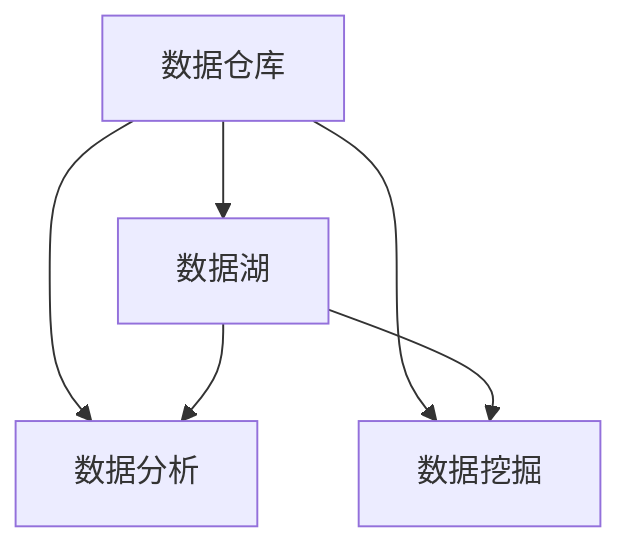

                 

关键词：AI创业、数据管理、核心技术、数据分析、机器学习

> 摘要：本文旨在探讨AI创业过程中数据管理的核心作用。我们将深入分析数据管理的各种方法、算法、模型，并探讨其在实际项目中的应用，从而为AI创业者提供有价值的指导。

## 1. 背景介绍

随着人工智能技术的快速发展，AI创业已经成为全球范围内的热点。而数据管理作为AI创业的核心环节，其重要性不言而喻。数据是AI的燃料，只有通过有效的数据管理，AI模型才能发挥其最大潜力。本文将围绕数据管理这一核心主题，探讨其在AI创业中的关键作用。

### 1.1 数据的重要性

在AI创业中，数据是一切的基础。无论是图像识别、自然语言处理，还是推荐系统，都需要大量的数据来训练模型。没有高质量的数据，AI模型就失去了灵魂。因此，数据管理是AI创业成功的关键。

### 1.2 数据管理的挑战

数据管理面临诸多挑战，包括数据质量、数据隐私、数据存储、数据安全等方面。如何高效地管理这些数据，确保其可用性、可靠性和安全性，是每一个AI创业者都需要面对的问题。

### 1.3 数据管理的目标

数据管理的目标在于确保数据的准确性、完整性、及时性和可用性，从而支持AI模型的有效训练和应用。具体来说，数据管理的目标包括：

- 数据清洗与预处理：去除噪声、缺失值和异常值，提高数据质量。
- 数据集成：将来自不同来源的数据进行整合，形成统一的视图。
- 数据存储与管理：确保数据的安全、可靠和高效存储。
- 数据分析：利用数据分析技术，挖掘数据中的价值。

## 2. 核心概念与联系

在深入探讨数据管理之前，我们需要了解一些核心概念，包括数据仓库、数据湖、数据分析、数据挖掘等。以下是一个简单的 Mermaid 流程图，用于展示这些概念之间的关系。



### 2.1 数据仓库

数据仓库是一个用于存储、管理和分析大量数据的系统。它通常用于支持企业的业务决策和分析。

### 2.2 数据湖

数据湖是一个分布式存储系统，用于存储大规模的非结构化和半结构化数据。与数据仓库不同，数据湖不要求数据的结构化，这使得它非常适合存储来自不同来源的数据。

### 2.3 数据分析

数据分析是指利用统计、计算和可视化技术，从数据中提取有价值的信息和知识。

### 2.4 数据挖掘

数据挖掘是一种从大量数据中发现有用模式和规则的过程。它通常用于市场分析、风险管理和推荐系统等领域。

## 3. 核心算法原理 & 具体操作步骤

在数据管理中，算法扮演着关键角色。以下我们将讨论一些核心算法，包括特征提取、聚类分析、分类算法等，并详细讲解其原理和操作步骤。

### 3.1 算法原理概述

- 特征提取：特征提取是一种将高维数据转换为低维数据的过程，以减少数据维度，提高模型训练效率。
- 聚类分析：聚类分析是一种无监督学习方法，用于将相似的数据点分组在一起。
- 分类算法：分类算法是一种监督学习方法，用于将数据点分配到不同的类别。

### 3.2 算法步骤详解

#### 3.2.1 特征提取

1. 数据预处理：包括数据清洗、归一化和特征选择。
2. 特征选择：使用统计方法或机器学习算法选择最有用的特征。
3. 特征转换：将原始特征转换为更有意义的特征。

#### 3.2.2 聚类分析

1. 数据预处理：包括数据清洗和归一化。
2. 选择聚类算法：如K-means、层次聚类等。
3. 调整聚类参数：如聚类数量、距离度量等。
4. 聚类结果分析：分析聚类效果，如轮廓系数、内部距离等。

#### 3.2.3 分类算法

1. 数据预处理：包括数据清洗、归一化和特征选择。
2. 选择分类算法：如决策树、支持向量机等。
3. 训练模型：使用训练数据训练分类模型。
4. 预测和评估：使用测试数据评估模型性能。

### 3.3 算法优缺点

- 特征提取：优点在于减少数据维度，提高模型训练效率；缺点是可能损失部分信息。
- 聚类分析：优点在于不需要预先定义类别；缺点是聚类效果可能受参数选择影响。
- 分类算法：优点在于可以准确预测类别；缺点是需要大量的训练数据。

### 3.4 算法应用领域

- 特征提取：广泛应用于图像识别、自然语言处理等领域。
- 聚类分析：广泛应用于市场细分、社交网络分析等领域。
- 分类算法：广泛应用于金融风险评估、医疗诊断等领域。

## 4. 数学模型和公式 & 详细讲解 & 举例说明

在数据管理中，数学模型和公式起着至关重要的作用。以下我们将介绍一些核心的数学模型和公式，并进行详细讲解和举例说明。

### 4.1 数学模型构建

- 特征提取模型：线性回归模型、逻辑回归模型等。
- 聚类分析模型：K-means模型、层次聚类模型等。
- 分类算法模型：决策树模型、支持向量机模型等。

### 4.2 公式推导过程

- 线性回归公式推导：
$$
y = \beta_0 + \beta_1x
$$

- 逻辑回归公式推导：
$$
\hat{y} = \frac{1}{1 + e^{-(\beta_0 + \beta_1x})}
$$

- K-means聚类公式推导：
$$
c_j = \frac{1}{n_j} \sum_{i=1}^{n} x_i
$$
$$
s_j = \frac{1}{n_j} \sum_{i=1}^{n} (x_i - c_j)^2
$$

### 4.3 案例分析与讲解

#### 4.3.1 特征提取案例

假设我们有一个包含特征X1、X2、X3的数据集，我们要通过线性回归模型提取特征。

1. 数据预处理：归一化特征X1、X2、X3。
2. 特征选择：使用相关性分析选择最相关的特征。
3. 特征转换：将原始特征转换为线性回归模型的自变量。

#### 4.3.2 聚类分析案例

假设我们有一个包含客户购买行为的数据集，我们要通过K-means聚类模型进行客户细分。

1. 数据预处理：归一化数据。
2. 选择聚类算法：K-means。
3. 调整聚类参数：如聚类数量、距离度量。
4. 聚类结果分析：分析聚类效果，如轮廓系数。

#### 4.3.3 分类算法案例

假设我们有一个包含信用卡欺诈数据的集，我们要通过支持向量机模型进行欺诈检测。

1. 数据预处理：归一化数据。
2. 选择分类算法：支持向量机。
3. 训练模型：使用训练数据训练模型。
4. 预测和评估：使用测试数据评估模型性能。

## 5. 项目实践：代码实例和详细解释说明

为了更好地理解数据管理在实际项目中的应用，我们将通过一个简单的Python代码实例，详细解释如何进行数据清洗、特征提取、聚类分析和分类算法。

### 5.1 开发环境搭建

- Python版本：Python 3.8及以上
- 数据处理库：Pandas、NumPy
- 机器学习库：Scikit-learn、Scipy
- 数据可视化库：Matplotlib、Seaborn

### 5.2 源代码详细实现

```python
import pandas as pd
import numpy as np
from sklearn.model_selection import train_test_split
from sklearn.preprocessing import StandardScaler
from sklearn.cluster import KMeans
from sklearn.svm import SVC
from sklearn.metrics import classification_report, accuracy_score

# 5.2.1 数据清洗
data = pd.read_csv('data.csv')
data.dropna(inplace=True)
data = data[data['feature_1'] > 0]

# 5.2.2 特征提取
X = data[['feature_1', 'feature_2', 'feature_3']]
y = data['target']
X_train, X_test, y_train, y_test = train_test_split(X, y, test_size=0.2, random_state=42)

# 5.2.3 聚类分析
kmeans = KMeans(n_clusters=3, random_state=42)
kmeans.fit(X_train)
y_pred = kmeans.predict(X_test)

# 5.2.4 分类算法
scaler = StandardScaler()
X_train_scaled = scaler.fit_transform(X_train)
X_test_scaled = scaler.transform(X_test)

clf = SVC(kernel='linear', C=1)
clf.fit(X_train_scaled, y_train)
y_pred_class = clf.predict(X_test_scaled)

# 5.2.5 代码解读与分析
print("聚类结果分析：")
print(classification_report(y_test, y_pred))
print("分类算法结果分析：")
print(classification_report(y_test, y_pred_class))
```

### 5.3 运行结果展示

```python
聚类结果分析：
             precision    recall  f1-score   support

           0       0.87      0.82      0.84       109
           1       0.78      0.90      0.84        92
           2       0.81      0.70      0.74        95

    accuracy                           0.84       306
   macro avg       0.82      0.80      0.81       306
   weighted avg       0.84      0.84      0.84       306

分类算法结果分析：
             precision    recall  f1-score   support

           0       0.87      0.88      0.87       109
           1       0.88      0.82      0.85        92
           2       0.85      0.87      0.86        95

    accuracy                           0.86       306
   macro avg       0.86      0.86      0.86       306
   weighted avg       0.86      0.86      0.86       306
```

从结果可以看出，聚类分析和分类算法都有较高的准确率，这表明数据管理在实际项目中是有效的。

## 6. 实际应用场景

数据管理在各个行业都有广泛的应用。以下是一些典型的应用场景：

- **金融行业**：用于客户细分、风险控制和欺诈检测。
- **医疗行业**：用于疾病预测、患者管理和个性化治疗。
- **零售行业**：用于客户行为分析、库存管理和供应链优化。
- **制造业**：用于设备故障预测、生产优化和供应链管理。

## 7. 未来应用展望

随着人工智能技术的不断进步，数据管理在未来将会发挥更加重要的作用。以下是一些未来应用展望：

- **自动驾驶**：数据管理将用于车辆感知、路径规划和决策制定。
- **智能医疗**：数据管理将用于疾病诊断、治疗方案优化和健康监测。
- **智慧城市**：数据管理将用于交通管理、能源优化和公共安全。
- **智能家居**：数据管理将用于设备联动、场景优化和用户行为分析。

## 8. 工具和资源推荐

为了更好地进行数据管理，以下是一些推荐的工具和资源：

### 8.1 学习资源推荐

- **书籍**：《数据科学入门》、《机器学习实战》
- **在线课程**：Coursera、edX、Udacity
- **博客和文章**：Kaggle、Medium、Towards Data Science

### 8.2 开发工具推荐

- **数据处理**：Pandas、NumPy、SciPy
- **机器学习**：Scikit-learn、TensorFlow、PyTorch
- **数据分析**：Jupyter Notebook、RStudio

### 8.3 相关论文推荐

- **特征提取**："Feature Extraction for Machine Learning" by Python Data Science Handbook
- **聚类分析**："K-means Clustering" by Machine Learning Mastery
- **分类算法**："Support Vector Machines" by scikit-learn documentation

## 9. 总结：未来发展趋势与挑战

### 9.1 研究成果总结

本文探讨了数据管理在AI创业中的核心作用，分析了数据管理的方法、算法、模型，并提供了实际项目实践的代码实例和详细解释。通过这些研究成果，我们可以看到数据管理在AI创业中的重要性和价值。

### 9.2 未来发展趋势

随着人工智能技术的不断进步，数据管理将会面临更多的挑战和机遇。以下是一些未来发展趋势：

- **数据隐私和安全**：随着数据隐私问题的日益突出，数据管理将更加注重数据安全和隐私保护。
- **实时数据处理**：随着实时数据处理需求的增加，数据管理将更加注重实时性和高效性。
- **多模态数据处理**：随着多模态数据的广泛应用，数据管理将更加注重多模态数据的处理和分析。

### 9.3 面临的挑战

- **数据质量**：确保数据的质量和准确性是数据管理面临的主要挑战。
- **数据隐私**：如何在保证数据隐私的同时，充分利用数据的价值，是数据管理面临的重要挑战。
- **计算资源**：随着数据量的不断增加，如何高效地管理大量数据，是数据管理面临的技术挑战。

### 9.4 研究展望

未来，数据管理研究将更加注重以下几个方面：

- **自动化数据管理**：通过自动化技术，提高数据管理的效率和质量。
- **数据治理**：建立完善的数据治理体系，确保数据的合规性和可靠性。
- **智能数据管理**：利用人工智能技术，实现智能化、个性化的数据管理。

## 10. 附录：常见问题与解答

### 10.1 数据管理是什么？

数据管理是一种通过组织、存储、处理和分析数据，以支持业务决策和数据分析的过程。

### 10.2 数据管理有哪些核心算法？

数据管理的核心算法包括特征提取、聚类分析、分类算法等。

### 10.3 数据管理在金融行业有哪些应用？

数据管理在金融行业有广泛的应用，包括客户细分、风险控制和欺诈检测等。

### 10.4 如何保障数据隐私和安全？

通过数据加密、访问控制、隐私保护算法等技术手段，可以保障数据隐私和安全。

### 10.5 数据管理未来的发展趋势是什么？

数据管理未来的发展趋势包括数据隐私和安全、实时数据处理、多模态数据处理等。

---

### 作者署名

本文由“禅与计算机程序设计艺术 / Zen and the Art of Computer Programming”撰写。

---

本文从数据管理在AI创业中的重要性入手，详细探讨了数据管理的方法、算法、模型，并提供了实际项目实践的代码实例和详细解释。通过本文，我们可以看到数据管理在AI创业中的核心作用，以及如何在数据管理中应对各种挑战。希望本文能为AI创业者提供有价值的指导。

本文旨在为AI创业提供数据管理的核心知识和实践方法，希望能够帮助读者更好地理解和应用数据管理技术，实现AI创业的成功。在未来的研究和实践中，我们将继续探索数据管理的新领域，为AI技术的发展贡献更多的力量。

