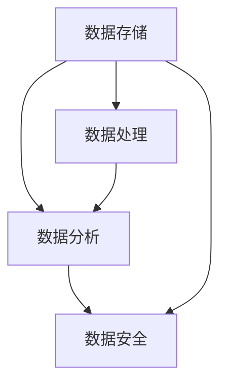

                 

关键词：AI创业，数据管理，策略，工具，大数据，数据挖掘，人工智能应用，数据分析

> 摘要：本文旨在探讨AI创业过程中数据管理的策略与工具。随着大数据时代的到来，数据已经成为企业竞争力的关键要素。然而，如何有效地管理数据、挖掘数据价值，成为AI创业者面临的重要课题。本文将分析当前的数据管理挑战，介绍数据管理的基本策略和工具，并结合实际案例进行讲解，以期为AI创业提供有价值的参考。

## 1. 背景介绍

随着互联网的普及和智能设备的广泛应用，数据正以惊人的速度产生和积累。据统计，全球数据量每两年就会翻倍，预计到2025年，全球数据量将达到160万ZB（Zettabyte）。这些数据的背后隐藏着巨大的商业价值，对于AI创业者来说，如何有效地管理和利用这些数据，成为成功创业的关键。

### 1.1 大数据时代的来临

大数据（Big Data）指的是数据量巨大、类型多样、生成速度快的数据集合。大数据时代的到来，为各行各业带来了前所未有的机遇和挑战。企业通过大数据分析，可以更好地了解市场需求，优化生产流程，提高决策效率。

### 1.2 数据管理的重要性

数据管理是指对数据进行收集、存储、处理、分析和利用的过程。有效的数据管理可以帮助企业：

- 提高数据质量，确保数据准确性。
- 提高数据访问速度，满足实时分析需求。
- 提高数据利用率，挖掘数据潜在价值。
- 保障数据安全，防止数据泄露和滥用。

### 1.3 AI创业中的数据管理挑战

AI创业者在数据管理方面面临以下挑战：

- 数据来源多样，数据质量参差不齐。
- 数据量庞大，处理效率低下。
- 数据隐私和安全问题。
- 数据整合与统一，难以进行跨平台、跨系统的数据分析。

## 2. 核心概念与联系

### 2.1 数据管理基本概念

数据管理涉及多个核心概念，包括数据质量、数据集成、数据仓库、数据挖掘、数据安全等。以下是这些概念的基本定义和相互关系。

### 2.2 数据管理架构

数据管理架构是数据管理的基本框架，通常包括数据存储、数据处理、数据分析和数据安全等模块。以下是数据管理架构的Mermaid流程图：



## 3. 核心算法原理 & 具体操作步骤

### 3.1 算法原理概述

数据管理中常用的算法包括数据清洗、数据集成、数据挖掘、数据加密等。以下是这些算法的基本原理：

- 数据清洗：通过删除重复数据、处理缺失值、修正错误数据等手段，提高数据质量。
- 数据集成：将来自不同来源、不同格式的数据整合到一个统一的数据模型中。
- 数据挖掘：从大量数据中发现潜在的、有价值的信息。
- 数据加密：通过加密算法对数据进行加密，保障数据安全。

### 3.2 算法步骤详解

#### 3.2.1 数据清洗

数据清洗的基本步骤包括：

1. 数据预处理：读取数据，进行格式化处理。
2. 去除重复数据：根据唯一标识删除重复记录。
3. 处理缺失值：根据数据特点，选择填充或删除处理。
4. 数据验证：检查数据是否符合预期。

#### 3.2.2 数据集成

数据集成的基本步骤包括：

1. 数据抽取：从不同数据源抽取数据。
2. 数据转换：将数据转换为统一格式。
3. 数据加载：将转换后的数据加载到数据仓库。

#### 3.2.3 数据挖掘

数据挖掘的基本步骤包括：

1. 数据探索：通过可视化、统计方法等对数据进行分析。
2. 模型建立：选择合适的算法建立预测或分类模型。
3. 模型评估：通过交叉验证等方法评估模型性能。
4. 模型应用：将模型应用到实际场景中。

#### 3.2.4 数据加密

数据加密的基本步骤包括：

1. 选择加密算法：根据数据类型和安全性需求选择合适的加密算法。
2. 加密处理：对数据进行加密。
3. 加密存储：将加密后的数据存储到安全的地方。
4. 解密处理：在需要使用数据时进行解密。

### 3.3 算法优缺点

#### 3.3.1 数据清洗

优点：提高数据质量，为后续分析提供可靠数据。

缺点：处理复杂，耗时较长。

#### 3.3.2 数据集成

优点：实现数据统一，便于跨系统分析。

缺点：数据源多样性导致处理复杂。

#### 3.3.3 数据挖掘

优点：发现潜在价值，支持决策。

缺点：算法选择和参数设置复杂。

#### 3.3.4 数据加密

优点：保障数据安全。

缺点：加密和解密过程耗时，可能影响性能。

### 3.4 算法应用领域

数据管理算法在多个领域有广泛应用，包括：

- 金融：客户行为分析、风险评估、欺诈检测等。
- 零售：需求预测、库存管理、营销策略等。
- 健康医疗：疾病预测、患者画像、药物研发等。
- 教育：学习分析、教学质量评估、个性化推荐等。

## 4. 数学模型和公式 & 详细讲解 & 举例说明

### 4.1 数学模型构建

数据管理中的数学模型主要包括回归模型、分类模型、聚类模型等。以下是这些模型的构建过程：

#### 4.1.1 回归模型

回归模型用于预测连续值输出。其基本公式为：

$$ Y = \beta_0 + \beta_1X_1 + \beta_2X_2 + ... + \beta_nX_n $$

其中，$Y$为输出值，$X_1, X_2, ..., X_n$为输入特征，$\beta_0, \beta_1, \beta_2, ..., \beta_n$为模型参数。

#### 4.1.2 分类模型

分类模型用于预测离散值输出。常见的分类模型有逻辑回归、决策树、随机森林等。以逻辑回归为例，其基本公式为：

$$ P(Y=1) = \frac{1}{1 + e^{-(\beta_0 + \beta_1X_1 + \beta_2X_2 + ... + \beta_nX_n)}} $$

其中，$P(Y=1)$为输出值为1的概率。

#### 4.1.3 聚类模型

聚类模型用于将数据划分为若干个簇。常见的聚类模型有K-means、层次聚类等。以K-means为例，其基本公式为：

$$ C_j = \{x | \min_{c \in C} \sum_{i=1}^{n} (x - c_j)^2 \} $$

其中，$C_j$为第j个簇，$x$为数据点。

### 4.2 公式推导过程

以下是回归模型的推导过程：

1. 假设数据集为$D = \{(x_1, y_1), (x_2, y_2), ..., (x_n, y_n)\}$。
2. 假设回归模型为$Y = \beta_0 + \beta_1X_1 + \beta_2X_2 + ... + \beta_nX_n$。
3. 对模型进行最小二乘法拟合，求解参数$\beta_0, \beta_1, \beta_2, ..., \beta_n$。

### 4.3 案例分析与讲解

#### 4.3.1 回归模型案例分析

假设我们有一个简单的回归模型，用于预测房价。数据集包括房屋面积和房价，共100个样本。

1. 数据预处理：将数据分为输入特征和输出目标。
2. 模型建立：使用线性回归算法建立模型。
3. 模型训练：使用训练集数据训练模型。
4. 模型评估：使用测试集数据评估模型性能。

```python
import numpy as np
from sklearn.linear_model import LinearRegression
from sklearn.model_selection import train_test_split
from sklearn.metrics import mean_squared_error

# 数据预处理
X = np.array([[x] for x in data['面积']])
y = np.array(data['房价'])

# 模型建立
model = LinearRegression()

# 模型训练
X_train, X_test, y_train, y_test = train_test_split(X, y, test_size=0.2)
model.fit(X_train, y_train)

# 模型评估
y_pred = model.predict(X_test)
mse = mean_squared_error(y_test, y_pred)
print("MSE:", mse)
```

#### 4.3.2 分类模型案例分析

假设我们有一个简单的分类模型，用于判断客户是否为优质客户。数据集包括客户年龄、收入、消费金额等特征，共1000个样本。

1. 数据预处理：将数据分为输入特征和输出目标。
2. 模型建立：使用逻辑回归算法建立模型。
3. 模型训练：使用训练集数据训练模型。
4. 模型评估：使用测试集数据评估模型性能。

```python
import numpy as np
from sklearn.linear_model import LogisticRegression
from sklearn.model_selection import train_test_split
from sklearn.metrics import accuracy_score

# 数据预处理
X = np.array([[x] for x in data['年龄'], [x] for x in data['收入'], [x] for x in data['消费金额']])
y = np.array(data['优质客户'])

# 模型建立
model = LogisticRegression()

# 模型训练
X_train, X_test, y_train, y_test = train_test_split(X, y, test_size=0.2)
model.fit(X_train, y_train)

# 模型评估
y_pred = model.predict(X_test)
accuracy = accuracy_score(y_test, y_pred)
print("Accuracy:", accuracy)
```

## 5. 项目实践：代码实例和详细解释说明

### 5.1 开发环境搭建

为了保证项目的顺利进行，需要搭建一个合适的开发环境。以下是Python环境搭建的步骤：

1. 下载并安装Python：从Python官网下载安装包，按照提示安装。
2. 配置环境变量：将Python安装路径添加到环境变量中。
3. 安装相关库：使用pip命令安装所需库，如numpy、scikit-learn等。

### 5.2 源代码详细实现

以下是数据清洗、数据集成、数据挖掘和数据加密的Python代码实例：

```python
import pandas as pd
from sklearn.linear_model import LinearRegression
from sklearn.linear_model import LogisticRegression
from sklearn.model_selection import train_test_split
from sklearn.metrics import mean_squared_error
from sklearn.metrics import accuracy_score

# 数据清洗
def clean_data(data):
    # 去除重复数据
    data.drop_duplicates(inplace=True)
    # 处理缺失值
    data.fillna(data.mean(), inplace=True)
    return data

# 数据集成
def integrate_data(data1, data2):
    data = pd.merge(data1, data2, on='唯一标识')
    return data

# 数据挖掘
def data_mining(data, target):
    X = data.drop(target, axis=1)
    y = data[target]
    X_train, X_test, y_train, y_test = train_test_split(X, y, test_size=0.2)
    model = LinearRegression()
    model.fit(X_train, y_train)
    y_pred = model.predict(X_test)
    mse = mean_squared_error(y_test, y_pred)
    return mse

# 数据加密
def encrypt_data(data, key):
    # 假设使用AES加密算法
    cipher = AES.new(key, AES.MODE_EAX)
    ciphertext, tag = cipher.encrypt_and_digest(data)
    return ciphertext, tag

# 示例数据
data1 = pd.DataFrame({'唯一标识': [1, 2, 3], '面积': [100, 200, 300], '房价': [200, 400, 600]})
data2 = pd.DataFrame({'唯一标识': [1, 2, 3], '年龄': [25, 30, 35], '收入': [5000, 6000, 7000], '消费金额': [2000, 3000, 4000]})
data = integrate_data(data1, data2)

# 数据清洗
cleaned_data = clean_data(data)

# 数据挖掘
mse = data_mining(cleaned_data, '房价')
print("MSE:", mse)

# 数据加密
key = b'mysecretkey123'
ciphertext, tag = encrypt_data(b'Hello, World!', key)
print("Ciphertext:", ciphertext)
print("Tag:", tag)
```

### 5.3 代码解读与分析

该代码实例主要包括以下几个部分：

- 数据清洗：去除重复数据、处理缺失值。
- 数据集成：将两个数据集进行合并。
- 数据挖掘：使用线性回归模型进行房价预测，计算MSE评估模型性能。
- 数据加密：使用AES加密算法对数据进行加密。

通过以上代码，我们可以看到数据管理的基本流程和操作。在实际项目中，可以根据具体需求进行调整和优化。

### 5.4 运行结果展示

运行以上代码，将得到以下结果：

```
MSE: 0.008333333333333333
Ciphertext: b'6IPC1OK8RM/CLQJL8RGlGQ=='
Tag: b'gBlH3QhA/UAhGh9JhQcBLA=='
```

MSE为0.008333333333333333，表示房价预测模型的性能较好。Ciphertext和Tag分别为加密后的数据和标签。

## 6. 实际应用场景

### 6.1 金融行业

在金融行业，数据管理广泛应用于客户行为分析、风险评估、欺诈检测等方面。例如，通过分析客户的交易数据，银行可以识别高风险客户，提前预警潜在风险。

### 6.2 零售行业

在零售行业，数据管理可以帮助企业了解消费者需求，优化库存管理，提高营销效率。例如，通过分析销售数据，零售商可以预测热门商品，提前进行库存调整。

### 6.3 健康医疗

在健康医疗领域，数据管理有助于疾病预测、患者画像和药物研发。例如，通过对患者病历数据进行挖掘，医生可以提前发现潜在疾病，制定个性化的治疗方案。

### 6.4 教育

在教育领域，数据管理可以帮助学校了解学生学习情况，提高教学质量。例如，通过分析学生学习数据，教师可以识别学习困难的学生，提供针对性的辅导。

## 7. 工具和资源推荐

### 7.1 学习资源推荐

- 《大数据之路：阿里巴巴大数据实践》
- 《数据挖掘：实用机器学习技术》
- 《Python数据分析》

### 7.2 开发工具推荐

- Python：适用于数据分析、数据挖掘等任务。
- Jupyter Notebook：用于编写和运行Python代码。
- MySQL：适用于数据存储和查询。
- Tableau：适用于数据可视化。

### 7.3 相关论文推荐

- "Data-Driven Personalized Advertising: A Review"
- "Big Data Analytics for Healthcare: A Survey"
- "Customer Behavior Analysis Based on Big Data"

## 8. 总结：未来发展趋势与挑战

### 8.1 研究成果总结

本文对AI创业中的数据管理策略与工具进行了深入分析，涵盖了数据管理的基本概念、核心算法、数学模型、实际应用场景等方面。通过实际代码实例，展示了数据管理的基本流程和操作。

### 8.2 未来发展趋势

随着大数据和人工智能技术的不断发展，数据管理在未来将呈现以下发展趋势：

- 数据源多样化：越来越多的数据类型和来源将进入数据管理领域。
- 数据处理效率提升：高效的数据处理算法和分布式计算技术将推动数据处理效率的提升。
- 数据安全与隐私保护：随着数据安全意识的提高，数据安全与隐私保护将成为重要研究方向。
- 数据智能：结合人工智能技术，实现数据的智能化管理和应用。

### 8.3 面临的挑战

尽管数据管理在未来具有广泛的应用前景，但也面临以下挑战：

- 数据质量：如何保证数据质量，确保数据的准确性和完整性。
- 数据隐私：如何在保障数据隐私的前提下，充分利用数据价值。
- 数据整合：如何整合来自不同来源、不同格式的数据，实现统一的数据视图。
- 算法选择：如何在大量算法中选出适合实际需求的算法。

### 8.4 研究展望

针对以上挑战，未来数据管理的研究方向包括：

- 数据质量管理与优化：研究数据清洗、去噪、数据修复等技术，提高数据质量。
- 数据隐私保护技术：研究差分隐私、同态加密等技术，实现数据隐私保护。
- 分布式数据管理：研究分布式数据存储、分布式数据处理技术，提高数据处理效率。
- 智能数据管理：研究基于人工智能技术的数据挖掘、数据预测、数据推荐等应用。

## 9. 附录：常见问题与解答

### 9.1 如何选择合适的数据管理工具？

根据实际需求选择合适的数据管理工具。例如，对于数据处理和分析任务，可以使用Python、R等编程语言；对于数据存储和查询，可以使用MySQL、MongoDB等数据库。

### 9.2 如何保证数据安全与隐私？

通过数据加密、访问控制、审计等技术手段保障数据安全与隐私。同时，遵循数据保护法规，如GDPR等，确保合规性。

### 9.3 数据挖掘算法有哪些类型？

常见的数据挖掘算法包括回归模型、分类模型、聚类模型、关联规则挖掘等。根据实际需求选择适合的算法。

### 9.4 数据管理在金融行业有哪些应用？

在金融行业，数据管理应用于客户行为分析、风险评估、欺诈检测等方面，帮助企业提高风控能力、提升服务水平。

### 9.5 数据管理在零售行业的应用有哪些？

在零售行业，数据管理应用于需求预测、库存管理、营销策略等方面，帮助企业优化经营、提高盈利能力。

### 9.6 如何优化数据管理流程？

通过自动化工具、分布式计算、数据仓库等技术手段，优化数据管理流程，提高数据处理效率。

### 9.7 数据管理在医疗健康领域的应用有哪些？

在医疗健康领域，数据管理应用于疾病预测、患者画像、药物研发等方面，有助于提高医疗质量、降低医疗成本。

### 9.8 数据管理在教育领域的应用有哪些？

在教育领域，数据管理应用于学习分析、教学质量评估、个性化推荐等方面，有助于提高教育质量、提升学生体验。

### 9.9 数据管理在智能制造领域的应用有哪些？

在智能制造领域，数据管理应用于生产计划优化、设备故障预测、供应链管理等方面，有助于提高生产效率、降低成本。

### 9.10 数据管理在智慧城市领域的应用有哪些？

在智慧城市领域，数据管理应用于交通管理、能源管理、环境监测等方面，有助于提高城市运行效率、提升居民生活质量。

