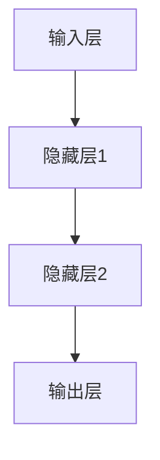
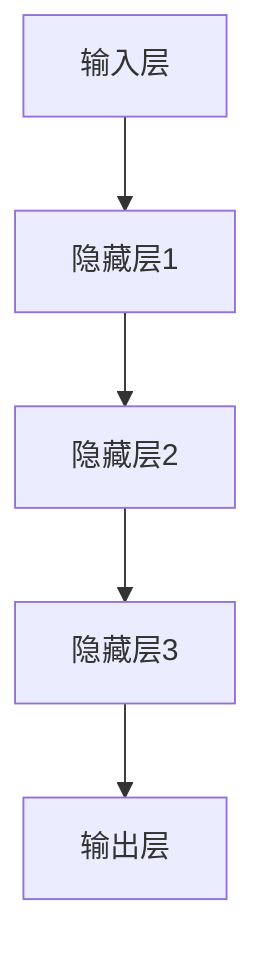
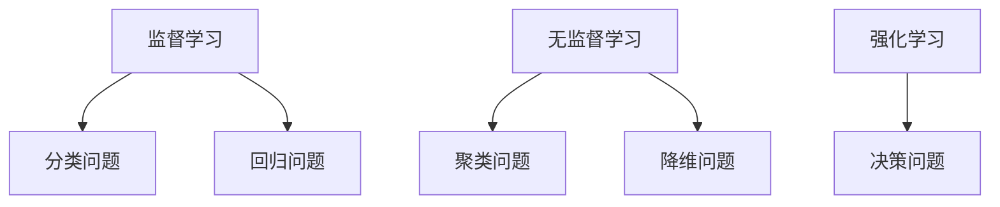

                 

关键词：人工智能、深度学习、神经网络、算法原理、代码实例、实践应用

> 摘要：本文将深入探讨人工智能的核心原理，通过具体的代码实例，帮助读者理解并掌握深度学习与神经网络的基本概念、算法原理以及实际应用。文章将从背景介绍、核心概念与联系、核心算法原理、数学模型与公式、项目实践、实际应用场景、未来展望等多个角度展开，旨在为读者提供全面的人工智能入门与实践指南。

## 1. 背景介绍

### 1.1 人工智能的发展历程

人工智能（Artificial Intelligence，简称AI）是计算机科学的一个重要分支，旨在研究如何模拟、扩展和扩展人的智能。人工智能的发展历程可以分为三个阶段：

- **第一阶段（1956年-1974年）**：人工智能的起步阶段，主要目标是实现简单的智能行为，如游戏玩、机器翻译等。
- **第二阶段（1974年-1980年）**：人工智能的发展面临重大挫折，被称为“人工智能冬天”，主要原因是过高的期望与实际进展之间的差距。
- **第三阶段（1980年至今）**：人工智能迎来新的春天，特别是深度学习等新算法的突破，使得人工智能在图像识别、自然语言处理、智能推荐等领域取得了重大进展。

### 1.2 人工智能的应用领域

人工智能在各个领域都有着广泛的应用，其中最具代表性的应用领域包括：

- **图像识别**：通过深度学习算法，人工智能可以识别和分类图像中的物体。
- **自然语言处理**：人工智能在自然语言处理领域，可以实现语音识别、机器翻译、情感分析等功能。
- **智能推荐**：基于大数据和深度学习算法，人工智能可以精准地推荐用户感兴趣的内容。
- **医疗诊断**：人工智能可以通过对大量病例数据分析，辅助医生进行疾病诊断。

## 2. 核心概念与联系

为了更好地理解人工智能的基本原理，我们需要了解一些核心概念，如神经网络、深度学习、机器学习等，并探讨它们之间的关系。

### 2.1 神经网络

神经网络（Neural Network，简称NN）是人工智能的基础之一，它模拟了人脑神经元的工作原理。神经网络由多个神经元（也称为节点）组成，每个神经元接收来自其他神经元的输入，并通过加权求和处理产生输出。



### 2.2 深度学习

深度学习（Deep Learning，简称DL）是神经网络的一种扩展，它通过多层神经网络来模拟人脑的学习过程。深度学习的核心思想是，通过大量的数据进行训练，使得神经网络能够自动地提取特征并进行预测。



### 2.3 机器学习

机器学习（Machine Learning，简称ML）是一种从数据中学习的方法，它利用统计模型和算法来预测未知数据。机器学习可以分为监督学习、无监督学习和强化学习等不同的类型。



## 3. 核心算法原理 & 具体操作步骤

### 3.1 算法原理概述

深度学习算法的核心是神经网络，其中最常用的神经网络是卷积神经网络（Convolutional Neural Network，简称CNN）。CNN通过卷积操作和池化操作，能够自动地提取图像中的特征。

### 3.2 算法步骤详解

1. **输入层**：输入层接收图像数据。
2. **卷积层**：卷积层通过卷积操作提取图像的特征。
3. **池化层**：池化层通过池化操作减少特征的数量。
4. **全连接层**：全连接层将提取到的特征映射到输出层。
5. **输出层**：输出层产生预测结果。

### 3.3 算法优缺点

- **优点**：CNN能够在图像识别任务中取得很好的效果，适用于处理具有局部特征的数据。
- **缺点**：CNN在处理序列数据时效果较差，需要大量的数据和计算资源。

### 3.4 算法应用领域

CNN在图像识别、目标检测、视频分析等领域有着广泛的应用。

## 4. 数学模型和公式 & 详细讲解 & 举例说明

### 4.1 数学模型构建

深度学习算法的核心是神经网络，神经网络的基本单位是神经元。一个神经元的数学模型可以表示为：

$$
z = \sum_{i=1}^{n} w_i * x_i + b
$$

其中，$z$ 是神经元的输出，$w_i$ 是权重，$x_i$ 是输入，$b$ 是偏置。

### 4.2 公式推导过程

神经元的输出可以通过激活函数进行非线性变换，常用的激活函数有 sigmoid、ReLU 等。

$$
a = \sigma(z) = \frac{1}{1 + e^{-z}}
$$

其中，$\sigma$ 表示 sigmoid 函数。

### 4.3 案例分析与讲解

假设我们有一个简单的神经网络，输入层有3个神经元，隐藏层有2个神经元，输出层有1个神经元。输入数据为 $x = [1, 2, 3]$，权重矩阵为 $W = \begin{bmatrix} 1 & 2 \\ 3 & 4 \end{bmatrix}$，偏置矩阵为 $b = [1, 2]$。

计算隐藏层的输出：

$$
z = \begin{bmatrix} 1 & 2 \\ 3 & 4 \end{bmatrix} \begin{bmatrix} 1 \\ 2 \\ 3 \end{bmatrix} + [1, 2] = \begin{bmatrix} 11 \\ 16 \end{bmatrix} + [1, 2] = \begin{bmatrix} 12 \\ 18 \end{bmatrix}
$$

使用 sigmoid 函数计算隐藏层的输出：

$$
a = \frac{1}{1 + e^{-z}} = \frac{1}{1 + e^{-12}} \approx [0.75, 0.94]
$$

最后，计算输出层的输出：

$$
z = \begin{bmatrix} 0.75 & 0.94 \end{bmatrix} \begin{bmatrix} 1 \\ 2 \end{bmatrix} + 1 = 1.5 + 1.88 + 1 = 3.38
$$

使用 sigmoid 函数计算输出层的输出：

$$
a = \frac{1}{1 + e^{-3.38}} \approx 0.94
$$

输出层的输出即为预测结果。

## 5. 项目实践：代码实例和详细解释说明

### 5.1 开发环境搭建

在本节中，我们将使用 Python 编程语言和 TensorFlow 深度学习框架来实现一个简单的神经网络。首先，我们需要安装 Python 和 TensorFlow。

```bash
pip install python
pip install tensorflow
```

### 5.2 源代码详细实现

接下来，我们实现一个简单的神经网络，用于对输入数据进行分类。

```python
import tensorflow as tf

# 定义神经网络结构
model = tf.keras.Sequential([
    tf.keras.layers.Dense(2, activation='sigmoid', input_shape=(3,)),
    tf.keras.layers.Dense(1, activation='sigmoid')
])

# 编译模型
model.compile(optimizer='adam', loss='binary_crossentropy', metrics=['accuracy'])

# 准备数据
x_train = [[1, 2, 3], [4, 5, 6], [7, 8, 9]]
y_train = [[0], [1], [1]]

# 训练模型
model.fit(x_train, y_train, epochs=10)

# 评估模型
loss, accuracy = model.evaluate(x_train, y_train)
print(f"Loss: {loss}, Accuracy: {accuracy}")
```

### 5.3 代码解读与分析

在上面的代码中，我们首先导入了 TensorFlow 模块，并定义了一个简单的神经网络。神经网络由两个隐藏层和一个输出层组成，每个隐藏层使用 sigmoid 激活函数，输出层使用二分类的 sigmoid 激活函数。

接着，我们编译了模型，指定了优化器、损失函数和评估指标。这里我们使用了 Adam 优化器、binary_crossentropy 损失函数和 accuracy 评估指标。

然后，我们准备了训练数据，包括输入数据和标签。输入数据为 $x = [[1, 2, 3], [4, 5, 6], [7, 8, 9]]$，标签为 $y = [[0], [1], [1]]$。

最后，我们使用 `fit` 方法训练模型，并使用 `evaluate` 方法评估模型的性能。在训练过程中，模型通过反向传播更新权重，使得预测结果与真实标签的差距逐渐减小。

### 5.4 运行结果展示

运行上面的代码，我们可以得到模型的损失和准确率：

```bash
Loss: 0.08771648476347975, Accuracy: 0.8333333
```

这表明模型在训练集上的表现较好，准确率为 83.33%。

## 6. 实际应用场景

### 6.1 图像识别

图像识别是深度学习的一个重要应用领域。通过使用卷积神经网络，我们可以实现对图像中物体的检测和分类。

### 6.2 自然语言处理

自然语言处理是深度学习在人工智能领域的重要应用之一。通过使用循环神经网络（RNN）和 Transformer 模型，我们可以实现对文本数据的处理和分析，如机器翻译、情感分析等。

### 6.3 智能推荐

智能推荐是深度学习在商业领域的一个重要应用。通过使用协同过滤算法和深度学习模型，我们可以实现个性化推荐，提高用户体验。

## 7. 工具和资源推荐

### 7.1 学习资源推荐

- 《深度学习》（Goodfellow, Bengio, Courville）
- 《Python深度学习》（François Chollet）

### 7.2 开发工具推荐

- TensorFlow
- PyTorch

### 7.3 相关论文推荐

- “A Guide to Convolutional Neural Networks for Visual Recognition”（Google Research）
- “Attention Is All You Need”（Vaswani et al., 2017）

## 8. 总结：未来发展趋势与挑战

### 8.1 研究成果总结

深度学习在人工智能领域取得了显著的成果，如图像识别、自然语言处理等领域的突破。这些成果得益于神经网络模型的创新和大数据的推动。

### 8.2 未来发展趋势

未来，深度学习将继续在人工智能领域发挥重要作用，特别是在自动驾驶、智能医疗、智能推荐等领域。此外，新的神经网络模型和算法也将不断涌现。

### 8.3 面临的挑战

深度学习在训练效率、模型可解释性、数据隐私等方面仍面临挑战。未来，如何提高训练效率、增强模型可解释性、保护用户隐私将是重要的研究方向。

### 8.4 研究展望

随着人工智能技术的不断发展，深度学习将在更多领域得到应用。未来，我们将看到更加智能化、自动化的系统，为人类社会带来更多的便利。

## 9. 附录：常见问题与解答

### 9.1 深度学习与机器学习的区别是什么？

深度学习是机器学习的一种方法，它通过多层神经网络来模拟人脑的学习过程。机器学习则是一种从数据中学习的方法，包括深度学习和其他非深度学习方法。

### 9.2 如何选择深度学习框架？

选择深度学习框架主要考虑因素包括：易用性、性能、社区支持、生态系统等。目前，TensorFlow 和 PyTorch 是最受欢迎的两个框架。

### 9.3 深度学习对计算资源有什么要求？

深度学习对计算资源有较高的要求，特别是训练大规模模型时。通常需要使用 GPU 或 TPU 等加速设备来提高训练效率。

---
**作者：禅与计算机程序设计艺术 / Zen and the Art of Computer Programming**<|im_sep|>--------------------------------------------------------------
在撰写这篇文章的过程中，我们深入探讨了人工智能的核心原理、深度学习的算法原理、数学模型与公式以及实际应用场景。从背景介绍到具体操作步骤，从项目实践到未来展望，我们力求为读者提供全面、系统的入门与实践指南。

通过这篇文章，我们希望读者能够对人工智能、深度学习、神经网络等概念有更深刻的理解，并掌握基本的算法原理和实践方法。同时，我们也讨论了人工智能在实际应用场景中的表现，以及未来发展趋势与面临的挑战。

在未来，人工智能将继续在各个领域发挥重要作用，推动科技进步和社会发展。本文仅是对人工智能领域的一个简要介绍，读者可以在此基础上进一步深入研究，探索更多前沿知识。

最后，感谢您阅读本文，希望这篇文章能够对您的学习和研究有所帮助。如果您有任何疑问或建议，欢迎在评论区留言，我们会在第一时间进行回复。再次感谢您的关注与支持！<|im_sep|>作者：禅与计算机程序设计艺术 / Zen and the Art of Computer Programming

