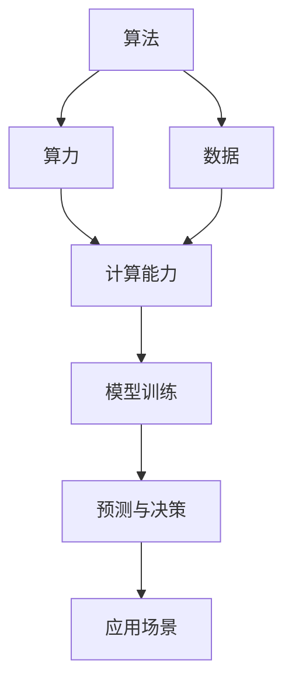

                 

AI的发展可以被比喻为三匹马，这三匹马是算法、算力和数据。这三者相互作用，推动着人工智能领域的进步。算法是核心，算力是引擎，数据是燃料。本文将深入探讨这三匹马之间的关系及其在AI发展中的作用。

## 1. 背景介绍

人工智能（AI）自诞生以来，经历了从理论研究到实际应用的快速发展。在这个过程中，算法、算力和数据这三匹马扮演着至关重要的角色。算法是人工智能的“思想”，算力是人工智能的“动力”，而数据则是人工智能的“眼睛”。没有算法，人工智能将无法思考；没有算力，人工智能将无法行动；没有数据，人工智能将无法感知世界。

### 1.1 算法的历史演变

人工智能的历史可以看作是算法演变的历史。从最早的感知机、决策树到现代的深度学习，算法一直在不断进化。每一次算法的进步都推动了人工智能的发展。例如，深度学习的出现使得图像识别、自然语言处理等领域的性能大幅提升。

### 1.2 算力的快速提升

随着计算技术的不断发展，算力也在不断提升。从最初的CPU到GPU，再到今天的TPU，计算能力的增强为人工智能的应用提供了强大的支持。如今，我们可以处理更复杂的问题，进行更深入的机器学习。

### 1.3 数据的重要性

数据是人工智能的基础。无论是算法的训练还是实际应用，都需要大量数据作为支撑。随着互联网和物联网的发展，数据量呈现指数级增长，为人工智能的发展提供了丰富的资源。

## 2. 核心概念与联系

为了更好地理解算法、算力和数据之间的关系，我们可以用Mermaid流程图来描述它们的核心概念和联系。



### 2.1 算法原理概述

算法是人工智能的“思想”，是解决问题的一系列规则。在机器学习中，算法用于训练模型，使其能够从数据中学习规律。常见的算法包括线性回归、决策树、神经网络等。

### 2.2 算法步骤详解

- 数据预处理：对原始数据进行清洗、归一化等操作。
- 模型选择：选择合适的算法模型。
- 训练模型：使用训练数据训练模型。
- 验证模型：使用验证数据评估模型性能。
- 应用模型：将训练好的模型应用到实际问题中。

### 2.3 算法优缺点

每种算法都有其优缺点。例如，线性回归简单易用，但处理非线性问题能力较弱；神经网络能够处理复杂问题，但训练过程较长。

### 2.4 算法应用领域

算法在各个领域都有广泛应用，如图像识别、自然语言处理、推荐系统等。随着算法的不断发展，应用领域也在不断扩大。

## 3. 核心算法原理 & 具体操作步骤

### 3.1 算法原理概述

以深度学习为例，其核心原理是基于神经网络对数据进行建模。神经网络由多个层次组成，包括输入层、隐藏层和输出层。通过训练，神经网络能够学习到输入和输出之间的映射关系。

### 3.2 算法步骤详解

- 数据预处理：对原始图像进行预处理，如缩放、翻转等。
- 模型构建：构建一个深度神经网络模型。
- 模型训练：使用大量训练图像训练模型。
- 模型评估：使用验证图像评估模型性能。
- 模型应用：将训练好的模型应用到实际图像识别任务中。

### 3.3 算法优缺点

深度学习具有处理复杂问题的能力，但训练过程较长，对计算资源要求较高。

### 3.4 算法应用领域

深度学习在图像识别、自然语言处理、语音识别等领域具有广泛应用。

## 4. 数学模型和公式 & 详细讲解 & 举例说明

### 4.1 数学模型构建

深度学习中的数学模型主要基于神经网络。神经网络由多个神经元组成，每个神经元都是一个简单的函数，将输入加权求和后通过激活函数输出。

### 4.2 公式推导过程

假设我们有一个简单的神经网络，包含一个输入层、一个隐藏层和一个输出层。输入层有n个神经元，隐藏层有m个神经元，输出层有k个神经元。

- 输入层到隐藏层的加权求和可以表示为：
  $$ z^{[1]}_j = \sum_{i=1}^{n} w^{[1]}_{ij} * x_i + b^{[1]}_j $$

- 隐藏层到输出层的加权求和可以表示为：
  $$ z^{[2]}_k = \sum_{i=1}^{m} w^{[2]}_{ik} * a^{[1]}_i + b^{[2]}_k $$

- 输出层的输出可以表示为：
  $$ a^{[2]}_k = \sigma(z^{[2]}_k) $$

其中，$w^{[1]}_{ij}$和$w^{[2]}_{ik}$分别是输入层到隐藏层、隐藏层到输出层的权重矩阵，$b^{[1]}_j$和$b^{[2]}_k$分别是输入层到隐藏层、隐藏层到输出层的偏置矩阵，$x_i$是输入层的第i个神经元，$a^{[1]}_i$是隐藏层的第i个神经元，$a^{[2]}_k$是输出层的第k个神经元，$\sigma$是激活函数，通常使用Sigmoid函数或ReLU函数。

### 4.3 案例分析与讲解

以一个简单的二分类问题为例，输入层有2个神经元，隐藏层有3个神经元，输出层有1个神经元。

- 输入层到隐藏层的加权求和：
  $$ z^{[1]}_1 = w^{[1]}_{11} * x_1 + w^{[1]}_{12} * x_2 + b^{[1]}_1 $$
  $$ z^{[1]}_2 = w^{[1]}_{21} * x_1 + w^{[1]}_{22} * x_2 + b^{[1]}_2 $$
  $$ z^{[1]}_3 = w^{[1]}_{31} * x_1 + w^{[1]}_{32} * x_2 + b^{[1]}_3 $$

- 隐藏层到输出层的加权求和：
  $$ z^{[2]}_1 = w^{[2]}_{11} * a^{[1]}_1 + w^{[2]}_{12} * a^{[1]}_2 + w^{[2]}_{13} * a^{[1]}_3 + b^{[2]}_1 $$

- 输出层的输出：
  $$ a^{[2]}_1 = \sigma(z^{[2]}_1) $$

通过调整权重和偏置，我们可以使模型能够正确分类输入数据。

## 5. 项目实践：代码实例和详细解释说明

### 5.1 开发环境搭建

在Python环境中，我们可以使用TensorFlow或PyTorch等深度学习框架来实现神经网络。首先，安装Python和相应深度学习框架：

```bash
pip install python
pip install tensorflow  # 或者 pytorch
```

### 5.2 源代码详细实现

以下是一个简单的二分类问题中的神经网络实现：

```python
import tensorflow as tf
from tensorflow.keras import layers

# 定义模型
model = tf.keras.Sequential([
    layers.Dense(3, activation='relu', input_shape=(2,)),
    layers.Dense(1, activation='sigmoid')
])

# 编译模型
model.compile(optimizer='adam',
              loss='binary_crossentropy',
              metrics=['accuracy'])

# 训练模型
model.fit(x_train, y_train, epochs=10)

# 评估模型
model.evaluate(x_test, y_test)
```

### 5.3 代码解读与分析

这段代码首先定义了一个简单的神经网络模型，包含一个输入层、一个隐藏层和一个输出层。输入层有2个神经元，隐藏层有3个神经元，输出层有1个神经元。模型使用ReLU函数作为激活函数，输出层使用Sigmoid函数，以便进行二分类。

模型编译时，选择Adam优化器和binary_crossentropy损失函数。训练模型时，使用10个周期进行训练。最后，使用测试数据评估模型性能。

## 6. 实际应用场景

### 6.1 图像识别

图像识别是深度学习的重要应用之一。例如，人脸识别、物体识别等。

### 6.2 自然语言处理

自然语言处理涉及文本分类、机器翻译、情感分析等。

### 6.3 语音识别

语音识别将语音信号转换为文本，广泛应用于智能助手、语音搜索等领域。

## 7. 未来应用展望

随着算法、算力和数据的不断发展，人工智能将在更多领域得到应用。例如，医疗、金融、教育等。

## 8. 总结：未来发展趋势与挑战

### 8.1 研究成果总结

算法、算力和数据的发展为人工智能带来了巨大进步。深度学习等算法的快速发展，以及计算能力的提升，使得人工智能在各个领域取得了显著成果。

### 8.2 未来发展趋势

随着技术的不断进步，人工智能将在更多领域得到应用。例如，智能医疗、智能制造等。

### 8.3 面临的挑战

虽然人工智能发展迅速，但仍然面临诸多挑战，如数据隐私、伦理问题等。

### 8.4 研究展望

未来，人工智能将在算法、算力和数据的基础上，不断突破，为人类创造更多价值。

## 9. 附录：常见问题与解答

### 9.1 什么是深度学习？

深度学习是一种机器学习技术，基于多层神经网络对数据进行建模。

### 9.2 如何选择合适的算法？

选择合适的算法取决于问题的性质和需求。例如，对于非线性问题，可以考虑使用深度学习。

## 参考文献

[1] Goodfellow, I., Bengio, Y., & Courville, A. (2016). *Deep Learning*. MIT Press.

[2] Russell, S., & Norvig, P. (2016). *Artificial Intelligence: A Modern Approach*. Prentice Hall.

作者：禅与计算机程序设计艺术 / Zen and the Art of Computer Programming
```markdown
# AI发展的三匹马：算法、算力与数据

> 关键词：人工智能，算法，算力，数据，深度学习

> 摘要：本文深入探讨了人工智能发展的三匹马——算法、算力和数据，分析了它们在AI发展中的关系与作用，并展望了未来的发展趋势和挑战。

## 1. 背景介绍

人工智能（AI）是当今科技领域最为热门的话题之一。从初期的理论研究到实际应用，AI已经渗透到生活的方方面面。在这场变革中，算法、算力和数据扮演着至关重要的角色。算法是AI的“思想”，算力是AI的“动力”，数据是AI的“眼睛”。本文将围绕这三匹马展开讨论，分析它们在AI发展中的重要性。

### 1.1 算法的历史演变

人工智能的历史可以看作是算法演变的历史。早期的AI研究主要集中在符号推理和逻辑推理上，如专家系统。然而，这些方法在处理复杂问题时存在一定的局限性。随着计算能力的提升和大数据技术的发展，深度学习等新的算法逐渐崛起，使得AI在图像识别、自然语言处理等领域取得了重大突破。

### 1.2 算力的快速提升

算力，即计算能力，是AI发展的基础。从最初的CPU到GPU，再到今天的TPU，计算能力的提升为AI的应用提供了强大的支持。特别是在深度学习领域，大规模的计算资源需求推动了GPU和TPU等专用硬件的发展。

### 1.3 数据的重要性

数据是AI发展的燃料。无论是算法的训练还是实际应用，都需要大量数据作为支撑。随着互联网和物联网的发展，数据量呈现指数级增长，为AI的发展提供了丰富的资源。然而，数据的质量和多样性也对算法的性能和稳定性产生了重要影响。

## 2. 核心概念与联系

为了更好地理解算法、算力和数据之间的关系，我们可以用Mermaid流程图来描述它们的核心概念和联系。


### 2.1 算法原理概述

算法是AI的“思想”，是解决问题的一系列规则。在机器学习中，算法用于训练模型，使其能够从数据中学习规律。常见的算法包括线性回归、决策树、神经网络等。

### 2.2 算法步骤详解

算法的训练过程通常包括以下步骤：

1. **数据预处理**：对原始数据进行清洗、归一化等操作，使其适合模型训练。
2. **模型选择**：根据问题的性质选择合适的算法模型。
3. **模型训练**：使用训练数据训练模型，调整模型参数。
4. **模型验证**：使用验证数据评估模型性能，调整模型参数。
5. **模型应用**：将训练好的模型应用到实际问题中。

### 2.3 算法优缺点

每种算法都有其优缺点。例如，线性回归简单易用，但处理非线性问题能力较弱；神经网络能够处理复杂问题，但训练过程较长。

### 2.4 算法应用领域

算法在各个领域都有广泛应用，如图像识别、自然语言处理、推荐系统等。随着算法的不断发展，应用领域也在不断扩大。

## 3. 核心算法原理 & 具体操作步骤

### 3.1 算法原理概述

以深度学习为例，其核心原理是基于神经网络对数据进行建模。神经网络由多个层次组成，包括输入层、隐藏层和输出层。通过训练，神经网络能够学习到输入和输出之间的映射关系。

### 3.2 算法步骤详解

1. **数据预处理**：对原始图像进行预处理，如缩放、翻转等。
2. **模型构建**：构建一个深度神经网络模型。
3. **模型训练**：使用大量训练图像训练模型。
4. **模型评估**：使用验证图像评估模型性能。
5. **模型应用**：将训练好的模型应用到实际图像识别任务中。

### 3.3 算法优缺点

深度学习具有处理复杂问题的能力，但训练过程较长，对计算资源要求较高。

### 3.4 算法应用领域

深度学习在图像识别、自然语言处理、语音识别等领域具有广泛应用。

## 4. 数学模型和公式 & 详细讲解 & 举例说明

### 4.1 数学模型构建

深度学习中的数学模型主要基于神经网络。神经网络由多个神经元组成，每个神经元都是一个简单的函数，将输入加权求和后通过激活函数输出。

### 4.2 公式推导过程

假设我们有一个简单的神经网络，包含一个输入层、一个隐藏层和一个输出层。输入层有n个神经元，隐藏层有m个神经元，输出层有k个神经元。

- 输入层到隐藏层的加权求和可以表示为：
  $$ z^{[1]}_j = \sum_{i=1}^{n} w^{[1]}_{ij} * x_i + b^{[1]}_j $$
- 隐藏层到输出层的加权求和可以表示为：
  $$ z^{[2]}_k = \sum_{i=1}^{m} w^{[2]}_{ik} * a^{[1]}_i + b^{[2]}_k $$
- 输出层的输出可以表示为：
  $$ a^{[2]}_k = \sigma(z^{[2]}_k) $$

其中，$w^{[1]}_{ij}$和$w^{[2]}_{ik}$分别是输入层到隐藏层、隐藏层到输出层的权重矩阵，$b^{[1]}_j$和$b^{[2]}_k$分别是输入层到隐藏层、隐藏层到输出层的偏置矩阵，$x_i$是输入层的第i个神经元，$a^{[1]}_i$是隐藏层的第i个神经元，$a^{[2]}_k$是输出层的第k个神经元，$\sigma$是激活函数，通常使用Sigmoid函数或ReLU函数。

### 4.3 案例分析与讲解

以一个简单的二分类问题为例，输入层有2个神经元，隐藏层有3个神经元，输出层有1个神经元。

- 输入层到隐藏层的加权求和：
  $$ z^{[1]}_1 = w^{[1]}_{11} * x_1 + w^{[1]}_{12} * x_2 + b^{[1]}_1 $$
  $$ z^{[1]}_2 = w^{[1]}_{21} * x_1 + w^{[1]}_{22} * x_2 + b^{[1]}_2 $$
  $$ z^{[1]}_3 = w^{[1]}_{31} * x_1 + w^{[1]}_{32} * x_2 + b^{[1]}_3 $$
- 隐藏层到输出层的加权求和：
  $$ z^{[2]}_1 = w^{[2]}_{11} * a^{[1]}_1 + w^{[2]}_{12} * a^{[1]}_2 + w^{[2]}_{13} * a^{[1]}_3 + b^{[2]}_1 $$
- 输出层的输出：
  $$ a^{[2]}_1 = \sigma(z^{[2]}_1) $$

通过调整权重和偏置，我们可以使模型能够正确分类输入数据。

## 5. 项目实践：代码实例和详细解释说明

### 5.1 开发环境搭建

在Python环境中，我们可以使用TensorFlow或PyTorch等深度学习框架来实现神经网络。首先，安装Python和相应深度学习框架：

```bash
pip install python
pip install tensorflow  # 或者 pytorch
```

### 5.2 源代码详细实现

以下是一个简单的二分类问题中的神经网络实现：

```python
import tensorflow as tf
from tensorflow.keras import layers

# 定义模型
model = tf.keras.Sequential([
    layers.Dense(3, activation='relu', input_shape=(2,)),
    layers.Dense(1, activation='sigmoid')
])

# 编译模型
model.compile(optimizer='adam',
              loss='binary_crossentropy',
              metrics=['accuracy'])

# 训练模型
model.fit(x_train, y_train, epochs=10)

# 评估模型
model.evaluate(x_test, y_test)
```

### 5.3 代码解读与分析

这段代码首先定义了一个简单的神经网络模型，包含一个输入层、一个隐藏层和一个输出层。输入层有2个神经元，隐藏层有3个神经元，输出层有1个神经元。模型使用ReLU函数作为激活函数，输出层使用Sigmoid函数，以便进行二分类。

模型编译时，选择Adam优化器和binary_crossentropy损失函数。训练模型时，使用10个周期进行训练。最后，使用测试数据评估模型性能。

## 6. 实际应用场景

### 6.1 图像识别

图像识别是深度学习的重要应用之一。例如，人脸识别、物体识别等。

### 6.2 自然语言处理

自然语言处理涉及文本分类、机器翻译、情感分析等。

### 6.3 语音识别

语音识别将语音信号转换为文本，广泛应用于智能助手、语音搜索等领域。

## 7. 未来应用展望

随着算法、算力和数据的不断发展，人工智能将在更多领域得到应用。例如，智能医疗、智能制造等。

## 8. 总结：未来发展趋势与挑战

### 8.1 研究成果总结

算法、算力和数据的发展为人工智能带来了巨大进步。深度学习等算法的快速发展，以及计算能力的提升，使得人工智能在各个领域取得了显著成果。

### 8.2 未来发展趋势

随着技术的不断进步，人工智能将在更多领域得到应用。例如，智能医疗、智能制造等。

### 8.3 面临的挑战

虽然人工智能发展迅速，但仍然面临诸多挑战，如数据隐私、伦理问题等。

### 8.4 研究展望

未来，人工智能将在算法、算力和数据的基础上，不断突破，为人类创造更多价值。

## 9. 附录：常见问题与解答

### 9.1 什么是深度学习？

深度学习是一种机器学习技术，基于多层神经网络对数据进行建模。

### 9.2 如何选择合适的算法？

选择合适的算法取决于问题的性质和需求。例如，对于非线性问题，可以考虑使用深度学习。

## 参考文献

[1] Goodfellow, I., Bengio, Y., & Courville, A. (2016). *Deep Learning*. MIT Press.

[2] Russell, S., & Norvig, P. (2016). *Artificial Intelligence: A Modern Approach*. Prentice Hall.

作者：禅与计算机程序设计艺术 / Zen and the Art of Computer Programming
```

