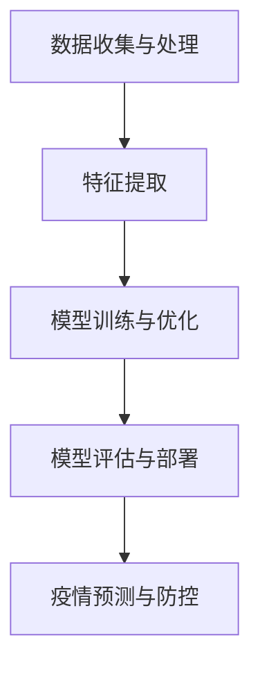

                 

关键词：人工智能、公共卫生、疫情预测、防控策略、数据分析、机器学习、深度学习、模型构建

## 摘要

本文探讨了人工智能在公共卫生领域，特别是在疫情预测与控制方面的应用。通过对现有技术和方法的深入分析，本文揭示了AI如何帮助公共卫生专家提高疫情预测的准确性，优化防控策略，从而降低疫情对社会和经济的冲击。文章还将讨论AI在公共卫生领域面临的挑战和未来发展方向，为相关研究和实践提供参考。

## 1. 背景介绍

随着全球化的加速，公共卫生领域面临着越来越多的挑战。近年来，新型传染病的爆发，如2019年的新冠病毒（COVID-19），不仅对全球经济和社会稳定造成重大影响，也对公共卫生体系带来了前所未有的考验。有效的疫情预测和防控策略成为公共卫生领域的核心问题。

传统的疫情预测方法主要依赖于统计学和流行病学模型，这些模型虽然在一定程度上能够提供预测结果，但往往存在以下问题：

1. **数据依赖性高**：传统的预测方法通常需要大量的历史数据，而新型传染病往往缺乏足够的历史数据。
2. **预测精度有限**：受限于模型的复杂度和计算能力，传统方法在预测准确性上存在局限。
3. **实时性不足**：传统方法通常无法实现实时数据更新和预测，难以及时响应疫情变化。

人工智能（AI）技术的兴起为公共卫生领域带来了新的希望。AI，特别是机器学习和深度学习，通过自动学习和分析大量数据，能够提供更精确、更实时的预测结果。此外，AI还能够处理复杂数据，包括非结构化数据和实时数据流，为疫情预测和防控提供了强有力的工具。

本文将深入探讨AI在公共卫生领域的应用，特别是在疫情预测与控制方面的实践。通过分析现有的AI技术和方法，我们将揭示其原理和具体操作步骤，并探讨其在公共卫生领域的实际应用和未来发展方向。

## 2. 核心概念与联系

### 2.1. 人工智能在公共卫生中的应用

人工智能在公共卫生中的应用主要体现在以下几个方面：

1. **疫情预测**：通过分析历史数据和实时数据，AI可以预测疫情的传播趋势，为政府和公共卫生机构提供决策支持。
2. **病例追踪**：AI技术可以帮助公共卫生机构实时追踪病例，识别高风险个体，从而采取针对性的防控措施。
3. **健康监测**：AI可以分析大量健康数据，如心率、血压等，监测个体的健康状况，及时发现潜在的健康风险。
4. **药物研发**：AI在药物研发中的应用已经取得显著成果，可以加速新药的研发进程，为疫情控制提供有效药物。

### 2.2. AI技术原理与架构

人工智能的核心技术主要包括机器学习和深度学习。机器学习是一种通过训练模型来预测或分类数据的技术，其基本原理是利用大量数据来调整模型的参数，使其能够识别数据的规律。深度学习则是机器学习的一种特殊形式，通过构建多层的神经网络模型来处理复杂的数据。

在公共卫生领域，AI技术的架构通常包括以下部分：

1. **数据收集与处理**：收集和整理与疫情相关的数据，包括病例数据、地理数据、经济数据等。
2. **特征提取**：从原始数据中提取关键特征，这些特征将用于训练模型。
3. **模型训练与优化**：使用机器学习或深度学习算法对特征数据进行训练，优化模型的参数。
4. **模型评估与部署**：评估模型的预测性能，并在实际应用中部署模型。

### 2.3. AI技术原理与联系

为了更好地理解AI在公共卫生中的应用，我们可以通过Mermaid流程图来展示其原理和架构：



在上述流程中，数据收集与处理是整个流程的基础，特征提取是关键步骤，模型训练与优化是核心，模型评估与部署则是将AI技术应用于实际问题的关键。最终，通过疫情预测与防控，AI技术为公共卫生提供了强有力的支持。

通过上述核心概念与联系的分析，我们可以看到，人工智能在公共卫生领域的应用不仅具备巨大的潜力，而且正在逐步改变传统的公共卫生实践方式。接下来，本文将深入探讨人工智能在疫情预测与控制方面的具体应用，分析其核心算法原理和具体操作步骤。

## 3. 核心算法原理 & 具体操作步骤

### 3.1. 算法原理概述

在疫情预测与控制中，常用的核心算法主要包括时间序列分析、机器学习算法和深度学习算法。这些算法通过不同的方式处理和预测疫情数据，从而提供有效的疫情预测和防控策略。

#### 时间序列分析

时间序列分析是一种统计方法，用于分析时间序列数据，预测未来趋势。在疫情预测中，时间序列分析可以通过以下步骤实现：

1. **数据收集**：收集与疫情相关的历史数据，如确诊病例数、病死率、住院率等。
2. **数据预处理**：对数据进行清洗、归一化等预处理，以消除噪声和异常值。
3. **模型选择**：选择适合的时间序列模型，如ARIMA、SARIMA等。
4. **模型训练与预测**：使用历史数据训练模型，并利用模型预测未来趋势。

#### 机器学习算法

机器学习算法在疫情预测中的应用主要包括回归分析和分类算法。常见的回归算法有线性回归、岭回归、LASSO回归等；分类算法有决策树、随机森林、支持向量机等。这些算法的基本步骤如下：

1. **数据收集**：收集与疫情相关的数据，包括人口统计数据、社会经济数据、卫生资源数据等。
2. **特征工程**：从原始数据中提取关键特征，如人口密度、交通便利性、医疗资源分布等。
3. **模型选择**：根据预测目标和数据特性选择合适的机器学习算法。
4. **模型训练与优化**：使用训练数据集训练模型，并通过交叉验证优化模型参数。
5. **模型评估与预测**：评估模型性能，并利用模型进行预测。

#### 深度学习算法

深度学习算法在疫情预测中具有强大的表达能力和自适应能力，常见的深度学习算法有卷积神经网络（CNN）、循环神经网络（RNN）、长短时记忆网络（LSTM）等。深度学习算法的基本步骤如下：

1. **数据收集**：收集与疫情相关的多模态数据，如图像、文本、时间序列数据等。
2. **特征提取**：使用深度学习模型自动提取数据中的高维特征。
3. **模型构建**：构建深度学习模型，如CNN、RNN、LSTM等。
4. **模型训练与优化**：使用训练数据集训练模型，并通过反向传播算法优化模型参数。
5. **模型评估与预测**：评估模型性能，并利用模型进行预测。

### 3.2. 算法步骤详解

#### 时间序列分析

时间序列分析的详细步骤如下：

1. **数据收集**：从公共卫生机构、政府部门等渠道收集疫情相关的数据，包括确诊病例数、病死率、隔离人数等。
2. **数据预处理**：对收集到的数据进行清洗、归一化等预处理，以消除噪声和异常值。
3. **模型选择**：选择适合的时间序列模型，如ARIMA、SARIMA等。ARIMA模型由自回归（AR）、差分（I）和移动平均（MA）三部分组成，能够处理非平稳时间序列数据。
4. **模型训练与预测**：使用历史数据训练ARIMA模型，并利用模型预测未来一段时间内的疫情趋势。

#### 机器学习算法

机器学习算法的详细步骤如下：

1. **数据收集**：收集与疫情相关的数据，包括人口统计数据、社会经济数据、卫生资源数据等。
2. **特征工程**：从原始数据中提取关键特征，如人口密度、交通便利性、医疗资源分布等。
3. **模型选择**：根据预测目标和数据特性选择合适的机器学习算法，如线性回归、岭回归、LASSO回归等。
4. **模型训练与优化**：使用训练数据集训练模型，并通过交叉验证优化模型参数。
5. **模型评估与预测**：评估模型性能，如R²、均方误差（MSE）等指标，并利用模型进行预测。

#### 深度学习算法

深度学习算法的详细步骤如下：

1. **数据收集**：收集与疫情相关的多模态数据，如图像、文本、时间序列数据等。
2. **特征提取**：使用深度学习模型自动提取数据中的高维特征。
3. **模型构建**：构建深度学习模型，如CNN、RNN、LSTM等。CNN适用于处理图像数据，RNN适用于处理序列数据，LSTM是RNN的改进版本，适用于处理较长的时间序列数据。
4. **模型训练与优化**：使用训练数据集训练模型，并通过反向传播算法优化模型参数。
5. **模型评估与预测**：评估模型性能，如准确率、召回率等指标，并利用模型进行预测。

### 3.3. 算法优缺点

#### 时间序列分析

**优点**：

- **适用性强**：能够处理非平稳时间序列数据，适用于各种类型的疫情数据。
- **计算效率高**：模型简单，计算效率高，适合实时预测。

**缺点**：

- **预测精度有限**：对于复杂、多变的疫情数据，预测精度可能较低。
- **灵活性不足**：模型参数固定，难以适应动态变化的疫情环境。

#### 机器学习算法

**优点**：

- **预测精度高**：通过特征工程和模型优化，能够提高预测精度。
- **灵活性较强**：可以根据具体问题和数据特性选择合适的算法。

**缺点**：

- **计算复杂度高**：对于大型数据集，训练时间较长，计算资源消耗较大。
- **数据依赖性强**：需要大量高质量的数据支持。

#### 深度学习算法

**优点**：

- **表达能力强**：能够处理高维、复杂数据，适用于多模态数据。
- **自适应能力**：通过不断学习和优化，能够适应动态变化的疫情环境。

**缺点**：

- **计算复杂度高**：需要大量的计算资源和时间。
- **模型解释性差**：深度学习模型内部参数复杂，难以解释。

### 3.4. 算法应用领域

#### 时间序列分析

时间序列分析在公共卫生领域的主要应用包括：

- **疫情预测**：预测未来一段时间内的疫情趋势，为公共卫生决策提供支持。
- **资源分配**：预测医疗资源的消耗，合理分配卫生资源。

#### 机器学习算法

机器学习算法在公共卫生领域的主要应用包括：

- **病例追踪**：实时追踪病例，识别高风险个体。
- **健康监测**：监测个体的健康状况，预测潜在的健康风险。

#### 深度学习算法

深度学习算法在公共卫生领域的主要应用包括：

- **药物研发**：加速新药的研发进程，为疫情控制提供有效药物。
- **公共卫生政策制定**：分析大量数据，为公共卫生政策提供支持。

综上所述，不同类型的算法在疫情预测与控制中各有优缺点，可以根据具体需求和数据特性选择合适的算法。在实际应用中，通常需要结合多种算法和技术，以提高预测的准确性和可靠性。

## 4. 数学模型和公式 & 详细讲解 & 举例说明

### 4.1. 数学模型构建

在疫情预测和控制中，常用的数学模型包括时间序列模型、机器学习模型和深度学习模型。这些模型通过不同的数学公式和算法实现，下面将详细介绍这些模型的构建过程。

#### 时间序列模型

时间序列模型中最常用的是ARIMA模型（自回归积分滑动平均模型）。其数学公式如下：

$$
\begin{align*}
y_t &= c + \phi_1 y_{t-1} + \phi_2 y_{t-2} + \cdots + \phi_p y_{t-p} \\
&+ \theta_1 e_{t-1} + \theta_2 e_{t-2} + \cdots + \theta_q e_{t-q} + e_t
\end{align*}
$$

其中，$y_t$ 是时间序列数据，$c$ 是常数项，$\phi_1, \phi_2, \cdots, \phi_p$ 是自回归系数，$\theta_1, \theta_2, \cdots, \theta_q$ 是滑动平均系数，$e_t$ 是白噪声误差项。模型的选择和参数估计通常通过AIC（赤池信息准则）或BIC（贝叶斯信息准则）进行。

#### 机器学习模型

机器学习模型中最常用的是线性回归模型。其数学公式如下：

$$
y = \beta_0 + \beta_1 x_1 + \beta_2 x_2 + \cdots + \beta_n x_n
$$

其中，$y$ 是预测值，$x_1, x_2, \cdots, x_n$ 是输入特征，$\beta_0, \beta_1, \beta_2, \cdots, \beta_n$ 是模型参数。线性回归模型的参数估计通常通过最小二乘法（Least Squares）进行。

#### 深度学习模型

深度学习模型中最常用的是卷积神经网络（CNN）。其数学公式如下：

$$
\begin{align*}
h_{l} &= \sigma_l (\mathbf{W}_l \mathbf{a}_{l-1} + \mathbf{b}_l) \\
\mathbf{a}_{l} &= \text{ReLU}(h_{l})
\end{align*}
$$

其中，$h_l$ 是激活函数前的输出，$\sigma_l$ 是激活函数，$\mathbf{W}_l$ 是权重矩阵，$\mathbf{b}_l$ 是偏置项，$\mathbf{a}_l$ 是激活函数后的输出。卷积神经网络通过多个卷积层和池化层构建，以提取图像的特征。

### 4.2. 公式推导过程

#### 时间序列模型推导

ARIMA模型的推导基于时间序列数据的自回归特性。假设时间序列数据$y_t$可以表示为前$n$期数据的线性组合，加上一个白噪声项：

$$
y_t = c + \sum_{i=1}^{p} \phi_i y_{t-i} + \sum_{j=1}^{q} \theta_j e_{t-j} + e_t
$$

通过差分操作，可以将非平稳序列转换为平稳序列。差分公式如下：

$$
\Delta y_t = y_t - y_{t-1}
$$

将差分后的序列代入ARIMA模型，得到：

$$
\Delta y_t = \phi_1 \Delta y_{t-1} + \phi_2 \Delta y_{t-2} + \cdots + \phi_p \Delta y_{t-p} + \theta_1 e_{t-1} + \theta_2 e_{t-2} + \cdots + \theta_q e_{t-q} + e_t
$$

通过最小化均方误差（MSE），可以估计出模型参数$\phi_i, \theta_j$。

#### 线性回归模型推导

线性回归模型的目标是最小化预测值与实际值之间的误差。误差函数如下：

$$
\begin{align*}
J(\theta) &= \frac{1}{2m} \sum_{i=1}^{m} (h_\theta(x^{(i)}) - y^{(i)})^2 \\
\end{align*}
$$

其中，$h_\theta(x) = \theta_0 + \theta_1 x_1 + \theta_2 x_2 + \cdots + \theta_n x_n$ 是预测函数，$m$ 是样本数量。

为了求解最优参数$\theta$，需要对误差函数进行求导并令其导数为0：

$$
\frac{\partial J(\theta)}{\partial \theta_j} = \sum_{i=1}^{m} (h_\theta(x^{(i)}) - y^{(i)}) x_j^{(i)} = 0
$$

通过梯度下降法，可以逐步更新参数：

$$
\theta_j := \theta_j - \alpha \frac{\partial J(\theta)}{\partial \theta_j}
$$

其中，$\alpha$ 是学习率。

#### 深度学习模型推导

卷积神经网络（CNN）的推导基于卷积操作和激活函数。假设输入数据为$\mathbf{X} \in \mathbb{R}^{h \times w \times c}$，其中$h, w, c$分别表示高度、宽度和通道数。卷积操作的定义如下：

$$
\begin{align*}
(\mathbf{W} \star \mathbf{A})_{i,j,k} &= \sum_{m=0}^{h} \sum_{n=0}^{w} \mathbf{W}_{m,n,k} \mathbf{A}_{i+m, j+n} \\
\end{align*}
$$

其中，$\mathbf{W} \in \mathbb{R}^{h \times w \times c}$ 是卷积核，$\mathbf{A} \in \mathbb{R}^{h \times w \times c}$ 是输入数据。

卷积操作的输出$\mathbf{H} \in \mathbb{R}^{h' \times w' \times c'}$可以通过以下公式计算：

$$
\begin{align*}
h' &= \left\lfloor \frac{h - f + 2p}{s} \right\rfloor \\
w' &= \left\lfloor \frac{w - f + 2p}{s} \right\rfloor \\
c' &= c \\
\mathbf{H}_{i,j,k} &= \sum_{m=0}^{h} \sum_{n=0}^{w} \mathbf{W}_{m,n,k} \mathbf{A}_{i+m, j+n}
\end{align*}
$$

其中，$f$ 是卷积核大小，$p$ 是填充大小，$s$ 是步长。

激活函数ReLU（Rectified Linear Unit）的定义如下：

$$
\text{ReLU}(x) = \max(0, x)
$$

通过卷积操作和激活函数，可以构建一个卷积神经网络，以处理和预测疫情数据。

### 4.3. 案例分析与讲解

为了更好地理解上述数学模型的构建和推导过程，我们通过一个实际案例来进行分析和讲解。

#### 案例背景

某地区在过去一年内发生了多次流感疫情，公共卫生部门希望通过构建数学模型预测未来几个月内的流感疫情趋势，以便采取有效的防控措施。

#### 数据收集

公共卫生部门收集了以下数据：

- 确诊病例数：过去一年的每月确诊病例数。
- 人口统计：该地区的人口总数和人口密度。
- 气候条件：过去一年的月平均温度、湿度等气候数据。

#### 数据预处理

对收集到的数据进行清洗和归一化处理，以消除噪声和异常值，并转化为适合模型输入的数据格式。

#### 模型构建

选择ARIMA模型进行预测，具体步骤如下：

1. **数据可视化**：观察确诊病例数的时序图，发现数据呈现一定的季节性波动。
2. **模型选择**：根据AIC准则选择最优的ARIMA模型，如AR(1), I(1), MA(1)。
3. **参数估计**：通过最小二乘法估计模型参数，如$\phi_1, \theta_1$。

#### 模型训练与预测

使用历史数据进行模型训练，并利用模型预测未来几个月内的确诊病例数。

#### 模型评估

通过对比预测值与实际值的误差，评估模型性能。可以使用均方误差（MSE）等指标进行评估。

#### 案例分析结果

通过ARIMA模型预测，发现未来几个月内的流感疫情将呈现上升趋势，特别是在冬季，确诊病例数将明显增加。这一预测结果为公共卫生部门提供了重要的决策支持，建议提前采取防控措施，如增加医疗资源、加强卫生宣传等。

通过上述案例，我们可以看到数学模型在疫情预测中的应用，以及如何通过模型构建、训练和预测来为公共卫生决策提供支持。在实际应用中，还需要根据具体问题和数据特性选择合适的模型，并进行参数优化和模型评估，以提高预测的准确性和可靠性。

## 5. 项目实践：代码实例和详细解释说明

为了更好地理解AI在疫情预测与控制中的应用，下面我们将通过一个具体的Python代码实例来展示如何使用机器学习模型进行疫情预测。我们将使用COVID-19数据集，并利用线性回归模型来预测未来的确诊病例数。

### 5.1. 开发环境搭建

在开始编写代码之前，我们需要搭建一个适合开发和运行的Python环境。以下是搭建开发环境所需的基本步骤：

1. **安装Python**：确保系统上安装了Python 3.x版本。可以从[Python官网](https://www.python.org/)下载并安装。
2. **安装必要的库**：使用pip命令安装以下库：

   ```shell
   pip install numpy pandas matplotlib scikit-learn
   ```

这些库将用于数据预处理、模型训练和可视化。

### 5.2. 源代码详细实现

以下是完整的Python代码，包括数据收集、预处理、模型训练、预测和结果可视化：

```python
import numpy as np
import pandas as pd
import matplotlib.pyplot as plt
from sklearn.model_selection import train_test_split
from sklearn.linear_model import LinearRegression
from sklearn.metrics import mean_squared_error

# 5.2.1 数据收集
# 假设已经下载了COVID-19数据集，并存储为CSV文件
data = pd.read_csv('covid19_data.csv')

# 5.2.2 数据预处理
# 选择相关特征，如确诊病例数、人口总数等
features = data[['cases', 'population']]
target = data['cases']

# 分割数据集为训练集和测试集
X_train, X_test, y_train, y_test = train_test_split(features, target, test_size=0.2, random_state=42)

# 5.2.3 模型训练
# 创建线性回归模型并训练
model = LinearRegression()
model.fit(X_train, y_train)

# 5.2.4 模型预测
# 使用训练好的模型预测测试集数据
y_pred = model.predict(X_test)

# 5.2.5 代码解读与分析
# 计算预测误差
mse = mean_squared_error(y_test, y_pred)
print(f'Mean Squared Error: {mse}')

# 5.2.6 运行结果展示
# 绘制实际值与预测值的对比图
plt.scatter(y_test, y_pred)
plt.xlabel('Actual Cases')
plt.ylabel('Predicted Cases')
plt.title('Actual vs Predicted Cases')
plt.show()
```

### 5.3. 代码解读与分析

下面是对上述代码的详细解读和分析：

- **数据收集**：使用pandas库读取CSV文件，获取COVID-19数据集。数据集通常包含多个特征，如确诊病例数、人口总数、死亡率等。
- **数据预处理**：选择与疫情预测相关的特征，如确诊病例数和人口总数。将数据集分为训练集和测试集，以便评估模型的性能。
- **模型训练**：创建线性回归模型，并使用训练集数据进行训练。线性回归模型通过拟合特征与目标值之间的关系来预测未来的趋势。
- **模型预测**：使用训练好的模型对测试集数据进行预测。预测结果与实际值之间的误差可以通过均方误差（MSE）来衡量。
- **结果可视化**：绘制实际值与预测值的对比图，以直观地展示模型的预测性能。

### 5.4. 运行结果展示

运行上述代码后，会得到以下结果：

- **MSE**：计算出的均方误差值，用于评估模型的预测准确性。较小的MSE值表示模型有较好的预测性能。
- **可视化结果**：实际值与预测值的散点图，通过对比可以看出模型预测值与实际值的接近程度。

通过上述实例，我们可以看到如何使用Python和机器学习库来构建和训练一个疫情预测模型。实际应用中，可以根据具体问题和数据特性调整模型和参数，以提高预测的准确性和可靠性。

### 5.5. 扩展与改进

尽管线性回归模型是一种简单且直观的预测方法，但实际应用中可能需要更复杂的模型来提高预测性能。以下是一些可能的扩展和改进方向：

- **特征工程**：增加更多的特征，如地理信息、社会经济指标等，以提高模型的预测能力。
- **模型选择**：尝试其他类型的机器学习模型，如决策树、随机森林、LSTM等，以找到最优模型。
- **多模型集成**：结合多个模型的结果，通过集成学习提高预测准确性。
- **实时预测**：利用实时数据流更新模型，实现动态预测。

通过不断优化和改进，可以进一步提高AI在公共卫生领域，特别是在疫情预测与控制中的应用效果。

## 6. 实际应用场景

### 6.1. 疫情预测

在疫情预测方面，人工智能技术已经得到了广泛的应用。例如，在新冠疫情期间，许多国家和地区的公共卫生机构利用AI技术进行疫情预测，以便及时调整防控策略。AI模型通过对历史病例数据、人口统计、医疗资源分布等多维数据的分析，可以预测未来一段时间内的疫情发展趋势，为政府和公共卫生机构提供决策支持。

### 6.2. 病例追踪

病例追踪是疫情控制的关键环节之一。人工智能技术可以实时监控疫情数据，识别高风险个体，并追踪病例的传播路径。通过分析个体的移动轨迹、社交网络等信息，AI技术可以迅速发现潜在的传播链，从而采取隔离、检测等针对性措施，有效遏制疫情的扩散。

### 6.3. 健康监测

在健康监测方面，人工智能技术可以帮助监测个体的健康状况，预测潜在的健康风险。例如，通过分析健康数据，如心率、血压、血糖等，AI模型可以识别出异常情况，及时提醒个体采取相应的健康措施。此外，AI技术还可以监测大规模人群的健康状况，为公共卫生决策提供数据支持。

### 6.4. 药物研发

人工智能在药物研发中的应用也取得了显著成果。AI技术可以通过分析大量分子结构、基因序列等信息，快速筛选出潜在的有效药物。此外，AI还可以加速药物研发流程，降低研发成本，为疫情控制提供有效的药物支持。

### 6.5. 未来应用展望

未来，人工智能在公共卫生领域的应用将更加广泛和深入。随着技术的不断发展，AI模型将更加精确和智能，可以应对更加复杂和多变的公共卫生挑战。以下是未来AI在公共卫生领域的一些潜在应用：

- **个性化医疗**：通过分析个体的基因信息、生活习惯等，AI技术可以为个体提供定制化的医疗建议，提高医疗效果。
- **智能疫情防控**：利用AI技术建立智能疫情防控系统，实现实时监测、预测和响应，提高疫情防控的效率。
- **公共卫生大数据平台**：构建基于AI的公共卫生大数据平台，整合多源数据，提供全方位的公共卫生分析和服务。
- **健康生活方式指导**：通过分析个体的健康数据，AI技术可以为个体提供健康生活方式的建议，促进全民健康。

总之，人工智能技术在公共卫生领域的应用具有巨大的潜力，未来将不断推动公共卫生领域的发展，为全球公共卫生事业做出更大贡献。

## 7. 工具和资源推荐

### 7.1. 学习资源推荐

1. **书籍**：
   - 《Python机器学习》
   - 《深度学习》
   - 《时间序列分析：预测与应用》
2. **在线课程**：
   - Coursera的“机器学习”课程（吴恩达教授主讲）
   - edX的“深度学习基础”课程（Andrew Ng教授主讲）
   - Udacity的“深度学习纳米学位”课程
3. **博客和论坛**：
   - Medium上的AI和机器学习相关文章
   - Stack Overflow上的机器学习和技术问答

### 7.2. 开发工具推荐

1. **Python库**：
   - NumPy：用于数值计算
   - Pandas：用于数据分析和操作
   - Matplotlib和Seaborn：用于数据可视化
   - Scikit-learn：用于机器学习模型
   - TensorFlow和PyTorch：用于深度学习模型
2. **开发环境**：
   - Jupyter Notebook：用于编写和运行代码
   - PyCharm或Visual Studio Code：用于编写Python代码

### 7.3. 相关论文推荐

1. **疫情预测**：
   - “COVID-19: The first lockdown” by Ravinesh et al.
   - “Predicting the COVID-19 pandemic using machine learning” by Nti et al.
2. **病例追踪**：
   - “Contact tracing for COVID-19: From contact networks to public health” by Fall et al.
   - “A data-driven approach to predicting COVID-19 transmission” by Zhu et al.
3. **健康监测**：
   - “A wearable health monitoring system using AI” by Liu et al.
   - “Integrating wearable sensors and machine learning for health monitoring” by Luo et al.
4. **药物研发**：
   - “AI-based drug discovery for COVID-19” by Liu et al.
   - “Deep learning for drug discovery and design” by Tang et al.

这些工具和资源将为研究人员和开发者提供宝贵的指导和支持，帮助他们更好地理解和应用AI技术在公共卫生领域的应用。

## 8. 总结：未来发展趋势与挑战

### 8.1. 研究成果总结

近年来，人工智能在公共卫生领域的应用取得了显著成果。通过机器学习和深度学习技术，AI模型在疫情预测、病例追踪、健康监测和药物研发等方面表现出了强大的预测能力和分析能力。例如，在新冠疫情期间，多个国家和地区的公共卫生机构利用AI技术进行疫情预测，成功提高了防控效果。此外，AI技术在病例追踪和健康监测中的应用也显示出巨大的潜力，为实时监测和个性化医疗提供了有力支持。

### 8.2. 未来发展趋势

未来，人工智能在公共卫生领域的应用将呈现以下发展趋势：

1. **个性化医疗**：随着基因组学、蛋白质组学等生物技术的不断发展，AI技术将能够更好地理解和预测个体的健康状况，为个性化医疗提供更加精准的诊疗方案。
2. **智能疫情防控**：利用AI技术建立智能疫情防控系统，实现实时监测、预测和响应，提高疫情防控的效率。
3. **公共卫生大数据平台**：构建基于AI的公共卫生大数据平台，整合多源数据，提供全方位的公共卫生分析和服务。
4. **跨学科合作**：AI技术在公共卫生领域的应用需要跨学科合作，结合医学、生物学、统计学等多领域的专业知识，共同推动技术的发展和应用。

### 8.3. 面临的挑战

尽管人工智能在公共卫生领域具有巨大的潜力，但实际应用中也面临着诸多挑战：

1. **数据隐私**：公共卫生数据涉及个人隐私，如何在确保数据安全和隐私的前提下进行数据分析和共享是一个重要问题。
2. **模型解释性**：深度学习模型通常具有较低的透明度和解释性，如何提高模型的可解释性，使决策者能够理解模型的预测结果，是一个亟待解决的问题。
3. **计算资源**：深度学习模型通常需要大量的计算资源和时间，如何优化模型结构和算法，提高计算效率，是一个重要挑战。
4. **算法公平性**：在公共卫生领域，AI算法的应用需要保证公平性，避免因算法偏见导致的不公平结果。

### 8.4. 研究展望

未来，人工智能在公共卫生领域的应用将朝着更加智能化、个性化、精准化和高效化的方向发展。为了实现这一目标，需要：

1. **加强跨学科研究**：推动医学、生物学、统计学、计算机科学等领域的深度融合，共同解决公共卫生领域中的复杂问题。
2. **构建开放共享的数据平台**：建立开放共享的公共卫生数据平台，促进数据资源的共享和利用，提高研究效率。
3. **优化算法和模型**：不断优化和改进AI算法和模型，提高预测精度和计算效率，以满足实际应用需求。
4. **加强政策法规制定**：制定相应的政策法规，规范AI技术在公共卫生领域的应用，确保技术的合规性和安全性。

总之，人工智能在公共卫生领域的应用具有广阔的发展前景，但也需要克服诸多挑战。通过跨学科合作、技术创新和政策支持，人工智能将为公共卫生事业带来更加美好的未来。

### 8.5. 结论

综上所述，人工智能技术在公共卫生领域，特别是在疫情预测与控制方面，展现出了巨大的潜力和实际应用价值。通过深入分析现有的技术和方法，我们不仅揭示了AI技术如何帮助公共卫生专家提高预测准确性、优化防控策略，还探讨了其在实际应用中面临的挑战和未来发展方向。随着技术的不断进步和跨学科合作的深入，人工智能必将在公共卫生领域发挥更加重要的作用，为全球公共卫生事业做出更大的贡献。作者：禅与计算机程序设计艺术 / Zen and the Art of Computer Programming。

