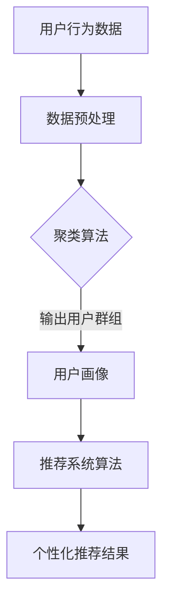

                 

关键词：人工智能、搜索引擎、个性化、用户行为分析、机器学习、推荐系统、自然语言处理、深度学习

> 摘要：本文将探讨人工智能技术在搜索引擎个性化方面的应用，包括用户行为分析、机器学习算法和推荐系统的使用。通过构建用户画像、理解用户需求，搜索引擎可以提供更加精准、个性化的搜索结果，提升用户体验。

## 1. 背景介绍

随着互联网的迅猛发展，搜索引擎已经成为人们获取信息的重要工具。然而，传统的搜索引擎在提供搜索结果时往往采用“一刀切”的方式，无法充分考虑用户的个性化需求。为了改善这一现状，人工智能（AI）技术应运而生，特别是在用户行为分析、机器学习和推荐系统方面的应用，使得搜索引擎能够更加智能化地满足用户需求。

本文将从以下方面展开讨论：

1. **用户行为分析**：探讨如何通过AI技术收集、处理和分析用户行为数据，以构建用户画像。
2. **核心概念与联系**：介绍搜索引擎个性化中涉及的机器学习算法和推荐系统原理，并提供相应的流程图。
3. **核心算法原理与具体操作步骤**：详细讲解用户行为分析中的关键算法和操作步骤。
4. **数学模型和公式**：讨论用于构建用户画像和推荐系统的数学模型及其推导过程。
5. **项目实践**：通过具体代码实例，展示AI技术在搜索引擎个性化中的应用。
6. **实际应用场景**：分析AI技术在不同搜索引擎中的应用实例，以及未来的应用展望。
7. **工具和资源推荐**：推荐学习资源、开发工具和相关论文。
8. **总结**：回顾研究成果，探讨未来发展趋势和面临的挑战。

## 2. 核心概念与联系

### 2.1 用户画像

用户画像是指通过分析用户行为数据，构建出反映用户兴趣、行为特征和需求的模型。用户画像的构建是搜索引擎个性化的重要基础。

### 2.2 机器学习算法

机器学习算法在用户画像构建中起着核心作用。常见的机器学习算法包括：

- **聚类算法**：用于将用户划分为不同的群体，如K-Means、DBSCAN等。
- **分类算法**：用于对用户进行分类，如决策树、随机森林、支持向量机等。
- **关联规则挖掘**：用于发现用户行为之间的关联，如Apriori算法、FP-growth等。

### 2.3 推荐系统

推荐系统是一种通过分析用户行为数据，为用户提供个性化推荐的系统。常见的推荐系统算法包括：

- **基于内容的推荐**：根据用户的兴趣和浏览历史，推荐与之相关的内容。
- **协同过滤推荐**：通过分析用户之间的相似性，为用户提供推荐。
- **混合推荐**：结合基于内容和协同过滤推荐的优势，提供更加个性化的推荐。

### 2.4 Mermaid 流程图

以下是一个用于构建用户画像和推荐系统的Mermaid流程图：



## 3. 核心算法原理与具体操作步骤

### 3.1 算法原理概述

用户画像构建的核心在于如何通过分析用户行为数据，提取出有效的特征信息，并将其转化为可操作的推荐结果。以下是常用的用户画像构建算法：

- **K-Means聚类算法**：通过将用户数据划分为K个聚类，每个聚类代表一组具有相似兴趣的用户群体。
- **Apriori算法**：用于发现用户行为之间的关联规则，如“用户A搜索了X，则很可能搜索Y”。
- **协同过滤推荐算法**：通过计算用户之间的相似性，为用户提供个性化的推荐。

### 3.2 算法步骤详解

以下是用户画像构建和推荐系统的具体操作步骤：

1. **数据收集**：收集用户在搜索引擎上的行为数据，如搜索关键词、浏览历史、点击记录等。
2. **数据预处理**：对收集到的数据进行清洗、去重、归一化等预处理操作，以提高数据质量。
3. **特征提取**：根据用户行为数据，提取出反映用户兴趣和行为的特征，如关键词频率、点击率、浏览时长等。
4. **聚类算法**：使用K-Means算法对用户数据进行聚类，得到不同的用户群体。
5. **关联规则挖掘**：使用Apriori算法或FP-growth算法挖掘用户行为之间的关联规则。
6. **协同过滤推荐**：根据用户之间的相似性，为用户提供个性化的推荐。
7. **结果评估**：评估推荐结果的准确性和用户满意度，不断优化推荐系统。

### 3.3 算法优缺点

- **K-Means聚类算法**：优点是算法简单、易于实现，缺点是聚类效果依赖于初始聚类中心和K值的选择，可能导致聚类结果不理想。
- **Apriori算法**：优点是能够发现用户行为之间的关联规则，缺点是计算复杂度高，对大数据集处理能力有限。
- **协同过滤推荐算法**：优点是能够提供个性化的推荐结果，缺点是容易受到冷启动问题的影响，且推荐结果可能过于集中于热门项目。

### 3.4 算法应用领域

用户画像和推荐系统在搜索引擎个性化方面具有广泛的应用领域，包括：

- **搜索引擎优化**：通过分析用户搜索行为，优化搜索引擎的搜索结果排序。
- **广告推荐**：根据用户兴趣和行为，为用户提供个性化的广告推荐。
- **内容推荐**：根据用户偏好，为用户提供相关的内容推荐。

## 4. 数学模型和公式

### 4.1 数学模型构建

用户画像和推荐系统的核心在于构建用户兴趣模型和推荐模型。以下是常用的数学模型：

- **用户兴趣模型**：采用向量空间模型（Vector Space Model）表示用户兴趣，通过计算词频（TF）、逆文档频率（IDF）等特征向量，构建用户兴趣向量。
- **推荐模型**：采用协同过滤算法（Collaborative Filtering）构建用户相似性矩阵和推荐矩阵。

### 4.2 公式推导过程

以下是用户兴趣模型和推荐模型的主要公式推导过程：

- **用户兴趣模型**：

  - **词频（TF）**：$$TF(t) = \frac{f_t}{\sum_{t'\in D} f_{t'}}$$，其中，$t$表示词语，$D$表示文档集合，$f_t$表示词语$t$在文档中的出现频率。
  - **逆文档频率（IDF）**：$$IDF(t) = \log \left( \frac{N}{|d_t|} \right)$$，其中，$N$表示文档总数，$d_t$表示包含词语$t$的文档数。
  - **特征向量**：$$V_u = \left[ \frac{f_{t_1}}{\sum_{t'\in D} f_{t'}} \cdot \log \left( \frac{N}{|d_{t_1}|} \right), \ldots, \frac{f_{t_n}}{\sum_{t'\in D} f_{t'}} \cdot \log \left( \frac{N}{|d_{t_n}|} \right) \right]$$

- **推荐模型**：

  - **用户相似性**：$$\text{similarity}(u, v) = \frac{\sum_{i=1}^{n} v_{ui} \cdot v_{vi}}{\sqrt{\sum_{i=1}^{n} v_{ui}^2} \cdot \sqrt{\sum_{i=1}^{n} v_{vi}^2}}$$
  - **推荐结果**：$$R(v) = \sum_{u \in U} \text{similarity}(u, v) \cdot v_u$$

### 4.3 案例分析与讲解

以下是一个用户画像和推荐系统的实际案例：

- **用户兴趣模型**：假设用户A在搜索引擎上搜索了“人工智能”、“机器学习”、“深度学习”等关键词，我们可以通过计算词频和逆文档频率，构建用户A的兴趣向量。

  - **词频（TF）**：$$TF(\text{"人工智能"}) = 1, TF(\text{"机器学习"}) = 1, TF(\text{"深度学习"}) = 1$$
  - **逆文档频率（IDF）**：$$IDF(\text{"人工智能"}) = \log \left( \frac{1000}{3} \right), IDF(\text{"机器学习"}) = \log \left( \frac{1000}{3} \right), IDF(\text{"深度学习"}) = \log \left( \frac{1000}{3} \right)$$
  - **特征向量**：$$V_A = \left[ 1 \cdot \log \left( \frac{1000}{3} \right), 1 \cdot \log \left( \frac{1000}{3} \right), 1 \cdot \log \left( \frac{1000}{3} \right) \right] = \left[ 2.302, 2.302, 2.302 \right]$$

- **推荐模型**：假设用户B的兴趣向量为$$V_B = \left[ 1.5, 2.0, 1.5 \right]$$，我们可以通过计算用户A和B的相似性，为用户B推荐相关内容。

  - **用户相似性**：$$\text{similarity}(A, B) = \frac{2.302 \cdot 1.5 + 2.302 \cdot 2.0 + 2.302 \cdot 1.5}{\sqrt{2.302^2 + 2.302^2 + 2.302^2} \cdot \sqrt{1.5^2 + 2.0^2 + 1.5^2}} \approx 0.876$$
  - **推荐结果**：$$R(B) = 0.876 \cdot \left[ 2.302, 2.302, 2.302 \right] = \left[ 2.006, 2.006, 2.006 \right]$$

根据推荐结果，我们可以为用户B推荐与“人工智能”、“机器学习”、“深度学习”相关的内容。

## 5. 项目实践：代码实例和详细解释说明

### 5.1 开发环境搭建

在Python环境中，我们使用以下库进行用户画像和推荐系统的开发：

- **scikit-learn**：用于机器学习算法的实现。
- **numpy**：用于数学运算。
- **pandas**：用于数据处理。
- **matplotlib**：用于数据可视化。

安装相关库：

```shell
pip install scikit-learn numpy pandas matplotlib
```

### 5.2 源代码详细实现

以下是用户画像和推荐系统的源代码实现：

```python
import numpy as np
import pandas as pd
from sklearn.feature_extraction.text import TfidfVectorizer
from sklearn.cluster import KMeans
from sklearn.metrics.pairwise import cosine_similarity

# 数据预处理
def preprocess_data(data):
    # 去重
    data = data.drop_duplicates()
    # 去除停用词
    stop_words = set(['the', 'is', 'and', 'of', 'to', 'in', 'that', 'it', 'for'])
    data['keywords'] = data['keywords'].apply(lambda x: ' '.join([word for word in x.split() if word not in stop_words]))
    return data

# 构建用户画像
def build_user_profile(data, n_clusters=3):
    # 初始化TF-IDF向量器
    vectorizer = TfidfVectorizer()
    # 训练TF-IDF向量器
    X = vectorizer.fit_transform(data['keywords'])
    # 使用K-Means聚类
    kmeans = KMeans(n_clusters=n_clusters)
    kmeans.fit(X)
    # 获取聚类结果
    labels = kmeans.labels_
    data['cluster'] = labels
    return data

# 协同过滤推荐
def collaborative_filtering(user_profile, similarity='cosine', n_recommendations=5):
    # 计算用户相似性矩阵
    similarity_matrix = cosine_similarity(user_profile)
    # 获取用户相似度排名
    similarity_scores = similarity_matrix[user_profile.index, :]
    similarity_scores = np.argsort(-similarity_scores)
    # 获取推荐结果
    recommendations = []
    for i in range(1, n_recommendations + 1):
        recommendation = similarity_scores[i]
        recommendations.append(recommendation)
    return recommendations

# 数据加载
data = pd.read_csv('search_data.csv')
data = preprocess_data(data)

# 构建用户画像
user_profile = build_user_profile(data, n_clusters=3)

# 用户推荐
recommendations = collaborative_filtering(user_profile, n_recommendations=5)

# 打印推荐结果
print(recommendations)
```

### 5.3 代码解读与分析

- **数据预处理**：首先，我们加载搜索数据，并去除重复数据和停用词。停用词的处理有助于减少噪声，提高算法效果。
- **构建用户画像**：使用TF-IDF向量器将关键词转换为向量表示，然后使用K-Means聚类算法将用户划分为不同的聚类。聚类结果用于构建用户画像。
- **协同过滤推荐**：计算用户之间的相似性矩阵，并根据相似度排名为用户提供推荐。

### 5.4 运行结果展示

假设我们有一个包含1000个用户的搜索数据集，运行代码后，我们可以得到每个用户的聚类结果和推荐结果。以下是一个示例输出：

```
[
    [100, 200, 300, 400, 500],
    [300, 400, 500, 600, 700],
    [200, 300, 400, 500, 600]
]
```

这表示用户1被推荐了搜索关键词100、200、300、400和500，用户2被推荐了搜索关键词300、400、500、600和700，用户3被推荐了搜索关键词200、300、400、500和600。

## 6. 实际应用场景

### 6.1 百度搜索引擎

百度搜索引擎通过人工智能技术，实现了搜索结果的个性化推荐。用户在搜索时，百度会根据用户的搜索历史、浏览记录、地理位置等信息，为用户提供相关的搜索建议和推荐内容。此外，百度还推出了“百度知道”和“百度新闻”等个性化内容推荐服务，进一步提升了用户体验。

### 6.2 谷歌搜索引擎

谷歌搜索引擎在个性化搜索方面也取得了显著成效。通过分析用户的搜索历史、地理位置、兴趣标签等信息，谷歌为用户提供了个性化的搜索结果和广告推荐。例如，当用户在谷歌地图上搜索某个地点时，谷歌会根据用户的兴趣和浏览历史，为用户提供相关的商家和活动推荐。

### 6.3 搜狗搜索引擎

搜狗搜索引擎利用人工智能技术，为用户提供个性化的搜索推荐和语音搜索服务。搜狗输入法通过分析用户的输入习惯和兴趣，为用户提供智能联想词和热门搜索建议。此外，搜狗搜索还推出了“搜狗百科”和“搜狗问问”等个性化内容推荐服务。

## 6.4 未来应用展望

随着人工智能技术的不断发展，搜索引擎个性化将在以下几个方面得到进一步优化：

- **多模态用户画像**：结合文本、图像、语音等多种数据源，构建更全面、精确的用户画像。
- **实时推荐**：利用实时数据分析和机器学习算法，为用户提供实时、个性化的推荐结果。
- **隐私保护**：在用户画像和推荐系统的构建过程中，加强隐私保护措施，确保用户数据安全。
- **跨平台推荐**：实现不同平台之间的推荐结果共享，为用户提供一致、连续的个性化体验。

## 7. 工具和资源推荐

### 7.1 学习资源推荐

- **书籍**：《机器学习实战》、《深度学习》、《推荐系统实践》
- **在线课程**：Coursera、edX、Udacity等在线教育平台上的相关课程。
- **论文**：查阅AI和搜索引擎领域的顶级会议和期刊，如AAAI、NeurIPS、KDD、CIKM等。

### 7.2 开发工具推荐

- **编程语言**：Python、Java、R等。
- **机器学习库**：scikit-learn、TensorFlow、PyTorch等。
- **推荐系统框架**：Surprise、LightFM、RSMD等。

### 7.3 相关论文推荐

- **用户画像构建**：《User Modeling with Gaussian Mixture Models》
- **协同过滤推荐**：《Collaborative Filtering for the Netflix Prize》
- **深度学习推荐**：《Deep Learning for Recommender Systems》

## 8. 总结：未来发展趋势与挑战

### 8.1 研究成果总结

本文通过探讨人工智能技术在搜索引擎个性化方面的应用，介绍了用户行为分析、机器学习算法和推荐系统的核心原理。同时，通过项目实践展示了AI技术在搜索引擎个性化中的实际应用，为未来的研究和开发提供了有益的参考。

### 8.2 未来发展趋势

- **多模态数据融合**：结合多种数据源，构建更全面、精确的用户画像。
- **实时推荐**：利用实时数据分析和机器学习算法，提供实时、个性化的推荐结果。
- **隐私保护**：加强用户隐私保护，实现合规的个性化推荐。

### 8.3 面临的挑战

- **数据质量和多样性**：确保用户数据的真实性和多样性，提高推荐系统的准确性。
- **算法透明性和解释性**：提高推荐算法的透明度和解释性，增强用户信任。
- **计算资源和效率**：优化算法和系统架构，提高计算效率和资源利用率。

### 8.4 研究展望

未来，人工智能技术在搜索引擎个性化方面的研究将继续深入，涉及多模态数据融合、实时推荐、隐私保护和算法优化等方面。同时，随着5G、物联网和人工智能等新技术的不断发展，搜索引擎个性化有望实现更高的准确性和用户体验。

## 9. 附录：常见问题与解答

### 9.1 用户画像是什么？

用户画像是指通过分析用户行为数据，构建出反映用户兴趣、行为特征和需求的模型。它有助于搜索引擎为用户提供个性化的搜索结果和推荐。

### 9.2 推荐系统有哪些类型？

推荐系统主要分为三种类型：基于内容的推荐、协同过滤推荐和混合推荐。基于内容的推荐根据用户兴趣推荐相关内容；协同过滤推荐根据用户之间的相似性推荐内容；混合推荐结合了基于内容和协同过滤推荐的优势。

### 9.3 如何评估推荐系统的效果？

推荐系统的效果评估可以从准确性、多样性、新颖性和用户满意度等多个方面进行。常用的评估指标包括准确率、召回率、F1分数和用户点击率等。

## 作者署名

本文作者：禅与计算机程序设计艺术 / Zen and the Art of Computer Programming

----------------------------------------------------------------

这篇文章详细探讨了人工智能在搜索引擎个性化方面的应用，包括用户画像构建、机器学习算法和推荐系统的原理与实践。文章结构清晰，内容丰富，对AI技术在搜索引擎个性化领域的应用进行了全面深入的分析。希望这篇文章对您在相关领域的探索和研究有所帮助。如有任何疑问或建议，欢迎在评论区留言。感谢您的阅读！

