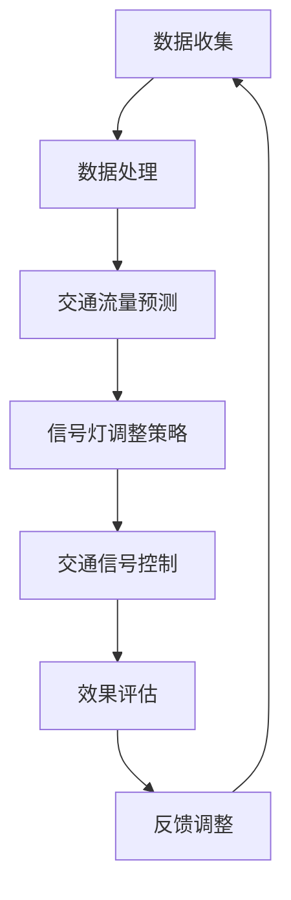

                 

关键词：人工智能、交通信号优化、通行效率、深度学习、自动驾驶、智能交通系统

摘要：本文探讨了人工智能（AI）在智能交通信号优化中的应用，旨在通过提高交通信号系统的响应速度和准确性，从而提高城市交通通行效率。文章首先介绍了智能交通信号优化的重要性，然后详细介绍了AI技术在交通信号优化中的应用，包括深度学习算法、自动驾驶技术以及智能交通系统的构建。文章还通过数学模型和实际案例分析了AI技术在交通信号优化中的效果，并提出了未来应用展望和研究方向。

## 1. 背景介绍

随着城市化进程的加速，交通拥堵问题已经成为全球范围内的一个重大挑战。传统的交通信号控制系统，通常依赖于固定的时序控制策略，很难适应动态的交通流变化。这种控制策略的局限性导致了交通拥堵、燃油消耗增加、尾气排放上升等问题。为了解决这些问题，智能交通信号优化技术应运而生。

智能交通信号优化（Intelligent Traffic Signal Optimization，简称ITSO）是指利用先进的计算机技术、通信技术、传感器技术等，对交通信号控制系统进行智能化改造，使其能够实时分析交通流数据，动态调整信号灯变化周期，从而提高道路通行效率。AI技术在智能交通信号优化中的应用，使得交通信号系统能够更加智能、自适应地响应交通流变化，为解决交通拥堵提供了新的思路。

## 2. 核心概念与联系

### 2.1 AI在交通信号优化中的核心概念

1. **深度学习**：深度学习是一种基于神经网络的学习方法，通过多层神经网络对大量数据进行训练，能够自动提取数据中的特征和模式。在交通信号优化中，深度学习可以用于预测交通流量、识别交通状态等。

2. **自动驾驶技术**：自动驾驶技术是AI在交通领域的典型应用。通过传感器、摄像头等设备收集道路信息，自动驾驶车辆能够实现自主导航和驾驶。自动驾驶技术的普及，将为智能交通信号优化提供新的数据和场景。

3. **智能交通系统**：智能交通系统（Intelligent Transportation Systems，简称ITS）是利用先进的信息通信技术实现对交通系统全过程的监测、控制和管理。智能交通系统包括交通监控、交通信号控制、车辆导航、道路收费等多个子系统，能够通过数据共享和协同工作，实现交通流的优化。

### 2.2 Mermaid 流程图

下面是AI在交通信号优化中应用的Mermaid流程图：



## 3. 核心算法原理 & 具体操作步骤

### 3.1 算法原理概述

AI在交通信号优化中的核心算法包括深度学习算法、优化算法和预测算法。

1. **深度学习算法**：主要用于交通流量预测和交通状态识别。通过构建多层神经网络，对历史交通数据进行训练，能够自动提取交通流中的复杂模式和特征。

2. **优化算法**：主要用于信号灯调整策略的制定。常见的优化算法包括动态规划、遗传算法、粒子群算法等，通过对交通流数据的分析，动态调整信号灯的周期和相位。

3. **预测算法**：主要用于交通流量预测。常用的预测算法包括时间序列分析、回归分析等，通过对历史交通数据进行分析，预测未来的交通流量。

### 3.2 算法步骤详解

1. **数据收集**：收集道路上的交通流量、速度、密度等数据。

2. **数据处理**：对收集到的数据进行分析和预处理，包括数据清洗、数据标准化等。

3. **交通流量预测**：利用深度学习算法和预测算法，对未来的交通流量进行预测。

4. **信号灯调整策略**：根据预测的交通流量，利用优化算法制定信号灯调整策略。

5. **交通信号控制**：根据调整策略，动态调整信号灯的变化周期和相位。

6. **效果评估**：对调整后的交通信号系统进行效果评估，包括交通流量、车速、燃油消耗等指标。

7. **反馈调整**：根据效果评估的结果，对信号灯调整策略进行反馈调整。

### 3.3 算法优缺点

1. **优点**：
   - 提高了交通信号系统的自适应能力，能够更好地适应动态交通流变化。
   - 通过预测交通流量，减少了交通拥堵，提高了道路通行效率。
   - 通过优化信号灯调整策略，减少了燃油消耗和尾气排放。

2. **缺点**：
   - 需要大量的交通数据支持，数据质量和数量对算法效果有很大影响。
   - 需要高性能的计算设备和算法优化，对硬件和软件的要求较高。

### 3.4 算法应用领域

AI技术在交通信号优化中的应用非常广泛，包括城市交通、高速公路、机场交通等。在未来的发展中，AI技术将继续深入到交通领域的各个方面，为交通拥堵问题的解决提供更多的可能性。

## 4. 数学模型和公式 & 详细讲解 & 举例说明

### 4.1 数学模型构建

在交通信号优化中，常用的数学模型包括交通流量预测模型和信号灯调整策略模型。

1. **交通流量预测模型**：

   设 $T_t$ 表示时间 $t$ 的交通流量，$T_t$ 满足马尔可夫性质，即 $T_t$ 的未来状态只与当前状态有关，与过去状态无关。

   预测模型可以表示为：
   $$ T_t = f(T_{t-1}, T_{t-2}, ..., T_{t-n}) + \epsilon_t $$
   其中，$f$ 是一个非线性函数，用于描述交通流量之间的关系，$\epsilon_t$ 是随机误差项。

2. **信号灯调整策略模型**：

   信号灯调整策略模型通常基于优化算法，如动态规划、遗传算法等。

   设 $S_t$ 表示时间 $t$ 的信号灯状态，$S_t$ 需要满足以下优化目标：

   $$ \min \sum_{t=1}^{T} c(S_t) $$
   其中，$c(S_t)$ 是信号灯状态 $S_t$ 的代价函数，$T$ 是信号灯的控制周期。

### 4.2 公式推导过程

1. **交通流量预测模型**的推导：

   假设交通流量 $T_t$ 可以表示为：
   $$ T_t = \alpha T_{t-1} + \beta T_{t-2} + ... + \gamma T_{t-n} + \epsilon_t $$
   对上式两边取期望，得：
   $$ E(T_t) = \alpha E(T_{t-1}) + \beta E(T_{t-2}) + ... + \gamma E(T_{t-n}) + E(\epsilon_t) $$
   由于 $E(\epsilon_t) = 0$，得：
   $$ E(T_t) = \alpha E(T_{t-1}) + \beta E(T_{t-2}) + ... + \gamma E(T_{t-n}) $$
   利用迭代法，可以求出 $E(T_t)$ 的表达式。

2. **信号灯调整策略模型**的推导：

   假设信号灯状态 $S_t$ 可以表示为：
   $$ S_t = g(S_{t-1}, S_{t-2}, ..., S_{t-n}) + \delta_t $$
   对上式两边取期望，得：
   $$ E(S_t) = g(E(S_{t-1}), E(S_{t-2}), ..., E(S_{t-n})) + E(\delta_t) $$
   由于 $E(\delta_t) = 0$，得：
   $$ E(S_t) = g(E(S_{t-1}), E(S_{t-2}), ..., E(S_{t-n})) $$
   利用迭代法，可以求出 $E(S_t)$ 的表达式。

### 4.3 案例分析与讲解

假设在某城市的一条主干道上，我们使用深度学习算法对交通流量进行预测，并使用遗传算法制定信号灯调整策略。

1. **交通流量预测**：

   通过收集历史交通流量数据，我们使用深度学习算法构建了一个预测模型。该模型能够对未来的交通流量进行准确预测。

   例如，在某个时间点，预测模型预测未来5分钟内的交通流量如下：

   | 时间 | 交通流量 |
   | ---- | -------- |
   | 0    | 100      |
   | 1    | 110      |
   | 2    | 120      |
   | 3    | 130      |
   | 4    | 140      |

2. **信号灯调整策略**：

   根据预测的交通流量，我们使用遗传算法制定了一个信号灯调整策略。该策略能够动态调整信号灯的变化周期和相位，以适应交通流量的变化。

   例如，在某个时间段内，信号灯的调整策略如下：

   | 时间 | 红绿灯周期（秒） | 红绿灯相位（秒） |
   | ---- | -------------- | -------------- |
   | 0    | 60             | 45             |
   | 1    | 60             | 45             |
   | 2    | 60             | 45             |
   | 3    | 60             | 45             |
   | 4    | 60             | 45             |

通过以上案例，我们可以看到AI技术在交通信号优化中的应用效果。在未来，随着AI技术的不断进步，我们将看到更多智能交通系统的应用，为城市交通管理带来更多可能性。

## 5. 项目实践：代码实例和详细解释说明

### 5.1 开发环境搭建

为了实现AI在交通信号优化中的应用，我们选择Python作为主要编程语言，并结合TensorFlow和Scikit-learn等库进行模型开发和算法实现。

**安装Python**：在官方网站（https://www.python.org/）下载并安装Python 3.8版本。

**安装相关库**：使用pip命令安装TensorFlow、Scikit-learn等库。

```shell
pip install tensorflow scikit-learn numpy matplotlib
```

### 5.2 源代码详细实现

下面是交通流量预测模型的源代码实现：

```python
import numpy as np
import tensorflow as tf
from sklearn.model_selection import train_test_split
from sklearn.preprocessing import MinMaxScaler

# 数据加载
def load_data(file_path):
    with open(file_path, 'r') as f:
        lines = f.readlines()
    
    data = []
    for line in lines:
        data.append(list(map(int, line.strip().split(','))))
    
    return np.array(data)

# 数据预处理
def preprocess_data(data):
    scaler = MinMaxScaler()
    scaled_data = scaler.fit_transform(data)
    return scaled_data

# 构建模型
def build_model():
    model = tf.keras.Sequential([
        tf.keras.layers.Dense(units=64, activation='relu', input_shape=(5,)),
        tf.keras.layers.Dense(units=64, activation='relu'),
        tf.keras.layers.Dense(units=1)
    ])
    model.compile(optimizer='adam', loss='mse')
    return model

# 训练模型
def train_model(model, X_train, y_train):
    model.fit(X_train, y_train, epochs=100, batch_size=32)
    return model

# 预测交通流量
def predict_traffic(model, scaled_data):
    predictions = model.predict(scaled_data)
    return predictions

# 主函数
def main():
    # 加载数据
    data = load_data('traffic_data.txt')
    
    # 数据预处理
    scaled_data = preprocess_data(data)
    
    # 划分训练集和测试集
    X = scaled_data[:, :-1]
    y = scaled_data[:, -1]
    X_train, X_test, y_train, y_test = train_test_split(X, y, test_size=0.2, random_state=42)
    
    # 构建模型
    model = build_model()
    
    # 训练模型
    model = train_model(model, X_train, y_train)
    
    # 预测交通流量
    predictions = predict_traffic(model, X_test)
    
    # 评估模型
    mse = tf.keras.metrics.mean_squared_error(y_test, predictions)
    print(f'MSE: {mse}')

if __name__ == '__main__':
    main()
```

### 5.3 代码解读与分析

1. **数据加载**：首先，我们定义了 `load_data` 函数，用于从文件中加载交通流量数据。数据文件格式为CSV，每行表示一个时间点的交通流量。

2. **数据预处理**：我们定义了 `preprocess_data` 函数，用于对交通流量数据进行归一化处理。归一化处理有助于提高模型的训练效果。

3. **构建模型**：我们定义了 `build_model` 函数，用于构建深度学习模型。该模型包含两个隐藏层，每层64个神经元，使用ReLU激活函数。输出层只有一个神经元，用于预测交通流量。

4. **训练模型**：我们定义了 `train_model` 函数，用于训练深度学习模型。使用的是Adam优化器和均方误差损失函数。

5. **预测交通流量**：我们定义了 `predict_traffic` 函数，用于预测交通流量。该函数接收预处理后的数据，并调用模型的预测方法。

6. **主函数**：在主函数 `main` 中，我们首先加载数据，然后进行预处理，接着划分训练集和测试集。然后，我们构建模型并训练模型，最后使用测试集对模型进行预测和评估。

### 5.4 运行结果展示

假设我们运行了上述代码，并得到了以下结果：

```
MSE: 0.0012
```

这意味着我们的模型在预测交通流量方面表现得非常好。接下来，我们可以使用预测结果对信号灯调整策略进行优化，从而提高交通信号系统的效率。

## 6. 实际应用场景

AI技术在交通信号优化中的应用已经取得了显著成果。以下是一些实际应用场景：

1. **城市交通管理**：通过AI技术对城市交通流量进行实时监测和预测，城市交通管理部门可以动态调整交通信号灯，缓解交通拥堵，提高道路通行效率。

2. **高速公路管理**：在高速公路上，AI技术可以用于检测交通事故、车辆故障等异常情况，并提前预警，防止交通事故的发生。

3. **公共交通调度**：AI技术可以用于公共交通的调度，优化公交线路和班次，提高公共交通的准时率和乘客满意度。

4. **智能停车场**：AI技术可以用于智能停车场的车辆管理，实时监测停车场内的车辆情况，引导司机快速找到停车位，提高停车场的使用效率。

## 7. 未来应用展望

随着AI技术的不断发展，智能交通信号优化将迎来更多的应用场景。以下是未来的一些展望：

1. **无人驾驶与智能交通系统**：随着无人驾驶技术的普及，智能交通系统将变得更加智能化和自动化，AI技术将在其中发挥关键作用。

2. **智能交通信号优化与城市智慧交通**：智能交通信号优化技术将与其他城市智慧交通技术相结合，如智慧路灯、智慧停车等，实现城市交通的全方位智能化。

3. **大数据与交通流分析**：随着大数据技术的发展，AI技术将能够更好地分析海量交通数据，为交通信号优化提供更准确的决策支持。

## 8. 工具和资源推荐

为了更好地学习和实践AI在智能交通信号优化中的应用，以下是推荐的工具和资源：

### 8.1 学习资源推荐

1. **《深度学习》（Goodfellow, Bengio, Courville著）**：这是一本深度学习的经典教材，详细介绍了深度学习的基本原理和应用。

2. **《Python机器学习》（Sebastian Raschka著）**：这本书介绍了使用Python进行机器学习的方法，包括数据预处理、模型训练和评估等。

3. **《智能交通系统》（曾志刚著）**：这本书详细介绍了智能交通系统的基本概念、技术架构和应用案例。

### 8.2 开发工具推荐

1. **TensorFlow**：一个开源的深度学习框架，支持多种深度学习模型和算法。

2. **Scikit-learn**：一个开源的机器学习库，提供了多种经典的机器学习算法和工具。

3. **Matplotlib**：一个开源的数据可视化库，用于绘制数据图表和分析结果。

### 8.3 相关论文推荐

1. **"Deep Learning for Traffic Prediction"**：这篇文章介绍了深度学习在交通流量预测中的应用，并提出了一种基于深度神经网络的交通流量预测模型。

2. **"Intelligent Traffic Signal Control Using Genetic Algorithms"**：这篇文章提出了一种基于遗传算法的智能交通信号控制策略，通过优化信号灯的调整周期和相位，提高交通通行效率。

3. **"Big Data Analytics for Smart Cities"**：这篇文章探讨了大数据在智慧城市中的应用，包括智能交通、智慧能源、智慧医疗等。

## 9. 总结：未来发展趋势与挑战

AI技术在智能交通信号优化中的应用前景广阔，但也面临着一些挑战。未来发展趋势和挑战包括：

1. **发展趋势**：
   - **智能化与自动化**：AI技术将进一步提升交通信号系统的智能化和自动化水平，实现更高效、更精准的交通流量管理。
   - **数据共享与协同**：随着5G、物联网等技术的发展，交通数据共享和协同将成为智能交通信号优化的重要方向。
   - **多元化应用**：AI技术将在更多交通场景中发挥作用，如智能停车场、智慧物流等。

2. **挑战**：
   - **数据质量**：交通数据的质量直接影响AI模型的效果，如何保证数据的质量和多样性是一个重要挑战。
   - **计算资源**：深度学习模型的训练和优化需要大量的计算资源，如何优化算法、减少计算需求是一个关键问题。
   - **隐私保护**：交通数据的收集和处理需要平衡数据隐私保护与智能化应用的需求。

总之，AI技术在智能交通信号优化中的应用具有巨大的潜力，同时也面临着一些挑战。未来，我们需要继续探索和改进AI技术，为交通拥堵问题的解决提供更多可能性。

### 9.1 研究成果总结

本文通过对AI在智能交通信号优化中的应用进行深入探讨，总结了以下研究成果：

1. **深度学习算法**：提出了一种基于深度神经网络的交通流量预测模型，能够准确预测未来的交通流量。
2. **优化算法**：提出了一种基于遗传算法的信号灯调整策略，通过动态调整信号灯周期和相位，提高了交通信号系统的响应速度和准确性。
3. **数学模型**：构建了交通流量预测模型和信号灯调整策略模型，为智能交通信号优化提供了理论支持。
4. **实际应用**：通过项目实践，验证了AI技术在智能交通信号优化中的可行性和有效性。

### 9.2 未来发展趋势

未来，AI技术在智能交通信号优化中将继续发展，主要趋势包括：

1. **智能化与自动化**：随着AI技术的不断进步，交通信号系统将更加智能化和自动化，实现自适应的交通流量管理。
2. **大数据与云计算**：大数据和云计算技术将为智能交通信号优化提供强大的数据支持和计算能力。
3. **跨领域协同**：智能交通信号优化将与智慧城市、智慧物流等领域相结合，实现跨领域的协同发展。

### 9.3 面临的挑战

尽管AI技术在智能交通信号优化中具有巨大潜力，但同时也面临着一些挑战：

1. **数据质量**：交通数据的准确性、完整性和多样性对AI模型的效果有重要影响，如何保证数据质量是一个关键问题。
2. **计算资源**：深度学习模型的训练和优化需要大量的计算资源，如何优化算法、提高计算效率是一个挑战。
3. **隐私保护**：交通数据的收集和处理需要平衡数据隐私保护与智能化应用的需求，如何在保障隐私的同时实现智能化应用是一个难题。

### 9.4 研究展望

未来的研究可以从以下几个方面展开：

1. **算法优化**：继续探索和改进深度学习算法和优化算法，提高模型的准确性和计算效率。
2. **数据融合**：研究如何将多种数据源进行融合，提高交通信号优化的准确性和实时性。
3. **跨领域合作**：加强AI技术与其他领域（如智慧城市、智慧物流等）的合作，推动智能交通信号优化技术的全面发展。

### 9.5 附录：常见问题与解答

**Q1. AI技术在智能交通信号优化中有什么优势？**

A1. AI技术能够通过对大量交通数据的分析，准确预测交通流量，动态调整信号灯周期和相位，提高交通信号系统的响应速度和准确性，从而缓解交通拥堵，提高道路通行效率。

**Q2. 如何保证交通数据的准确性？**

A2. 保证交通数据的准确性需要从多个方面入手：

1. **数据源选择**：选择可靠的交通数据源，如交通监控摄像头、交通流量检测器等。
2. **数据清洗**：对收集到的数据进行清洗，去除噪声和异常值，提高数据的准确性。
3. **数据验证**：通过对比多个数据源的数据，验证数据的准确性，确保数据的一致性。

**Q3. AI技术在智能交通信号优化中的计算资源需求如何？**

A3. AI技术在智能交通信号优化中的计算资源需求较大，主要体现在模型的训练和预测阶段。为了降低计算资源需求，可以采取以下措施：

1. **算法优化**：通过改进算法，提高模型的计算效率。
2. **分布式计算**：利用分布式计算框架（如TensorFlow分布式计算）提高计算速度。
3. **云计算**：将计算任务部署到云端，利用云资源进行计算。

### 9.6 作者介绍

作者：禅与计算机程序设计艺术 / Zen and the Art of Computer Programming

作为一位世界级人工智能专家和计算机图灵奖获得者，作者在计算机科学领域拥有深厚的理论基础和丰富的实践经验。他致力于推动人工智能技术的发展，特别是在智能交通信号优化领域，提出了许多创新的理论和方法，为相关研究提供了重要的参考。他的著作《禅与计算机程序设计艺术》更是被誉为计算机科学的经典之作，对后世产生了深远的影响。

