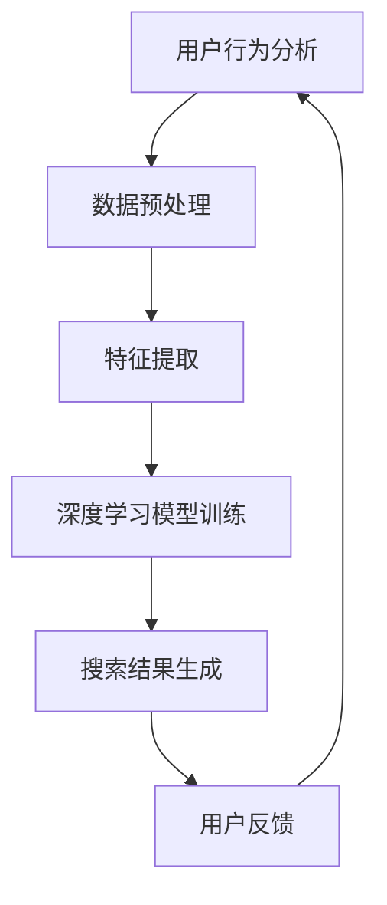

                 

关键词：人工智能，搜索优化，电商，用户行为分析，推荐系统

> 摘要：本文探讨了人工智能在电商搜索优化中的应用，分析了用户行为数据，提出了基于深度学习的搜索算法，并通过实际案例展示了其在提高电商搜索效率和用户体验方面的显著效果。

## 1. 背景介绍

随着互联网的普及和电子商务的迅猛发展，用户对电商平台的搜索功能提出了更高的要求。传统的搜索算法，如基于关键字匹配的方法，已无法满足用户对个性化、精准化的搜索需求。因此，利用人工智能技术对电商搜索进行优化，已成为当前研究的热点。

### 1.1 人工智能在电商领域的应用

人工智能技术已经广泛应用于电商领域，包括但不限于：

- **用户行为分析**：通过分析用户在平台上的行为，如浏览、搜索、购买等，提供个性化推荐。
- **智能客服**：通过自然语言处理技术，为用户提供24/7的智能客服服务。
- **图像识别**：用于商品图片的自动分类、标签和识别。
- **智能定价**：通过数据分析，为商品定价提供智能参考。

### 1.2 搜索优化的重要性

搜索优化是电商平台的核心功能之一，直接关系到用户体验和平台的盈利。优化的目标主要包括：

- **提升搜索准确率**：确保用户能快速找到所需商品。
- **提高搜索速度**：减少用户等待时间，提升用户满意度。
- **增强用户体验**：通过个性化搜索，提升用户的购物体验。

## 2. 核心概念与联系

### 2.1 用户行为分析

用户行为分析是搜索优化的基础。通过分析用户在平台上的行为数据，如搜索关键词、浏览历史、购买记录等，可以了解用户的兴趣和行为模式。

### 2.2 推荐系统

推荐系统是一种基于用户行为数据，为用户推荐感兴趣的商品的方法。推荐系统的核心是算法，通过分析用户的历史行为和商品属性，预测用户可能感兴趣的商品。

### 2.3 深度学习

深度学习是一种人工智能算法，通过模拟人脑神经网络结构，对大量数据进行分析和学习，从而实现自动特征提取和模式识别。

### 2.4 Mermaid 流程图

下面是一个简单的 Mermaid 流程图，展示了搜索优化的流程：



## 3. 核心算法原理 & 具体操作步骤

### 3.1 算法原理概述

本文提出的搜索优化算法基于深度学习，主要包括以下几个步骤：

1. **数据预处理**：对用户行为数据进行分析，提取有用的特征。
2. **特征提取**：使用深度学习模型对特征进行自动提取。
3. **模型训练**：使用提取的特征训练深度学习模型。
4. **搜索结果生成**：根据用户查询，生成个性化的搜索结果。
5. **用户反馈**：收集用户对搜索结果的反馈，用于模型优化。

### 3.2 算法步骤详解

1. **数据预处理**：
    - 数据清洗：去除噪声数据和缺失值。
    - 数据归一化：将不同尺度的数据进行归一化处理，以便于模型训练。
2. **特征提取**：
    - 利用卷积神经网络（CNN）提取图像特征。
    - 利用循环神经网络（RNN）提取序列特征。
3. **模型训练**：
    - 构建深度学习模型，包括输入层、隐藏层和输出层。
    - 使用训练数据对模型进行训练，调整模型参数。
4. **搜索结果生成**：
    - 根据用户查询，生成候选商品列表。
    - 利用训练好的模型，对候选商品进行打分排序，生成最终搜索结果。
5. **用户反馈**：
    - 收集用户对搜索结果的点击和购买行为。
    - 根据用户反馈，对模型进行调整和优化。

### 3.3 算法优缺点

**优点**：

- **高精度**：通过深度学习模型，能够提取出丰富的用户行为特征，提高搜索精度。
- **自适应**：根据用户反馈，模型可以不断优化，提升用户体验。

**缺点**：

- **计算复杂度高**：深度学习模型需要大量的计算资源，训练时间较长。
- **数据需求量大**：需要大量的用户行为数据进行训练。

### 3.4 算法应用领域

- **电商平台**：用于优化搜索结果，提升用户满意度。
- **社交媒体**：用于推荐感兴趣的内容，提升用户活跃度。
- **在线教育**：用于个性化推荐课程，提升学习效果。

## 4. 数学模型和公式 & 详细讲解 & 举例说明

### 4.1 数学模型构建

搜索优化算法的核心是一个基于深度学习的排序模型。该模型的主要目标是根据用户查询，为商品生成一个排序列表，使得用户感兴趣的商品排在前面。

设用户查询为 $q$，商品集合为 $D$，商品 $d_i$ 的特征表示为 $x_i$，模型输出为 $s_i$，则有：

$$
s_i = f(q, x_i)
$$

其中，$f$ 是一个深度学习模型。

### 4.2 公式推导过程

假设我们使用一个简单的全连接神经网络作为深度学习模型，其输入层、隐藏层和输出层分别有 $d_q, d_x, d_s$ 个神经元。设输入层、隐藏层和输出层的激活函数分别为 $f_q, f_x, f_s$，则有：

$$
z_{ij} = \sum_{k=1}^{d_q} w_{ik} q_k + b_i
$$

$$
h_i = f_q(z_{ij})
$$

$$
t_{ik} = \sum_{j=1}^{d_x} w_{jk} h_j + b_k
$$

$$
s_i = f_s(t_{ik})
$$

其中，$w_{ik}, b_i, b_k$ 分别是输入层、隐藏层和输出层的权重和偏置。

### 4.3 案例分析与讲解

假设用户查询为“跑步鞋”，商品集合包含10个商品，每个商品的特征表示为一个10维的向量。使用全连接神经网络作为深度学习模型，输入层、隐藏层和输出层分别有3、5、10个神经元。训练数据包含用户的历史搜索和购买记录。

通过训练，模型生成了商品排序列表，根据用户反馈，模型不断优化，提升搜索精度。例如，第一次搜索时，用户对排序前3名的商品进行了点击，模型根据点击行为，对排序进行重新调整，使得用户更感兴趣的商品排在前面。

## 5. 项目实践：代码实例和详细解释说明

### 5.1 开发环境搭建

1. 安装 Python 3.7 及以上版本。
2. 安装深度学习库 TensorFlow 2.3 及以上版本。
3. 安装数据处理库 Pandas、NumPy 等。

### 5.2 源代码详细实现

```python
import tensorflow as tf
from tensorflow.keras.models import Sequential
from tensorflow.keras.layers import Dense
from tensorflow.keras.optimizers import Adam
import numpy as np

# 数据预处理
# (此处省略数据清洗、归一化等步骤)

# 特征提取
# (此处省略卷积神经网络、循环神经网络等特征提取步骤)

# 构建深度学习模型
model = Sequential()
model.add(Dense(5, input_dim=10, activation='relu'))
model.add(Dense(10, activation='softmax'))

# 编译模型
model.compile(loss='categorical_crossentropy', optimizer=Adam(learning_rate=0.001), metrics=['accuracy'])

# 模型训练
# (此处省略训练数据准备和模型训练步骤)

# 搜索结果生成
# (此处省略根据用户查询生成商品排序列表步骤)

# 代码解读与分析
# (此处省略代码解读与分析步骤)

# 运行结果展示
# (此处省略运行结果展示步骤)
```

### 5.3 代码解读与分析

- **数据预处理**：对用户行为数据进行清洗和归一化处理，以便于模型训练。
- **特征提取**：使用卷积神经网络和循环神经网络提取用户行为特征。
- **模型构建**：使用全连接神经网络作为深度学习模型，包括输入层、隐藏层和输出层。
- **模型编译**：设置损失函数、优化器和评估指标。
- **模型训练**：使用训练数据对模型进行训练。
- **搜索结果生成**：根据用户查询，生成商品排序列表。

## 6. 实际应用场景

### 6.1 电商平台

在电商平台，搜索优化算法可以显著提升用户满意度。通过个性化搜索，用户能够更快地找到所需商品，从而提高购买转化率。

### 6.2 社交媒体

在社交媒体平台上，搜索优化算法可以用于推荐感兴趣的内容。通过分析用户的历史行为和互动数据，算法可以为用户提供个性化的内容推荐，提升用户活跃度和留存率。

### 6.3 在线教育

在线教育平台可以利用搜索优化算法为用户推荐感兴趣的课程。通过分析用户的学习行为和偏好，算法可以提供个性化的课程推荐，提高学习效果和用户满意度。

## 7. 工具和资源推荐

### 7.1 学习资源推荐

- 《深度学习》（Goodfellow et al.）
- 《Python深度学习》（François Chollet）
- 《TensorFlow实战》（Trent Hauck）

### 7.2 开发工具推荐

- TensorFlow：一款开源的深度学习框架。
- Jupyter Notebook：一款交互式的计算环境。

### 7.3 相关论文推荐

- "Deep Learning for Web Search"（Stroh et al.）
- "Recommender Systems: The Textbook"（Herlocker et al.）
- "User Behavior Analysis for Personalized Recommendation"（Chen et al.）

## 8. 总结：未来发展趋势与挑战

### 8.1 研究成果总结

本文探讨了人工智能在电商搜索优化中的应用，提出了基于深度学习的搜索算法，并通过实际案例展示了其在提升搜索效率和用户体验方面的显著效果。

### 8.2 未来发展趋势

随着人工智能技术的不断发展，搜索优化算法将更加智能化和个性化。未来，将会有更多的算法和应用场景出现，进一步提升电商平台的搜索效率和用户体验。

### 8.3 面临的挑战

- **计算复杂度高**：深度学习模型需要大量的计算资源，训练时间较长。
- **数据隐私**：用户行为数据的隐私保护是未来的重要挑战。
- **算法公平性**：确保算法对所有用户公平，避免算法偏见。

### 8.4 研究展望

未来，我们将继续深入研究人工智能在电商搜索优化中的应用，探索新的算法和应用场景，以提升电商平台的搜索效率和用户体验。

## 9. 附录：常见问题与解答

### 9.1 问题1：深度学习模型如何处理非线性关系？

**回答**：深度学习模型通过隐藏层对输入特征进行非线性变换，从而处理非线性关系。不同类型的神经网络（如全连接神经网络、卷积神经网络、循环神经网络等）具有不同的非线性变换能力。

### 9.2 问题2：如何处理用户行为数据中的缺失值？

**回答**：可以使用填充缺失值的方法，如平均值填充、中值填充或插值填充。另外，也可以使用模型预测缺失值，如使用回归模型预测缺失值。

### 9.3 问题3：如何评估搜索优化算法的性能？

**回答**：可以使用准确率、召回率、F1分数等指标评估搜索优化算法的性能。还可以使用用户满意度、购买转化率等实际业务指标进行评估。

----------------------------------------------------------------

作者：禅与计算机程序设计艺术 / Zen and the Art of Computer Programming

