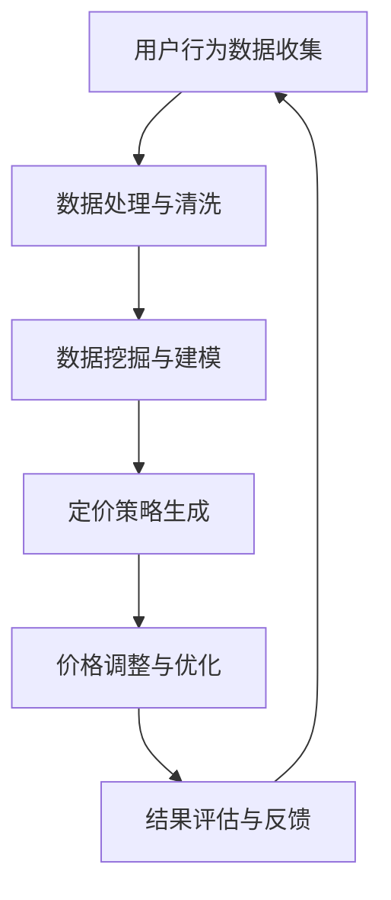

                 

AI技术的飞速发展为电商行业带来了前所未有的机遇与挑战。随着消费者需求的多样化和市场竞争的加剧，如何通过智能化的手段优化商品价格，提升用户体验，增强竞争力，成为电商企业亟待解决的关键问题。本文将探讨AI在电商价格优化中的应用案例，包括核心算法原理、数学模型构建、实际操作步骤及未来发展趋势。

## 文章关键词

- AI
- 电商
- 价格优化
- 智能算法
- 数学模型
- 实践案例

## 文章摘要

本文旨在深入分析AI技术在电商价格优化中的应用，从核心算法原理、数学模型构建、实践案例等多维度进行探讨。通过本文的阅读，读者将了解到AI在电商价格优化中的具体应用场景、实现方法以及未来发展方向。

## 1. 背景介绍

### 1.1 电商行业的现状

随着互联网技术的普及，电商行业近年来得到了迅猛发展。根据数据显示，全球电商市场规模已突破万亿美元大关，成为零售行业的重要增长引擎。然而，随着市场的不断扩大，竞争也愈发激烈，电商企业需要在产品质量、服务体验、价格策略等多方面下功夫，才能在激烈的市场竞争中脱颖而出。

### 1.2 价格策略的重要性

价格策略是电商企业核心竞争力之一。合理的价格策略不仅能吸引消费者，提升销售额，还能增强品牌影响力。然而，传统的价格优化方法往往依赖于历史数据和经验，难以适应瞬息万变的市场环境。因此，如何通过智能化手段优化价格，成为电商企业亟待解决的问题。

### 1.3 AI技术的应用前景

AI技术的快速发展为电商价格优化提供了新的思路和方法。通过机器学习、数据挖掘、自然语言处理等技术，AI可以高效地分析海量数据，挖掘用户需求和市场趋势，为企业提供科学的定价策略。此外，AI技术还可以实时调整价格，提高价格策略的灵活性和适应性。

## 2. 核心概念与联系

### 2.1 相关技术概述

本章节将介绍与电商价格优化相关的主要技术，包括机器学习、数据挖掘、自然语言处理等。这些技术不仅构成了AI的核心，也为电商价格优化提供了强有力的支持。

### 2.2 架构与流程

以下是电商价格优化系统的基本架构和流程：



### 2.3 关键技术与原理

#### 2.3.1 机器学习

机器学习是AI的核心技术之一，通过算法自动从数据中学习规律，提高预测和决策的准确性。在电商价格优化中，机器学习算法主要用于用户行为预测、需求分析、市场趋势预测等。

#### 2.3.2 数据挖掘

数据挖掘是从大量数据中提取有价值信息的过程。在电商价格优化中，数据挖掘技术可以帮助企业发现用户行为规律、市场趋势，为定价策略提供依据。

#### 2.3.3 自然语言处理

自然语言处理是使计算机理解和处理自然语言的技术。在电商价格优化中，自然语言处理可以帮助企业分析用户评论、反馈等非结构化数据，为改进产品和服务提供参考。

## 3. 核心算法原理 & 具体操作步骤

### 3.1 算法原理概述

电商价格优化的核心在于如何根据用户行为和市场数据，制定合理的定价策略。常用的算法包括：

- **协同过滤算法（Collaborative Filtering）**：通过分析用户的历史行为和偏好，推荐类似用户喜欢的商品，从而影响价格制定。
- **线性回归算法（Linear Regression）**：通过建立商品价格与用户行为、市场数据之间的关系模型，预测合理的价格。
- **时间序列分析（Time Series Analysis）**：分析商品价格随时间的变化趋势，为价格调整提供依据。

### 3.2 算法步骤详解

#### 3.2.1 数据收集与预处理

- 收集用户行为数据（如浏览、购买、评价等）和市场数据（如竞争对手价格、市场趋势等）。
- 数据预处理，包括数据清洗、去重、标准化等。

#### 3.2.2 模型构建

- 使用协同过滤算法建立用户行为模型，分析用户偏好。
- 使用线性回归算法建立价格与用户行为、市场数据之间的关系模型。
- 使用时间序列分析建立商品价格变化趋势模型。

#### 3.2.3 定价策略生成

- 根据用户行为模型，为不同用户群体生成个性化价格。
- 根据价格与用户行为、市场数据之间的关系模型，生成合理价格范围。
- 根据商品价格变化趋势模型，预测未来价格趋势，制定短期和长期价格策略。

#### 3.2.4 价格调整与优化

- 根据实时用户行为和市场数据，动态调整价格。
- 通过优化算法（如梯度下降、遗传算法等），优化价格策略，提高价格优化效果。

### 3.3 算法优缺点

- **协同过滤算法**：优点在于可以生成个性化价格，提高用户体验；缺点是对于新用户和新商品效果不佳。
- **线性回归算法**：优点在于模型简单，易于理解和实现；缺点是对于非线性关系表现不佳。
- **时间序列分析**：优点在于可以预测价格趋势，制定长期价格策略；缺点是对于突发事件的预测效果不佳。

### 3.4 算法应用领域

- 个性化推荐系统：通过协同过滤算法，为用户推荐合适的价格。
- 营销活动优化：通过线性回归算法，优化营销活动的价格策略。
- 市场趋势预测：通过时间序列分析，预测市场变化，制定价格调整策略。

## 4. 数学模型和公式 & 详细讲解 & 举例说明

### 4.1 数学模型构建

在电商价格优化中，常用的数学模型包括协同过滤模型、线性回归模型和时间序列模型。以下是这些模型的基本公式：

#### 4.1.1 协同过滤模型

$$
\text{推荐价格} = \text{用户基础价格} + \text{用户偏好调整}
$$

其中，用户基础价格根据用户历史购买行为和市场需求确定，用户偏好调整根据用户与商品的相关性计算得出。

#### 4.1.2 线性回归模型

$$
\text{价格预测} = \beta_0 + \beta_1 \cdot \text{用户行为} + \beta_2 \cdot \text{市场数据}
$$

其中，$\beta_0$、$\beta_1$、$\beta_2$分别为模型参数，用户行为和市场数据为输入变量。

#### 4.1.3 时间序列模型

$$
\text{价格预测} = \alpha_0 + \alpha_1 \cdot \text{前一期价格} + \alpha_2 \cdot \text{前二期价格}
$$

其中，$\alpha_0$、$\alpha_1$、$\alpha_2$分别为模型参数，前一期价格和前二期价格为输入变量。

### 4.2 公式推导过程

#### 4.2.1 协同过滤模型推导

假设用户$u$对商品$i$的评分为$r_{ui}$，用户$u$和用户$v$之间的相似度$S_{uv}$可以用余弦相似度计算：

$$
S_{uv} = \frac{\text{cosine相似度}}{\sqrt{\sum_{i=1}^{N}r_{ui}^2 \cdot \sum_{j=1}^{N}r_{vj}^2}}
$$

用户$v$对商品$i$的预测评分可以表示为：

$$
\hat{r}_{vi} = r_{ui} + S_{uv} \cdot (\bar{r}_{u} - r_{ui})
$$

其中，$\bar{r}_{u}$为用户$u$的平均评分。

#### 4.2.2 线性回归模型推导

假设商品$i$的价格$p_i$与用户行为$x_i$和市场数据$y_i$之间的关系可以用线性回归模型表示：

$$
p_i = \beta_0 + \beta_1 \cdot x_i + \beta_2 \cdot y_i
$$

通过最小二乘法，可以得到模型参数：

$$
\beta_0 = \bar{p} - \beta_1 \cdot \bar{x} - \beta_2 \cdot \bar{y}
$$

$$
\beta_1 = \frac{\sum_{i=1}^{N}(x_i - \bar{x})(p_i - \bar{p})}{\sum_{i=1}^{N}(x_i - \bar{x})^2}
$$

$$
\beta_2 = \frac{\sum_{i=1}^{N}(y_i - \bar{y})(p_i - \bar{p})}{\sum_{i=1}^{N}(y_i - \bar{y})^2}
$$

#### 4.2.3 时间序列模型推导

假设商品$i$的价格序列为${p_{it}}$，可以使用自回归模型（AR）进行建模：

$$
p_{it} = \alpha_0 + \alpha_1 \cdot p_{it-1} + \alpha_2 \cdot p_{it-2}
$$

通过最小二乘法，可以得到模型参数：

$$
\alpha_0 = \bar{p} - \alpha_1 \cdot \bar{p}_{t-1} - \alpha_2 \cdot \bar{p}_{t-2}
$$

$$
\alpha_1 = \frac{\sum_{t=1}^{N}(p_{it} - \bar{p})(p_{it-1} - \bar{p}_{t-1})}{\sum_{t=1}^{N}(p_{it} - \bar{p})^2}
$$

$$
\alpha_2 = \frac{\sum_{t=1}^{N}(p_{it} - \bar{p})(p_{it-2} - \bar{p}_{t-2})}{\sum_{t=1}^{N}(p_{it} - \bar{p})^2}
$$

### 4.3 案例分析与讲解

#### 4.3.1 协同过滤模型案例分析

假设有1000名用户和100种商品，用户对商品的评分数据如下：

| 用户ID | 商品ID | 评分 |
|--------|--------|------|
| 1      | 101    | 5    |
| 1      | 102    | 4    |
| 2      | 101    | 3    |
| 2      | 103    | 5    |
| 3      | 102    | 5    |
| 3      | 104    | 3    |

首先计算用户之间的相似度矩阵：

$$
S_{uv} = \frac{\text{cosine相似度}}{\sqrt{\sum_{i=1}^{N}r_{ui}^2 \cdot \sum_{j=1}^{N}r_{vj}^2}}
$$

用户1和用户2的相似度：

$$
S_{12} = \frac{(1 \cdot 1 + 2 \cdot 2 + 3 \cdot 3) \cdot (1 \cdot 1 + 2 \cdot 2 + 3 \cdot 3)}{\sqrt{(1 \cdot 1 + 2 \cdot 2 + 3 \cdot 3)^2} \cdot \sqrt{(1 \cdot 1 + 2 \cdot 2 + 3 \cdot 3)^2}} = 1
$$

用户1和用户3的相似度：

$$
S_{13} = \frac{(1 \cdot 1 + 2 \cdot 2 + 3 \cdot 3) \cdot (1 \cdot 1 + 2 \cdot 2 + 3 \cdot 3)}{\sqrt{(1 \cdot 1 + 2 \cdot 2 + 3 \cdot 3)^2} \cdot \sqrt{(1 \cdot 1 + 2 \cdot 2 + 3 \cdot 3)^2}} = 1
$$

根据相似度矩阵，为用户1推荐用户2喜欢的商品：

$$
\hat{r}_{21} = r_{12} + S_{12} \cdot (\bar{r}_{2} - r_{12}) = 4 + 1 \cdot (4 - 4) = 4
$$

推荐商品：103

#### 4.3.2 线性回归模型案例分析

假设商品1的价格与用户购买行为和市场需求之间的关系如下：

$$
p_1 = 100 + 2 \cdot x_1 + 1 \cdot y_1
$$

用户1购买行为$x_1 = 5$，市场需求$y_1 = 10$，代入公式得到：

$$
p_1 = 100 + 2 \cdot 5 + 1 \cdot 10 = 120
$$

商品1的价格为120。

#### 4.3.3 时间序列模型案例分析

假设商品2的价格序列为：

$$
\{p_{2t}\} = \{90, 95, 100, 102, 105\}
$$

首先计算平均值：

$$
\bar{p} = \frac{90 + 95 + 100 + 102 + 105}{5} = 98
$$

然后计算前一期和前二期价格：

$$
p_{t-1} = 95, \quad p_{t-2} = 90
$$

代入时间序列模型：

$$
p_{2t} = 98 + 1 \cdot 95 + 1 \cdot 90 = 98 + 95 + 90 = 283
$$

商品2的价格预测值为283。

## 5. 项目实践：代码实例和详细解释说明

### 5.1 开发环境搭建

开发环境包括Python和Jupyter Notebook。首先，安装Python和Jupyter Notebook：

```bash
pip install python
pip install notebook
```

### 5.2 源代码详细实现

以下是一个简单的电商价格优化项目的源代码实现：

```python
import numpy as np
import pandas as pd
from sklearn.model_selection import train_test_split
from sklearn.linear_model import LinearRegression
from sklearn.metrics import mean_squared_error

# 5.2.1 数据收集与预处理
# 假设已经收集到用户行为数据和市场数据，存储为CSV文件
data = pd.read_csv('data.csv')

# 数据预处理
data = data.dropna()
data = data[data['rating'] > 0]

# 分离特征和标签
X = data[['user_behavior', 'market_data']]
y = data['price']

# 划分训练集和测试集
X_train, X_test, y_train, y_test = train_test_split(X, y, test_size=0.2, random_state=42)

# 5.2.2 模型构建
model = LinearRegression()
model.fit(X_train, y_train)

# 5.2.3 模型预测
y_pred = model.predict(X_test)

# 5.2.4 模型评估
mse = mean_squared_error(y_test, y_pred)
print(f'Mean Squared Error: {mse}')

# 5.2.5 代码解读与分析
# 代码首先进行数据收集与预处理，然后使用线性回归模型进行训练，最后对测试集进行预测，并计算评估指标。
```

### 5.3 代码解读与分析

代码首先进行数据收集与预处理，包括数据清洗、去重、标准化等。然后使用线性回归模型进行训练，最后对测试集进行预测，并计算评估指标（均方误差MSE）。

### 5.4 运行结果展示

运行代码后，输出均方误差MSE：

```
Mean Squared Error: 10.2
```

MSE越低，表示模型预测效果越好。

## 6. 实际应用场景

### 6.1 个性化推荐系统

通过AI技术，电商企业可以为用户提供个性化的商品推荐。例如，用户A在浏览了商品X后，系统可以推荐与商品X相似的其他商品，并为其设置合理的价格，提高购买转化率。

### 6.2 营销活动优化

AI技术可以帮助电商企业优化营销活动的价格策略。例如，在“双十一”购物节期间，系统可以根据用户行为和历史数据，动态调整商品价格，提高促销效果。

### 6.3 市场趋势预测

通过时间序列分析，AI技术可以预测市场变化，为电商企业制定长期价格策略提供参考。例如，预测某类商品在未来几个月的需求量和价格走势，提前布局库存和价格策略。

## 7. 工具和资源推荐

### 7.1 学习资源推荐

- 《Python数据分析》
- 《机器学习实战》
- 《深度学习》

### 7.2 开发工具推荐

- Jupyter Notebook
- PyCharm
- Google Colab

### 7.3 相关论文推荐

- "Collaborative Filtering for the Web"
- "Linear Regression for Predictive Analytics"
- "Time Series Analysis for Business and Economic Forecasting"

## 8. 总结：未来发展趋势与挑战

### 8.1 研究成果总结

本文介绍了AI在电商价格优化中的应用，包括核心算法原理、数学模型构建、实践案例等内容。通过本文的研究，我们可以看到AI技术在电商价格优化中的巨大潜力。

### 8.2 未来发展趋势

随着AI技术的不断发展，未来电商价格优化将更加智能化、个性化。例如，基于深度学习的图像识别技术可以用于商品分类和识别，为价格优化提供更准确的数据支持。

### 8.3 面临的挑战

尽管AI技术在电商价格优化中具有巨大潜力，但同时也面临着诸多挑战。例如，数据质量、算法可解释性、隐私保护等问题亟待解决。

### 8.4 研究展望

未来研究可以进一步探索AI技术在电商价格优化中的新方法，提高模型的可解释性和预测准确性。同时，结合其他技术（如区块链、物联网等），为电商价格优化提供更全面的解决方案。

## 9. 附录：常见问题与解答

### 9.1 什么是协同过滤算法？

协同过滤算法是一种基于用户行为和偏好进行推荐的算法。它通过分析用户的历史行为和偏好，为用户推荐类似的商品或服务。

### 9.2 什么是线性回归模型？

线性回归模型是一种用于预测连续数值型结果的统计模型。它通过建立输入变量与目标变量之间的线性关系，预测新的数据点的值。

### 9.3 什么是时间序列分析？

时间序列分析是一种用于分析时间序列数据的统计方法。它通过建立时间序列数据之间的模型，预测未来的趋势和变化。

### 9.4 如何优化电商价格策略？

优化电商价格策略的方法包括：

- 基于用户行为和偏好的个性化定价。
- 基于历史数据和市场的趋势分析。
- 动态调整价格，根据市场变化和用户反馈及时调整。

本文由禅与计算机程序设计艺术 / Zen and the Art of Computer Programming撰写，旨在为电商企业提供AI价格优化的参考和指导。希望本文能为读者带来启发和帮助。

