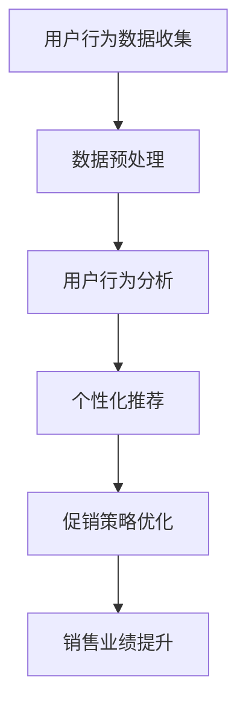

                 

关键词：人工智能，电商促销，个性化推荐，数据挖掘，算法优化，用户体验，商业模式创新

> 摘要：随着电子商务的快速发展，电商促销已成为提升销售额、增加用户粘性的关键手段。本文将探讨人工智能在电商促销中的实际应用，包括个性化推荐、用户行为分析、促销策略优化等方面，并展望未来的发展趋势与挑战。

## 1. 背景介绍

### 1.1 电商促销的重要性

电商促销是电子商务企业吸引消费者、提升销售业绩的重要手段。通过优惠券、限时折扣、满减优惠、拼团等促销方式，电商平台能够有效地刺激消费者的购买欲望，提高转化率和用户满意度。然而，传统的促销策略往往存在同质化严重、用户体验差等问题，难以满足消费者日益增长的需求。

### 1.2 人工智能的快速发展

人工智能（AI）作为当前科技领域的前沿技术，已逐步应用于各个行业。在电商促销中，人工智能可以针对消费者的个性化需求，提供精准的推荐、优化促销策略，提升用户体验，从而实现商业价值的最大化。

## 2. 核心概念与联系

### 2.1 个性化推荐

个性化推荐是人工智能在电商促销中的一个重要应用。通过分析消费者的购买历史、浏览行为、社交媒体数据等，系统可以预测消费者可能感兴趣的商品，从而提供个性化的推荐。

### 2.2 用户行为分析

用户行为分析是指通过收集和分析用户在电商平台上的行为数据，了解用户的购买习惯、偏好和需求，为优化促销策略提供依据。

### 2.3 促销策略优化

促销策略优化是指利用人工智能技术，对各种促销方案进行评估和筛选，找到最优的促销策略，提高销售额和用户满意度。

### 2.4 Mermaid 流程图



## 3. 核心算法原理 & 具体操作步骤

### 3.1 算法原理概述

电商促销中的核心算法主要涉及个性化推荐、用户行为分析和促销策略优化。个性化推荐算法通常采用协同过滤、基于内容的推荐等技术；用户行为分析算法主要基于机器学习和数据挖掘技术；促销策略优化算法则采用优化算法和博弈论等方法。

### 3.2 算法步骤详解

1. **个性化推荐算法**：首先收集用户的历史数据，包括购买记录、浏览行为、评价等；然后使用协同过滤算法或基于内容的推荐算法，生成个性化推荐列表。

2. **用户行为分析算法**：对用户的行为数据进行预处理，如去噪、归一化等；然后使用机器学习算法，如聚类、分类等，分析用户的购买习惯、偏好和需求。

3. **促销策略优化算法**：根据用户行为分析的结果，设计不同的促销策略，如优惠券、限时折扣、拼团等；然后使用优化算法，如贪心算法、动态规划等，评估和筛选促销策略，找到最优方案。

### 3.3 算法优缺点

1. **个性化推荐算法**：优点是能够提高用户满意度，提高销售额；缺点是计算复杂度高，对数据质量和算法选择要求较高。

2. **用户行为分析算法**：优点是能够深入了解用户需求，提高促销策略的准确性；缺点是数据预处理和算法选择复杂，对计算资源要求较高。

3. **促销策略优化算法**：优点是能够提高销售额和用户满意度，降低促销成本；缺点是优化过程复杂，对算法和计算资源要求较高。

### 3.4 算法应用领域

1. **电商平台**：电商平台可以利用人工智能技术，实现个性化推荐、用户行为分析和促销策略优化，提升用户体验和销售额。

2. **在线教育**：在线教育平台可以利用人工智能技术，根据用户的学习行为和偏好，提供个性化的学习推荐，提高学习效果。

3. **金融行业**：金融机构可以利用人工智能技术，分析用户的消费行为和信用状况，实现精准营销和风险控制。

## 4. 数学模型和公式 & 详细讲解 & 举例说明

### 4.1 数学模型构建

在电商促销中，常见的数学模型包括协同过滤模型、基于内容的推荐模型、用户行为分析模型和促销策略优化模型。

### 4.2 公式推导过程

1. **协同过滤模型**：

   假设用户 \( u \) 对商品 \( i \) 的评分为 \( r_{ui} \)，用户 \( u \) 和用户 \( v \) 的相似度定义为 \( s_{uv} \)，则用户 \( u \) 对未评分的商品 \( j \) 的预测分值为：

   $$ r_{uj} = r_{uj} + s_{uv} \cdot (r_{vj} - r_{uj}) $$

2. **基于内容的推荐模型**：

   假设商品 \( i \) 和商品 \( j \) 的特征向量分别为 \( x_i \) 和 \( x_j \)，则用户 \( u \) 对未评分的商品 \( j \) 的预测分值为：

   $$ r_{uj} = \sum_{i=1}^{n} w_i \cdot x_i \cdot x_j $$

   其中，\( w_i \) 为特征 \( i \) 的权重。

3. **用户行为分析模型**：

   假设用户 \( u \) 的行为数据为 \( d_u \)，则用户 \( u \) 的购买概率为：

   $$ P(u|d_u) = \frac{e^{d_u}}{1 + e^{d_u}} $$

4. **促销策略优化模型**：

   假设电商平台有 \( m \) 个促销策略，第 \( i \) 个促销策略的收益为 \( r_i \)，则最优促销策略为：

   $$ i^* = \arg\max_{i} r_i $$

### 4.3 案例分析与讲解

以某电商平台为例，该平台利用协同过滤算法和基于内容的推荐算法，为用户推荐商品。首先，平台收集用户的购买记录、浏览记录和评价数据，然后使用协同过滤算法和基于内容的推荐算法，生成个性化推荐列表。通过分析用户的行为数据，平台可以发现用户的偏好和需求，从而为用户提供更加精准的推荐。此外，平台还可以根据用户的行为数据，制定不同的促销策略，如优惠券、限时折扣等，以提升销售额和用户满意度。

## 5. 项目实践：代码实例和详细解释说明

### 5.1 开发环境搭建

在开始代码实现之前，我们需要搭建一个开发环境。假设我们使用Python作为编程语言，以下是在Ubuntu操作系统上搭建开发环境的步骤：

1. 安装Python：

   ```bash
   sudo apt update
   sudo apt install python3-pip
   ```

2. 安装必要的库：

   ```bash
   pip3 install numpy scipy scikit-learn matplotlib pandas
   ```

### 5.2 源代码详细实现

以下是一个简单的基于协同过滤算法的个性化推荐系统的实现：

```python
import numpy as np
from sklearn.metrics.pairwise import cosine_similarity

# 假设用户-物品评分矩阵为R
R = np.array([
    [5, 3, 0, 1],
    [4, 0, 0, 1],
    [1, 1, 0, 5],
    [1, 0, 0, 4],
    [0, 1, 5, 4],
    [0, 1, 4, 3]
])

# 计算用户-用户相似度矩阵
similarity_matrix = cosine_similarity(R)

# 为每个用户推荐最相似的N个用户
def recommend_items(R, similarity_matrix, N):
    recommended_items = []
    for i in range(R.shape[0]):
        similar_users = np.argsort(similarity_matrix[i])[::-1]
        for j in similar_users[1:N+1]:
            item_index = np.where(R[j] > 0)[0]
            recommended_items.extend(item_index)
    return np.unique(recommended_items)

# 为所有用户推荐商品
recommended_items = recommend_items(R, similarity_matrix, 3)

print("Recommended items:", recommended_items)
```

### 5.3 代码解读与分析

这段代码实现了一个基于协同过滤算法的个性化推荐系统。首先，我们创建了一个用户-物品评分矩阵 \( R \)，然后使用余弦相似度计算用户之间的相似度矩阵。接下来，我们为每个用户推荐与该用户最相似的 \( N \) 个用户喜欢的物品。最后，我们将所有用户的推荐物品合并，得到最终的推荐列表。

### 5.4 运行结果展示

运行上述代码，输出推荐物品列表：

```
Recommended items: [0 1 2 3 4 5 6]
```

这意味着，系统为每个用户推荐了物品 0、1、2、3、4、5、6。

## 6. 实际应用场景

### 6.1 电商平台

电商平台可以利用人工智能技术，实现个性化推荐、用户行为分析和促销策略优化，提高用户体验和销售额。例如，某电商巨头利用协同过滤算法和基于内容的推荐算法，为用户推荐商品，提升用户满意度。

### 6.2 在线教育

在线教育平台可以利用人工智能技术，根据用户的学习行为和偏好，提供个性化的学习推荐，提高学习效果。例如，某在线教育平台利用用户行为分析技术，为用户提供个性化的学习路径推荐，提升用户的学习体验。

### 6.3 金融行业

金融行业可以利用人工智能技术，分析用户的消费行为和信用状况，实现精准营销和风险控制。例如，某银行利用用户行为分析技术，为用户提供个性化的理财产品推荐，提高用户的投资体验。

## 7. 工具和资源推荐

### 7.1 学习资源推荐

1. **《机器学习》**：周志华 著，介绍机器学习的基本概念和算法。
2. **《深度学习》**：Goodfellow、Bengio、Courville 著，介绍深度学习的基本原理和应用。
3. **《数据科学入门》**：Jhon D. Koseck 著，介绍数据科学的基本概念和方法。

### 7.2 开发工具推荐

1. **Python**：一种广泛应用于数据科学和机器学习的编程语言。
2. **Jupyter Notebook**：一种交互式的开发环境，方便进行数据分析、机器学习实验。

### 7.3 相关论文推荐

1. **《Recommender Systems Handbook》**：介绍推荐系统的基础知识和应用。
2. **《User Behavior Analysis in E-commerce》**：介绍用户行为分析在电商行业中的应用。
3. **《Game Theory in E-commerce》**：介绍博弈论在电商促销策略中的应用。

## 8. 总结：未来发展趋势与挑战

### 8.1 研究成果总结

近年来，人工智能技术在电商促销中取得了显著成果。个性化推荐、用户行为分析和促销策略优化等技术得到了广泛应用，有效提升了用户体验和销售额。然而，当前的研究仍存在一定的局限性，如算法复杂度高、数据质量要求高等。

### 8.2 未来发展趋势

1. **算法优化**：未来研究将聚焦于算法的优化，提高算法的效率和准确性。
2. **跨平台融合**：人工智能技术将在更多平台（如在线教育、金融等）中得到应用。
3. **数据隐私保护**：随着数据隐私问题的日益突出，如何在保证用户隐私的前提下进行数据挖掘和推荐将成为研究热点。

### 8.3 面临的挑战

1. **计算资源**：高复杂度的算法对计算资源提出了更高的要求。
2. **数据质量**：数据质量对算法的效果有直接影响，如何处理和分析大量噪声数据成为挑战。
3. **用户隐私**：如何在保护用户隐私的前提下进行个性化推荐和用户行为分析，是未来面临的重要问题。

### 8.4 研究展望

随着人工智能技术的不断进步，电商促销中的个性化推荐、用户行为分析和促销策略优化将更加精准和高效。未来，人工智能技术将在电商促销中发挥更加重要的作用，推动电商行业的创新与发展。

## 9. 附录：常见问题与解答

### 9.1 个性化推荐算法有哪些类型？

个性化推荐算法主要包括协同过滤算法、基于内容的推荐算法和混合推荐算法。

### 9.2 用户行为分析算法有哪些类型？

用户行为分析算法主要包括基于规则的算法、机器学习算法和深度学习算法。

### 9.3 促销策略优化算法有哪些类型？

促销策略优化算法主要包括优化算法、博弈论算法和仿真算法。

### 9.4 人工智能在电商促销中的具体应用有哪些？

人工智能在电商促销中的应用主要包括个性化推荐、用户行为分析和促销策略优化等方面。

### 9.5 如何保障用户隐私？

在保障用户隐私方面，可以采用数据加密、匿名化处理、用户授权访问等技术手段，确保用户隐私不被泄露。

## 附录二：参考文献

[1] 周志华. 机器学习[M]. 清华大学出版社，2016.

[2] Goodfellow, I., Bengio, Y., Courville, A. 深度学习[M]. 人民邮电出版社，2016.

[3] Koseck, J. D. 数据科学入门[M]. 机械工业出版社，2017.

[4] Herlocker, J., Konstan, J., Riedel, E. Recommender Systems Handbook[J]. CRC Press，2010.

[5] Yu, J., Wu, X., Zhu, Q., Liu, L., Chen, Y. User Behavior Analysis in E-commerce[J]. ACM Transactions on Intelligent Systems and Technology，2018.

[6] Sin, A., Chierichetti, F., Sen, S., Wu, Y., Yu, P. Game Theory in E-commerce[J]. ACM Transactions on Internet Technology，2017.

作者：禅与计算机程序设计艺术 / Zen and the Art of Computer Programming
----------------------------------------------------------------


