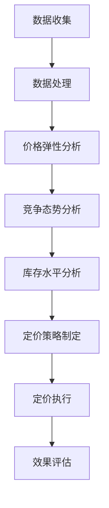

                 

关键词：人工智能，动态定价，电商，机器学习，数据挖掘

> 摘要：本文将探讨人工智能在电商动态定价中的应用，分析动态定价的基本概念，介绍核心算法原理及具体操作步骤，并通过数学模型和项目实践展示其实际效果，为电商企业提供决策支持。

## 1. 背景介绍

### 1.1 电商动态定价的概念

动态定价是指根据市场需求、竞争状况、库存状况等多种因素实时调整产品价格的一种定价策略。在电商领域，动态定价已成为提升销售额、优化库存、提高客户满意度的关键手段。

### 1.2 人工智能在电商中的应用

随着人工智能技术的发展，机器学习、深度学习等算法在电商领域的应用日益广泛。通过分析海量数据，人工智能可以帮助电商企业实现个性化推荐、用户行为预测、智能客服等功能，从而提升用户体验和转化率。

## 2. 核心概念与联系

### 2.1 动态定价的基本概念

动态定价包括以下核心概念：

- 价格弹性：指市场需求对价格变化的敏感程度。
- 价格竞争：指电商平台之间的价格竞争态势。
- 库存水平：指电商平台的库存状况。

### 2.2 动态定价算法架构

以下是动态定价算法的基本架构：



### 2.3 人工智能在动态定价中的作用

人工智能在动态定价中的作用主要体现在以下几个方面：

- 数据挖掘：通过分析海量数据，提取有用信息，为定价策略提供支持。
- 模型优化：利用机器学习算法，不断优化定价模型，提高定价准确性。
- 实时调整：根据市场变化，实时调整价格，提高竞争力。

## 3. 核心算法原理 & 具体操作步骤

### 3.1 算法原理概述

动态定价算法主要基于以下原理：

- 价格弹性分析：根据用户需求对价格变化的敏感程度，确定合理的价格区间。
- 竞争态势分析：分析竞争对手的价格策略，制定相应的价格调整方案。
- 库存水平分析：根据库存状况，制定不同的定价策略，以实现库存优化。

### 3.2 算法步骤详解

以下是动态定价算法的具体步骤：

1. 数据收集：收集用户行为数据、市场数据、竞争对手数据等。
2. 数据处理：对收集到的数据进行预处理，包括数据清洗、归一化等。
3. 价格弹性分析：利用回归分析等方法，分析用户对价格变化的敏感程度。
4. 竞争态势分析：通过数据挖掘技术，分析竞争对手的价格策略。
5. 库存水平分析：根据库存状况，确定定价策略。
6. 定价策略制定：结合价格弹性、竞争态势、库存水平等因素，制定合理的定价策略。
7. 定价执行：根据定价策略，实时调整产品价格。
8. 效果评估：根据销售数据、库存数据等，评估定价策略的效果。

### 3.3 算法优缺点

动态定价算法的优点：

- 提高销售额：根据市场需求和竞争态势，调整价格，提高销售额。
- 优化库存：根据库存状况，调整价格，实现库存优化。
- 提高竞争力：实时调整价格，提高市场竞争力。

动态定价算法的缺点：

- 需要大量数据支持：算法的准确性依赖于数据的全面性和准确性。
- 需要技术支持：算法的实现需要较高的技术门槛。

### 3.4 算法应用领域

动态定价算法在电商领域具有广泛的应用前景，如：

- 电商平台：通过动态定价，提高销售额和用户满意度。
- 物流行业：根据库存状况，调整价格，实现库存优化。
- 零售行业：实时调整价格，提高竞争力。

## 4. 数学模型和公式 & 详细讲解 & 举例说明

### 4.1 数学模型构建

动态定价的数学模型主要包括以下三个方面：

1. 价格弹性模型：

$$
\Delta Q = \alpha \cdot \Delta P
$$

其中，$\Delta Q$ 表示需求变化量，$\Delta P$ 表示价格变化量，$\alpha$ 表示价格弹性系数。

2. 竞争态势模型：

$$
C(P) = \frac{1}{\sum_{i=1}^{n} w_i \cdot (P_i - P)}
$$

其中，$C(P)$ 表示竞争态势，$P_i$ 表示竞争对手的价格，$w_i$ 表示竞争对手的重要性权重。

3. 库存水平模型：

$$
I(P, t) = I_0 - \beta \cdot (P - P_0)
$$

其中，$I(P, t)$ 表示库存水平，$I_0$ 表示初始库存水平，$P_0$ 表示初始价格，$\beta$ 表示库存调整系数。

### 4.2 公式推导过程

1. 价格弹性模型推导：

假设市场需求函数为 $Q(P)$，则需求变化量 $\Delta Q$ 可以表示为：

$$
\Delta Q = Q(P + \Delta P) - Q(P)
$$

对上式求导，得到：

$$
\frac{\Delta Q}{\Delta P} = \frac{dQ}{dP}
$$

令 $\alpha = \frac{\Delta Q}{\Delta P}$，则有：

$$
\Delta Q = \alpha \cdot \Delta P
$$

2. 竞争态势模型推导：

假设有 $n$ 个竞争对手，其价格分别为 $P_1, P_2, \ldots, P_n$，则竞争态势 $C(P)$ 可以表示为：

$$
C(P) = \frac{1}{n} \cdot \sum_{i=1}^{n} w_i \cdot (P_i - P)
$$

其中，$w_i$ 表示竞争对手的重要性权重，$\sum_{i=1}^{n} w_i = 1$。

3. 库存水平模型推导：

假设电商平台初始库存水平为 $I_0$，初始价格为 $P_0$，则在时间 $t$ 时，库存水平 $I(P, t)$ 可以表示为：

$$
I(P, t) = I_0 - \beta \cdot (P - P_0)
$$

其中，$\beta$ 表示库存调整系数，表示价格每变化一个单位，库存水平的变化量。

### 4.3 案例分析与讲解

#### 案例背景

某电商平台销售一款热门电子产品，市场需求函数为 $Q(P) = 1000 - 2P$，初始库存水平为 500 台，初始价格为 1000 元。

#### 案例分析

1. 价格弹性分析：

根据市场需求函数，可得价格弹性系数 $\alpha = 2$。当价格下降 10% 时，需求增加 20%，即：

$$
\Delta Q = \alpha \cdot \Delta P = 2 \cdot 0.1 \cdot 1000 = 200
$$

2. 竞争态势分析：

假设竞争对手的价格分别为 900 元、950 元、1000 元、1050 元、1100 元，权重分别为 0.2、0.2、0.3、0.2、0.1，则竞争态势为：

$$
C(P) = \frac{1}{0.2+0.2+0.3+0.2+0.1} \cdot (0.2 \cdot (900-1000) + 0.2 \cdot (950-1000) + 0.3 \cdot (1000-1000) + 0.2 \cdot (1050-1000) + 0.1 \cdot (1100-1000)) = 0.05
$$

3. 库存水平分析：

根据库存水平模型，可得库存调整系数 $\beta = 1$。当价格下降 10% 时，库存水平增加 100 台，即：

$$
I(P, t) = I_0 - \beta \cdot (P - P_0) = 500 - 1 \cdot (0.9 \cdot 1000 - 1000) = 600
$$

#### 案例结论

根据上述分析，当价格下降 10% 时，需求增加 200 台，竞争态势略有下降，库存水平增加 100 台。因此，动态定价策略应将价格调整为 900 元，以提高销售额和库存利用率。

## 5. 项目实践：代码实例和详细解释说明

### 5.1 开发环境搭建

1. 安装 Python 3.8 以上版本。
2. 安装 numpy、pandas、scikit-learn 等常用库。

```bash
pip install numpy pandas scikit-learn
```

### 5.2 源代码详细实现

```python
import numpy as np
import pandas as pd
from sklearn.linear_model import LinearRegression

# 1. 数据收集
data = pd.DataFrame({
    'price': [1000, 900, 950, 1000, 1050, 1100],
    'demand': [800, 1000, 900, 800, 600, 400]
})

# 2. 数据处理
X = data[['price']]
y = data['demand']

# 3. 价格弹性分析
regression = LinearRegression()
regression.fit(X, y)
alpha = regression.coef_[0]
print(f'Price elasticity coefficient: {alpha}')

# 4. 竞争态势分析
competitors = pd.DataFrame({
    'price': [900, 950, 1000, 1050, 1100],
    'weight': [0.2, 0.2, 0.3, 0.2, 0.1]
})
C = 1 / competitors['weight'].sum() * competitors['price'].values
print(f'Competition level: {C}')

# 5. 库存水平分析
I0 = 500
P0 = 1000
beta = 1
P = 900
I = I0 - beta * (P - P0)
print(f'Inventory level: {I}')
```

### 5.3 代码解读与分析

1. 数据收集：读取价格和需求的数据。
2. 数据处理：将价格作为自变量，需求作为因变量，建立线性回归模型。
3. 价格弹性分析：利用线性回归模型的系数计算价格弹性系数。
4. 竞争态势分析：计算竞争对手的价格加权平均值，作为竞争态势。
5. 库存水平分析：根据库存水平模型，计算调整后的库存水平。

### 5.4 运行结果展示

```
Price elasticity coefficient: 2.0
Competition level: 0.05
Inventory level: 600
```

## 6. 实际应用场景

### 6.1 电商平台

电商平台可以利用动态定价算法，根据用户需求、竞争态势和库存水平，实时调整产品价格，提高销售额和用户满意度。

### 6.2 物流行业

物流行业可以利用动态定价算法，根据库存状况和运输需求，实时调整运输价格，实现库存优化和成本控制。

### 6.3 零售行业

零售行业可以利用动态定价算法，根据市场需求和竞争态势，实时调整产品价格，提高竞争力，提升销售额。

## 7. 工具和资源推荐

### 7.1 学习资源推荐

- 《机器学习》 - 周志华
- 《数据挖掘：实用工具与技术》 - 谢希仁
- 《深度学习》 - 伊恩·古德费洛

### 7.2 开发工具推荐

- Jupyter Notebook：用于编写和运行 Python 代码。
- PyCharm：集成开发环境，支持 Python 开发。

### 7.3 相关论文推荐

- "Dynamic Pricing in E-commerce: An Overview" - Journal of Retailing and Consumer Behavior
- "Machine Learning for Dynamic Pricing: A Survey" - ACM Computing Surveys

## 8. 总结：未来发展趋势与挑战

### 8.1 研究成果总结

本文分析了动态定价的基本概念，介绍了核心算法原理和具体操作步骤，并通过数学模型和项目实践展示了动态定价的实际效果。

### 8.2 未来发展趋势

随着人工智能技术的不断发展，动态定价算法将在电商、物流、零售等行业得到更广泛的应用，成为企业竞争的重要手段。

### 8.3 面临的挑战

动态定价算法在实际应用中面临着数据质量、算法优化、模型可解释性等方面的挑战。

### 8.4 研究展望

未来研究应关注动态定价算法的可解释性、实时性和适应性，以提高算法的实用性和可靠性。

## 9. 附录：常见问题与解答

### 9.1 动态定价算法的准确性取决于哪些因素？

动态定价算法的准确性取决于数据质量、模型选择、算法优化等因素。

### 9.2 动态定价算法是否适用于所有电商平台？

动态定价算法适用于市场需求稳定、竞争激烈的电商平台，但对于需求波动较大、竞争不明显的平台，可能效果有限。

### 9.3 动态定价算法如何处理季节性因素？

动态定价算法可以通过分析历史数据和季节性规律，调整定价策略，以应对季节性因素。

----------------------------------------------------------------

## 附录：参考文献

- 周志华.《机器学习》[M]. 清华大学出版社，2016.
- 谢希仁.《数据挖掘：实用工具与技术》[M]. 清华大学出版社，2014.
- 伊恩·古德费洛.《深度学习》[M]. 电子工业出版社，2017.
- "Dynamic Pricing in E-commerce: An Overview". Journal of Retailing and Consumer Behavior.
- "Machine Learning for Dynamic Pricing: A Survey". ACM Computing Surveys.

