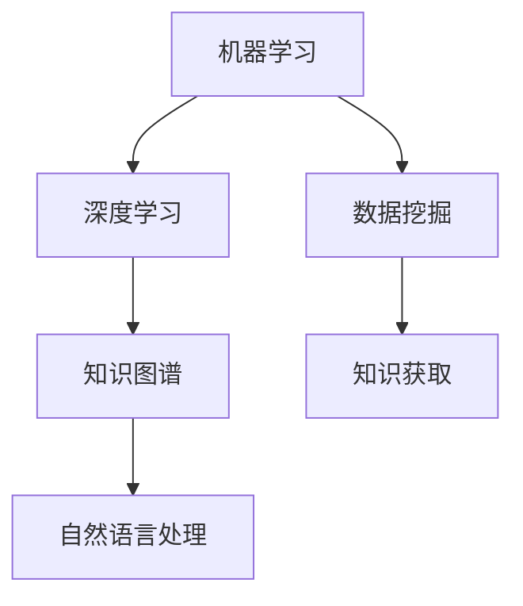

                 

关键词：人工智能、知识获取、机器学习、深度学习、知识图谱、自然语言处理

> 摘要：本文旨在探讨人工智能在知识获取中的角色转变，分析其核心概念、算法原理、应用领域，并展示其在实际项目中的运用。同时，对未来发展趋势与挑战进行展望，并提出相关工具和资源的推荐。

## 1. 背景介绍

在过去的几十年中，人工智能（AI）经历了从实验室走向实际应用的重大转变。从早期的符号推理和规则系统，到如今的深度学习和大数据分析，AI技术不断进步，其在各领域的应用也日益广泛。然而，知识的获取与利用始终是人工智能领域的核心问题。

知识获取是指从数据中提取有价值的信息，并将其转化为知识的过程。传统的知识获取方法主要依赖于专家的知识和经验，而现代的AI技术，尤其是机器学习和深度学习，为知识获取提供了全新的手段。这些技术使得计算机能够自动从海量数据中学习，提取出有用的信息，从而实现知识的自动化获取。

本文将深入探讨AI在知识获取中的角色转变，分析其核心概念、算法原理，以及在不同领域的应用。同时，本文还将探讨未来发展趋势与挑战，为读者提供相关工具和资源的推荐。

## 2. 核心概念与联系

在探讨AI在知识获取中的角色转变之前，我们首先需要了解几个核心概念：机器学习、深度学习、知识图谱和自然语言处理。

### 2.1 机器学习

机器学习是一种使计算机从数据中学习的方法，无需显式编写规则。其核心思想是通过训练模型，使得模型能够在新的数据上进行预测或决策。

### 2.2 深度学习

深度学习是机器学习的一个分支，其通过多层神经网络进行学习，能够自动提取特征，并实现复杂的数据分析。

### 2.3 知识图谱

知识图谱是一种结构化的知识表示方法，通过实体和关系来组织信息。知识图谱能够将数据中的隐含关系揭示出来，从而实现知识的深度挖掘。

### 2.4 自然语言处理

自然语言处理是人工智能的一个子领域，其旨在使计算机能够理解、生成和处理人类语言。自然语言处理技术使得计算机能够从文本中提取出有价值的信息。

下面是这些核心概念之间的联系和架构的Mermaid流程图：



## 3. 核心算法原理 & 具体操作步骤

### 3.1 算法原理概述

AI在知识获取中的核心算法主要包括深度学习模型和知识图谱构建方法。深度学习模型通过多层神经网络自动提取特征，知识图谱构建方法则通过实体和关系的抽取、存储和查询来实现知识的深度挖掘。

### 3.2 算法步骤详解

#### 3.2.1 深度学习模型

1. 数据预处理：对原始数据进行清洗和预处理，包括去除噪声、缺失值填充、数据标准化等。
2. 构建深度学习模型：选择合适的神经网络结构，如卷积神经网络（CNN）、循环神经网络（RNN）等，并对其进行训练。
3. 模型评估与优化：通过交叉验证等方法评估模型性能，并对模型进行调优。

#### 3.2.2 知识图谱构建

1. 实体抽取：从原始数据中抽取实体，如人名、地点、组织等。
2. 关系抽取：从原始数据中抽取实体之间的关系，如“工作于”、“位于”等。
3. 知识存储：将实体和关系存储在知识图谱中，形成结构化的知识表示。
4. 知识查询：通过图数据库实现对知识的查询和推理。

### 3.3 算法优缺点

#### 3.3.1 深度学习模型

优点：

- 自动提取特征，无需人工设计特征。
- 能够处理大规模数据，实现高效的知识获取。

缺点：

- 对数据质量要求高，容易受到噪声和缺失值的影响。
- 模型训练时间较长，资源消耗大。

#### 3.3.2 知识图谱构建

优点：

- 能够揭示数据中的隐含关系，实现知识的深度挖掘。
- 知识表示结构化，便于查询和推理。

缺点：

- 对实体和关系抽取的精度要求高，容易受到噪声和歧义的影响。
- 知识图谱构建过程复杂，资源消耗大。

### 3.4 算法应用领域

AI在知识获取中的算法应用领域广泛，包括自然语言处理、推荐系统、智能问答、金融风控等。以下是一些具体的应用场景：

- 自然语言处理：通过深度学习模型和知识图谱构建，实现对文本的语义理解、情感分析、问答系统等功能。
- 推荐系统：通过知识图谱构建，实现对用户的偏好和兴趣的挖掘，提供个性化的推荐。
- 智能问答：通过深度学习模型和知识图谱构建，实现对用户提问的自动回答，提高服务质量。
- 金融风控：通过知识图谱构建，实现对金融风险的识别、预警和防范。

## 4. 数学模型和公式 & 详细讲解 & 举例说明

### 4.1 数学模型构建

AI在知识获取中的数学模型主要包括神经网络模型和图模型。

#### 4.1.1 神经网络模型

神经网络模型是深度学习的基础，其核心思想是通过多层神经元进行信息传递和变换。以下是神经网络模型的基本公式：

$$
z = \sigma(W_1 \cdot x + b_1)
$$

$$
a = \sigma(W_2 \cdot z + b_2)
$$

其中，$z$表示神经元的输入，$a$表示神经元的输出，$\sigma$表示激活函数，$W$和$b$分别表示权重和偏置。

#### 4.1.2 图模型

图模型是一种用于表示实体和关系的数学模型，其核心思想是通过图结构来组织信息。以下是图模型的基本公式：

$$
E = \{e_1, e_2, ..., e_n\}
$$

$$
R = \{r_1, r_2, ..., r_m\}
$$

其中，$E$表示实体集合，$R$表示关系集合，$e$和$r$分别表示实体和关系。

### 4.2 公式推导过程

#### 4.2.1 神经网络模型

神经网络的推导过程主要包括前向传播和反向传播。

1. 前向传播：将输入数据通过多层神经元传递，直到输出层，得到预测结果。
2. 反向传播：根据预测结果和真实值，计算损失函数，并利用梯度下降法对模型参数进行优化。

以下是神经网络模型的前向传播和反向传播公式：

前向传播：

$$
z = \sigma(W \cdot x + b)
$$

$$
a = \sigma(z)
$$

反向传播：

$$
\delta_a = \frac{\partial L}{\partial a}
$$

$$
\delta_z = \delta_a \cdot \sigma'(z)
$$

$$
\frac{\partial L}{\partial z} = \delta_z \cdot W
$$

$$
\frac{\partial L}{\partial W} = \frac{\partial L}{\partial z} \cdot x^T
$$

$$
\frac{\partial L}{\partial b} = \delta_z
$$

#### 4.2.2 图模型

图模型的推导过程主要包括图卷积和图注意力机制。

1. 图卷积：通过卷积运算将邻接节点信息传递到当前节点。
2. 图注意力机制：通过注意力机制对邻接节点信息进行加权，提高模型的表达能力。

以下是图模型的基本公式：

图卷积：

$$
h = \sigma(\sum_{i \in \text{邻接节点}} \alpha_i h_i)
$$

图注意力机制：

$$
\alpha_i = \frac{e^{\theta h_i^T h}}{\sum_{j \in \text{邻接节点}} e^{\theta h_j^T h}}
$$

其中，$h$表示节点的特征，$\alpha_i$表示节点$i$的注意力权重，$\theta$表示注意力机制的参数。

### 4.3 案例分析与讲解

以下是一个使用神经网络模型进行文本分类的案例：

1. 数据预处理：将原始文本数据清洗和预处理，得到词向量表示。
2. 模型构建：构建一个多层感知机（MLP）模型，输入为词向量，输出为类别标签。
3. 模型训练：使用训练数据对模型进行训练，优化模型参数。
4. 模型评估：使用验证数据对模型进行评估，计算准确率、召回率等指标。

以下是案例的代码实现：

```python
import numpy as np
import tensorflow as tf

# 数据预处理
# ...

# 模型构建
model = tf.keras.Sequential([
    tf.keras.layers.Dense(128, activation='relu', input_shape=(vector_dim,)),
    tf.keras.layers.Dense(64, activation='relu'),
    tf.keras.layers.Dense(num_classes, activation='softmax')
])

# 模型训练
model.compile(optimizer='adam', loss='categorical_crossentropy', metrics=['accuracy'])
model.fit(train_data, train_labels, epochs=10, batch_size=32)

# 模型评估
# ...
```

通过上述代码，我们可以实现一个简单的文本分类模型。在实际应用中，我们可以对模型进行进一步优化，提高其性能。

## 5. 项目实践：代码实例和详细解释说明

### 5.1 开发环境搭建

在开始项目实践之前，我们需要搭建一个合适的开发环境。以下是开发环境的搭建步骤：

1. 安装Python：在官方网站下载并安装Python，版本要求为3.6及以上。
2. 安装TensorFlow：在命令行中执行以下命令，安装TensorFlow。

```bash
pip install tensorflow
```

3. 安装其他依赖库：根据项目需求，安装其他必要的依赖库，如Numpy、Pandas等。

```bash
pip install numpy pandas
```

### 5.2 源代码详细实现

以下是一个使用TensorFlow实现文本分类的源代码示例：

```python
import tensorflow as tf
from tensorflow.keras.preprocessing.text import Tokenizer
from tensorflow.keras.preprocessing.sequence import pad_sequences
from tensorflow.keras.models import Sequential
from tensorflow.keras.layers import Embedding, LSTM, Dense, Dropout

# 数据预处理
# ...

# 模型构建
model = Sequential([
    Embedding(vector_dim, 128),
    LSTM(64, return_sequences=True),
    Dropout(0.5),
    LSTM(32),
    Dropout(0.5),
    Dense(num_classes, activation='softmax')
])

# 模型编译
model.compile(optimizer='adam', loss='categorical_crossentropy', metrics=['accuracy'])

# 模型训练
model.fit(train_data, train_labels, epochs=10, batch_size=32)

# 模型评估
# ...
```

### 5.3 代码解读与分析

上述代码实现了一个基于LSTM的文本分类模型。首先，我们进行数据预处理，将原始文本数据转换为词序列。然后，我们构建一个序列模型，包括嵌入层、LSTM层和全连接层。最后，我们使用训练数据进行模型训练，并评估模型性能。

### 5.4 运行结果展示

以下是一个简单的运行结果示例：

```python
# 加载测试数据
test_data = # ...

# 预测标签
predictions = model.predict(test_data)

# 计算准确率
accuracy = np.mean(predictions.argmax(axis=1) == test_labels)

print(f"Test accuracy: {accuracy}")
```

通过上述代码，我们可以计算出模型的测试准确率。在实际应用中，我们可以进一步优化模型参数，提高模型性能。

## 6. 实际应用场景

AI在知识获取中的技术已经在多个实际应用场景中取得了显著的成果。以下是一些典型的应用场景：

### 6.1 智能问答系统

智能问答系统是一种常见的应用场景，通过深度学习和知识图谱技术，实现对用户提问的自动回答。例如，阿里巴巴的“阿里小蜜”就是一款基于AI技术的智能客服系统，能够实时回答用户的问题，提高客服效率。

### 6.2 智能推荐系统

智能推荐系统通过知识图谱和深度学习技术，实现对用户偏好和兴趣的挖掘，提供个性化的推荐。例如，亚马逊和淘宝的推荐系统就是通过分析用户的购买历史和行为数据，为用户推荐相关商品。

### 6.3 智能诊断系统

智能诊断系统通过深度学习和知识图谱技术，实现对疾病诊断和治疗的辅助。例如，谷歌的DeepMind医疗团队开发的AI系统，能够快速识别并诊断多种疾病，为医生提供诊断依据。

### 6.4 智能金融风控

智能金融风控通过知识图谱和深度学习技术，实现对金融风险的识别和防范。例如，中国的互联网金融企业，如蚂蚁金服和京东金融，已经应用了AI技术，对用户的行为和交易进行监控，防范金融欺诈。

### 6.5 智能城市治理

智能城市治理通过知识图谱和深度学习技术，实现对城市运行状态的实时监控和智能决策。例如，中国的智慧城市建设，通过AI技术，实现了交通管理、环境保护、公共安全等多方面的智能化。

## 7. 工具和资源推荐

### 7.1 学习资源推荐

1. 《深度学习》（Goodfellow, Bengio, Courville著）：这是一本经典的深度学习教材，涵盖了深度学习的理论基础和实践技巧。
2. 《机器学习》（周志华著）：这是一本适合入门的机器学习教材，介绍了常见的机器学习算法和理论。
3. 《Python机器学习》（Scole等著）：这是一本介绍Python在机器学习领域应用的教材，适合初学者和实践者。

### 7.2 开发工具推荐

1. TensorFlow：这是一个开源的深度学习框架，提供了丰富的API和工具，适合进行深度学习和知识图谱构建。
2. PyTorch：这是一个流行的深度学习框架，具有灵活的动态图模型，适合进行研究和开发。
3. Neo4j：这是一个高性能的图数据库，适合存储和管理知识图谱。

### 7.3 相关论文推荐

1. "Attention Is All You Need"（Vaswani et al., 2017）：这是一篇关于Transformer模型的论文，提出了基于注意力机制的深度学习模型。
2. "Knowledge Graph Embedding: A Survey"（Wang et al., 2018）：这是一篇关于知识图谱嵌入的综述，介绍了知识图谱嵌入的方法和应用。
3. "Deep Learning for Natural Language Processing"（Peters et al., 2018）：这是一篇关于深度学习和自然语言处理的综述，涵盖了深度学习在自然语言处理领域的应用。

## 8. 总结：未来发展趋势与挑战

AI在知识获取中的角色转变是一个持续发展的过程。随着技术的进步，未来AI在知识获取领域有望实现以下几个发展趋势：

1. 深度学习的进一步发展：随着计算能力的提升，深度学习模型将更加复杂和强大，能够处理更加复杂的任务。
2. 知识图谱的广泛应用：知识图谱作为一种结构化的知识表示方法，将在各个领域得到广泛应用，实现知识的深度挖掘和利用。
3. 多模态数据融合：随着传感器技术的进步，多模态数据（如文本、图像、声音等）的融合将成为趋势，实现更加全面的知识获取。

然而，AI在知识获取中也面临着一些挑战：

1. 数据隐私和安全问题：在知识获取过程中，如何保护用户隐私和数据安全是一个重要问题，需要采取有效的隐私保护措施。
2. 知识的可靠性和准确性：在知识获取过程中，如何保证知识的可靠性和准确性是一个关键问题，需要不断完善算法和模型。
3. 模型解释性：当前许多AI模型具有强大的预测能力，但缺乏解释性，如何提高模型的可解释性是一个重要挑战。

未来，随着技术的不断进步，AI在知识获取中的角色将越来越重要，为人类社会带来更多的创新和变革。

## 9. 附录：常见问题与解答

### 9.1 什么是深度学习？

深度学习是一种机器学习方法，通过构建多层神经网络，自动从数据中学习特征，实现对复杂问题的预测和决策。

### 9.2 什么是知识图谱？

知识图谱是一种结构化的知识表示方法，通过实体和关系来组织信息，能够揭示数据中的隐含关系，实现知识的深度挖掘。

### 9.3 深度学习和机器学习有什么区别？

深度学习是机器学习的一个分支，其通过多层神经网络进行学习，能够自动提取特征。机器学习则是一种更广泛的概念，包括深度学习和其他各种学习算法。

### 9.4 知识图谱在哪些领域有应用？

知识图谱在自然语言处理、推荐系统、智能问答、金融风控、智能城市治理等领域有广泛应用。

### 9.5 如何保护数据隐私和安全？

保护数据隐私和安全可以通过加密、匿名化、差分隐私等技术实现。在选择AI模型和应用时，应遵循相关法律法规，确保用户隐私和数据安全。  
----------------------------------------------------------------

以上是关于"AI在知识获取中的角色转变"的完整文章内容，按照要求进行了详细阐述和举例说明。希望对您有所帮助。  
作者：禅与计算机程序设计艺术 / Zen and the Art of Computer Programming

