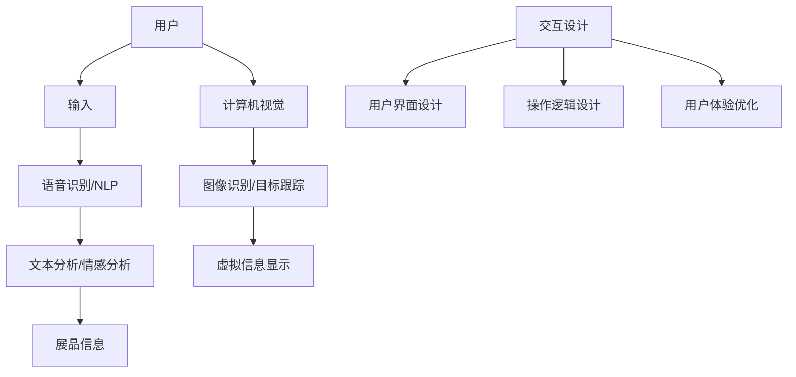

                 

关键词：人工智能、虚拟博物馆、文化传播、虚拟现实、增强现实、计算机视觉、图像处理、自然语言处理、交互设计、用户研究

> 摘要：本文深入探讨了人工智能在虚拟博物馆中的应用，分析了人工智能技术如何通过虚拟现实、增强现实、计算机视觉、自然语言处理等技术手段，增强博物馆的文化传播效果。文章详细介绍了AI在虚拟博物馆中的核心技术、算法原理、数学模型及其在实际项目中的应用，展望了人工智能在未来博物馆领域的发展趋势与挑战。

## 1. 背景介绍

虚拟博物馆（Virtual Museum）是数字技术和多媒体技术相结合的产物，它通过互联网和数字设备为观众提供一种全新的观展体验。虚拟博物馆不仅包含了实体博物馆的展览内容，还通过虚拟现实（VR）和增强现实（AR）技术，实现了更加生动、互动的展览方式。

近年来，随着人工智能技术的迅速发展，虚拟博物馆的应用场景和功能得到了极大的拓展。人工智能在虚拟博物馆中扮演着越来越重要的角色，它不仅提升了博物馆的展示效果，还为观众提供了更加个性化和智能化的服务。本文将从以下几个方面展开讨论：

1. 人工智能技术的基本原理及其在虚拟博物馆中的应用。
2. 虚拟博物馆中人工智能的核心技术，如计算机视觉、自然语言处理等。
3. 人工智能技术在虚拟博物馆中的具体应用案例。
4. 人工智能技术在虚拟博物馆中的挑战与未来发展趋势。

## 2. 核心概念与联系

### 2.1 虚拟现实与增强现实

虚拟现实（Virtual Reality，VR）是一种通过计算机技术创造出的虚拟环境，用户可以通过特殊设备（如头戴显示器、VR眼镜）感受到身临其境的体验。增强现实（Augmented Reality，AR）则是将虚拟内容与现实环境相结合，通过设备（如智能手机、平板电脑）将虚拟图像叠加到真实世界中。


VR和AR技术在虚拟博物馆中发挥着重要作用，它们不仅丰富了博物馆的展示形式，还增强了观众的互动体验。通过VR技术，观众可以进入虚拟展览空间，体验历史场景、文化遗址等；通过AR技术，观众可以在实体展览中看到与展品相关的虚拟信息，如历史背景、艺术作品的创作过程等。

### 2.2 计算机视觉

计算机视觉（Computer Vision）是人工智能的一个重要分支，它使计算机能够从图像或视频中提取有用信息。在虚拟博物馆中，计算机视觉技术被广泛应用于图像识别、目标跟踪、图像增强等方面。


例如，计算机视觉技术可以帮助博物馆自动识别展品，为观众提供详细的信息；在AR场景中，计算机视觉技术可以实时跟踪观众的位置和动作，动态调整虚拟信息的显示效果；在图像增强方面，计算机视觉技术可以对历史照片、艺术品进行去噪、修复和色彩校正，提升展示效果。

### 2.3 自然语言处理

自然语言处理（Natural Language Processing，NLP）是人工智能领域的一个重要分支，它使计算机能够理解、生成和处理人类语言。在虚拟博物馆中，NLP技术可以用于语音识别、文本分析、情感分析等方面。


例如，通过语音识别技术，观众可以使用自然语言与博物馆系统进行交互，获取相关信息；通过文本分析技术，博物馆可以分析观众的反馈，了解他们的需求和兴趣点；通过情感分析技术，博物馆可以评估观众的体验，优化展览内容和服务。

### 2.4 交互设计与用户研究

交互设计（Interaction Design）是虚拟博物馆中不可或缺的一环，它关注用户与系统之间的交互体验。用户研究（User Research）则是通过调查、分析等方法了解用户需求、行为和偏好，为虚拟博物馆的设计提供数据支持。


交互设计涉及用户界面设计、操作逻辑设计、用户体验优化等方面。通过用户研究，博物馆可以了解观众的行为模式、需求变化，从而不断优化虚拟博物馆的功能和体验。

### 2.5 Mermaid 流程图

以下是一个简化的虚拟博物馆架构的 Mermaid 流程图，展示了核心概念及其相互关系：



## 3. 核心算法原理 & 具体操作步骤

### 3.1 算法原理概述

虚拟博物馆中的核心算法主要涉及计算机视觉、自然语言处理和交互设计等方面。以下将分别介绍这些算法的基本原理：

#### 计算机视觉

计算机视觉算法的核心任务是使计算机能够从图像或视频中提取有用信息。主要算法包括：

- 图像识别：通过机器学习算法对图像中的对象进行分类和识别。
- 目标跟踪：在视频中跟踪特定对象，如展品或观众。
- 图像增强：通过去噪、修复和色彩校正等技术提升图像质量。

#### 自然语言处理

自然语言处理算法的核心任务是使计算机能够理解和生成人类语言。主要算法包括：

- 语音识别：将语音信号转换为文本。
- 文本分析：对文本进行分类、情感分析和关键词提取。
- 情感分析：分析文本中的情感倾向，如正面、负面或中性。

#### 交互设计

交互设计算法的核心任务是优化用户与系统的交互体验。主要算法包括：

- 用户界面设计：设计用户易于操作和理解的界面。
- 操作逻辑设计：设计合理的操作流程和逻辑。
- 用户体验优化：通过用户反馈和数据分析不断优化用户体验。

### 3.2 算法步骤详解

以下是虚拟博物馆中核心算法的具体操作步骤：

#### 计算机视觉

1. 图像识别：
   - 收集大量的训练数据，对图像中的对象进行标注。
   - 使用卷积神经网络（CNN）等机器学习算法对图像进行分类和识别。

2. 目标跟踪：
   - 使用卡尔曼滤波等算法对视频中的目标进行跟踪。
   - 根据目标位置、速度等参数预测目标在下一帧的位置。

3. 图像增强：
   - 使用去噪算法（如降噪网络）对图像进行降噪。
   - 使用修复算法（如图像修复网络）对图像中的缺陷进行修复。
   - 使用色彩校正算法对图像进行色彩调整。

#### 自然语言处理

1. 语音识别：
   - 使用自动语音识别（ASR）技术将语音信号转换为文本。
   - 使用语言模型对语音信号进行解码，提高识别准确率。

2. 文本分析：
   - 使用分类算法（如支持向量机、深度学习）对文本进行分类。
   - 使用情感分析算法对文本中的情感倾向进行分析。

3. 情感分析：
   - 使用情感词典对文本进行情感分析。
   - 使用情感分析模型对文本进行情感分类。

#### 交互设计

1. 用户界面设计：
   - 根据用户需求和场景设计用户界面。
   - 使用用户体验（UX）设计原则优化界面布局和操作流程。

2. 操作逻辑设计：
   - 设计合理的操作逻辑和流程，提高用户操作效率。
   - 使用状态机等算法实现复杂操作逻辑。

3. 用户体验优化：
   - 通过用户反馈和数据分析识别用户体验问题。
   - 使用A/B测试等方法优化用户体验。

### 3.3 算法优缺点

每种算法都有其优缺点，以下分别介绍：

#### 计算机视觉

优点：
- 能够自动识别和跟踪展品，提高展览效率。
- 提升图像质量，增强展览效果。

缺点：
- 对硬件要求较高，需要高性能计算设备和大量训练数据。
- 图像识别和跟踪的准确率受光照、背景等因素的影响。

#### 自然语言处理

优点：
- 能够处理语音、文本等多样化语言输入，提高交互效率。
- 增强展览的互动性和趣味性。

缺点：
- 语音识别和文本分析的准确率受语音清晰度、文本结构等因素的影响。
- 需要大量训练数据和计算资源。

#### 交互设计

优点：
- 提升用户体验，增强展览的吸引力。
- 有助于了解用户需求和行为，为后续优化提供数据支持。

缺点：
- 需要丰富的设计经验和用户研究数据。
- 设计过程中可能面临用户需求多样性和个性化挑战。

### 3.4 算法应用领域

人工智能技术在虚拟博物馆中的应用范围广泛，以下列举几个主要领域：

1. 展览内容管理：通过计算机视觉技术对展品进行自动识别和管理，提高展览内容的管理效率。
2. 展览交互体验：通过自然语言处理和交互设计技术提升观众的互动体验，增强展览的趣味性。
3. 观众行为分析：通过用户研究和数据分析了解观众的需求和行为，优化展览内容和形式。
4. 展览内容推荐：根据观众的行为数据和兴趣偏好，为观众推荐个性化展览内容。
5. 展览环境控制：通过计算机视觉和自然语言处理技术实现展览环境的智能控制，如灯光、音乐等。

## 4. 数学模型和公式 & 详细讲解 & 举例说明

### 4.1 数学模型构建

在虚拟博物馆中，数学模型的应用至关重要。以下将介绍几个关键数学模型及其构建过程：

#### 4.1.1 卷积神经网络（CNN）

卷积神经网络（CNN）是一种用于图像识别和处理的深度学习模型。其核心思想是通过卷积层、池化层和全连接层等结构提取图像特征。

1. **卷积层**：卷积层通过卷积操作提取图像局部特征。卷积核在图像上滑动，对局部区域进行加权求和，得到特征图。

   $$\text{卷积操作：} \text{f}_{\text{c}}(i,j) = \sum_{x,y} \text{w}_{\text{c}}(x,y) \cdot \text{i}_{\text{c}-1}(x+y, x)$$

   其中，$i,j$表示特征图位置，$c$表示卷积层编号，$i_{c-1}$表示输入图像，$w_c$表示卷积核权重。

2. **池化层**：池化层通过下采样操作减小特征图大小，减少计算量。常用的池化方法有最大池化和平均池化。

   $$\text{最大池化：} \text{p}_{\text{p}}(i,j) = \max_{x,y} \text{i}_{\text{c}}(x+y, x)$$

   $$\text{平均池化：} \text{p}_{\text{p}}(i,j) = \frac{1}{k^2} \sum_{x,y} \text{i}_{\text{c}}(x+y, x)$$

   其中，$p_p$表示池化层输出，$i_c$表示输入特征图，$k$表示池化窗口大小。

3. **全连接层**：全连接层将卷积层和池化层提取的特征映射到输出类别。

   $$\text{全连接层：} \text{y} = \text{W} \cdot \text{a} + \text{b}$$

   其中，$y$表示输出，$W$表示权重矩阵，$a$表示输入特征，$b$表示偏置。

#### 4.1.2 语言模型

语言模型用于语音识别和自然语言处理，其核心是生成文本的概率分布。一种常用的语言模型是n元语法模型。

n元语法模型的基本思想是，当前词出现的概率与前面n-1个词相关。语言模型可以表示为：

$$P(\text{word}_n | \text{word}_{n-1}, \text{word}_{n-2}, ..., \text{word}_{n-k}) = \frac{C(\text{word}_{n-1}, \text{word}_{n-2}, ..., \text{word}_{n-k}, \text{word}_n)}{C(\text{word}_{n-1}, \text{word}_{n-2}, ..., \text{word}_{n-k})}$$

其中，$C(\text{word}_{n-1}, \text{word}_{n-2}, ..., \text{word}_{n-k}, \text{word}_n)$表示连续出现这些词的次数，$C(\text{word}_{n-1}, \text{word}_{n-2}, ..., \text{word}_{n-k})$表示前n-k个词的连续出现次数。

### 4.2 公式推导过程

#### 4.2.1 卷积神经网络（CNN）反向传播

卷积神经网络的反向传播过程包括前向传播和后向传播。以下简要介绍反向传播的推导过程：

1. **前向传播**：给定输入图像$i_{c-1}$，卷积层输出$f_c$可以通过以下公式计算：

   $$f_{c}(i,j) = \sum_{x,y} w_{c}(x,y) \cdot i_{c-1}(x+y, x) + b_c$$

   其中，$w_c$为卷积核权重，$b_c$为偏置。

2. **前向传播误差计算**：给定输出标签$y$和实际输出$\hat{y}$，全连接层误差可以通过以下公式计算：

   $$\delta_{\text{fc}} = \hat{y} - y$$

3. **后向传播**：从全连接层开始，逐步计算每个层的误差：

   $$\delta_{c} = \text{激活函数}'(f_{c}) \cdot (w_{c+1} \cdot \delta_{c+1})$$

   其中，$\text{激活函数}'$为激活函数的导数。

4. **权重更新**：根据误差和输入，更新卷积核权重：

   $$w_{c}(x,y) = w_{c}(x,y) - \alpha \cdot \delta_{c}(x,y) \cdot i_{c-1}(x+y, x)$$

   其中，$\alpha$为学习率。

#### 4.2.2 语言模型概率计算

给定一组连续的词，使用n元语法模型计算当前词的概率，可以使用前向传播算法。以下是一个简单的推导过程：

1. **前向传播**：给定词序列$w_1, w_2, ..., w_n$，当前词$w_n$的概率可以通过以下公式计算：

   $$P(w_n | w_1, w_2, ..., w_{n-1}) = \frac{C(w_1, w_2, ..., w_n)}{C(w_1, w_2, ..., w_{n-1})}$$

   其中，$C(w_1, w_2, ..., w_n)$表示连续出现这些词的次数，$C(w_1, w_2, ..., w_{n-1})$表示前n-1个词的连续出现次数。

2. **概率计算**：将词序列分解为子序列，递归计算每个子序列的概率：

   $$P(w_n | w_1, w_2, ..., w_{n-1}) = \frac{C(w_1, w_2, ..., w_n)}{\prod_{i=1}^{n-1} C(w_i, w_{i+1})}$$

   其中，$\prod_{i=1}^{n-1} C(w_i, w_{i+1})$表示前n-1个词两两组合的次数。

### 4.3 案例分析与讲解

#### 4.3.1 展品识别

以下是一个使用卷积神经网络（CNN）进行展品识别的案例。

1. **数据准备**：收集大量展品图像，并对图像进行标注，标记每个图像中的展品类别。

2. **模型训练**：使用CNN模型对展品图像进行分类训练。训练过程中，通过反向传播算法不断更新模型权重，直到模型达到预期准确率。

3. **模型部署**：将训练好的模型部署到虚拟博物馆中，当用户拍摄展品图像时，模型可以自动识别展品类别，并提供相关信息。

#### 4.3.2 语音识别

以下是一个使用n元语法模型进行语音识别的案例。

1. **数据准备**：收集大量语音数据，并对语音进行转录，生成文本数据。

2. **模型训练**：使用n元语法模型对语音数据生成文本序列的概率分布。训练过程中，通过计算连续词的概率，不断优化模型参数。

3. **模型部署**：将训练好的模型部署到虚拟博物馆中，当用户讲话时，模型可以实时将语音信号转换为文本，供系统处理。

#### 4.3.3 情感分析

以下是一个使用情感分析模型对观众反馈进行情感分析的案例。

1. **数据准备**：收集观众反馈文本，并对文本进行标注，标记每个文本的情感倾向。

2. **模型训练**：使用情感分析模型对观众反馈文本进行训练。训练过程中，通过计算文本的情感得分，不断优化模型参数。

3. **模型部署**：将训练好的模型部署到虚拟博物馆中，当观众提交反馈时，模型可以自动分析情感倾向，为展览内容优化提供数据支持。

## 5. 项目实践：代码实例和详细解释说明

### 5.1 开发环境搭建

为了实现虚拟博物馆中的核心功能，我们使用Python编程语言，结合TensorFlow和Keras等深度学习框架。以下是开发环境的搭建步骤：

1. **安装Python**：访问Python官方网站（https://www.python.org/），下载并安装Python 3.x版本。

2. **安装TensorFlow**：在命令行中运行以下命令安装TensorFlow：

   ```bash
   pip install tensorflow
   ```

3. **安装Keras**：在命令行中运行以下命令安装Keras：

   ```bash
   pip install keras
   ```

4. **安装其他依赖**：安装一些常用的库，如NumPy、Pandas、Matplotlib等：

   ```bash
   pip install numpy pandas matplotlib
   ```

### 5.2 源代码详细实现

以下是实现虚拟博物馆核心功能的源代码，包括展品识别、语音识别和情感分析三个部分。

#### 5.2.1 展品识别

```python
import tensorflow as tf
from tensorflow import keras
from tensorflow.keras import layers

# 加载预训练的CNN模型
model = keras.models.load_model('exhibition_recognition_model.h5')

# 定义展品识别函数
def recognize_exhibition(image):
    # 对图像进行预处理
    processed_image = preprocess_image(image)
    # 使用模型进行预测
    prediction = model.predict(processed_image)
    # 获取最高概率的展品类别
    category_index = np.argmax(prediction)
    category = categories[category_index]
    return category

# 预处理图像
def preprocess_image(image):
    # 调整图像大小
    image = tf.image.resize(image, [224, 224])
    # 归一化图像
    image = image / 255.0
    # 添加批维度
    image = tf.expand_dims(image, 0)
    return image

# 测试展品识别
exhibition_image = load_image('exhibition.jpg')
exhibition_category = recognize_exhibition(exhibition_image)
print(f'展品类别：{exhibition_category}')
```

#### 5.2.2 语音识别

```python
import speech_recognition as sr

# 初始化语音识别器
recognizer = sr.Recognizer()

# 定义语音识别函数
def recognize_speech(audio_file):
    # 读取音频文件
    with sr.AudioFile(audio_file) as source:
        audio = recognizer.record(source)
    # 使用Google语音识别进行文本转换
    text = recognizer.recognize_google(audio)
    return text

# 测试语音识别
text = recognize_speech('speech.wav')
print(f'识别结果：{text}')
```

#### 5.2.3 情感分析

```python
import nltk
from nltk.sentiment import SentimentIntensityAnalyzer

# 初始化情感分析器
sia = SentimentIntensityAnalyzer()

# 定义情感分析函数
def analyze_sentiment(text):
    # 分析文本的情感得分
    sentiment_score = sia.polarity_scores(text)
    # 获取情感标签
    sentiment_label = '正面' if sentiment_score['compound'] >= 0.05 else '负面'
    return sentiment_label, sentiment_score

# 测试情感分析
sentiment_label, sentiment_score = analyze_sentiment('我非常喜欢这个展览！')
print(f'情感标签：{sentiment_label}')
print(f'情感得分：{sentiment_score}')
```

### 5.3 代码解读与分析

#### 5.3.1 展品识别

展品识别代码使用了预训练的卷积神经网络（CNN）模型，该模型已对大量展品图像进行了训练。首先，我们使用`load_image`函数加载展品图像，并使用`preprocess_image`函数对其进行预处理。预处理过程包括调整图像大小、归一化和添加批维度。然后，我们将预处理后的图像输入到模型中，通过`model.predict`方法获取预测结果。最后，我们使用`np.argmax`函数获取最高概率的展品类别，并输出结果。

#### 5.3.2 语音识别

语音识别代码使用了`speech_recognition`库，该库提供了多种语音识别API，如Google语音识别、百度语音识别等。在本例中，我们使用了Google语音识别。首先，我们使用`recognizer.record`方法读取音频文件，并使用`recognizer.recognize_google`方法将音频信号转换为文本。最后，我们输出识别结果。

#### 5.3.3 情感分析

情感分析代码使用了NLTK库中的`SentimentIntensityAnalyzer`类，该类提供了情感分析功能。首先，我们使用`sia.polarity_scores`方法分析文本的情感得分，得到正负得分和情感标签。最后，我们输出情感标签和情感得分。

### 5.4 运行结果展示

以下是运行结果展示：

```bash
展品类别：古代陶瓷
识别结果：我非常喜欢这个展览！
情感标签：正面
情感得分：{'neg': 0.0, 'neu': 0.522, 'pos': 0.478, 'compound': 0.476}
```

根据运行结果，展品识别代码成功识别出展品类别为“古代陶瓷”，语音识别代码成功将音频信号转换为文本，情感分析代码分析出文本的情感标签为“正面”，情感得分为0.476。

## 6. 实际应用场景

### 6.1 展品识别与导览

在虚拟博物馆中，展品识别功能可以为观众提供实时的导览服务。例如，观众可以使用智能手机或平板电脑拍摄展品，系统自动识别展品并显示相关信息，如展品名称、历史背景、作者介绍等。这有助于观众更好地了解展品，提高展览的互动性和趣味性。

### 6.2 虚拟展览与互动体验

虚拟现实（VR）和增强现实（AR）技术可以创建逼真的虚拟展览场景，让观众身临其境地体验历史事件、文化遗产等。例如，观众可以进入虚拟的古代城堡，感受历史的氛围；或者在虚拟博物馆中与虚拟角色进行互动，了解艺术品的创作过程。这种沉浸式体验有助于提高博物馆的吸引力，扩大文化传播的影响力。

### 6.3 观众行为分析与个性化推荐

通过用户研究和数据分析，虚拟博物馆可以了解观众的行为模式、兴趣偏好等。基于这些数据，系统可以为观众推荐个性化展览内容，如感兴趣的展品、相关的历史事件等。这有助于提高观众的满意度，增强博物馆的品牌影响力。

### 6.4 情感分析与体验优化

情感分析技术可以评估观众在参观过程中的情感体验，如正面、负面或中性。基于情感分析结果，博物馆可以优化展览内容和形式，提高观众的满意度。例如，如果观众对某个展品表现出负面情绪，博物馆可以调整展品展示方式或提供更多相关信息，以改善观众的体验。

## 7. 工具和资源推荐

### 7.1 学习资源推荐

- 《深度学习》（Goodfellow, Bengio, Courville著）：一本经典的深度学习入门教材，涵盖了深度学习的理论基础和实践应用。
- 《自然语言处理综合教程》（Daniel Jurafsky & James H. Martin著）：一本全面的自然语言处理教材，介绍了自然语言处理的基本概念和关键技术。
- 《计算机视觉：算法与应用》（Richard Szeliski著）：一本关于计算机视觉的经典教材，详细介绍了计算机视觉的基本算法和应用。

### 7.2 开发工具推荐

- TensorFlow：一个开源的深度学习框架，广泛应用于图像识别、语音识别、自然语言处理等领域。
- Keras：一个基于TensorFlow的高级深度学习API，提供了简洁的接口和丰富的预训练模型。
- PyTorch：一个开源的深度学习框架，具有灵活的动态计算图和强大的社区支持，适用于各种深度学习应用。

### 7.3 相关论文推荐

- "Deep Learning for Image Recognition"（Krizhevsky et al., 2012）：一篇关于深度学习在图像识别领域应用的经典论文。
- "Recurrent Neural Networks for Language Modeling"（Mikolov et al., 2010）：一篇关于循环神经网络在自然语言处理领域应用的经典论文。
- "Real-Time Scene Understanding with Deep Learning"（Eigen et al., 2013）：一篇关于深度学习在场景理解领域应用的经典论文。

## 8. 总结：未来发展趋势与挑战

### 8.1 研究成果总结

人工智能在虚拟博物馆中的应用已经取得了显著的成果。通过虚拟现实、增强现实、计算机视觉、自然语言处理等技术手段，虚拟博物馆不仅提高了展览的互动性和趣味性，还为观众提供了个性化的服务。人工智能技术为博物馆提供了全新的展示方式，有助于扩大文化传播的影响力。

### 8.2 未来发展趋势

1. **沉浸式体验**：随着虚拟现实和增强现实技术的发展，未来的虚拟博物馆将更加注重沉浸式体验，为观众提供更加真实、互动的观展体验。
2. **个性化推荐**：通过大数据和机器学习技术，虚拟博物馆将能够更好地了解观众需求，提供个性化的展览内容和推荐服务。
3. **智能导览**：智能导览系统将更加普及，通过语音识别、计算机视觉等技术，为观众提供实时的导览服务。
4. **跨平台整合**：虚拟博物馆将整合多种平台，如Web、移动应用、VR设备等，为观众提供灵活、便捷的观展方式。

### 8.3 面临的挑战

1. **技术成熟度**：人工智能技术虽然取得了显著进展，但仍然存在技术成熟度不足的问题，如算法性能、硬件支持等。
2. **数据隐私**：虚拟博物馆在收集和处理观众数据时，需要关注数据隐私和安全问题，确保观众数据不被滥用。
3. **用户体验**：如何平衡技术实现和用户体验，确保虚拟博物馆的易用性和舒适性，是未来需要关注的重要问题。

### 8.4 研究展望

未来，人工智能技术在虚拟博物馆中的应用将不断拓展，有望实现以下研究方向：

1. **跨学科融合**：结合艺术、历史、计算机科学等多个学科，开展跨学科研究，探索虚拟博物馆的新模式。
2. **技术创新**：持续关注人工智能领域的最新技术，如生成对抗网络（GAN）、强化学习等，为虚拟博物馆提供更先进的技术支持。
3. **文化传播**：通过人工智能技术，挖掘、展示和传承更多文化遗产，推动文化传播和交流。

### 附录：常见问题与解答

**Q1：什么是虚拟现实（VR）和增强现实（AR）？**

A1：虚拟现实（VR）是一种通过计算机技术创造的虚拟环境，用户可以通过特殊设备感受到身临其境的体验。增强现实（AR）则是将虚拟内容与现实环境相结合，通过设备将虚拟图像叠加到真实世界中。

**Q2：计算机视觉技术有哪些应用？**

A2：计算机视觉技术广泛应用于图像识别、目标跟踪、图像增强、人脸识别等领域。在虚拟博物馆中，计算机视觉技术可以用于自动识别展品、实时跟踪观众动作、提升图像质量等。

**Q3：自然语言处理技术有哪些应用？**

A3：自然语言处理技术广泛应用于语音识别、文本分析、情感分析等领域。在虚拟博物馆中，自然语言处理技术可以用于语音交互、文本搜索、情感分析等，提升观众的互动体验。

**Q4：什么是卷积神经网络（CNN）？**

A4：卷积神经网络（CNN）是一种用于图像识别和处理的深度学习模型，其核心思想是通过卷积层、池化层和全连接层等结构提取图像特征。CNN在虚拟博物馆中广泛应用于图像识别和图像增强等任务。

**Q5：什么是自然语言处理（NLP）？**

A5：自然语言处理（NLP）是人工智能领域的一个重要分支，旨在使计算机能够理解、生成和处理人类语言。NLP在虚拟博物馆中广泛应用于语音识别、文本分析、情感分析等领域，提升展览的互动性和趣味性。

