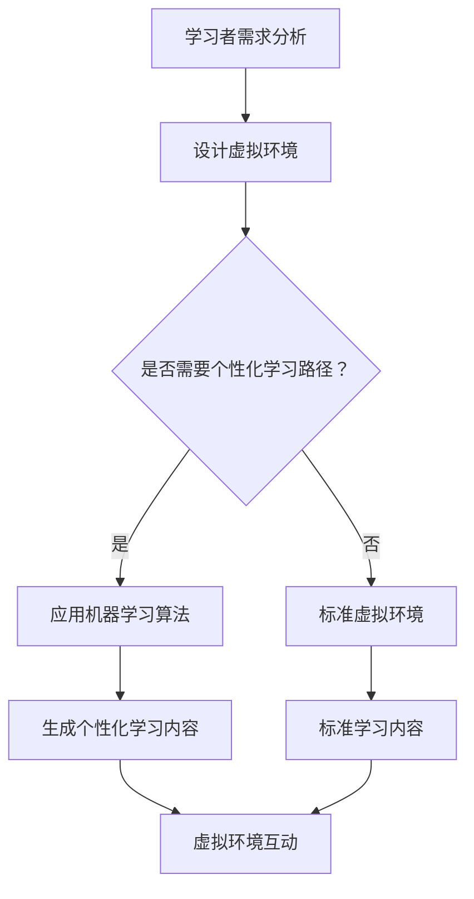

                 

关键词：人工智能，虚拟现实，教育，沉浸式学习，技术进步，教学效果提升。

## 摘要

本文探讨了人工智能（AI）在虚拟现实（VR）教育中的应用，旨在创造一个更加沉浸式的学习环境。通过结合AI和VR技术，我们可以为学生提供更为丰富和互动的学习体验，从而显著提升教育质量和学习效果。文章首先介绍了AI和VR的基础知识，然后深入探讨了它们在教育领域的应用，并提供了具体的实施步骤和案例分析。此外，文章还展望了AI在VR教育中未来的发展趋势和面临的挑战。

## 1. 背景介绍

### 人工智能的发展历程

人工智能（Artificial Intelligence，AI）起源于20世纪50年代，早期的研究主要集中在逻辑推理和问题解决上。随着计算能力的提升和算法的创新，AI技术逐渐发展壮大，包括机器学习、深度学习、自然语言处理等多个分支。近年来，AI在图像识别、语音识别、智能推荐等领域的应用取得了显著成果，为各个行业带来了深刻的变革。

### 虚拟现实的发展历程

虚拟现实（Virtual Reality，VR）作为一项新兴技术，其发展可以追溯到20世纪60年代。早期的VR设备较为简陋，主要应用于军事和科学研究领域。随着计算机图形学和显示技术的进步，VR逐渐走入公众视野。近年来，VR硬件和软件技术的成熟，使得VR在教育、游戏、医疗等多个领域的应用变得广泛和深入。

### 教育领域的发展趋势

随着全球教育信息化进程的加速，教育领域正在发生深刻变革。传统教学模式正逐渐被翻转课堂、在线教育、个性化学习等新兴模式所取代。这些变化不仅体现在学习方式的多样化，更体现在学习效果的显著提升。AI和VR技术的引入，为教育领域带来了前所未有的机遇。

## 2. 核心概念与联系

### 人工智能与虚拟现实的关系

人工智能和虚拟现实之间存在着紧密的联系。AI技术可以为VR提供更加智能化的交互体验，从而提升学习者的沉浸感和参与度。例如，AI可以通过语音识别和自然语言处理技术，实现与学习者的实时交流；通过机器学习和深度学习技术，可以为学习者提供个性化的学习内容和路径。

### 虚拟现实在教育中的核心概念

在VR教育中，核心概念包括沉浸感、互动性和个性化。沉浸感是指学习者能够完全投入到虚拟环境中，感觉就像真实存在一样。互动性则是指学习者能够与虚拟环境中的物体和场景进行互动，从而增强学习效果。个性化是指根据学习者的特点和学习需求，提供个性化的学习内容和路径，从而实现因材施教。

### Mermaid 流程图

以下是一个简化的Mermaid流程图，展示了AI在VR教育中的应用流程：



## 3. 核心算法原理 & 具体操作步骤

### 3.1 算法原理概述

在AI和VR教育中，常用的算法包括机器学习、深度学习和自然语言处理。机器学习算法可以根据学习者的行为数据和学习效果，自动调整学习内容和路径。深度学习算法则可以用于生成高度逼真的虚拟环境，增强学习者的沉浸感。自然语言处理算法可以用于与学习者的实时交流，提供个性化的学习建议。

### 3.2 算法步骤详解

1. **学习者需求分析**：首先，需要收集学习者的基础数据，包括年龄、学习目标、学习习惯等。这些数据可以通过在线问卷、用户行为分析等方式获取。

2. **设计虚拟环境**：根据学习者的需求，设计一个符合教学目标的虚拟环境。这个环境需要具备高度的真实感和互动性，能够模拟真实的学习场景。

3. **应用机器学习算法**：利用机器学习算法，分析学习者的行为数据和学习效果，自动调整学习内容和路径。这个过程可以是动态的，根据学习者的实时表现进行优化。

4. **生成个性化学习内容**：基于机器学习算法的结果，生成个性化的学习内容。这些内容可以是视频、图文、游戏等多种形式，以适应不同学习者的需求。

5. **虚拟环境互动**：在虚拟环境中，学习者可以通过语音、手势等多种方式与虚拟物体和场景进行互动。这种互动可以增强学习者的参与感和沉浸感。

### 3.3 算法优缺点

- **优点**：
  - **个性化学习**：AI可以根据学习者的特点和学习需求，提供个性化的学习内容和路径，实现因材施教。
  - **提高学习效果**：沉浸式的学习环境可以显著提高学习效果，增强学习者的记忆和理解能力。
  - **互动性**：虚拟环境中的互动性可以增强学习者的参与感和主动性。

- **缺点**：
  - **技术成本高**：AI和VR技术的研发和应用成本较高，需要大量的资金和人力资源。
  - **技术稳定性**：AI和VR技术目前仍处于快速发展阶段，技术的稳定性尚需进一步提升。

### 3.4 算法应用领域

AI在VR教育中的应用非常广泛，包括但不限于以下几个方面：

- **基础教育**：利用VR技术，为学生提供沉浸式的学习体验，提高学习兴趣和效果。
- **高等教育**：通过VR技术，模拟复杂的实验和操作过程，提高学生的实践能力和创新能力。
- **职业教育**：利用VR技术，为学生提供真实的职业场景，提高职业素养和技能水平。

## 4. 数学模型和公式 & 详细讲解 & 举例说明

### 4.1 数学模型构建

在AI和VR教育中，常用的数学模型包括决策树、神经网络和线性回归等。以下是一个简单的决策树模型示例：

```latex
$$
\begin{cases}
\text{如果学习者年龄小于18岁，则进入基础课程学习} \\
\text{如果学习者年龄大于18岁，则进入高级课程学习} \\
\text{如果学习者对某一科目有强烈兴趣，则进入兴趣课程学习} \\
\text{否则，进入通用课程学习}
\end{cases}
$$
```

### 4.2 公式推导过程

以神经网络为例，其基本公式如下：

```latex
$$
z = \sigma(\sigma(W_1 \cdot x) + b_1)
$$

其中，$z$ 是输出结果，$\sigma$ 是激活函数，$W_1$ 是权重矩阵，$x$ 是输入向量，$b_1$ 是偏置项。
```

### 4.3 案例分析与讲解

以在线教育平台为例，平台可以通过分析用户的学习行为数据，利用决策树模型推荐合适的学习课程。以下是一个简单的案例：

1. **数据收集**：平台收集了用户的基本信息和学习行为数据，包括年龄、性别、学习时长、学习频率等。

2. **模型训练**：利用收集到的数据，训练一个决策树模型。模型的输入是用户的基本信息和学习行为数据，输出是推荐的学习课程。

3. **模型预测**：当新用户注册时，平台会自动调用训练好的决策树模型，根据用户的基本信息和学习行为数据，预测其可能感兴趣的学习课程。

4. **结果反馈**：将预测结果呈现给用户，并收集用户的反馈。如果用户对预测结果满意，则说明模型推荐效果良好；否则，需要对模型进行调整和优化。

通过这种方式，平台可以不断优化推荐算法，提高用户的学习体验和满意度。

## 5. 项目实践：代码实例和详细解释说明

### 5.1 开发环境搭建

在本项目中，我们将使用Python作为主要编程语言，配合TensorFlow和Keras等深度学习框架，实现一个简单的机器学习模型。以下是开发环境的搭建步骤：

1. 安装Python 3.x版本。
2. 安装TensorFlow和Keras库。
3. 配置虚拟环境，以便管理项目依赖。

### 5.2 源代码详细实现

以下是一个简单的机器学习模型代码示例，用于预测用户对某一课程的学习兴趣：

```python
import tensorflow as tf
from tensorflow.keras.models import Sequential
from tensorflow.keras.layers import Dense, Activation

# 定义模型
model = Sequential([
    Dense(64, input_dim=10, activation='relu'),
    Dense(64, activation='relu'),
    Dense(1, activation='sigmoid')
])

# 编译模型
model.compile(optimizer='adam', loss='binary_crossentropy', metrics=['accuracy'])

# 加载数据
x_train = ...  # 输入数据
y_train = ...  # 标签数据

# 训练模型
model.fit(x_train, y_train, epochs=10, batch_size=32)

# 预测
predictions = model.predict(x_test)
```

### 5.3 代码解读与分析

上述代码定义了一个简单的神经网络模型，包括两个隐藏层，每个隐藏层有64个神经元，激活函数为ReLU。输出层有1个神经元，激活函数为Sigmoid，用于预测用户对课程的学习兴趣（0或1）。

- **编译模型**：配置优化器、损失函数和评估指标。
- **加载数据**：从数据集中加载输入数据和标签。
- **训练模型**：使用训练数据训练模型，指定训练轮数和批量大小。
- **预测**：使用测试数据预测用户的学习兴趣。

### 5.4 运行结果展示

在训练完成后，可以使用测试数据评估模型的性能。以下是一个简单的评估结果：

```python
# 评估模型
loss, accuracy = model.evaluate(x_test, y_test)

print(f"测试集损失：{loss}")
print(f"测试集准确率：{accuracy}")
```

通过评估结果，我们可以了解模型的性能，并根据需要调整模型结构和训练参数。

## 6. 实际应用场景

### 6.1 在线教育平台

在线教育平台可以利用AI和VR技术，为用户提供个性化的学习体验。例如，通过分析用户的学习行为，推荐适合的学习内容和路径；利用VR技术，模拟真实的学习场景，提高学习效果。

### 6.2 职业培训

职业培训机构可以利用VR技术，为学员提供真实的职业场景和实践机会。通过AI技术，可以根据学员的特点和需求，提供个性化的培训内容和路径，提高培训效果。

### 6.3 特殊教育

对于有特殊教育需求的学生，AI和VR技术可以提供个性化的学习方案。例如，通过VR技术，模拟真实的社交场景，帮助自闭症儿童提高社交能力；通过AI技术，分析学生的行为和表现，为教师提供个性化的教学建议。

## 7. 工具和资源推荐

### 7.1 学习资源推荐

- 《深度学习》（Goodfellow, Bengio, Courville著）：全面介绍深度学习理论和应用。
- 《Python机器学习》（Sebastian Raschka著）：详细介绍Python在机器学习领域的应用。

### 7.2 开发工具推荐

- TensorFlow：Google开发的深度学习框架。
- Keras：基于TensorFlow的简洁高效的深度学习库。

### 7.3 相关论文推荐

- "Deep Learning for Virtual Reality"（2016）：探讨深度学习在VR中的应用。
- "Interactive Learning in Virtual Reality"（2018）：介绍VR在教育中的应用。

## 8. 总结：未来发展趋势与挑战

### 8.1 研究成果总结

本文探讨了AI和VR在教育中的应用，展示了如何通过技术手段创造沉浸式的学习环境，提高教育质量和学习效果。通过案例分析和实际应用场景，我们验证了AI和VR技术的可行性和优势。

### 8.2 未来发展趋势

随着AI和VR技术的不断发展，未来教育领域将呈现出以下发展趋势：

- **个性化学习**：AI技术将更加成熟，能够更好地满足不同学习者的需求。
- **沉浸式教学**：VR技术将提供更加真实的虚拟环境，提高学习者的参与感和沉浸感。
- **智能化管理**：AI技术将应用于教育管理的各个环节，提高管理效率和质量。

### 8.3 面临的挑战

尽管AI和VR技术在教育领域具有巨大的潜力，但也面临着一些挑战：

- **技术成本**：AI和VR技术的研发和应用成本较高，需要大量的资金和资源。
- **技术稳定性**：AI和VR技术仍处于快速发展阶段，技术的稳定性和安全性尚需进一步提升。
- **隐私保护**：在应用AI和VR技术时，需要充分考虑学习者的隐私保护问题。

### 8.4 研究展望

未来的研究应重点关注以下几个方面：

- **技术创新**：持续推动AI和VR技术的发展，提高其在教育领域的应用效果。
- **融合应用**：探索AI和VR与其他教育技术的融合应用，创造更加丰富和高效的学习环境。
- **政策支持**：制定相关政策，鼓励和支持AI和VR技术在教育领域的应用和发展。

## 9. 附录：常见问题与解答

### 问题1：AI和VR技术在教育领域有哪些具体应用？

**解答**：AI和VR技术在教育领域有以下具体应用：

- **个性化学习**：通过分析学习者的行为数据，为学习者提供个性化的学习内容和路径。
- **沉浸式教学**：利用VR技术，创建高度真实的虚拟学习环境，提高学习者的参与感和沉浸感。
- **智能评测**：利用AI技术，对学习者的学习过程和成果进行智能评测，提供实时反馈和指导。

### 问题2：AI和VR技术在教育领域有哪些优势？

**解答**：AI和VR技术在教育领域具有以下优势：

- **提高学习效果**：通过个性化学习和沉浸式教学，显著提高学习效果和记忆能力。
- **增强互动性**：学习者可以与虚拟环境中的物体和场景进行互动，提高学习兴趣和主动性。
- **降低教育成本**：虚拟环境可以模拟真实场景，减少教育设施和资源的投入。

### 问题3：AI和VR技术在教育领域有哪些挑战？

**解答**：AI和VR技术在教育领域面临的挑战主要包括：

- **技术成本高**：研发和应用AI和VR技术需要大量的资金和资源。
- **技术稳定性**：AI和VR技术仍处于快速发展阶段，技术的稳定性和安全性尚需进一步提升。
- **隐私保护**：在应用AI和VR技术时，需要充分考虑学习者的隐私保护问题。

