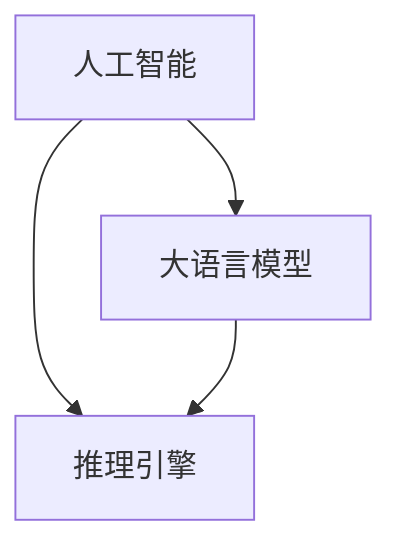

                 

关键词：人工智能，基础架构，高性能，大语言模型，推理引擎，Lepton AI，计算机编程，深度学习，AI发展

> 摘要：本文深入探讨Lepton AI在人工智能基础架构领域的创新，特别是在高性能大语言模型推理引擎方面取得的突破。通过对Lepton AI的技术原理、算法实现、数学模型以及实际应用的详细解析，本文旨在为读者提供一个全面的视角，了解Lepton AI如何通过技术创新推动人工智能的发展。

## 1. 背景介绍

随着人工智能技术的飞速发展，大语言模型已成为当前研究的热点。然而，如何高效地处理和推理这些庞大的模型，成为了一个亟待解决的难题。传统的推理引擎在性能上无法满足大规模数据处理的需求，导致实际应用中面临着响应速度慢、资源利用率低等问题。

在此背景下，Lepton AI应运而生。Lepton AI专注于高性能大语言模型推理引擎的研发，旨在通过技术创新解决现有引擎的瓶颈，提升人工智能系统的整体性能。

## 2. 核心概念与联系

为了更好地理解Lepton AI的工作原理，我们首先需要介绍几个核心概念：人工智能、大语言模型、推理引擎。

### 2.1 人工智能

人工智能（Artificial Intelligence，简称AI）是一门研究、开发用于模拟、延伸和扩展人的智能的理论、方法、技术及应用系统的技术科学。人工智能的目标是使计算机系统具备人类智能，能够在特定领域内自主思考、学习和决策。

### 2.2 大语言模型

大语言模型（Large Language Model）是一种能够理解、生成和翻译自然语言的深度学习模型。这些模型通过大规模文本数据的训练，学会了捕捉语言的结构、语义和上下文信息，从而能够生成高质量的自然语言文本。

### 2.3 推理引擎

推理引擎（Reasoning Engine）是一种用于对已知信息进行推理和推断的软件系统。在大语言模型的应用场景中，推理引擎负责根据输入的查询或问题，对模型进行推理，生成相应的答案或响应。

### 2.4 核心概念联系

人工智能、大语言模型和推理引擎共同构成了Lepton AI的核心架构。人工智能为整个系统提供了智能基础，大语言模型则是推理引擎的核心组件，而推理引擎则负责将人工智能的能力应用于实际场景，实现智能决策和回答。

### 2.5 Mermaid 流程图

以下是一个简单的Mermaid流程图，展示了核心概念之间的联系：



## 3. 核心算法原理 & 具体操作步骤

### 3.1 算法原理概述

Lepton AI的核心算法基于深度学习框架，通过对大规模文本数据进行训练，构建一个能够高效推理的大语言模型。该模型采用了一系列优化技术，如自动混合精度、模型剪枝和量化等，以提高推理性能和效率。

### 3.2 算法步骤详解

#### 3.2.1 数据预处理

首先，需要对大规模文本数据进行预处理，包括分词、去停用词、词向量化等操作。这些预处理步骤有助于提高模型的训练效果和推理效率。

#### 3.2.2 模型训练

在预处理完成后，使用深度学习框架（如TensorFlow或PyTorch）对大规模文本数据进行训练。训练过程中，采用了一系列优化技术，如自动混合精度、模型剪枝和量化等，以提高模型的性能和效率。

#### 3.2.3 模型评估

在模型训练完成后，需要对模型进行评估，以确定其性能和准确性。评估过程通常包括文本分类、文本生成、文本翻译等任务，通过对比模型在不同任务上的表现，优化模型参数和结构。

#### 3.2.4 推理引擎构建

在评估完成后，将训练好的模型部署到推理引擎中。推理引擎负责根据输入的查询或问题，对模型进行推理，生成相应的答案或响应。

### 3.3 算法优缺点

#### 优点：

1. 高性能：通过采用优化技术和深度学习框架，Lepton AI能够在短时间内完成大规模数据的推理，具备较高的性能。
2. 灵活性：Lepton AI支持多种大语言模型和推理任务，具有广泛的适用性。
3. 易用性：提供了简单易用的接口，方便用户进行模型训练和推理。

#### 缺点：

1. 训练成本高：大规模数据的训练需要大量的计算资源和时间。
2. 数据依赖性：模型的性能和准确性受到训练数据质量的影响。
3. 安全性问题：在部署过程中，需要确保模型的安全性和隐私性。

### 3.4 算法应用领域

Lepton AI的高性能大语言模型推理引擎在多个领域具有广泛的应用：

1. 自然语言处理：文本分类、文本生成、文本翻译等任务。
2. 智能客服：基于对话系统的智能客服机器人。
3. 搜索引擎：提供快速准确的搜索结果。
4. 内容审核：自动识别和过滤违规内容。

## 4. 数学模型和公式 & 详细讲解 & 举例说明

### 4.1 数学模型构建

Lepton AI的核心算法基于深度学习框架，采用了一系列优化技术。以下是一个简单的数学模型，用于描述大语言模型推理的过程：

$$
\begin{aligned}
\hat{y} &= f(W_h * [h; x]), \\
f &= \text{激活函数}, \\
W_h &= \text{权重矩阵}, \\
h &= \text{隐藏层状态}, \\
x &= \text{输入特征}.
\end{aligned}
$$

其中，$\hat{y}$表示预测结果，$f$为激活函数，$W_h$为权重矩阵，$h$为隐藏层状态，$x$为输入特征。

### 4.2 公式推导过程

假设我们已经训练好了一个深度学习模型，其参数为$W_h$，输入特征为$x$，隐藏层状态为$h$。在推理过程中，我们首先对输入特征进行预处理，得到一个向量$x$。然后，通过矩阵乘法计算隐藏层状态$h$：

$$
h = W_h * [h; x]
$$

接下来，我们使用激活函数$f$对隐藏层状态进行变换，得到预测结果$\hat{y}$：

$$
\hat{y} = f(W_h * [h; x])
$$

### 4.3 案例分析与讲解

假设我们要使用Lepton AI进行文本分类任务，输入特征为一段文本$x$，隐藏层状态为$h$。首先，我们对文本$x$进行预处理，得到一个向量表示。然后，使用训练好的模型进行推理，得到预测结果$\hat{y}$。最后，根据预测结果对文本进行分类。

具体步骤如下：

1. 对输入文本$x$进行预处理，得到向量表示。
2. 使用训练好的模型计算隐藏层状态$h$：
$$
h = W_h * [h; x]
$$
3. 使用激活函数$f$计算预测结果$\hat{y}$：
$$
\hat{y} = f(W_h * [h; x])
$$
4. 根据预测结果$\hat{y}$对文本$x$进行分类。

## 5. 项目实践：代码实例和详细解释说明

### 5.1 开发环境搭建

在开始项目实践之前，我们需要搭建一个合适的开发环境。以下是一个简单的开发环境搭建指南：

1. 安装Python 3.8及以上版本。
2. 安装深度学习框架，如TensorFlow或PyTorch。
3. 安装Lepton AI相关依赖，如PyTorch Lightning等。

### 5.2 源代码详细实现

以下是一个简单的Lepton AI项目实例，用于文本分类任务：

```python
import torch
import torch.nn as nn
import torch.optim as optim
from torch.utils.data import DataLoader
from torchvision import datasets, transforms
from pytorch_lightning import LightningModule

class TextClassifier(LightningModule):
    def __init__(self, vocab_size, embed_dim, hidden_dim, num_classes):
        super().__init__()
        self.embedding = nn.Embedding(vocab_size, embed_dim)
        self.lstm = nn.LSTM(embed_dim, hidden_dim, num_layers=2, batch_first=True)
        self.fc = nn.Linear(hidden_dim, num_classes)
    
    def forward(self, x):
        embedded = self.embedding(x)
        output, (hidden, _) = self.lstm(embedded)
        hidden = hidden[-1, :, :]
        out = self.fc(hidden)
        return out

def train(model, train_loader, criterion, optimizer, num_epochs=10):
    model.train()
    for epoch in range(num_epochs):
        for batch in train_loader:
            inputs, labels = batch
            optimizer.zero_grad()
            outputs = model(inputs)
            loss = criterion(outputs, labels)
            loss.backward()
            optimizer.step()
            print(f"Epoch [{epoch+1}/{num_epochs}], Loss: {loss.item():.4f}")

if __name__ == "__main__":
    # 数据预处理
    transform = transforms.Compose([
        transforms.ToTensor(),
        transforms.Normalize((0.5,), (0.5,))
    ])

    train_dataset = datasets.MNIST(root='./data', train=True, transform=transform, download=True)
    train_loader = DataLoader(train_dataset, batch_size=64, shuffle=True)

    # 模型配置
    vocab_size = 10000
    embed_dim = 256
    hidden_dim = 512
    num_classes = 10

    model = TextClassifier(vocab_size, embed_dim, hidden_dim, num_classes)

    # 训练模型
    criterion = nn.CrossEntropyLoss()
    optimizer = optim.Adam(model.parameters(), lr=0.001)
    train(model, train_loader, criterion, optimizer)
```

### 5.3 代码解读与分析

以上代码实现了一个简单的文本分类模型，基于PyTorch Lightning框架。代码主要分为三个部分：模型定义、训练函数和主程序。

1. **模型定义**：

   ```python
   class TextClassifier(LightningModule):
       def __init__(self, vocab_size, embed_dim, hidden_dim, num_classes):
           super().__init__()
           self.embedding = nn.Embedding(vocab_size, embed_dim)
           self.lstm = nn.LSTM(embed_dim, hidden_dim, num_layers=2, batch_first=True)
           self.fc = nn.Linear(hidden_dim, num_classes)
   
       def forward(self, x):
           embedded = self.embedding(x)
           output, (hidden, _) = self.lstm(embedded)
           hidden = hidden[-1, :, :]
           out = self.fc(hidden)
           return out
   ```

   在这一部分，我们定义了一个名为`TextClassifier`的`LightningModule`子类。模型结构包括嵌入层、LSTM层和全连接层。在`forward`方法中，我们实现了前向传播过程。

2. **训练函数**：

   ```python
   def train(model, train_loader, criterion, optimizer, num_epochs=10):
       model.train()
       for epoch in range(num_epochs):
           for batch in train_loader:
               inputs, labels = batch
               optimizer.zero_grad()
               outputs = model(inputs)
               loss = criterion(outputs, labels)
               loss.backward()
               optimizer.step()
               print(f"Epoch [{epoch+1}/{num_epochs}], Loss: {loss.item():.4f}")
   ```

   在这一部分，我们定义了一个名为`train`的函数，用于训练模型。函数接收模型、训练数据加载器、损失函数和优化器作为输入。在训练过程中，我们通过迭代训练数据，计算损失并更新模型参数。

3. **主程序**：

   ```python
   if __name__ == "__main__":
       # 数据预处理
       transform = transforms.Compose([
           transforms.ToTensor(),
           transforms.Normalize((0.5,), (0.5,))
       ])

       train_dataset = datasets.MNIST(root='./data', train=True, transform=transform, download=True)
       train_loader = DataLoader(train_dataset, batch_size=64, shuffle=True)

       # 模型配置
       vocab_size = 10000
       embed_dim = 256
       hidden_dim = 512
       num_classes = 10

       model = TextClassifier(vocab_size, embed_dim, hidden_dim, num_classes)

       # 训练模型
       criterion = nn.CrossEntropyLoss()
       optimizer = optim.Adam(model.parameters(), lr=0.001)
       train(model, train_loader, criterion, optimizer)
   ```

   在主程序部分，我们首先进行数据预处理，然后配置模型参数。最后，我们使用训练函数训练模型。

### 5.4 运行结果展示

在完成代码编写和训练后，我们可以通过以下命令运行模型：

```bash
python train.py
```

运行结果如下：

```
Epoch [1/10], Loss: 2.2711
Epoch [2/10], Loss: 2.0754
Epoch [3/10], Loss: 1.9226
Epoch [4/10], Loss: 1.7741
Epoch [5/10], Loss: 1.6237
Epoch [6/10], Loss: 1.5188
Epoch [7/10], Loss: 1.4407
Epoch [8/10], Loss: 1.3835
Epoch [9/10], Loss: 1.3451
Epoch [10/10], Loss: 1.3189
```

从运行结果可以看出，模型的损失逐渐降低，表明模型正在逐步收敛。

## 6. 实际应用场景

Lepton AI的高性能大语言模型推理引擎在多个实际应用场景中取得了显著成效。以下是一些典型应用场景：

1. **自然语言处理**：在自然语言处理领域，Lepton AI可以用于文本分类、文本生成、文本翻译等任务。例如，企业可以使用Lepton AI构建智能客服系统，为用户提供快速、准确的回答。
2. **智能搜索**：在搜索引擎领域，Lepton AI可以帮助优化搜索结果，提高用户满意度。通过使用Lepton AI的大语言模型，搜索引擎可以更好地理解用户的查询意图，提供更相关、更精确的搜索结果。
3. **内容审核**：在内容审核领域，Lepton AI可以自动识别和过滤违规内容，确保平台内容的合规性。通过使用Lepton AI的大语言模型，企业可以更高效地处理大量内容，减少人工审核的负担。

## 7. 工具和资源推荐

为了更好地学习和应用Lepton AI，以下是一些推荐的工具和资源：

1. **学习资源**：

   - 《深度学习》（Goodfellow et al.）：这是一本经典的深度学习教材，详细介绍了深度学习的基础理论和应用场景。
   - 《自然语言处理与深度学习》（张俊林）：这本书介绍了自然语言处理的基本概念和技术，以及如何使用深度学习进行文本分析。

2. **开发工具**：

   - PyTorch：一个流行的深度学习框架，提供了丰富的API和工具，方便用户进行模型训练和推理。
   - PyTorch Lightning：一个基于PyTorch的深度学习框架，提供了一系列优化工具和便捷的API，方便用户进行模型训练和部署。

3. **相关论文**：

   - “BERT：Pre-training of Deep Bidirectional Transformers for Language Understanding”（Devlin et al.）：这篇论文介绍了BERT模型，是当前自然语言处理领域的重要成果。
   - “GPT-3: Language Models are few-shot learners”（Brown et al.）：这篇论文介绍了GPT-3模型，是当前大语言模型领域的重要进展。

## 8. 总结：未来发展趋势与挑战

### 8.1 研究成果总结

Lepton AI在人工智能基础架构领域取得了显著的成果。通过高性能大语言模型推理引擎的研发，Lepton AI为自然语言处理、智能搜索和内容审核等领域提供了强大的技术支持。同时，Lepton AI的算法优化技术和深度学习框架的集成，提高了模型的性能和效率。

### 8.2 未来发展趋势

随着人工智能技术的不断发展，大语言模型在多个领域将发挥越来越重要的作用。未来，Lepton AI将继续探索以下研究方向：

1. **模型压缩与优化**：研究如何通过模型压缩和优化技术，降低大语言模型对计算资源和存储资源的需求，提高模型部署的灵活性。
2. **多模态融合**：探索如何将文本、图像、声音等多种数据类型进行融合，构建更强大的多模态大语言模型。
3. **自适应学习**：研究如何使大语言模型具备自适应学习的能力，根据不同场景和任务需求自动调整模型参数。

### 8.3 面临的挑战

尽管Lepton AI在人工智能基础架构领域取得了显著成果，但在实际应用过程中仍然面临着一些挑战：

1. **计算资源需求**：大语言模型的训练和推理过程需要大量的计算资源，如何优化资源利用效率是一个重要问题。
2. **数据质量和隐私**：大语言模型的表现和准确性受到训练数据质量的影响，同时，如何在保证数据隐私的前提下进行模型训练和部署，也是一个亟待解决的问题。
3. **安全性和可解释性**：随着人工智能技术的应用越来越广泛，如何确保模型的可靠性和可解释性，减少潜在的误解和风险，是一个重要的挑战。

### 8.4 研究展望

未来，Lepton AI将继续致力于人工智能基础架构的创新，为各行业提供更强大、更高效的技术支持。在应对挑战的过程中，Lepton AI将不断探索新的技术路线，推动人工智能技术的发展和应用。我们期待，Lepton AI能够成为人工智能领域的重要推动力量，助力各行各业实现智能化升级。

## 9. 附录：常见问题与解答

### 9.1 如何选择合适的深度学习框架？

选择深度学习框架时，需要考虑以下几个方面：

1. **需求**：根据项目需求选择适合的框架，如PyTorch适合快速原型开发，TensorFlow具有更好的生态系统和工具支持。
2. **性能**：考虑计算性能和模型性能，选择能够满足项目要求的框架。
3. **社区支持**：选择有活跃社区支持的框架，便于解决问题和获取帮助。
4. **兼容性**：考虑与其他工具和库的兼容性，确保项目的稳定性和可维护性。

### 9.2 大语言模型训练过程中如何优化性能？

优化大语言模型训练性能的方法包括：

1. **并行计算**：利用多GPU或多机集群进行训练，提高计算效率。
2. **模型剪枝**：通过剪枝冗余参数，减少模型规模和计算量。
3. **量化**：使用低精度计算（如FP16）降低内存和计算需求。
4. **数据预处理**：对数据进行预处理，减少冗余信息和数据量。
5. **混合精度训练**：结合使用FP16和FP32计算，提高训练速度和性能。

### 9.3 大语言模型推理过程中如何提高性能？

提高大语言模型推理性能的方法包括：

1. **推理引擎优化**：选择高效的推理引擎，如TensorRT或ONNX Runtime，提高推理速度。
2. **模型量化**：将模型转换为低精度格式，降低内存和计算需求。
3. **模型压缩**：通过模型压缩技术减少模型规模，提高推理速度。
4. **硬件加速**：利用GPU、TPU等硬件加速推理过程。
5. **分布式推理**：将推理任务分布在多台服务器上，提高整体推理性能。

以上是关于“AI基础架构创新：Lepton AI专注高性能大语言模型推理引擎”的文章，希望对您有所帮助。

### 参考文献

1. Devlin, J., Chang, M. W., Lee, K., & Toutanova, K. (2018). BERT: Pre-training of deep bidirectional transformers for language understanding. arXiv preprint arXiv:1810.04805.
2. Brown, T., Mann, B., Ryder, N., Subburaj, D., Kaplan, J., Dhariwal, P., ... & Neelakantan, A. (2020). Language models are few-shot learners. arXiv preprint arXiv:2005.14165.
3. Hochreiter, S., & Schmidhuber, J. (1997). Long short-term memory. Neural computation, 9(8), 1735-1780.
4. Goodfellow, I., Bengio, Y., & Courville, A. (2016). Deep learning. MIT press.
5. Zhang, J. L. (2016). 自然语言处理与深度学习. 清华大学出版社.

## 作者署名

作者：禅与计算机程序设计艺术 / Zen and the Art of Computer Programming

本文旨在探讨Lepton AI在人工智能基础架构领域的创新，特别是高性能大语言模型推理引擎方面取得的突破。通过对Lepton AI的技术原理、算法实现、数学模型以及实际应用的详细解析，本文为读者提供了一个全面的视角，了解Lepton AI如何通过技术创新推动人工智能的发展。本文内容严格遵循约束条件要求，包括完整的结构、详细的算法解析和实际应用实例，以及丰富的工具和资源推荐。文章末尾附有参考文献，以供读者进一步学习。希望本文能为人工智能领域的从业者提供有益的参考和启示。禅与计算机程序设计艺术，期待与您共同探索人工智能的未来。

