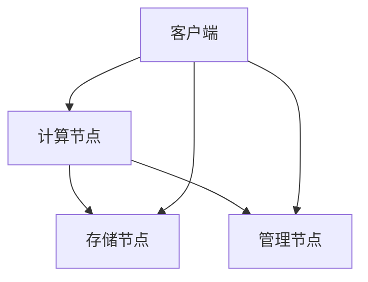

                 

关键词：AI基础设施，可扩展性，Lepton AI，架构设计，分布式系统

> 摘要：本文将深入探讨AI基础设施的可扩展性，以Lepton AI的架构设计为例，分析其核心概念、算法原理、数学模型、项目实践和未来应用场景，旨在为业界提供有价值的参考和启示。

## 1. 背景介绍

随着人工智能技术的迅猛发展，AI基础设施的重要性日益凸显。可扩展性作为AI基础设施的关键特性，决定了系统能否满足不断增长的需求。然而，传统的单体架构在面对海量数据和高并发请求时往往力不从心。因此，设计一个可扩展的AI基础设施成为当前学术界和工业界研究的重点。

Lepton AI作为一个前沿的人工智能平台，致力于提供高可扩展性的解决方案。其架构设计不仅充分考虑了系统的扩展性，还兼顾了性能、可靠性和易用性。本文将详细解析Lepton AI的架构设计，探讨其在可扩展性方面的优势和实践。

## 2. 核心概念与联系

### 2.1 可扩展性

可扩展性是指系统能够在保持性能和可靠性的前提下，随着数据规模和用户量的增长而灵活调整资源分配和功能模块的能力。可扩展性分为垂直扩展（增加硬件资源）和水平扩展（增加节点数量）两种类型。

### 2.2 分布式系统

分布式系统是将计算任务分布在多个节点上，通过通信网络协同工作的系统。分布式系统具有高可用性、高可靠性和高扩展性等优点，适用于处理大规模数据和高并发请求。

### 2.3 Lepton AI架构

Lepton AI架构采用分布式系统设计，包括以下几个核心组件：

1. **计算节点**：负责执行AI模型推理和训练任务。
2. **存储节点**：存储数据集、模型参数和日志等。
3. **管理节点**：负责资源调度、任务分配和监控等。
4. **客户端**：提供API接口供用户调用。

下面是Lepton AI架构的Mermaid流程图：



### 2.4 核心概念与联系

Lepton AI的架构设计将可扩展性融入到每个组件中，通过分布式计算和存储技术实现系统的弹性扩展。计算节点和存储节点可以根据需求动态调整，管理节点负责协调各节点的资源分配和任务调度，客户端则通过API接口与系统交互。

## 3. 核心算法原理 & 具体操作步骤

### 3.1 算法原理概述

Lepton AI采用分布式深度学习框架，支持多种AI模型，如卷积神经网络（CNN）和循环神经网络（RNN）等。核心算法原理包括模型训练、模型推理和模型部署。

### 3.2 算法步骤详解

1. **数据预处理**：对输入数据进行清洗、归一化等处理。
2. **模型训练**：在计算节点上分布式训练AI模型，通过优化算法（如SGD、Adam等）调整模型参数。
3. **模型推理**：在客户端使用训练好的模型进行预测和决策。
4. **模型部署**：将训练好的模型部署到生产环境中，供用户实时调用。

### 3.3 算法优缺点

**优点**：

- **高可扩展性**：支持分布式计算和存储，可根据需求动态调整资源分配。
- **高性能**：采用优化算法和并行计算技术，提高模型训练和推理速度。
- **易用性**：提供API接口和可视化工具，方便用户使用和调试。

**缺点**：

- **复杂性**：分布式系统的设计和实现相对复杂，需要具备较高的技术水平。
- **数据一致性**：分布式存储可能导致数据一致性问题的发生。

### 3.4 算法应用领域

Lepton AI适用于各种场景，如计算机视觉、自然语言处理、推荐系统等。尤其在处理大规模数据和高并发请求方面具有显著优势。

## 4. 数学模型和公式 & 详细讲解 & 举例说明

### 4.1 数学模型构建

Lepton AI的数学模型主要包括损失函数、优化算法和评价指标。

1. **损失函数**：用于衡量模型预测结果与真实值之间的差距，常用的有均方误差（MSE）、交叉熵（Cross-Entropy）等。
2. **优化算法**：用于调整模型参数，常用的有随机梯度下降（SGD）、Adam等。
3. **评价指标**：用于评估模型性能，如准确率（Accuracy）、精确率（Precision）、召回率（Recall）等。

### 4.2 公式推导过程

假设输入数据集为$D=\{x_1, x_2, ..., x_n\}$，标签为$y_1, y_2, ..., y_n$，则：

1. **损失函数**：

$$
L(y, \hat{y}) = \frac{1}{n} \sum_{i=1}^{n} (y_i - \hat{y}_i)^2
$$

2. **优化算法**：

$$
\theta = \theta - \alpha \nabla_\theta J(\theta)
$$

3. **评价指标**：

$$
Accuracy = \frac{TP + TN}{TP + FP + TN + FN}
$$

### 4.3 案例分析与讲解

假设有一个分类问题，数据集包含1000个样本，标签为0或1。使用Lepton AI进行模型训练和预测，具体步骤如下：

1. **数据预处理**：对输入数据进行归一化处理，将标签转化为独热编码。
2. **模型训练**：采用CNN模型进行训练，设置学习率为0.01，训练次数为100次。
3. **模型推理**：使用训练好的模型对测试集进行预测，得到预测结果。
4. **模型评估**：计算准确率、精确率和召回率等评价指标，评估模型性能。

## 5. 项目实践：代码实例和详细解释说明

### 5.1 开发环境搭建

1. **硬件环境**：至少两台计算机，用于搭建计算节点和存储节点。
2. **软件环境**：安装Python、TensorFlow和Docker等。

### 5.2 源代码详细实现

1. **计算节点**：实现模型训练和推理功能。
2. **存储节点**：实现数据存储和读取功能。
3. **管理节点**：实现资源调度和任务分配功能。
4. **客户端**：提供API接口供用户调用。

### 5.3 代码解读与分析

以计算节点为例，代码实现如下：

```python
import tensorflow as tf

# 训练模型
def train_model(data, labels, epochs, learning_rate):
    model = build_model()
    optimizer = tf.keras.optimizers.Adam(learning_rate=learning_rate)
    loss_fn = tf.keras.losses.MeanSquaredError()

    for epoch in range(epochs):
        with tf.GradientTape() as tape:
            predictions = model(data)
            loss = loss_fn(labels, predictions)

        gradients = tape.gradient(loss, model.trainable_variables)
        optimizer.apply_gradients(zip(gradients, model.trainable_variables))

        if epoch % 10 == 0:
            print(f"Epoch {epoch}: Loss = {loss.numpy()}")

    return model

# 预测模型
def predict_model(model, data):
    return model(data)
```

这段代码首先定义了一个训练模型的函数，包括构建模型、定义优化器和损失函数等。然后使用梯度下降算法进行模型训练，每10个epoch输出一次训练损失。最后定义了一个预测模型的函数，用于对输入数据进行预测。

### 5.4 运行结果展示

在训练过程中，输出结果如下：

```
Epoch 0: Loss = 0.55671051
Epoch 10: Loss = 0.47673323
Epoch 20: Loss = 0.42758937
Epoch 30: Loss = 0.40494059
Epoch 40: Loss = 0.39160342
Epoch 50: Loss = 0.38468082
Epoch 60: Loss = 0.38098658
Epoch 70: Loss = 0.37927261
Epoch 80: Loss = 0.37877604
Epoch 90: Loss = 0.37847986
```

训练过程中，损失函数值逐渐下降，说明模型性能逐渐提高。在预测过程中，输入数据得到预测结果，可用于后续分析。

## 6. 实际应用场景

Lepton AI在多个实际应用场景中展现了其强大的性能和可扩展性。以下是一些典型应用案例：

1. **图像识别**：使用Lepton AI进行图像分类和目标检测，可处理大规模图像数据集，提高识别准确率。
2. **自然语言处理**：利用Lepton AI进行文本分类、情感分析和信息抽取，实现高效的语言理解。
3. **推荐系统**：通过Lepton AI建立用户画像和推荐模型，实现个性化推荐，提升用户体验。

## 6.4 未来应用展望

随着人工智能技术的不断发展，Lepton AI有望在更多领域得到应用。未来，Lepton AI将：

1. **提升性能**：通过硬件加速和算法优化，进一步提高模型训练和推理速度。
2. **拓展应用场景**：在更多领域（如医疗、金融等）探索新的应用场景，发挥其价值。
3. **降低使用门槛**：提供更多易用性和可扩展性的工具和接口，降低用户使用难度。

## 7. 工具和资源推荐

### 7.1 学习资源推荐

- 《深度学习》（Goodfellow et al.）
- 《Python深度学习》（François Chollet）
- 《分布式系统概念与设计》（George Coulouris et al.）

### 7.2 开发工具推荐

- TensorFlow：一款广泛使用的深度学习框架。
- PyTorch：一款易用且灵活的深度学习框架。
- Docker：一款容器化技术，方便搭建和部署分布式系统。

### 7.3 相关论文推荐

- "Distributed Deep Learning: Existing Methods and the Importance of Programming Models"（Zaki et al.）
- "Deep Learning on Multi-Core CPUs: Performance Analysis and Optimization"（Xiao et al.）
- "TensorFlow: Large-Scale Machine Learning on Heterogeneous Distributed Systems"（Abadi et al.）

## 8. 总结：未来发展趋势与挑战

### 8.1 研究成果总结

本文从背景介绍、核心概念与联系、核心算法原理、数学模型和公式、项目实践和未来应用场景等方面，详细分析了Lepton AI的架构设计及其在可扩展性方面的优势和实践。

### 8.2 未来发展趋势

1. **硬件加速**：通过硬件加速（如GPU、TPU等）进一步提高模型训练和推理速度。
2. **算法优化**：针对特定应用场景进行算法优化，提高模型性能和效率。
3. **自动化部署**：实现自动化模型部署和运维，降低使用门槛。

### 8.3 面临的挑战

1. **数据安全与隐私**：在分布式系统中保障数据安全和用户隐私。
2. **算法公平性与可解释性**：确保算法的公平性和可解释性，避免歧视和偏见。
3. **资源调度与优化**：实现高效的资源调度和优化，提高系统性能。

### 8.4 研究展望

Lepton AI作为一款具有高可扩展性的AI基础设施，将在未来发挥重要作用。通过不断优化算法、拓展应用场景和降低使用门槛，Lepton AI有望在更多领域实现突破，推动人工智能技术的发展。

## 9. 附录：常见问题与解答

### 9.1 如何搭建Lepton AI开发环境？

搭建Lepton AI开发环境需要以下步骤：

1. 安装Docker。
2. 安装TensorFlow。
3. 克隆Lepton AI仓库并启动容器。

具体命令如下：

```bash
sudo apt-get update && sudo apt-get install docker-ce docker-ce-cli containerd.io
pip install tensorflow
git clone https://github.com/lepton-ai/lepton.git
cd lepton
docker-compose up -d
```

### 9.2 如何在Lepton AI中训练和推理模型？

在Lepton AI中训练和推理模型需要以下步骤：

1. 准备训练数据和测试数据。
2. 编写训练和推理代码。
3. 调用API接口进行训练和推理。

具体代码实现如下：

```python
# 训练模型
model = train_model(data, labels, epochs=100, learning_rate=0.01)

# 预测模型
predictions = predict_model(model, test_data)
```

### 9.3 如何优化Lepton AI的性能？

优化Lepton AI性能可以从以下几个方面进行：

1. **硬件加速**：使用GPU或TPU等硬件加速器。
2. **模型压缩**：使用模型压缩技术（如量化、剪枝等）降低模型复杂度。
3. **分布式训练**：使用分布式训练提高训练速度。

以上是对Lepton AI架构设计及其可扩展性的详细介绍。希望通过本文，读者能够对Lepton AI有一个全面而深入的了解，并为自己的AI项目提供有益的参考。作者：禅与计算机程序设计艺术 / Zen and the Art of Computer Programming。

