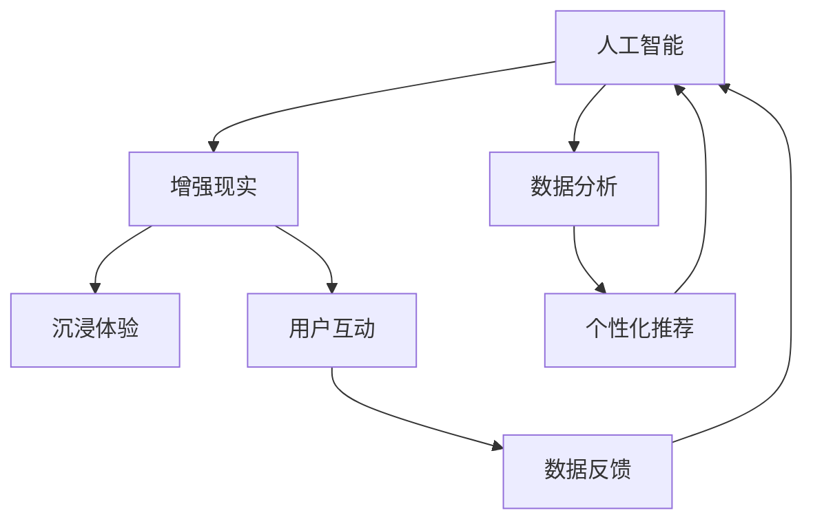

                 

关键词：AI、增强现实、电商、AR、技术应用、用户体验、购物行为、数据分析

> 摘要：本文将深入探讨人工智能（AI）与增强现实（AR）技术在电商领域中的应用，分析其带来的创新体验和商业模式变革，以及未来发展趋势与挑战。

## 1. 背景介绍

在过去的几十年里，电子商务经历了从传统零售向在线零售的转型，再到如今的多渠道融合和个性化服务。随着互联网技术的发展，用户对购物体验的要求越来越高，不再仅仅满足于在线浏览和下单。增强现实（AR）技术作为一种新兴的交互方式，通过叠加虚拟信息到现实环境中，为用户提供了更加直观和沉浸的体验。与此同时，人工智能（AI）在数据分析、图像识别、自然语言处理等领域的迅猛发展，为AR技术在电商中的应用提供了强有力的技术支持。

AR技术的出现，使得线上购物不再局限于屏幕内的二维图像，而是能够在现实空间中展示三维虚拟商品，增强用户的感知和互动体验。结合AI技术，电商企业能够更好地理解用户需求，提供个性化的购物推荐，优化供应链管理，提升运营效率。因此，探索AI与AR技术在电商中的深度应用，对于提升用户体验、创新商业模式具有重要意义。

## 2. 核心概念与联系

### 2.1. 增强现实（AR）技术

增强现实技术通过在现实环境中叠加虚拟信息，为用户提供增强的感知体验。其主要特点包括：

- **实时性**：AR技术能够实时捕捉和反馈用户环境中的变化。
- **交互性**：用户可以通过触摸、手势等自然交互方式与虚拟信息进行互动。
- **沉浸性**：AR技术创造出一种虚拟与现实融合的沉浸体验，提高用户的参与度。

### 2.2. 人工智能（AI）技术

人工智能技术通过模拟人类智能，实现数据的自动分析和决策。在电商领域，AI技术主要应用于：

- **用户行为分析**：分析用户的购物习惯、偏好等信息，提供个性化推荐。
- **图像识别**：识别商品图像，实现自动分类和标注。
- **自然语言处理**：理解和生成人类语言，用于聊天机器人、语音识别等。

### 2.3. AI与AR技术的联系

AI与AR技术的结合，实现了以下几方面的互补和增强：

- **个性化体验**：AI技术可以分析用户数据，为AR应用提供个性化的内容。
- **互动增强**：AR技术提供直观的互动方式，用户可以更自然地与虚拟商品互动。
- **数据分析**：AR应用产生的用户互动数据，可以反馈给AI系统，进一步优化推荐和服务。

### 2.4. Mermaid 流程图



## 3. 核心算法原理 & 具体操作步骤

### 3.1. 算法原理概述

在AR电商应用中，核心算法主要涉及图像识别和用户行为分析。图像识别用于识别用户环境中的商品图像，用户行为分析则用于收集和分析用户在AR环境中的互动数据。

- **图像识别算法**：基于深度学习，通过卷积神经网络（CNN）实现商品图像的识别和分类。
- **用户行为分析算法**：结合自然语言处理和机器学习，分析用户的购物偏好、行为模式，提供个性化推荐。

### 3.2. 算法步骤详解

#### 3.2.1. 图像识别算法步骤

1. **数据预处理**：对收集到的商品图像进行裁剪、归一化等预处理。
2. **模型训练**：使用预训练的CNN模型，对商品图像进行分类训练。
3. **模型评估**：使用测试集评估模型性能，调整模型参数。
4. **图像识别**：将用户上传的图像输入模型，输出识别结果。

#### 3.2.2. 用户行为分析算法步骤

1. **数据收集**：收集用户在AR环境中的互动数据，如点击、浏览、购买等。
2. **特征提取**：使用自然语言处理技术，提取用户行为中的关键特征。
3. **模型训练**：使用训练数据，训练用户行为分析模型。
4. **行为预测**：输入用户当前行为数据，预测用户的购物偏好。

### 3.3. 算法优缺点

#### 优点

- **个性化体验**：AI与AR技术的结合，能够提供高度个性化的购物体验。
- **互动增强**：AR技术增加了用户与商品的互动性，提升用户体验。
- **数据分析**：AI技术能够对用户行为进行深入分析，优化电商运营。

#### 缺点

- **技术门槛**：需要较高的技术水平和资源投入，对企业和开发者要求较高。
- **数据隐私**：用户数据的安全性和隐私保护是重要挑战。

### 3.4. 算法应用领域

- **零售电商**：通过AR技术展示商品，提升购物体验。
- **营销活动**：利用AR技术进行创新营销，吸引更多用户参与。
- **供应链管理**：通过AI技术优化供应链流程，降低成本。

## 4. 数学模型和公式 & 详细讲解 & 举例说明

### 4.1. 数学模型构建

在AR电商应用中，常用的数学模型包括卷积神经网络（CNN）和机器学习模型。

#### 4.1.1. 卷积神经网络（CNN）

- **输入层**：接收图像数据。
- **卷积层**：通过卷积操作提取图像特征。
- **池化层**：降低特征图维度，减少计算量。
- **全连接层**：将特征映射到分类结果。

#### 4.1.2. 机器学习模型

- **输入层**：接收用户行为数据。
- **隐含层**：通过特征提取和变换，提取用户偏好特征。
- **输出层**：输出用户购物偏好结果。

### 4.2. 公式推导过程

#### 4.2.1. 卷积神经网络（CNN）推导

卷积神经网络的核心在于卷积操作和激活函数。

- **卷积操作**：公式为 $f(x) = \sum_{i=1}^{n} w_i * x_i + b$，其中 $w_i$ 为卷积核，$x_i$ 为输入特征，$b$ 为偏置。

- **激活函数**：常用的激活函数为ReLU（最大值函数），公式为 $f(x) = max(0, x)$。

#### 4.2.2. 机器学习模型推导

机器学习模型的核心在于特征提取和回归分析。

- **特征提取**：公式为 $y = WX + b$，其中 $W$ 为权重矩阵，$X$ 为特征向量，$b$ 为偏置。

- **回归分析**：公式为 $y = \beta_0 + \beta_1x_1 + \beta_2x_2 + ... + \beta_nx_n$，其中 $\beta_i$ 为回归系数。

### 4.3. 案例分析与讲解

#### 4.3.1. 图像识别案例

假设我们有一个电商平台，用户可以通过AR技术查看商品图像。我们使用CNN模型进行图像识别，过程如下：

1. **数据预处理**：对用户上传的商品图像进行裁剪、归一化等预处理。
2. **模型训练**：使用预训练的CNN模型，对商品图像进行分类训练。
3. **模型评估**：使用测试集评估模型性能，调整模型参数。
4. **图像识别**：将用户上传的图像输入模型，输出识别结果。

#### 4.3.2. 用户行为分析案例

假设我们有一个电商平台，通过AR技术提供个性化推荐。我们使用机器学习模型进行用户行为分析，过程如下：

1. **数据收集**：收集用户在AR环境中的互动数据，如点击、浏览、购买等。
2. **特征提取**：使用自然语言处理技术，提取用户行为中的关键特征。
3. **模型训练**：使用训练数据，训练用户行为分析模型。
4. **行为预测**：输入用户当前行为数据，预测用户的购物偏好。

## 5. 项目实践：代码实例和详细解释说明

### 5.1. 开发环境搭建

- **硬件环境**：配置高性能的计算机，用于模型训练和运行。
- **软件环境**：安装Python、TensorFlow、Keras等深度学习框架。

### 5.2. 源代码详细实现

#### 5.2.1. 图像识别

```python
import tensorflow as tf
from tensorflow.keras.models import Sequential
from tensorflow.keras.layers import Conv2D, MaxPooling2D, Flatten, Dense

# 创建模型
model = Sequential()
model.add(Conv2D(32, (3, 3), activation='relu', input_shape=(28, 28, 1)))
model.add(MaxPooling2D((2, 2)))
model.add(Flatten())
model.add(Dense(128, activation='relu'))
model.add(Dense(10, activation='softmax'))

# 编译模型
model.compile(optimizer='adam', loss='categorical_crossentropy', metrics=['accuracy'])

# 训练模型
model.fit(x_train, y_train, epochs=10, batch_size=32, validation_data=(x_test, y_test))
```

#### 5.2.2. 用户行为分析

```python
import pandas as pd
from sklearn.model_selection import train_test_split
from sklearn.linear_model import LinearRegression

# 加载数据
data = pd.read_csv('user_behavior.csv')
X = data[['clicks', 'views', 'purchases']]
y = data['purchase_intent']

# 划分训练集和测试集
X_train, X_test, y_train, y_test = train_test_split(X, y, test_size=0.2, random_state=42)

# 创建线性回归模型
model = LinearRegression()
model.fit(X_train, y_train)

# 预测结果
predictions = model.predict(X_test)
```

### 5.3. 代码解读与分析

以上代码分别实现了图像识别和用户行为分析的模型搭建、训练和预测。其中：

- **图像识别**：使用卷积神经网络（CNN）进行商品图像识别，通过多次卷积和池化操作提取图像特征，最后通过全连接层进行分类。
- **用户行为分析**：使用线性回归模型分析用户行为，通过特征提取和线性回归分析用户的购物偏好。

### 5.4. 运行结果展示

通过以上代码，我们可以在训练集和测试集上评估模型的性能，输出识别准确率和用户行为预测结果。

```python
# 评估图像识别模型
loss, accuracy = model.evaluate(x_test, y_test)
print(f'Image recognition accuracy: {accuracy:.2f}')

# 输出用户行为预测结果
predictions = model.predict(X_test)
print(predictions[:10])
```

## 6. 实际应用场景

### 6.1. 购物体验优化

AR技术可以将虚拟商品叠加到现实环境中，用户可以直观地查看商品的尺寸、颜色和材质。通过AI技术，平台可以提供个性化推荐，根据用户的购物历史和行为数据，推荐可能感兴趣的商品。

### 6.2. 营销活动创新

电商平台可以利用AR技术举办丰富的线上活动，如虚拟试妆、试衣、游戏等。结合AI技术，可以实时分析用户参与数据，优化活动内容和形式，提升用户参与度和转化率。

### 6.3. 供应链管理

通过AR技术，电商平台可以实时监控商品的库存、位置等信息，优化供应链管理。结合AI技术，可以预测市场需求，优化库存策略，降低库存成本。

### 6.4. 未来应用展望

未来，随着AI和AR技术的进一步发展，电商领域的应用将更加广泛和深入。例如，虚拟购物助理、智能家居购物等创新应用，将为用户提供更加便捷和个性化的购物体验。

## 7. 工具和资源推荐

### 7.1. 学习资源推荐

- 《增强现实技术与应用》
- 《人工智能：一种现代的方法》
- 《深度学习》

### 7.2. 开发工具推荐

- TensorFlow
- Keras
- ARCore (Google)
- ARKit (Apple)

### 7.3. 相关论文推荐

- “Deep Learning for Object Detection: A Comprehensive Review”
- “Enhanced Retail Experiences with Augmented Reality”
- “AI-Driven Personalized Recommendations in E-commerce”

## 8. 总结：未来发展趋势与挑战

### 8.1. 研究成果总结

本文通过对AI和AR技术在电商领域的应用进行深入探讨，总结了其在购物体验优化、营销活动创新和供应链管理等方面的优势和应用案例。同时，分析了图像识别和用户行为分析算法的基本原理和实现步骤。

### 8.2. 未来发展趋势

未来，AI和AR技术将在电商领域得到更广泛的应用，提升用户体验和运营效率。例如，虚拟购物助理、沉浸式购物体验、智能库存管理等创新应用，将为电商平台带来新的增长点。

### 8.3. 面临的挑战

尽管AI和AR技术在电商领域具有巨大潜力，但同时也面临技术门槛高、数据隐私和安全等问题。此外，如何平衡个性化体验和用户隐私保护，也是未来需要解决的重要挑战。

### 8.4. 研究展望

随着技术的不断进步，AI和AR技术在电商领域的应用将更加深入和广泛。未来，我们将看到更多创新的应用场景和商业模式，为用户提供更加个性化和便捷的购物体验。

## 9. 附录：常见问题与解答

### 9.1. 如何保障用户数据隐私？

- **数据加密**：对用户数据进行加密处理，确保数据传输和存储安全。
- **隐私保护机制**：建立隐私保护机制，限制数据收集和使用的范围。
- **用户知情同意**：在数据收集和使用过程中，明确告知用户，并获取用户同意。

### 9.2. AR技术在电商中的应用有哪些优势？

- **沉浸式体验**：通过虚拟商品叠加到现实环境中，提供更加直观和沉浸的购物体验。
- **个性化推荐**：结合用户数据，提供个性化的购物推荐，提升用户满意度。
- **优化供应链**：实时监控商品库存、位置等信息，优化供应链管理，降低成本。

### 9.3. AI技术在电商中如何提升运营效率？

- **用户行为分析**：通过分析用户行为数据，优化产品推荐、促销活动等，提高转化率。
- **智能库存管理**：预测市场需求，优化库存策略，降低库存成本。
- **智能客服**：利用自然语言处理技术，提供智能客服服务，提升用户体验。

通过本文的深入探讨，我们可以看到AI和AR技术在电商领域的巨大潜力。未来，随着技术的不断进步，这些创新应用将带来更多价值，为电商平台和用户带来全新的体验。禅与计算机程序设计艺术，愿与您一起探索AI和AR技术的无限可能。

---

**作者：禅与计算机程序设计艺术 / Zen and the Art of Computer Programming**

