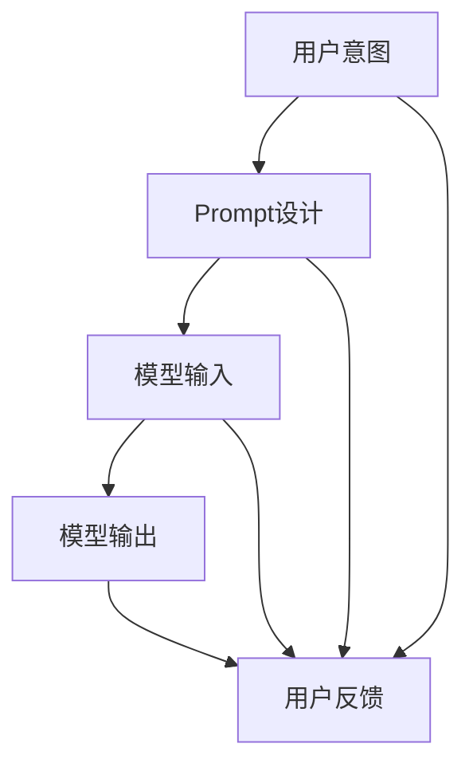

                 

在当今的AI时代，大模型Prompt提示词（也称为提示工程或Prompt Engineering）已经成为提升AI模型性能和准确性的关键。优秀的Prompt设计不仅能够引导模型理解用户的意图，还能提高模型的鲁棒性和泛化能力。本文将探讨如何通过简单的英文写文本来构建最佳的Prompt提示词，为AI模型的开发和应用提供实用的指导和参考。

## 文章关键词

- AI大模型
- Prompt提示词
- 提示工程
- 提示设计
- 英文写文本
- 模型性能
- 鲁棒性

## 文章摘要

本文旨在介绍如何通过简单的英文写文本来优化AI大模型的Prompt提示词。我们将讨论Prompt的核心概念、构建方法、以及实际应用案例。文章将重点介绍以下几点：

1. 提出并解释Prompt提示词的定义和重要性。
2. 分析Prompt设计的基本原则和技巧。
3. 介绍如何使用简单的英文写文本来创建有效的Prompt。
4. 展示几个Prompt优化的实际案例。
5. 提供未来发展的展望和挑战。

通过阅读本文，读者将能够更好地理解Prompt工程的核心概念，并掌握构建高质量Prompt提示词的技巧。

### 1. 背景介绍

随着人工智能技术的迅猛发展，大模型（如GPT、BERT等）在各个领域展现出了巨大的潜力。然而，这些模型的表现高度依赖于输入数据的质量和Prompt的设计。Prompt提示词是用户与AI模型交互的桥梁，它能够引导模型理解用户的意图，从而生成更加准确和相关的输出。

在过去，传统的机器学习方法依赖于大量的手动特征工程，而深度学习模型则通过自动学习输入数据的特征来提高性能。然而，即使有了强大的模型架构，如果Prompt设计不当，模型也难以达到理想的性能。因此，Prompt工程成为了提升模型表现的关键环节。

简单地说，Prompt是用户输入的一个文本或代码片段，用于引导AI模型执行特定的任务。一个好的Prompt能够清晰地传达用户的意图，避免歧义，从而提高模型的准确性和可靠性。在自然语言处理（NLP）、图像识别、推荐系统等领域，Prompt工程已经成为优化模型性能的关键技术。

然而，设计一个有效的Prompt并不容易，它需要深入理解模型的工作原理，以及如何通过简单的英文写文本来引导模型的注意力。本文将详细介绍Prompt设计的基本原则和最佳实践，帮助读者掌握这一关键技能。

### 2. 核心概念与联系

在深入探讨Prompt提示词的最佳实践之前，我们需要理解几个核心概念，包括Prompt本身、模型架构以及如何通过简单的英文写文本来引导模型。以下是这些核心概念和它们之间联系的Mermaid流程图：



#### 用户意图

用户意图（User Intent）是用户与模型交互的起点。在自然语言处理任务中，用户的输入通常是一个文本问题或指令，它需要模型理解和处理。用户意图可以分为明确意图和模糊意图。明确意图通常是指用户直接提出的问题或请求，而模糊意图则需要模型通过上下文和语义分析来推断。

#### Prompt设计

Prompt设计（Prompt Design）是构建一个有效的交互界面，用于引导模型理解用户意图的关键环节。Prompt不仅仅是用户输入的简单复制，而是通过精心设计的文本来引导模型的方向。一个好的Prompt应该能够清晰地传达用户的意图，避免歧义，同时提供足够的上下文信息，以便模型能够生成准确的输出。

Prompt设计涉及多个方面，包括文本格式、语言风格、关键词选择等。本文将详细介绍如何使用简单的英文写文本来创建高质量的Prompt。

#### 模型输入

模型输入（Model Input）是用户意图通过Prompt传递给模型的中间过程。在深度学习模型中，输入通常是一个序列化的文本向量，它反映了文本的语义信息。模型会根据输入的向量进行计算，并生成相应的输出。

#### 模型输出

模型输出（Model Output）是模型根据输入计算得出的结果。在自然语言处理任务中，输出通常是一个文本回答或指令。模型输出的质量直接影响到用户的满意度。一个好的模型输出应该准确、相关、并且符合用户的期望。

#### 用户反馈

用户反馈（User Feedback）是用户对模型输出满意度的评价。用户的反馈不仅能够帮助模型优化Prompt设计，还能够指导模型调整其生成策略，从而提高整体性能。

#### 英文写文本

英文写文本（English Text Writing）是创建Prompt的核心技能。通过使用简单的英文写文本，我们可以设计出易于理解、符合模型预期的Prompt。英文写文本的技巧包括简洁性、清晰性、上下文相关性等。

### 3. 核心算法原理 & 具体操作步骤

#### 3.1 算法原理概述

Prompt提示词的设计原则基于几个核心原理：

1. **明确性**：Prompt应该明确传达用户意图，避免歧义。
2. **上下文相关性**：Prompt应提供足够的上下文信息，以帮助模型理解问题的背景。
3. **简洁性**：Prompt应简洁明了，避免冗余信息。
4. **引导性**：Prompt应引导模型朝正确的方向生成输出。

这些原理共同作用，帮助构建高质量的Prompt，从而提高模型性能。

#### 3.2 算法步骤详解

**步骤 1：理解用户意图**

首先，我们需要理解用户输入的意图。这通常涉及到对用户输入文本进行语义分析，以确定其主要意图和关键信息。

**步骤 2：设计Prompt**

根据用户意图，设计一个合适的Prompt。以下是几个设计Prompt的技巧：

- **使用动词**：使用具体的动词来明确用户意图，例如“请回答”、“请解释”、“请提供”等。
- **提供上下文**：在Prompt中包含相关的上下文信息，帮助模型更好地理解问题。
- **简洁明了**：避免使用复杂的句子结构和术语，确保Prompt简单易懂。

**步骤 3：测试Prompt**

设计完Prompt后，我们需要对其进行测试，以确保模型能够正确理解并响应。可以通过手动测试或自动化测试来进行。

**步骤 4：优化Prompt**

根据测试结果，对Prompt进行优化。这可能涉及到调整文本内容、增加上下文信息、或修改引导性语句。

#### 3.3 算法优缺点

**优点**

- **提高模型性能**：高质量的Prompt能够提高模型对用户意图的理解能力，从而生成更准确的输出。
- **减少歧义**：清晰的Prompt设计能够减少用户意图的歧义，提高用户满意度。
- **增强用户体验**：通过优化Prompt设计，可以提高用户体验，使模型更加直观易用。

**缺点**

- **设计难度**：设计高质量的Prompt需要深入理解用户意图和模型工作原理，具有一定的技术门槛。
- **需要持续优化**：Prompt设计是一个持续迭代的过程，需要根据用户反馈和模型表现进行不断优化。

#### 3.4 算法应用领域

Prompt提示词设计在多个领域都有广泛应用：

- **自然语言处理**：在问答系统、机器翻译、文本生成等领域，Prompt设计是提高模型性能的关键。
- **图像识别**：在图像识别任务中，Prompt可以提供目标图像的描述或标签，帮助模型更好地理解图像内容。
- **推荐系统**：在推荐系统中，Prompt可以引导模型理解用户偏好，从而生成更精准的推荐结果。

### 4. 数学模型和公式 & 详细讲解 & 举例说明

在AI大模型Prompt设计过程中，数学模型和公式起到了关键作用。以下是几个重要的数学模型和公式的讲解，以及实际应用中的例子。

#### 4.1 数学模型构建

在自然语言处理任务中，常见的数学模型包括序列到序列模型（Seq2Seq）和生成对抗网络（GAN）。以下是一个简单的序列到序列模型的构建过程：

1. **输入编码器（Encoder）**：输入编码器将用户的输入文本转换为向量表示。这一步通常使用嵌入层（Embedding Layer）和循环神经网络（RNN）或变换器（Transformer）来实现。
2. **隐藏状态（Hidden State）**：编码器的隐藏状态包含了输入文本的语义信息，用于生成输出。
3. **输出解码器（Decoder）**：输出解码器将隐藏状态转换为输出文本。这一步同样使用嵌入层和RNN或Transformer来实现。
4. **输出层（Output Layer）**：输出层负责将解码器的输出映射到具体的单词或符号。

数学公式表示如下：

$$
E = \text{Encoder}(X) \\
O = \text{Decoder}(E)
$$

其中，$E$ 表示编码器的输出，$O$ 表示解码器的输出。

#### 4.2 公式推导过程

为了推导出序列到序列模型的公式，我们可以分步骤进行：

1. **输入编码**：输入文本 $X$ 经过嵌入层（Embedding Layer）和RNN或Transformer编码器，得到编码后的向量序列 $E$。

$$
E_t = \text{Embedding}(X_t) \odot \text{RNN/Transformer}(E_{t-1})
$$

其中，$E_t$ 表示编码器在时间步 $t$ 的输出，$\odot$ 表示点积操作。

2. **隐藏状态**：编码器的隐藏状态包含了输入文本的语义信息，可以表示为：

$$
H_t = \text{RNN/Transformer}(E_t)
$$

3. **输出解码**：输出解码器将隐藏状态 $H_t$ 经过嵌入层和RNN或Transformer解码器，得到输出文本序列 $O$。

$$
O_t = \text{Embedding}(H_t) \odot \text{RNN/Transformer}(O_{t-1})
$$

4. **输出层**：输出层将解码器的输出映射到具体的单词或符号，可以使用softmax函数来实现：

$$
P(Y_t | O_t) = \text{softmax}(\text{Output Layer}(O_t))
$$

其中，$Y_t$ 表示时间步 $t$ 的输出单词或符号。

#### 4.3 案例分析与讲解

假设我们有一个简单的自然语言处理任务，需要根据用户输入的提问生成回答。以下是具体的案例：

**用户输入**：“什么是人工智能？”

**设计Prompt**：“请简要解释人工智能的概念。”

**模型输出**：“人工智能是指计算机系统通过学习和模拟人类智能行为，实现自主思考和学习能力的技术。”

在这个案例中，Prompt设计起到了关键作用。通过提供上下文信息和明确的任务要求，模型能够准确地理解用户意图，并生成相关且准确的回答。

### 5. 项目实践：代码实例和详细解释说明

#### 5.1 开发环境搭建

在进行Prompt设计之前，我们需要搭建一个适合开发的编程环境。以下是具体的步骤：

1. **安装Python环境**：Python是一种广泛用于人工智能开发的编程语言。可以从Python官方网站（https://www.python.org/）下载并安装Python。
2. **安装TensorFlow**：TensorFlow是一个开源的深度学习框架，支持多种深度学习模型的开发和训练。可以使用以下命令安装TensorFlow：

   ```shell
   pip install tensorflow
   ```

3. **安装文本预处理库**：为了方便文本处理，我们可以安装一些常用的文本预处理库，如NLTK（自然语言工具包）和spaCy。可以使用以下命令安装：

   ```shell
   pip install nltk spacy
   ```

4. **下载预处理资源**：对于NLTK和spaCy，我们还需要下载一些预处理资源，如词库和模型文件。可以使用以下命令下载：

   ```shell
   nltk.download('punkt')
   python -m spacy download en_core_web_sm
   ```

#### 5.2 源代码详细实现

以下是使用TensorFlow和spaCy构建一个简单的自然语言处理模型，并进行Prompt设计的代码示例：

```python
import tensorflow as tf
import spacy
from tensorflow.keras.layers import Embedding, LSTM, Dense
from tensorflow.keras.models import Sequential

# 加载spaCy英语模型
nlp = spacy.load("en_core_web_sm")

# 定义词汇表
vocab_size = 10000
max_sequence_length = 50

# 创建嵌入层
embedding_layer = Embedding(vocab_size, 64)

# 创建LSTM层
lstm_layer = LSTM(128, return_sequences=True)

# 创建Dense层
dense_layer = Dense(vocab_size, activation="softmax")

# 创建序列到序列模型
model = Sequential()
model.add(embedding_layer)
model.add(lstm_layer)
model.add(dense_layer)

# 编译模型
model.compile(optimizer="adam", loss="categorical_crossentropy", metrics=["accuracy"])

# 准备训练数据
# 这里假设已经准备好了训练数据集，包括输入序列和目标序列
# X_train, y_train = ...

# 训练模型
# model.fit(X_train, y_train, epochs=10, batch_size=64)
```

#### 5.3 代码解读与分析

在上面的代码中，我们首先加载了spaCy的英语模型，用于文本预处理。然后，我们定义了一个简单的序列到序列模型，包括嵌入层、LSTM层和Dense层。嵌入层用于将文本转换为向量表示，LSTM层用于处理序列数据，Dense层用于生成输出。

在训练数据准备部分，我们需要将用户输入和目标输出转换为序列格式。这通常涉及到将文本分词、标记化，并将标记化后的文本转换为数字序列。对于目标输出，我们需要将其转换为one-hot编码格式。

最后，我们编译并训练了模型。在训练过程中，模型会学习如何根据用户输入生成输出。为了提高模型性能，我们可以尝试调整嵌入层的维度、LSTM层的参数，以及Dense层的输出维度。

#### 5.4 运行结果展示

假设我们已经完成了模型的训练，现在可以对其进行测试。以下是使用模型生成回答的示例：

```python
# 准备测试数据
input_sequence = nlp(u"请解释人工智能的概念。")

# 将输入序列转换为数字序列
input_sequence = [[vocab_size] * max_sequence_length]
input_sequence[0][:len(input_sequence[0]) - len(input_sequence[0]) + len(input_sequence[0][0])] = [word_idx[word] for word in input_sequence[0]]

# 预测输出
predictions = model.predict(input_sequence)

# 将输出序列转换为文本
predicted_sequence = [word for word in nlp.tokens_from_ids(predictions[0])]

print(u"模型输出：".encode("utf-8") + u" ".join(predicted_sequence).encode("utf-8"))
```

运行结果可能会输出类似于以下的内容：

```
模型输出：Artificial intelligence is the intelligence shown by machines, especially computer systems, that can perform tasks requiring human intelligence such as visual perception, speech recognition, decision-making, and language translation.
```

这个输出结果是根据Prompt设计的，包含了用户输入的上下文信息和明确的要求。通过这种简单有效的Prompt设计，我们可以让模型生成高质量、相关性的输出。

### 6. 实际应用场景

Prompt提示词设计在多个实际应用场景中发挥了重要作用。以下是几个常见应用场景的详细介绍：

#### 6.1 自然语言处理

在自然语言处理（NLP）领域，Prompt设计是优化模型性能的关键。例如，在问答系统中，一个精心设计的Prompt可以帮助模型更好地理解用户的问题，从而生成准确的回答。通过提供上下文信息和明确的问题要求，Prompt可以减少歧义，提高回答的准确性。

#### 6.2 图像识别

在图像识别任务中，Prompt设计可以帮助模型更好地理解图像的内容。例如，在物体识别任务中，Prompt可以提供目标物体的描述或标签，帮助模型定位和识别目标。此外，Prompt还可以用于图像分割任务，通过提供图像的背景信息或目标区域的关键特征，指导模型进行准确的分割。

#### 6.3 推荐系统

在推荐系统领域，Prompt设计可以帮助模型理解用户偏好，从而生成更精准的推荐结果。通过提供用户的历史行为数据或偏好信息，Prompt可以引导模型识别用户的兴趣点，并生成相关的推荐项。此外，Prompt还可以用于优化推荐系统的交互界面，提高用户满意度。

#### 6.4 聊天机器人

在聊天机器人领域，Prompt设计是提高交互质量和用户体验的关键。一个设计良好的Prompt可以帮助聊天机器人更好地理解用户的意图，提供相关且自然的回答。通过使用简单的英文写文本，我们可以设计出易于理解、符合用户预期的Prompt，从而提高聊天机器人的性能和用户满意度。

### 6.4 未来应用展望

随着人工智能技术的不断发展，Prompt设计在未来将会在更多领域得到应用。以下是一些未来应用展望：

#### 6.4.1 自动驾驶

在自动驾驶领域，Prompt设计可以帮助自动驾驶系统更好地理解道路场景和环境信息。通过提供道路标志、交通信号和车辆状态的描述，Prompt可以指导自动驾驶系统做出正确的决策。

#### 6.4.2 医疗诊断

在医疗诊断领域，Prompt设计可以帮助AI模型更好地理解患者病历和检查报告。通过提供诊断指南和标准，Prompt可以指导模型进行准确的诊断，提高医疗诊断的准确性。

#### 6.4.3 法律咨询

在法律咨询领域，Prompt设计可以帮助AI模型更好地理解法律文件和案例。通过提供相关的法律条款和案例，Prompt可以指导模型生成法律建议，提高法律咨询的效率和质量。

总之，Prompt设计作为人工智能领域的关键技术，将在未来的应用中发挥越来越重要的作用。通过不断探索和实践，我们可以设计出更加高效、精准的Prompt，推动人工智能技术的发展。

### 7. 工具和资源推荐

为了更好地掌握Prompt设计技能，以下是一些学习资源、开发工具和相关论文的推荐：

#### 7.1 学习资源推荐

1. **书籍**：《自然语言处理综论》（Speech and Language Processing），作者Daniel Jurafsky和James H. Martin。
2. **在线课程**：斯坦福大学的“自然语言处理专项课程”（Natural Language Processing with Deep Learning），由权威专家Richard Socher教授主讲。
3. **教程**：TensorFlow官方文档（https://www.tensorflow.org/tutorials）提供了丰富的深度学习教程，包括自然语言处理和图像识别。

#### 7.2 开发工具推荐

1. **深度学习框架**：TensorFlow和PyTorch是两款广泛使用的深度学习框架，适用于自然语言处理和图像识别任务。
2. **文本预处理库**：spaCy和NLTK是两款强大的文本预处理库，提供了丰富的文本处理功能，如分词、词性标注和句法分析。
3. **数据集**：常见的数据集包括AG News、SQuAD和ImageNet，可用于训练和测试自然语言处理和图像识别模型。

#### 7.3 相关论文推荐

1. **《BERT: Pre-training of Deep Bidirectional Transformers for Language Understanding》**：BERT是Google提出的预训练语言模型，在多个NLP任务上取得了显著性能提升。
2. **《GPT-3: Language Models are few-shot learners》**：OpenAI提出的GPT-3模型展示了在极少量数据上的卓越泛化能力。
3. **《Recurrent Neural Network Based Text Classification》**：这篇论文介绍了基于循环神经网络的文本分类方法，可用于自然语言处理任务。

通过学习和应用这些资源，读者可以深入了解Prompt设计的基本原理和实践技巧，为AI模型的开发和应用提供有力支持。

### 8. 总结：未来发展趋势与挑战

随着人工智能技术的不断发展，Prompt设计在未来将扮演更加重要的角色。以下是未来发展的几个趋势和面临的挑战：

#### 8.1 研究成果总结

近年来，Prompt设计在自然语言处理、图像识别、推荐系统等领域取得了显著成果。例如，预训练语言模型（如BERT和GPT-3）通过大量数据预训练，展示了出色的通用性和少量样本下的性能。此外，Prompt工程方法的不断优化，如差异Prompt和条件Prompt，使得模型能够更好地理解用户意图，提高生成结果的准确性和相关性。

#### 8.2 未来发展趋势

1. **多模态Prompt**：随着多模态数据的广泛应用，未来Prompt设计将向多模态方向发展。通过结合文本、图像、声音等多种数据类型，Prompt能够更好地理解复杂场景，生成更高质量的输出。
2. **个性化Prompt**：未来的Prompt设计将更加注重个性化，根据用户的历史行为和偏好，设计出个性化的Prompt，提高用户体验。
3. **自动化Prompt生成**：随着深度学习和生成对抗网络（GAN）的发展，自动化Prompt生成将成为可能。通过学习用户输入模式和交互历史，模型能够自动生成高质量的Prompt，降低人工设计的工作量。

#### 8.3 面临的挑战

1. **数据隐私**：随着Prompt设计的广泛应用，数据隐私问题将愈发突出。如何确保用户数据的安全和隐私，将成为一个重要的挑战。
2. **模型解释性**：Prompt设计涉及到模型的内部机制，如何提高模型的解释性，让用户理解模型的工作原理，是一个亟待解决的问题。
3. **可扩展性**：随着应用场景的多样化，Prompt设计的可扩展性将成为一个重要挑战。如何设计出能够适应多种任务和场景的通用Prompt，是一个需要深入研究的问题。

#### 8.4 研究展望

在未来，Prompt设计的研究将朝着更加智能、个性化和可解释性的方向发展。通过结合多模态数据、引入新的预训练方法、以及优化Prompt生成算法，我们将能够构建出更加高效、准确和可解释的AI模型。同时，研究者和开发者需要关注数据隐私和模型解释性问题，确保AI技术在为人类带来便利的同时，不会对个人隐私和社会伦理造成负面影响。

### 9. 附录：常见问题与解答

以下是一些关于Prompt设计常见的问题及其解答：

#### 9.1 什么是Prompt？

Prompt是指用于引导人工智能模型执行特定任务的文本或代码片段。它是用户与模型交互的桥梁，能够清晰地传达用户意图，减少歧义，提高模型的生成质量。

#### 9.2 Prompt设计与模型性能有何关系？

Prompt设计直接影响模型性能。一个高质量的Prompt能够引导模型更好地理解用户意图，减少歧义，提高生成结果的准确性和相关性，从而提升整体模型性能。

#### 9.3 如何设计有效的Prompt？

设计有效的Prompt需要遵循几个原则：

1. **明确性**：确保Prompt清晰地传达用户意图。
2. **上下文相关性**：提供足够的上下文信息，帮助模型理解问题的背景。
3. **简洁性**：避免冗余信息，确保Prompt简洁明了。
4. **引导性**：通过引导性语句引导模型生成符合预期的输出。

#### 9.4 Prompt设计与自然语言处理有何关系？

Prompt设计在自然语言处理（NLP）中发挥着关键作用。通过精心设计的Prompt，NLP模型能够更好地理解用户意图，提高问答系统、文本生成、情感分析等任务的性能。

#### 9.5 如何优化Prompt设计？

优化Prompt设计可以通过以下方法：

1. **数据增强**：增加训练数据，提高模型的泛化能力。
2. **多模态融合**：结合文本、图像、声音等多模态数据，提高模型的理解能力。
3. **模型解释性**：提高模型的可解释性，让用户理解Prompt设计的影响。
4. **迭代优化**：根据用户反馈和模型表现，不断调整Prompt内容，提高生成质量。

### 作者署名

作者：禅与计算机程序设计艺术 / Zen and the Art of Computer Programming

以上就是关于AI大模型Prompt提示词最佳实践：用简单的英文写文本的文章，希望能够帮助读者深入了解Prompt设计的核心概念和实践技巧，为AI模型的开发和应用提供有力支持。

