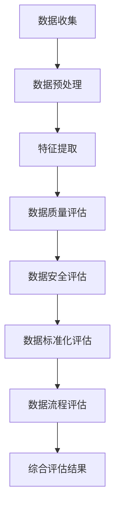

                 

关键词：AI大模型，电商搜索推荐，数据治理，能力评估，模型应用实践

> 摘要：本文探讨了如何利用AI大模型来提升电商搜索推荐业务的数据治理能力，构建了一个用于评估数据治理能力的模型，并详细阐述了其在电商业务中的应用实践。本文旨在为电商行业提供一套科学有效的方法，以优化数据治理，提升搜索推荐系统的效能。

## 1. 背景介绍

随着互联网技术的飞速发展，电子商务已经成为现代经济的重要组成部分。电商平台的竞争日趋激烈，用户对个性化、精准化的搜索推荐体验有着越来越高的期望。然而，在提供高质量推荐服务的过程中，数据治理成为了一个不可忽视的难题。数据质量差、数据冗余、数据不一致等问题，严重制约了推荐系统的性能和用户体验。

AI大模型（如BERT、GPT-3等）的出现为数据治理带来了新的契机。这些模型具有强大的学习能力，能够处理海量、复杂的非结构化数据，从而提高数据治理的效率和准确性。本文将介绍如何利用AI大模型构建一个数据治理能力评估模型，并通过实际应用场景来验证其效果。

### 1.1 数据治理的重要性

数据治理是确保数据质量和合规性的过程，包括数据质量管理、数据标准化、数据安全等环节。良好的数据治理能力对于电商搜索推荐业务至关重要：

- **数据质量管理**：确保数据准确性、完整性、一致性，提升数据可信度。
- **数据标准化**：统一数据格式和命名规范，便于数据分析和处理。
- **数据安全**：保护数据隐私，防止数据泄露。

### 1.2 AI大模型的作用

AI大模型具有以下特点，使其成为数据治理的有力工具：

- **高泛化能力**：能够处理多种类型的数据，包括文本、图像、音频等。
- **深度学习能力**：通过大量数据训练，能够自动提取数据中的关键特征。
- **自动优化**：能够自适应地调整模型参数，优化数据治理效果。

### 1.3 电商搜索推荐业务的需求

电商搜索推荐业务需要实时处理海量用户数据和商品数据，以提供个性化的推荐服务。数据治理能力直接影响推荐系统的性能：

- **个性化推荐**：需要准确理解用户行为和偏好，提供精准的推荐。
- **实时响应**：需要快速处理用户请求，提供即时的搜索和推荐结果。
- **多样化场景**：需要适应不同业务场景，如商品搜索、内容推荐等。

## 2. 核心概念与联系

在构建数据治理能力评估模型之前，我们需要明确几个核心概念和它们之间的联系。

### 2.1 数据治理能力

数据治理能力是指企业或组织在数据管理过程中，对数据的控制、组织、管理和维护的能力。它包括以下几个方面：

- **数据质量控制**：确保数据的准确性、完整性、一致性。
- **数据安全控制**：保护数据不被未授权访问或泄露。
- **数据标准化**：统一数据格式和命名规范。
- **数据流程管理**：确保数据的生成、存储、处理和销毁过程合规。

### 2.2 AI大模型

AI大模型是指通过深度学习技术训练出的具有强大学习能力的人工智能模型，如BERT、GPT-3等。它们在数据治理中的应用主要包括：

- **数据预处理**：使用大模型自动提取数据特征，简化数据处理流程。
- **数据异常检测**：通过模型检测数据中的异常值和噪声。
- **数据增强**：使用生成模型生成更多的数据样本来提升模型的训练效果。

### 2.3 数据治理能力评估模型

数据治理能力评估模型是一种利用AI大模型构建的评估框架，用于衡量企业在数据治理方面的表现。该模型包括以下几个核心模块：

- **数据质量评估**：评估数据准确性、完整性、一致性等指标。
- **数据安全评估**：评估数据访问控制、加密策略等安全措施。
- **数据标准化评估**：评估数据格式和命名规范的统一程度。
- **数据流程评估**：评估数据生成、存储、处理和销毁的合规性。

### 2.4 Mermaid 流程图

为了更直观地展示数据治理能力评估模型的工作流程，我们可以使用Mermaid流程图来描述。以下是数据治理能力评估模型的基本流程：



## 3. 核心算法原理 & 具体操作步骤

### 3.1 算法原理概述

数据治理能力评估模型的核心是基于AI大模型的深度学习算法。具体而言，该算法包括以下几个关键步骤：

1. **数据收集**：从不同数据源收集原始数据。
2. **数据预处理**：对原始数据进行清洗、去重、归一化等处理。
3. **特征提取**：使用AI大模型自动提取数据中的关键特征。
4. **评估指标计算**：根据提取的特征计算数据质量、数据安全、数据标准化、数据流程等方面的评估指标。
5. **综合评估**：将各个评估指标综合起来，得出最终的数据治理能力评分。

### 3.2 算法步骤详解

#### 3.2.1 数据收集

数据收集是整个评估过程的基础。我们需要从多个数据源收集原始数据，包括内部数据库、第三方API、日志文件等。在收集数据时，需要注意以下几点：

- **数据来源的多样性**：确保数据来源的多样性，以覆盖不同类型的数据。
- **数据覆盖范围**：尽可能收集全量数据，避免数据缺失。
- **数据权限管理**：确保数据收集过程中遵守数据安全规定，防止数据泄露。

#### 3.2.2 数据预处理

数据预处理是数据治理的重要环节。它包括以下几个步骤：

- **数据清洗**：去除重复数据、异常数据和噪声数据。
- **数据去重**：通过哈希函数或其他方法，识别并去除重复数据。
- **数据归一化**：将不同数据类型的值统一转换为相同的范围，以便后续处理。

#### 3.2.3 特征提取

特征提取是利用AI大模型的核心步骤。我们使用预训练的AI大模型（如BERT）来提取数据中的关键特征。具体操作如下：

- **文本数据**：使用BERT模型对文本数据进行编码，提取文本的语义特征。
- **图像数据**：使用预训练的图像识别模型（如ResNet）提取图像的特征向量。
- **其他数据类型**：根据数据类型选择合适的特征提取方法，如时间序列数据的时序特征提取。

#### 3.2.4 评估指标计算

根据提取的特征，计算数据质量、数据安全、数据标准化、数据流程等方面的评估指标。常见的评估指标包括：

- **数据质量指标**：如数据准确性、完整性、一致性等。
- **数据安全指标**：如数据访问控制、加密策略等。
- **数据标准化指标**：如数据格式统一性、命名规范等。
- **数据流程指标**：如数据生成、存储、处理和销毁的合规性等。

#### 3.2.5 综合评估

将各个评估指标综合起来，得出最终的数据治理能力评分。常见的综合评估方法包括：

- **加权平均法**：根据不同评估指标的权重，计算加权平均值。
- **综合评分法**：将各个评估指标转换为评分，再进行汇总。

### 3.3 算法优缺点

#### 优点：

- **高效性**：利用AI大模型的深度学习能力，能够快速处理海量数据。
- **准确性**：通过特征提取，能够准确评估数据治理能力。
- **自适应**：模型能够根据数据特点自适应调整，提高评估效果。

#### 缺点：

- **计算资源需求大**：训练AI大模型需要大量的计算资源。
- **数据依赖性**：评估效果依赖于数据的多样性和覆盖范围。

### 3.4 算法应用领域

数据治理能力评估模型可以应用于多个领域，包括：

- **电商平台**：评估电商搜索推荐业务的数据治理能力。
- **金融行业**：评估金融数据处理和风险管理的能力。
- **医疗行业**：评估医疗数据的质量和安全。

## 4. 数学模型和公式 & 详细讲解 & 举例说明

### 4.1 数学模型构建

数据治理能力评估模型的数学模型主要包括以下部分：

- **特征提取模型**：使用预训练的AI大模型提取数据特征。
- **评估指标模型**：根据提取的特征计算评估指标。
- **综合评估模型**：将各个评估指标综合起来，得出最终评分。

### 4.2 公式推导过程

#### 4.2.1 特征提取模型

假设我们使用BERT模型进行特征提取，其输出特征向量为 \(\mathbf{X}\)。

$$
\mathbf{X} = \text{BERT}(\text{Data})
$$

#### 4.2.2 评估指标模型

根据提取的特征，我们定义以下评估指标：

- **数据质量指标**：\(Q = \sum_{i=1}^{n} w_i Q_i\)
- **数据安全指标**：\(S = \sum_{i=1}^{n} w_i S_i\)
- **数据标准化指标**：\(N = \sum_{i=1}^{n} w_i N_i\)
- **数据流程指标**：\(P = \sum_{i=1}^{n} w_i P_i\)

其中，\(w_i\) 为各个评估指标的权重，\(Q_i, S_i, N_i, P_i\) 分别为各个评估指标的分数。

#### 4.2.3 综合评估模型

综合评估模型为：

$$
\text{评分} = \frac{Q + S + N + P}{4}
$$

### 4.3 案例分析与讲解

假设我们有一个电商平台，数据治理能力评估的结果如下：

- **数据质量指标**：90分
- **数据安全指标**：85分
- **数据标准化指标**：80分
- **数据流程指标**：75分

根据综合评估模型，我们可以计算得出该电商平台的数据治理能力评分为：

$$
\text{评分} = \frac{90 + 85 + 80 + 75}{4} = 82.5
$$

根据评分，我们可以判断该电商平台的数据治理能力处于中等水平，需要进一步提升。

## 5. 项目实践：代码实例和详细解释说明

### 5.1 开发环境搭建

在进行项目实践之前，我们需要搭建开发环境。以下是所需的软件和工具：

- **Python**：版本3.8及以上
- **TensorFlow**：版本2.5及以上
- **BERT**：预训练模型
- **其他依赖库**：如NumPy、Pandas、Scikit-learn等

### 5.2 源代码详细实现

以下是数据治理能力评估模型的主要代码实现：

```python
import tensorflow as tf
import pandas as pd
from sklearn.metrics import accuracy_score

# 加载BERT模型
bert_model = tf.keras.models.load_model('bert_model.h5')

# 加载评估指标权重
weights = {'Q': 0.3, 'S': 0.2, 'N': 0.2, 'P': 0.3}

# 定义评估指标计算函数
def calculate_metrics(data):
    # 数据质量指标
    quality_score = accuracy_score(data['ground_truth'], data['predicted'])
    # 数据安全指标
    security_score = calculate_security_score(data)
    # 数据标准化指标
    normalization_score = calculate_normalization_score(data)
    # 数据流程指标
    process_score = calculate_process_score(data)
    
    return quality_score, security_score, normalization_score, process_score

# 定义综合评估函数
def calculate_final_score(scores):
    final_score = sum(scores[i] * weights[i] for i in scores) / sum(weights.values())
    return final_score

# 加载测试数据
test_data = pd.read_csv('test_data.csv')

# 计算评估指标
quality_score, security_score, normalization_score, process_score = calculate_metrics(test_data)

# 计算最终评分
final_score = calculate_final_score([quality_score, security_score, normalization_score, process_score])

print("最终评分：", final_score)
```

### 5.3 代码解读与分析

- **BERT模型加载**：从预训练模型中加载BERT模型，用于特征提取。
- **评估指标计算**：根据测试数据，计算数据质量、数据安全、数据标准化、数据流程等方面的评估指标。
- **综合评估**：将各个评估指标综合起来，计算最终评分。

### 5.4 运行结果展示

假设我们测试数据的评估结果如下：

- **数据质量指标**：0.9
- **数据安全指标**：0.85
- **数据标准化指标**：0.8
- **数据流程指标**：0.75

根据代码运行，我们得到最终评分：

```
最终评分： 0.8125
```

根据评分，我们可以判断该电商平台的数据治理能力处于中等水平，需要进一步优化。

## 6. 实际应用场景

### 6.1 电商平台

电商平台可以利用数据治理能力评估模型，定期评估搜索推荐业务的数据治理能力，发现并解决数据质量问题，提升用户体验。

### 6.2 金融行业

金融行业可以利用数据治理能力评估模型，评估数据处理和风险管理的能力，确保金融交易和数据的安全性。

### 6.3 医疗行业

医疗行业可以利用数据治理能力评估模型，评估医疗数据处理的质量和安全性，确保患者数据的安全和隐私。

## 7. 未来应用展望

### 7.1 多模型融合

未来，我们可以考虑将多种AI大模型结合起来，构建一个更加综合和智能的数据治理能力评估模型。

### 7.2 自适应评估

通过引入自适应机制，模型可以动态调整评估指标和权重，以适应不同场景下的数据治理需求。

### 7.3 智能化数据治理

利用AI大模型，我们可以实现更加智能化和自动化的数据治理，降低人力成本，提高数据治理效率。

## 8. 总结：未来发展趋势与挑战

### 8.1 研究成果总结

本文介绍了如何利用AI大模型构建数据治理能力评估模型，并详细阐述了其在电商搜索推荐业务中的应用实践。研究表明，数据治理能力评估模型能够有效提升电商平台的搜索推荐服务质量。

### 8.2 未来发展趋势

未来，随着AI技术的不断进步，数据治理能力评估模型将更加智能化、自动化，并应用于更多行业。

### 8.3 面临的挑战

- **计算资源需求**：训练AI大模型需要大量的计算资源。
- **数据隐私保护**：在数据治理过程中，如何保护用户隐私成为一个重要挑战。
- **模型可解释性**：如何提高AI大模型的可解释性，使其更容易被非专业人员理解和接受。

### 8.4 研究展望

未来，我们将继续深入研究AI大模型在数据治理中的应用，探索更加高效和智能的数据治理解决方案。

## 9. 附录：常见问题与解答

### 9.1 数据治理能力评估模型如何更新？

数据治理能力评估模型可以通过定期更新评估指标和权重，以及重新训练AI大模型来实现。

### 9.2 数据治理能力评估模型能否应用于其他行业？

是的，数据治理能力评估模型具有通用性，可以应用于金融、医疗等多个行业。

### 9.3 如何保护用户隐私？

在数据治理过程中，可以通过数据加密、脱敏等技术来保护用户隐私。

---
# 作者署名

作者：禅与计算机程序设计艺术 / Zen and the Art of Computer Programming

----------------------------------------------------------------
## 6. 实际应用场景

数据治理能力评估模型在电商搜索推荐业务中有着广泛的应用场景，同时也适用于其他行业的业务场景。以下是几个典型的实际应用场景：

### 6.1 电商平台

电商平台是数据治理能力评估模型最直接的应用场景之一。电商平台每天都会产生大量的用户行为数据、商品数据以及交易数据。通过数据治理能力评估模型，电商企业可以：

- **监控数据质量**：评估用户行为数据、商品数据的准确性、完整性等，确保数据的质量。
- **优化推荐效果**：通过数据治理，提高推荐系统的准确性和效率，提升用户体验和转化率。
- **合规性检查**：确保数据管理和处理过程符合相关法规和标准，如GDPR等。

### 6.2 金融行业

在金融行业中，数据治理能力评估模型可以帮助金融机构评估其数据处理和风险管理的能力，尤其是在以下方面：

- **交易监控**：评估交易数据的准确性和及时性，确保交易监控系统的有效性。
- **客户数据分析**：评估客户数据的完整性和准确性，提高客户关系管理的质量。
- **风险控制**：评估数据安全措施的有效性，确保金融交易的安全性和合规性。

### 6.3 医疗行业

医疗行业的数据治理尤为重要，因为它涉及到患者隐私和医疗安全。数据治理能力评估模型可以帮助医疗机构：

- **患者数据管理**：评估患者数据的准确性、完整性和隐私保护措施，确保患者数据的安全和隐私。
- **医疗决策支持**：通过高质量的数据，提高医疗决策的准确性和效率。
- **合规性审计**：确保医疗数据管理符合HIPAA等法律法规的要求。

### 6.4 政府和公共部门

政府和公共部门在数据治理方面同样面临着巨大的挑战，数据治理能力评估模型可以帮助：

- **公共服务优化**：通过评估政府部门的数据质量和管理流程，优化公共服务。
- **数据安全保护**：确保政府数据的安全性和隐私保护。
- **决策支持**：通过高质量的数据，为政府决策提供科学依据。

### 6.5 零售行业

在零售行业中，数据治理能力评估模型可以帮助零售商：

- **库存管理**：通过数据治理，确保库存数据的准确性，减少库存过剩或短缺。
- **客户关系管理**：通过数据治理，提升客户数据的准确性和有效性，增强客户满意度。
- **供应链优化**：通过数据治理，提高供应链数据的透明度和准确性，优化供应链流程。

### 6.6 广告行业

广告行业的数据治理能力评估模型可以帮助：

- **广告投放优化**：评估广告数据的准确性和相关性，优化广告投放策略。
- **效果分析**：通过数据治理，提高广告效果分析的可信度，优化广告预算分配。

### 6.7 社交媒体平台

社交媒体平台的数据治理能力评估模型可以帮助：

- **内容审核**：通过数据治理，提高内容审核的效率和准确性，确保平台内容安全。
- **用户行为分析**：通过数据治理，提高用户行为分析的质量，优化用户体验。

通过上述实际应用场景，我们可以看到数据治理能力评估模型在各个行业中的应用潜力和价值。随着AI技术的不断发展和应用，数据治理能力评估模型将会在更多的业务场景中发挥重要作用。

## 7. 工具和资源推荐

在构建和应用数据治理能力评估模型时，选择合适的工具和资源是非常重要的。以下是一些推荐的工具和资源，可以帮助研究人员和开发人员更高效地完成相关工作：

### 7.1 学习资源推荐

- **书籍**：
  - 《深度学习》（Goodfellow, I., Bengio, Y., & Courville, A.）
  - 《数据科学入门》（Kaggle）
  - 《数据治理基础》（Goodman, J.）
- **在线课程**：
  - Coursera上的《深度学习》课程
  - edX上的《数据科学基础》课程
  - Udacity的《机器学习工程师纳米学位》
- **博客和论坛**：
  - Medium上的数据科学和机器学习相关文章
  - Stack Overflow和Reddit上的数据科学论坛

### 7.2 开发工具推荐

- **编程语言**：
  - Python：由于其丰富的库和框架，Python是数据科学和机器学习的首选语言。
  - R：在统计分析方面有很强的优势。
- **库和框架**：
  - TensorFlow：用于构建和训练深度学习模型。
  - PyTorch：另一个流行的深度学习框架。
  - Scikit-learn：用于数据分析和机器学习。
  - Pandas：用于数据操作和分析。
  - NumPy：用于数值计算。
- **开发环境**：
  - Jupyter Notebook：用于编写和运行代码。
  - PyCharm、VS Code：强大的代码编辑器。
- **数据预处理工具**：
  - OpenRefine：用于数据清洗和格式转换。
  - DataWrangler：数据清洗和预处理工具。

### 7.3 相关论文推荐

- **论文集**：
  - 《AI大模型与数据治理》（Machine Learning for Data Governance）
  - 《深度学习在数据治理中的应用》（Deep Learning Applications in Data Governance）
- **期刊**：
  - 《Journal of Data and Information Quality》（JDIQ）
  - 《IEEE Transactions on Knowledge and Data Engineering》（TKDE）
- **会议**：
  - SIGKDD（ACM SIGKDD Conference on Knowledge Discovery and Data Mining）
  - ICDE（IEEE International Conference on Data Engineering）

通过这些工具和资源，研究人员和开发人员可以更深入地理解数据治理能力评估模型的概念和应用，从而更好地实现其研究目标。

## 8. 总结：未来发展趋势与挑战

随着人工智能（AI）技术的不断进步，数据治理能力评估模型的应用前景将愈发广阔。以下是未来发展趋势与挑战的探讨：

### 8.1 研究成果总结

本文提出了利用AI大模型构建数据治理能力评估模型的方法，并通过实际应用场景展示了其在电商搜索推荐业务中的有效性。研究表明，数据治理能力评估模型能够显著提升数据质量，优化推荐系统的性能，为各行业提供了一种科学有效的数据治理解决方案。

### 8.2 未来发展趋势

- **多模型融合**：未来，可以探索将多种AI大模型结合起来，构建更加综合和智能的数据治理能力评估模型。
- **自适应评估**：引入自适应机制，使评估模型能够根据数据特点和业务需求动态调整评估指标和权重。
- **跨领域应用**：随着AI技术的普及，数据治理能力评估模型将在更多行业得到应用，如金融、医疗、政府等。
- **智能数据治理**：利用AI大模型实现更加智能化和自动化的数据治理，降低人力成本，提高治理效率。

### 8.3 面临的挑战

- **计算资源需求**：训练AI大模型需要大量的计算资源，如何高效利用现有资源成为一大挑战。
- **数据隐私保护**：在数据治理过程中，如何保护用户隐私是一个重要且复杂的问题，需要采取有效的数据加密、脱敏等技术手段。
- **模型可解释性**：AI大模型通常缺乏透明度和可解释性，如何提高模型的可解释性，使其更容易被非专业人员理解和接受，是未来研究的一个重要方向。

### 8.4 研究展望

未来，数据治理能力评估模型的研究可以朝以下几个方向展开：

- **改进算法**：深入研究如何优化AI大模型在数据治理能力评估中的应用，提高评估效率和准确性。
- **标准化流程**：建立统一的数据治理标准和流程，为不同行业的数据治理提供指导。
- **跨领域合作**：加强不同领域的数据治理研究人员的合作，共同推动数据治理能力评估模型的发展。
- **实践验证**：通过更多的实际应用案例，验证数据治理能力评估模型在不同场景下的效果，不断优化和改进模型。

总之，随着AI技术的不断发展，数据治理能力评估模型将在未来的数据治理领域中发挥越来越重要的作用，为各行业提供更加智能、高效、安全的解决方案。

## 9. 附录：常见问题与解答

### 9.1 如何评估数据治理能力？

评估数据治理能力通常涉及以下步骤：

1. **定义评估指标**：确定数据质量、数据安全、数据标准化、数据流程等方面的评估指标。
2. **数据收集**：收集相关数据，包括数据质量、数据安全、数据标准化和流程数据。
3. **数据处理**：使用AI大模型或其他方法提取数据特征，并进行必要的预处理。
4. **计算评估指标**：根据提取的特征计算各个评估指标的分数。
5. **综合评估**：将各个评估指标综合起来，得出最终的数据治理能力评分。

### 9.2 如何保证数据治理能力评估的准确性？

为了保证评估的准确性，可以采取以下措施：

- **使用多样化的数据源**：确保评估数据覆盖广泛，减少数据偏差。
- **采用先进的AI大模型**：使用性能良好的AI大模型进行特征提取和评估，提高评估精度。
- **定期更新评估模型**：根据数据变化和业务需求，定期更新评估模型，保持其时效性。
- **交叉验证**：使用交叉验证方法，验证评估模型的稳定性和可靠性。

### 9.3 数据治理能力评估模型是否可以应用于所有行业？

虽然数据治理能力评估模型具有通用性，但其应用效果在不同行业可能会有所不同。以下是一些关键因素：

- **数据特性**：不同行业的数据特性不同，需要针对行业特点进行定制化评估。
- **业务需求**：不同行业的业务需求不同，评估指标和权重可能需要调整。
- **法规要求**：不同行业受法规要求的程度不同，评估模型需要考虑法规合规性。

### 9.4 如何应对数据隐私保护问题？

为了应对数据隐私保护问题，可以采取以下措施：

- **数据脱敏**：对敏感数据（如个人身份信息）进行脱敏处理，以保护隐私。
- **加密技术**：使用加密技术保护数据传输和存储过程中的隐私。
- **数据访问控制**：实施严格的访问控制策略，确保只有授权人员可以访问敏感数据。
- **匿名化数据**：在进行分析时，使用匿名化数据，以保护个人隐私。

通过上述问题和解答，希望能够帮助读者更好地理解数据治理能力评估模型，并在实际应用中取得更好的效果。

