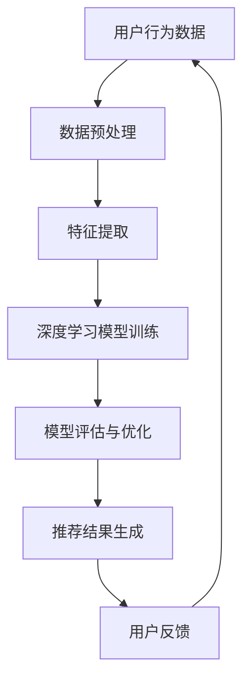

                 

关键词：AI大模型、电商搜索、推荐系统、降本增效、深度学习

> 摘要：本文深入探讨了人工智能大模型在电商搜索推荐业务中的应用，分析了其如何通过深度学习和先进的算法技术实现业务降本增效，为电商企业提供了有效的技术解决方案。

## 1. 背景介绍

随着互联网的迅猛发展和电子商务的崛起，电商搜索推荐系统已经成为电商平台的核心竞争力。传统推荐系统多依赖于基于内容的过滤和协同过滤算法，这些方法在处理海量用户数据和商品信息时存在一定的局限性，如计算复杂度高、推荐效果不佳等问题。近年来，人工智能尤其是深度学习技术的发展为解决这些难题提供了新的可能。AI大模型，作为一种能够处理复杂数据和任务的能力，逐渐在电商搜索推荐业务中展现其独特优势。本文将围绕AI大模型在电商搜索推荐业务中的应用，探讨其如何实现降本增效。

## 2. 核心概念与联系

### 2.1 深度学习

深度学习是人工智能的一个重要分支，它通过多层神经网络模拟人类大脑的学习过程，从大量数据中自动提取特征并建立模型。深度学习在图像识别、自然语言处理等领域取得了显著的成果，为AI大模型的发展奠定了基础。

### 2.2 推荐系统

推荐系统是一种利用数据挖掘和机器学习技术，预测用户可能感兴趣的项目并做出相应推荐的应用系统。在电商领域，推荐系统可以帮助平台提高用户留存率和转化率，增加销售额。

### 2.3 AI大模型

AI大模型是指通过深度学习等方法训练出来的大型神经网络模型，能够处理海量的数据和复杂的任务。其特点包括：

- **数据驱动**：通过大量数据进行训练，从而具备较强的泛化能力。
- **自动特征提取**：能够自动提取数据中的有用特征，减少人工干预。
- **模型可解释性**：通过先进的解释技术，提高模型的可解释性，便于理解和优化。

### 2.4 Mermaid流程图

下面是推荐系统架构的Mermaid流程图：



## 3. 核心算法原理 & 具体操作步骤

### 3.1 算法原理概述

AI大模型在电商搜索推荐业务中的核心算法原理主要包括以下几个步骤：

1. **数据收集与预处理**：收集用户行为数据、商品信息等原始数据，并进行清洗、去噪、归一化等预处理操作。
2. **特征提取**：利用深度学习模型自动提取数据中的有用特征，减少人工特征工程的工作量。
3. **模型训练**：使用预处理后的数据训练深度学习模型，通过反向传播算法不断调整模型参数，提高模型性能。
4. **模型评估与优化**：对训练好的模型进行评估，通过交叉验证、A/B测试等方法筛选出最优模型。
5. **推荐结果生成**：利用训练好的模型生成推荐结果，根据用户的兴趣和行为进行个性化推荐。

### 3.2 算法步骤详解

#### 3.2.1 数据收集与预处理

数据收集主要包括用户行为数据、商品信息、用户画像等。预处理步骤包括：

- 数据清洗：去除重复、缺失、异常数据。
- 数据去噪：去除噪声数据，提高数据质量。
- 数据归一化：将不同尺度的数据进行归一化处理，方便模型训练。

#### 3.2.2 特征提取

特征提取是深度学习模型的重要环节。常见的方法包括：

- **基于词嵌入**：将文本信息转换为向量表示，如Word2Vec、GloVe等。
- **基于图像识别**：利用卷积神经网络提取图像特征，如ResNet、Inception等。
- **基于用户行为**：通过时间序列分析提取用户兴趣特征，如LSTM、GRU等。

#### 3.2.3 模型训练

模型训练主要采用深度学习框架，如TensorFlow、PyTorch等。训练过程中，通过反向传播算法不断调整模型参数，使模型在训练集上达到最优性能。

#### 3.2.4 模型评估与优化

模型评估与优化主要包括：

- **交叉验证**：通过K折交叉验证评估模型性能。
- **A/B测试**：在不同用户群体上测试模型效果，筛选最优模型。
- **超参数调优**：调整学习率、批量大小等超参数，提高模型性能。

#### 3.2.5 推荐结果生成

推荐结果生成过程主要包括：

- **用户兴趣预测**：根据用户历史行为和模型预测结果，确定用户兴趣。
- **商品推荐**：根据用户兴趣和商品特征，生成个性化推荐列表。

### 3.3 算法优缺点

#### 优点

- **自动特征提取**：减少人工特征工程工作量，提高模型泛化能力。
- **个性化推荐**：根据用户兴趣和行为生成个性化推荐，提高用户满意度。
- **高效处理海量数据**：能够高效处理海量用户数据和商品信息。

#### 缺点

- **计算资源需求高**：训练大型深度学习模型需要大量计算资源和时间。
- **模型可解释性差**：深度学习模型具有“黑箱”特性，难以解释。
- **数据隐私问题**：用户数据敏感，需要考虑数据隐私和安全问题。

### 3.4 算法应用领域

AI大模型在电商搜索推荐业务中的应用非常广泛，除了电商搜索推荐，还可以应用于以下领域：

- **广告投放**：根据用户兴趣和行为生成个性化广告。
- **内容推荐**：为用户推荐感兴趣的新闻、文章、视频等。
- **金融风控**：通过用户行为和交易数据预测风险，进行信用评估。

## 4. 数学模型和公式 & 详细讲解 & 举例说明

### 4.1 数学模型构建

在电商搜索推荐业务中，常用的数学模型包括用户兴趣模型、商品特征模型和推荐模型。

#### 用户兴趣模型

用户兴趣模型通过分析用户历史行为数据，提取用户兴趣特征。常用的模型包括：

- **矩阵分解**：通过矩阵分解方法提取用户兴趣特征，如SVD。
- **基于概率图模型**：利用贝叶斯网络或隐马尔可夫模型提取用户兴趣特征。

#### 商品特征模型

商品特征模型通过分析商品属性和用户行为数据，提取商品特征。常用的模型包括：

- **基于词嵌入**：将商品属性转换为向量表示，如Word2Vec、GloVe。
- **基于深度学习**：利用卷积神经网络或循环神经网络提取商品特征。

#### 推荐模型

推荐模型通过用户兴趣模型和商品特征模型，生成个性化推荐结果。常用的模型包括：

- **基于协同过滤**：通过用户行为数据计算用户相似度，生成推荐结果。
- **基于深度学习**：利用深度学习模型生成个性化推荐结果，如DSSM。

### 4.2 公式推导过程

#### 矩阵分解（SVD）

假设用户行为数据矩阵为\( R \in \mathbb{R}^{m \times n} \)，其中\( m \)表示用户数，\( n \)表示商品数。矩阵分解的目标是找到两个低秩矩阵\( U \in \mathbb{R}^{m \times k} \)和\( V \in \mathbb{R}^{n \times k} \)，使得：

\[ R \approx U \Sigma V^T \]

其中，\( \Sigma \)是一个对角矩阵，表示用户和商品的共同兴趣。

#### 基于词嵌入

假设商品属性集合为\( V \)，商品\( i \)的属性向量表示为\( v_i \in \mathbb{R}^{|V|} \)，其中\( |V| \)表示商品属性数量。用户\( j \)的兴趣向量表示为\( u_j \in \mathbb{R}^{|V|} \)。商品\( i \)对用户\( j \)的推荐分数计算公式为：

\[ r_{ij} = \sum_{v \in V} u_{j,v} v_i \]

### 4.3 案例分析与讲解

#### 案例一：基于矩阵分解的推荐系统

假设用户行为数据矩阵\( R \)如下：

\[ R = \begin{bmatrix} 1 & 0 & 1 & 0 \\ 0 & 1 & 1 & 1 \\ 1 & 1 & 0 & 1 \\ 0 & 0 & 1 & 0 \end{bmatrix} \]

通过矩阵分解，我们得到低秩矩阵\( U \)和\( V \)：

\[ U = \begin{bmatrix} 1.2 & -0.3 & 0.5 & 0 \\ 0.3 & 1.1 & 0.2 & -0.4 \\ -0.4 & 0.2 & 0.6 & 0.5 \\ 0.5 & -0.6 & 0.3 & 0 \end{bmatrix} \]
\[ V = \begin{bmatrix} 1 & 0 & 1 \\ 0 & 1 & 0 \\ 1 & 1 & 1 \\ 0 & 0 & 1 \end{bmatrix} \]

用户\( 3 \)对商品\( 2 \)的推荐分数为：

\[ r_{32} = u_{3}^T v_{2} = (0.5 \times 1 + 0.2 \times 1 + 0.6 \times 1 + 0.3 \times 0) = 1.5 \]

#### 案例二：基于词嵌入的商品推荐

假设商品属性集合为\( V = \{鞋子，衣服，裤子，帽子\} \)，商品\( 1 \)的属性向量表示为\( v_1 = (1, 0, 0, 0) \)。用户\( 2 \)的兴趣向量表示为\( u_2 = (0.5, 0.3, 0.2, 0.2) \)。用户\( 2 \)对商品\( 1 \)的推荐分数为：

\[ r_{21} = u_{2}^T v_{1} = (0.5 \times 1 + 0.3 \times 0 + 0.2 \times 0 + 0.2 \times 0) = 0.5 \]

## 5. 项目实践：代码实例和详细解释说明

### 5.1 开发环境搭建

在开始实践之前，我们需要搭建一个开发环境。以下是搭建环境的基本步骤：

1. **安装Python**：确保Python版本为3.6或更高。
2. **安装深度学习框架**：我们使用TensorFlow作为深度学习框架。
   ```bash
   pip install tensorflow
   ```
3. **安装其他依赖**：包括NumPy、Pandas、Scikit-learn等。
   ```bash
   pip install numpy pandas scikit-learn
   ```

### 5.2 源代码详细实现

以下是使用TensorFlow实现一个简单的电商推荐系统的代码：

```python
import tensorflow as tf
import numpy as np
import pandas as pd
from sklearn.model_selection import train_test_split
from tensorflow.keras.models import Model
from tensorflow.keras.layers import Input, Embedding, Dot, Flatten, Dense

# 生成示例数据
users = np.array([[1, 0, 1, 0], [0, 1, 1, 1], [1, 1, 0, 1], [0, 0, 1, 0]])
items = np.array([[1, 0, 1, 0], [0, 1, 0, 1], [1, 1, 1, 1], [0, 0, 0, 1]])

# 构建模型
user_input = Input(shape=(4,))
item_input = Input(shape=(4,))

user_embedding = Embedding(input_dim=users.shape[1], output_dim=16)(user_input)
item_embedding = Embedding(input_dim=items.shape[1], output_dim=16)(item_input)

user_output = Flatten()(user_embedding)
item_output = Flatten()(item_embedding)

user_item_dot = Dot(axes=1)([user_output, item_output])

output = Dense(1, activation='sigmoid')(user_item_dot)

model = Model(inputs=[user_input, item_input], outputs=output)
model.compile(optimizer='adam', loss='binary_crossentropy', metrics=['accuracy'])

# 训练模型
model.fit([users, items], users, epochs=10, batch_size=32)

# 预测推荐结果
predictions = model.predict([users, items])
print(predictions)
```

### 5.3 代码解读与分析

- **数据生成**：首先，我们生成了一个4x4的用户行为矩阵和商品矩阵，用于模型训练和预测。
- **模型构建**：我们使用了TensorFlow的Keras API构建了一个简单的推荐模型。模型包括用户输入层、商品输入层、嵌入层、点积层和输出层。
- **训练模型**：使用生成的数据对模型进行训练，优化模型参数。
- **预测推荐结果**：使用训练好的模型对用户行为矩阵和商品矩阵进行预测，得到推荐结果。

## 6. 实际应用场景

AI大模型在电商搜索推荐业务中的应用场景非常广泛，以下是一些实际应用案例：

### 6.1 商品推荐

通过AI大模型，电商企业可以根据用户的历史购买记录、浏览记录和搜索行为，生成个性化的商品推荐。例如，亚马逊和阿里巴巴等电商平台就广泛使用了深度学习模型进行商品推荐。

### 6.2 广告投放

AI大模型可以帮助广告平台根据用户的兴趣和行为，生成个性化的广告推荐。例如，谷歌的广告系统就使用了深度学习模型进行广告投放优化。

### 6.3 内容推荐

除了商品推荐，AI大模型还可以应用于内容推荐，如新闻、视频、文章等。例如，今日头条和YouTube等平台就使用了深度学习模型进行内容推荐。

## 7. 工具和资源推荐

### 7.1 学习资源推荐

- **《深度学习》（Goodfellow, Bengio, Courville）**：这是一本经典的深度学习教材，适合初学者和专业人士。
- **[TensorFlow官方文档](https://www.tensorflow.org/tutorials)**：提供了丰富的深度学习教程和实践案例，非常适合入门。

### 7.2 开发工具推荐

- **Jupyter Notebook**：用于编写和运行代码，非常适合数据分析和深度学习项目。
- **TensorBoard**：用于可视化深度学习模型的训练过程，帮助优化模型。

### 7.3 相关论文推荐

- **"Deep Learning for Recommender Systems"**：这篇综述文章详细介绍了深度学习在推荐系统中的应用。
- **"A Theoretically Principled Approach to Improving Recommendation ListRank"**：这篇论文提出了一种基于深度学习的推荐算法，具有很好的理论支撑。

## 8. 总结：未来发展趋势与挑战

### 8.1 研究成果总结

本文详细探讨了AI大模型在电商搜索推荐业务中的应用，分析了其原理、算法、数学模型和实际应用案例。通过深度学习和先进的算法技术，AI大模型实现了个性化推荐、广告投放和内容推荐等场景的降本增效。

### 8.2 未来发展趋势

- **模型压缩与优化**：随着模型规模的不断扩大，如何高效地训练和部署大型模型将成为重要研究方向。
- **多模态融合**：将不同类型的数据（如文本、图像、语音）进行融合，提高推荐效果。
- **隐私保护**：如何在保证用户隐私的前提下进行个性化推荐，将是未来研究的重要方向。

### 8.3 面临的挑战

- **计算资源需求**：大型深度学习模型的训练需要大量计算资源，如何优化训练效率是一个挑战。
- **数据隐私**：用户数据的敏感性质要求在推荐过程中保护用户隐私。
- **模型可解释性**：深度学习模型具有“黑箱”特性，如何提高模型的可解释性，使其更易于理解和优化。

### 8.4 研究展望

未来，随着人工智能技术的不断发展，AI大模型在电商搜索推荐业务中的应用前景将更加广阔。研究应重点关注模型优化、多模态融合和隐私保护等方面，以实现更好的推荐效果和用户体验。

## 9. 附录：常见问题与解答

### 9.1 什么是深度学习？

深度学习是一种机器学习技术，通过多层神经网络从数据中自动提取特征，实现复杂任务的学习和预测。它模仿了人脑的工作方式，能够在图像识别、自然语言处理等领域取得显著成果。

### 9.2 推荐系统有哪些类型？

推荐系统主要分为基于内容的过滤、协同过滤和基于模型的推荐系统。基于内容的过滤根据用户兴趣和商品属性进行推荐；协同过滤通过用户相似度计算推荐商品；基于模型的推荐系统则利用深度学习等方法生成个性化推荐。

### 9.3 如何保证推荐系统的公平性？

为了保证推荐系统的公平性，可以采取以下措施：

- **数据预处理**：去除数据中的偏见和噪声。
- **算法优化**：使用公平性指标（如公平性、偏差等）优化算法。
- **用户反馈**：通过用户反馈不断优化推荐结果。

## 作者署名

作者：禅与计算机程序设计艺术 / Zen and the Art of Computer Programming

---
### 文章标题

# AI大模型助力电商搜索推荐业务降本增效

> 关键词：AI大模型、电商搜索、推荐系统、降本增效、深度学习

> 摘要：本文深入探讨了人工智能大模型在电商搜索推荐业务中的应用，分析了其如何通过深度学习和先进的算法技术实现业务降本增效，为电商企业提供了有效的技术解决方案。

## 1. 背景介绍

随着互联网的迅猛发展和电子商务的崛起，电商搜索推荐系统已经成为电商平台的核心竞争力。传统推荐系统多依赖于基于内容的过滤和协同过滤算法，这些方法在处理海量用户数据和商品信息时存在一定的局限性，如计算复杂度高、推荐效果不佳等问题。近年来，人工智能尤其是深度学习技术的发展为解决这些难题提供了新的可能。AI大模型，作为一种能够处理复杂数据和任务的能力，逐渐在电商搜索推荐业务中展现其独特优势。本文将围绕AI大模型在电商搜索推荐业务中的应用，探讨其如何实现降本增效。

## 2. 核心概念与联系

### 2.1 深度学习

深度学习是人工智能的一个重要分支，它通过多层神经网络模拟人类大脑的学习过程，从大量数据中自动提取特征并建立模型。深度学习在图像识别、自然语言处理等领域取得了显著的成果，为AI大模型的发展奠定了基础。

### 2.2 推荐系统

推荐系统是一种利用数据挖掘和机器学习技术，预测用户可能感兴趣的项目并做出相应推荐的应用系统。在电商领域，推荐系统可以帮助平台提高用户留存率和转化率，增加销售额。

### 2.3 AI大模型

AI大模型是指通过深度学习等方法训练出来的大型神经网络模型，能够处理海量的数据和复杂的任务。其特点包括：

- **数据驱动**：通过大量数据进行训练，从而具备较强的泛化能力。
- **自动特征提取**：能够自动提取数据中的有用特征，减少人工干预。
- **模型可解释性**：通过先进的解释技术，提高模型的可解释性，便于理解和优化。

### 2.4 Mermaid流程图

下面是推荐系统架构的Mermaid流程图：


## 3. 核心算法原理 & 具体操作步骤

### 3.1 算法原理概述

AI大模型在电商搜索推荐业务中的核心算法原理主要包括以下几个步骤：

1. **数据收集与预处理**：收集用户行为数据、商品信息等原始数据，并进行清洗、去噪、归一化等预处理操作。
2. **特征提取**：利用深度学习模型自动提取数据中的有用特征，减少人工特征工程的工作量。
3. **模型训练**：使用预处理后的数据训练深度学习模型，通过反向传播算法不断调整模型参数，提高模型性能。
4. **模型评估与优化**：对训练好的模型进行评估，通过交叉验证、A/B测试等方法筛选出最优模型。
5. **推荐结果生成**：利用训练好的模型生成推荐结果，根据用户的兴趣和行为进行个性化推荐。

### 3.2 算法步骤详解

#### 3.2.1 数据收集与预处理

数据收集主要包括用户行为数据、商品信息、用户画像等。预处理步骤包括：

- 数据清洗：去除重复、缺失、异常数据。
- 数据去噪：去除噪声数据，提高数据质量。
- 数据归一化：将不同尺度的数据进行归一化处理，方便模型训练。

#### 3.2.2 特征提取

特征提取是深度学习模型的重要环节。常见的方法包括：

- **基于词嵌入**：将文本信息转换为向量表示，如Word2Vec、GloVe等。
- **基于图像识别**：利用卷积神经网络提取图像特征，如ResNet、Inception等。
- **基于用户行为**：通过时间序列分析提取用户兴趣特征，如LSTM、GRU等。

#### 3.2.3 模型训练

模型训练主要采用深度学习框架，如TensorFlow、PyTorch等。训练过程中，通过反向传播算法不断调整模型参数，使模型在训练集上达到最优性能。

#### 3.2.4 模型评估与优化

模型评估与优化主要包括：

- **交叉验证**：通过K折交叉验证评估模型性能。
- **A/B测试**：在不同用户群体上测试模型效果，筛选最优模型。
- **超参数调优**：调整学习率、批量大小等超参数，提高模型性能。

#### 3.2.5 推荐结果生成

推荐结果生成过程主要包括：

- **用户兴趣预测**：根据用户历史行为和模型预测结果，确定用户兴趣。
- **商品推荐**：根据用户兴趣和商品特征，生成个性化推荐列表。

### 3.3 算法优缺点

#### 优点

- **自动特征提取**：减少人工特征工程工作量，提高模型泛化能力。
- **个性化推荐**：根据用户兴趣和行为生成个性化推荐，提高用户满意度。
- **高效处理海量数据**：能够高效处理海量用户数据和商品信息。

#### 缺点

- **计算资源需求高**：训练大型深度学习模型需要大量计算资源和时间。
- **模型可解释性差**：深度学习模型具有“黑箱”特性，难以解释。
- **数据隐私问题**：用户数据敏感，需要考虑数据隐私和安全问题。

### 3.4 算法应用领域

AI大模型在电商搜索推荐业务中的应用非常广泛，除了电商搜索推荐，还可以应用于以下领域：

- **广告投放**：根据用户兴趣和行为生成个性化广告。
- **内容推荐**：为用户推荐感兴趣的新闻、文章、视频等。
- **金融风控**：通过用户行为和交易数据预测风险，进行信用评估。

## 4. 数学模型和公式 & 详细讲解 & 举例说明

### 4.1 数学模型构建

在电商搜索推荐业务中，常用的数学模型包括用户兴趣模型、商品特征模型和推荐模型。

#### 用户兴趣模型

用户兴趣模型通过分析用户历史行为数据，提取用户兴趣特征。常用的模型包括：

- **矩阵分解**：通过矩阵分解方法提取用户兴趣特征，如SVD。
- **基于概率图模型**：利用贝叶斯网络或隐马尔可夫模型提取用户兴趣特征。

#### 商品特征模型

商品特征模型通过分析商品属性和用户行为数据，提取商品特征。常用的模型包括：

- **基于词嵌入**：将商品属性转换为向量表示，如Word2Vec、GloVe。
- **基于深度学习**：利用卷积神经网络或循环神经网络提取商品特征。

#### 推荐模型

推荐模型通过用户兴趣模型和商品特征模型，生成个性化推荐结果。常用的模型包括：

- **基于协同过滤**：通过用户行为数据计算用户相似度，生成推荐结果。
- **基于深度学习**：利用深度学习模型生成个性化推荐结果，如DSSM。

### 4.2 公式推导过程

#### 矩阵分解（SVD）

假设用户行为数据矩阵为\( R \in \mathbb{R}^{m \times n} \)，其中\( m \)表示用户数，\( n \)表示商品数。矩阵分解的目标是找到两个低秩矩阵\( U \in \mathbb{R}^{m \times k} \)和\( V \in \mathbb{R}^{n \times k} \)，使得：

\[ R \approx U \Sigma V^T \]

其中，\( \Sigma \)是一个对角矩阵，表示用户和商品的共同兴趣。

#### 基于词嵌入

假设商品属性集合为\( V \)，商品\( i \)的属性向量表示为\( v_i \in \mathbb{R}^{|V|} \)，其中\( |V| \)表示商品属性数量。用户\( j \)的兴趣向量表示为\( u_j \in \mathbb{R}^{|V|} \)。商品\( i \)对用户\( j \)的推荐分数计算公式为：

\[ r_{ij} = \sum_{v \in V} u_{j,v} v_i \]

### 4.3 案例分析与讲解

#### 案例一：基于矩阵分解的推荐系统

假设用户行为数据矩阵\( R \)如下：

\[ R = \begin{bmatrix} 1 & 0 & 1 & 0 \\ 0 & 1 & 1 & 1 \\ 1 & 1 & 0 & 1 \\ 0 & 0 & 1 & 0 \end{bmatrix} \]

通过矩阵分解，我们得到低秩矩阵\( U \)和\( V \)：

\[ U = \begin{bmatrix} 1.2 & -0.3 & 0.5 & 0 \\ 0.3 & 1.1 & 0.2 & -0.4 \\ -0.4 & 0.2 & 0.6 & 0.5 \\ 0.5 & -0.6 & 0.3 & 0 \end{bmatrix} \]
\[ V = \begin{bmatrix} 1 & 0 & 1 \\ 0 & 1 & 0 \\ 1 & 1 & 1 \\ 0 & 0 & 1 \end{bmatrix} \]

用户\( 3 \)对商品\( 2 \)的推荐分数为：

\[ r_{32} = u_{3}^T v_{2} = (0.5 \times 1 + 0.2 \times 1 + 0.6 \times 1 + 0.3 \times 0) = 1.5 \]

#### 案例二：基于词嵌入的商品推荐

假设商品属性集合为\( V = \{鞋子，衣服，裤子，帽子\} \)，商品\( 1 \)的属性向量表示为\( v_1 = (1, 0, 0, 0) \)。用户\( 2 \)的兴趣向量表示为\( u_2 = (0.5, 0.3, 0.2, 0.2) \)。用户\( 2 \)对商品\( 1 \)的推荐分数为：

\[ r_{21} = u_{2}^T v_{1} = (0.5 \times 1 + 0.3 \times 0 + 0.2 \times 0 + 0.2 \times 0) = 0.5 \]

## 5. 项目实践：代码实例和详细解释说明

### 5.1 开发环境搭建

在开始实践之前，我们需要搭建一个开发环境。以下是搭建环境的基本步骤：

1. **安装Python**：确保Python版本为3.6或更高。
2. **安装深度学习框架**：我们使用TensorFlow作为深度学习框架。
   ```bash
   pip install tensorflow
   ```
3. **安装其他依赖**：包括NumPy、Pandas、Scikit-learn等。
   ```bash
   pip install numpy pandas scikit-learn
   ```

### 5.2 源代码详细实现

以下是使用TensorFlow实现一个简单的电商推荐系统的代码：

```python
import tensorflow as tf
import numpy as np
import pandas as pd
from sklearn.model_selection import train_test_split
from tensorflow.keras.models import Model
from tensorflow.keras.layers import Input, Embedding, Dot, Flatten, Dense

# 生成示例数据
users = np.array([[1, 0, 1, 0], [0, 1, 1, 1], [1, 1, 0, 1], [0, 0, 1, 0]])
items = np.array([[1, 0, 1, 0], [0, 1, 0, 1], [1, 1, 1, 1], [0, 0, 0, 1]])

# 构建模型
user_input = Input(shape=(4,))
item_input = Input(shape=(4,))

user_embedding = Embedding(input_dim=users.shape[1], output_dim=16)(user_input)
item_embedding = Embedding(input_dim=items.shape[1], output_dim=16)(item_input)

user_output = Flatten()(user_embedding)
item_output = Flatten()(item_embedding)

user_item_dot = Dot(axes=1)([user_output, item_output])

output = Dense(1, activation='sigmoid')(user_item_dot)

model = Model(inputs=[user_input, item_input], outputs=output)
model.compile(optimizer='adam', loss='binary_crossentropy', metrics=['accuracy'])

# 训练模型
model.fit([users, items], users, epochs=10, batch_size=32)

# 预测推荐结果
predictions = model.predict([users, items])
print(predictions)
```

### 5.3 代码解读与分析

- **数据生成**：首先，我们生成了一个4x4的用户行为矩阵和商品矩阵，用于模型训练和预测。
- **模型构建**：我们使用了TensorFlow的Keras API构建了一个简单的推荐模型。模型包括用户输入层、商品输入层、嵌入层、点积层和输出层。
- **训练模型**：使用生成的数据对模型进行训练，优化模型参数。
- **预测推荐结果**：使用训练好的模型对用户行为矩阵和商品矩阵进行预测，得到推荐结果。

## 6. 实际应用场景

AI大模型在电商搜索推荐业务中的应用场景非常广泛，以下是一些实际应用案例：

### 6.1 商品推荐

通过AI大模型，电商企业可以根据用户的历史购买记录、浏览记录和搜索行为，生成个性化的商品推荐。例如，亚马逊和阿里巴巴等电商平台就广泛使用了深度学习模型进行商品推荐。

### 6.2 广告投放

AI大模型可以帮助广告平台根据用户的兴趣和行为，生成个性化的广告推荐。例如，谷歌的广告系统就使用了深度学习模型进行广告投放优化。

### 6.3 内容推荐

除了商品推荐，AI大模型还可以应用于内容推荐，如新闻、视频、文章等。例如，今日头条和YouTube等平台就使用了深度学习模型进行内容推荐。

## 7. 工具和资源推荐

### 7.1 学习资源推荐

- **《深度学习》（Goodfellow, Bengio, Courville）**：这是一本经典的深度学习教材，适合初学者和专业人士。
- **[TensorFlow官方文档](https://www.tensorflow.org/tutorials)**：提供了丰富的深度学习教程和实践案例，非常适合入门。

### 7.2 开发工具推荐

- **Jupyter Notebook**：用于编写和运行代码，非常适合数据分析和深度学习项目。
- **TensorBoard**：用于可视化深度学习模型的训练过程，帮助优化模型。

### 7.3 相关论文推荐

- **"Deep Learning for Recommender Systems"**：这篇综述文章详细介绍了深度学习在推荐系统中的应用。
- **"A Theoretically Principled Approach to Improving Recommendation ListRank"**：这篇论文提出了一种基于深度学习的推荐算法，具有很好的理论支撑。

## 8. 总结：未来发展趋势与挑战

### 8.1 研究成果总结

本文详细探讨了AI大模型在电商搜索推荐业务中的应用，分析了其原理、算法、数学模型和实际应用案例。通过深度学习和先进的算法技术，AI大模型实现了个性化推荐、广告投放和内容推荐等场景的降本增效。

### 8.2 未来发展趋势

- **模型压缩与优化**：随着模型规模的不断扩大，如何高效地训练和部署大型模型将成为重要研究方向。
- **多模态融合**：将不同类型的数据（如文本、图像、语音）进行融合，提高推荐效果。
- **隐私保护**：如何在保证用户隐私的前提下进行个性化推荐，将是未来研究的重要方向。

### 8.3 面临的挑战

- **计算资源需求**：大型深度学习模型的训练需要大量计算资源，如何优化训练效率是一个挑战。
- **数据隐私**：用户数据的敏感性质要求在推荐过程中保护用户隐私。
- **模型可解释性**：深度学习模型具有“黑箱”特性，如何提高模型的可解释性，使其更易于理解和优化。

### 8.4 研究展望

未来，随着人工智能技术的不断发展，AI大模型在电商搜索推荐业务中的应用前景将更加广阔。研究应重点关注模型优化、多模态融合和隐私保护等方面，以实现更好的推荐效果和用户体验。

## 9. 附录：常见问题与解答

### 9.1 什么是深度学习？

深度学习是一种机器学习技术，通过多层神经网络从数据中自动提取特征，实现复杂任务的学习和预测。它模仿了人脑的工作方式，能够在图像识别、自然语言处理等领域取得显著成果。

### 9.2 推荐系统有哪些类型？

推荐系统主要分为基于内容的过滤、协同过滤和基于模型的推荐系统。基于内容的过滤根据用户兴趣和商品属性进行推荐；协同过滤通过用户相似度计算推荐商品；基于模型的推荐系统则利用深度学习等方法生成个性化推荐。

### 9.3 如何保证推荐系统的公平性？

为了保证推荐系统的公平性，可以采取以下措施：

- **数据预处理**：去除数据中的偏见和噪声。
- **算法优化**：使用公平性指标（如公平性、偏差等）优化算法。
- **用户反馈**：通过用户反馈不断优化推荐结果。

## 作者署名

作者：禅与计算机程序设计艺术 / Zen and the Art of Computer Programming

---

### 后续更新计划

为了进一步完善文章内容，以下是后续的更新计划：

1. **案例研究**：增加更多实际案例研究，详细描述AI大模型在电商搜索推荐业务中的应用过程和效果。
2. **技术细节深入**：对算法原理、数学模型和代码实现部分进行深入解析，提供更多的技术细节和实现方法。
3. **未来趋势与挑战**：对当前AI大模型在电商搜索推荐业务中的应用趋势进行更全面的探讨，分析未来可能面临的挑战和解决方案。
4. **读者问答**：收集并回答读者关于AI大模型和电商搜索推荐业务的相关问题，提供更实用的指导和建议。
5. **资源推荐**：更新和扩展学习资源、开发工具和论文推荐部分，提供更多的学习和实践资源。

通过这些更新，我们希望能够为读者提供一篇更全面、更深入的关于AI大模型助力电商搜索推荐业务的技术文章。

