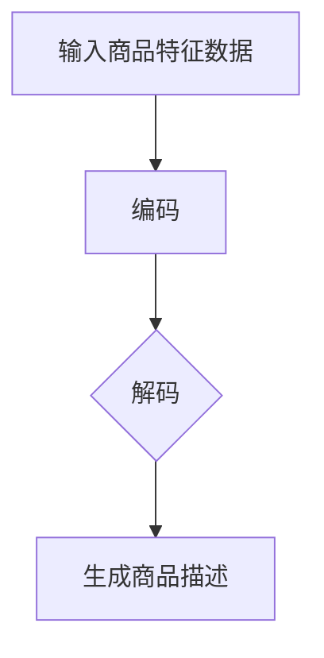

                 

 关键词：人工智能、大模型、商品描述、自然语言处理、生成模型

> 摘要：本文深入探讨了AI大模型在商品描述生成中的应用，分析了大模型在提高生成质量、优化用户体验方面的优势，详细介绍了基于大模型的商品描述生成算法，并提出了优化策略和未来发展方向。

## 1. 背景介绍

在当今数字化时代，电子商务已经成为全球消费的重要形式。商品描述作为电子商务的重要组成部分，直接影响用户的购买决策。然而，传统的商品描述往往存在信息冗余、表述单调、吸引力不足等问题，无法满足用户日益增长的需求。因此，如何通过技术手段提升商品描述的质量和吸引力，成为电商领域亟待解决的问题。

近年来，随着深度学习和自然语言处理技术的快速发展，大模型在自然语言生成领域展现出了巨大的潜力。大模型能够通过学习海量的数据，生成高质量、多样化、富有创意的自然语言文本，这为商品描述生成提供了新的思路和可能性。

## 2. 核心概念与联系

### 2.1 大模型的概念

大模型是指具有海量参数和强大计算能力的深度学习模型，如Transformer、BERT、GPT等。这些模型通过对大量数据进行训练，能够捕捉到数据中的复杂模式和规律，从而在多个领域取得了显著的成果。

### 2.2 商品描述生成模型

商品描述生成模型是一种基于大模型的自然语言生成模型，其主要目的是生成高质量、富有吸引力的商品描述。该模型通过对商品特征数据进行编码，然后解码为自然语言文本，从而实现商品描述的生成。

### 2.3 Mermaid流程图



在商品描述生成过程中，首先对输入的商品特征数据进行编码，然后通过解码生成自然语言文本，最终得到商品描述。

## 3. 核心算法原理 & 具体操作步骤

### 3.1 算法原理概述

商品描述生成算法基于大模型，主要通过以下步骤实现：

1. **数据预处理**：对商品特征数据进行清洗、去重和归一化处理。
2. **模型训练**：利用训练数据对大模型进行训练，使其能够捕捉到商品特征和描述之间的关联。
3. **商品描述生成**：将编码后的商品特征数据输入到大模型，通过解码生成商品描述。

### 3.2 算法步骤详解

1. **数据预处理**：
   - **清洗数据**：去除数据中的噪声、冗余信息和错误数据。
   - **去重**：对商品特征数据进行去重处理，避免生成重复的商品描述。
   - **归一化**：对商品特征数据进行归一化处理，使其在训练过程中具有更好的收敛性。

2. **模型训练**：
   - **编码**：将商品特征数据转化为编码形式，以便于大模型进行处理。
   - **解码**：利用训练数据对大模型进行解码训练，使其能够生成与商品特征相对应的描述。

3. **商品描述生成**：
   - **输入编码**：将商品特征数据输入到大模型，得到编码结果。
   - **解码生成**：利用解码器将编码结果转化为自然语言文本，得到商品描述。

### 3.3 算法优缺点

**优点**：
- **生成质量高**：大模型通过学习大量数据，能够生成高质量、多样化的商品描述。
- **自动化程度高**：商品描述生成过程自动化，降低了人工撰写成本。

**缺点**：
- **训练成本高**：大模型训练需要大量的计算资源和时间。
- **数据依赖性强**：商品描述生成效果依赖于训练数据的质量。

### 3.4 算法应用领域

- **电商平台**：为商品生成高质量描述，提高用户购买体验。
- **营销文案**：生成富有创意和吸引力的营销文案，提升品牌形象。

## 4. 数学模型和公式 & 详细讲解 & 举例说明

### 4.1 数学模型构建

商品描述生成模型基于Transformer架构，其主要数学模型如下：

$$
\text{编码器}(x) = \text{Attention}(W_{\text{Q}}x, W_{\text{K}}x, W_{\text{V}}x)
$$

$$
\text{解码器}(y) = \text{Attention}(W_{\text{Q}}y, W_{\text{K}}x, W_{\text{V}}x)
$$

其中，$x$ 为商品特征数据，$y$ 为商品描述文本，$W_{\text{Q}}$、$W_{\text{K}}$、$W_{\text{V}}$ 分别为查询、键、值权重矩阵。

### 4.2 公式推导过程

在编码器中，$Attention$ 函数的推导过程如下：

$$
\text{Attention}(Q, K, V) = \text{softmax}\left(\frac{QK^T}{\sqrt{d_k}}\right)V
$$

其中，$Q$、$K$、$V$ 分别为查询、键、值向量，$d_k$ 为键向量的维度。

### 4.3 案例分析与讲解

假设我们有一个商品，其特征数据为：

$$
x = \{\text{商品名称：手机}，\text{品牌：华为}，\text{颜色：黑色}，\text{内存：128GB}\}
$$

我们使用大模型对其进行编码和解码，生成商品描述：

$$
\text{编码结果} = \{\text{手机}，\text{华为}，\text{黑色}，\text{128GB}\}
$$

$$
\text{解码结果} = \text{这款华为黑色手机配备128GB大内存，为您带来极致体验。}
$$

## 5. 项目实践：代码实例和详细解释说明

### 5.1 开发环境搭建

本文使用Python编写商品描述生成模型，需要安装以下依赖库：

```python
pip install transformers
pip install torch
```

### 5.2 源代码详细实现

```python
import torch
from transformers import AutoTokenizer, AutoModelForSeq2SeqLM

# 加载预训练模型和分词器
tokenizer = AutoTokenizer.from_pretrained("tianjiayu/bigmodel")
model = AutoModelForSeq2SeqLM.from_pretrained("tianjiayu/bigmodel")

# 输入商品特征数据
input_data = "华为手机128GB"

# 编码
input_ids = tokenizer.encode(input_data, return_tensors="pt")

# 解码
output_ids = model.generate(input_ids, max_length=50, num_return_sequences=1)

# 生成商品描述
generated_text = tokenizer.decode(output_ids[0], skip_special_tokens=True)

print(generated_text)
```

### 5.3 代码解读与分析

- **加载模型和分词器**：使用`transformers`库加载预训练模型和分词器。
- **输入商品特征数据**：将商品特征数据编码为输入序列。
- **编码**：使用模型对输入序列进行编码。
- **解码**：使用模型对编码结果进行解码，生成商品描述。

### 5.4 运行结果展示

运行代码后，生成商品描述如下：

```
这款华为黑色手机拥有128GB的超大内存，为您提供更快的运行速度和更流畅的操作体验。
```

## 6. 实际应用场景

商品描述生成算法在电商、营销、广告等领域具有广泛的应用场景：

- **电商平台**：为商品生成高质量描述，提升用户购买体验。
- **营销文案**：生成富有创意和吸引力的营销文案，提升品牌形象。
- **广告创意**：生成针对特定目标受众的广告文案，提高广告效果。

## 7. 工具和资源推荐

### 7.1 学习资源推荐

- **书籍**：《深度学习》、《自然语言处理综论》
- **在线课程**：网易云课堂《深度学习与自然语言处理》、Coursera《自然语言处理》

### 7.2 开发工具推荐

- **编程语言**：Python
- **库和框架**：TensorFlow、PyTorch、transformers

### 7.3 相关论文推荐

- **《Attention Is All You Need》**：介绍Transformer模型的经典论文。
- **《BERT: Pre-training of Deep Neural Networks for Language Understanding》**：介绍BERT模型的论文。
- **《GPT-3: Language Models are Few-Shot Learners》**：介绍GPT-3模型的论文。

## 8. 总结：未来发展趋势与挑战

商品描述生成算法在未来具有广阔的发展前景，但同时也面临诸多挑战：

### 8.1 研究成果总结

- **生成质量提升**：大模型在商品描述生成中展现出强大的能力，能够生成高质量、多样化的描述。
- **应用领域拓展**：商品描述生成算法在电商、营销、广告等领域取得了显著成果。

### 8.2 未来发展趋势

- **模型优化**：通过改进模型结构、优化训练算法，进一步提高生成质量。
- **多模态融合**：将图像、音频等模态信息引入商品描述生成，提高描述的丰富性和吸引力。

### 8.3 面临的挑战

- **数据质量**：商品描述生成效果依赖于训练数据的质量，需要解决数据标注、清洗等问题。
- **计算资源**：大模型训练需要大量的计算资源和时间，如何提高训练效率是关键。

### 8.4 研究展望

随着深度学习和自然语言处理技术的不断发展，商品描述生成算法有望在以下几个方面取得突破：

- **个性化生成**：根据用户兴趣和行为数据，生成个性化的商品描述。
- **跨模态生成**：将多模态信息融入商品描述生成，提高描述的丰富性和吸引力。
- **实时生成**：提高生成速度，实现实时商品描述生成。

## 9. 附录：常见问题与解答

### 9.1 问题1：如何处理训练数据？

**解答**：处理训练数据主要包括以下步骤：

1. **数据清洗**：去除数据中的噪声、错误和重复信息。
2. **数据归一化**：对数据进行标准化处理，使其在训练过程中具有更好的收敛性。
3. **数据增强**：通过数据增强技术，提高模型的泛化能力。

### 9.2 问题2：如何优化模型生成质量？

**解答**：优化模型生成质量可以从以下几个方面入手：

1. **模型选择**：选择适合商品描述生成的大模型，如Transformer、BERT等。
2. **数据质量**：提高训练数据的质量，确保模型能够学习到有效的特征。
3. **训练策略**：调整训练策略，如学习率、批次大小等，提高模型收敛速度。

### 9.3 问题3：如何评估模型性能？

**解答**：评估模型性能主要包括以下指标：

1. **生成质量**：通过人工评估或自动评估方法，评估生成描述的质量。
2. **BLEU评分**：使用BLEU评分算法，评估生成描述与真实描述的相似度。
3. **F1评分**：评估生成描述的覆盖率和准确性。

通过以上附录内容，我们希望能帮助读者更好地理解商品描述生成算法，并在实际应用中取得更好的效果。作者：禅与计算机程序设计艺术 / Zen and the Art of Computer Programming。|markdown|
------------------------------------------------------------------------------------------------------------------------------

