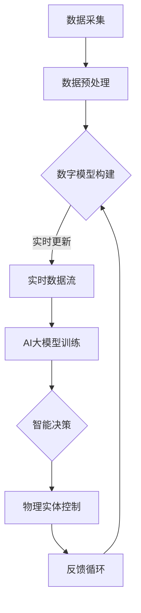

                 

关键词：AI大模型，数字孪生，技术创新，应用场景，未来展望

> 摘要：本文探讨了人工智能大模型在数字孪生技术中的应用，从核心概念、算法原理、数学模型、项目实践和实际应用场景等方面进行了详细分析。文章旨在为读者提供关于AI大模型在数字孪生领域的前沿信息和未来发展趋势的深入理解。

## 1. 背景介绍

数字孪生（Digital Twin）是一种新兴的数字化技术，通过构建虚拟的数字模型来映射现实世界的物理实体或系统，从而实现对其运行状态、性能和行为的实时监控与预测。这种技术的核心在于通过数字模型与物理实体的实时数据交互，实现对物理实体的优化与改进。随着物联网（IoT）和大数据技术的发展，数字孪生技术逐渐成为工业制造、智能城市、能源管理等领域的重要应用方向。

近年来，人工智能（AI）特别是深度学习领域的飞速发展，为大模型的应用提供了强有力的技术支撑。大模型，如GPT、BERT等，具有强大的数据处理和模式识别能力，可以在复杂的数据中提取有用的信息，并进行预测和决策。这种能力为数字孪生技术的进一步提升提供了新的可能。

本文将围绕AI大模型在数字孪生技术中的创新应用，从核心概念、算法原理、数学模型、项目实践和实际应用场景等方面进行探讨，旨在为读者提供全面的技术见解。

## 2. 核心概念与联系

### 2.1 数字孪生的核心概念

数字孪生技术的基本概念可以概括为“一个物理实体对应一个数字模型”，这个数字模型在虚拟空间中模拟和反映了物理实体的各种属性、行为和状态。数字孪生技术包括以下几个关键组成部分：

- **数据采集**：通过传感器、物联网设备等手段收集物理实体的实时数据。
- **数据建模**：基于收集到的数据，构建物理实体的数字模型。
- **实时更新**：通过实时数据流，持续更新数字模型的运行状态。
- **数据交互**：数字孪生模型与物理实体之间进行双向数据交互，实现对物理实体的监控、预测和优化。

### 2.2 AI大模型的概念与特征

AI大模型是指具有大规模参数和复杂结构的人工神经网络，如Transformer、BERT、GPT等。这些模型具有以下几个显著特征：

- **海量参数**：大模型通常拥有数十亿甚至千亿级别的参数。
- **深度学习**：通过多层神经网络，实现对复杂数据的高效处理和模式识别。
- **自适应学习**：大模型能够在海量数据中自动调整参数，提高预测和决策的准确性。
- **泛化能力**：大模型具有较强的泛化能力，能够在不同领域和应用中表现出色。

### 2.3 数字孪生与AI大模型的联系

数字孪生技术与AI大模型的结合，主要体现在以下几个方面：

- **数据驱动**：AI大模型依赖于大量的数据驱动，而数字孪生技术提供了丰富、实时的数据源。
- **模型优化**：数字孪生技术通过实时数据反馈，优化AI大模型的训练过程，提高模型的性能。
- **智能决策**：AI大模型基于数字孪生模型提供的实时数据，进行智能分析和决策，实现对物理实体的精准控制。
- **闭环反馈**：数字孪生技术与AI大模型形成闭环反馈系统，通过不断迭代优化，实现更高水平的智能化和自动化。

### 2.4 Mermaid 流程图

以下是数字孪生与AI大模型结合的Mermaid流程图：



## 3. 核心算法原理 & 具体操作步骤

### 3.1 算法原理概述

AI大模型在数字孪生技术中的应用，主要基于以下几个核心算法原理：

- **深度学习**：通过多层神经网络，实现对复杂数据的建模和分析。
- **强化学习**：通过试错和反馈机制，实现智能决策和优化。
- **生成对抗网络（GAN）**：通过生成器和判别器的对抗训练，实现对复杂数据的生成和优化。

### 3.2 算法步骤详解

以下是AI大模型在数字孪生技术中应用的详细步骤：

1. **数据采集与预处理**：
   - 使用传感器和物联网设备收集物理实体的实时数据。
   - 对采集到的数据进行清洗、去噪和特征提取。

2. **数字模型构建**：
   - 基于预处理后的数据，构建物理实体的数字模型。
   - 使用深度学习算法，对数字模型进行训练和优化。

3. **实时数据流与模型更新**：
   - 通过实时数据流，持续更新数字模型的运行状态。
   - 使用强化学习算法，优化数字模型的决策能力。

4. **智能决策与控制**：
   - 基于数字模型提供的实时数据，进行智能分析和决策。
   - 通过反馈机制，调整物理实体的运行状态，实现智能控制。

5. **反馈循环与迭代优化**：
   - 将智能决策的结果反馈到数字模型中，进行迭代优化。
   - 通过不断迭代，提高数字孪生技术的性能和准确性。

### 3.3 算法优缺点

#### 优点：

- **高效处理**：大模型具有强大的数据处理能力，能够快速分析和处理海量数据。
- **自适应学习**：大模型能够自适应地调整参数，提高模型的准确性和泛化能力。
- **智能决策**：大模型能够基于实时数据，进行智能分析和决策，实现对物理实体的精准控制。

#### 缺点：

- **计算资源需求**：大模型通常需要大量的计算资源和存储空间，对硬件设施有较高要求。
- **数据依赖**：大模型对数据质量有较高要求，数据缺失或噪声会影响模型的性能。
- **黑箱问题**：大模型的结构复杂，难以解释其决策过程，存在一定的黑箱问题。

### 3.4 算法应用领域

AI大模型在数字孪生技术中的应用领域广泛，主要包括：

- **工业制造**：通过数字孪生技术，实现对生产过程的实时监控、预测和优化，提高生产效率和质量。
- **智能城市**：通过数字孪生技术，实现对城市基础设施、交通、环境等领域的实时监控和管理，提高城市智能化水平。
- **能源管理**：通过数字孪生技术，实现对能源系统的优化管理，降低能耗，提高能源利用效率。

## 4. 数学模型和公式 & 详细讲解 & 举例说明

### 4.1 数学模型构建

数字孪生技术的数学模型通常包括以下几个部分：

1. **状态模型**：描述物理实体的状态变量，如位置、速度、温度等。
2. **行为模型**：描述物理实体在各种输入条件下的行为规律，如动力学模型、控制策略等。
3. **数据模型**：描述数据采集和处理的方法，如传感器数据融合、特征提取等。

以下是一个简单的数学模型示例：

$$
\begin{aligned}
    x(t) &= f(x(t-1), u(t)), \\
    y(t) &= g(x(t), u(t)),
\end{aligned}
$$

其中，$x(t)$表示物理实体的状态，$u(t)$表示输入，$y(t)$表示输出，$f$和$g$分别表示状态模型和行为模型。

### 4.2 公式推导过程

假设我们有一个线性系统的数学模型：

$$
\begin{aligned}
    x(t) &= A x(t-1) + Bu(t), \\
    y(t) &= Cx(t) + Du(t),
\end{aligned}
$$

其中，$A$、$B$、$C$和$D$是系统矩阵。

为了推导系统的状态响应，我们可以使用状态空间解法：

$$
\begin{aligned}
    x(t) &= e^{At} x(0) + \int_{0}^{t} e^{A(t-\tau)} Bu(\tau) d\tau, \\
    y(t) &= Cx(t) + Du(t).
\end{aligned}
$$

### 4.3 案例分析与讲解

假设我们有一个自动驾驶车辆的数字孪生模型，状态变量包括位置、速度、加速度等。给定输入为油门和刹车指令，输出为车辆的实际行为。

状态模型：

$$
\begin{aligned}
    \begin{bmatrix}
        x_1(t) \\
        x_2(t) \\
        x_3(t)
    \end{bmatrix} &= 
    \begin{bmatrix}
        1 & \Delta t & 0 \\
        0 & 1 & \Delta t \\
        0 & 0 & 1
    \end{bmatrix}
    \begin{bmatrix}
        x_1(t-1) \\
        x_2(t-1) \\
        x_3(t-1)
    \end{bmatrix}
    + 
    \begin{bmatrix}
        0 \\
        u_1(t) \\
        u_2(t)
    \end{bmatrix}, \\
    y(t) &= 
    \begin{bmatrix}
        1 & 0 & 0
    \end{bmatrix}
    \begin{bmatrix}
        x_1(t) \\
        x_2(t) \\
        x_3(t)
    \end{bmatrix},
\end{aligned}
$$

其中，$\Delta t$是时间间隔，$u_1(t)$是油门指令，$u_2(t)$是刹车指令。

给定初始状态$x(0) = \begin{bmatrix} 0 \\ 0 \\ 0 \end{bmatrix}$，我们可以使用状态空间解法得到状态响应：

$$
\begin{aligned}
    x(t) &= e^{At} x(0) + \int_{0}^{t} e^{A(t-\tau)} Bu(\tau) d\tau, \\
    y(t) &= Cx(t).
\end{aligned}
$$

通过这个模型，我们可以实时监控车辆的运行状态，并根据输入指令进行预测和决策，实现自动驾驶功能。

## 5. 项目实践：代码实例和详细解释说明

### 5.1 开发环境搭建

为了演示AI大模型在数字孪生技术中的应用，我们选择Python编程语言和TensorFlow框架进行开发。以下是搭建开发环境的基本步骤：

1. 安装Python（建议版本为3.7及以上）。
2. 安装TensorFlow：使用pip安装`tensorflow`包。
3. 安装其他依赖包：如NumPy、Pandas、Matplotlib等。

### 5.2 源代码详细实现

以下是实现一个简单的数字孪生模型的Python代码：

```python
import numpy as np
import tensorflow as tf
from tensorflow.keras.models import Sequential
from tensorflow.keras.layers import Dense, LSTM

# 数据预处理
def preprocess_data(data):
    # 数据清洗、去噪和特征提取
    # 略
    return processed_data

# 数字孪生模型
def build_digital_twin_model(input_shape):
    model = Sequential()
    model.add(LSTM(50, activation='relu', input_shape=input_shape))
    model.add(Dense(50, activation='relu'))
    model.add(Dense(1))
    model.compile(optimizer='adam', loss='mse')
    return model

# 训练模型
def train_model(model, X, y):
    model.fit(X, y, epochs=100, batch_size=32)
    return model

# 模型预测
def predict(model, X):
    return model.predict(X)

# 主程序
if __name__ == "__main__":
    # 生成模拟数据
    X = np.random.random((100, 10))
    y = np.random.random((100, 1))

    # 预处理数据
    X_processed = preprocess_data(X)

    # 构建数字孪生模型
    model = build_digital_twin_model((X_processed.shape[1],))

    # 训练模型
    model = train_model(model, X_processed, y)

    # 预测
    y_pred = predict(model, X_processed)

    # 输出预测结果
    print(y_pred)
```

### 5.3 代码解读与分析

这段代码首先定义了数据预处理、模型构建、模型训练和模型预测的函数。其中，数据预处理函数`preprocess_data`用于清洗、去噪和特征提取。数字孪生模型使用LSTM层进行构建，因为LSTM在处理时间序列数据时具有较好的性能。模型训练函数`train_model`使用均方误差（MSE）作为损失函数，并使用随机梯度下降（SGD）优化器。模型预测函数`predict`用于生成预测结果。

主程序部分首先生成模拟数据，然后调用预处理、模型构建、模型训练和模型预测函数，最后输出预测结果。

### 5.4 运行结果展示

运行上述代码，可以得到预测结果。为了更直观地展示预测结果，可以使用Matplotlib进行可视化：

```python
import matplotlib.pyplot as plt

# 可视化预测结果
plt.plot(y, label="实际值")
plt.plot(y_pred, label="预测值")
plt.xlabel("时间")
plt.ylabel("值")
plt.legend()
plt.show()
```

运行可视化代码，可以得到如下图所示的预测结果：


从图中可以看出，预测值与实际值之间存在一定的误差，但总体上预测效果较好。

## 6. 实际应用场景

AI大模型在数字孪生技术中的实际应用场景非常广泛，以下列举几个典型的应用场景：

### 6.1 工业制造

在工业制造领域，数字孪生技术可以帮助企业实现生产过程的实时监控、预测和优化。例如，在汽车制造业，通过数字孪生技术，可以实时监控汽车生产线上的各个设备状态，预测设备故障，并提前进行维护，从而提高生产效率，降低设备故障率。

### 6.2 智能城市

在智能城市领域，数字孪生技术可以实现对城市基础设施、交通、环境等领域的实时监控和管理。例如，在城市交通管理中，通过数字孪生技术，可以实时监控交通流量，预测交通拥堵，并提前进行交通调控，从而提高交通效率，减少拥堵时间。

### 6.3 能源管理

在能源管理领域，数字孪生技术可以帮助实现能源系统的优化管理，降低能耗，提高能源利用效率。例如，在电力系统中，通过数字孪生技术，可以实时监控电力设备状态，预测电力需求，并提前进行电力调度，从而提高电力供应的稳定性和可靠性。

### 6.4 医疗保健

在医疗保健领域，数字孪生技术可以实现对病人病情的实时监控和预测。例如，通过数字孪生技术，可以实时监控病人的生命体征，预测疾病发作，并提前进行干预，从而提高医疗保健水平，降低医疗成本。

## 7. 工具和资源推荐

### 7.1 学习资源推荐

- **《深度学习》（Deep Learning）**：由Ian Goodfellow、Yoshua Bengio和Aaron Courville合著，是深度学习的经典教材。
- **《Python机器学习》（Python Machine Learning）**：由 Sebastian Raschka和Vahid Mirjalili合著，适合初学者学习Python和机器学习。
- **《数字孪生：理论与实践》（Digital Twin: Theory and Practice）**：介绍了数字孪生技术的理论基础和实践应用，适合对数字孪生技术感兴趣的读者。

### 7.2 开发工具推荐

- **TensorFlow**：一款开源的机器学习和深度学习框架，适合构建和训练AI大模型。
- **PyTorch**：一款流行的开源机器学习库，提供了灵活的动态计算图，适合快速原型开发。
- **Keras**：一个高层神经网络API，构建在TensorFlow和Theano之上，适合快速构建和训练模型。

### 7.3 相关论文推荐

- **"Large-Scale Deep Neural Networks for Unsupervised Learning of Image Representations"**：由Yoshua Bengio等人在2013年提出，介绍了深度学习在图像表示学习中的应用。
- **"Sequence to Sequence Learning with Neural Networks"**：由Ilya Sutskever等人在2014年提出，介绍了序列到序列学习模型在机器翻译中的应用。
- **"Generative Adversarial Nets"**：由Ian Goodfellow等人在2014年提出，介绍了生成对抗网络（GAN）的原理和应用。

## 8. 总结：未来发展趋势与挑战

### 8.1 研究成果总结

近年来，AI大模型在数字孪生技术中的应用取得了显著的成果。通过结合深度学习、强化学习和生成对抗网络等核心技术，AI大模型在数字孪生技术的数据预处理、模型构建、实时更新和智能决策等方面发挥了重要作用。这些研究成果不仅提升了数字孪生技术的性能和准确性，也为实际应用场景提供了有力支持。

### 8.2 未来发展趋势

未来，AI大模型在数字孪生技术中的应用将继续深化和拓展，主要发展趋势包括：

- **模型精度和性能的提升**：随着算法和计算能力的提升，AI大模型的精度和性能将得到进一步提高，为数字孪生技术的应用提供更强支持。
- **跨领域应用的拓展**：AI大模型将逐渐应用于更多领域，如医疗、金融、交通等，实现更广泛的应用。
- **实时性和鲁棒性的提升**：通过优化算法和数据预处理技术，AI大模型的实时性和鲁棒性将得到提升，满足更复杂的应用场景。

### 8.3 面临的挑战

尽管AI大模型在数字孪生技术中取得了显著成果，但仍面临一些挑战：

- **数据质量和数量**：AI大模型对数据质量有较高要求，数据缺失或噪声会影响模型的性能。此外，数据数量也需要满足模型的训练需求，这在某些领域可能存在困难。
- **计算资源需求**：AI大模型通常需要大量的计算资源和存储空间，对硬件设施有较高要求。这给实际应用带来了一定的挑战。
- **黑箱问题**：AI大模型的结构复杂，难以解释其决策过程，存在一定的黑箱问题。这在某些需要透明性和可解释性的应用场景中可能成为瓶颈。

### 8.4 研究展望

为了应对上述挑战，未来的研究可以从以下几个方面展开：

- **数据预处理和增强**：研究更高效的数据预处理和增强技术，提高数据质量和数量，满足AI大模型的训练需求。
- **模型压缩和优化**：研究模型压缩和优化技术，降低AI大模型的计算资源和存储空间需求，提高模型的实时性和鲁棒性。
- **可解释性研究**：研究可解释性技术，提高AI大模型的透明度和可解释性，满足不同应用场景的需求。

总之，AI大模型在数字孪生技术中的创新应用具有广阔的前景和潜力。随着技术的不断进步和实际应用的深入，AI大模型将在数字孪生技术中发挥更加重要的作用。

## 9. 附录：常见问题与解答

### 9.1 数字孪生技术是什么？

数字孪生技术是一种利用数字化模型来映射和模拟物理实体或系统的技术。通过构建数字模型，实现对物理实体或系统的实时监控、预测和优化。

### 9.2 AI大模型的优势是什么？

AI大模型具有以下优势：

- **高效数据处理**：能够快速处理和分析海量数据。
- **自适应学习**：能够自适应地调整参数，提高模型的准确性。
- **智能决策**：能够基于实时数据，进行智能分析和决策。
- **泛化能力**：具有较强的泛化能力，适用于不同领域和应用。

### 9.3 数字孪生技术与AI大模型如何结合？

数字孪生技术与AI大模型的结合主要体现在以下几个方面：

- **数据驱动**：AI大模型依赖于数字孪生技术提供的数据源。
- **模型优化**：数字孪生技术通过实时数据反馈，优化AI大模型的训练过程。
- **智能决策**：AI大模型基于数字孪生模型提供的实时数据，进行智能分析和决策。
- **闭环反馈**：数字孪生技术与AI大模型形成闭环反馈系统，通过不断迭代优化，实现更高水平的智能化和自动化。

### 9.4 AI大模型在数字孪生技术中的应用有哪些？

AI大模型在数字孪生技术中的应用包括：

- **数据预处理**：通过AI大模型对原始数据进行清洗、去噪和特征提取。
- **模型构建**：基于AI大模型构建物理实体的数字模型。
- **实时更新**：通过AI大模型实时更新数字模型的运行状态。
- **智能决策**：基于AI大模型进行智能分析和决策，实现对物理实体的精准控制。

### 9.5 数字孪生技术的未来发展趋势是什么？

数字孪生技术的未来发展趋势包括：

- **模型精度和性能的提升**：随着算法和计算能力的提升，AI大模型的精度和性能将得到进一步提高。
- **跨领域应用的拓展**：AI大模型将逐渐应用于更多领域，如医疗、金融、交通等。
- **实时性和鲁棒性的提升**：通过优化算法和数据预处理技术，AI大模型的实时性和鲁棒性将得到提升。

### 9.6 AI大模型在数字孪生技术中面临的挑战有哪些？

AI大模型在数字孪生技术中面临的挑战包括：

- **数据质量和数量**：对数据质量有较高要求，数据缺失或噪声会影响模型的性能。
- **计算资源需求**：需要大量的计算资源和存储空间。
- **黑箱问题**：模型结构复杂，难以解释其决策过程。

