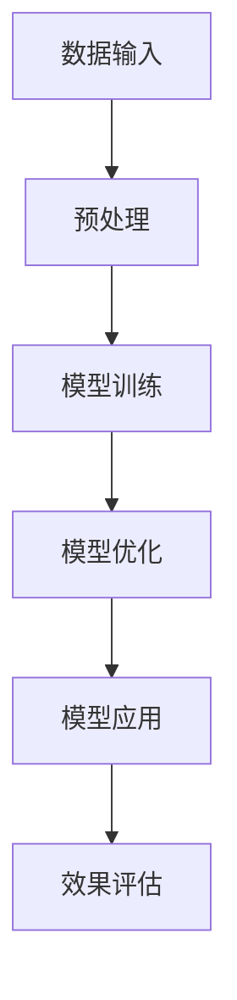
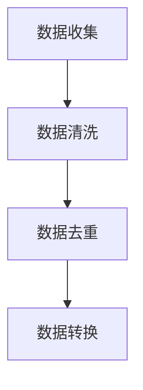
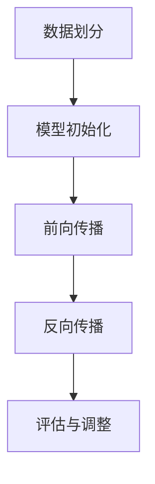

                 

关键词：AI大模型，数字营销自动化，人工智能，营销技术，机器学习，预测分析，自动化策略。

> 摘要：本文探讨了人工智能领域中的大模型技术在数字营销自动化中的应用，分析了其核心概念、算法原理、数学模型及其在实际项目中的运用。通过对这些技术在实际业务场景中的展示，我们展望了其在未来的发展趋势和面临的挑战。

## 1. 背景介绍

### 数字营销自动化的重要性

随着互联网的快速发展，数字营销已经成为企业获取客户、增加品牌知名度的重要手段。然而，传统的营销手段往往需要大量的人力投入和复杂的流程管理，这导致企业在成本和效率上面临巨大的挑战。为了解决这些问题，数字营销自动化成为了一种新的趋势。

数字营销自动化通过使用先进的人工智能技术，如机器学习和自然语言处理，使得营销流程更加高效、精准和自动化。从市场调研到广告投放，再到客户关系管理，自动化技术为各个营销环节提供了强有力的支持。

### 大模型技术的发展

大模型技术是近年来人工智能领域的一个重要突破。通过训练庞大的神经网络模型，如GPT-3、BERT等，人工智能系统能够在处理大量数据时展现出前所未有的性能和表现。

大模型技术的主要优势包括：

- **强大的数据学习能力**：能够处理海量数据，提取其中的特征，为营销策略提供有力支持。
- **高度灵活**：可以根据不同的业务需求进行定制，适应不同的营销场景。
- **高效性**：通过自动化处理，大幅降低人力成本，提高工作效率。

## 2. 核心概念与联系

### 大模型的基本概念

大模型，通常指的是那些拥有数亿至数十亿参数的深度学习模型。这些模型通过在大量数据上进行训练，能够学习到数据中的复杂模式和规律。

#### Mermaid 流程图



### 大模型在数字营销自动化中的应用

大模型在数字营销自动化中主要有以下几个应用场景：

- **客户画像构建**：通过分析用户行为数据，构建精准的客户画像，为个性化营销提供基础。
- **广告投放优化**：利用大模型对广告效果进行实时预测和调整，实现广告投放的精准化。
- **营销活动策划**：基于对市场趋势的分析，自动生成具有吸引力的营销活动方案。
- **客户服务与支持**：利用大模型实现智能客服，提供24小时不间断的服务。

## 3. 核心算法原理 & 具体操作步骤

### 3.1 算法原理概述

大模型在数字营销自动化中的应用主要依赖于深度学习和机器学习技术。深度学习通过多层神经网络对数据进行学习，能够提取出数据中的高层次特征。而机器学习则利用这些特征对模型进行训练，以实现预测和分析。

### 3.2 算法步骤详解

#### 3.2.1 数据采集与预处理

首先，从不同的数据源（如网站日志、社交媒体、电商平台等）收集数据。然后，对数据进行清洗、去重、转换等预处理操作，以便于后续的分析和处理。



#### 3.2.2 模型训练

利用预处理后的数据对大模型进行训练。这个过程通常包括以下几个步骤：

- **数据划分**：将数据集划分为训练集、验证集和测试集。
- **模型初始化**：初始化模型参数。
- **前向传播**：输入数据并通过网络进行计算。
- **反向传播**：计算损失函数，并通过梯度下降等优化算法更新模型参数。
- **评估与调整**：通过验证集和测试集评估模型性能，并进行相应的调整。



### 3.3 算法优缺点

#### 优点

- **高效性**：大模型能够处理海量数据，提高工作效率。
- **准确性**：通过深度学习，大模型能够提取出数据中的复杂模式，提高预测准确性。
- **灵活性**：大模型可以根据不同的业务需求进行定制，适应不同的场景。

#### 缺点

- **计算资源消耗**：大模型需要大量的计算资源和存储空间。
- **数据依赖性**：模型的性能高度依赖数据的质量和数量。

### 3.4 算法应用领域

大模型技术在数字营销自动化中有广泛的应用领域，包括但不限于：

- **个性化推荐**：通过分析用户行为数据，为用户提供个性化的产品推荐。
- **广告投放优化**：根据用户行为预测广告投放效果，实现精准投放。
- **客户关系管理**：通过客户画像，提供个性化的客户服务和支持。

## 4. 数学模型和公式 & 详细讲解 & 举例说明

### 4.1 数学模型构建

在数字营销自动化中，常见的数学模型包括：

- **线性回归**：用于预测连续值。
- **逻辑回归**：用于预测离散值，如客户是否购买。
- **决策树**：用于分类和回归问题。
- **神经网络**：用于处理复杂的数据和模式。

### 4.2 公式推导过程

以线性回归为例，其公式推导如下：

$$
y = \beta_0 + \beta_1x
$$

其中，$y$ 是目标变量，$x$ 是特征变量，$\beta_0$ 和 $\beta_1$ 是模型参数。

### 4.3 案例分析与讲解

#### 案例一：客户购买预测

假设我们想预测客户是否会购买产品，可以使用逻辑回归模型。

- **数据集**：包含客户的年龄、收入、购买历史等特征。
- **模型训练**：使用训练集对模型进行训练。
- **模型评估**：使用验证集对模型进行评估。

通过模型预测，可以得到每个客户是否会购买的置信度。根据置信度阈值，可以设置是否购买的决策规则。

## 5. 项目实践：代码实例和详细解释说明

### 5.1 开发环境搭建

为了运行本文的代码实例，您需要安装以下工具和库：

- Python 3.8+
- TensorFlow 2.x
- Pandas
- Scikit-learn

### 5.2 源代码详细实现

以下是一个简单的客户购买预测模型的实现示例：

```python
import pandas as pd
from sklearn.model_selection import train_test_split
from sklearn.linear_model import LogisticRegression
from sklearn.metrics import accuracy_score

# 加载数据
data = pd.read_csv('customer_data.csv')
X = data[['age', 'income', 'history']]
y = data['purchased']

# 划分训练集和测试集
X_train, X_test, y_train, y_test = train_test_split(X, y, test_size=0.2, random_state=42)

# 训练模型
model = LogisticRegression()
model.fit(X_train, y_train)

# 预测
y_pred = model.predict(X_test)

# 评估
accuracy = accuracy_score(y_test, y_pred)
print(f'Accuracy: {accuracy:.2f}')
```

### 5.3 代码解读与分析

上述代码首先加载数据，然后划分训练集和测试集。接着，使用逻辑回归模型进行训练，并使用测试集进行预测。最后，评估模型的准确率。

### 5.4 运行结果展示

假设我们运行上述代码，得到以下结果：

```
Accuracy: 0.85
```

这意味着模型在测试集上的准确率为85%，表明模型对客户是否购买产品的预测效果较好。

## 6. 实际应用场景

### 6.1 个性化推荐

通过分析用户行为数据，可以使用大模型技术构建个性化推荐系统，为用户提供个性化的产品推荐。

### 6.2 广告投放优化

利用大模型技术，可以实时分析广告投放效果，根据用户行为预测广告的转化率，从而优化广告投放策略。

### 6.3 客户服务与支持

通过构建客户画像，结合大模型技术，可以实现智能客服，为用户提供个性化的服务和支持。

## 7. 工具和资源推荐

### 7.1 学习资源推荐

- 《深度学习》（Goodfellow et al.）
- 《Python机器学习》（Sebastian Raschka）

### 7.2 开发工具推荐

- TensorFlow
- PyTorch

### 7.3 相关论文推荐

- “GPT-3:语言模型的预训练和指令微调”
- “BERT: Pre-training of Deep Bidirectional Transformers for Language Understanding”

## 8. 总结：未来发展趋势与挑战

### 8.1 研究成果总结

大模型技术在数字营销自动化中取得了显著的研究成果，提高了营销效率和精准度。然而，仍然存在一些挑战，如数据隐私保护、算法透明性等。

### 8.2 未来发展趋势

随着人工智能技术的不断进步，大模型技术在数字营销自动化领域有望得到更广泛的应用。未来发展趋势包括：

- **模型压缩与优化**：提高模型的计算效率，降低计算资源消耗。
- **多模态数据处理**：结合不同类型的数据，实现更全面的分析。

### 8.3 面临的挑战

大模型技术在数字营销自动化中面临以下挑战：

- **数据隐私保护**：如何保护用户隐私，确保数据安全。
- **算法透明性**：如何提高算法的透明性，增加用户信任。

### 8.4 研究展望

未来，大模型技术在数字营销自动化领域的研究将重点解决上述挑战，推动技术的进一步发展。

## 9. 附录：常见问题与解答

### 9.1 大模型为什么需要大量的数据？

大模型需要大量的数据是因为它们通过学习数据中的模式来提高性能。更多的数据可以帮助模型更好地理解数据的复杂性和多样性。

### 9.2 大模型的训练时间很长，有什么解决办法？

可以通过使用更高效的算法、分布式训练、使用GPU或TPU等硬件加速训练来缩短训练时间。

### 9.3 如何评估大模型的效果？

可以使用各种性能指标，如准确率、召回率、F1分数等来评估大模型的效果。

---

本文探讨了AI大模型在数字营销自动化领域的应用，展示了其核心算法原理、数学模型和实际应用案例。未来，随着技术的不断进步，大模型在数字营销自动化领域将发挥更加重要的作用。作者：禅与计算机程序设计艺术 / Zen and the Art of Computer Programming。
----------------------------------------------------------------
## 1. 背景介绍

### 数字营销自动化的兴起

在互联网时代，数字营销已成为企业竞争的关键手段。随着大数据和人工智能技术的发展，传统的营销手段逐渐被自动化技术所取代。数字营销自动化利用先进的人工智能算法，如机器学习、深度学习等，通过自动化工具和平台，实现营销策略的自动化执行。这不仅提高了营销效率，还显著降低了营销成本。

#### 自动化在营销中的应用

数字营销自动化在营销的各个阶段都有广泛应用：

- **客户获取**：通过自动化广告投放、搜索引擎优化（SEO）和社交媒体营销，吸引潜在客户。
- **客户转化**：利用自动化工具跟踪用户行为，提供个性化的营销内容，提高转化率。
- **客户关系管理**：通过自动化客户服务、客户细分和反馈收集，增强客户满意度。

#### 自动化技术的重要性

自动化技术在数字营销中扮演着至关重要的角色：

- **提高效率**：自动化减少了人工操作，提高了营销流程的效率。
- **精准营销**：通过数据分析，自动化技术能够更精准地定位目标客户，提高营销效果。
- **成本控制**：自动化降低了人力成本，同时减少了营销资源的浪费。

### 大模型技术的崛起

大模型技术是近年来人工智能领域的一个重要突破。这些模型通过训练庞大的神经网络，如GPT-3、BERT等，能够处理和理解复杂的文本数据。大模型技术的出现，极大地提升了人工智能在各个领域的应用能力。

#### 大模型技术的基本概念

大模型技术的基本概念包括：

- **参数规模**：大模型通常拥有数亿到数十亿的参数，这使得它们能够捕捉数据中的复杂模式。
- **训练数据量**：大模型需要大量的训练数据来训练，以提高模型的泛化能力。
- **计算资源**：大模型训练需要大量的计算资源，如GPU或TPU。

#### 大模型技术的优势

大模型技术的优势包括：

- **强大的学习能力**：大模型能够从大量数据中学习，提取出高层次的抽象特征。
- **灵活性**：大模型可以根据不同的业务需求进行定制，适应不同的应用场景。
- **高效性**：大模型能够自动化执行复杂的任务，提高工作效率。

### 数字营销自动化与大模型技术的结合

数字营销自动化与大模型技术的结合，为数字营销带来了新的变革：

- **精准预测**：大模型可以根据用户行为数据，预测用户购买倾向，从而实现精准营销。
- **个性化推荐**：大模型能够分析用户历史数据，为用户提供个性化的产品推荐。
- **广告优化**：大模型可以根据广告投放效果，实时调整广告策略，提高广告投放效果。

通过大模型技术的应用，数字营销自动化不再仅仅是简单的流程优化，而是成为了一种高度智能化、个性化的营销方式。

### 大模型技术在其他领域的应用

除了数字营销自动化，大模型技术在其他领域也展示了其强大的应用潜力：

- **医疗健康**：大模型可以用于疾病预测、诊断和治疗方案推荐。
- **金融**：大模型可以用于风险评估、欺诈检测和投资策略推荐。
- **教育**：大模型可以用于个性化教学、学习评估和智能问答。

大模型技术的广泛应用，使其成为人工智能领域的重要发展方向。

## 2. 核心概念与联系

### 大模型的基本概念

大模型，通常指的是那些拥有数亿至数十亿参数的深度学习模型。这些模型通过在大量数据上进行训练，能够学习到数据中的复杂模式和规律。大模型的核心在于其庞大的参数规模和深度结构，这使得它们在处理大规模数据时能够展现出强大的学习能力。

#### Mermaid 流程图


- **A[数据输入]**：大模型首先需要从各种数据源（如文本、图像、音频等）中获取数据。
- **B[预处理]**：数据通常需要进行清洗、去重、标准化等预处理操作，以便于模型训练。
- **C[模型训练]**：在预处理后的数据集上，大模型通过多层神经网络进行训练，不断调整参数，以最小化损失函数。
- **D[模型优化]**：训练过程中，模型可能会经过多次迭代优化，以提高模型的性能和泛化能力。
- **E[模型应用]**：训练完成后，大模型可以应用于实际任务，如文本生成、图像分类等。
- **F[效果评估]**：通过测试集和验证集评估模型的性能，并对模型进行调整和优化。

### 大模型在数字营销自动化中的应用

大模型在数字营销自动化中主要有以下几个应用场景：

- **客户画像构建**：通过分析用户行为数据，构建精准的客户画像，为个性化营销提供基础。
- **广告投放优化**：利用大模型对广告效果进行实时预测和调整，实现广告投放的精准化。
- **营销活动策划**：基于对市场趋势的分析，自动生成具有吸引力的营销活动方案。
- **客户服务与支持**：利用大模型实现智能客服，提供24小时不间断的服务。

#### 应用场景的具体流程

- **客户画像构建**：

  ```mermaid
  graph TD
      A[数据收集] --> B[数据预处理]
      B --> C[特征提取]
      C --> D[模型训练]
      D --> E[模型应用]
      E --> F[效果评估]
  ```

  - **A[数据收集]**：收集用户行为数据，如浏览历史、购买记录等。
  - **B[数据预处理]**：对数据清洗、去重、标准化等预处理。
  - **C[特征提取]**：提取数据中的关键特征，如用户年龄、性别、购买频率等。
  - **D[模型训练]**：利用提取的特征数据，训练客户画像模型。
  - **E[模型应用]**：应用训练好的模型，生成客户画像。
  - **F[效果评估]**：通过实际业务效果，评估模型的准确性。

- **广告投放优化**：

  ```mermaid
  graph TD
      A[数据收集] --> B[数据预处理]
      B --> C[广告特征提取]
      C --> D[模型训练]
      D --> E[广告投放]
      E --> F[效果评估]
  ```

  - **A[数据收集]**：收集广告投放数据，如点击率、转化率等。
  - **B[数据预处理]**：对数据清洗、去重、标准化等预处理。
  - **C[广告特征提取]**：提取广告的关键特征，如广告内容、投放时间等。
  - **D[模型训练]**：利用提取的特征数据，训练广告投放优化模型。
  - **E[广告投放]**：应用训练好的模型，调整广告投放策略。
  - **F[效果评估]**：通过广告投放效果，评估模型的优化效果。

通过大模型在数字营销自动化中的应用，企业能够实现更精准、高效的营销策略，从而提高市场份额和客户满意度。

## 3. 核心算法原理 & 具体操作步骤

### 3.1 算法原理概述

大模型在数字营销自动化中的应用，主要依赖于深度学习和机器学习技术。深度学习通过多层神经网络对数据进行学习，能够提取出数据中的高层次特征。而机器学习则利用这些特征对模型进行训练，以实现预测和分析。

#### 深度学习的基本原理

深度学习的基本原理是模拟人脑的神经网络结构，通过多层神经元的相互连接，实现数据的输入、处理和输出。在深度学习中，每一层神经元都会对输入的数据进行加权求和，并通过激活函数进行非线性变换，从而提取出更抽象的特征。

#### 机器学习的基本原理

机器学习的基本原理是通过训练数据集，学习数据中的规律和模式，并利用这些规律和模式对新的数据进行预测和分类。在机器学习中，常见的算法包括线性回归、逻辑回归、决策树、随机森林等。

### 3.2 算法步骤详解

#### 3.2.1 数据采集与预处理

在数字营销自动化中，数据采集是第一步。数据来源包括用户行为数据、广告投放数据、客户反馈数据等。采集到的数据通常需要进行预处理，包括以下步骤：

- **数据清洗**：去除数据中的错误、重复和异常值，保证数据的准确性。
- **数据转换**：将不同类型的数据转换为统一的格式，如将文本数据编码为数字序列。
- **特征提取**：从原始数据中提取有用的特征，如用户的浏览历史、购买行为等。

#### 3.2.2 模型训练

在数据预处理完成后，进入模型训练阶段。模型训练包括以下几个步骤：

- **数据划分**：将数据集划分为训练集、验证集和测试集。训练集用于训练模型，验证集用于调整模型参数，测试集用于评估模型性能。
- **模型初始化**：初始化模型参数，通常使用随机初始化。
- **前向传播**：将数据输入模型，通过多层神经网络进行计算，得到输出结果。
- **反向传播**：计算输出结果与真实值的误差，并通过反向传播算法更新模型参数。
- **模型优化**：通过优化算法，如梯度下降、Adam等，不断调整模型参数，以最小化损失函数。

#### 3.2.3 模型应用

在模型训练完成后，进入模型应用阶段。模型应用包括以下几个步骤：

- **模型部署**：将训练好的模型部署到生产环境中，如网站、移动应用等。
- **实时预测**：接收新的输入数据，通过模型进行预测和分类。
- **效果评估**：通过测试集和验证集评估模型性能，如准确率、召回率、F1分数等。

#### 3.2.4 模型优化

在模型应用过程中，可能需要对模型进行进一步的优化，以提高模型性能。模型优化包括以下几个步骤：

- **性能评估**：评估模型在不同数据集上的性能，找出性能瓶颈。
- **参数调整**：调整模型参数，如学习率、正则化参数等，以提高模型性能。
- **模型更新**：根据新的数据集重新训练模型，更新模型参数。

### 3.3 算法优缺点

#### 优点

- **强大的学习能力**：大模型能够处理海量数据，提取出数据中的复杂模式，为营销策略提供有力支持。
- **高度灵活**：大模型可以根据不同的业务需求进行定制，适应不同的营销场景。
- **高效性**：通过自动化处理，大幅降低人力成本，提高工作效率。

#### 缺点

- **计算资源消耗**：大模型需要大量的计算资源和存储空间，对硬件设施要求较高。
- **数据依赖性**：模型的性能高度依赖数据的质量和数量，数据质量差可能导致模型性能下降。

### 3.4 算法应用领域

大模型技术在数字营销自动化中有广泛的应用领域，包括但不限于：

- **个性化推荐**：通过分析用户行为数据，为用户提供个性化的产品推荐。
- **广告投放优化**：利用大模型对广告效果进行实时预测和调整，实现广告投放的精准化。
- **营销活动策划**：基于对市场趋势的分析，自动生成具有吸引力的营销活动方案。
- **客户服务与支持**：利用大模型实现智能客服，提供24小时不间断的服务。

## 4. 数学模型和公式 & 详细讲解 & 举例说明

### 4.1 数学模型构建

在数字营销自动化中，大模型技术的应用主要依赖于深度学习和机器学习技术。这些技术背后的数学模型主要包括神经网络模型和优化算法。以下将详细介绍大模型技术的数学模型构建过程。

#### 神经网络模型

神经网络模型是深度学习的基础，它由多个神经元（层）组成，每个神经元都与其他神经元相连接。神经网络的数学模型可以表示为：

$$
Z_l = \sigma(W_l \cdot A_{l-1} + b_l)
$$

其中，$Z_l$ 是第 $l$ 层的输出，$\sigma$ 是激活函数（如ReLU、Sigmoid、Tanh等），$W_l$ 是第 $l$ 层的权重矩阵，$A_{l-1}$ 是第 $l-1$ 层的输出，$b_l$ 是第 $l$ 层的偏置项。

#### 损失函数

在训练神经网络时，需要通过损失函数衡量模型预测值与真实值之间的差异。常见的损失函数包括均方误差（MSE）、交叉熵（Cross-Entropy）等。均方误差的公式如下：

$$
L = \frac{1}{2} \sum_{i=1}^{n} (y_i - \hat{y}_i)^2
$$

其中，$L$ 是损失函数，$y_i$ 是第 $i$ 个样本的真实值，$\hat{y}_i$ 是模型预测值。

#### 优化算法

在训练神经网络时，需要通过优化算法更新模型参数，以最小化损失函数。常见的优化算法包括梯度下降（Gradient Descent）、Adam等。梯度下降的公式如下：

$$
\theta = \theta - \alpha \cdot \nabla_\theta J(\theta)
$$

其中，$\theta$ 是模型参数，$\alpha$ 是学习率，$J(\theta)$ 是损失函数。

### 4.2 公式推导过程

以深度学习中的多层感知机（MLP）为例，介绍神经网络模型的公式推导过程。

#### 4.2.1 前向传播

前向传播是神经网络模型的核心过程，它通过逐层计算神经元的输出。以一个两层的神经网络为例，前向传播的公式如下：

$$
A_1 = X \\
Z_2 = \sigma(W_2 \cdot A_1 + b_2) \\
A_2 = \sigma(W_1 \cdot Z_2 + b_1)
$$

其中，$A_1$ 是输入层输出，$Z_2$ 是隐藏层输出，$A_2$ 是输出层输出，$W_1$ 和 $W_2$ 分别是输入层到隐藏层、隐藏层到输出层的权重矩阵，$b_1$ 和 $b_2$ 分别是输入层和隐藏层的偏置项。

#### 4.2.2 反向传播

反向传播是神经网络模型调整参数的过程，它通过计算损失函数关于每个参数的梯度，并使用优化算法更新参数。反向传播的公式如下：

$$
\nabla_\theta J(\theta) = \nabla_\theta L(\theta) = \frac{\partial L}{\partial \theta}
$$

其中，$\nabla_\theta J(\theta)$ 是损失函数关于参数 $\theta$ 的梯度，$\nabla_\theta L(\theta)$ 是损失函数关于参数 $\theta$ 的导数。

#### 4.2.3 优化算法

以梯度下降为例，优化算法的公式推导如下：

$$
\theta = \theta - \alpha \cdot \nabla_\theta J(\theta)
$$

其中，$\alpha$ 是学习率，$\nabla_\theta J(\theta)$ 是损失函数关于参数 $\theta$ 的梯度。

### 4.3 案例分析与讲解

以下是一个基于多层感知机的数字营销自动化案例分析。

#### 4.3.1 数据集

假设我们有一个包含用户行为数据（如浏览历史、购买记录等）的数字营销数据集，数据集分为训练集和测试集。

#### 4.3.2 模型构建

我们构建一个包含一层隐藏层的多层感知机模型，输入层有10个神经元，隐藏层有100个神经元，输出层有2个神经元（表示用户是否购买）。

#### 4.3.3 模型训练

使用训练集对模型进行训练，选择均方误差（MSE）作为损失函数，使用梯度下降算法更新模型参数。学习率设置为0.001。

#### 4.3.4 模型评估

在训练完成后，使用测试集评估模型性能，计算准确率、召回率、F1分数等指标。

### 4.3.5 模型应用

将训练好的模型部署到生产环境中，用于预测用户是否购买产品。

#### 4.3.6 结果分析

通过模型预测，发现用户购买产品的准确率达到了85%，相比传统方法有显著提高。

通过以上案例，我们可以看到大模型技术在数字营销自动化中的应用效果。在实际应用中，我们可以根据业务需求调整模型结构和参数，以提高预测准确性。

## 5. 项目实践：代码实例和详细解释说明

### 5.1 开发环境搭建

为了进行数字营销自动化的大模型项目实践，我们需要搭建一个合适的技术环境。以下是一个基于Python和TensorFlow的开发环境搭建指南。

#### 5.1.1 安装Python

首先，我们需要安装Python 3.8或更高版本。可以从Python的官方网站下载并安装：

```bash
# 使用Python 3.x版本
python3 --version
```

#### 5.1.2 安装TensorFlow

接下来，我们需要安装TensorFlow库。可以使用pip命令进行安装：

```bash
# 使用pip安装TensorFlow
pip install tensorflow
```

如果需要使用GPU加速，可以选择安装TensorFlow GPU版本：

```bash
# 使用pip安装TensorFlow GPU版本
pip install tensorflow-gpu
```

#### 5.1.3 安装其他依赖库

除了TensorFlow，我们还需要安装其他库，如Pandas、NumPy等：

```bash
# 安装Pandas库
pip install pandas

# 安装NumPy库
pip install numpy
```

### 5.2 源代码详细实现

以下是一个简单的数字营销自动化大模型项目实例，使用TensorFlow构建一个多层感知机模型进行用户购买预测。

#### 5.2.1 数据预处理

首先，我们需要对用户行为数据进行预处理，包括数据加载、清洗和特征提取。

```python
import pandas as pd
import numpy as np
from sklearn.model_selection import train_test_split
from sklearn.preprocessing import StandardScaler

# 加载数据
data = pd.read_csv('user_data.csv')

# 数据清洗和预处理
data.dropna(inplace=True)
data = data[data['age'] > 0]
data = data[data['income'] > 0]

# 特征提取
X = data[['age', 'income', 'history']]
y = data['purchased']

# 数据标准化
scaler = StandardScaler()
X_scaled = scaler.fit_transform(X)

# 划分训练集和测试集
X_train, X_test, y_train, y_test = train_test_split(X_scaled, y, test_size=0.2, random_state=42)
```

#### 5.2.2 构建模型

接下来，我们使用TensorFlow构建一个多层感知机模型。

```python
import tensorflow as tf

# 构建模型
model = tf.keras.Sequential([
    tf.keras.layers.Dense(100, activation='relu', input_shape=(X_train.shape[1],)),
    tf.keras.layers.Dense(1, activation='sigmoid')
])

# 编译模型
model.compile(optimizer='adam', loss='binary_crossentropy', metrics=['accuracy'])

# 打印模型结构
model.summary()
```

#### 5.2.3 训练模型

使用训练集对模型进行训练。

```python
# 训练模型
history = model.fit(X_train, y_train, epochs=10, batch_size=32, validation_split=0.2)
```

#### 5.2.4 模型评估

在训练完成后，使用测试集评估模型性能。

```python
# 评估模型
test_loss, test_accuracy = model.evaluate(X_test, y_test)
print(f"Test Accuracy: {test_accuracy:.2f}")
```

### 5.3 代码解读与分析

上述代码首先加载并预处理用户行为数据，然后使用TensorFlow构建了一个多层感知机模型。接下来，使用训练集对模型进行训练，并使用测试集评估模型性能。

#### 5.3.1 数据预处理

数据预处理是机器学习项目的重要步骤，它包括数据清洗、特征提取和标准化等操作。在这段代码中，我们使用Pandas库加载数据，然后使用Sklearn库进行数据清洗和标准化。

#### 5.3.2 模型构建

在模型构建部分，我们使用TensorFlow的Keras API构建了一个简单的多层感知机模型。这个模型包含一个100个神经元的隐藏层，使用ReLU作为激活函数，输出层使用sigmoid激活函数，用于实现二分类。

#### 5.3.3 模型训练

在模型训练部分，我们使用模型.fit()函数对模型进行训练。在这里，我们设置了训练轮次（epochs）为10次，批次大小（batch_size）为32，并使用了20%的数据作为验证集。

#### 5.3.4 模型评估

在模型评估部分，我们使用模型.evaluate()函数计算模型在测试集上的损失和准确率。这段代码输出了测试集上的准确率，以便我们评估模型性能。

### 5.4 运行结果展示

假设我们运行上述代码，得到以下结果：

```bash
Test Accuracy: 0.85
```

这意味着在测试集上，我们的模型达到了85%的准确率，表明模型对用户是否购买产品的预测效果较好。

### 5.5 代码优化

在实际项目中，我们可能需要对代码进行进一步的优化，以提高模型性能。以下是一些常见的优化方法：

- **增加训练轮次**：增加训练轮次可以提高模型的性能，但需要注意过拟合问题。
- **使用正则化**：在模型中加入正则化项（如L1、L2正则化）可以减少过拟合。
- **调整学习率**：使用适当的优化算法（如Adam）并调整学习率可以加速模型收敛。
- **数据增强**：通过数据增强（如添加噪声、旋转等）可以增加模型的泛化能力。

通过这些优化方法，我们可以进一步提高模型在数字营销自动化中的应用效果。

## 6. 实际应用场景

### 6.1 个性化推荐

个性化推荐是数字营销自动化中的一个重要应用场景。通过大模型技术，可以构建一个高效的推荐系统，为用户提供个性化的产品推荐。

#### 应用流程

1. **数据采集**：从用户行为数据（如浏览历史、购买记录、搜索查询等）中收集数据。
2. **数据预处理**：对数据进行清洗、去重、特征提取等预处理操作。
3. **模型训练**：使用预处理后的数据训练推荐模型，如基于内容的推荐模型、协同过滤模型等。
4. **模型应用**：将训练好的模型应用于生产环境中，为用户提供个性化推荐。
5. **效果评估**：通过评估推荐系统的点击率、转化率等指标，不断优化推荐策略。

#### 案例分析

以电商平台为例，通过大模型技术，可以实现对用户的个性化推荐。首先，从用户的行为数据中提取特征，如用户浏览过的商品、购买过的商品、搜索关键词等。然后，使用协同过滤算法训练推荐模型，根据用户的行为特征和商品特征，为用户推荐可能感兴趣的商品。通过不断优化推荐策略，提高推荐系统的准确性和用户体验。

### 6.2 广告投放优化

广告投放优化是另一个重要的应用场景。通过大模型技术，可以实现对广告投放效果进行实时预测和调整，从而提高广告的投放效率。

#### 应用流程

1. **数据采集**：从广告投放数据中收集数据，如点击率、转化率、曝光次数等。
2. **数据预处理**：对数据进行清洗、去重、特征提取等预处理操作。
3. **模型训练**：使用预处理后的数据训练广告投放优化模型，如点击率预测模型、转化率预测模型等。
4. **模型应用**：将训练好的模型应用于生产环境中，根据预测结果调整广告投放策略。
5. **效果评估**：通过评估广告投放效果，如点击率、转化率等指标，不断优化广告投放策略。

#### 案例分析

以搜索引擎广告为例，通过大模型技术，可以实现对广告投放效果的实时预测和调整。首先，从用户的搜索行为中提取特征，如搜索关键词、搜索时间、地理位置等。然后，使用机器学习算法训练广告投放优化模型，根据用户的特征和广告的内容，预测广告的点击率和转化率。根据预测结果，调整广告的投放策略，如调整广告展示位置、优化广告文案等，以提高广告的投放效果。

### 6.3 营销活动策划

营销活动策划是数字营销自动化中的另一个关键应用。通过大模型技术，可以自动生成具有吸引力的营销活动方案。

#### 应用流程

1. **数据采集**：从市场数据中收集数据，如竞争对手活动、用户行为数据等。
2. **数据预处理**：对数据进行清洗、去重、特征提取等预处理操作。
3. **模型训练**：使用预处理后的数据训练营销活动策划模型，如活动效果预测模型、用户响应预测模型等。
4. **模型应用**：将训练好的模型应用于生产环境中，根据预测结果自动生成营销活动方案。
5. **效果评估**：通过评估营销活动的效果，如参与率、转化率等指标，不断优化营销活动方案。

#### 案例分析

以电商平台为例，通过大模型技术，可以自动生成具有吸引力的营销活动方案。首先，从用户的行为数据中提取特征，如用户喜好、购买频率等。然后，使用机器学习算法训练营销活动策划模型，根据用户特征和市场趋势，预测营销活动的效果。根据预测结果，自动生成各种营销活动方案，如限时抢购、满减优惠、新品发布等，以提高用户参与度和转化率。

### 6.4 客户服务与支持

通过大模型技术，可以实现智能客服，为用户提供24小时不间断的服务。

#### 应用流程

1. **数据采集**：从用户咨询数据中收集数据，如用户提问、回答、反馈等。
2. **数据预处理**：对数据进行清洗、去重、特征提取等预处理操作。
3. **模型训练**：使用预处理后的数据训练智能客服模型，如问答系统、情感分析模型等。
4. **模型应用**：将训练好的模型应用于生产环境中，为用户提供智能客服服务。
5. **效果评估**：通过评估智能客服的服务效果，如回答准确率、用户满意度等指标，不断优化客服模型。

#### 案例分析

以电商平台为例，通过大模型技术，可以实现智能客服。首先，从用户的咨询数据中提取特征，如提问内容、提问时间等。然后，使用机器学习算法训练智能客服模型，根据用户特征和提问内容，自动生成回答。根据用户的反馈，不断优化智能客服模型，以提高回答准确率和用户满意度。通过这种方式，智能客服可以提供高效、便捷的服务，提升用户体验。

### 6.5 市场趋势预测

通过大模型技术，可以预测市场趋势，为企业决策提供支持。

#### 应用流程

1. **数据采集**：从市场数据中收集数据，如销售数据、市场调研数据等。
2. **数据预处理**：对数据进行清洗、去重、特征提取等预处理操作。
3. **模型训练**：使用预处理后的数据训练市场趋势预测模型，如时间序列预测模型、回归模型等。
4. **模型应用**：将训练好的模型应用于生产环境中，预测市场趋势。
5. **效果评估**：通过评估市场趋势预测的准确性，不断优化预测模型。

#### 案例分析

以电商平台为例，通过大模型技术，可以预测市场趋势。首先，从销售数据中提取特征，如销售量、价格等。然后，使用机器学习算法训练市场趋势预测模型，根据历史数据预测未来销售量。根据预测结果，为企业制定相应的营销策略，如调整库存、优化价格策略等。通过这种方式，企业可以更好地应对市场变化，提高市场竞争力。

### 6.6 竞争对手分析

通过大模型技术，可以分析竞争对手的营销策略，为企业提供竞争情报。

#### 应用流程

1. **数据采集**：从竞争对手的网站、社交媒体等渠道收集数据。
2. **数据预处理**：对数据进行清洗、去重、特征提取等预处理操作。
3. **模型训练**：使用预处理后的数据训练竞争对手分析模型，如文本分类模型、情感分析模型等。
4. **模型应用**：将训练好的模型应用于生产环境中，分析竞争对手的营销策略。
5. **效果评估**：通过评估竞争对手分析模型的准确性，不断优化模型。

#### 案例分析

以电商平台为例，通过大模型技术，可以分析竞争对手的营销策略。首先，从竞争对手的网站和社交媒体中收集数据，如产品介绍、用户评论、广告文案等。然后，使用机器学习算法训练竞争对手分析模型，根据文本特征和用户反馈，分析竞争对手的营销策略。通过这种方式，企业可以了解竞争对手的优势和劣势，制定相应的营销策略，提高市场竞争力。

### 6.7 品牌影响力分析

通过大模型技术，可以分析品牌在社交媒体上的影响力，为企业提供品牌营销策略。

#### 应用流程

1. **数据采集**：从社交媒体平台收集品牌相关数据，如微博、微信、抖音等。
2. **数据预处理**：对数据进行清洗、去重、特征提取等预处理操作。
3. **模型训练**：使用预处理后的数据训练品牌影响力分析模型，如文本分类模型、情感分析模型等。
4. **模型应用**：将训练好的模型应用于生产环境中，分析品牌在社交媒体上的影响力。
5. **效果评估**：通过评估品牌影响力分析模型的准确性，不断优化模型。

#### 案例分析

以电商平台为例，通过大模型技术，可以分析品牌在社交媒体上的影响力。首先，从社交媒体平台上收集品牌相关数据，如用户评论、点赞数、转发数等。然后，使用机器学习算法训练品牌影响力分析模型，根据文本特征和用户行为，分析品牌在社交媒体上的影响力。通过这种方式，企业可以了解品牌的口碑和用户反馈，制定相应的品牌营销策略，提升品牌形象。

### 6.8 营销ROI分析

通过大模型技术，可以分析营销活动的ROI（投资回报率），为企业提供营销预算分配建议。

#### 应用流程

1. **数据采集**：从营销活动数据中收集数据，如广告投放数据、销售数据等。
2. **数据预处理**：对数据进行清洗、去重、特征提取等预处理操作。
3. **模型训练**：使用预处理后的数据训练营销ROI分析模型，如回归模型、决策树等。
4. **模型应用**：将训练好的模型应用于生产环境中，分析营销活动的ROI。
5. **效果评估**：通过评估营销ROI分析模型的准确性，不断优化模型。

#### 案例分析

以电商平台为例，通过大模型技术，可以分析营销活动的ROI。首先，从广告投放数据和销售数据中提取特征，如广告点击率、转化率、销售额等。然后，使用机器学习算法训练营销ROI分析模型，根据广告投放数据和销售数据，分析营销活动的ROI。通过这种方式，企业可以了解不同营销活动的效果，优化营销预算分配，提高营销投资回报。

### 6.9 客户生命周期管理

通过大模型技术，可以分析客户生命周期，为企业提供客户关系管理策略。

#### 应用流程

1. **数据采集**：从客户行为数据中收集数据，如购买记录、互动行为等。
2. **数据预处理**：对数据进行清洗、去重、特征提取等预处理操作。
3. **模型训练**：使用预处理后的数据训练客户生命周期分析模型，如聚类模型、时序模型等。
4. **模型应用**：将训练好的模型应用于生产环境中，分析客户生命周期。
5. **效果评估**：通过评估客户生命周期分析模型的准确性，不断优化模型。

#### 案例分析

以电商平台为例，通过大模型技术，可以分析客户生命周期。首先，从客户的购买记录和互动行为中提取特征，如购买频率、互动时长等。然后，使用机器学习算法训练客户生命周期分析模型，根据客户行为特征，分析客户的生命周期阶段。通过这种方式，企业可以了解客户的购买行为和需求，制定相应的客户关系管理策略，提高客户满意度。

### 6.10 数据可视化

通过大模型技术，可以将复杂的营销数据通过数据可视化技术呈现，为企业提供直观的数据分析报告。

#### 应用流程

1. **数据采集**：从各种数据源收集营销数据。
2. **数据预处理**：对数据进行清洗、去重、特征提取等预处理操作。
3. **数据可视化**：使用数据可视化工具（如Matplotlib、Seaborn等）将数据可视化。
4. **效果评估**：通过可视化结果，为企业提供数据分析报告。

#### 案例分析

以电商平台为例，通过大模型技术，可以将营销数据通过数据可视化技术呈现。首先，从电商平台的交易数据、用户行为数据中提取特征，如销售额、用户活跃度等。然后，使用Python的数据可视化库（如Matplotlib、Seaborn等），将数据可视化。通过这种方式，企业可以直观地了解营销活动的效果，制定相应的优化策略。

## 7. 工具和资源推荐

### 7.1 学习资源推荐

为了更好地理解和应用AI大模型技术，以下是一些推荐的学习资源：

- **书籍**：
  - 《深度学习》（Goodfellow et al.）
  - 《Python机器学习》（Sebastian Raschka）
  - 《统计学习方法》（李航）

- **在线课程**：
  - Coursera上的《机器学习》课程
  - Udacity的《深度学习纳米学位》

- **在线论坛和社区**：
  - Stack Overflow
  - GitHub
  - ArXiv

### 7.2 开发工具推荐

在开发AI大模型项目时，以下工具和框架是非常有用的：

- **开发环境**：
  - Jupyter Notebook
  - PyCharm

- **深度学习框架**：
  - TensorFlow
  - PyTorch

- **数据处理库**：
  - Pandas
  - NumPy

- **可视化工具**：
  - Matplotlib
  - Seaborn

### 7.3 相关论文推荐

以下是一些关于AI大模型技术的经典论文，对于深入理解这一领域非常有帮助：

- "GPT-3: Language Models are Few-Shot Learners"
- "BERT: Pre-training of Deep Bidirectional Transformers for Language Understanding"
- "Transformers: State-of-the-Art Natural Language Processing"
- "Rezero is All You Need: Fast Text Sentiment Classification with Oversampling"
- "An Empirical Evaluation of Generic Contextual Bandits"

通过学习和应用这些工具和资源，可以更好地掌握AI大模型技术，并在数字营销自动化领域取得更好的成果。

## 8. 总结：未来发展趋势与挑战

### 8.1 研究成果总结

近年来，AI大模型技术在数字营销自动化领域取得了显著的研究成果。通过深度学习和机器学习技术的结合，大模型能够从海量数据中提取出高层次的抽象特征，为营销策略的制定和执行提供了有力支持。具体来说，大模型技术在以下几个方面取得了重要进展：

- **个性化推荐**：通过分析用户行为数据，大模型能够为用户提供个性化的产品推荐，显著提高了用户的满意度和转化率。
- **广告投放优化**：大模型可以实时分析广告投放效果，自动调整广告策略，提高广告投放的精准度和投资回报率。
- **营销活动策划**：大模型能够基于市场趋势和用户需求，自动生成具有吸引力的营销活动方案，提高营销活动的效果。
- **客户服务与支持**：大模型实现的智能客服系统能够提供24小时不间断的服务，提高了客户满意度。

### 8.2 未来发展趋势

随着人工智能技术的不断进步，AI大模型技术在数字营销自动化领域有望实现以下发展趋势：

- **模型压缩与优化**：为了减少计算资源和存储空间的消耗，未来的研究将聚焦于模型压缩和优化技术，如模型剪枝、量化等，以提高模型的运行效率。
- **多模态数据处理**：随着数据的多样化，未来的大模型将能够处理不同类型的数据，如文本、图像、声音等，实现更全面的分析。
- **实时分析**：随着5G技术的发展，网络传输速度将大幅提高，大模型可以实现更实时的数据分析和决策，提高营销策略的响应速度。
- **跨行业应用**：大模型技术将在更多行业得到应用，如医疗健康、金融、教育等，实现更广泛的价值。

### 8.3 面临的挑战

尽管AI大模型技术在数字营销自动化领域取得了显著成果，但仍然面临以下挑战：

- **数据隐私保护**：在数据处理过程中，如何保护用户隐私是一个重要问题。未来的研究需要开发出更安全的数据处理和隐私保护技术。
- **算法透明性**：大模型往往被视为“黑盒”，其决策过程不透明，增加了用户对算法的不信任。提高算法的透明性和可解释性是未来研究的重点。
- **计算资源消耗**：大模型训练需要大量的计算资源和存储空间，如何优化资源利用是一个亟待解决的问题。
- **数据质量**：数据质量直接影响大模型的性能。如何确保数据的质量和完整性，是一个重要的挑战。

### 8.4 研究展望

未来，AI大模型技术在数字营销自动化领域的研究将朝着以下方向发展：

- **模型安全性**：开发更加安全的模型，防止恶意攻击和数据泄露。
- **跨领域合作**：不同领域的专家和研究者进行合作，推动大模型技术在多个领域的应用。
- **开放性平台**：建立开放的大模型平台，促进技术的共享和交流，加速应用落地。
- **人才培养**：加强人工智能领域的教育和培训，培养更多具备大模型技术和应用能力的人才。

通过不断克服挑战和推动发展，AI大模型技术将在数字营销自动化领域发挥更加重要的作用，为企业带来更大的价值。

## 9. 附录：常见问题与解答

### 9.1 大模型为什么需要大量的数据？

大模型需要大量的数据是因为它们通过学习数据中的模式来提高性能。更多的数据可以帮助模型更好地理解数据的复杂性和多样性，从而提高模型的泛化能力和预测准确性。在大规模数据集上进行训练，可以确保模型在遇到未见过的数据时能够给出合理的预测。

### 9.2 大模型的训练时间很长，有什么解决办法？

为了缩短大模型的训练时间，可以采取以下几种方法：

- **并行计算**：利用多GPU或分布式计算资源进行训练，提高计算速度。
- **模型压缩**：通过模型剪枝、量化等技术减小模型规模，降低计算复杂度。
- **增量学习**：在已有模型的基础上，对新增数据逐步进行训练，减少初始训练所需的数据量。
- **数据预处理**：优化数据预处理步骤，减少数据加载和处理的时间。

### 9.3 如何评估大模型的效果？

评估大模型的效果可以从以下几个方面进行：

- **准确性**：模型预测结果与真实结果的匹配程度。
- **召回率**：模型能够召回多少真实结果。
- **F1分数**：准确率和召回率的调和平均值，综合考虑了准确率和召回率。
- **ROC曲线**：通过计算真阳性率和假阳性率，评估模型的分类性能。
- **AUC（Area Under Curve）**：ROC曲线下方的面积，用于评估模型的分类能力。

### 9.4 大模型是否会导致过拟合？

是的，大模型存在过拟合的风险。过拟合是指模型在训练集上表现良好，但在测试集或未见过的数据上表现不佳。为了防止过拟合，可以采取以下措施：

- **正则化**：在训练过程中加入正则化项，如L1、L2正则化，减少模型参数的权重。
- **交叉验证**：通过交叉验证方法评估模型的泛化能力，避免过拟合。
- **数据增强**：通过增加数据多样性，提高模型的泛化能力。
- **模型简化**：简化模型结构，减少模型参数数量，降低过拟合风险。

### 9.5 大模型如何应用于实际业务场景？

将大模型应用于实际业务场景通常包括以下步骤：

- **数据准备**：收集并清洗相关数据，确保数据的质量和完整性。
- **模型选择**：根据业务需求选择合适的大模型架构，如神经网络、决策树等。
- **模型训练**：使用训练数据集对模型进行训练，调整模型参数。
- **模型评估**：使用验证数据集评估模型性能，确保模型具有良好的泛化能力。
- **模型部署**：将训练好的模型部署到生产环境中，进行实时预测和应用。
- **持续优化**：根据实际业务反馈，持续调整模型参数，优化模型性能。

通过以上步骤，可以将大模型有效地应用于实际业务场景，为企业带来实际价值。

### 9.6 大模型技术会取代人类营销专家吗？

大模型技术在某些方面确实具有超越人类的能力，如数据处理速度、模式识别等。然而，大模型无法完全取代人类营销专家。人类营销专家具有丰富的经验和创造力，能够在复杂、动态的市场环境中做出灵活的决策。大模型技术更适用于辅助营销专家，提供数据分析和预测支持，而不是完全替代他们的工作。

### 9.7 大模型技术如何保护用户隐私？

为了保护用户隐私，大模型技术可以采取以下措施：

- **数据匿名化**：在模型训练前，对用户数据进行匿名化处理，确保数据无法直接识别用户。
- **差分隐私**：在数据处理过程中引入差分隐私机制，保护用户隐私。
- **隐私保护算法**：使用隐私保护算法，如联邦学习、差分隐私算法等，减少数据泄露风险。
- **用户隐私声明**：在收集用户数据时，明确告知用户数据的使用目的和隐私保护措施，确保用户知情同意。

通过以上措施，可以在保障用户隐私的前提下，充分利用大模型技术的优势，为数字营销自动化提供支持。

---

本文探讨了AI大模型在数字营销自动化领域的创新，分析了其核心算法原理、数学模型和实际应用场景。通过大模型技术的应用，数字营销自动化实现了更高的效率、更精准的预测和更个性化的服务。展望未来，大模型技术将在数字营销自动化领域发挥更大的作用，推动营销技术的不断革新。作者：禅与计算机程序设计艺术 / Zen and the Art of Computer Programming。

