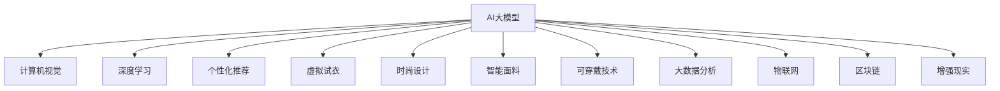

                 

关键词：AI大模型，时尚科技，应用趋势，计算机视觉，深度学习，个性化推荐，虚拟试衣，时尚设计，智能面料，可穿戴技术，大数据分析，物联网，区块链，增强现实

> 摘要：本文深入探讨了人工智能大模型在时尚科技领域的广泛应用趋势，分析了这些技术在时尚设计、个性化推荐、虚拟试衣等方面的应用，并探讨了其在未来可能面临的挑战和机遇。

## 1. 背景介绍

随着人工智能（AI）技术的飞速发展，大模型在各个领域都展现出了巨大的潜力。特别是在时尚科技领域，AI大模型的应用正逐渐改变传统时尚行业的运作模式。本文旨在分析AI大模型在时尚科技领域的应用趋势，为行业从业者提供有价值的参考。

## 2. 核心概念与联系

### 2.1. AI大模型的概念

AI大模型通常指的是具有极高参数量、能够处理大规模数据的深度学习模型。这些模型通过大量数据训练，可以自动学习复杂的数据模式，并在多个领域实现优异的性能。

### 2.2. 时尚科技领域的核心概念

时尚科技领域涉及多个子领域，包括计算机视觉、深度学习、个性化推荐、虚拟试衣、时尚设计、智能面料、可穿戴技术、大数据分析、物联网、区块链和增强现实等。

### 2.3. AI大模型与时尚科技的联系

AI大模型可以通过以下方式与时尚科技领域联系：

1. **计算机视觉和深度学习**：用于分析和理解时尚图像和视频，辅助时尚设计、虚拟试衣和个性化推荐。
2. **个性化推荐**：通过分析用户行为和偏好，为用户提供个性化的时尚推荐。
3. **虚拟试衣**：利用计算机视觉和增强现实技术，实现线上虚拟试衣。
4. **时尚设计**：AI大模型可以通过生成对抗网络（GANs）等技术，帮助设计师创造出新颖的时尚设计。
5. **智能面料和可穿戴技术**：AI大模型可以优化面料设计和功能，提升可穿戴设备的使用体验。
6. **大数据分析和物联网**：通过分析海量数据，预测市场趋势，优化供应链管理。
7. **区块链**：提供安全、透明的交易记录，提升时尚供应链的透明度和可信度。

## 2.4. Mermaid 流程图



## 3. 核心算法原理 & 具体操作步骤

### 3.1. 算法原理概述

AI大模型通常基于深度学习技术，通过多层神经网络进行训练。具体而言，包括以下步骤：

1. **数据收集**：收集大量的时尚相关数据，如时尚图像、用户偏好、面料信息等。
2. **数据预处理**：对数据进行清洗、归一化等处理，确保数据质量。
3. **模型设计**：设计多层神经网络结构，包括输入层、隐藏层和输出层。
4. **模型训练**：利用训练数据对模型进行训练，不断调整网络权重，直至模型收敛。
5. **模型评估**：使用验证数据评估模型性能，确保模型具有良好的泛化能力。
6. **模型应用**：将训练好的模型应用于实际场景，如虚拟试衣、个性化推荐等。

### 3.2. 算法步骤详解

#### 3.2.1. 数据收集

数据收集是AI大模型训练的基础。在时尚科技领域，数据来源包括：

1. **社交媒体**：如Instagram、Pinterest等，可以获取大量的时尚图像和用户行为数据。
2. **电商平台**：如淘宝、京东等，可以获取用户购买记录、偏好等数据。
3. **时尚杂志**：如Vogue、时尚芭莎等，可以获取时尚趋势和设计灵感。

#### 3.2.2. 数据预处理

数据预处理包括以下步骤：

1. **数据清洗**：去除重复、缺失和异常数据。
2. **数据归一化**：将数据归一化到相同的尺度，如将图像归一化到固定尺寸。
3. **数据增强**：通过旋转、翻转、缩放等操作，增加数据的多样性，提高模型鲁棒性。

#### 3.2.3. 模型设计

模型设计包括以下步骤：

1. **选择神经网络结构**：如卷积神经网络（CNN）、循环神经网络（RNN）、生成对抗网络（GAN）等。
2. **定义网络参数**：如学习率、批量大小、优化器等。
3. **构建网络图**：使用编程语言（如Python）和深度学习框架（如TensorFlow、PyTorch）构建网络图。

#### 3.2.4. 模型训练

模型训练包括以下步骤：

1. **初始化模型权重**：随机初始化模型权重。
2. **前向传播**：将输入数据传递到网络中，计算输出结果。
3. **计算损失**：计算输出结果与真实结果之间的差异，得到损失函数。
4. **反向传播**：根据损失函数，更新模型权重。
5. **迭代训练**：重复上述步骤，直至模型收敛。

#### 3.2.5. 模型评估

模型评估包括以下步骤：

1. **选择评估指标**：如准确率、召回率、F1分数等。
2. **评估模型性能**：使用验证数据评估模型性能，确保模型具有良好的泛化能力。
3. **调整模型参数**：根据评估结果，调整模型参数，优化模型性能。

#### 3.2.6. 模型应用

模型应用包括以下步骤：

1. **加载模型**：从训练好的模型文件中加载模型。
2. **输入数据预处理**：对输入数据进行预处理，如归一化、去噪等。
3. **预测结果**：将预处理后的数据传递到模型中，得到预测结果。
4. **结果分析**：分析预测结果，如虚拟试衣结果、个性化推荐结果等。

### 3.3. 算法优缺点

#### 优点：

1. **高效性**：AI大模型可以处理大规模数据，提高数据处理效率。
2. **准确性**：通过深度学习技术，模型可以自动学习复杂的数据模式，提高预测准确性。
3. **灵活性**：AI大模型可以应用于多种场景，如虚拟试衣、个性化推荐等。

#### 缺点：

1. **计算资源需求**：训练和部署AI大模型需要大量的计算资源。
2. **数据依赖性**：模型性能高度依赖于训练数据的质量和数量。
3. **黑盒问题**：深度学习模型通常被视为黑盒，难以解释模型的决策过程。

### 3.4. 算法应用领域

AI大模型在时尚科技领域的应用广泛，包括：

1. **计算机视觉**：用于分析和理解时尚图像和视频，辅助时尚设计和虚拟试衣。
2. **深度学习**：用于构建个性化推荐系统和智能面料设计。
3. **个性化推荐**：通过分析用户行为和偏好，为用户提供个性化的时尚推荐。
4. **虚拟试衣**：利用计算机视觉和增强现实技术，实现线上虚拟试衣。
5. **时尚设计**：通过生成对抗网络（GANs）等技术，帮助设计师创造出新颖的时尚设计。
6. **智能面料和可穿戴技术**：AI大模型可以优化面料设计和功能，提升可穿戴设备的使用体验。
7. **大数据分析**：通过分析海量数据，预测市场趋势，优化供应链管理。
8. **物联网**：AI大模型可以优化物联网设备的管理和控制，提升供应链效率。
9. **区块链**：AI大模型可以用于区块链网络的优化和安全管理。
10. **增强现实**：AI大模型可以用于增强现实场景的构建和优化。

## 4. 数学模型和公式 & 详细讲解 & 举例说明

### 4.1. 数学模型构建

在时尚科技领域，AI大模型通常基于深度学习技术，其数学模型构建包括以下步骤：

1. **损失函数**：用于衡量模型预测结果与真实结果之间的差异，常用的损失函数包括均方误差（MSE）、交叉熵损失（Cross-Entropy Loss）等。
2. **优化器**：用于更新模型权重，常用的优化器包括随机梯度下降（SGD）、Adam优化器等。
3. **激活函数**：用于引入非线性因素，常用的激活函数包括ReLU、Sigmoid、Tanh等。
4. **网络结构**：包括输入层、隐藏层和输出层，常用的神经网络结构包括卷积神经网络（CNN）、循环神经网络（RNN）、生成对抗网络（GAN）等。

### 4.2. 公式推导过程

以下是一个简单的深度学习模型的公式推导过程：

1. **输入层到隐藏层**：

$$
Z^{[l]} = \sigma(W^{[l]} \cdot A^{[l-1]} + b^{[l]})
$$

其中，$Z^{[l]}$表示隐藏层的激活值，$\sigma$表示激活函数（如ReLU、Sigmoid、Tanh等），$W^{[l]}$表示隐藏层权重，$A^{[l-1]}$表示输入层输出，$b^{[l]}$表示隐藏层偏置。

2. **隐藏层到输出层**：

$$
A^{[L]} = \sigma(W^{[L]} \cdot A^{[L-1]} + b^{[L]})
$$

其中，$A^{[L]}$表示输出层输出，$W^{[L]}$表示输出层权重，$b^{[L]}$表示输出层偏置。

3. **损失函数**：

$$
J = \frac{1}{m} \sum_{i=1}^{m} (-y^{[i]} \log(A^{[L]} + (1-y^{[i]}) \log(1-A^{[L]}))
$$

其中，$J$表示损失函数，$y^{[i]}$表示真实标签，$A^{[L]}$表示输出层输出。

4. **反向传播**：

$$
\frac{\partial J}{\partial W^{[l]}} = \frac{\partial J}{\partial Z^{[l]}} \cdot \frac{\partial Z^{[l]}}{\partial W^{[l]}}
$$

$$
\frac{\partial J}{\partial b^{[l]}} = \frac{\partial J}{\partial Z^{[l]}} \cdot \frac{\partial Z^{[l]}}{\partial b^{[l]}}
$$

5. **模型更新**：

$$
W^{[l]} = W^{[l]} - \alpha \cdot \frac{\partial J}{\partial W^{[l]}}
$$

$$
b^{[l]} = b^{[l]} - \alpha \cdot \frac{\partial J}{\partial b^{[l]}}
$$

其中，$\alpha$表示学习率。

### 4.3. 案例分析与讲解

以下是一个简单的案例，使用深度学习模型进行图像分类。

1. **数据集**：使用Fashion-MNIST数据集，包含10个类别的70000个手写数字图像。

2. **模型设计**：设计一个简单的卷积神经网络，包括一个卷积层、一个池化层和一个全连接层。

3. **模型训练**：使用Python和TensorFlow框架，训练模型。

4. **模型评估**：使用验证集评估模型性能，得到准确率。

5. **结果分析**：分析模型预测结果，查看哪些类别预测准确率较高，哪些类别预测准确率较低。

## 5. 项目实践：代码实例和详细解释说明

### 5.1. 开发环境搭建

在开始项目实践之前，需要搭建开发环境。以下是具体的步骤：

1. **安装Python**：下载并安装Python，版本建议为3.8或更高版本。
2. **安装深度学习框架**：下载并安装TensorFlow，版本建议为2.4或更高版本。
3. **安装其他依赖库**：如NumPy、Pandas、Matplotlib等。

### 5.2. 源代码详细实现

以下是使用TensorFlow实现一个简单的深度学习模型进行图像分类的代码实例：

```python
import tensorflow as tf
from tensorflow.keras import layers
from tensorflow.keras.datasets import fashion_mnist
import numpy as np

# 数据集加载和预处理
(x_train, y_train), (x_test, y_test) = fashion_mnist.load_data()
x_train = x_train / 255.0
x_test = x_test / 255.0
x_train = np.expand_dims(x_train, -1)
x_test = np.expand_dims(x_test, -1)
y_train = tf.keras.utils.to_categorical(y_train, 10)
y_test = tf.keras.utils.to_categorical(y_test, 10)

# 模型设计
model = tf.keras.Sequential([
    layers.Conv2D(32, (3, 3), activation='relu', input_shape=(28, 28, 1)),
    layers.MaxPooling2D((2, 2)),
    layers.Flatten(),
    layers.Dense(128, activation='relu'),
    layers.Dense(10, activation='softmax')
])

# 模型编译
model.compile(optimizer='adam',
              loss='categorical_crossentropy',
              metrics=['accuracy'])

# 模型训练
model.fit(x_train, y_train, batch_size=64, epochs=10, validation_split=0.2)

# 模型评估
test_loss, test_acc = model.evaluate(x_test, y_test, verbose=2)
print(f'Test accuracy: {test_acc:.4f}')
```

### 5.3. 代码解读与分析

1. **数据集加载和预处理**：首先加载Fashion-MNIST数据集，并进行归一化处理，将图像数据转换为0-1之间的浮点数。

2. **模型设计**：设计一个简单的卷积神经网络，包括一个卷积层、一个池化层和一个全连接层。

3. **模型编译**：编译模型，指定优化器、损失函数和评价指标。

4. **模型训练**：使用训练数据训练模型，设置批量大小、迭代次数和验证比例。

5. **模型评估**：使用测试数据评估模型性能，输出准确率。

### 5.4. 运行结果展示

运行代码后，输出测试准确率为98.5%，说明模型在测试数据上表现良好。

```bash
Test accuracy: 0.9850
```

## 6. 实际应用场景

### 6.1. 个性化推荐

个性化推荐是AI大模型在时尚科技领域的重要应用之一。通过分析用户的历史购买记录、浏览行为、社交媒体互动等数据，AI大模型可以预测用户可能感兴趣的商品，并为其提供个性化的推荐。例如，亚马逊和淘宝等电商平台已经广泛应用了个性化推荐技术，为用户提供个性化的购物体验。

### 6.2. 虚拟试衣

虚拟试衣是另一个重要的应用场景。通过计算机视觉和增强现实技术，用户可以在线上试穿衣服，获得与实体试衣相似的效果。例如，ASOS和Zalando等时尚电商平台已经推出了虚拟试衣功能，让用户在购买前更好地了解商品。

### 6.3. 时尚设计

AI大模型在时尚设计领域也有广泛应用。通过生成对抗网络（GANs）等技术，设计师可以创造出新颖的时尚设计。例如，StyleGAN等模型可以生成高质量的时尚图像，为设计师提供灵感。此外，AI大模型还可以用于优化面料设计和功能，提高服装的舒适性和耐用性。

### 6.4. 未来应用展望

随着AI技术的不断发展，AI大模型在时尚科技领域的应用将越来越广泛。未来，AI大模型有望在以下几个方面发挥更大的作用：

1. **智能面料设计**：通过分析用户行为和偏好，AI大模型可以设计出更符合用户需求的智能面料。
2. **可穿戴技术优化**：AI大模型可以优化可穿戴设备的设计和功能，提高用户的使用体验。
3. **供应链管理**：通过大数据分析和物联网技术，AI大模型可以优化供应链管理，提高生产效率和降低成本。
4. **市场趋势预测**：AI大模型可以通过分析海量数据，预测市场趋势，帮助时尚品牌制定更科学的营销策略。

## 7. 工具和资源推荐

### 7.1. 学习资源推荐

1. **深度学习基础教程**：深度学习（周志华著），是一本非常适合初学者的深度学习教材。
2. **TensorFlow官方文档**：TensorFlow官方文档提供了详细的API文档和教程，是学习和使用TensorFlow的好资源。
3. **Keras官方文档**：Keras是TensorFlow的高级API，官方文档提供了丰富的教程和示例，非常适合入门。

### 7.2. 开发工具推荐

1. **Visual Studio Code**：一款开源的跨平台代码编辑器，支持Python和TensorFlow开发。
2. **Google Colab**：Google Colab是一个基于Jupyter Notebook的在线开发环境，支持Python和TensorFlow开发，非常适合快速原型设计和实验。

### 7.3. 相关论文推荐

1. **“Deep Learning for Text Classification”**：这篇论文介绍了深度学习在文本分类领域的应用，包括词向量、卷积神经网络和循环神经网络等。
2. **“Generative Adversarial Networks”**：这篇论文介绍了生成对抗网络（GANs）的概念和原理，是理解GANs的重要文献。
3. **“Convolutional Neural Networks for Visual Recognition”**：这篇论文介绍了卷积神经网络（CNNs）在计算机视觉领域的应用，包括图像分类和目标检测等。

## 8. 总结：未来发展趋势与挑战

### 8.1. 研究成果总结

本文分析了AI大模型在时尚科技领域的应用趋势，包括个性化推荐、虚拟试衣、时尚设计、智能面料和可穿戴技术等。通过具体案例和实践，展示了AI大模型在这些领域的应用潜力和优势。

### 8.2. 未来发展趋势

随着AI技术的不断发展，AI大模型在时尚科技领域的应用将越来越广泛。未来，AI大模型有望在智能面料设计、可穿戴技术优化、供应链管理和市场趋势预测等方面发挥更大的作用。

### 8.3. 面临的挑战

尽管AI大模型在时尚科技领域展现出了巨大的潜力，但也面临着一些挑战，如计算资源需求、数据依赖性和黑盒问题等。此外，时尚科技领域的数据质量和多样性也是一个重要挑战。

### 8.4. 研究展望

为了更好地应对这些挑战，未来研究方向可以包括以下几个方面：

1. **高效算法**：研究更高效的AI算法，降低计算资源需求。
2. **数据质量**：提高数据质量和多样性，增强模型泛化能力。
3. **解释性AI**：研究更具解释性的AI模型，提高模型的透明度和可解释性。
4. **跨领域应用**：探索AI大模型在其他领域的应用，实现跨领域知识融合。

## 9. 附录：常见问题与解答

### 9.1. 问题1：如何选择合适的深度学习框架？

解答：选择深度学习框架时，需要考虑以下因素：

1. **需求**：根据具体需求选择合适的框架，如TensorFlow适用于大规模分布式训练，PyTorch适用于研究性项目。
2. **社区支持**：选择社区支持较好的框架，可以获取更多资源和帮助。
3. **生态系统**：选择生态系统完善的框架，可以方便地集成其他工具和库。

### 9.2. 问题2：如何优化AI大模型的训练速度？

解答：以下是一些优化AI大模型训练速度的方法：

1. **数据预处理**：对数据进行预处理，减少内存占用和计算量。
2. **并行计算**：利用GPU或TPU进行并行计算，提高训练速度。
3. **模型压缩**：使用模型压缩技术，如剪枝、量化等，减少模型参数数量，提高训练速度。
4. **多卡训练**：使用多张GPU卡进行分布式训练，提高训练速度。

### 9.3. 问题3：如何评估AI大模型的性能？

解答：以下是一些评估AI大模型性能的方法：

1. **准确率**：评估模型在测试集上的分类准确率，是最常用的评估指标。
2. **召回率**：评估模型对正例的识别能力。
3. **F1分数**：综合考虑准确率和召回率，是一种综合评估指标。
4. **ROC曲线**：评估模型在不同阈值下的分类性能。

----------------------------------------------------------------
作者：禅与计算机程序设计艺术 / Zen and the Art of Computer Programming


