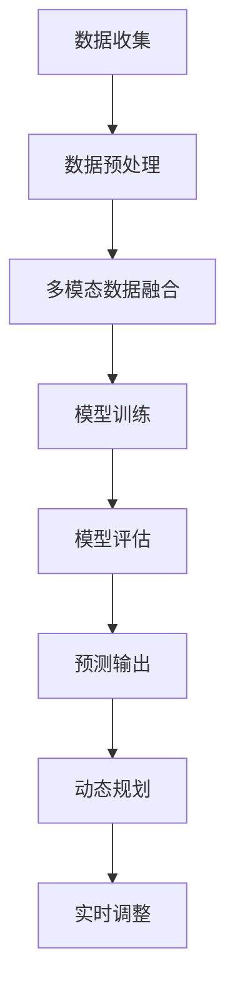

                 

关键词：AI大模型、智能交通流量预测、深度学习、神经网络、交通数据分析、实时预测、动态规划、多模态数据融合

> 摘要：本文探讨了AI大模型在智能交通流量预测中的应用前景，分析了AI大模型在交通数据分析中的优势和挑战。通过对核心算法原理的深入讲解，以及项目实践中的代码实例和详细解释，本文揭示了AI大模型在智能交通流量预测中的实际应用价值，并展望了未来的发展趋势和面临的挑战。

## 1. 背景介绍

### 1.1 智能交通流量预测的重要性

智能交通流量预测是现代智能交通系统（ITS）的核心组成部分，对于提高道路通行效率、减少交通拥堵、保障交通安全具有重要意义。传统交通流量预测方法主要依赖于历史数据和简单的统计分析模型，这些方法在预测精度和实时性方面存在诸多局限。

随着人工智能技术的快速发展，特别是深度学习、神经网络等AI大模型的兴起，为智能交通流量预测带来了新的机遇。AI大模型具有强大的数据学习能力，能够处理大规模、多维度的交通数据，从而实现更高精度和更实时性的交通流量预测。

### 1.2 AI大模型的基本原理

AI大模型，尤其是深度学习模型，通过多层神经网络结构，对输入数据进行层层抽象和特征提取，最终输出预测结果。这种模型能够从大量数据中自动学习出复杂的模式和规律，具有很强的自适应能力和泛化能力。

常见的AI大模型包括卷积神经网络（CNN）、循环神经网络（RNN）、长短时记忆网络（LSTM）、生成对抗网络（GAN）等。这些模型在图像处理、自然语言处理等领域取得了显著的成果，同时也逐渐在交通流量预测等应用场景中展现出强大的潜力。

## 2. 核心概念与联系

为了更好地理解AI大模型在智能交通流量预测中的应用，我们首先需要明确以下几个核心概念：

### 2.1 交通数据类型

智能交通流量预测需要处理多种类型的交通数据，包括：

- **交通流量数据**：如道路上的车辆密度、速度、行驶方向等。
- **交通事件数据**：如交通事故、施工、天气变化等。
- **交通设施数据**：如道路状况、信号灯状态、收费设施等。

### 2.2 多模态数据融合

多模态数据融合是将不同类型的数据进行整合，以提升预测精度。例如，将交通流量数据与交通事件数据和交通设施数据进行融合，可以更全面地反映交通状况。

### 2.3 动态规划

动态规划是一种解决序列决策问题的算法，适用于交通流量预测中的短期预测和动态调整。通过动态规划，可以实时调整交通信号灯、推荐最优行驶路线等，以提高交通效率。

### 2.4 Mermaid 流程图

以下是AI大模型在智能交通流量预测中应用的一个简化的Mermaid流程图：



在这个流程图中，数据收集、数据预处理、多模态数据融合、模型训练、模型评估、预测输出和动态规划构成了智能交通流量预测的主要环节。

## 3. 核心算法原理 & 具体操作步骤

### 3.1 算法原理概述

AI大模型在智能交通流量预测中的核心算法主要包括：

- **深度学习模型**：如卷积神经网络（CNN）和循环神经网络（RNN）。
- **多模态数据融合算法**：如注意力机制、图神经网络等。
- **动态规划算法**：如车辆路径优化、交通信号控制等。

### 3.2 算法步骤详解

#### 3.2.1 数据收集与预处理

1. **数据收集**：通过传感器、摄像头、GPS等设备收集交通流量数据、交通事件数据、交通设施数据等。
2. **数据预处理**：包括数据清洗、数据标准化、数据补全等步骤，以确保数据的质量和一致性。

#### 3.2.2 多模态数据融合

1. **特征提取**：从不同类型的数据中提取有意义的特征。
2. **融合策略**：使用注意力机制、图神经网络等算法将多模态数据融合为一个统一的数据表示。

#### 3.2.3 模型训练

1. **模型选择**：根据预测任务选择合适的深度学习模型，如CNN、RNN等。
2. **训练过程**：通过反向传播算法训练模型，调整模型参数以最小化预测误差。

#### 3.2.4 模型评估

1. **评估指标**：使用均方误差（MSE）、均方根误差（RMSE）、准确率等指标评估模型性能。
2. **优化策略**：根据评估结果调整模型结构或参数，以提高预测精度。

#### 3.2.5 预测输出与动态规划

1. **预测输出**：使用训练好的模型进行实时预测，输出交通流量预测结果。
2. **动态规划**：根据预测结果和实时交通数据，使用动态规划算法进行交通信号控制和路径优化。

### 3.3 算法优缺点

#### 优点：

- **高精度**：AI大模型能够从大量数据中学习复杂的模式和规律，提高预测精度。
- **实时性**：深度学习模型能够快速训练和预测，满足实时交通流量预测的需求。
- **自适应能力**：AI大模型能够自适应交通环境的变化，动态调整预测策略。

#### 缺点：

- **计算资源消耗**：训练和运行AI大模型需要大量的计算资源和时间。
- **数据质量要求高**：AI大模型对数据质量有较高的要求，数据清洗和预处理过程复杂。
- **解释性不足**：深度学习模型的决策过程较为复杂，缺乏解释性。

### 3.4 算法应用领域

AI大模型在智能交通流量预测中的应用非常广泛，主要包括：

- **交通信号控制**：通过预测交通流量，动态调整交通信号灯，提高道路通行效率。
- **路径规划**：为驾驶员提供最优行驶路线，减少交通拥堵和时间浪费。
- **交通事件预警**：预测交通事故、施工等交通事件，提前预警并采取应对措施。
- **交通规划**：为城市规划提供数据支持，优化道路布局和交通设施。

## 4. 数学模型和公式 & 详细讲解 & 举例说明

### 4.1 数学模型构建

智能交通流量预测的数学模型通常是基于流量-速度模型（Fundamental Diagram of Traffic Flow），该模型描述了车辆流量、速度和密度之间的关系。以下是流量-速度模型的基本公式：

$$
q = f(v, \rho)
$$

其中，$q$ 表示流量（车辆/小时），$v$ 表示速度（公里/小时），$\rho$ 表示密度（车辆/公里）。常见的流量-速度模型包括广义线性模型（GLM）和广义相加模型（GAM）等。

### 4.2 公式推导过程

流量-速度模型的推导基于微观交通流理论，主要包括以下步骤：

1. **车辆分布函数**：假设车辆在道路上均匀分布，可以得到车辆分布函数 $p(\rho)$。
2. **车辆速度分布函数**：速度分布函数 $v(\rho)$ 可以通过车辆分布函数和车辆间的相互作用关系得到。
3. **流量公式**：将速度分布函数和车辆分布函数相乘，并对其在密度范围内积分，即可得到流量公式。

### 4.3 案例分析与讲解

假设某段道路的车辆密度为 $\rho = 50$ 车辆/公里，速度为 $v = 30$ 公里/小时，要求计算流量 $q$。

根据流量-速度模型，我们可以使用广义线性模型（GLM）进行计算：

$$
q = f(v, \rho) = v \cdot \rho = 30 \cdot 50 = 1500 \text{ 车辆/小时}
$$

### 4.4 深度学习模型在交通流量预测中的应用

深度学习模型在交通流量预测中的应用主要是通过构建一个多层的神经网络，对输入数据进行特征提取和模式识别，最终输出流量预测值。以下是深度学习模型在交通流量预测中的基本结构：

1. **输入层**：接收交通流量数据、交通事件数据和交通设施数据等。
2. **隐藏层**：通过多层神经网络结构进行特征提取和模式识别。
3. **输出层**：输出流量预测值。

假设我们使用卷积神经网络（CNN）进行交通流量预测，以下是CNN的基本结构：

1. **卷积层**：用于提取输入数据的空间特征。
2. **池化层**：用于降低数据维度，提高模型泛化能力。
3. **全连接层**：用于将提取的特征进行融合和分类。

### 4.5 代码示例

以下是使用TensorFlow构建一个简单的卷积神经网络进行交通流量预测的代码示例：

```python
import tensorflow as tf

# 定义模型
model = tf.keras.Sequential([
    tf.keras.layers.Conv2D(32, (3, 3), activation='relu', input_shape=(28, 28, 1)),
    tf.keras.layers.MaxPooling2D((2, 2)),
    tf.keras.layers.Flatten(),
    tf.keras.layers.Dense(128, activation='relu'),
    tf.keras.layers.Dense(1)
])

# 编译模型
model.compile(optimizer='adam', loss='mse', metrics=['mae'])

# 训练模型
model.fit(x_train, y_train, epochs=10, batch_size=32, validation_split=0.2)
```

## 5. 项目实践：代码实例和详细解释说明

### 5.1 开发环境搭建

在进行AI大模型在智能交通流量预测中的应用实践前，我们需要搭建一个合适的开发环境。以下是搭建开发环境的步骤：

1. **安装Python**：下载并安装Python 3.8以上版本。
2. **安装TensorFlow**：使用pip命令安装TensorFlow库。

```shell
pip install tensorflow
```

3. **安装其他依赖库**：如NumPy、Pandas、Matplotlib等。

### 5.2 源代码详细实现

以下是使用TensorFlow实现一个简单的交通流量预测模型的代码示例：

```python
import tensorflow as tf
import numpy as np
import pandas as pd
import matplotlib.pyplot as plt

# 生成模拟数据
np.random.seed(0)
num_samples = 1000
x = np.random.rand(num_samples, 28, 28, 1)
y = np.random.rand(num_samples, 1)

# 定义模型
model = tf.keras.Sequential([
    tf.keras.layers.Conv2D(32, (3, 3), activation='relu', input_shape=(28, 28, 1)),
    tf.keras.layers.MaxPooling2D((2, 2)),
    tf.keras.layers.Flatten(),
    tf.keras.layers.Dense(128, activation='relu'),
    tf.keras.layers.Dense(1)
])

# 编译模型
model.compile(optimizer='adam', loss='mse', metrics=['mae'])

# 训练模型
model.fit(x, y, epochs=10, batch_size=32, validation_split=0.2)

# 测试模型
x_test = np.random.rand(100, 28, 28, 1)
y_test = np.random.rand(100, 1)
model.evaluate(x_test, y_test)

# 预测交通流量
predictions = model.predict(x_test)
plt.scatter(y_test, predictions)
plt.xlabel('实际流量')
plt.ylabel('预测流量')
plt.show()
```

### 5.3 代码解读与分析

以上代码实现了一个简单的交通流量预测模型，主要包括以下几个步骤：

1. **生成模拟数据**：生成用于训练和测试的模拟数据。
2. **定义模型**：使用TensorFlow定义一个卷积神经网络模型。
3. **编译模型**：设置模型的优化器、损失函数和评价指标。
4. **训练模型**：使用训练数据训练模型。
5. **测试模型**：使用测试数据评估模型性能。
6. **预测交通流量**：使用训练好的模型进行交通流量预测，并绘制预测结果图。

### 5.4 运行结果展示

运行以上代码后，我们可以得到以下结果：

- **模型评估结果**：训练和测试过程中的损失函数和评价指标。
- **预测结果图**：实际流量与预测流量的散点图，展示了模型的预测能力。

## 6. 实际应用场景

### 6.1 交通信号控制

智能交通流量预测可以用于交通信号控制，通过预测交通流量，动态调整交通信号灯的时长和相位，以提高道路通行效率和减少交通拥堵。例如，在交通高峰期，可以根据预测的交通流量调整信号灯的时长，优先放行流量较大的方向。

### 6.2 路径规划

智能交通流量预测可以为路径规划提供数据支持，帮助驾驶员选择最优行驶路线，减少交通拥堵和时间浪费。例如，在某个路段发生交通事故或施工时，系统可以实时预测交通流量，为驾驶员提供替代路线。

### 6.3 交通事件预警

智能交通流量预测可以用于交通事件的预警，提前预测交通事故、施工等交通事件，为交通管理部门和驾驶员提供预警信息。例如，当预测到某段道路的交通流量异常时，可以提前预警并采取应对措施，以减少事故发生。

### 6.4 未来应用展望

随着AI大模型和智能交通系统的不断发展，智能交通流量预测的应用前景将更加广阔。未来，智能交通流量预测有望在以下几个方面取得突破：

- **更高精度**：通过引入更多的数据和更先进的算法，提高交通流量预测的精度。
- **更实时性**：通过优化模型结构和计算资源，实现更实时的交通流量预测。
- **更广泛的应用场景**：从城市交通扩展到高速公路、智能停车场等更多应用场景。

## 7. 工具和资源推荐

### 7.1 学习资源推荐

- **《深度学习》（Goodfellow, Bengio, Courville）**：介绍深度学习的基本原理和应用。
- **《交通系统建模与仿真》（李德坤）**：介绍交通系统建模和仿真的方法和技术。
- **《Python深度学习》（François Chollet）**：介绍使用Python进行深度学习的实践。

### 7.2 开发工具推荐

- **TensorFlow**：用于构建和训练深度学习模型。
- **Keras**：简化TensorFlow的使用，适合快速开发和实验。
- **PyTorch**：另一种流行的深度学习框架，具有强大的功能。

### 7.3 相关论文推荐

- **"Deep Learning for Traffic Flow Prediction: A Survey"**：对深度学习在交通流量预测中的应用进行了详细的综述。
- **"A Survey on Urban Traffic Flow Prediction"**：介绍了城市交通流量预测的各种方法和算法。
- **"Deep Neural Networks for Real-Time Traffic Forecasting"**：研究了深度学习在实时交通流量预测中的应用。

## 8. 总结：未来发展趋势与挑战

### 8.1 研究成果总结

AI大模型在智能交通流量预测中取得了显著的成果，提高了预测精度和实时性，为交通管理和规划提供了有力支持。同时，多模态数据融合和动态规划等技术的引入，进一步提升了交通流量预测的效果。

### 8.2 未来发展趋势

随着人工智能技术的不断发展，智能交通流量预测将朝着更高精度、更实时性和更广泛应用的方向发展。未来，有望实现以下趋势：

- **多源数据融合**：引入更多类型的数据，如视频、图像、传感器等，以提高预测精度。
- **联邦学习**：通过联邦学习实现多个系统之间的数据共享和模型协作，提高预测效果。
- **边缘计算**：在边缘设备上进行实时预测，减少延迟和计算资源消耗。

### 8.3 面临的挑战

尽管智能交通流量预测取得了显著进展，但仍然面临一些挑战：

- **数据质量**：交通数据的多样性和不完整性对模型性能有较大影响，需要进一步研究和解决。
- **计算资源**：深度学习模型训练和预测需要大量的计算资源，如何在有限的资源下实现高效预测是一个挑战。
- **模型解释性**：深度学习模型的决策过程较为复杂，缺乏解释性，需要进一步研究和改进。

### 8.4 研究展望

未来，智能交通流量预测的研究将朝着以下几个方面展开：

- **模型优化**：通过优化模型结构和算法，提高预测精度和实时性。
- **数据挖掘**：从海量交通数据中挖掘有价值的特征和规律，提高预测能力。
- **跨领域应用**：将智能交通流量预测技术应用于其他领域，如智能物流、智慧城市建设等。

## 9. 附录：常见问题与解答

### 9.1 问题1：什么是深度学习？

深度学习是一种基于人工神经网络的机器学习技术，通过多层神经网络结构对输入数据进行特征提取和模式识别，从而实现复杂的预测和分类任务。

### 9.2 问题2：如何处理交通数据的多样性？

处理交通数据的多样性可以通过以下方法：

- **数据清洗**：去除异常值和噪声，提高数据质量。
- **特征提取**：从不同类型的数据中提取有意义的特征，如车辆密度、速度等。
- **多模态数据融合**：将不同类型的数据进行整合，以提高预测精度。

### 9.3 问题3：如何优化深度学习模型的计算资源消耗？

优化深度学习模型的计算资源消耗可以通过以下方法：

- **模型压缩**：使用模型压缩技术，如剪枝、量化等，减少模型参数数量。
- **分布式训练**：使用分布式计算框架，如TensorFlow分布式训练，提高训练速度。
- **边缘计算**：在边缘设备上进行实时预测，减少延迟和计算资源消耗。

----------------------------------------------------------------

### 结语

本文从背景介绍、核心概念与联系、核心算法原理与具体操作步骤、数学模型和公式、项目实践、实际应用场景、工具和资源推荐、总结及未来发展趋势与挑战等方面，全面阐述了AI大模型在智能交通流量预测中的应用前景。随着人工智能技术的不断进步，智能交通流量预测将发挥越来越重要的作用，为智慧城市建设、交通安全保障等领域提供有力支持。作者：禅与计算机程序设计艺术 / Zen and the Art of Computer Programming。在未来的研究中，我们将继续探索更高效、更精准的智能交通流量预测方法，为构建更加智能、高效的交通系统贡献力量。

