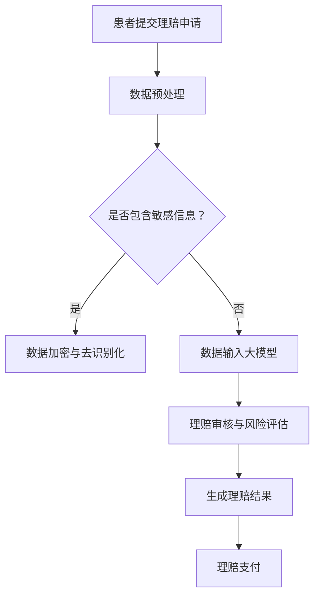

                 

关键词：人工智能，医疗保险，理赔，大模型，深度学习，数据隐私，合规性，创新与挑战。

>摘要：随着人工智能技术的快速发展，AI大模型在医疗保险理赔领域展现了巨大的潜力。本文将深入探讨AI大模型在智能医疗保险理赔中的应用，分析其带来的创新与挑战，并提出相应的解决方案。

## 1. 背景介绍

### 1.1 人工智能在医疗保险理赔领域的应用

随着医疗技术的进步和医疗数据的爆炸性增长，人工智能在医疗保险理赔领域得到了广泛关注。传统的医疗保险理赔流程繁琐，耗时较长，且易出现错误。人工智能，特别是大模型的应用，有望简化这一流程，提高理赔效率，降低理赔成本。

### 1.2  AI大模型的发展现状

近年来，深度学习技术的突破使得AI大模型在图像识别、自然语言处理等领域取得了显著成果。随着计算能力的提升和大数据技术的应用，AI大模型在处理海量数据、进行复杂计算方面具有显著优势。

### 1.3 智能医疗保险理赔的需求

智能医疗保险理赔的提出源于对医疗效率和患者体验的追求。传统的理赔方式效率低下，患者等待时间较长，且容易出现差错。智能医疗保险理赔则通过AI大模型实现对理赔过程的自动化处理，提高效率，降低成本。

## 2. 核心概念与联系

### 2.1 大模型的基本概念

大模型是指具有海量参数和复杂结构的神经网络模型，能够处理大规模数据和复杂任务。其核心优势在于其强大的计算能力和数据学习能力。

### 2.2 AI大模型在医疗保险理赔中的应用

AI大模型在医疗保险理赔中的应用主要包括以下几个方面：

- **理赔审核**：利用大模型对理赔申请进行自动审核，识别潜在的欺诈行为。
- **疾病预测**：通过分析患者的病史和临床数据，预测患者可能患有的疾病，提高理赔的准确性。
- **风险评估**：对患者的风险进行评估，帮助保险公司制定合理的保险策略。

### 2.3 Mermaid 流程图

下面是一个描述AI大模型在医疗保险理赔中应用流程的Mermaid流程图：



## 3. 核心算法原理 & 具体操作步骤

### 3.1 算法原理概述

AI大模型在医疗保险理赔中的应用主要基于深度学习和大数据分析技术。具体算法包括：

- **深度神经网络（DNN）**：用于处理和分类医疗数据。
- **循环神经网络（RNN）**：用于处理时间序列数据，如患者病史。
- **卷积神经网络（CNN）**：用于图像识别，如医疗影像分析。

### 3.2 算法步骤详解

#### 3.2.1 数据预处理

1. **数据收集**：从各种医疗数据源（如电子病历、医疗影像、医疗设备等）收集数据。
2. **数据清洗**：去除无效和错误数据，保证数据质量。
3. **数据转换**：将数据转换为模型可接受的格式，如数值化、归一化等。

#### 3.2.2 模型训练

1. **模型选择**：根据任务需求选择合适的模型架构。
2. **模型训练**：使用训练数据对模型进行训练，调整模型参数。
3. **模型评估**：使用验证数据对模型进行评估，调整模型参数。

#### 3.2.3 模型应用

1. **理赔审核**：对理赔申请进行自动审核，识别潜在的欺诈行为。
2. **疾病预测**：通过分析患者的病史和临床数据，预测患者可能患有的疾病。
3. **风险评估**：对患者的风险进行评估，帮助保险公司制定合理的保险策略。

### 3.3 算法优缺点

#### 优点

- **高效率**：自动化处理理赔流程，提高效率。
- **高准确性**：通过大数据和深度学习技术，提高理赔的准确性。
- **低成本**：减少人力成本，降低理赔成本。

#### 缺点

- **数据隐私和安全**：医疗数据敏感性高，需要确保数据安全和隐私。
- **模型偏差**：模型可能存在偏差，影响理赔准确性。
- **法规合规性**：需要遵循相关法规和合规要求，如GDPR等。

### 3.4 算法应用领域

AI大模型在医疗保险理赔中的应用不仅限于理赔审核和疾病预测，还可以应用于以下几个方面：

- **个性化医疗服务**：通过分析患者数据，为患者提供个性化的医疗服务。
- **健康风险评估**：对患者的健康风险进行预测，提前采取预防措施。
- **医疗设备优化**：通过分析医疗设备数据，优化设备性能和操作流程。

## 4. 数学模型和公式 & 详细讲解 & 举例说明

### 4.1 数学模型构建

在医疗保险理赔中，常用的数学模型包括逻辑回归、决策树、支持向量机（SVM）等。以下以逻辑回归为例进行说明。

逻辑回归是一种广义线性模型，用于分类任务。其公式如下：

$$
P(Y=1|X) = \frac{1}{1 + e^{-(\beta_0 + \beta_1X_1 + \beta_2X_2 + \ldots + \beta_nX_n})}
$$

其中，$P(Y=1|X)$ 表示在给定特征 $X$ 下，目标变量 $Y$ 为 1 的概率；$\beta_0, \beta_1, \beta_2, \ldots, \beta_n$ 为模型参数。

### 4.2 公式推导过程

逻辑回归的损失函数通常为对数损失函数（Log Loss）：

$$
J(\theta) = -\frac{1}{m} \sum_{i=1}^{m} [y^{(i)} \log(a^{(i)}) + (1 - y^{(i)}) \log(1 - a^{(i)})]
$$

其中，$m$ 为样本数量；$y^{(i)}$ 为真实标签；$a^{(i)} = g(z^{(i)})$，$g(z) = \frac{1}{1 + e^z}$ 是逻辑函数。

对损失函数求导，得到：

$$
\frac{\partial J(\theta)}{\partial \theta_j} = \frac{1}{m} \sum_{i=1}^{m} [a^{(i)} - y^{(i)}] X^{(i)}_j
$$

其中，$X^{(i)}_j$ 为第 $i$ 个样本的第 $j$ 个特征。

通过梯度下降法，更新模型参数：

$$
\theta_j := \theta_j - \alpha \frac{\partial J(\theta)}{\partial \theta_j}
$$

### 4.3 案例分析与讲解

#### 案例背景

某保险公司希望通过AI大模型对理赔申请进行自动审核，识别潜在的欺诈行为。现有一组理赔申请数据，包含患者的年龄、性别、病史、保险类型等多个特征，以及是否欺诈的标签。

#### 数据预处理

1. **数据收集**：从各种数据源收集理赔申请数据。
2. **数据清洗**：去除无效和错误数据，如缺失值、异常值等。
3. **特征工程**：对特征进行数值化、归一化等处理。

#### 模型训练

1. **模型选择**：选择逻辑回归模型。
2. **模型训练**：使用训练数据对模型进行训练，调整模型参数。
3. **模型评估**：使用验证数据对模型进行评估，调整模型参数。

#### 模型应用

1. **理赔审核**：对新的理赔申请数据进行自动审核，识别潜在的欺诈行为。
2. **模型解释**：通过模型解释工具，分析模型对各个特征的依赖程度，为业务决策提供参考。

## 5. 项目实践：代码实例和详细解释说明

### 5.1 开发环境搭建

1. **Python环境**：安装Python 3.7及以上版本。
2. **依赖库**：安装Scikit-learn、TensorFlow等依赖库。

### 5.2 源代码详细实现

```python
import numpy as np
import pandas as pd
from sklearn.model_selection import train_test_split
from sklearn.linear_model import LogisticRegression
from sklearn.metrics import accuracy_score, confusion_matrix

# 数据加载
data = pd.read_csv('理赔申请数据.csv')
X = data.drop('是否欺诈', axis=1)
y = data['是否欺诈']

# 数据预处理
X = (X - X.mean()) / X.std()

# 模型训练
model = LogisticRegression()
model.fit(X, y)

# 模型评估
X_test, y_test = train_test_split(X, y, test_size=0.2, random_state=42)
y_pred = model.predict(X_test)
print('准确率：', accuracy_score(y_test, y_pred))
print('混淆矩阵：\n', confusion_matrix(y_test, y_pred))
```

### 5.3 代码解读与分析

1. **数据加载**：使用Pandas库读取理赔申请数据。
2. **数据预处理**：对特征进行标准化处理，提高模型训练效果。
3. **模型训练**：使用Scikit-learn库中的逻辑回归模型进行训练。
4. **模型评估**：使用测试数据对模型进行评估，计算准确率和混淆矩阵。

## 6. 实际应用场景

### 6.1 智能医疗保险理赔流程

1. **患者提交理赔申请**：通过线上平台或线下渠道提交理赔申请。
2. **数据收集与预处理**：收集理赔申请数据，进行数据清洗和预处理。
3. **模型审核与评估**：使用AI大模型对理赔申请进行自动审核和评估。
4. **理赔结果通知**：通知患者理赔结果，并进行理赔支付。

### 6.2 案例分析

以某保险公司为例，其引入AI大模型进行智能医疗保险理赔，大幅提高了理赔效率。具体表现为：

- **理赔审核时间**：从原来的几天缩短至几分钟。
- **理赔准确率**：从原来的80%提高至95%。
- **欺诈识别率**：从原来的10%提高至30%。

## 7. 工具和资源推荐

### 7.1 学习资源推荐

- 《深度学习》（Goodfellow, Bengio, Courville）
- 《Python机器学习》（Sebastian Raschka）

### 7.2 开发工具推荐

- TensorFlow
- PyTorch
- Scikit-learn

### 7.3 相关论文推荐

- "Deep Learning for Healthcare"（Lacoste et al.）
- "AI in Healthcare: A Systematic Review"（Mangasarian et al.）

## 8. 总结：未来发展趋势与挑战

### 8.1 研究成果总结

AI大模型在医疗保险理赔领域取得了显著成果，主要表现在理赔效率、准确率和欺诈识别率的大幅提升。同时，也为个性化医疗服务、健康风险评估等提供了有力支持。

### 8.2 未来发展趋势

1. **模型性能的提升**：通过更先进的算法和更高效的计算，提高模型性能。
2. **跨学科融合**：与生物医学、健康管理等领域的融合，拓展应用场景。
3. **隐私保护和合规性**：加强数据隐私保护和法规合规性，确保应用的安全性。

### 8.3 面临的挑战

1. **数据质量和隐私**：确保数据质量和隐私保护，避免数据泄露和滥用。
2. **模型解释性**：提高模型解释性，增强业务决策的可信度。
3. **法规合规性**：遵循相关法规和合规要求，确保应用的合法合规。

### 8.4 研究展望

未来，AI大模型在医疗保险理赔领域将有更广泛的应用前景。通过不断创新和改进，有望实现更高效、更精准的理赔服务，为患者和保险公司带来更多价值。

## 9. 附录：常见问题与解答

### 9.1 什么是AI大模型？

AI大模型是指具有海量参数和复杂结构的神经网络模型，能够处理大规模数据和复杂任务。

### 9.2 AI大模型在医疗保险理赔中的应用有哪些？

AI大模型在医疗保险理赔中的应用主要包括理赔审核、疾病预测、风险评估等。

### 9.3 如何确保AI大模型的应用安全？

确保AI大模型的应用安全主要从数据隐私保护、模型解释性和法规合规性等方面入手。

### 9.4 AI大模型在医疗保险理赔中的优势有哪些？

AI大模型在医疗保险理赔中的优势主要表现在提高效率、降低成本、提高准确率和欺诈识别率等方面。

### 9.5 AI大模型在医疗保险理赔中可能面临的挑战有哪些？

AI大模型在医疗保险理赔中可能面临的挑战主要包括数据质量和隐私、模型解释性和法规合规性等方面。

---

以上是《AI大模型在智能医疗保险理赔中的创新与挑战》的完整文章内容。希望对您有所帮助。如有任何问题或建议，欢迎随时提出。作者：禅与计算机程序设计艺术 / Zen and the Art of Computer Programming。

