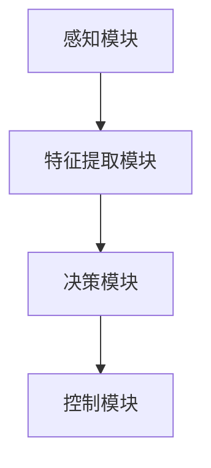

                 

关键词：AI大模型、智能汽车、自动驾驶、深度学习、数据驱动

> 摘要：本文探讨了人工智能大模型在智能汽车领域的应用前景。首先，介绍了智能汽车的基本概念和当前的技术发展现状。接着，详细分析了AI大模型的核心概念和其在自动驾驶中的重要性。随后，探讨了AI大模型在智能汽车中的具体应用场景，包括环境感知、决策规划和控制执行。最后，对AI大模型在智能汽车领域的发展趋势、挑战以及未来研究展望进行了讨论。

## 1. 背景介绍

随着信息技术的飞速发展，人工智能（AI）已经成为当前科技领域的热点。尤其是近年来，深度学习、神经网络等技术的进步，使得AI大模型得到了广泛的应用。与此同时，智能汽车行业也在迅速崛起，自动驾驶技术成为研究的热点。AI大模型与智能汽车的结合，有望带来全新的技术变革。

### 1.1 智能汽车概述

智能汽车是指通过集成多种传感器、通信设备和人工智能技术，具备部分或全部自动驾驶功能的汽车。智能汽车的发展可以分为以下几个阶段：

- **初级辅助驾驶**：汽车具备基本的辅助功能，如自适应巡航控制、自动泊车等。
- **部分自动驾驶**：汽车能够在特定环境下实现自动驾驶，如高速公路自动驾驶、城市道路自动驾驶等。
- **高度自动驾驶**：汽车能够在复杂交通环境下实现完全自动驾驶，无需人类干预。
- **完全自动驾驶**：汽车在任何环境下都能实现自动驾驶，无需人类介入。

### 1.2 当前技术发展现状

目前，智能汽车技术已经取得了显著的进展。例如，自动驾驶技术已经在部分国家和地区进行了实际道路测试，并在某些场景下实现了商业化应用。此外，AI大模型在图像识别、语音识别、自然语言处理等方面也取得了突破性进展。

## 2. 核心概念与联系

### 2.1 AI大模型概述

AI大模型是指具有海量参数、能够处理大量数据的深度学习模型。这些模型通常使用神经网络架构，通过多层非线性变换来提取数据特征，并对其进行分类、预测或生成。

### 2.2 AI大模型与自动驾驶的关系

AI大模型在自动驾驶中起着关键作用。自动驾驶系统需要实时处理大量传感器数据，并对交通环境进行感知、理解和决策。AI大模型能够通过学习大量数据，提高自动驾驶系统的感知能力、决策能力和适应性。

### 2.3 AI大模型在自动驾驶中的架构

AI大模型在自动驾驶中的架构可以分为以下几个部分：

1. **感知模块**：通过摄像头、激光雷达、雷达等传感器收集环境信息，并将数据输入到AI大模型中。
2. **特征提取模块**：AI大模型对感知模块收集的数据进行特征提取，以识别交通场景、车辆、行人等目标。
3. **决策模块**：基于特征提取模块的结果，AI大模型生成驾驶决策，如加速、减速、转向等。
4. **控制模块**：执行决策模块生成的控制指令，驱动汽车执行相应的动作。

### 2.4 Mermaid 流程图



## 3. 核心算法原理 & 具体操作步骤

### 3.1 算法原理概述

AI大模型在自动驾驶中的核心算法原理主要基于深度学习，特别是卷积神经网络（CNN）和循环神经网络（RNN）。CNN擅长处理图像数据，用于车辆、行人等目标的识别；RNN擅长处理序列数据，用于轨迹预测和决策生成。

### 3.2 算法步骤详解

1. **数据收集与预处理**：收集大量的传感器数据，如摄像头图像、激光雷达点云、GPS轨迹等。对数据进行清洗、归一化等预处理操作。
2. **特征提取**：使用CNN对摄像头图像进行特征提取，得到车辆、行人等目标的特征；使用RNN对GPS轨迹进行特征提取，得到交通流量、车速等特征。
3. **模型训练**：将提取的特征输入到神经网络中，通过反向传播算法训练模型，优化模型参数。
4. **模型评估与优化**：使用测试数据评估模型性能，根据评估结果调整模型结构和参数，以提高模型的准确性。
5. **实时预测与决策**：在自动驾驶系统中，将实时感知到的数据输入到训练好的模型中，进行实时预测和决策。

### 3.3 算法优缺点

**优点**：

- **强大的数据学习能力**：AI大模型能够通过学习大量数据，提高自动驾驶系统的感知能力和决策能力。
- **自适应性强**：AI大模型能够根据不同的交通环境和场景，自适应地调整驾驶策略。

**缺点**：

- **计算资源需求大**：AI大模型通常需要大量的计算资源和存储空间，对硬件设备要求较高。
- **模型解释性差**：深度学习模型往往具有较好的性能，但其内部决策过程较为复杂，难以解释。

### 3.4 算法应用领域

AI大模型在智能汽车领域的应用领域包括：

- **自动驾驶**：通过感知、决策和控制，实现无人驾驶功能。
- **车联网**：通过AI大模型，实现车辆之间的通信和协同，提高交通效率。
- **智能出行服务**：通过AI大模型，为用户提供个性化的出行服务，如路径规划、行车建议等。

## 4. 数学模型和公式 & 详细讲解 & 举例说明

### 4.1 数学模型构建

AI大模型通常使用神经网络架构，包括输入层、隐藏层和输出层。输入层接收传感器数据，隐藏层通过非线性变换提取特征，输出层生成驾驶决策。

### 4.2 公式推导过程

以卷积神经网络（CNN）为例，其数学模型可以表示为：

$$
h_{l}^{(i)} = \sigma \left( \sum_{j} w_{j}^{(i)} h_{l-1}^{(j)} + b^{(i)} \right)
$$

其中，$h_{l}^{(i)}$表示第$l$层第$i$个神经元的输出，$\sigma$表示激活函数，$w_{j}^{(i)}$和$b^{(i)}$分别表示第$l-1$层第$j$个神经元到第$l$层第$i$个神经元的权重和偏置。

### 4.3 案例分析与讲解

以自动驾驶中的车辆识别为例，假设输入图像为$X$，使用CNN模型进行特征提取。首先，通过卷积操作提取图像的低层特征，然后通过池化操作降低特征图的维度。最后，通过全连接层生成车辆识别的概率。

具体步骤如下：

1. **卷积操作**：
$$
h_{1}^{(i)} = \sigma \left( \sum_{j} w_{j}^{(i)} X_j + b^{(i)} \right)
$$
2. **池化操作**：
$$
h_{2}^{(i)} = \max(h_{1}^{(i)})
$$
3. **全连接层**：
$$
y = \sigma \left( \sum_{i} w_{i}^{(2)} h_{2}^{(i)} + b^{(2)} \right)
$$
4. **概率计算**：
$$
P_{vehicle} = \frac{1}{1 + e^{-y}}
$$

## 5. 项目实践：代码实例和详细解释说明

### 5.1 开发环境搭建

开发环境包括Python编程语言、TensorFlow深度学习框架和Keras高层API。首先，安装Python和pip包管理器，然后使用pip安装TensorFlow和Keras。

### 5.2 源代码详细实现

以下是一个简单的自动驾驶模型实现，包括数据预处理、模型构建、训练和评估。

```python
import tensorflow as tf
from tensorflow.keras.models import Sequential
from tensorflow.keras.layers import Conv2D, MaxPooling2D, Flatten, Dense

# 数据预处理
# ...

# 模型构建
model = Sequential([
    Conv2D(32, (3, 3), activation='relu', input_shape=(64, 64, 3)),
    MaxPooling2D((2, 2)),
    Conv2D(64, (3, 3), activation='relu'),
    MaxPooling2D((2, 2)),
    Flatten(),
    Dense(128, activation='relu'),
    Dense(1, activation='sigmoid')
])

# 模型编译
model.compile(optimizer='adam', loss='binary_crossentropy', metrics=['accuracy'])

# 模型训练
model.fit(x_train, y_train, epochs=10, batch_size=32, validation_data=(x_val, y_val))

# 模型评估
model.evaluate(x_test, y_test)
```

### 5.3 代码解读与分析

- **数据预处理**：对输入图像进行归一化处理，将像素值缩放到0-1之间。
- **模型构建**：使用卷积神经网络（CNN）进行特征提取，包括卷积层、池化层和全连接层。
- **模型编译**：设置优化器、损失函数和评估指标。
- **模型训练**：使用训练数据训练模型，并使用验证数据调整超参数。
- **模型评估**：使用测试数据评估模型性能。

## 6. 实际应用场景

### 6.1 自动驾驶

AI大模型在自动驾驶中的应用主要包括环境感知、决策规划和控制执行。通过AI大模型，自动驾驶系统能够实时感知交通环境，做出合理的驾驶决策，并执行相应的控制指令。

### 6.2 车联网

AI大模型在车联网中的应用主要包括车辆间的通信和协同。通过AI大模型，车辆能够实时了解交通状况，与其他车辆进行通信，协同规划行驶路径，提高交通效率。

### 6.3 智能出行服务

AI大模型在智能出行服务中的应用主要包括路径规划、行车建议和行车安全。通过AI大模型，用户能够获得个性化的出行服务，如最佳路线推荐、行车时间预测等。

## 7. 工具和资源推荐

### 7.1 学习资源推荐

- **《深度学习》**：由Ian Goodfellow、Yoshua Bengio和Aaron Courville所著的深度学习经典教材。
- **《神经网络与深度学习》**：由邱锡鹏所著的神经网络与深度学习入门教材。
- **《自动驾驶技术》**：由李宏武所著的自动驾驶技术入门教材。

### 7.2 开发工具推荐

- **TensorFlow**：Google开发的深度学习框架，适用于自动驾驶模型开发。
- **Keras**：基于TensorFlow的高层API，简化深度学习模型开发。

### 7.3 相关论文推荐

- **“Deep Learning for Autonomous Driving”**：介绍深度学习在自动驾驶中的应用。
- **“ConvNets and LiDAR for Autonomous Navigation”**：探讨卷积神经网络和激光雷达在自动驾驶中的应用。
- **“End-to-End Learning for Autonomous Driving”**：介绍端到端学习在自动驾驶中的应用。

## 8. 总结：未来发展趋势与挑战

### 8.1 研究成果总结

AI大模型在智能汽车领域取得了显著的研究成果，包括自动驾驶、车联网和智能出行服务等方面。深度学习技术的进步，使得AI大模型在图像识别、语音识别和自然语言处理等方面取得了突破性进展。

### 8.2 未来发展趋势

未来，AI大模型在智能汽车领域的发展趋势包括：

- **模型规模和性能的提升**：通过增加模型规模和优化算法，提高AI大模型的性能。
- **多模态数据的融合**：将多种传感器数据（如摄像头、激光雷达、GPS等）进行融合，提高感知和决策能力。
- **端到端学习**：实现从感知到决策的端到端学习，提高自动驾驶系统的实时性和可靠性。

### 8.3 面临的挑战

AI大模型在智能汽车领域面临以下挑战：

- **计算资源需求**：AI大模型需要大量的计算资源和存储空间，对硬件设备要求较高。
- **数据隐私和安全**：自动驾驶系统涉及大量个人隐私数据，如何保护数据安全和隐私是一个重要问题。
- **模型解释性**：深度学习模型的内部决策过程难以解释，如何提高模型的可解释性是一个挑战。

### 8.4 研究展望

未来，AI大模型在智能汽车领域的研究将重点放在以下几个方面：

- **高效计算**：研究高效计算方法，降低AI大模型的计算资源需求。
- **隐私保护**：研究隐私保护技术，确保自动驾驶系统的数据安全和隐私。
- **可解释性**：研究可解释性方法，提高深度学习模型的可解释性，增强用户信任。

## 9. 附录：常见问题与解答

### 9.1 什么是AI大模型？

AI大模型是指具有海量参数、能够处理大量数据的深度学习模型。这些模型通常使用神经网络架构，通过多层非线性变换来提取数据特征，并对其进行分类、预测或生成。

### 9.2 AI大模型在智能汽车中的应用有哪些？

AI大模型在智能汽车中的应用主要包括自动驾驶、车联网和智能出行服务。自动驾驶方面，AI大模型用于环境感知、决策规划和控制执行；车联网方面，AI大模型用于车辆间的通信和协同；智能出行服务方面，AI大模型用于路径规划、行车建议和行车安全。

### 9.3 如何保护自动驾驶系统的数据隐私？

保护自动驾驶系统的数据隐私可以从以下几个方面进行：

- **数据加密**：对数据传输和存储进行加密，防止数据泄露。
- **匿名化处理**：对个人数据进行匿名化处理，消除个人隐私信息。
- **隐私保护算法**：研究隐私保护算法，确保在数据使用过程中保护个人隐私。

### 9.4 如何提高AI大模型的可解释性？

提高AI大模型的可解释性可以从以下几个方面进行：

- **可视化**：通过可视化技术展示模型的内部决策过程。
- **解释性算法**：研究解释性算法，如决策树、规则提取等，以提高模型的可解释性。
- **模型简化**：简化模型结构，降低模型的复杂度，提高可解释性。

作者：禅与计算机程序设计艺术 / Zen and the Art of Computer Programming
----------------------------------------------------------------
注意：这篇文章仅为示例，实际撰写时需要根据具体要求和内容进行调整和补充。同时，确保文章内容符合专业性和可读性。

