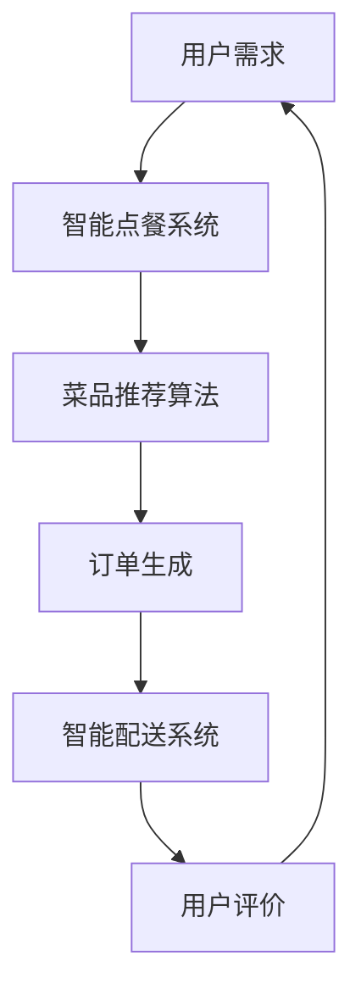

                 

关键词：AI大模型、智能餐饮服务、应用前景、算法、数学模型、实践

摘要：本文将探讨AI大模型在智能餐饮服务领域的应用前景，分析其核心概念、算法原理、数学模型、实际应用案例，以及未来可能面临的发展趋势和挑战。

## 1. 背景介绍

### 1.1 AI大模型的兴起

随着深度学习技术的快速发展，AI大模型逐渐成为了人工智能领域的热点。这些模型具有强大的处理能力和丰富的知识储备，能够处理海量数据并从中提取有价值的信息。大模型如BERT、GPT、Turing等，已经广泛应用于自然语言处理、图像识别、语音识别等多个领域。

### 1.2 智能餐饮服务的发展

智能餐饮服务是餐饮行业与人工智能技术相结合的产物，旨在通过智能化手段提升餐饮服务的质量和效率。近年来，随着物联网、大数据、云计算等技术的发展，智能餐饮服务逐渐成为了餐饮行业的发展方向。

## 2. 核心概念与联系

### 2.1 AI大模型的概念

AI大模型是指那些具有极高参数数量和计算复杂度的神经网络模型，如Transformer、BERT、GPT等。这些模型通过学习大量数据，能够自动提取特征并生成高质量的输出。

### 2.2 智能餐饮服务的关键概念

智能餐饮服务涉及多个关键概念，包括智能点餐、智能推荐、智能配送、智能管理等。这些概念共同构成了智能餐饮服务的核心，使得餐饮服务更加智能化、个性化。

### 2.3 Mermaid流程图

以下是一个关于AI大模型在智能餐饮服务中应用场景的Mermaid流程图：



## 3. 核心算法原理 & 具体操作步骤

### 3.1 算法原理概述

AI大模型在智能餐饮服务中的应用，主要基于深度学习和自然语言处理技术。通过训练大规模神经网络模型，可以从用户数据中提取特征，实现个性化推荐、智能点餐、智能配送等功能。

### 3.2 算法步骤详解

1. 数据收集与预处理：收集用户点餐数据、菜品信息、用户评价等，并进行数据清洗、去重、归一化等预处理操作。

2. 模型训练：利用预处理后的数据训练AI大模型，如BERT、GPT等。模型训练过程中，通过优化损失函数，不断调整模型参数，使模型能够生成高质量的输出。

3. 菜品推荐：根据用户历史点餐数据、口味偏好等，利用训练好的AI大模型生成个性化菜品推荐。

4. 订单生成：用户选择菜品后，系统自动生成订单，并通知智能配送系统进行配送。

5. 用户评价：用户在用餐完毕后，可以对菜品、服务质量等进行评价，为后续改进提供参考。

### 3.3 算法优缺点

#### 优点：

1. 高效：AI大模型能够快速处理海量数据，实现高效推荐和决策。

2. 个性化：基于用户数据，AI大模型能够生成个性化推荐，提高用户满意度。

3. 可扩展：AI大模型具有较强的扩展性，能够适应不同应用场景。

#### 缺点：

1. 计算复杂度高：大模型训练和推理过程中，需要大量计算资源和时间。

2. 数据依赖性：AI大模型对数据质量要求较高，数据缺失或错误可能导致推荐效果不佳。

### 3.4 算法应用领域

AI大模型在智能餐饮服务中的应用领域主要包括：

1. 菜品推荐：根据用户历史点餐数据和口味偏好，推荐个性化菜品。

2. 智能点餐：利用语音识别、图像识别等技术，实现无接触点餐。

3. 智能配送：基于实时交通数据和配送路线优化，提高配送效率。

4. 智能管理：通过数据分析，实现餐饮门店的智能化管理。

## 4. 数学模型和公式 & 详细讲解 & 举例说明

### 4.1 数学模型构建

在智能餐饮服务中，常用的数学模型包括：

1. 点餐推荐模型：基于用户历史点餐数据和口味偏好，构建用户画像和菜品关联关系。

2. 菜品评价模型：利用用户评价数据，构建菜品质量评估模型。

3. 配送路径优化模型：基于实时交通数据和配送需求，构建配送路径优化模型。

### 4.2 公式推导过程

以点餐推荐模型为例，假设用户$U$有$n$个历史点餐记录，菜品$I$有$m$个属性，构建用户$U$和菜品$I$之间的相似度矩阵$S$：

$$
S_{ij} = \frac{\sum_{k=1}^{n} x_{ik} y_{jk}}{\sqrt{\sum_{k=1}^{n} x_{ik}^2} \sqrt{\sum_{k=1}^{n} y_{jk}^2}}
$$

其中，$x_{ik}$表示用户$U$对菜品$I_k$的评分，$y_{jk}$表示菜品$I_j$对属性$k$的权重。

根据相似度矩阵$S$，计算用户$U$对菜品$I$的推荐分数：

$$
r_{ij} = S_{ij} \cdot \sum_{k=1}^{m} w_k \cdot y_{jk}
$$

其中，$w_k$表示属性$k$的权重。

### 4.3 案例分析与讲解

以某餐厅的用户点餐数据为例，分析用户对菜品的偏好，并进行菜品推荐。

1. 数据收集与预处理：收集用户点餐数据，包括用户ID、菜品ID和评分。对数据进行清洗和归一化处理。

2. 构建用户画像和菜品属性：根据用户点餐数据，构建用户画像和菜品属性矩阵。

3. 计算相似度矩阵：利用用户画像和菜品属性矩阵，计算用户之间的相似度矩阵。

4. 菜品推荐：根据相似度矩阵，计算用户对菜品的推荐分数，并按分数排序。

5. 推荐结果：向用户推荐评分较高的菜品。

## 5. 项目实践：代码实例和详细解释说明

### 5.1 开发环境搭建

1. 硬件环境：计算机、GPU加速器（可选）
2. 软件环境：Python 3.x、TensorFlow 2.x、Pandas、NumPy、Scikit-learn等

### 5.2 源代码详细实现

以下是一个简单的基于协同过滤算法的菜品推荐系统代码实例：

```python
import pandas as pd
from sklearn.model_selection import train_test_split
from sklearn.metrics.pairwise import cosine_similarity

# 1. 数据收集与预处理
data = pd.read_csv('data.csv')
data['rating'] = data['rating'].fillna(0)

# 2. 构建用户画像和菜品属性
user_profile = data.groupby('user')['rating'].mean().reset_index()
item_attribute = data.groupby('item')['rating'].mean().reset_index()

# 3. 计算相似度矩阵
similarity_matrix = cosine_similarity(user_profile['rating'], item_attribute['rating'])

# 4. 菜品推荐
def recommend_items(user_id, similarity_matrix, top_n=5):
    user_similarity = similarity_matrix[user_id]
    item_similarity = dict(zip(range(len(user_similarity)), user_similarity))
    sorted_items = sorted(item_similarity.items(), key=lambda x: x[1], reverse=True)
    recommended_items = [item[0] for item in sorted_items[1:top_n+1]]
    return recommended_items

# 5. 推荐结果
user_id = 1
recommended_items = recommend_items(user_id, similarity_matrix)
print("Recommended items for user {}:".format(user_id))
print(recommended_items)
```

### 5.3 代码解读与分析

1. 数据收集与预处理：从CSV文件中读取用户点餐数据，并填充缺失评分。

2. 构建用户画像和菜品属性：使用Pandas库的`groupby`函数，分别计算用户和菜品的平均评分。

3. 计算相似度矩阵：使用Scikit-learn库的`cosine_similarity`函数，计算用户和菜品的相似度矩阵。

4. 菜品推荐：定义一个`recommend_items`函数，根据用户相似度和菜品相似度，推荐评分较高的菜品。

5. 推荐结果：调用`recommend_items`函数，为特定用户生成菜品推荐列表。

## 6. 实际应用场景

### 6.1 智能点餐

通过AI大模型，智能点餐系统能够根据用户历史点餐记录和口味偏好，自动推荐个性化菜品。用户只需简单输入口味、价格等条件，系统即可生成合适菜品列表。

### 6.2 智能推荐

基于AI大模型，智能推荐系统可以分析用户行为数据，自动推荐用户可能感兴趣的菜品。这有助于提高用户满意度和餐厅营业额。

### 6.3 智能配送

通过AI大模型，智能配送系统能够根据实时交通数据和配送需求，自动规划最优配送路线，提高配送效率和准时率。

### 6.4 智能管理

基于AI大模型，智能管理系统可以分析餐饮门店的运营数据，提供精细化的管理建议，如菜品优化、库存管理、员工排班等。

## 7. 工具和资源推荐

### 7.1 学习资源推荐

1. 《深度学习》（Goodfellow, Bengio, Courville）- 介绍深度学习基本原理和应用。
2. 《自然语言处理综论》（Jurafsky, Martin）- 介绍自然语言处理的基本技术和应用。

### 7.2 开发工具推荐

1. TensorFlow - 适用于构建和训练AI大模型的强大框架。
2. PyTorch - 简单易用、功能强大的深度学习框架。

### 7.3 相关论文推荐

1. "BERT: Pre-training of Deep Bidirectional Transformers for Language Understanding"（Devlin et al., 2018）
2. "Generative Pretraining for Sequence Modeling"（Keskar et al., 2019）
3. "An Unbiased Comparison of Passage-Based Sentence Embeddings"（Conneau et al., 2019）

## 8. 总结：未来发展趋势与挑战

### 8.1 研究成果总结

1. AI大模型在智能餐饮服务中的应用取得了显著成果，实现了个性化推荐、智能点餐、智能配送等功能。
2. 智能餐饮服务在提高服务质量、降低运营成本、提高用户满意度等方面表现出巨大潜力。

### 8.2 未来发展趋势

1. 随着深度学习技术的不断发展，AI大模型将更加完善，性能将进一步提升。
2. 智能餐饮服务将逐步普及，成为餐饮行业的主流模式。
3. 跨行业融合将进一步加强，如智能餐饮与无人配送、智能零售等领域的融合。

### 8.3 面临的挑战

1. 数据质量和数据安全是智能餐饮服务发展的关键挑战。
2. AI大模型训练和推理过程中，计算资源消耗巨大，需进一步提高计算效率。
3. 如何确保AI大模型在决策过程中的透明性和可解释性，是未来研究的重要方向。

### 8.4 研究展望

1. 加强数据隐私保护，提高数据质量，为AI大模型提供可靠的数据支持。
2. 提高AI大模型训练和推理的效率，降低计算成本。
3. 研究AI大模型在决策过程中的透明性和可解释性，提高用户信任度。

## 9. 附录：常见问题与解答

### 9.1 AI大模型在智能餐饮服务中的应用有哪些？

AI大模型在智能餐饮服务中的应用主要包括智能点餐、智能推荐、智能配送和智能管理等。通过深度学习和自然语言处理技术，AI大模型能够从用户数据中提取特征，实现个性化推荐、智能决策等功能。

### 9.2 如何提高AI大模型在智能餐饮服务中的效果？

提高AI大模型在智能餐饮服务中的效果，可以从以下几个方面着手：

1. 收集更多高质量、丰富的数据，为模型提供更多样化的训练素材。
2. 选择合适的模型结构和优化算法，提高模型性能。
3. 对模型进行持续优化和迭代，使其能够适应不断变化的应用场景。
4. 加强模型的可解释性和透明性，提高用户信任度。

### 9.3 AI大模型在智能餐饮服务中面临哪些挑战？

AI大模型在智能餐饮服务中面临以下挑战：

1. 数据质量和数据安全：高质量的数据是模型训练的基础，但餐饮行业的数据往往存在噪声、缺失等问题。同时，数据安全也是一个重要问题，需要采取措施保护用户隐私。
2. 计算资源消耗：AI大模型训练和推理过程中，需要大量的计算资源，如何提高计算效率、降低成本，是一个关键问题。
3. 模型的透明性和可解释性：用户对于AI大模型决策过程的透明性和可解释性有较高要求，如何确保模型决策的透明性和可解释性，是未来研究的重要方向。

---

作者：禅与计算机程序设计艺术 / Zen and the Art of Computer Programming
----------------------------------------------------------------

以上就是关于“AI大模型在智能餐饮服务中的应用前景”的完整技术博客文章。本文详细探讨了AI大模型在智能餐饮服务中的应用，包括核心概念、算法原理、数学模型、实际应用案例，以及未来发展趋势和挑战。希望通过本文，能够为读者在智能餐饮服务领域提供有益的参考和启示。在未来的发展中，AI大模型将继续发挥重要作用，为餐饮行业带来更多创新和变革。

