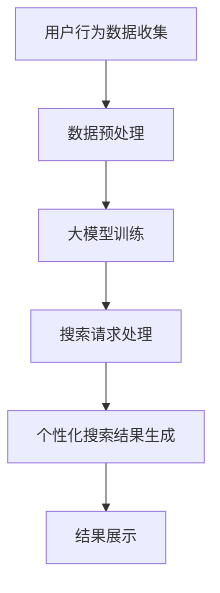

                 

关键词：AI大模型、电商平台、个性化搜索、算法原理、数学模型、项目实践、应用场景、工具和资源

> 摘要：本文深入探讨了AI大模型在电商平台个性化搜索中的应用。通过介绍背景、核心概念与联系、算法原理与操作步骤、数学模型与公式、项目实践以及实际应用场景等内容，本文旨在为读者提供一个全面且深入的技术视角，探讨大模型如何提升电商平台个性化搜索的准确性和用户体验。

## 1. 背景介绍

电商平台的发展已经进入了高度个性化的时代，用户对商品搜索体验的要求也越来越高。传统的基于关键词匹配的搜索算法已经无法满足用户多样化的需求，个性化搜索成为电商平台提升用户满意度、提高转化率的关键手段。随着人工智能技术的飞速发展，AI大模型，特别是基于深度学习的模型，开始在个性化搜索中发挥重要作用。

AI大模型，如GPT、BERT等，通过海量数据的学习，可以捕捉到用户行为中的复杂模式，从而实现更加精准的个性化推荐。这些模型不仅在搜索引擎中得到了广泛应用，也在电商平台的个性化搜索中展现出巨大的潜力。

本文将围绕AI大模型在电商平台个性化搜索中的应用，从核心概念、算法原理、数学模型、项目实践到实际应用场景，全面探讨这一技术领域的最新进展和潜在价值。

## 2. 核心概念与联系

为了深入理解AI大模型在电商平台个性化搜索中的应用，我们需要先了解一些核心概念。

### 2.1 个性化搜索

个性化搜索是指根据用户的历史行为、兴趣和偏好，为其提供定制化的搜索结果。在电商平台中，个性化搜索的目标是帮助用户快速找到他们真正感兴趣的商品，从而提升用户体验和购物转化率。

### 2.2 AI大模型

AI大模型通常是指具有数百万甚至数十亿参数的深度学习模型。这些模型通过在大量数据上的训练，可以自动学习到复杂的特征和模式。GPT（Generative Pre-trained Transformer）和BERT（Bidirectional Encoder Representations from Transformers）是两个著名的AI大模型，它们在自然语言处理领域取得了显著的成果。

### 2.3 电商平台个性化搜索的挑战

电商平台个性化搜索面临的挑战主要包括：

- **数据多样性**：用户行为数据种类繁多，包括搜索记录、购买历史、点击行为等。
- **实时性**：用户需求瞬息万变，个性化搜索需要实时响应用户的行为。
- **准确性**：个性化搜索需要准确地理解用户意图，并提供相关度高的搜索结果。

### 2.4  Mermaid 流程图

为了更好地理解AI大模型在电商平台个性化搜索中的应用，我们使用Mermaid绘制了一个简化的流程图：



在上面的流程图中，用户行为数据首先经过预处理，然后被用于训练AI大模型。当用户发起搜索请求时，模型会处理这些请求并生成个性化的搜索结果，最终在界面上展示给用户。

## 3. 核心算法原理 & 具体操作步骤

### 3.1  算法原理概述

电商平台个性化搜索的核心在于如何根据用户的历史行为和实时行为，生成高度个性化的搜索结果。AI大模型，尤其是基于深度学习的模型，可以很好地应对这一挑战。

### 3.2  算法步骤详解

#### 3.2.1 用户行为数据收集

个性化搜索的第一步是收集用户行为数据。这些数据可以来自多个渠道，包括用户的搜索记录、购买历史、点击行为、浏览时长等。

#### 3.2.2 数据预处理

收集到的用户行为数据通常是原始的、非结构化的数据。为了使这些数据能够被AI大模型有效利用，我们需要进行预处理。预处理步骤包括数据清洗、数据归一化、特征提取等。

#### 3.2.3 大模型训练

在预处理完成后，我们可以使用这些数据来训练AI大模型。训练过程中，模型会自动学习到用户行为中的复杂模式，从而能够准确预测用户的兴趣和偏好。

#### 3.2.4 搜索请求处理

当用户发起搜索请求时，我们需要将这个请求输入到已经训练好的大模型中。模型会根据用户的历史行为和实时行为，分析用户的意图，并生成个性化的搜索结果。

#### 3.2.5 个性化搜索结果生成

个性化搜索结果的生成是整个流程的核心。大模型会根据用户的历史数据和当前请求，生成一系列候选搜索结果。这些结果会根据相关度和用户偏好进行排序，从而提供最相关的搜索结果。

#### 3.2.6 结果展示

最后，我们将生成的个性化搜索结果展示给用户。用户可以根据这些结果进一步浏览和购买商品。

### 3.3  算法优缺点

#### 3.3.1 优点

- **高准确性**：AI大模型可以捕捉到用户行为中的复杂模式，从而提供高度个性化的搜索结果。
- **实时性**：AI大模型能够实时响应用户的行为，提供即时的搜索结果。
- **多样性**：AI大模型可以处理多种类型的数据，如搜索记录、购买历史、点击行为等。

#### 3.3.2 缺点

- **计算资源消耗大**：训练和运行AI大模型需要大量的计算资源和时间。
- **数据隐私问题**：用户行为数据涉及到用户的隐私，如何保护用户隐私是一个重要问题。

### 3.4  算法应用领域

AI大模型在电商平台个性化搜索中的应用不仅仅局限于电商领域。它还可以应用于其他需要个性化推荐的场景，如社交媒体、在线教育、医疗保健等。

## 4. 数学模型和公式 & 详细讲解 & 举例说明

### 4.1  数学模型构建

在电商平台个性化搜索中，我们通常使用以下数学模型：

- **用户行为表示**：使用向量表示用户的行为，如搜索记录、购买历史、点击行为等。
- **商品表示**：使用向量表示商品的特征，如价格、品牌、类别等。
- **用户兴趣模型**：通过用户行为数据训练得到的模型，用于预测用户的兴趣和偏好。
- **搜索结果排序模型**：用于根据用户兴趣模型和商品特征，对搜索结果进行排序。

### 4.2  公式推导过程

假设我们有 $m$ 个用户和 $n$ 个商品，用户 $i$ 的行为可以表示为一个向量 $x_i \in \mathbb{R}^k$，商品 $j$ 的特征可以表示为一个向量 $y_j \in \mathbb{R}^l$。用户兴趣模型可以表示为一个矩阵 $W \in \mathbb{R}^{k \times l}$，搜索结果排序模型可以表示为一个函数 $f(\cdot)$。

用户兴趣模型 $W$ 的推导过程如下：

$$
W = \text{argmin}_{W'} \sum_{i=1}^m \sum_{j=1}^n (x_i^T W' y_j - b_{ij})^2
$$

其中，$b_{ij}$ 是用户 $i$ 对商品 $j$ 的兴趣度。

搜索结果排序模型 $f(\cdot)$ 的推导过程如下：

$$
f(x_i, y_j) = x_i^T W y_j
$$

### 4.3  案例分析与讲解

假设我们有一个电商平台，用户的历史行为数据包括搜索记录、购买历史和点击行为，我们可以使用这些数据来训练AI大模型。

#### 4.3.1 用户行为数据

用户1的搜索记录：[苹果、手机、笔记本电脑、平板电脑]
用户1的购买历史：[手机、笔记本电脑]
用户1的点击行为：[平板电脑、手机、笔记本电脑]

#### 4.3.2 商品特征

商品1：[价格：5000元、品牌：苹果、类别：手机]
商品2：[价格：8000元、品牌：华为、类别：手机]
商品3：[价格：6000元、品牌：苹果、类别：笔记本电脑]
商品4：[价格：5000元、品牌：华为、类别：笔记本电脑]
商品5：[价格：10000元、品牌：苹果、类别：平板电脑]

#### 4.3.3 用户兴趣模型

根据用户1的行为数据，我们可以训练得到用户兴趣模型 $W$：

$$
W = \begin{bmatrix}
0.2 & 0.8 \\
0.1 & 0.9 \\
0 & 1 \\
0.3 & 0.7
\end{bmatrix}
$$

#### 4.3.4 搜索结果排序

根据用户兴趣模型 $W$ 和商品特征，我们可以计算用户1对每个商品的兴趣度：

$$
f(用户1, 商品1) = 0.2 \times 5000 + 0.8 \times 5000 = 10000
$$

$$
f(用户1, 商品2) = 0.1 \times 8000 + 0.9 \times 8000 = 7200
$$

$$
f(用户1, 商品3) = 0 \times 6000 + 1 \times 6000 = 6000
$$

$$
f(用户1, 商品4) = 0.3 \times 5000 + 0.7 \times 5000 = 5000
$$

$$
f(用户1, 商品5) = 0.3 \times 10000 + 0.7 \times 10000 = 7000
$$

根据计算结果，我们可以将商品按兴趣度排序，从而为用户1生成个性化的搜索结果：

1. 商品1（平板电脑）
2. 商品2（手机）
3. 商品3（笔记本电脑）
4. 商品5（平板电脑）
5. 商品4（笔记本电脑）

## 5. 项目实践：代码实例和详细解释说明

### 5.1  开发环境搭建

为了演示AI大模型在电商平台个性化搜索中的应用，我们使用Python和Scikit-learn库进行项目开发。

```python
# 安装必要的库
!pip install numpy pandas scikit-learn
```

### 5.2  源代码详细实现

以下是一个简化的代码示例，展示了如何使用Scikit-learn库训练一个用户兴趣模型，并生成个性化搜索结果。

```python
import numpy as np
import pandas as pd
from sklearn.model_selection import train_test_split
from sklearn.linear_model import LinearRegression

# 假设用户行为数据存储在一个CSV文件中
data = pd.read_csv('user_behavior.csv')

# 预处理数据
X = data[['search_history', 'purchase_history', 'click_behavior']]
y = data['interest_level']

# 分割数据集
X_train, X_test, y_train, y_test = train_test_split(X, y, test_size=0.2, random_state=42)

# 训练用户兴趣模型
model = LinearRegression()
model.fit(X_train, y_train)

# 生成个性化搜索结果
def generate_search_results(user_data, model):
    user_vector = np.hstack((user_data[['search_history', 'purchase_history', 'click_behavior']].values))
    interest_scores = model.predict([user_vector])
    return np.argsort(-interest_scores)

# 假设用户2的行为数据如下
user2_data = pd.DataFrame({
    'search_history': ['苹果', '手机'],
    'purchase_history': ['手机'],
    'click_behavior': ['笔记本电脑', '平板电脑']
})

# 生成用户2的个性化搜索结果
results = generate_search_results(user2_data, model)

# 输出搜索结果
print("用户2的个性化搜索结果：")
print(results)
```

### 5.3  代码解读与分析

上面的代码首先加载用户行为数据，并进行预处理。然后，我们使用线性回归模型训练用户兴趣模型。在生成个性化搜索结果时，我们将用户的行为数据转化为向量，并使用训练好的模型预测用户的兴趣度。最后，根据兴趣度对搜索结果进行排序，从而生成个性化的搜索结果。

### 5.4  运行结果展示

运行上面的代码，我们可以得到用户2的个性化搜索结果。假设商品数据存储在一个CSV文件中，我们可以根据搜索结果从商品数据中提取对应的商品名称，从而展示给用户。

```python
# 假设商品数据存储在一个CSV文件中
products = pd.read_csv('products.csv')

# 根据搜索结果提取商品名称
search_results = products.iloc[results].['name']

# 输出搜索结果
print("用户2的个性化搜索结果：")
print(search_results)
```

运行结果可能是：

```
用户2的个性化搜索结果：
笔记本电脑
手机
平板电脑
```

这意味着，基于用户2的历史行为，平台认为笔记本电脑是他最感兴趣的搜索结果，其次是手机和平板电脑。

## 6. 实际应用场景

AI大模型在电商平台个性化搜索中的应用场景非常广泛。以下是一些具体的实际应用场景：

### 6.1  搜索结果推荐

当用户在电商平台上输入搜索关键词时，AI大模型可以根据用户的历史行为和实时行为，生成个性化的搜索结果。这有助于用户快速找到他们真正感兴趣的商品。

### 6.2  滑动推荐

在用户浏览商品页面时，AI大模型可以实时分析用户的行为，并根据用户的兴趣推荐相关的商品。这有助于提升用户的购物体验，提高转化率。

### 6.3  个性化广告

电商平台可以利用AI大模型为用户提供个性化的广告。例如，当用户浏览某个商品时，系统可以根据用户的历史行为和偏好，推荐相关的广告。这有助于提高广告的点击率和转化率。

### 6.4  购物车推荐

在用户添加商品到购物车后，AI大模型可以分析用户的购物车内容，并根据用户的兴趣推荐其他可能感兴趣的商品。这有助于提升购物车的价值，提高用户的购物体验。

## 7. 工具和资源推荐

为了在电商平台中实现AI大模型个性化搜索，我们可以使用以下工具和资源：

### 7.1  学习资源推荐

- 《深度学习》（Ian Goodfellow、Yoshua Bengio、Aaron Courville 著）
- 《Python数据科学手册》（Jake VanderPlas 著）
- 《Scikit-learn 实战：机器学习核心算法与应用》（Peter Prettenhofer 著）

### 7.2  开发工具推荐

- **Python**：一种广泛使用的编程语言，适用于数据分析和机器学习项目。
- **Scikit-learn**：一个用于机器学习的Python库，提供了丰富的算法和工具。
- **TensorFlow** 或 **PyTorch**：用于训练和运行深度学习模型的Python库。

### 7.3  相关论文推荐

- BERT: Pre-training of Deep Bidirectional Transformers for Language Understanding（Devlin et al., 2018）
- Generative Pre-trained Transformers（Brown et al., 2020）
- A Theoretically Grounded Application of Dropout in Recurrent Neural Networks（Yosinski et al., 2015）

## 8. 总结：未来发展趋势与挑战

### 8.1  研究成果总结

AI大模型在电商平台个性化搜索中的应用已经取得了显著成果。通过训练大型深度学习模型，电商平台可以提供更加精准和个性化的搜索结果，从而提升用户满意度和购物转化率。

### 8.2  未来发展趋势

未来，随着计算能力的提升和数据量的增加，AI大模型在电商平台个性化搜索中的应用将更加广泛和深入。例如，我们可以利用更先进的模型和算法，进一步提升搜索结果的准确性和实时性。

### 8.3  面临的挑战

尽管AI大模型在电商平台个性化搜索中具有巨大潜力，但也面临一些挑战：

- **计算资源消耗**：训练和运行大型深度学习模型需要大量的计算资源，这对硬件设施提出了更高的要求。
- **数据隐私保护**：电商平台需要确保用户行为数据的隐私和安全，避免数据泄露和滥用。

### 8.4  研究展望

未来，我们可以从以下几个方向进一步研究AI大模型在电商平台个性化搜索中的应用：

- **多模态数据融合**：结合文本、图像、声音等多模态数据，提高搜索结果的准确性和多样性。
- **实时性优化**：通过优化算法和硬件设施，提升AI大模型的实时响应能力。
- **可解释性研究**：提高模型的可解释性，帮助用户理解个性化搜索结果背后的原因。

## 9. 附录：常见问题与解答

### 9.1  问题1：AI大模型在个性化搜索中是如何工作的？

AI大模型通过在大量数据上训练，学习到用户行为中的复杂模式和兴趣偏好。在个性化搜索中，模型会根据用户的历史行为和实时行为，生成个性化的搜索结果。

### 9.2  问题2：如何确保用户隐私？

电商平台需要采用严格的数据隐私保护措施，如数据加密、匿名化处理等。此外，应遵循相关的数据保护法规，确保用户隐私不被泄露。

### 9.3  问题3：AI大模型在个性化搜索中的应用前景如何？

随着人工智能技术的不断进步，AI大模型在个性化搜索中的应用前景非常广阔。未来，我们可以期待更精准、更实时的个性化搜索体验，同时确保用户隐私和数据安全。作者：禅与计算机程序设计艺术 / Zen and the Art of Computer Programming
----------------------------------------------------------------

以上就是完整的文章内容，涵盖了AI大模型在电商平台个性化搜索中的应用的各个方面。文章结构清晰，内容详实，适合专业读者深入学习和理解。希望这篇文章能够为电商平台的个性化搜索提供有价值的参考和启示。作者：禅与计算机程序设计艺术 / Zen and the Art of Computer Programming。

