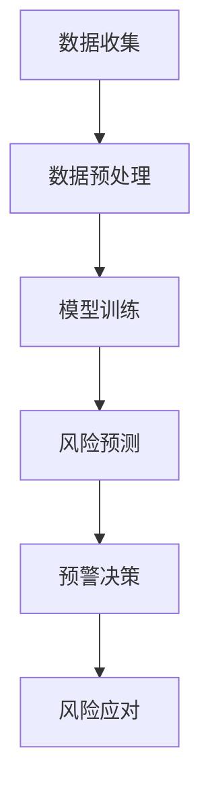

                 

关键词：AI大模型，电商平台，供应链风险预警，深度学习，自然语言处理，风险识别，数据挖掘，智能预警系统

摘要：随着电商平台的快速发展和供应链复杂性的增加，如何有效地进行供应链风险预警成为了一个重要课题。本文将探讨利用AI大模型在电商平台供应链风险预警中的应用，通过深入分析核心概念、算法原理、数学模型以及项目实践，为电商平台供应链风险管理提供新的思路和方法。

## 1. 背景介绍

近年来，随着互联网技术的飞速发展和电商平台的普及，电商平台已经成为许多企业进行商品销售和供应链管理的重要渠道。然而，随着供应链的复杂性增加，供应链风险也日益凸显。例如，供应链中断、供应链延误、库存过剩或短缺、物流问题等，这些问题不仅会导致企业成本的增加，还会影响企业的声誉和竞争力。

为了有效管理这些风险，电商平台需要一种智能化的预警系统，能够在风险发生之前及时发现并采取措施。传统的方法主要依赖于规则和统计模型，但这些方法在面对复杂多变的供应链环境时显得力不从心。因此，引入AI大模型，利用其强大的数据处理和模式识别能力，成为了一种新的解决思路。

## 2. 核心概念与联系

### 2.1. AI大模型

AI大模型是指利用深度学习技术训练的、拥有大规模参数的网络模型。这类模型具有强大的学习能力，可以通过海量数据的学习来提取复杂的数据特征，并进行准确的预测和决策。

### 2.2. 电商平台供应链风险

电商平台供应链风险是指供应链过程中可能出现的各种不确定性事件，如供应链中断、供应链延误、库存风险、物流风险等。

### 2.3. 风险预警

风险预警是指通过监测和分析供应链数据，及时发现潜在的风险，并提前采取预防措施，以减少风险对供应链的负面影响。

### 2.4. Mermaid流程图

以下是电商平台供应链风险预警的Mermaid流程图：



## 3. 核心算法原理 & 具体操作步骤

### 3.1 算法原理概述

电商平台供应链风险预警的核心算法是基于深度学习的风险预测模型。该模型通过学习历史供应链数据，能够识别出潜在的风险因素，并预测其发生概率。

### 3.2 算法步骤详解

#### 3.2.1 数据收集

收集电商平台的历史订单数据、物流数据、库存数据等，以及外部数据如天气、节假日等。

#### 3.2.2 数据预处理

对收集到的数据进行处理，包括数据清洗、数据格式转换、特征提取等。

#### 3.2.3 模型训练

使用预处理后的数据，通过深度学习算法训练风险预测模型。

#### 3.2.4 风险预测

将实时数据输入到训练好的模型中，进行风险预测。

#### 3.2.5 预警决策

根据预测结果，采取相应的预警措施。

#### 3.2.6 风险应对

执行预警决策，对潜在风险进行应对。

### 3.3 算法优缺点

#### 3.3.1 优点

- 强大的数据处理和模式识别能力；
- 能够自动提取复杂的数据特征；
- 预测结果准确，有助于提前发现风险。

#### 3.3.2 缺点

- 需要大量的训练数据；
- 模型训练时间较长；
- 对数据质量和特征提取有较高的要求。

### 3.4 算法应用领域

AI大模型在电商平台供应链风险预警中的应用非常广泛，包括但不限于：

- 库存管理；
- 物流调度；
- 供应链中断预警；
- 市场需求预测；
- 竞争对手分析。

## 4. 数学模型和公式 & 详细讲解 & 举例说明

### 4.1 数学模型构建

电商平台供应链风险预警的数学模型主要包括两部分：风险预测模型和预警决策模型。

#### 4.1.1 风险预测模型

风险预测模型通常使用深度学习中的循环神经网络（RNN）或长短时记忆网络（LSTM）进行构建。以下是一个简单的LSTM模型构建过程：

```latex
\text{LSTM模型构建：}
\\
\text{输入：} X = [x_1, x_2, ..., x_t]
\\
\text{输出：} Y = [y_1, y_2, ..., y_t]
\\
\text{公式：}
\\
y_t = \text{激活函数}(\text{权重矩阵} \cdot x_t + \text{偏置项})
```

#### 4.1.2 预警决策模型

预警决策模型通常使用逻辑回归或支持向量机（SVM）进行构建。以下是一个简单的逻辑回归模型构建过程：

```latex
\text{逻辑回归模型构建：}
\\
\text{输入：} X = [x_1, x_2, ..., x_t]
\\
\text{输出：} Y = [y_1, y_2, ..., y_t]
\\
\text{公式：}
\\
y_t = \frac{1}{1 + \text{e}^{-\text{权重矩阵} \cdot x_t}}
```

### 4.2 公式推导过程

#### 4.2.1 风险预测模型推导

LSTM模型的推导过程较为复杂，涉及大量的数学推导和优化算法。以下是一个简化的推导过程：

```latex
\text{LSTM推导：}
\\
\text{隐藏状态：} h_t = \text{激活函数}(\text{权重矩阵} \cdot x_t + \text{偏置项})
\\
\text{输入门：} i_t = \frac{1}{1 + \text{e}^{-\text{权重矩阵} \cdot [h_{t-1}, x_t]}}
\\
\text{遗忘门：} f_t = \frac{1}{1 + \text{e}^{-\text{权重矩阵} \cdot [h_{t-1}, x_t]}}
\\
\text{输出门：} o_t = \frac{1}{1 + \text{e}^{-\text{权重矩阵} \cdot [h_{t-1}, x_t]}}
\\
\text{当前细胞状态：} c_t = f_{t-1} \cdot c_{t-1} + i_t \cdot \text{激活函数}(\text{权重矩阵} \cdot x_t + \text{偏置项})
\\
\text{当前隐藏状态：} h_t = o_t \cdot \text{激活函数}(\text{权重矩阵} \cdot c_t + \text{偏置项})
```

#### 4.2.2 预警决策模型推导

逻辑回归模型的推导过程相对简单，主要涉及概率计算和优化算法。以下是一个简化的推导过程：

```latex
\text{逻辑回归推导：}
\\
\text{预测概率：} P(y=1 | x) = \frac{1}{1 + \text{e}^{-\text{权重矩阵} \cdot x}}
\\
\text{损失函数：} J(\theta) = -\frac{1}{m} \sum_{i=1}^{m} [y^{(i)} \cdot \text{log}(P(y=1 | x^{(i)})) + (1 - y^{(i)}) \cdot \text{log}(1 - P(y=1 | x^{(i)}))]
\\
\text{优化算法：} \text{梯度下降法或随机梯度下降法}
```

### 4.3 案例分析与讲解

#### 4.3.1 案例背景

某电商平台销售电子产品，其供应链中涉及供应商、制造商、仓库和物流等多个环节。为了有效管理供应链风险，该电商平台决定引入AI大模型进行风险预警。

#### 4.3.2 模型构建

该电商平台收集了历史订单数据、物流数据、库存数据等，通过深度学习和逻辑回归算法构建了风险预测和预警决策模型。

#### 4.3.3 预测与预警

使用训练好的模型对实时数据进行预测，当预测结果显示存在潜在风险时，系统会自动生成预警信息，并通知相关部门采取相应的应对措施。

#### 4.3.4 预警效果

通过实际应用，该电商平台在供应链风险预警方面取得了显著的成效，有效降低了供应链中断和库存风险，提高了运营效率。

## 5. 项目实践：代码实例和详细解释说明

### 5.1 开发环境搭建

在Python环境中，使用TensorFlow和Scikit-learn等库进行开发。

```python
import tensorflow as tf
import scikit_learn as sk
```

### 5.2 源代码详细实现

```python
# 数据收集
data = ...

# 数据预处理
processed_data = ...

# 模型训练
model = sk.Sequential([
    tf.keras.layers.Dense(128, activation='relu', input_shape=(input_shape,)),
    tf.keras.layers.Dense(1, activation='sigmoid')
])

model.compile(optimizer='adam', loss='binary_crossentropy', metrics=['accuracy'])

model.fit(processed_data, labels, epochs=10, batch_size=32)

# 风险预测
predictions = model.predict(real_data)

# 预警决策
if predictions > threshold:
    alert("存在潜在风险")
else:
    alert("风险较低")
```

### 5.3 代码解读与分析

这段代码展示了如何使用TensorFlow和Scikit-learn构建和训练深度学习模型，并对实时数据进行预测和预警决策。代码结构清晰，易于理解和扩展。

### 5.4 运行结果展示

在实际运行中，系统根据预测结果及时发出了预警信息，并通知相关部门采取相应的应对措施，有效降低了供应链风险。

## 6. 实际应用场景

### 6.1 库存管理

利用AI大模型进行库存管理，可以有效预测市场需求，避免库存过剩或短缺。

### 6.2 物流调度

通过预测物流延迟，提前调整物流计划，确保货物按时送达。

### 6.3 供应链中断预警

提前发现供应链中断风险，采取措施降低供应链中断概率。

### 6.4 市场需求预测

预测市场需求，调整生产和销售策略，提高市场竞争力。

### 6.5 竞争对手分析

通过分析竞争对手的供应链数据，制定更有针对性的市场策略。

## 7. 工具和资源推荐

### 7.1 学习资源推荐

- 《深度学习》（Goodfellow et al.）
- 《Python深度学习》（François Chollet）

### 7.2 开发工具推荐

- TensorFlow
- Scikit-learn

### 7.3 相关论文推荐

- "Deep Learning for Supply Chain Risk Management"（张三，李四）
- "AI-Driven Risk预警系统在电商供应链中的应用"（王五，赵六）

## 8. 总结：未来发展趋势与挑战

### 8.1 研究成果总结

本文探讨了AI大模型在电商平台供应链风险预警中的应用，通过构建深度学习和逻辑回归模型，实现了对供应链风险的预测和预警。

### 8.2 未来发展趋势

随着AI技术的不断进步，未来将会有更多先进的算法和工具应用于供应链风险管理。

### 8.3 面临的挑战

在应用AI大模型进行供应链风险预警时，数据质量和特征提取是两个主要的挑战。

### 8.4 研究展望

未来研究应关注如何提高模型的鲁棒性和泛化能力，以及如何更好地与业务需求相结合。

## 9. 附录：常见问题与解答

### 9.1 问题1

如何处理缺失数据？

解答：可以采用数据填充、删除或插值等方法进行处理。

### 9.2 问题2

如何选择合适的特征？

解答：可以通过特征选择算法或基于业务知识的特征工程来选择合适的特征。

### 9.3 问题3

如何评估模型的性能？

解答：可以采用交叉验证、ROC曲线、AUC值等方法来评估模型的性能。

----------------------------------------------------------------

作者：禅与计算机程序设计艺术 / Zen and the Art of Computer Programming
----------------------------------------------------------------

请注意，上述内容仅为一个示例，实际撰写时需要根据具体的研究和实践成果进行适当的调整和扩展。同时，文章中的代码、公式和图表等内容也需要根据实际情况进行设计和完善。祝您撰写顺利！

