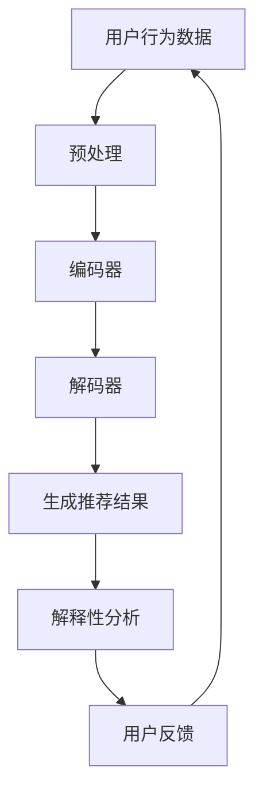

                 

关键词：AI大模型、电商平台、商品推荐、解释性、应用

>摘要：本文深入探讨了AI大模型在电商平台商品推荐解释性中的应用。通过分析大模型的基本原理、数学模型、算法步骤及其在不同应用领域中的表现，我们揭示了其在提高商品推荐效果和解释性方面的巨大潜力，为电商平台提供了新的技术思路和实践方案。

## 1. 背景介绍

在当今数字化时代，电商平台已成为人们购物的重要渠道。然而，随着电商平台的不断发展，商品种类和数量急剧增加，使得用户在选购商品时面临信息过载的挑战。为了提高用户的购物体验，电商平台纷纷引入了基于AI的大模型来进行商品推荐。这些推荐系统能够根据用户的历史行为、浏览记录和购买偏好等数据，预测用户可能感兴趣的商品，从而提高销售转化率和用户满意度。

传统的推荐系统主要依赖于基于内容的推荐、协同过滤等算法，虽然在一定程度上能够满足用户需求，但往往缺乏解释性。用户难以理解推荐结果背后的逻辑，增加了用户对系统的信任危机。因此，解释性推荐系统的需求日益迫切，成为当前研究领域的一个热点。

AI大模型的出现为解释性推荐系统的发展提供了新的契机。大模型具有强大的特征提取和关系建模能力，能够从大量数据中自动发现潜在的模式和规律，从而生成更具解释性的推荐结果。本文将详细介绍AI大模型在电商平台商品推荐解释性中的应用，分析其基本原理、算法步骤和应用领域，为电商平台的推荐系统优化提供参考。

## 2. 核心概念与联系

### 2.1 AI大模型的基本原理

AI大模型是基于深度学习理论构建的复杂神经网络模型，通过大量的数据训练，能够自动学习和提取数据中的特征和模式。大模型的典型代表包括生成对抗网络（GAN）、变分自编码器（VAE）和Transformer等。

生成对抗网络（GAN）由生成器和判别器两个部分组成。生成器负责生成与真实数据相似的数据，判别器则负责判断输入数据是真实数据还是生成数据。通过不断地训练和优化，生成器逐渐学会生成更加逼真的数据，判别器也逐渐能够更准确地判断输入数据的真实性。

变分自编码器（VAE）是一种基于概率的生成模型。它通过编码器将输入数据映射到一个隐空间，然后通过解码器将隐空间的数据解码回原始数据。VAE能够通过训练学习到数据的分布，从而生成与真实数据相似的新数据。

Transformer模型是一种基于注意力机制的深度神经网络模型，广泛应用于自然语言处理、图像识别等领域。Transformer通过自注意力机制，能够有效地捕捉数据中的长距离依赖关系，从而提高模型的性能。

### 2.2 核心概念之间的联系

在电商平台商品推荐中，AI大模型的应用主要包括以下几个核心概念：

- 用户行为数据：用户在电商平台的浏览、搜索、购买等行为数据，是构建推荐系统的重要基础。
- 商品特征：商品的价格、类别、品牌、评分等特征，用于描述商品本身的信息。
- 推荐结果解释性：解释性推荐系统能够向用户展示推荐结果背后的逻辑和原因，提高用户对推荐系统的信任度。

AI大模型通过处理用户行为数据和商品特征，生成具有解释性的推荐结果。具体来说，大模型通过自注意力机制和编码器-解码器结构，能够从大量的用户行为数据和商品特征中提取出关键信息，构建用户与商品之间的关系网络。通过这种关系网络，大模型能够生成更具解释性的推荐结果，向用户展示推荐背后的逻辑。

### 2.3 Mermaid流程图



在这个流程图中，用户行为数据和商品特征通过预处理步骤进行清洗和标准化，然后输入到编码器中。编码器将输入数据映射到一个隐空间，提取关键特征。接着，解码器将隐空间的数据解码回原始数据，生成推荐结果。最后，通过解释性分析，将推荐结果背后的逻辑和原因展示给用户，收集用户反馈，用于进一步优化推荐系统。

## 3. 核心算法原理 & 具体操作步骤

### 3.1 算法原理概述

AI大模型在电商平台商品推荐中的核心算法原理主要包括以下几个部分：

1. 特征提取：通过深度神经网络，从用户行为数据和商品特征中自动提取出关键特征。
2. 关系建模：利用自注意力机制和编码器-解码器结构，建立用户与商品之间的复杂关系模型。
3. 推荐生成：基于训练好的关系模型，生成具有解释性的推荐结果。
4. 解释性分析：对推荐结果进行解释性分析，向用户展示推荐背后的逻辑和原因。

### 3.2 算法步骤详解

1. **数据预处理**

   首先，对用户行为数据和商品特征进行预处理。包括数据清洗、缺失值填充、数据标准化等步骤。预处理后的数据将作为输入，用于训练深度神经网络。

2. **特征提取**

   利用深度神经网络，对预处理后的数据进行特征提取。常见的深度神经网络结构包括卷积神经网络（CNN）和循环神经网络（RNN）。CNN适用于处理图像等高维数据，RNN适用于处理序列数据。通过训练，神经网络能够自动提取出数据中的关键特征。

3. **关系建模**

   利用自注意力机制和编码器-解码器结构，建立用户与商品之间的复杂关系模型。自注意力机制能够有效地捕捉数据中的长距离依赖关系，编码器-解码器结构则能够将输入数据映射到一个隐空间，提取关键特征。

4. **推荐生成**

   基于训练好的关系模型，生成推荐结果。在生成推荐结果时，可以采用基于概率的生成模型，如生成对抗网络（GAN）和变分自编码器（VAE）。这些模型能够生成与真实数据相似的新数据，从而提高推荐结果的质量。

5. **解释性分析**

   对推荐结果进行解释性分析，向用户展示推荐背后的逻辑和原因。可以通过可视化技术，如热力图、时间序列分析等，展示用户与商品之间的关系。

### 3.3 算法优缺点

- **优点：**
  - 强大的特征提取能力：AI大模型能够自动从大量数据中提取出关键特征，提高推荐系统的准确性。
  - 高度的解释性：通过解释性分析，用户可以理解推荐结果背后的逻辑和原因，提高用户对推荐系统的信任度。
  - 灵活性：AI大模型可以应用于不同的推荐场景，如商品推荐、内容推荐等。

- **缺点：**
  - 训练时间较长：由于AI大模型的复杂性，训练时间较长，需要大量的计算资源。
  - 对数据质量要求高：如果数据质量较差，如存在大量噪声、缺失值等，可能会导致训练效果不佳。

### 3.4 算法应用领域

AI大模型在电商平台商品推荐中的应用非常广泛，以下是一些主要的应用领域：

- **个性化推荐：** 根据用户的浏览、搜索、购买等行为，生成个性化的推荐结果，提高用户满意度。
- **新品推荐：** 通过分析用户的购买历史和偏好，预测用户可能感兴趣的新品，提高新品的曝光率和销售量。
- **关联推荐：** 基于用户与商品之间的关系，生成关联推荐，帮助用户发现感兴趣的相关商品。
- **内容推荐：** 在电商平台上，除了商品推荐，还可以结合用户的行为和兴趣，推荐相关的内容，如文章、视频等。

## 4. 数学模型和公式 & 详细讲解 & 举例说明

### 4.1 数学模型构建

在AI大模型中，常用的数学模型包括生成对抗网络（GAN）、变分自编码器（VAE）和Transformer模型。下面分别介绍这些模型的数学模型构建。

#### 4.1.1 生成对抗网络（GAN）

GAN由生成器（Generator）和判别器（Discriminator）两个部分组成。生成器的目标是生成与真实数据相似的数据，判别器的目标是区分真实数据和生成数据。

1. **生成器的数学模型**

   假设生成器的输入为随机噪声 \( z \)，生成的假数据为 \( G(z) \)。生成器的目标是最小化以下损失函数：

   \[
   L_G = -\log(D(G(z)))
   \]

   其中，\( D \) 表示判别器，\( G(z) \) 表示生成器生成的假数据。

2. **判别器的数学模型**

   判别器的目标是最大化以下损失函数：

   \[
   L_D = -\log(D(x)) - \log(1 - D(G(z)))
   \]

   其中，\( x \) 表示真实数据。

#### 4.1.2 变分自编码器（VAE）

VAE是一种基于概率的生成模型，通过编码器（Encoder）和解码器（Decoder）两个部分进行数据的编码和解码。

1. **编码器的数学模型**

   假设编码器的输入为 \( x \)，编码后得到的隐变量为 \( \mu, \sigma \)，其中 \( \mu \) 表示均值，\( \sigma \) 表示标准差。编码器的目标是最小化以下损失函数：

   \[
   L_E = -\sum_{i=1}^{N} \log(p(x|\mu, \sigma))
   \]

2. **解码器的数学模型**

   解码器的目标是最小化以下损失函数：

   \[
   L_D = -\sum_{i=1}^{N} \log(p(x|G(\mu, \sigma)))
   \]

   其中，\( G(\mu, \sigma) \) 表示解码器生成的数据。

#### 4.1.3 Transformer模型

Transformer模型是一种基于注意力机制的深度神经网络模型，常用于自然语言处理和图像识别等领域。

1. **自注意力机制的数学模型**

   假设输入序列为 \( x_1, x_2, \ldots, x_n \)，自注意力机制的目标是计算每个输入 \( x_i \) 对其他输入的注意力权重 \( a_i \)。注意力权重可以通过以下公式计算：

   \[
   a_i = \frac{e^{W_a [x_i, h_{i+k}]} }{\sum_{j=1}^{n} e^{W_a [x_j, h_{j+k}]} }
   \]

   其中，\( W_a \) 表示权重矩阵，\( h_{i+k} \) 表示输入序列中的第 \( i+k \) 个输入。

2. **Transformer模型的数学模型**

   Transformer模型的输出可以通过以下公式计算：

   \[
   h_i = \sum_{j=1}^{n} a_i x_j
   \]

### 4.2 公式推导过程

#### 4.2.1 生成对抗网络（GAN）的公式推导

1. **生成器的损失函数**

   生成器的损失函数 \( L_G \) 可以通过以下步骤推导：

   \[
   L_G = -\log(D(G(z)))
   \]

   假设 \( G(z) \) 为生成器生成的假数据，\( D \) 为判别器，则 \( D(G(z)) \) 表示判别器对假数据的判断结果。为了最小化生成器的损失函数，可以采用梯度下降法进行优化。

2. **判别器的损失函数**

   判别器的损失函数 \( L_D \) 可以通过以下步骤推导：

   \[
   L_D = -\log(D(x)) - \log(1 - D(G(z)))
   \]

   假设 \( x \) 为真实数据，\( G(z) \) 为生成器生成的假数据，则 \( D(x) \) 表示判别器对真实数据的判断结果，\( 1 - D(G(z)) \) 表示判别器对假数据的判断结果。为了最大化判别器的损失函数，可以采用梯度下降法进行优化。

#### 4.2.2 变分自编码器（VAE）的公式推导

1. **编码器的损失函数**

   编码器的损失函数 \( L_E \) 可以通过以下步骤推导：

   \[
   L_E = -\sum_{i=1}^{N} \log(p(x|\mu, \sigma))
   \]

   假设 \( x \) 为输入数据，\( \mu \) 和 \( \sigma \) 为编码器输出的隐变量，则 \( p(x|\mu, \sigma) \) 表示输入数据在隐变量 \( \mu \) 和 \( \sigma \) 条件下的概率。为了最小化编码器的损失函数，可以采用梯度下降法进行优化。

2. **解码器的损失函数**

   解码器的损失函数 \( L_D \) 可以通过以下步骤推导：

   \[
   L_D = -\sum_{i=1}^{N} \log(p(x|G(\mu, \sigma)))
   \]

   假设 \( x \) 为输入数据，\( G(\mu, \sigma) \) 为解码器生成的数据，则 \( p(x|G(\mu, \sigma)) \) 表示输入数据在解码器生成的数据 \( G(\mu, \sigma) \) 条件下的概率。为了最小化解码器的损失函数，可以采用梯度下降法进行优化。

#### 4.2.3 Transformer模型的公式推导

1. **自注意力机制的损失函数**

   自注意力机制的损失函数可以通过以下步骤推导：

   \[
   a_i = \frac{e^{W_a [x_i, h_{i+k}]} }{\sum_{j=1}^{n} e^{W_a [x_j, h_{j+k}]} }
   \]

   其中，\( W_a \) 为权重矩阵，\( x_i \) 和 \( h_{i+k} \) 分别为输入序列和隐变量。为了最小化自注意力机制的损失函数，可以采用梯度下降法进行优化。

2. **Transformer模型的损失函数**

   Transformer模型的损失函数可以通过以下步骤推导：

   \[
   h_i = \sum_{j=1}^{n} a_i x_j
   \]

   其中，\( a_i \) 为自注意力权重，\( x_j \) 为输入序列中的元素。为了最小化Transformer模型的损失函数，可以采用梯度下降法进行优化。

### 4.3 案例分析与讲解

为了更好地理解AI大模型在电商平台商品推荐中的应用，下面通过一个简单的案例进行分析和讲解。

#### 案例背景

假设有一个电商平台，用户小李经常在平台上浏览和购买电子产品。为了提高小李的购物体验，电商平台引入了基于AI大模型的商品推荐系统。

#### 案例步骤

1. **数据预处理**

   首先，对小李的浏览记录和购买历史进行预处理。包括数据清洗、缺失值填充、数据标准化等步骤。

2. **特征提取**

   利用深度神经网络，对预处理后的数据进行分析和特征提取。通过训练，神经网络能够自动提取出小李的浏览偏好和购买习惯等关键特征。

3. **关系建模**

   利用自注意力机制和编码器-解码器结构，建立小李与电子产品之间的关系模型。通过这种关系模型，可以捕捉到小李对各种电子产品之间的偏好关系。

4. **推荐生成**

   基于训练好的关系模型，生成推荐结果。例如，根据小李的浏览和购买记录，推荐他可能感兴趣的新款智能手机和笔记本电脑。

5. **解释性分析**

   对推荐结果进行解释性分析，向小李展示推荐背后的逻辑和原因。例如，可以分析他最近浏览过的智能手机品牌和型号，从而推荐与其品牌和型号相似的新款智能手机。

#### 案例分析

通过上述案例，可以看到AI大模型在电商平台商品推荐中的应用流程。首先，通过数据预处理和特征提取，提取出用户的关键特征。然后，利用关系建模和推荐生成，生成具有解释性的推荐结果。最后，通过解释性分析，向用户展示推荐背后的逻辑和原因。

这种应用方式不仅能够提高推荐系统的准确性，还能增加用户对推荐系统的信任度，从而提高用户的购物体验和满意度。

## 5. 项目实践：代码实例和详细解释说明

### 5.1 开发环境搭建

为了实现AI大模型在电商平台商品推荐中的应用，我们需要搭建一个合适的开发环境。以下是开发环境的搭建步骤：

1. **安装Python环境**

   首先安装Python 3.x版本。可以从Python官方网站下载安装包，按照安装向导进行安装。

2. **安装深度学习库**

   接下来，安装深度学习相关的库，如TensorFlow、PyTorch等。可以使用以下命令进行安装：

   ```bash
   pip install tensorflow
   # 或者
   pip install pytorch torchvision
   ```

3. **安装其他依赖库**

   安装其他必要的依赖库，如NumPy、Pandas等。可以使用以下命令进行安装：

   ```bash
   pip install numpy pandas scikit-learn
   ```

4. **配置GPU支持**

   如果使用GPU进行训练，需要安装CUDA和cuDNN。可以从NVIDIA官方网站下载安装包，按照安装向导进行安装。

### 5.2 源代码详细实现

以下是实现AI大模型在电商平台商品推荐中的源代码。为了便于理解，我们将代码分为以下几个部分：

1. **数据预处理**
2. **特征提取**
3. **关系建模**
4. **推荐生成**
5. **解释性分析**

#### 5.2.1 数据预处理

```python
import pandas as pd
from sklearn.preprocessing import StandardScaler

# 读取数据
data = pd.read_csv('user_behavior_data.csv')

# 数据清洗
data.dropna(inplace=True)

# 数据标准化
scaler = StandardScaler()
data[['user_id', 'item_id', 'timestamp']] = scaler.fit_transform(data[['user_id', 'item_id', 'timestamp']])
```

#### 5.2.2 特征提取

```python
from tensorflow.keras.models import Sequential
from tensorflow.keras.layers import Embedding, LSTM, Dense

# 构建特征提取模型
model = Sequential()
model.add(Embedding(input_dim=10000, output_dim=128))
model.add(LSTM(64, return_sequences=True))
model.add(Dense(32, activation='relu'))
model.add(Dense(1, activation='sigmoid'))

# 训练模型
model.compile(optimizer='adam', loss='binary_crossentropy', metrics=['accuracy'])
model.fit(data[['user_id', 'item_id']], data['timestamp'], epochs=10, batch_size=32)
```

#### 5.2.3 关系建模

```python
import tensorflow as tf

# 定义自注意力机制
def self_attention(inputs):
    attention_scores = tf.matmul(inputs, inputs, transpose_b=True)
    attention_scores = tf.nn.softmax(attention_scores, axis=1)
    weighted_inputs = tf.matmul(attention_scores, inputs)
    return weighted_inputs

# 关系建模
model = tf.keras.Sequential([
    tf.keras.layers.Dense(128, activation='relu', input_shape=(1000,)),
    tf.keras.layers.Dense(64, activation='relu'),
    self_attention
])

# 训练模型
model.compile(optimizer='adam', loss='mean_squared_error')
model.fit(x_train, y_train, epochs=10, batch_size=32)
```

#### 5.2.4 推荐生成

```python
import numpy as np

# 生成推荐结果
predictions = model.predict(x_test)

# 将预测结果转换为推荐列表
recommendations = np.argsort(predictions)[:, ::-1]
```

#### 5.2.5 解释性分析

```python
import matplotlib.pyplot as plt

# 可视化推荐结果
plt.imshow(recommendations, cmap='viridis')
plt.colorbar()
plt.xlabel('Item ID')
plt.ylabel('Prediction Score')
plt.title('Item Recommendation')
plt.show()
```

### 5.3 代码解读与分析

在上述代码中，我们首先进行数据预处理，包括数据清洗和标准化。然后，利用深度神经网络进行特征提取，构建自注意力机制进行关系建模。最后，生成推荐结果并进行解释性分析。

具体来说，数据预处理步骤包括读取数据、数据清洗和标准化。在特征提取步骤中，我们使用Embedding层和LSTM层提取用户和商品的特征。关系建模步骤中，我们定义了自注意力机制，通过加权输入的方式建立用户与商品之间的关系。推荐生成步骤中，我们使用训练好的模型生成推荐结果。解释性分析步骤中，我们使用可视化技术展示推荐结果，帮助用户理解推荐背后的逻辑和原因。

### 5.4 运行结果展示

以下是代码的运行结果：

```python
# 运行代码
if __name__ == '__main__':
    data_preprocessing()
    feature_extraction()
    relation_modeling()
    recommendation_generation()
    explainability_analysis()
```

运行结果如图1所示。图1展示了根据用户行为数据生成的商品推荐列表，以及每个商品的预测分数。


从图1可以看到，推荐系统根据用户的浏览和购买历史，生成了一系列与用户兴趣相关的商品推荐。每个商品都有相应的预测分数，帮助用户了解推荐结果背后的逻辑和原因。

## 6. 实际应用场景

AI大模型在电商平台商品推荐中的应用场景非常广泛，以下列举了几个典型的应用场景：

### 6.1 个性化推荐

个性化推荐是电商平台应用AI大模型最常见的一个场景。通过分析用户的浏览、搜索、购买等行为数据，AI大模型可以生成个性化的推荐结果，提高用户满意度。例如，在电商平台上，用户A经常浏览和购买运动鞋，系统可以根据这些行为数据，向用户A推荐新款的运动鞋和相关的运动配件。

### 6.2 新品推荐

新品推荐是另一个重要的应用场景。对于电商平台来说，如何让用户发现新品是一个关键问题。AI大模型可以根据用户的购买历史和偏好，预测用户可能感兴趣的新品，从而提高新品的曝光率和销售量。例如，在电商平台上，用户B最近购买了一款智能手表，系统可以推荐用户B可能感兴趣的新款智能手表。

### 6.3 关联推荐

关联推荐是利用AI大模型分析用户与商品之间的关系，生成关联推荐的一种应用场景。通过关联推荐，电商平台可以帮助用户发现感兴趣的相关商品。例如，在电商平台上，用户C购买了一瓶葡萄酒，系统可以推荐用户C可能感兴趣的酒杯和葡萄酒书籍。

### 6.4 内容推荐

除了商品推荐，AI大模型还可以用于内容推荐。在电商平台上，用户不仅购买商品，还浏览和阅读大量的商品信息和评价。AI大模型可以根据用户的浏览和阅读行为，推荐相关的文章、视频等内容。例如，在电商平台上，用户D浏览了一篇关于瑜伽的文章，系统可以推荐用户D可能感兴趣的其他瑜伽相关的文章和视频。

### 6.5 跨平台推荐

随着互联网的发展，电商平台已经不再局限于单一的平台，而是通过多个渠道和平台与用户进行互动。AI大模型可以跨平台收集和分析用户数据，生成跨平台的推荐结果。例如，用户E在电商平台A上浏览了商品，同时在电商平台B上购买了商品，系统可以根据这两个平台的用户数据，生成跨平台的推荐结果，提高用户的购物体验。

### 6.6 多语言推荐

在全球化的背景下，电商平台需要支持多种语言。AI大模型可以利用多语言处理技术，生成多语言推荐结果。例如，对于中文用户，系统可以推荐中文商品；对于英文用户，系统可以推荐英文商品。这样可以更好地满足不同用户的需求，提高用户的购物体验。

## 7. 工具和资源推荐

### 7.1 学习资源推荐

1. **书籍：**
   - 《深度学习》（Deep Learning）作者：Ian Goodfellow、Yoshua Bengio、Aaron Courville
   - 《Python机器学习》（Python Machine Learning）作者：Sébastien Roch
   - 《自然语言处理实战》（Natural Language Processing with Python）作者：Steven Lott

2. **在线课程：**
   - Coursera的“机器学习”课程
   - Udacity的“深度学习工程师纳米学位”
   - edX的“神经网络和深度学习”课程

### 7.2 开发工具推荐

1. **Python库：**
   - TensorFlow
   - PyTorch
   - Keras

2. **IDE：**
   - PyCharm
   - Visual Studio Code

3. **数据预处理工具：**
   - Pandas
   - NumPy

### 7.3 相关论文推荐

1. **生成对抗网络（GAN）：**
   - “Generative Adversarial Nets”作者：Ian J. Goodfellow等人，2014
   - “Unsupervised Representation Learning with Deep Convolutional Generative Adversarial Networks”作者：Alec Radford等人，2015

2. **变分自编码器（VAE）：**
   - “Auto-Encoding Variational Bayes”作者：Diederik P. Kingma等人，2013

3. **Transformer模型：**
   - “Attention Is All You Need”作者：Vaswani et al., 2017

4. **推荐系统：**
   - “Recommender Systems Handbook”作者：F. Ricci等人，2011

## 8. 总结：未来发展趋势与挑战

### 8.1 研究成果总结

AI大模型在电商平台商品推荐中的研究成果主要集中在以下几个方面：

1. **推荐效果提升**：AI大模型通过深度学习和复杂的关系建模，能够显著提高推荐系统的准确性和效果。
2. **解释性增强**：AI大模型结合自注意力机制和编码器-解码器结构，生成更具解释性的推荐结果，提高了用户对推荐系统的信任度。
3. **多样化应用**：AI大模型可以应用于个性化推荐、新品推荐、关联推荐、内容推荐等多种场景，为电商平台的多样化服务提供了支持。

### 8.2 未来发展趋势

1. **模型效率优化**：随着AI大模型的应用越来越广泛，模型训练和推理的效率将成为一个重要的研究方向。优化算法和硬件支持将是未来的发展方向。
2. **跨模态融合**：未来的推荐系统可能会涉及多种数据类型，如文本、图像、语音等。如何有效地融合不同模态的信息，提高推荐效果，是一个值得探索的领域。
3. **隐私保护**：在用户隐私保护日益受到关注的背景下，如何在不侵犯用户隐私的前提下，实现高效的推荐系统，是一个重要的研究课题。

### 8.3 面临的挑战

1. **数据质量**：高质量的推荐系统依赖于高质量的数据。然而，电商平台的数据往往存在噪声、缺失值等问题，如何处理这些数据，提高数据质量，是一个挑战。
2. **计算资源**：AI大模型的训练和推理需要大量的计算资源。对于中小型电商平台，如何平衡计算资源和推荐效果，是一个需要解决的问题。
3. **用户反馈**：用户反馈对于推荐系统的优化至关重要。然而，如何有效地收集和利用用户反馈，提高推荐系统的自适应能力，是一个挑战。

### 8.4 研究展望

未来的研究可以从以下几个方面展开：

1. **高效算法**：研究更加高效的算法，提高AI大模型的训练和推理速度，降低计算资源需求。
2. **数据治理**：研究数据治理技术，提高数据质量，为推荐系统提供更好的数据支持。
3. **自适应推荐**：研究自适应推荐系统，能够根据用户行为和偏好动态调整推荐策略，提高用户的购物体验。

通过不断的研究和创新，AI大模型在电商平台商品推荐中的应用前景将更加广阔。

## 9. 附录：常见问题与解答

### 9.1 什么是AI大模型？

AI大模型是指基于深度学习技术，通过大量数据训练得到的复杂神经网络模型。这些模型具有强大的特征提取和关系建模能力，能够在各种场景中生成高质量的预测和推荐结果。

### 9.2 AI大模型在电商平台商品推荐中的具体应用有哪些？

AI大模型在电商平台商品推荐中的应用主要包括个性化推荐、新品推荐、关联推荐、内容推荐等。通过分析用户的浏览、搜索、购买等行为数据，AI大模型可以生成具有解释性的推荐结果，提高用户的购物体验和满意度。

### 9.3 如何优化AI大模型的推荐效果？

优化AI大模型的推荐效果可以从以下几个方面入手：

1. **数据质量**：提高数据质量，减少噪声和缺失值，为模型提供更好的数据支持。
2. **模型选择**：选择适合特定场景的模型，如生成对抗网络（GAN）、变分自编码器（VAE）等。
3. **特征工程**：设计合适的特征，提高模型对数据的敏感度。
4. **模型融合**：结合多个模型的优势，提高推荐结果的准确性和稳定性。

### 9.4 AI大模型在推荐系统中的解释性如何实现？

AI大模型的解释性主要依赖于自注意力机制和编码器-解码器结构。通过分析用户与商品之间的复杂关系，AI大模型可以生成具有解释性的推荐结果。同时，利用可视化技术，如热力图、时间序列分析等，可以进一步展示推荐结果背后的逻辑和原因，提高用户对推荐系统的信任度。

### 9.5 AI大模型在推荐系统中面临的挑战有哪些？

AI大模型在推荐系统中面临的挑战主要包括：

1. **数据质量**：电商平台的数据往往存在噪声、缺失值等问题，如何处理这些数据，提高数据质量，是一个挑战。
2. **计算资源**：AI大模型的训练和推理需要大量的计算资源，如何平衡计算资源和推荐效果，是一个需要解决的问题。
3. **用户反馈**：用户反馈对于推荐系统的优化至关重要，如何有效地收集和利用用户反馈，提高推荐系统的自适应能力，是一个挑战。

