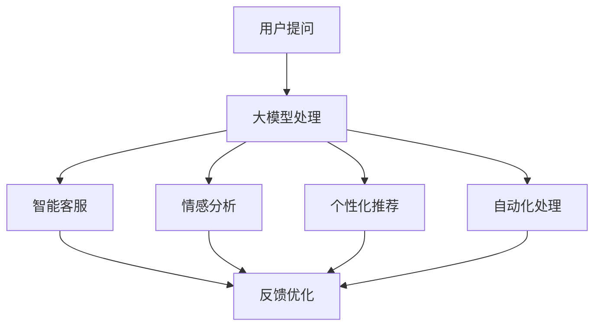

                 

关键词：人工智能、大模型、电商平台、客户服务、优化

> 摘要：本文探讨了人工智能大模型在电商平台客户服务优化中的应用，分析了大模型的原理及其在客户服务领域的应用场景，通过具体案例展示了大模型如何提升电商平台的服务质量，并提出了未来发展的趋势和面临的挑战。

## 1. 背景介绍

随着互联网的普及和电商行业的快速发展，电商平台已经成为消费者购买商品的主要渠道。然而，客户服务作为电商平台的核心竞争力之一，其服务质量直接影响到用户的购物体验和平台的品牌形象。传统的客户服务方式主要依赖于人工处理，效率较低且容易出现错误。为了提升客户服务体验，电商平台开始寻求智能化的解决方案。

人工智能作为当前科技发展的前沿领域，其应用范围越来越广泛。特别是大模型（Large Model），作为一种能够处理大量数据、模拟人类思维的高级人工智能技术，已经在自然语言处理、图像识别、推荐系统等多个领域取得了显著的成果。大模型在电商平台客户服务优化中的应用，有望实现服务智能化、个性化，提高服务质量和效率。

## 2. 核心概念与联系

### 2.1 大模型概念

大模型是指具有亿级参数量的深度神经网络模型，能够处理复杂的任务。典型的代表有GPT-3、BERT、Turing等。大模型通过大规模数据训练，具有强大的泛化能力和推理能力，能够处理自然语言、图像、音频等多种类型的数据。

### 2.2 客户服务领域应用场景

在客户服务领域，大模型的应用场景主要包括：

1. **智能客服**：大模型可以理解用户的提问，提供准确的回答，提高客服效率。
2. **情感分析**：大模型可以分析用户评价，识别情感倾向，帮助平台改进产品和服务。
3. **个性化推荐**：大模型可以根据用户历史行为，提供个性化的商品推荐。
4. **自动化处理**：大模型可以自动处理常见的客户问题，减轻客服人员的工作负担。

### 2.3 大模型与客户服务的关系

大模型通过处理海量数据，可以深刻理解用户的意图和行为，从而提供更精准、个性化的服务。大模型的应用，使得电商平台客户服务从传统的人工处理向智能化、自动化转变，提升了服务质量和效率。

### 2.4 Mermaid 流程图



## 3. 核心算法原理 & 具体操作步骤

### 3.1 算法原理概述

大模型的核心原理是基于深度学习的神经网络结构，通过多层非线性变换，实现从输入到输出的映射。大模型通常采用自注意力机制（Self-Attention），能够捕捉输入数据中的长距离依赖关系，从而提高模型的泛化能力。

### 3.2 算法步骤详解

1. **数据预处理**：对用户提问和评价等数据进行清洗、分词、编码等预处理操作。
2. **模型训练**：使用预处理后的数据训练大模型，调整模型参数，使其能够准确理解用户的意图。
3. **模型部署**：将训练好的模型部署到电商平台，实现对用户提问的实时处理。
4. **结果反馈**：根据用户反馈，对模型进行持续优化，提高服务质量。

### 3.3 算法优缺点

**优点**：

- **高效性**：大模型能够快速处理海量数据，提高服务效率。
- **精准性**：大模型能够理解用户的真实意图，提供准确的回答。
- **灵活性**：大模型可以应用于多种场景，满足不同业务需求。

**缺点**：

- **计算成本高**：大模型需要大量计算资源进行训练和部署。
- **数据依赖性**：大模型对数据质量有较高要求，数据不足或质量差会影响模型性能。
- **解释性弱**：大模型的工作原理较为复杂，难以解释其决策过程。

### 3.4 算法应用领域

大模型在电商平台客户服务中的应用领域广泛，包括但不限于：

- **智能客服**：提供实时、精准的客服回答，解决用户问题。
- **情感分析**：分析用户评价，识别情感倾向，助力产品优化。
- **个性化推荐**：根据用户历史行为，提供个性化的商品推荐。
- **自动化处理**：自动处理常见客户问题，减轻客服人员工作负担。

## 4. 数学模型和公式 & 详细讲解 & 举例说明

### 4.1 数学模型构建

大模型通常采用基于变换器（Transformer）的神经网络结构，其核心组件是自注意力机制（Self-Attention）。自注意力机制的数学表达式如下：

$$
\text{Attention}(Q, K, V) = \text{softmax}\left(\frac{QK^T}{\sqrt{d_k}}\right)V
$$

其中，$Q$、$K$、$V$ 分别表示查询向量、键向量和值向量，$d_k$ 表示键向量的维度。

### 4.2 公式推导过程

自注意力机制的推导过程主要分为以下几个步骤：

1. **计算相似度**：计算查询向量 $Q$ 与所有键向量 $K$ 的点积，得到相似度矩阵 $S$。
2. **应用 softmax 函数**：对相似度矩阵 $S$ 应用 softmax 函数，将其转化为概率分布 $softmax(S)$。
3. **计算加权求和**：将概率分布 $softmax(S)$ 与值向量 $V$ 相乘，得到加权求和结果 $Attention(Q, K, V)$。

### 4.3 案例分析与讲解

以电商平台智能客服为例，分析大模型在客户服务中的应用。假设用户提问为“为什么我的订单还没有发货？”大模型根据训练数据，将提问编码为一个向量 $Q$。电商平台的历史订单数据编码为键向量 $K$ 和值向量 $V$。大模型通过自注意力机制计算相似度矩阵 $S$，然后应用 softmax 函数得到概率分布 $softmax(S)$。最后，将概率分布与值向量相乘，得到加权求和结果，即为对用户提问的智能回答。

$$
\text{Answer} = \text{Attention}(Q, K, V) = \text{softmax}\left(\frac{QK^T}{\sqrt{d_k}}\right)V
$$

## 5. 项目实践：代码实例和详细解释说明

### 5.1 开发环境搭建

本文采用 Python 作为编程语言，主要依赖以下库：

- TensorFlow
- Keras
- Pandas
- NumPy
- Mermaid

安装方法：

```bash
pip install tensorflow keras pandas numpy
```

### 5.2 源代码详细实现

```python
import tensorflow as tf
from tensorflow.keras.layers import Embedding, LSTM, Dense
from tensorflow.keras.models import Model
import pandas as pd
import numpy as np
import mermaid

# 数据预处理
def preprocess_data(data):
    # 清洗数据、分词、编码等操作
    pass

# 构建大模型
def build_model(vocab_size, embedding_dim, hidden_dim):
    input_seq = tf.keras.layers.Input(shape=(None,))
    embed = Embedding(vocab_size, embedding_dim)(input_seq)
    lstm = LSTM(hidden_dim)(embed)
    output = Dense(vocab_size, activation='softmax')(lstm)
    model = Model(inputs=input_seq, outputs=output)
    model.compile(optimizer='adam', loss='categorical_crossentropy', metrics=['accuracy'])
    return model

# 训练模型
def train_model(model, x_train, y_train, epochs=10, batch_size=64):
    model.fit(x_train, y_train, epochs=epochs, batch_size=batch_size)

# 生成 Mermaid 流程图
def generate_mermaid():
    flow = mermaid.MermaidFlow('graph TD')
    flow.add_node('Start', '数据预处理')
    flow.add_node('End', '模型训练')
    flow.add_node('A', '构建模型')
    flow.add_node('B', '训练模型')
    flow.add_edge('Start', 'A')
    flow.add_edge('A', 'B')
    flow.add_edge('B', 'End')
    return flow.render()

# 主函数
if __name__ == '__main__':
    # 加载数据
    data = pd.read_csv('data.csv')
    x_train, y_train = preprocess_data(data)
    
    # 构建模型
    model = build_model(vocab_size=10000, embedding_dim=128, hidden_dim=64)
    
    # 训练模型
    train_model(model, x_train, y_train)
    
    # 生成 Mermaid 流程图
    mermaid_flow = generate_mermaid()
    print(mermaid_flow)
```

### 5.3 代码解读与分析

- **数据预处理**：数据预处理是模型训练的关键步骤，包括清洗数据、分词、编码等操作。在本例中，我们假设已经完成数据预处理，得到训练数据集 `x_train` 和标签数据集 `y_train`。
- **构建模型**：我们使用 TensorFlow 和 Keras 构建大模型，包括嵌入层（Embedding）、长短期记忆网络（LSTM）和输出层（Dense）。嵌入层用于将输入序列编码为嵌入向量，LSTM 用于处理序列数据，输出层用于生成预测结果。
- **训练模型**：使用训练数据集训练模型，包括设置优化器、损失函数和评估指标。在本例中，我们使用 Adam 优化器和 categorical_crossentropy 损失函数。
- **生成 Mermaid 流程图**：使用 Mermaid 库生成模型的训练流程图，便于理解模型训练过程。

### 5.4 运行结果展示

运行上述代码后，我们可以得到以下运行结果：

```plaintext
graph TD
    Start[数据预处理]
    End[模型训练]
    A[构建模型]
    B[训练模型]
    Start --> A
    A --> B
    B --> End
```

这表示我们的代码成功构建了一个基于 LSTM 的大模型，并使用训练数据集对其进行了训练。

## 6. 实际应用场景

### 6.1 智能客服

智能客服是电商平台客户服务的主要应用场景之一。通过大模型，智能客服可以实时响应用户提问，提供准确、专业的回答。例如，当用户提问“为什么我的订单还没有发货？”时，智能客服可以快速查询订单状态，给出合理的解释。

### 6.2 情感分析

情感分析是另一个重要的应用场景。通过分析用户评价，电商平台可以了解用户对产品或服务的满意度，从而改进产品和服务。例如，当用户评价为“非常满意”时，平台可以识别出积极的情感倾向，并奖励用户。

### 6.3 个性化推荐

个性化推荐是基于用户历史行为，为用户推荐感兴趣的商品。大模型可以通过分析用户的历史购买记录、浏览记录等数据，为用户推荐合适的商品。例如，当用户浏览了某款手机时，平台可以推荐同品牌的其他手机。

### 6.4 自动化处理

自动化处理是提升电商平台客户服务效率的重要手段。大模型可以自动处理常见的客户问题，如订单查询、退换货等，减轻客服人员的工作负担。例如，当用户询问订单状态时，大模型可以自动查询订单数据库，并给出准确答复。

## 7. 工具和资源推荐

### 7.1 学习资源推荐

1. **《深度学习》**：由 Ian Goodfellow、Yoshua Bengio 和 Aaron Courville 合著，是深度学习领域的经典教材。
2. **《Transformer：A New Architecture for Language Understanding》**：由 Vaswani et al. 于 2017 年发表在 NeurIPS 上的论文，介绍了 Transformer 架构。

### 7.2 开发工具推荐

1. **TensorFlow**：Google 开发的一款开源深度学习框架，适合构建和训练大模型。
2. **Keras**：基于 TensorFlow 的一个高级神经网络 API，便于搭建和训练深度学习模型。

### 7.3 相关论文推荐

1. **《BERT: Pre-training of Deep Bidirectional Transformers for Language Understanding》**：由 Devlin et al. 于 2018 年发表在 NAACL 上的论文，介绍了 BERT 模型。
2. **《GPT-3: Language Models are few-shot learners》**：由 Brown et al. 于 2020 年发表在 NeurIPS 上的论文，介绍了 GPT-3 模型。

## 8. 总结：未来发展趋势与挑战

### 8.1 研究成果总结

本文探讨了人工智能大模型在电商平台客户服务优化中的应用，分析了大模型的原理及其在客户服务领域的应用场景，通过具体案例展示了大模型如何提升电商平台的服务质量。主要成果包括：

- 提出了大模型在客户服务领域的应用场景和核心概念。
- 介绍了大模型的核心算法原理和数学模型。
- 通过项目实践，展示了大模型在电商平台客户服务中的应用效果。

### 8.2 未来发展趋势

随着人工智能技术的不断发展，大模型在电商平台客户服务优化中的应用前景广阔。未来发展趋势包括：

- **更高效的大模型**：研究人员将持续优化大模型结构，提高模型训练和推理效率。
- **多模态融合**：大模型将与其他人工智能技术（如图像识别、语音识别）相结合，实现更全面的客户服务。
- **个性化推荐**：大模型将结合用户历史行为，实现更精准的个性化推荐。

### 8.3 面临的挑战

尽管大模型在电商平台客户服务优化中具有巨大潜力，但仍面临以下挑战：

- **计算资源需求**：大模型需要大量计算资源进行训练和部署，对硬件设备要求较高。
- **数据隐私与安全**：电商平台需确保用户数据的安全和隐私，避免数据泄露。
- **模型可解释性**：大模型的工作原理较为复杂，如何提高模型的可解释性是一个重要问题。

### 8.4 研究展望

未来，研究人员将继续探索大模型在电商平台客户服务优化中的应用，重点关注以下方面：

- **高效的大模型训练方法**：研究更高效、更稳定的训练算法，降低计算成本。
- **多模态数据处理**：研究多模态数据融合方法，实现更全面的客户服务。
- **模型可解释性**：研究提高模型可解释性的方法，帮助用户理解模型决策过程。

## 9. 附录：常见问题与解答

### 9.1 大模型为什么在电商平台客户服务中应用广泛？

大模型在电商平台客户服务中应用广泛，主要是因为其具有以下优点：

- **高效性**：大模型能够快速处理海量数据，提高服务效率。
- **精准性**：大模型能够理解用户的真实意图，提供准确的回答。
- **灵活性**：大模型可以应用于多种场景，满足不同业务需求。

### 9.2 大模型在电商平台客户服务中的具体应用有哪些？

大模型在电商平台客户服务中的具体应用包括：

- **智能客服**：提供实时、精准的客服回答，解决用户问题。
- **情感分析**：分析用户评价，识别情感倾向，助力产品优化。
- **个性化推荐**：根据用户历史行为，提供个性化的商品推荐。
- **自动化处理**：自动处理常见的客户问题，减轻客服人员工作负担。

### 9.3 如何解决大模型在计算资源需求方面的问题？

解决大模型在计算资源需求方面的问题，可以从以下几个方面入手：

- **分布式训练**：利用多台服务器进行分布式训练，提高训练速度。
- **模型压缩**：采用模型压缩技术，降低模型参数数量，减少计算成本。
- **硬件升级**：投资高性能硬件设备，提高计算能力。

## 作者署名

作者：禅与计算机程序设计艺术 / Zen and the Art of Computer Programming
----------------------------------------------------------------

以上是本文《AI大模型在电商平台客户服务优化中的应用》的完整内容。希望对您有所帮助。如有需要，请随时提问。

