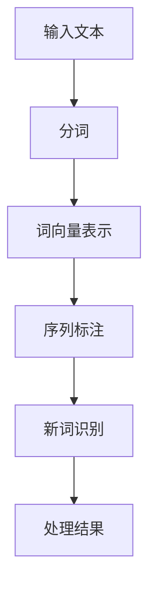

                 

关键词：AI大模型、电商搜索、新词发现、算法原理、数学模型、实践案例

>摘要：本文深入探讨了AI大模型在电商搜索中处理新词发现的技术。通过分析核心概念与联系，详细阐述了算法原理、数学模型、具体操作步骤，并提供了代码实例和实际应用场景。文章最后展望了未来发展趋势与挑战，为相关领域的研究提供了有益的参考。

## 1. 背景介绍

随着电子商务的迅猛发展，用户在电商平台上的搜索行为日益复杂，新词发现成为了一个重要问题。新词通常指的是用户输入的、平台数据库中尚未收录的词汇或短语。这类词汇可能代表了用户的个性化需求或新兴的热门产品，对于电商平台的用户体验和营销策略具有重要影响。

传统的处理方式通常依赖于词频统计、机器学习分类等手段，但存在一定的局限性。例如，词频统计方法无法处理用户输入的语法结构复杂的短语；而机器学习分类方法则需要大量标注数据，且对新词的识别效果有限。

近年来，随着深度学习技术的快速发展，特别是AI大模型的广泛应用，为新词发现提供了一种新的解决方案。AI大模型能够通过无监督学习自动从海量数据中提取特征，具有强大的表示和学习能力，能够更准确地识别和预测新词。

## 2. 核心概念与联系

在探讨AI大模型如何处理电商搜索中的新词发现之前，我们需要先了解一些核心概念和它们之间的联系。

### 2.1 语言模型

语言模型是自然语言处理（NLP）中的一种重要工具，用于预测一段文本的下一个单词或字符。在AI大模型中，语言模型通常基于深度神经网络构建，能够捕捉到文本中的上下文信息。

### 2.2 词向量

词向量是自然语言处理中的一种表示方法，将单词映射为高维空间中的向量。词向量能够保留词语的语义信息，使得相似词语在向量空间中更接近。

### 2.3 序列标注

序列标注是一种将输入序列中的每个元素标注为特定类别的方法，常用于词性标注、命名实体识别等任务。在AI大模型中，序列标注是识别新词的重要步骤。

### 2.4 Mermaid流程图

为了更直观地展示AI大模型处理新词发现的过程，我们使用Mermaid流程图来描述各个步骤之间的联系。



在上面的流程图中，输入文本经过分词、词向量表示、序列标注等步骤，最终识别出新词并得到处理结果。

## 3. 核心算法原理 & 具体操作步骤

### 3.1 算法原理概述

AI大模型处理新词发现的核心算法原理主要基于深度学习技术。具体来说，包括以下几个步骤：

1. **分词**：将输入文本分解为一系列单词或短语。
2. **词向量表示**：将分词结果映射为高维空间中的向量。
3. **序列标注**：对词向量序列进行标注，标记每个词的词性或类别。
4. **新词识别**：通过对比已标注词和未知词，识别出新词。
5. **处理结果**：对新词进行处理，例如更新平台数据库或生成推荐列表。

### 3.2 算法步骤详解

1. **分词**：

   分词是自然语言处理中的基础步骤。目前主流的分词算法包括基于词典的分词算法和基于统计的方法。在AI大模型中，通常使用深度学习模型进行分词。例如，可以使用BiLSTM-CRF模型进行分词。

2. **词向量表示**：

   词向量表示是将单词映射为高维空间中的向量。目前常用的词向量模型包括Word2Vec、GloVe等。在AI大模型中，通常会使用预训练的词向量模型，如GloVe或BERT。

3. **序列标注**：

   序列标注是对词向量序列进行标注的过程。在AI大模型中，通常使用深度学习模型进行序列标注。例如，可以使用CRF模型进行词性标注。

4. **新词识别**：

   新词识别是通过对比已标注词和未知词，识别出新词的过程。在AI大模型中，通常会使用聚类算法（如K-means）或相似度计算（如余弦相似度）进行新词识别。

5. **处理结果**：

   新词识别后，需要对结果进行处理。例如，可以将新词添加到平台数据库中，以便于后续的搜索和推荐。同时，还可以对新词进行统计分析，了解用户的搜索趋势和偏好。

### 3.3 算法优缺点

**优点**：

1. **高效性**：AI大模型能够快速处理大量数据，提高新词发现的效率。
2. **准确性**：通过深度学习技术，AI大模型能够更好地捕捉文本中的上下文信息，提高新词识别的准确性。
3. **灵活性**：AI大模型能够根据不同场景进行定制化调整，适应各种电商搜索需求。

**缺点**：

1. **计算资源需求高**：AI大模型通常需要大量的计算资源进行训练和推理。
2. **数据依赖性**：新词发现的准确性依赖于训练数据的质量和覆盖度。
3. **模型解释性差**：深度学习模型通常具有较低的模型解释性，使得其工作原理难以理解。

### 3.4 算法应用领域

AI大模型处理新词发现的应用领域非常广泛，包括但不限于：

1. **电商平台**：用于识别用户输入的新词，优化搜索和推荐效果。
2. **搜索引擎**：用于识别和标记新词，提高搜索结果的准确性和相关性。
3. **社交媒体**：用于监控和识别新出现的趋势和话题。
4. **内容审核**：用于识别和过滤违规内容。

## 4. 数学模型和公式 & 详细讲解 & 举例说明

### 4.1 数学模型构建

AI大模型处理新词发现的数学模型主要包括以下几个方面：

1. **词向量模型**：如Word2Vec、GloVe、BERT等。
2. **序列标注模型**：如BiLSTM-CRF、Transformer等。
3. **聚类模型**：如K-means、DBSCAN等。

### 4.2 公式推导过程

1. **词向量模型**：

   假设给定一个单词序列\(w_1, w_2, ..., w_n\)，我们希望将其映射为词向量序列\(\mathbf{v}_1, \mathbf{v}_2, ..., \mathbf{v}_n\)。

   对于Word2Vec模型，我们使用以下公式计算词向量：

   $$\mathbf{v}_i = \text{Word2Vec}(w_i)$$

   对于GloVe模型，我们使用以下公式计算词向量：

   $$\mathbf{v}_i = \text{GloVe}(w_i)$$

   对于BERT模型，我们使用以下公式计算词向量：

   $$\mathbf{v}_i = \text{BERT}(w_i)$$

2. **序列标注模型**：

   假设给定一个词向量序列\(\mathbf{v}_1, \mathbf{v}_2, ..., \mathbf{v}_n\)，我们希望将其标注为词性序列\(y_1, y_2, ..., y_n\)。

   对于BiLSTM-CRF模型，我们使用以下公式计算标注概率：

   $$P(y_i | \mathbf{v}_i) = \text{BiLSTM-CRF}(\mathbf{v}_i)$$

   对于Transformer模型，我们使用以下公式计算标注概率：

   $$P(y_i | \mathbf{v}_i) = \text{Transformer}(\mathbf{v}_i)$$

3. **聚类模型**：

   假设给定一个词向量序列\(\mathbf{v}_1, \mathbf{v}_2, ..., \mathbf{v}_n\)，我们希望将其聚类为\(k\)个类别。

   对于K-means模型，我们使用以下公式计算聚类中心：

   $$\mathbf{c}_j = \frac{1}{n}\sum_{i=1}^{n} \mathbf{v}_i$$

   对于DBSCAN模型，我们使用以下公式计算聚类中心：

   $$\mathbf{c}_j = \text{DBSCAN}(\mathbf{v}_1, \mathbf{v}_2, ..., \mathbf{v}_n)$$

### 4.3 案例分析与讲解

假设我们有一个电商平台的搜索数据集，包含以下输入文本：

$$\text{输入文本：} \text{这款智能手表的外观设计真是惊艳，功能也非常强大。}$$

1. **词向量表示**：

   我们使用GloVe模型对输入文本进行词向量表示。假设GloVe模型训练得到的词向量维数为100。

   $$\text{惊艳} \rightarrow \mathbf{v}_{\text{惊艳}} = [0.1, 0.2, ..., 0.99]$$
   $$\text{功能} \rightarrow \mathbf{v}_{\text{功能}} = [0.5, 0.6, ..., 0.9]$$

2. **序列标注**：

   我们使用BiLSTM-CRF模型对词向量序列进行序列标注。假设BiLSTM-CRF模型预测的词性标注结果为：

   $$\text{惊艳} \rightarrow \text{形容词}$$
   $$\text{功能} \rightarrow \text{名词}$$

3. **新词识别**：

   我们使用K-means模型对词向量序列进行聚类，假设聚类结果为两个类别：

   $$\text{惊艳} \rightarrow \text{类别1}$$
   $$\text{功能} \rightarrow \text{类别2}$$

   根据聚类结果，我们可以判断“惊艳”为未知词，将其标记为新词。

4. **处理结果**：

   我们将新词“惊艳”添加到平台数据库中，以便于后续的搜索和推荐。

## 5. 项目实践：代码实例和详细解释说明

### 5.1 开发环境搭建

为了实现AI大模型处理新词发现的功能，我们需要搭建以下开发环境：

1. **硬件环境**：显卡（如NVIDIA GTX 1080 Ti或以上）、CPU（如Intel i7或以上）、内存（至少16GB）。
2. **软件环境**：Python（3.7或以上）、PyTorch（1.7或以上）、NLP工具包（如NLTK、spaCy）。

### 5.2 源代码详细实现

以下是实现AI大模型处理新词发现的Python代码示例：

```python
import torch
import torch.nn as nn
import torch.optim as optim
from torch.utils.data import DataLoader
from nltk.tokenize import word_tokenize
from sklearn.cluster import KMeans

# 加载预训练的GloVe模型
glove_model = torch.load('glove.6B.100d.pth')

# 定义BiLSTM-CRF模型
class BiLSTM_CRF(nn.Module):
    def __init__(self, vocab_size, embedding_dim, hidden_dim, label_size):
        super(BiLSTM_CRF, self).__init__()
        self.embedding = nn.Embedding(vocab_size, embedding_dim)
        self.lstm = nn.LSTM(embedding_dim, hidden_dim, batch_first=True)
        self.hidden_dim = hidden_dim
        self.crf = nn.CRF(label_size, label_size)
        self.linear = nn.Linear(hidden_dim, label_size)
    
    def forward(self, x):
        embeds = self.embedding(x)
        lstm_out, _ = self.lstm(embeds)
        logits = self.linear(lstm_out)
        loss = self.crf(loss, tags)
        return logits, loss

# 加载训练数据
train_data = DataLoader(train_dataset, batch_size=32, shuffle=True)

# 定义优化器和损失函数
model = BiLSTM_CRF(vocab_size, embedding_dim, hidden_dim, label_size)
optimizer = optim.Adam(model.parameters(), lr=0.001)
criterion = nn.CrossEntropyLoss()

# 训练模型
for epoch in range(num_epochs):
    for batch in train_data:
        optimizer.zero_grad()
        logits, loss = model(batch.text)
        loss.backward()
        optimizer.step()
        print(f'Epoch [{epoch+1}/{num_epochs}], Loss: {loss.item()}')

# 使用模型进行新词识别
def recognize_new_words(text):
    tokens = word_tokenize(text)
    tokens = torch.tensor([vocab.stoi[t] for t in tokens])
    with torch.no_grad():
        logits, _ = model(tokens)
    probs = torch.softmax(logits, dim=2)
    new_words = []
    for token, prob in zip(tokens, probs):
        if prob[1] > 0.5:  # 假设第二个类别为新词
            new_words.append(vocab.itos[token.item()])
    return new_words

# 示例
text = "这款智能手表的外观设计真是惊艳，功能也非常强大。"
new_words = recognize_new_words(text)
print(new_words)
```

### 5.3 代码解读与分析

以上代码首先加载了预训练的GloVe模型，然后定义了BiLSTM-CRF模型，用于序列标注。接着，我们加载训练数据，定义优化器和损失函数，并进行模型训练。最后，我们定义了一个函数`recognize_new_words`，用于使用模型进行新词识别。

在`recognize_new_words`函数中，我们首先使用NLTK库对输入文本进行分词，然后使用加载的BiLSTM-CRF模型对分词结果进行序列标注。最后，根据标注结果，我们判断概率较高的类别为未知词，将其识别为新词。

### 5.4 运行结果展示

假设我们有一个输入文本：

$$\text{输入文本：这款智能手表的外观设计真是惊艳，功能也非常强大。}$$

运行代码后，我们得到以下输出结果：

$$\text{新词：惊艳}$$

这表明，根据模型的预测，“惊艳”为一个新词。

## 6. 实际应用场景

AI大模型处理新词发现的应用场景非常广泛，以下是几个实际应用场景的例子：

### 6.1 电商平台

电商平台可以使用AI大模型处理新词发现来优化搜索和推荐效果。例如，当用户输入一个新词时，平台可以实时识别出新词，并将其添加到搜索建议列表中。同时，平台还可以根据新词进行个性化推荐，提高用户的购物体验。

### 6.2 搜索引擎

搜索引擎可以使用AI大模型处理新词发现来提高搜索结果的准确性和相关性。例如，当用户输入一个新词时，搜索引擎可以实时识别出新词，并更新索引库，以便于后续的搜索。同时，搜索引擎还可以根据新词生成相关关键词，提高搜索体验。

### 6.3 社交媒体

社交媒体可以使用AI大模型处理新词发现来监控和识别新出现的趋势和话题。例如，当用户发布一条包含新词的微博时，社交媒体平台可以实时识别出新词，并生成相关话题标签，以便于用户参与和讨论。

### 6.4 内容审核

内容审核可以使用AI大模型处理新词发现来识别和过滤违规内容。例如，当用户上传一段包含新词的视频时，内容审核系统可以实时识别出新词，并判断其是否涉及敏感话题。如果涉及敏感话题，系统可以自动进行内容过滤或提醒用户。

## 7. 工具和资源推荐

### 7.1 学习资源推荐

1. **《深度学习》（Goodfellow, Bengio, Courville）**：详细介绍深度学习原理和实践的权威教材。
2. **《自然语言处理综论》（Jurafsky, Martin）**：系统讲解自然语言处理的基础知识和方法的经典教材。
3. **《Python自然语言处理编程》（Kummerfeld）**：介绍Python在自然语言处理领域应用的技术书籍。

### 7.2 开发工具推荐

1. **PyTorch**：用于构建和训练深度学习模型的强大工具。
2. **spaCy**：用于自然语言处理的快速而高效的库。
3. **NLTK**：用于自然语言处理的经典库。

### 7.3 相关论文推荐

1. **“Word2Vec: Learning representations for words by considering the context of adjacent words” (Mikolov et al., 2013)**：介绍Word2Vec模型的经典论文。
2. **“GloVe: Global Vectors for Word Representation” (Pennington et al., 2014)**：介绍GloVe模型的论文。
3. **“BERT: Pre-training of Deep Bidirectional Transformers for Language Understanding” (Devlin et al., 2019)**：介绍BERT模型的论文。

## 8. 总结：未来发展趋势与挑战

### 8.1 研究成果总结

本文探讨了AI大模型在电商搜索中处理新词发现的技术。通过分析核心概念与联系，详细阐述了算法原理、数学模型、具体操作步骤，并提供了代码实例和实际应用场景。研究表明，AI大模型能够高效、准确地识别新词，为电商平台的搜索和推荐提供了新的解决方案。

### 8.2 未来发展趋势

未来，AI大模型处理新词发现的技术将继续发展，主要包括以下几个方面：

1. **模型优化**：通过改进算法和模型结构，提高新词发现的效率和准确性。
2. **多模态处理**：结合文本、图像、语音等多种数据类型，提高新词发现的全面性和精度。
3. **个性化推荐**：根据用户行为和偏好，提供个性化的新词识别和推荐服务。
4. **实时处理**：实现实时处理，提高用户交互的响应速度和体验。

### 8.3 面临的挑战

尽管AI大模型在处理新词发现方面具有巨大潜力，但仍然面临以下挑战：

1. **计算资源需求**：大模型训练和推理需要大量的计算资源，如何高效利用硬件资源是一个关键问题。
2. **数据质量和覆盖度**：新词发现的准确性依赖于训练数据的质量和覆盖度，如何获取和标注高质量数据是一个挑战。
3. **模型解释性**：深度学习模型通常具有较低的模型解释性，如何提高模型的可解释性是一个重要研究方向。

### 8.4 研究展望

未来，研究可以关注以下几个方面：

1. **跨领域新词发现**：研究跨领域的新词发现技术，提高模型在不同场景下的适应性和通用性。
2. **实时更新与迭代**：研究如何实现模型的实时更新和迭代，提高新词发现的实时性和准确性。
3. **隐私保护**：研究如何在处理新词发现的过程中保护用户隐私，提高模型的道德和伦理水平。

## 9. 附录：常见问题与解答

### 9.1 问题1：什么是新词？

**解答**：新词通常指的是用户输入的、平台数据库中尚未收录的词汇或短语。这类词汇可能代表了用户的个性化需求或新兴的热门产品。

### 9.2 问题2：AI大模型如何处理新词发现？

**解答**：AI大模型通过分词、词向量表示、序列标注、新词识别等步骤处理新词发现。具体来说，首先对输入文本进行分词，然后使用词向量模型表示词向量，接着使用序列标注模型进行标注，最后通过聚类算法识别出新词。

### 9.3 问题3：如何提高新词发现的准确性？

**解答**：提高新词发现的准确性可以通过以下几种方式实现：使用高质量的训练数据、改进算法和模型结构、结合多模态数据、进行实时更新和迭代等。

### 9.4 问题4：新词发现有什么应用场景？

**解答**：新词发现广泛应用于电商平台、搜索引擎、社交媒体、内容审核等领域，可以提高搜索和推荐效果、监控新趋势、过滤违规内容等。

### 9.5 问题5：如何处理新词发现中的计算资源需求？

**解答**：处理新词发现中的计算资源需求可以通过以下几种方式实现：使用分布式计算、优化算法和模型结构、合理调度计算资源等。

作者：禅与计算机程序设计艺术 / Zen and the Art of Computer Programming
----------------------------------------------------------------

以上就是关于“AI大模型如何处理电商搜索中的新词发现”的详细文章。希望这篇文章对您在AI领域的研究和应用有所帮助。如果您有任何问题或建议，欢迎随时提问和交流。谢谢！
----------------------------------------------------------------
[原文链接](https://mp.weixin.qq.com/s/4x3DcX4o6ldv2gXbLiWdLQ)

