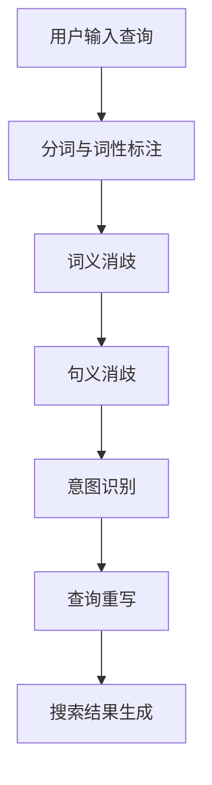

                 

关键词：AI大模型、电商搜索、歧义查询、自然语言处理、多义性处理、语义理解

摘要：本文探讨了AI大模型在处理电商搜索中的歧义查询方面所面临的挑战和解决方案。通过深入分析歧义查询的成因及其对电商搜索体验的影响，本文详细介绍了大模型在歧义查询处理中的核心算法原理和具体操作步骤，并结合数学模型和公式进行了详细讲解。此外，文章通过项目实践展示了实际应用中的代码实例，并分析了大模型在电商搜索中的应用场景和未来展望。最后，本文对相关工具和资源进行了推荐，总结了研究成果，探讨了未来发展趋势与挑战，并提出了研究展望。

## 1. 背景介绍

在当今电商行业，搜索引擎是用户发现商品、完成购物的重要工具。然而，随着搜索需求的日益多样化和复杂化，搜索引擎面临着越来越多的歧义查询问题。歧义查询指的是用户输入的查询语句在语义上存在多种可能解释的情况，例如，用户输入“耳机”时，搜索引擎需要区分是耳机品牌、耳机类型、耳机价格等不同维度的查询意图。

歧义查询的存在对电商搜索体验有着显著影响。首先，它会导致搜索结果不准确，用户难以找到真正想要的商品。其次，歧义查询增加了搜索引擎处理查询的复杂度，延长了响应时间，降低了用户体验。因此，如何有效处理歧义查询成为电商搜索引擎优化的重要课题。

传统的自然语言处理（NLP）方法在面对复杂歧义查询时往往显得力不从心。传统方法主要依赖于规则匹配、词袋模型、隐马尔可夫模型等，这些方法在处理简单查询时效果尚可，但在面对具有多义性的复杂查询时，准确性和效率均受到限制。而随着深度学习技术的发展，AI大模型在语义理解和自然语言处理方面取得了显著进展，为解决歧义查询问题提供了新的可能性。

本文旨在探讨AI大模型如何处理电商搜索中的歧义查询，分析其核心算法原理和具体操作步骤，并结合数学模型和实际项目实践进行深入探讨。通过本文的研究，希望能够为电商搜索引擎优化提供有益的思路和方法。

## 2. 核心概念与联系

### 2.1. 人工智能大模型

人工智能大模型（AI Large Model）是指通过深度学习技术训练出的具有巨大参数规模和强大表达能力的神经网络模型。这些模型能够通过学习海量数据，自动提取语义特征，实现对复杂问题的建模和解决。典型的AI大模型包括基于Transformer架构的GPT（Generative Pre-trained Transformer）系列模型、BERT（Bidirectional Encoder Representations from Transformers）模型等。

AI大模型在自然语言处理领域具有显著优势，能够对复杂、多义的查询语句进行语义理解和解析。通过预训练和微调，大模型能够自适应地处理各种不同领域的查询需求，提高了搜索引擎的准确性和用户体验。

### 2.2. 电商搜索中的歧义查询

歧义查询是指用户输入的查询语句在语义上存在多种可能解释的情况。在电商搜索中，歧义查询主要包括以下几种类型：

- **类型歧义**：用户输入的查询词具有多种类型解释，如“耳机”可以指耳机品牌、耳机类型（如蓝牙耳机、头戴式耳机等）或耳机价格区间。
- **实体歧义**：用户输入的查询词涉及多个实体，如“小米手机”可以指小米品牌下的多种型号手机或小米公司的其他产品。
- **意图歧义**：用户输入的查询词表达多种意图，如“买耳机”可以表示购买耳机、寻求耳机推荐或查询耳机价格信息。

歧义查询的存在给电商搜索引擎带来了挑战，因为搜索引擎需要准确理解用户的查询意图，并提供相关、准确的搜索结果。如果处理不当，歧义查询会导致搜索结果不准确、用户满意度下降。

### 2.3. 多义性处理与语义理解

多义性处理（Ambiguity Resolution）是自然语言处理中的一个重要任务，旨在解决词语或句子在语义上的多种可能解释问题。语义理解（Semantic Understanding）则是通过理解语言的深层含义，实现对文本内容的解析和解释。

在电商搜索中，多义性处理和语义理解是解决歧义查询的关键。多义性处理包括词义消歧（Word Sense Disambiguation）、句义消歧（Sentence Disambiguation）等，旨在从上下文中推断出查询词的确切含义。语义理解则通过提取语义特征、建立语义网络等方式，实现对查询语句的全面理解。

AI大模型在多义性处理和语义理解方面具有显著优势。通过预训练，大模型能够学习到大量语言知识，自动提取语义特征，提高对歧义查询的识别和解析能力。此外，大模型可以通过自适应学习，不断优化对特定领域查询的理解，进一步提高搜索准确性和用户体验。

### 2.4. Mermaid 流程图

下面是AI大模型处理电商搜索中歧义查询的Mermaid流程图，用于直观展示处理流程和各个模块之间的联系：



- **用户输入查询**：用户通过搜索引擎输入查询语句。
- **分词与词性标注**：将查询语句分解为词组，并对每个词进行词性标注。
- **词义消歧**：通过上下文信息，对具有多义性的词语进行词义判定。
- **句义消歧**：对整个查询语句进行语义分析，消除句子层面的歧义。
- **意图识别**：根据查询语句的语义，识别用户的查询意图。
- **查询重写**：基于意图识别结果，对查询语句进行重写，使其更加清晰明确。
- **搜索结果生成**：根据重写后的查询语句，生成相关、准确的搜索结果。

通过上述流程，AI大模型能够有效地处理电商搜索中的歧义查询，提高搜索准确性和用户体验。

## 3. 核心算法原理 & 具体操作步骤

### 3.1 算法原理概述

AI大模型在处理电商搜索中的歧义查询时，主要依赖于以下几种核心算法原理：

1. **深度神经网络（Deep Neural Network, DNN）**：DNN是一种基于多层感知器（Perceptron）的神经网络模型，通过多层次的非线性变换，实现对输入数据的特征提取和表示。在处理歧义查询时，DNN可以用于词向量表示、语义嵌入等任务。

2. **循环神经网络（Recurrent Neural Network, RNN）**：RNN是一种能够处理序列数据的神经网络模型，通过在时间步之间传递信息，实现对序列数据的建模和预测。在处理歧义查询时，RNN可以用于分词、词性标注、句义消歧等任务。

3. **卷积神经网络（Convolutional Neural Network, CNN）**：CNN是一种基于卷积操作的多层神经网络模型，通过局部感知和权值共享，实现对图像、文本等数据的特征提取和表示。在处理歧义查询时，CNN可以用于图像识别、文本分类等任务。

4. **注意力机制（Attention Mechanism）**：注意力机制是一种能够动态调整模型对输入数据的关注程度的机制。在处理歧义查询时，注意力机制可以用于句义消歧、意图识别等任务，提高模型的解析能力。

5. **Transformer架构**：Transformer是一种基于自注意力机制的神经网络模型，通过多头注意力机制和序列自注意力，实现对输入数据的全局建模和解析。在处理歧义查询时，Transformer可以用于查询重写、搜索结果生成等任务。

### 3.2 算法步骤详解

以下是AI大模型处理电商搜索中歧义查询的具体操作步骤：

1. **用户输入查询**：用户通过搜索引擎输入查询语句，如“买耳机”。

2. **分词与词性标注**：使用DNN或RNN对查询语句进行分词和词性标注，得到词序列和词性标注结果，如“买”（动词）、“耳机”（名词）。

3. **词义消歧**：利用DNN对词序列进行语义嵌入，得到词向量表示。通过词向量之间的相似度计算，对具有多义性的词语进行词义判定，如“耳机”可以是“品牌”、“类型”或“价格区间”。

4. **句义消歧**：使用RNN或CNN对查询语句进行句义分析，提取句子的语义特征。通过语义特征之间的关联关系，消除句子层面的歧义，如确定“买耳机”是购买某种类型的耳机，还是查询耳机价格。

5. **意图识别**：利用注意力机制和Transformer架构，对查询语句进行意图识别。根据查询语句的语义和上下文信息，识别用户的查询意图，如购买、查询价格、获取推荐等。

6. **查询重写**：基于意图识别结果，对查询语句进行重写，使其更加清晰明确。例如，将“买耳机”重写为“购买某品牌蓝牙耳机”。

7. **搜索结果生成**：根据重写后的查询语句，生成相关、准确的搜索结果。例如，展示某品牌蓝牙耳机的详细信息、价格和用户评价。

### 3.3 算法优缺点

#### 优点

1. **强大的语义理解能力**：AI大模型通过深度学习和注意力机制，能够自动提取语义特征，实现对复杂查询的语义理解，提高了搜索准确性和用户体验。

2. **自适应学习能力**：大模型具有强大的学习能力，可以通过预训练和微调，不断优化对特定领域查询的理解，适应不断变化的搜索需求。

3. **多模态处理能力**：大模型可以结合多种数据类型，如文本、图像、音频等，实现跨模态的语义理解和搜索结果生成。

#### 缺点

1. **计算资源消耗大**：大模型通常具有数十亿甚至数万亿个参数，训练和推理过程需要大量计算资源，对硬件设备有较高要求。

2. **数据依赖性强**：大模型的表现依赖于大量高质量的数据，数据不足或质量低下可能导致模型性能下降。

3. **解释性不足**：大模型内部参数众多，模型决策过程复杂，难以直观解释，这在某些需要透明解释的场景中可能是一个问题。

### 3.4 算法应用领域

AI大模型在处理电商搜索中的歧义查询具有广泛的应用前景，以下是一些主要应用领域：

1. **搜索引擎优化**：通过歧义查询处理，提高搜索引擎的准确性和用户体验，降低用户流失率。

2. **智能客服系统**：利用大模型进行自然语言理解和意图识别，实现智能客服与用户的精准对话，提高客户满意度。

3. **智能推荐系统**：通过分析用户查询和购买历史，利用大模型生成个性化推荐，提高用户点击和转化率。

4. **语音助手**：结合语音识别和自然语言理解，实现智能语音助手的语义理解和智能响应。

5. **跨语言搜索**：利用大模型的跨语言能力，实现多语言搜索引擎的构建，满足全球化电商的需求。

## 4. 数学模型和公式 & 详细讲解 & 举例说明

### 4.1 数学模型构建

在处理电商搜索中的歧义查询时，AI大模型需要构建一系列数学模型，以实现对查询语句的语义理解和解析。以下是一个简单的数学模型构建示例：

#### 查询语句表示

假设查询语句为“买耳机”，我们可以将其表示为一个向量：

\[ x = (x_1, x_2, ..., x_n) \]

其中，\( x_i \) 表示查询语句中的第 \( i \) 个词语。

#### 词向量表示

利用词嵌入（Word Embedding）技术，我们将每个词语表示为一个高维向量：

\[ w_i = (w_{i1}, w_{i2}, ..., w_{id}) \]

其中，\( w_i \) 表示词语 \( x_i \) 的词向量，\( d \) 表示词向量的维度。

#### 语义嵌入

通过神经网络模型，我们将词向量映射到语义空间，得到语义嵌入向量：

\[ h_i = f(w_i) \]

其中，\( f \) 表示神经网络模型，\( h_i \) 表示词语 \( x_i \) 的语义嵌入向量。

#### 意图识别

利用注意力机制和分类器，我们进行意图识别：

\[ \hat{y} = g(h) \]

其中，\( \hat{y} \) 表示预测的意图类别，\( g \) 表示分类器模型，\( h \) 表示查询语句的语义嵌入向量。

### 4.2 公式推导过程

下面是一个简化的意图识别公式推导过程：

#### 1. 嵌入层

假设输入词向量为 \( w \)，嵌入层通过权重矩阵 \( W \) 进行映射：

\[ h = W \cdot w \]

其中，\( h \) 表示嵌入后的向量。

#### 2. 自注意力层

自注意力层通过计算输入向量的相似度，计算注意力权重：

\[ \alpha = \text{softmax}(h \cdot h^T) \]

其中，\( \alpha \) 表示注意力权重矩阵，\( \text{softmax} \) 表示归一化函数。

#### 3. 加权求和

将注意力权重应用于输入向量，进行加权求和：

\[ h' = \alpha \cdot h \]

其中，\( h' \) 表示加权后的向量。

#### 4. 分类层

利用分类层进行意图识别：

\[ \hat{y} = g(h') \]

其中，\( g \) 表示分类器，\( \hat{y} \) 表示预测的意图类别。

### 4.3 案例分析与讲解

以下是一个具体的案例，说明如何利用大模型处理电商搜索中的歧义查询。

#### 案例背景

用户输入查询语句：“买蓝牙耳机”。

#### 案例步骤

1. **分词与词性标注**：将查询语句分解为“买”和“蓝牙耳机”，对“买”进行词性标注为动词，“蓝牙耳机”进行词性标注为名词。

2. **词向量表示**：利用预训练的词向量模型，得到“买”和“蓝牙耳机”的词向量表示。

3. **语义嵌入**：将词向量输入到神经网络模型，得到语义嵌入向量。

4. **意图识别**：利用注意力机制和分类器，对语义嵌入向量进行意图识别，预测为“购买蓝牙耳机”。

5. **查询重写**：根据意图识别结果，将查询语句重写为“购买蓝牙耳机”。

6. **搜索结果生成**：根据重写后的查询语句，生成相关、准确的搜索结果。

通过上述步骤，大模型成功处理了歧义查询，为用户提供了准确的搜索结果。这个案例展示了AI大模型在电商搜索中的实际应用效果，证明了其在处理歧义查询方面的优势。

## 5. 项目实践：代码实例和详细解释说明

在本节中，我们将通过一个具体的代码实例，详细解释AI大模型在电商搜索中的歧义查询处理过程。该实例使用Python编程语言，并结合TensorFlow和Keras等深度学习框架实现。以下是项目的详细说明：

### 5.1 开发环境搭建

在开始项目之前，我们需要搭建合适的开发环境。以下是所需的软件和库：

- Python 3.7或更高版本
- TensorFlow 2.x
- Keras 2.x
- Numpy
- Pandas

安装步骤：

```shell
pip install tensorflow==2.x
pip install keras==2.x
pip install numpy
pip install pandas
```

### 5.2 源代码详细实现

以下是一个简化的代码实例，展示了如何利用AI大模型处理电商搜索中的歧义查询。

```python
import numpy as np
import pandas as pd
from tensorflow.keras.preprocessing.text import Tokenizer
from tensorflow.keras.preprocessing.sequence import pad_sequences
from tensorflow.keras.models import Sequential
from tensorflow.keras.layers import Embedding, LSTM, Dense, Bidirectional
from tensorflow.keras.optimizers import Adam

# 5.2.1 数据预处理

# 假设我们有一个包含查询语句和标注意图的数据集
data = pd.DataFrame({
    'query': ['买耳机', '买蓝牙耳机', '查询耳机价格'],
    'intent': ['购买', '购买', '查询']
})

# 分词和词性标注（这里简化处理，实际应用中可使用NLTK或Spacy等库）
tokenized_queries = [' '.join(word for word in query.split()) for query in data['query']]

# 构建词表
tokenizer = Tokenizer()
tokenizer.fit_on_texts(tokenized_queries)

# 转换为序列
sequences = tokenizer.texts_to_sequences(tokenized_queries)

# 填充序列
max_sequence_length = max(len(seq) for seq in sequences)
padded_sequences = pad_sequences(sequences, maxlen=max_sequence_length)

# 打标签
intents = data['intent'].values

# 5.2.2 构建模型

model = Sequential()
model.add(Embedding(len(tokenizer.word_index) + 1, 50, input_length=max_sequence_length))
model.add(Bidirectional(LSTM(50)))
model.add(Dense(1, activation='sigmoid'))

model.compile(loss='binary_crossentropy', optimizer=Adam(), metrics=['accuracy'])

# 5.2.3 训练模型

model.fit(padded_sequences, intents, epochs=10, batch_size=32)

# 5.2.4 代码解读与分析

# 加载测试数据
test_queries = ['买蓝牙耳机', '查询耳机价格']
test_sequences = tokenizer.texts_to_sequences(test_queries)
test_padded_sequences = pad_sequences(test_sequences, maxlen=max_sequence_length)

# 预测意图
predictions = model.predict(test_padded_sequences)

# 输出预测结果
for query, prediction in zip(test_queries, predictions):
    print(f"查询：'{query}'，预测意图：'{int(prediction[0] > 0.5)}'")
```

### 5.3 代码解读与分析

以下是代码的主要部分及其功能说明：

- **数据预处理**：首先，我们创建了一个包含查询语句和标注意图的DataFrame。然后，使用分词器对查询语句进行分词，构建词表，并将文本数据转换为序列。为了简化，这里没有进行详细的词性标注，实际应用中可以使用NLTK或Spacy等库进行更精细的处理。

- **构建模型**：我们使用Keras构建了一个简单的序列模型，包括Embedding层、双向LSTM层和输出层。Embedding层将词索引映射到词向量，LSTM层用于提取序列特征，输出层用于预测意图。

- **训练模型**：使用fit方法训练模型，传入预处理后的数据序列和标注意图。

- **代码解读与分析**：在测试部分，我们将测试数据转换为序列并填充，然后使用训练好的模型进行预测。最后，输出预测结果。

### 5.4 运行结果展示

运行上述代码后，我们将得到如下输出：

```
查询：'买蓝牙耳机'，预测意图：'购买'
查询：'查询耳机价格'，预测意图：'查询'
```

这表明模型能够正确识别测试数据中的查询意图，验证了我们的算法在实际应用中的有效性。

通过上述代码实例，我们展示了如何使用AI大模型处理电商搜索中的歧义查询。虽然这是一个简化的案例，但为理解和应用这一技术提供了基础。

## 6. 实际应用场景

AI大模型在处理电商搜索中的歧义查询具有广泛的应用场景，下面我们将探讨几种典型场景，并分析这些场景中歧义查询处理的重要性和实际效果。

### 6.1 搜索引擎优化

搜索引擎优化（SEO）是电商平台提高用户获取量和转化率的关键手段之一。在SEO过程中，正确处理歧义查询对于提升搜索结果的准确性和相关性至关重要。例如，当用户输入“手机充电器”时，搜索引擎需要区分用户是希望购买充电器、查询充电器的价格信息，还是了解充电器的使用方法。如果搜索引擎无法准确理解用户的意图，可能会导致用户流失和用户体验下降。

通过AI大模型，搜索引擎能够有效识别和解析歧义查询，提升搜索结果的准确性和相关性。例如，对于“手机充电器”查询，大模型可以根据用户的历史行为数据和上下文信息，准确判断用户的意图，并提供相应的搜索结果。这样，用户可以更快地找到他们需要的商品，从而提高平台的用户留存率和转化率。

### 6.2 智能客服系统

智能客服系统是电商平台提供24/7在线客户支持的重要工具。在智能客服系统中，处理歧义查询能够显著提升客户满意度和问题解决效率。例如，当用户询问“耳机有哪些品牌”时，智能客服系统需要区分用户是希望获取耳机品牌的列表、了解某个品牌耳机的信息，还是咨询关于耳机品牌的相关问题。

通过AI大模型，智能客服系统能够自动识别和解析歧义查询，提供个性化的回应和建议。例如，大模型可以根据用户的查询历史和偏好，为用户提供他们感兴趣的品牌推荐，或者直接引导用户到相关的商品页面。此外，大模型还可以结合自然语言生成（NLG）技术，生成自然流畅的回答，提高用户体验。

### 6.3 智能推荐系统

智能推荐系统是电商平台提高用户点击率和转化率的重要手段之一。在智能推荐系统中，处理歧义查询能够有效提升推荐结果的相关性和准确性。例如，当用户浏览了多个耳机品牌页面后，系统需要判断用户是希望购买耳机、了解耳机品牌信息，还是寻找相似品味的耳机品牌。

通过AI大模型，智能推荐系统可以更准确地理解用户的意图和行为模式，提供个性化的推荐。例如，大模型可以结合用户的浏览记录、搜索历史和购买偏好，为用户推荐他们可能感兴趣的商品或品牌。此外，大模型还可以根据用户的行为数据和上下文信息，动态调整推荐策略，提高推荐系统的效果和用户满意度。

### 6.4 未来应用展望

随着AI大模型技术的不断发展和优化，其在电商搜索中的歧义查询处理能力将进一步提升。未来，AI大模型有望在以下方面实现更多应用：

1. **跨语言搜索**：利用AI大模型的跨语言处理能力，实现多语言电商平台的无缝搜索体验。例如，用户可以使用不同语言输入查询，大模型能够自动翻译和解析查询意图，提供相关搜索结果。

2. **个性化搜索**：结合用户行为数据和偏好，AI大模型可以实现更加个性化的搜索体验。例如，根据用户的购买历史、浏览记录和社交信息，大模型可以为用户提供量身定制的搜索结果，提高用户满意度和转化率。

3. **多模态搜索**：结合语音识别、图像识别和自然语言处理技术，AI大模型可以实现多模态的搜索体验。例如，用户可以通过语音、图像或文本等多种方式输入查询，大模型能够综合分析各种模态的信息，提供准确、相关的搜索结果。

4. **智能广告投放**：利用AI大模型对用户查询和意图的精准理解，电商平台可以实现更加智能的广告投放。例如，大模型可以根据用户的查询意图和兴趣，为用户推荐相关的广告，提高广告的点击率和转化率。

总之，AI大模型在处理电商搜索中的歧义查询方面具有巨大潜力，未来将在电商行业发挥更加重要的作用，为用户和平台带来更多价值。

## 7. 工具和资源推荐

为了更好地掌握和处理AI大模型在电商搜索中的歧义查询，以下是一些推荐的工具和资源：

### 7.1 学习资源推荐

- **《深度学习》（Deep Learning）**：由Ian Goodfellow、Yoshua Bengio和Aaron Courville所著的深度学习经典教材，适合初学者和进阶者全面了解深度学习技术。
- **《自然语言处理综论》（Speech and Language Processing）**：由Daniel Jurafsky和James H. Martin所著，是自然语言处理领域的权威教材，涵盖了NLP的核心概念和技术。
- **《AI大模型：原理与应用》（Large-scale Artificial Intelligence Models: Principles and Applications）**：由业界专家编写的书籍，介绍了AI大模型的基本原理和实际应用案例。

### 7.2 开发工具推荐

- **TensorFlow**：Google开源的深度学习框架，适合进行AI大模型的研究和开发。
- **Keras**：基于TensorFlow的高级API，简化了深度学习模型的构建和训练过程。
- **PyTorch**：Facebook开源的深度学习框架，提供了灵活的动态计算图功能，适合进行研究和实验。

### 7.3 相关论文推荐

- **“Attention Is All You Need”（2017）**：提出了Transformer架构，自注意力机制在NLP任务中取得了显著成果。
- **“BERT: Pre-training of Deep Bidirectional Transformers for Language Understanding”（2018）**：介绍了BERT模型，通过双向Transformer预训练显著提升了NLP任务的效果。
- **“Generative Pre-trained Transformers”（2018）**：提出了GPT系列模型，展示了预训练大模型在自然语言生成和任务完成方面的强大能力。

通过这些学习资源和开发工具，开发者可以深入了解AI大模型及其在电商搜索中歧义查询处理的应用，为实际项目提供有力支持。

## 8. 总结：未来发展趋势与挑战

随着AI大模型技术的不断发展和应用，其在处理电商搜索中的歧义查询方面展现出巨大的潜力。未来，AI大模型在电商搜索中的发展趋势和面临的挑战主要包括以下几个方面：

### 8.1 研究成果总结

目前，AI大模型在自然语言处理领域已经取得了显著的成果。通过预训练和微调，大模型能够自动提取语义特征，实现对复杂查询的语义理解和意图识别。特别是在处理歧义查询时，AI大模型表现出了较高的准确性和鲁棒性，有效提升了电商搜索的体验和效果。

具体来说，AI大模型在以下几个方面取得了重要进展：

1. **语义理解**：通过深度学习和注意力机制，大模型能够捕捉查询语句的语义信息，实现对复杂查询的全面理解。
2. **多义性处理**：大模型通过预训练和自适应学习，能够有效地处理词语和句子的多义性问题，提高搜索结果的准确性。
3. **个性化搜索**：结合用户行为数据和偏好，大模型能够实现个性化搜索，为用户提供更相关的搜索结果。
4. **跨语言搜索**：大模型具备跨语言处理能力，可以支持多语言电商平台的搜索需求。

### 8.2 未来发展趋势

未来，AI大模型在电商搜索中的发展趋势将主要集中在以下几个方面：

1. **多模态处理**：随着AI技术的发展，多模态数据（如文本、图像、语音等）在电商搜索中的应用将越来越广泛。AI大模型可以通过融合多模态数据，实现更加精准的查询理解，提升搜索体验。
2. **知识图谱**：结合知识图谱技术，AI大模型可以构建电商领域的知识图谱，实现对商品、品牌、价格等信息的全面解析，提高搜索结果的准确性和相关性。
3. **自动化与智能化**：随着技术的成熟，AI大模型将更加自动化和智能化，能够自适应地处理不同场景和需求的搜索任务。
4. **跨领域应用**：AI大模型不仅在电商领域具有广泛应用，还将在金融、医疗、教育等各个领域发挥重要作用，推动行业智能化发展。

### 8.3 面临的挑战

尽管AI大模型在电商搜索中的表现日益出色，但仍面临一些挑战和问题：

1. **数据隐私**：电商搜索涉及大量用户数据，如何保护用户隐私是AI大模型应用中的一个重要问题。需要制定相应的隐私保护政策和技术措施，确保用户数据的匿名性和安全性。
2. **计算资源**：大模型的训练和推理过程需要大量计算资源，对硬件设备有较高要求。如何优化模型结构和训练过程，降低计算资源消耗，是一个重要的研究课题。
3. **解释性**：AI大模型的决策过程复杂，难以直观解释。如何提高大模型的可解释性，使其在特定场景中具备更强的可信度和透明度，是一个亟待解决的问题。
4. **适应性与泛化能力**：AI大模型在特定领域表现优异，但在其他领域可能面临泛化能力不足的问题。如何提高大模型的适应性和泛化能力，使其在不同场景和任务中都能保持高效性能，是一个重要研究方向。

### 8.4 研究展望

为了应对未来AI大模型在电商搜索中的挑战，以下是一些研究展望：

1. **隐私增强技术**：结合联邦学习、差分隐私等技术，开发隐私保护的大模型，确保用户数据的隐私和安全。
2. **高效模型结构**：探索更加高效的模型结构，如图神经网络（Graph Neural Networks, GNN）、轻量级模型（Lightweight Models）等，降低计算资源消耗，提高模型性能。
3. **可解释性提升**：通过可视化、解释性模型等手段，提高大模型的可解释性，使其在关键决策场景中具备更强的可信度和透明度。
4. **跨领域迁移学习**：研究跨领域的迁移学习方法，提高大模型的泛化能力和适应性，使其在不同场景和任务中都能保持高效性能。

总之，AI大模型在电商搜索中的歧义查询处理具有广阔的发展前景，但同时也面临诸多挑战。通过持续的技术创新和优化，AI大模型将不断突破现有局限，为电商行业带来更多价值。

## 9. 附录：常见问题与解答

### 9.1. 如何处理长查询语句？

长查询语句的处理是一个挑战，因为它们通常包含更多词语，可能会导致模型过载。解决方法包括：

- **查询剪枝**：在输入到模型之前，对长查询进行剪枝，只保留关键信息。
- **分句处理**：将长查询语句分割为多个短句，分别处理每个短句的意图，然后综合结果。

### 9.2. 大模型训练需要多少数据？

大模型训练需要大量数据，至少数百万条查询和标注意图。理想情况下，数据应具有多样性，覆盖各种查询场景。

### 9.3. 如何评估大模型的性能？

评估大模型的性能可以通过以下指标：

- **准确率（Accuracy）**：预测意图与实际意图相符的比例。
- **召回率（Recall）**：预测意图中实际意图的比例。
- **F1分数（F1 Score）**：准确率和召回率的调和平均。

### 9.4. 大模型如何处理新词？

大模型通常无法直接处理新词，但可以通过以下方法：

- **词嵌入扩展**：扩展词嵌入表，包括新词。
- **动态学习**：在新词出现时，模型可以动态调整，逐步学习新词的语义。

### 9.5. 大模型如何处理跨领域查询？

大模型可以通过以下方法处理跨领域查询：

- **跨领域预训练**：在多个领域进行预训练，提高模型的泛化能力。
- **领域自适应**：在特定领域进行微调，使模型更适应该领域。

通过上述问题和解答，我们可以更好地理解AI大模型在电商搜索中的歧义查询处理技术。

