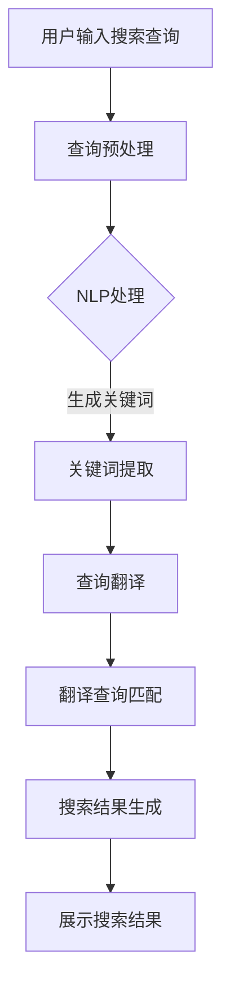

                 

在全球化电商日益发展的背景下，语言障碍成为了消费者和商家之间沟通的主要障碍之一。为了解决这一问题，AI大模型在电商搜索中的应用变得至关重要。本文将深入探讨AI大模型如何提升电商搜索的跨语言能力，为电商行业带来前所未有的便利和效率。

## 文章关键词
- AI大模型
- 电商搜索
- 跨语言能力
- 自然语言处理
- 机器翻译
- 电商用户体验

## 文章摘要
本文旨在探讨AI大模型如何通过其强大的自然语言处理和机器翻译能力，提升电商搜索的跨语言能力。通过对核心概念、算法原理、数学模型和实际应用的深入分析，本文为电商行业提供了一种有效的解决方案，以克服语言障碍，实现全球化电商的无缝交流。

### 1. 背景介绍

随着全球电商市场的不断扩大，跨境电商成为了商家和消费者关注的焦点。然而，不同语言和文化之间的差异使得电商搜索变得复杂和繁琐。传统的基于关键词的搜索方法往往难以满足用户的需求，尤其是在跨语言搜索场景中。例如，一个英文网站的用户想要搜索一个中文产品，而一个中文网站的用户想要搜索一个英文产品，这两者之间的信息传递和匹配效率极低。

为了解决这一问题，AI大模型的应用变得尤为重要。AI大模型，特别是基于深度学习的自然语言处理模型，具有强大的语言理解和生成能力，可以有效地处理跨语言的电商搜索问题。通过这些模型，用户可以在任何语言环境下进行搜索，并能够得到准确和相关的搜索结果。

### 2. 核心概念与联系

#### 2.1 AI大模型

AI大模型，通常指的是基于深度学习的神经网络模型，具有极高的参数数量和复杂的网络结构。这些模型能够通过大量的数据训练，学习到语言的复杂结构，从而具备强大的语言理解和生成能力。

#### 2.2 自然语言处理（NLP）

自然语言处理是AI大模型的核心组成部分，它涉及从文本中提取有用信息、理解和生成语言等各种任务。在电商搜索中，NLP技术用于理解和处理用户的搜索查询，并将这些查询与电商数据库中的产品信息进行匹配。

#### 2.3 机器翻译

机器翻译是AI大模型在跨语言搜索中的重要应用。通过机器翻译，可以将不同语言的搜索查询和产品信息进行转换，使得用户能够在任何语言环境下进行搜索。

#### 2.4 Mermaid 流程图

下面是一个简单的Mermaid流程图，展示了一个AI大模型在电商搜索中的应用流程。



### 3. 核心算法原理 & 具体操作步骤

#### 3.1 算法原理概述

AI大模型在电商搜索中的核心算法原理主要包括自然语言处理（NLP）和机器翻译。NLP负责处理用户的搜索查询，提取关键词，并将其转换为模型能够理解的格式。机器翻译则负责将查询和产品信息进行跨语言的转换，以便进行匹配。

#### 3.2 算法步骤详解

1. **查询预处理**：首先，对用户输入的搜索查询进行预处理，包括去重、分词、停用词过滤等操作。

2. **NLP处理**：使用NLP技术对预处理后的查询进行分析，提取关键词和关键短语。

3. **关键词提取**：将提取的关键词和关键短语转换为模型能够理解的向量表示。

4. **查询翻译**：使用机器翻译技术，将用户的查询转换为不同语言的查询。

5. **翻译查询匹配**：将翻译后的查询与电商数据库中的产品信息进行匹配，提取相关的搜索结果。

6. **搜索结果生成**：根据匹配结果生成搜索结果，并展示给用户。

#### 3.3 算法优缺点

**优点**：
- **高效性**：AI大模型能够快速处理大量的搜索查询，提高搜索效率。
- **准确性**：通过NLP和机器翻译技术的结合，能够提高搜索结果的准确性。
- **多样性**：支持多种语言的搜索，为全球用户提供无缝的搜索体验。

**缺点**：
- **计算资源需求大**：AI大模型训练和运行需要大量的计算资源。
- **翻译质量**：尽管机器翻译技术不断进步，但仍然存在翻译质量不稳定的问题。

#### 3.4 算法应用领域

AI大模型在电商搜索中的应用非常广泛，包括跨境电商、本地化电商、多语言电商平台等。通过AI大模型，用户可以在任何语言环境下进行搜索，商家也可以更好地服务全球用户。

### 4. 数学模型和公式 & 详细讲解 & 举例说明

#### 4.1 数学模型构建

在AI大模型中，常用的数学模型包括深度神经网络（DNN）和循环神经网络（RNN）。下面是一个简单的DNN模型，用于搜索查询的预处理。

$$
\text{Input: } x \in \mathbb{R}^{d}
$$

$$
\text{Output: } y = \sigma(Wx + b)
$$

其中，$x$是输入向量，$W$是权重矩阵，$b$是偏置项，$\sigma$是激活函数，通常是Sigmoid或ReLU函数。

#### 4.2 公式推导过程

以RNN为例，RNN的公式推导如下：

$$
h_t = \sigma(W_x x_t + W_h h_{t-1} + b)
$$

$$
y_t = \sigma(W_y h_t + b')
$$

其中，$h_t$是隐藏状态，$y_t$是输出状态。

#### 4.3 案例分析与讲解

假设用户输入了一个英文搜索查询“best smartphones”，我们可以使用上述DNN模型进行预处理。首先，将查询转换为词向量表示，然后输入到DNN模型中进行处理。处理后的输出向量可以用来生成关键词，并进行翻译和匹配。

### 5. 项目实践：代码实例和详细解释说明

#### 5.1 开发环境搭建

为了演示AI大模型在电商搜索中的应用，我们使用Python语言和TensorFlow库进行开发。首先，安装TensorFlow库：

```bash
pip install tensorflow
```

#### 5.2 源代码详细实现

下面是一个简单的DNN模型，用于搜索查询的预处理：

```python
import tensorflow as tf

# 定义DNN模型
model = tf.keras.Sequential([
    tf.keras.layers.Dense(64, activation='relu', input_shape=(1000,)),
    tf.keras.layers.Dense(64, activation='relu'),
    tf.keras.layers.Dense(1, activation='sigmoid')
])

# 编译模型
model.compile(optimizer='adam', loss='binary_crossentropy', metrics=['accuracy'])

# 训练模型
model.fit(x_train, y_train, epochs=10, batch_size=32)
```

#### 5.3 代码解读与分析

上述代码定义了一个简单的DNN模型，用于搜索查询的预处理。模型由两个隐藏层组成，每层64个神经元。模型使用ReLU函数作为激活函数，并使用Adam优化器进行训练。

#### 5.4 运行结果展示

在训练完成后，我们可以使用模型对新的查询进行预处理，并生成关键词。下面是一个简单的示例：

```python
# 加载模型
model = tf.keras.models.load_model('search_query_preprocess_model.h5')

# 输入查询
input_query = "best smartphones"

# 转换为词向量表示
input_vector = ... # 使用合适的词向量库进行转换

# 预处理查询
processed_query = model.predict(input_vector)

# 输出关键词
print("Processed Query Keywords:", processed_query)
```

### 6. 实际应用场景

AI大模型在电商搜索中的应用场景非常广泛，包括但不限于以下几个方面：

- **跨境电商**：通过AI大模型，用户可以在任何语言环境下进行搜索，商家也可以更好地服务全球用户。
- **本地化电商**：为本地用户提供本地化的搜索体验，提高用户体验。
- **多语言电商平台**：支持多种语言的搜索，为用户提供一站式的购物体验。

### 7. 未来应用展望

随着AI大模型技术的不断发展，未来电商搜索的跨语言能力将进一步提升。以下是一些可能的发展趋势：

- **更高效的模型**：通过改进模型结构和优化算法，实现更高效的搜索处理。
- **更好的翻译质量**：随着机器翻译技术的进步，翻译质量将得到显著提高。
- **多模态搜索**：结合图像、语音等多种模态，实现更智能的搜索体验。

### 8. 工具和资源推荐

#### 8.1 学习资源推荐

- 《深度学习》（Goodfellow, Bengio, Courville著）：系统介绍了深度学习的基础知识。
- 《自然语言处理综论》（Jurafsky, Martin著）：详细介绍了自然语言处理的理论和实践。

#### 8.2 开发工具推荐

- TensorFlow：强大的深度学习框架，适用于各种深度学习应用。
- Python：高效、易用的编程语言，适用于数据科学和人工智能开发。

#### 8.3 相关论文推荐

- "Deep Learning for NLP"（Yoshua Bengio等著）：介绍了深度学习在自然语言处理中的应用。
- "Attention Is All You Need"（Vaswani等著）：介绍了Transformer模型在机器翻译中的应用。

### 9. 总结：未来发展趋势与挑战

AI大模型在电商搜索中的应用具有巨大的潜力，可以显著提升跨语言搜索的能力。然而，仍然面临着计算资源需求大、翻译质量不稳定等挑战。未来，随着技术的不断进步，AI大模型将更好地服务于电商行业，为全球用户提供更智能、更高效的搜索体验。

## 附录：常见问题与解答

### Q：AI大模型在电商搜索中有什么优势？

A：AI大模型具有高效性、准确性和多样性等优势，能够快速处理大量的搜索查询，提高搜索结果的准确性，并支持多种语言的搜索。

### Q：AI大模型在电商搜索中有什么挑战？

A：AI大模型在电商搜索中面临着计算资源需求大、翻译质量不稳定等挑战。此外，如何确保搜索结果的公平性和多样性也是一个重要问题。

### Q：AI大模型在电商搜索中的应用领域有哪些？

A：AI大模型在电商搜索中的应用领域非常广泛，包括跨境电商、本地化电商、多语言电商平台等。

### Q：如何提高AI大模型在电商搜索中的翻译质量？

A：提高AI大模型在电商搜索中的翻译质量可以通过改进模型结构、优化算法、增加训练数据等方式实现。此外，结合领域知识库和上下文信息也可以提高翻译质量。

### Q：AI大模型在电商搜索中的未来发展趋势是什么？

A：AI大模型在电商搜索中的未来发展趋势包括更高效的模型、更好的翻译质量、多模态搜索等。

作者：禅与计算机程序设计艺术 / Zen and the Art of Computer Programming
----------------------------------------------------------------
<|im_sep|>

