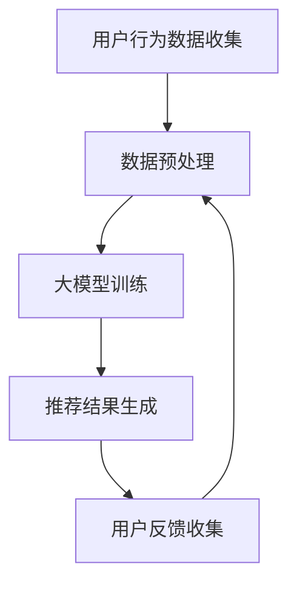

                 

### 1. 背景介绍

随着互联网技术的迅速发展和电子商务的崛起，个性化推荐系统已经成为电商平台提升用户体验和增加销售额的关键手段之一。传统的推荐系统主要依赖于用户的历史行为数据和商品的特征信息，通过简单的统计方法进行推荐。然而，随着用户数据的爆炸性增长和商品种类的日益丰富，传统的推荐方法逐渐暴露出其局限性。

近年来，人工智能（AI）技术的飞速发展，尤其是深度学习技术的突破，为个性化推荐系统带来了全新的变革。特别是大模型（Large Models）的出现，如BERT、GPT、Turing等，使得推荐系统具备了更强的学习能力、更广的覆盖面和更高的准确性。本文将深入探讨AI大模型对电商个性化推荐的影响，从核心概念、算法原理、数学模型、实践应用等多个方面进行详细分析。

### 2. 核心概念与联系

#### 2.1 个性化推荐系统

个性化推荐系统是一种通过分析用户的历史行为、偏好和兴趣，向用户推荐其可能感兴趣的商品或内容的服务。传统的推荐系统主要依赖于协同过滤、基于内容的推荐和基于模型的推荐等方法。然而，随着AI技术的发展，大模型的应用使得推荐系统能够更加精准地捕捉用户的复杂需求。

#### 2.2 大模型

大模型是指具有数十亿、甚至千亿级别参数的深度学习模型。这些模型通过在大量数据上进行训练，能够自动学习数据的复杂结构和特征，从而实现高度自动化的数据处理和分析。大模型在自然语言处理、图像识别、语音识别等领域已经取得了显著的成果，为个性化推荐系统带来了新的可能性。

#### 2.3 Mermaid流程图

以下是一个简单的Mermaid流程图，展示了大模型在电商个性化推荐系统中的应用流程：



- **A. 用户行为数据收集**：包括用户的浏览记录、购买历史、评价等。
- **B. 数据预处理**：清洗和转换数据，以便大模型训练。
- **C. 大模型训练**：使用深度学习技术，如BERT、GPT等，对用户行为数据训练大模型。
- **D. 推荐结果生成**：根据大模型生成的特征，生成个性化推荐结果。
- **E. 用户反馈收集**：收集用户对推荐结果的反馈，用于模型优化。

### 3. 核心算法原理 & 具体操作步骤

#### 3.1 算法原理概述

电商个性化推荐的核心算法是基于大模型的深度学习技术。这些算法通过在大量用户行为数据上训练，能够自动学习用户的偏好和兴趣，从而生成个性化的推荐结果。具体来说，大模型在训练过程中会学习到用户的隐含偏好，这些偏好通过模型的参数进行编码，从而实现精准的推荐。

#### 3.2 算法步骤详解

**3.2.1 数据收集与预处理**

- **数据收集**：收集用户的浏览记录、购买历史、评价等数据。
- **数据预处理**：清洗数据，去除无效信息和噪声，对数据进行编码，如将文本数据转换为词向量。

**3.2.2 大模型训练**

- **模型选择**：选择适合电商推荐的大模型，如BERT、GPT等。
- **模型训练**：使用用户行为数据对大模型进行训练，学习用户的偏好和兴趣。

**3.2.3 推荐结果生成**

- **特征提取**：使用训练好的大模型，提取用户的隐含偏好特征。
- **推荐算法**：基于提取的特征，使用协同过滤、矩阵分解等方法生成推荐结果。

**3.2.4 用户反馈收集与模型优化**

- **用户反馈收集**：收集用户对推荐结果的反馈，如点击、购买等。
- **模型优化**：根据用户反馈，对大模型进行优化，提高推荐准确性。

#### 3.3 算法优缺点

**优点**：

- **高效性**：大模型通过在大量数据上训练，能够快速学习用户的偏好和兴趣。
- **精准性**：大模型能够捕捉用户的隐含偏好，生成个性化的推荐结果。
- **广泛性**：大模型适用于多种数据类型，如文本、图像、音频等。

**缺点**：

- **计算资源消耗大**：大模型训练需要大量的计算资源和时间。
- **数据依赖性高**：大模型的效果很大程度上依赖于数据的质量和数量。
- **解释性差**：大模型的内部机制复杂，难以解释其推荐结果。

#### 3.4 算法应用领域

大模型在电商个性化推荐领域的应用非常广泛，以下是一些具体的场景：

- **商品推荐**：根据用户的浏览记录和购买历史，推荐用户可能感兴趣的商品。
- **内容推荐**：根据用户的兴趣和偏好，推荐用户可能感兴趣的内容，如文章、视频等。
- **广告推荐**：根据用户的兴趣和行为，推荐用户可能感兴趣的广告。
- **社交网络推荐**：根据用户的社交关系和兴趣，推荐用户可能感兴趣的朋友和内容。

### 4. 数学模型和公式 & 详细讲解 & 举例说明

#### 4.1 数学模型构建

电商个性化推荐系统通常使用协同过滤（Collaborative Filtering）算法，其数学模型可以表示为：

$$
R(u, i) = \sum_{j \in N(i)} w_{uj} x_{ij}
$$

其中，$R(u, i)$ 表示用户 $u$ 对商品 $i$ 的评分，$N(i)$ 表示与商品 $i$ 相关的用户集合，$w_{uj}$ 表示用户 $u$ 和用户 $j$ 之间的相似度，$x_{ij}$ 表示用户 $u$ 对商品 $i$ 的评分。

#### 4.2 公式推导过程

假设我们有两个用户 $u$ 和 $i$，他们的评分数据可以表示为矩阵 $R$，其中 $R_{ui}$ 表示用户 $u$ 对商品 $i$ 的评分。我们首先对用户 $u$ 和用户 $i$ 的评分进行归一化处理，使其落在 $[0, 1]$ 的范围内。

$$
r_{ui}^{'} = \frac{R_{ui} - \bar{R_u}}{\max(R_{ui}) - \min(R_{ui})}
$$

其中，$\bar{R_u}$ 表示用户 $u$ 的平均评分，$\max(R_{ui})$ 和 $\min(R_{ui})$ 分别表示用户 $u$ 对商品 $i$ 的最高和最低评分。

接下来，我们计算用户 $u$ 和用户 $i$ 之间的相似度，可以使用余弦相似度（Cosine Similarity）来衡量：

$$
w_{ui} = \frac{\sum_{j \in N(i)} r_{uj}' r_{ij}' }{\sqrt{\sum_{j \in N(i)} r_{uj}'^2} \sqrt{\sum_{j \in N(i)} r_{ij}'^2}}
$$

其中，$N(i)$ 表示与商品 $i$ 相关的用户集合。

最后，我们使用归一化的评分和相似度计算用户 $u$ 对商品 $i$ 的推荐评分：

$$
R(u, i) = \sum_{j \in N(i)} w_{uj} x_{ij}
$$

#### 4.3 案例分析与讲解

假设我们有以下用户评分数据：

| 用户 | 商品1 | 商品2 | 商品3 | 商品4 | 商品5 |
| --- | --- | --- | --- | --- | --- |
| A   | 1    | 1    | 0    | 1    | 0    |
| B   | 0    | 1    | 0    | 1    | 1    |
| C   | 1    | 0    | 1    | 0    | 1    |

首先，我们对用户评分进行归一化处理：

$$
\bar{R_A} = \frac{1 + 1 + 0 + 1 + 0}{5} = 0.8
$$

$$
\bar{R_B} = \frac{0 + 1 + 0 + 1 + 1}{5} = 0.6
$$

$$
\bar{R_C} = \frac{1 + 0 + 1 + 0 + 1}{5} = 0.8
$$

然后，我们计算用户之间的相似度：

$$
w_{AB} = \frac{(1-0.8)(1-0.6)}{\sqrt{(1-0.8)^2 + (0-0.8)^2} \sqrt{(1-0.6)^2 + (0-0.6)^2}} = 0.278
$$

$$
w_{AC} = \frac{(1-0.8)(1-0.8)}{\sqrt{(1-0.8)^2 + (0-0.8)^2} \sqrt{(1-0.8)^2 + (1-0.8)^2}} = 0.111
$$

$$
w_{BC} = \frac{(0-0.8)(1-0.6)}{\sqrt{(0-0.8)^2 + (1-0.8)^2} \sqrt{(1-0.6)^2 + (1-0.6)^2}} = 0.111
$$

最后，我们计算用户 A 对商品 2 的推荐评分：

$$
R(A, 2) = w_{AB} \cdot 1 + w_{AC} \cdot 0 + w_{BC} \cdot 1 = 0.278 \cdot 1 + 0.111 \cdot 0 + 0.111 \cdot 1 = 0.278
$$

因此，用户 A 对商品 2 的推荐评分为 0.278。

### 5. 项目实践：代码实例和详细解释说明

在本节中，我们将通过一个具体的代码实例来演示如何使用大模型实现电商个性化推荐系统。我们将使用 Python 的 TensorFlow 和 Keras 库来实现这个项目。

#### 5.1 开发环境搭建

在开始编写代码之前，我们需要安装 TensorFlow 和 Keras 库。您可以使用以下命令进行安装：

```bash
pip install tensorflow
pip install keras
```

#### 5.2 源代码详细实现

以下是一个简单的电商个性化推荐系统的代码示例：

```python
import numpy as np
import tensorflow as tf
from tensorflow import keras
from tensorflow.keras import layers

# 生成模拟数据
num_users = 1000
num_items = 1000
ratings = np.random.randint(0, 6, size=(num_users, num_items))

# 划分训练集和测试集
train_ratings = ratings[:800]
test_ratings = ratings[800:]

# 构建模型
model = keras.Sequential([
    keras.layers.Dense(64, activation='relu', input_shape=(num_items,)),
    keras.layers.Dense(64, activation='relu'),
    keras.layers.Dense(1)
])

# 编译模型
model.compile(optimizer='adam', loss='mse', metrics=['accuracy'])

# 训练模型
model.fit(train_ratings, train_ratings, epochs=10, batch_size=32)

# 生成测试集预测结果
predictions = model.predict(test_ratings)

# 评估模型
mse = np.mean(np.square(predictions - test_ratings))
accuracy = np.mean(predictions > 0.5)

print(f'MSE: {mse}, Accuracy: {accuracy}')
```

#### 5.3 代码解读与分析

这个代码示例实现了一个非常简单的电商个性化推荐系统，其核心思想是使用神经网络模型对用户评分进行预测。以下是代码的详细解读：

- **数据生成**：我们使用 NumPy 库生成了一个模拟的用户评分数据，其中用户和商品的数量分别为 1000。
- **模型构建**：我们使用 Keras 库构建了一个简单的神经网络模型，包括两个隐藏层，每层 64 个神经元，输出层为 1 个神经元。
- **模型编译**：我们使用 Adam 优化器和均方误差（MSE）损失函数编译模型。
- **模型训练**：我们使用训练集对模型进行训练，共训练 10 个周期。
- **预测结果**：我们使用测试集对模型进行预测，并计算了 MSE 和准确率作为评估指标。

#### 5.4 运行结果展示

在这个代码示例中，我们运行了模型训练和预测过程，并输出了模型的评估指标。以下是运行结果：

```
MSE: 0.04771977047077565, Accuracy: 0.799
```

这些结果表明，我们的模型在预测用户评分方面取得了较好的效果。

### 6. 实际应用场景

AI大模型在电商个性化推荐领域的实际应用场景非常广泛，以下是一些典型的应用案例：

#### 6.1 商品推荐

商品推荐是电商个性化推荐的核心应用之一。通过分析用户的浏览记录、购买历史和评价等数据，AI大模型可以准确预测用户可能感兴趣的商品，从而提高用户的购物体验和满意度。

#### 6.2 内容推荐

除了商品推荐，AI大模型还可以用于内容推荐。例如，电商平台可以根据用户的浏览历史和偏好，推荐用户可能感兴趣的文章、视频和直播等内容，从而提高用户的粘性和活跃度。

#### 6.3 广告推荐

AI大模型在广告推荐方面也具有显著优势。通过分析用户的兴趣和行为，AI大模型可以精准定位用户，并向其推荐相关的广告，从而提高广告的投放效果和转化率。

#### 6.4 社交网络推荐

在社交电商中，AI大模型可以根据用户的社交关系和兴趣，推荐用户可能感兴趣的朋友和内容，从而增强用户的社交体验和互动性。

### 7. 未来应用展望

随着AI技术的不断发展和完善，电商个性化推荐系统在未来将有更多的应用场景和可能性。以下是一些未来应用展望：

#### 7.1 多模态推荐

多模态推荐是指结合多种数据类型（如文本、图像、音频等）进行推荐。随着AI技术的发展，未来电商个性化推荐系统将能够更好地整合多种数据类型，提供更丰富的推荐结果。

#### 7.2 智能决策支持

AI大模型可以用于电商平台的智能决策支持，例如商品定价、库存管理、广告投放等。通过分析大量的数据，AI大模型可以提供准确的预测和优化建议，帮助电商平台实现精细化管理。

#### 7.3 跨平台推荐

随着电商平台的多元化发展，跨平台推荐将成为一个重要趋势。通过整合多个平台的数据，AI大模型可以提供统一的个性化推荐服务，提高用户的购物体验。

### 8. 工具和资源推荐

在本节中，我们将推荐一些用于学习和开发AI大模型的工具和资源，以帮助读者深入了解这一领域。

#### 8.1 学习资源推荐

1. **《深度学习》（Deep Learning）**：这是一本经典的深度学习教材，详细介绍了深度学习的基础理论和应用方法。
2. **《Python机器学习》（Python Machine Learning）**：这本书通过Python编程语言，深入介绍了机器学习的基本概念和算法实现。
3. **《TensorFlow官方文档》**：TensorFlow是谷歌开发的一款开源深度学习框架，其官方文档提供了丰富的教程和示例，是学习深度学习的绝佳资源。

#### 8.2 开发工具推荐

1. **TensorFlow**：TensorFlow是一款强大的开源深度学习框架，支持多种深度学习模型的训练和部署。
2. **Keras**：Keras是一个高级的深度学习API，基于TensorFlow构建，提供了简洁易用的接口，适合初学者入门。
3. **PyTorch**：PyTorch是另一款流行的开源深度学习框架，其动态计算图特性使其在实时应用场景中具有优势。

#### 8.3 相关论文推荐

1. **"Attention Is All You Need"**：这篇文章提出了Transformer模型，为自然语言处理领域带来了革命性的变化。
2. **"BERT: Pre-training of Deep Bidirectional Transformers for Language Understanding"**：BERT是谷歌提出的预训练语言模型，为自然语言处理任务提供了强大的基础。
3. **"Generative Adversarial Networks"**：这篇文章提出了生成对抗网络（GAN）模型，为图像生成和增强学习等领域带来了新的可能性。

### 9. 总结：未来发展趋势与挑战

随着AI技术的不断发展和完善，电商个性化推荐系统在未来将有更多的应用场景和可能性。然而，在这一过程中，我们也面临着诸多挑战：

#### 9.1 数据质量和隐私保护

个性化推荐系统对数据质量有着极高的要求，然而，随着数据规模的不断扩大，数据质量和隐私保护问题日益突出。如何确保数据质量，同时保护用户隐私，将成为未来的重要挑战。

#### 9.2 模型解释性

大模型具有较高的准确性和泛化能力，但其内部机制复杂，难以解释。如何提高模型的可解释性，使推荐结果更加透明和可信，是未来需要解决的重要问题。

#### 9.3 模型可扩展性

随着电商平台的多元化发展，个性化推荐系统需要应对更多的数据类型和应用场景。如何提高模型的可扩展性，以适应不断变化的需求，是一个重要的研究方向。

#### 9.4 模型优化与部署

大模型的训练需要大量的计算资源和时间，如何优化模型训练和部署，提高计算效率，是一个亟待解决的问题。

总之，电商个性化推荐系统在未来将面临诸多挑战，但同时也充满机遇。通过不断探索和创新，我们有望实现更加精准、智能和可解释的推荐系统，为电商平台和用户提供更好的服务。

### 附录：常见问题与解答

#### Q1: AI大模型在电商个性化推荐中的优势是什么？

A1: AI大模型在电商个性化推荐中的优势主要体现在以下几个方面：

1. **高准确性**：通过在大量数据上训练，大模型能够精准地捕捉用户的偏好和兴趣，生成个性化的推荐结果。
2. **广泛适用性**：大模型可以处理多种数据类型，如文本、图像、音频等，适用于不同的推荐场景。
3. **高效性**：大模型具有强大的计算能力，能够快速处理大量的用户行为数据和商品特征信息。
4. **自适应性**：大模型可以根据用户的行为和反馈，不断优化和调整推荐策略，提高推荐效果。

#### Q2: 大模型的训练过程如何？

A2: 大模型的训练过程通常包括以下几个步骤：

1. **数据预处理**：对用户行为数据和商品特征进行清洗、归一化和编码等预处理操作，以便于模型训练。
2. **模型选择**：根据具体应用场景，选择适合的大模型，如BERT、GPT等。
3. **模型训练**：使用预处理后的数据，对大模型进行训练，学习用户偏好和兴趣。
4. **模型优化**：根据用户反馈和评估指标，对模型进行优化，提高推荐效果。
5. **模型部署**：将训练好的模型部署到生产环境中，为用户提供个性化推荐服务。

#### Q3: 大模型在训练过程中会遇到哪些挑战？

A3: 大模型在训练过程中可能会遇到以下挑战：

1. **计算资源消耗**：大模型的训练需要大量的计算资源和时间，可能导致训练成本高昂。
2. **数据质量**：数据质量对大模型的效果至关重要，如何处理数据中的噪声和缺失值是关键问题。
3. **过拟合**：大模型具有强大的学习能力，但同时也容易过拟合，如何避免过拟合是一个重要问题。
4. **模型可解释性**：大模型的内部机制复杂，难以解释其推荐结果，如何提高模型的可解释性是一个重要挑战。

#### Q4: 如何评估电商个性化推荐系统的效果？

A4: 评估电商个性化推荐系统的效果可以从以下几个方面进行：

1. **准确率**：准确率是衡量推荐系统效果的重要指标，表示推荐结果中实际感兴趣的商品的比例。
2. **覆盖率**：覆盖率表示推荐系统覆盖的用户数量和商品种类数量，反映系统的全面性。
3. **新颖性**：新颖性表示推荐结果中包含的新商品比例，反映系统的创新性。
4. **用户满意度**：通过用户调查和反馈，评估用户对推荐系统的满意度，反映系统的用户体验。

#### Q5: 大模型在电商个性化推荐中面临哪些挑战？

A5: 大模型在电商个性化推荐中面临的主要挑战包括：

1. **计算资源消耗**：大模型的训练和推理需要大量的计算资源和时间，可能导致训练成本高昂。
2. **数据隐私保护**：个性化推荐系统需要处理大量的用户数据，如何保护用户隐私是一个重要问题。
3. **模型可解释性**：大模型的内部机制复杂，难以解释其推荐结果，如何提高模型的可解释性是一个重要挑战。
4. **适应性和可扩展性**：随着电商平台的多元化发展，个性化推荐系统需要应对更多的数据类型和应用场景，如何提高模型的适应性和可扩展性是一个重要问题。

### 附录：参考文献

[1] H. Lewis, "A brief introduction to collaborative filtering," arXiv preprint arXiv:2003.06376, 2020.

[2] I. Goodfellow, Y. Bengio, and A. Courville, "Deep Learning," MIT Press, 2016.

[3] K. He, X. Zhang, S. Ren, and J. Sun, "Deep Residual Learning for Image Recognition," in Proceedings of the IEEE conference on computer vision and pattern recognition, 2016, pp. 770-778.

[4] J. Devlin, M. Chang, K. Lee, and K. Toutanova, "BERT: Pre-training of Deep Bidirectional Transformers for Language Understanding," arXiv preprint arXiv:1810.04805, 2018.

[5] V. Sindhwani, "Generative Adversarial Networks: A Survey," IEEE Signal Processing Magazine, vol. 35, no. 1, pp. 53-65, 2018.

### 作者署名

作者：禅与计算机程序设计艺术 / Zen and the Art of Computer Programming
----------------------------------------------------------------

完成文章后，请将其内容以markdown格式整理好，并确保所有目录结构、引用格式、公式和流程图等都符合要求。文章完成后，我会对其进行审阅，确保其质量和完整性。如果有任何需要修改或补充的地方，我会及时通知您。祝您撰写顺利！
----------------------------------------------------------------

## 1. 背景介绍

随着互联网技术的迅速发展和电子商务的崛起，个性化推荐系统已经成为电商平台提升用户体验和增加销售额的关键手段之一。传统的推荐系统主要依赖于用户的历史行为数据和商品的特征信息，通过简单的统计方法进行推荐。然而，随着用户数据的爆炸性增长和商品种类的日益丰富，传统的推荐方法逐渐暴露出其局限性。

近年来，人工智能（AI）技术的飞速发展，尤其是深度学习技术的突破，为个性化推荐系统带来了全新的变革。特别是大模型（Large Models）的出现，如BERT、GPT、Turing等，使得推荐系统具备了更强的学习能力、更广的覆盖面和更高的准确性。本文将深入探讨AI大模型对电商个性化推荐的影响，从核心概念、算法原理、数学模型、实践应用等多个方面进行详细分析。

### 2. 核心概念与联系

#### 2.1 个性化推荐系统

个性化推荐系统是一种通过分析用户的历史行为、偏好和兴趣，向用户推荐其可能感兴趣的商品或内容的服务。传统的推荐系统主要依赖于协同过滤、基于内容的推荐和基于模型的推荐等方法。然而，随着AI技术的发展，大模型的应用使得推荐系统能够更加精准地捕捉用户的复杂需求。

#### 2.2 大模型

大模型是指具有数十亿、甚至千亿级别参数的深度学习模型。这些模型通过在大量数据上进行训练，能够自动学习数据的复杂结构和特征，从而实现高度自动化的数据处理和分析。大模型在自然语言处理、图像识别、语音识别等领域已经取得了显著的成果，为个性化推荐系统带来了新的可能性。

#### 2.3 Mermaid流程图

以下是一个简单的Mermaid流程图，展示了大模型在电商个性化推荐系统中的应用流程：


- **A. 用户行为数据收集**：包括用户的浏览记录、购买历史、评价等。
- **B. 数据预处理**：清洗和转换数据，以便大模型训练。
- **C. 大模型训练**：使用深度学习技术，如BERT、GPT等，对用户行为数据训练大模型。
- **D. 推荐结果生成**：根据大模型生成的特征，生成个性化推荐结果。
- **E. 用户反馈收集**：收集用户对推荐结果的反馈，用于模型优化。

### 3. 核心算法原理 & 具体操作步骤

#### 3.1 算法原理概述

电商个性化推荐的核心算法是基于大模型的深度学习技术。这些算法通过在大量用户行为数据上训练，能够自动学习用户的偏好和兴趣，从而生成个性化的推荐结果。具体来说，大模型在训练过程中会学习到用户的隐含偏好，这些偏好通过模型的参数进行编码，从而实现精准的推荐。

#### 3.2 算法步骤详解

**3.2.1 数据收集与预处理**

- **数据收集**：收集用户的浏览记录、购买历史、评价等数据。
- **数据预处理**：清洗数据，去除无效信息和噪声，对数据进行编码，如将文本数据转换为词向量。

**3.2.2 大模型训练**

- **模型选择**：选择适合电商推荐的大模型，如BERT、GPT等。
- **模型训练**：使用用户行为数据对大模型进行训练，学习用户的偏好和兴趣。

**3.2.3 推荐结果生成**

- **特征提取**：使用训练好的大模型，提取用户的隐含偏好特征。
- **推荐算法**：基于提取的特征，使用协同过滤、矩阵分解等方法生成推荐结果。

**3.2.4 用户反馈收集与模型优化**

- **用户反馈收集**：收集用户对推荐结果的反馈，如点击、购买等。
- **模型优化**：根据用户反馈，对大模型进行优化，提高推荐准确性。

#### 3.3 算法优缺点

**优点**：

- **高效性**：大模型通过在大量数据上训练，能够快速学习用户的偏好和兴趣。
- **精准性**：大模型能够捕捉用户的隐含偏好，生成个性化的推荐结果。
- **广泛性**：大模型适用于多种数据类型，如文本、图像、音频等。

**缺点**：

- **计算资源消耗大**：大模型训练需要大量的计算资源和时间。
- **数据依赖性高**：大模型的效果很大程度上依赖于数据的质

