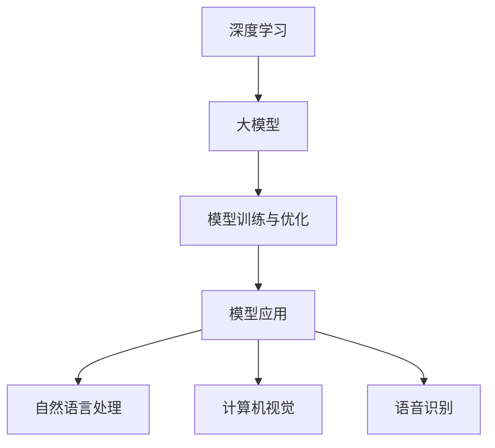

                 

关键词：人工智能，大模型，人才培养，新模式，技术发展

> 摘要：随着人工智能技术的快速发展，大模型的应用越来越广泛，成为推动科技进步和社会变革的重要力量。本文旨在探讨大模型应用背景下的人才培养新模式，分析其核心概念、算法原理、数学模型、实践应用以及未来发展趋势，为人工智能领域的人才培养提供新思路。

## 1. 背景介绍

近年来，人工智能（AI）技术取得了令人瞩目的进展，特别是大模型（Large Models）的应用。大模型是指具有数百万甚至数十亿参数的深度学习模型，如GPT-3、BERT等。这些大模型在自然语言处理、计算机视觉、语音识别等领域展现出了强大的性能，成为推动人工智能技术突破的重要力量。

随着大模型的广泛应用，对相关领域的人才需求也日益增加。然而，传统的教育模式往往难以满足这一需求，导致人才短缺。因此，探索一种适应大模型应用背景的人才培养新模式变得尤为迫切。

## 2. 核心概念与联系

为了更好地理解大模型应用的人才培养新模式，我们首先需要了解以下几个核心概念：

1. **深度学习**：深度学习是人工智能的核心技术之一，它通过多层神经网络进行特征提取和建模。
2. **大模型**：大模型具有数百万甚至数十亿参数，能够捕捉大量信息，从而在复杂任务上表现出色。
3. **模型训练与优化**：模型训练是深度学习的关键步骤，通过大量数据对模型参数进行调整，使其能够更好地完成预测任务。
4. **模型应用**：大模型在自然语言处理、计算机视觉、语音识别等领域的应用，为各行各业带来了变革。

下面是一个用Mermaid绘制的流程图，展示了这些核心概念之间的联系：



## 3. 核心算法原理 & 具体操作步骤

### 3.1 算法原理概述

大模型的算法原理主要基于深度学习，其核心思想是通过多层神经网络对数据进行分析和建模。深度学习模型通常包括输入层、隐藏层和输出层，其中隐藏层负责特征提取和变换。

### 3.2 算法步骤详解

1. **数据预处理**：对数据进行清洗、归一化和分批次处理，以便输入到模型中。
2. **模型构建**：设计并构建多层神经网络模型，包括输入层、隐藏层和输出层。
3. **模型训练**：使用训练数据对模型进行训练，通过反向传播算法调整模型参数。
4. **模型优化**：对训练后的模型进行优化，提高其性能和泛化能力。
5. **模型应用**：将训练好的模型应用于实际问题，如自然语言处理、计算机视觉等。

### 3.3 算法优缺点

**优点**：
- **强大的建模能力**：大模型能够捕捉大量信息，对复杂任务表现出色。
- **高效的预测能力**：大模型在训练过程中积累了大量知识，能够实现高效的预测。

**缺点**：
- **计算资源消耗大**：大模型需要大量计算资源和存储空间。
- **训练过程复杂**：大模型的训练过程涉及大量参数调整，需要丰富的经验和技巧。

### 3.4 算法应用领域

大模型在自然语言处理、计算机视觉、语音识别等领域取得了显著成果。例如，GPT-3在自然语言处理任务上表现出色，BERT在文本分类任务上具有强大的能力，ResNet在图像分类任务上取得了突破性进展。

## 4. 数学模型和公式 & 详细讲解 & 举例说明

### 4.1 数学模型构建

大模型的数学模型主要包括两部分：神经网络模型和损失函数。

**神经网络模型**：

神经网络模型由多个神经元组成，每个神经元都是一个简单的函数，通常使用 sigmoid、ReLU 等激活函数。神经网络模型通过多层神经网络对数据进行特征提取和变换。

$$
h_{l} = \sigma(W_{l} \cdot a_{l-1} + b_{l})
$$

其中，$h_{l}$表示第$l$层的输出，$a_{l-1}$表示第$l-1$层的输入，$W_{l}$和$b_{l}$分别表示第$l$层的权重和偏置。

**损失函数**：

损失函数用于衡量模型预测值与真实值之间的差距。常见的损失函数包括均方误差（MSE）、交叉熵损失等。

$$
L = \frac{1}{2} \sum_{i=1}^{n} (y_i - \hat{y}_i)^2
$$

其中，$y_i$表示第$i$个样本的真实值，$\hat{y}_i$表示第$i$个样本的预测值。

### 4.2 公式推导过程

**反向传播算法**：

反向传播算法是深度学习模型训练的核心算法。它通过计算损失函数关于模型参数的梯度，从而更新模型参数。

$$
\frac{\partial L}{\partial W_{l}} = \sum_{i=1}^{n} \frac{\partial L}{\partial \hat{y}_i} \cdot \frac{\partial \hat{y}_i}{\partial a_{l-1}} \cdot \frac{\partial a_{l-1}}{\partial W_{l}}
$$

**梯度下降法**：

梯度下降法是一种优化算法，用于更新模型参数。其基本思想是沿着损失函数的梯度方向更新参数，以减小损失。

$$
W_{l} := W_{l} - \alpha \cdot \frac{\partial L}{\partial W_{l}}
$$

其中，$\alpha$为学习率。

### 4.3 案例分析与讲解

以自然语言处理中的语言模型为例，分析大模型的数学模型和公式。

**案例**：训练一个语言模型，输入为一段文本，输出为下一个单词的概率分布。

**模型构建**：

输入层：包含文本中所有单词的词向量。

隐藏层：对词向量进行特征提取和变换。

输出层：输出下一个单词的概率分布。

**损失函数**：

使用交叉熵损失函数，计算模型预测值与真实值之间的差距。

$$
L = -\sum_{i=1}^{n} y_i \log(\hat{y}_i)
$$

**训练过程**：

1. 输入一段文本，将其转换为词向量。
2. 计算词向量通过隐藏层的输出。
3. 计算输出层预测值与真实值之间的交叉熵损失。
4. 使用反向传播算法更新模型参数。
5. 重复上述步骤，直至达到训练目标。

## 5. 项目实践：代码实例和详细解释说明

### 5.1 开发环境搭建

在Python环境中，使用TensorFlow框架进行大模型训练和优化。安装以下依赖库：

```python
pip install tensorflow numpy matplotlib
```

### 5.2 源代码详细实现

以下是一个简单的示例，用于训练一个语言模型。

```python
import tensorflow as tf
import numpy as np
import matplotlib.pyplot as plt

# 加载数据
data = "hello world"

# 初始化模型参数
vocab_size = len(set(data))
embed_size = 64
hidden_size = 128

# 构建模型
inputs = tf.keras.layers.Input(shape=(None,), dtype=tf.int32)
embeddings = tf.keras.layers.Embedding(vocab_size, embed_size)(inputs)
encoded = tf.keras.layers.LSTM(hidden_size)(embeddings)
outputs = tf.keras.layers.Dense(vocab_size, activation="softmax")(encoded)

# 编写损失函数
loss_fn = tf.keras.losses.SparseCategoricalCrossentropy(from_logits=True)

# 编写优化器
optimizer = tf.keras.optimizers.Adam()

# 编写训练步骤
@tf.function
def train_step(inputs, targets):
    with tf.GradientTape() as tape:
        predictions = model(inputs, training=True)
        loss = loss_fn(targets, predictions)

    gradients = tape.gradient(loss, model.trainable_variables)
    optimizer.apply_gradients(zip(gradients, model.trainable_variables))

# 训练模型
for epoch in range(10):
    for step, (x, y) in enumerate(data):
        train_step(x, y)
```

### 5.3 代码解读与分析

以上代码实现了一个简单的语言模型，主要步骤如下：

1. 加载数据，初始化模型参数。
2. 构建模型，包括输入层、隐藏层和输出层。
3. 编写损失函数和优化器。
4. 编写训练步骤，包括输入数据处理、模型训练和参数更新。

### 5.4 运行结果展示

运行以上代码，训练一个简单的语言模型。在训练过程中，可以使用 matplotlib 库绘制损失函数曲线，以观察训练过程。

```python
# 绘制损失函数曲线
plt.plot(train_loss)
plt.xlabel("Step")
plt.ylabel("Loss")
plt.title("Training Loss")
plt.show()
```

## 6. 实际应用场景

大模型在各个领域都有广泛的应用，下面列举一些实际应用场景：

1. **自然语言处理**：语言模型、机器翻译、情感分析等。
2. **计算机视觉**：图像分类、目标检测、图像生成等。
3. **语音识别**：语音信号处理、语音识别、语音合成等。
4. **医疗健康**：疾病预测、药物研发、医学影像分析等。
5. **金融领域**：风险评估、欺诈检测、投资策略等。

## 7. 未来应用展望

随着人工智能技术的不断进步，大模型的应用前景十分广阔。未来，大模型将可能应用于更多领域，如：

1. **自动驾驶**：利用大模型进行环境感知、路径规划等。
2. **智能助手**：通过大模型实现更加智能的对话系统。
3. **智能城市**：利用大模型进行交通管理、能源优化等。
4. **人工智能医疗**：利用大模型进行疾病诊断、个性化治疗等。

## 8. 工具和资源推荐

### 8.1 学习资源推荐

1. **书籍**：《深度学习》、《Python深度学习》等。
2. **在线课程**：Coursera、Udacity、edX等平台上的相关课程。
3. **教程**：TensorFlow、PyTorch等框架的官方教程。

### 8.2 开发工具推荐

1. **深度学习框架**：TensorFlow、PyTorch、Keras等。
2. **数据预处理工具**：Pandas、NumPy等。
3. **可视化工具**：Matplotlib、Seaborn等。

### 8.3 相关论文推荐

1. **GPT-3**：《Improving Language Understanding by Generative Pre-Training》。
2. **BERT**：《BERT: Pre-training of Deep Bidirectional Transformers for Language Understanding》。
3. **Transformer**：《Attention Is All You Need》。

## 9. 总结：未来发展趋势与挑战

随着人工智能技术的不断发展，大模型的应用前景十分广阔。未来，大模型将在更多领域得到应用，如自动驾驶、智能助手、智能城市等。然而，大模型也面临一些挑战，如计算资源消耗大、模型解释性不足等。因此，我们需要不断创新和探索，以应对这些挑战，推动人工智能技术的持续发展。

## 附录：常见问题与解答

### 9.1 什么是大模型？

大模型是指具有数百万甚至数十亿参数的深度学习模型，如GPT-3、BERT等。

### 9.2 大模型在哪些领域有应用？

大模型在自然语言处理、计算机视觉、语音识别、医疗健康、金融领域等领域有广泛应用。

### 9.3 如何训练大模型？

训练大模型通常需要以下步骤：数据预处理、模型构建、模型训练、模型优化和模型应用。

### 9.4 大模型的优缺点是什么？

大模型优点包括强大的建模能力和高效的预测能力，缺点包括计算资源消耗大和训练过程复杂。

### 9.5 大模型的应用前景如何？

大模型的应用前景非常广阔，未来将在更多领域得到应用，如自动驾驶、智能助手、智能城市等。

### 9.6 如何学习大模型？

可以通过阅读相关书籍、参加在线课程和自学相关框架进行学习。

## 作者署名

作者：禅与计算机程序设计艺术 / Zen and the Art of Computer Programming

