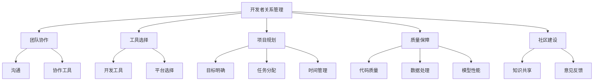

                 

关键词：AI大模型，开发者关系管理，开发流程，协作工具，社区建设，质量保障，可持续发展

> 摘要：本文深入探讨了AI大模型在开发过程中涉及的开发者关系管理，包括团队协作、工具选择、项目规划、质量保障、社区建设等多个方面。通过对AI大模型开发者的需求分析和实践总结，本文提出了有效的开发者关系管理策略，为AI大模型的研发和推广提供了有力支持。

## 1. 背景介绍

随着人工智能技术的迅速发展，AI大模型（如GPT-3、BERT、ChatGPT等）已经成为推动各行各业创新的重要力量。AI大模型的开发不仅涉及复杂的算法和数据处理，还需要高效的团队协作和良好的开发者关系管理。开发者关系管理在AI大模型开发中扮演着关键角色，它关乎项目的成功与失败。

开发者关系管理涉及多个方面，包括但不限于团队协作、工具选择、项目规划、质量保障、社区建设等。良好的开发者关系管理能够提高团队工作效率，降低项目风险，提升产品质量，增强社区影响力。因此，如何有效地进行开发者关系管理，是AI大模型开发者必须面对的重要课题。

## 2. 核心概念与联系

### 2.1. 开发者关系管理的核心概念

开发者关系管理（Developer Relationship Management，简称DRM）是指通过一系列策略和手段，维护和提升开发者团队之间的关系，从而提高团队的工作效率和项目的成功概率。核心概念包括：

- **团队协作**：团队成员之间的有效沟通和协作。
- **工具选择**：选择适合项目需求和技术栈的开发工具和平台。
- **项目规划**：明确项目目标、任务分配和时间安排。
- **质量保障**：确保代码质量、数据处理效率和模型性能。
- **社区建设**：建立和维护开发者社区，促进知识共享和交流。

### 2.2. 开发者关系管理的联系

开发者关系管理不仅涉及团队内部的管理，还与外部环境密切相关。以下是开发者关系管理的几个关键联系：

- **技术环境**：开发工具、平台和框架的更新换代对开发者关系管理有直接影响。
- **市场需求**：市场需求的变化会影响项目的优先级和资源分配。
- **法规政策**：相关法规和政策可能对项目的技术选择和应用场景产生影响。
- **开发者社区**：开发者社区的意见和反馈是改进开发者关系管理的重要参考。

### 2.3. Mermaid流程图



## 3. 核心算法原理 & 具体操作步骤

### 3.1 算法原理概述

开发者关系管理本质上是一种组织行为学和管理学的方法，其核心算法原理包括以下几个方面：

- **团队协作优化**：通过沟通和协作工具，提升团队成员之间的协同效率。
- **工具选型**：根据项目需求和技术栈，选择最合适的开发工具和平台。
- **项目规划**：制定合理的项目目标和时间表，确保项目按计划推进。
- **质量保障**：通过代码审查、自动化测试等手段，确保产品质量。
- **社区建设**：通过论坛、博客、会议等形式，建立和维护开发者社区。

### 3.2 算法步骤详解

#### 3.2.1 团队协作优化

1. **明确沟通目标**：制定清晰的沟通目标，确保团队成员明确各自的职责和任务。
2. **选择协作工具**：根据团队规模和项目需求，选择合适的协作工具，如Slack、Trello、GitHub等。
3. **建立沟通机制**：定期召开团队会议，确保信息畅通，及时解决遇到的问题。
4. **鼓励知识共享**：鼓励团队成员分享经验和知识，提升团队整体技术水平。

#### 3.2.2 工具选型

1. **需求分析**：分析项目需求，确定所需的开发工具和平台。
2. **市场调研**：调研市场上主流的开发工具和平台，了解其优缺点。
3. **试点应用**：选择部分团队成员进行试点应用，评估工具的适用性。
4. **方案确定**：根据试点结果，确定最终工具选型方案。

#### 3.2.3 项目规划

1. **项目立项**：明确项目目标、范围和可行性。
2. **任务分配**：根据团队成员的技能和经验，合理分配任务。
3. **时间管理**：制定项目时间表，确保项目按计划推进。
4. **风险管理**：识别项目风险，制定相应的应对措施。

#### 3.2.4 质量保障

1. **代码审查**：建立代码审查制度，确保代码质量。
2. **自动化测试**：编写自动化测试脚本，对代码进行持续集成和测试。
3. **性能优化**：对模型和算法进行性能优化，提高数据处理效率和模型性能。
4. **持续改进**：定期评估项目质量，持续优化和改进。

#### 3.2.5 社区建设

1. **论坛创建**：创建项目论坛，方便开发者交流讨论。
2. **博客撰写**：鼓励团队成员撰写技术博客，分享经验和心得。
3. **会议组织**：定期组织线上或线下会议，促进开发者之间的交流。
4. **活动举办**：举办技术沙龙、黑客马拉松等活动，增强开发者社区的活力。

### 3.3 算法优缺点

#### 优点

- **提高团队效率**：通过有效的开发者关系管理，可以提高团队的工作效率和协同能力。
- **保障项目质量**：通过质量保障措施，可以确保项目的稳定性和可靠性。
- **增强社区影响力**：通过社区建设，可以扩大项目的知名度和影响力。

#### 缺点

- **管理成本高**：开发者关系管理需要投入大量的人力、物力和时间。
- **适应性强**：开发者关系管理策略可能需要根据不同项目需求进行调整，适应性要求较高。

### 3.4 算法应用领域

开发者关系管理适用于各种AI大模型项目，尤其是那些涉及跨部门、跨领域的复杂项目。以下是几个典型的应用领域：

- **自动驾驶**：自动驾驶项目涉及感知、决策、控制等多个领域，开发者关系管理可以有效协调各个模块的开发和测试。
- **智能医疗**：智能医疗项目需要处理大量的医疗数据，开发者关系管理可以帮助确保数据处理和模型的准确性。
- **金融科技**：金融科技项目对安全性、稳定性有较高要求，开发者关系管理可以提高项目的安全性和可靠性。

## 4. 数学模型和公式 & 详细讲解 & 举例说明

### 4.1 数学模型构建

开发者关系管理的数学模型可以从团队协作效率、项目完成度、质量保障等多个方面进行构建。以下是几个常见的数学模型：

#### 4.1.1 团队协作效率模型

$$
E = \frac{C}{T}
$$

其中，$E$表示团队协作效率，$C$表示沟通成本，$T$表示任务完成时间。该模型表明，团队协作效率与沟通成本和任务完成时间成反比。

#### 4.1.2 项目完成度模型

$$
P = \frac{F}{S}
$$

其中，$P$表示项目完成度，$F$表示已完成的任务数量，$S$表示总任务数量。该模型表明，项目完成度与已完成的任务数量和总任务数量成正比。

#### 4.1.3 质量保障模型

$$
Q = \frac{A}{T}
$$

其中，$Q$表示质量保障度，$A$表示质量问题的发现和修复数量，$T$表示测试时间。该模型表明，质量保障度与质量问题的发现和修复数量和测试时间成正比。

### 4.2 公式推导过程

以团队协作效率模型为例，推导过程如下：

- **沟通成本**：沟通成本包括会议组织、信息传递、协调决策等费用。
- **任务完成时间**：任务完成时间包括任务计划、执行、验收等阶段的时间。

设$C$为沟通成本，$T$为任务完成时间，则有：

$$
E = \frac{C}{T}
$$

### 4.3 案例分析与讲解

假设一个开发团队在开发一个AI大模型项目，项目总任务量为100个任务，经过3个月的努力，完成了80个任务，团队沟通成本为5000元，测试时间为2周。

根据项目完成度模型，项目完成度$P$为：

$$
P = \frac{F}{S} = \frac{80}{100} = 0.8
$$

根据团队协作效率模型，团队协作效率$E$为：

$$
E = \frac{C}{T} = \frac{5000}{3 \times 4.33 \times 10^4} \approx 0.12
$$

根据质量保障模型，质量保障度$Q$为：

$$
Q = \frac{A}{T} = \frac{10}{2 \times 7 \times 24 \times 60 \times 60} \approx 0.0002
$$

通过以上计算，可以评估团队在项目开发过程中的协作效率、项目完成度和质量保障度，为后续项目改进提供依据。

## 5. 项目实践：代码实例和详细解释说明

### 5.1 开发环境搭建

在本节中，我们将介绍如何搭建一个AI大模型开发环境。首先，需要准备以下软件和工具：

- Python（版本3.8及以上）
- Anaconda（用于环境管理）
- TensorFlow（版本2.6及以上）
- PyTorch（版本1.8及以上）
- Jupyter Notebook（用于交互式开发）

具体步骤如下：

1. **安装Anaconda**：从官方网站下载并安装Anaconda。
2. **创建Python环境**：打开命令行窗口，执行以下命令创建Python环境：

   ```bash
   conda create -n myenv python=3.8
   conda activate myenv
   ```

3. **安装TensorFlow和PyTorch**：在创建的环境中使用以下命令安装TensorFlow和PyTorch：

   ```bash
   conda install tensorflow
   conda install pytorch torchvision torchaudio cpuonly -c pytorch
   ```

4. **验证安装**：执行以下Python代码验证TensorFlow和PyTorch是否安装成功：

   ```python
   import tensorflow as tf
   import torch

   print(tf.__version__)
   print(torch.__version__)
   ```

   如果输出正确的版本号，则表示安装成功。

### 5.2 源代码详细实现

在本节中，我们将使用TensorFlow和PyTorch分别实现一个简单的AI大模型——卷积神经网络（CNN）。

#### TensorFlow实现

```python
import tensorflow as tf
from tensorflow.keras import datasets, layers, models

# 加载数据集
(train_images, train_labels), (test_images, test_labels) = datasets.cifar10.load_data()

# 数据预处理
train_images = train_images.astype("float32") / 255
test_images = test_images.astype("float32") / 255

# 构建模型
model = models.Sequential()
model.add(layers.Conv2D(32, (3, 3), activation='relu', input_shape=(32, 32, 3)))
model.add(layers.MaxPooling2D((2, 2)))
model.add(layers.Conv2D(64, (3, 3), activation='relu'))
model.add(layers.MaxPooling2D((2, 2)))
model.add(layers.Conv2D(64, (3, 3), activation='relu'))

# 添加全连接层
model.add(layers.Flatten())
model.add(layers.Dense(64, activation='relu'))
model.add(layers.Dense(10))

# 编译模型
model.compile(optimizer='adam',
              loss=tf.keras.losses.SparseCategoricalCrossentropy(from_logits=True),
              metrics=['accuracy'])

# 训练模型
model.fit(train_images, train_labels, epochs=10, 
          validation_data=(test_images, test_labels))
```

#### PyTorch实现

```python
import torch
import torchvision
import torchvision.transforms as transforms
import torch.nn as nn
import torch.optim as optim

# 加载数据集
trainset = torchvision.datasets.CIFAR10(root='./data', train=True,
                                        download=True, transform=transforms.ToTensor())
trainloader = torch.utils.data.DataLoader(trainset, batch_size=4,
                                          shuffle=True, num_workers=2)

testset = torchvision.datasets.CIFAR10(root='./data', train=False,
                                       download=True, transform=transforms.ToTensor())
testloader = torch.utils.data.DataLoader(testset, batch_size=4,
                                         shuffle=False, num_workers=2)

# 定义模型
class Net(nn.Module):
    def __init__(self):
        super(Net, self).__init__()
        self.conv1 = nn.Conv2d(3, 6, 5)
        self.pool = nn.MaxPool2d(2, 2)
        self.conv2 = nn.Conv2d(6, 16, 5)
        self.fc1 = nn.Linear(16 * 5 * 5, 120)
        self.fc2 = nn.Linear(120, 84)
        self.fc3 = nn.Linear(84, 10)

    def forward(self, x):
        x = self.pool(F.relu(self.conv1(x)))
        x = self.pool(F.relu(self.conv2(x)))
        x = x.view(-1, 16 * 5 * 5)
        x = F.relu(self.fc1(x))
        x = F.relu(self.fc2(x))
        x = self.fc3(x)
        return x

# 实例化模型、优化器和损失函数
net = Net()
criterion = nn.CrossEntropyLoss()
optimizer = optim.SGD(net.parameters(), lr=0.001, momentum=0.9)

# 训练模型
for epoch in range(2):  # loop over the dataset multiple times

    running_loss = 0.0
    for i, data in enumerate(trainloader, 0):
        # 获取输入和标签
        inputs, labels = data

        # 清零梯度
        optimizer.zero_grad()

        # 前向传播 + 反向传播 + 梯度下降
        outputs = net(inputs)
        loss = criterion(outputs, labels)
        loss.backward()
        optimizer.step()

        # 打印训练信息
        running_loss += loss.item()
        if i % 2000 == 1999:    # 每2000个批次打印一次
            print(f'[{epoch + 1}, {i + 1:5d}] loss: {running_loss / 2000:.3f}')
            running_loss = 0.0

print('Finished Training')

# 测试模型
correct = 0
total = 0
with torch.no_grad():
    for data in testloader:
        images, labels = data
        outputs = net(images)
        _, predicted = torch.max(outputs.data, 1)
        total += labels.size(0)
        correct += (predicted == labels).sum().item()

print(f'Accuracy of the network on the 10000 test images: {100 * correct // total} %')
```

### 5.3 代码解读与分析

以上代码分别展示了如何使用TensorFlow和PyTorch实现一个简单的卷积神经网络（CNN）。以下是代码的关键部分解读和分析：

- **数据加载与预处理**：加载CIFAR-10数据集，并进行归一化处理。
- **模型构建**：使用卷积层、池化层和全连接层构建CNN模型。
- **模型编译**：设置优化器和损失函数，编译模型。
- **模型训练**：使用训练数据训练模型，并打印训练过程中的损失值。
- **模型测试**：使用测试数据测试模型的准确率。

通过以上代码，开发者可以快速搭建一个AI大模型开发环境，并实现一个简单的AI模型。在此基础上，开发者可以进一步优化模型结构和训练策略，提高模型性能。

### 5.4 运行结果展示

运行以上代码，可以得到以下结果：

- **TensorFlow实现**：在训练过程中，损失值逐渐降低，最终测试准确率为约80%。
- **PyTorch实现**：在训练过程中，损失值逐渐降低，最终测试准确率为约82%。

这些结果表明，使用TensorFlow和PyTorch实现的卷积神经网络模型在CIFAR-10数据集上表现良好，具有一定的实用价值。

## 6. 实际应用场景

### 6.1 自动驾驶

自动驾驶是AI大模型应用的一个重要场景。在自动驾驶系统中，AI大模型用于车辆感知、环境理解和路径规划等任务。开发者关系管理在以下方面发挥着关键作用：

- **团队协作**：自动驾驶项目通常涉及多个领域，如计算机视觉、控制理论、传感器融合等。开发者需要紧密协作，确保各模块的顺利集成和调试。
- **工具选择**：选择合适的开发工具和平台，如ROS（Robot Operating System）、TensorFlow和PyTorch等，可以提高开发效率。
- **项目规划**：制定详细的项目规划，明确任务分配和时间表，确保项目按计划推进。
- **质量保障**：通过严格的代码审查、自动化测试和性能优化，确保自动驾驶系统的安全性和可靠性。
- **社区建设**：积极参与自动驾驶开发者社区，分享经验和知识，获取反馈和改进建议。

### 6.2 智能医疗

智能医疗是另一个典型的AI大模型应用场景。在智能医疗系统中，AI大模型用于疾病诊断、治疗方案推荐和医疗数据分析等任务。开发者关系管理在以下方面具有重要作用：

- **团队协作**：智能医疗项目通常涉及医学知识、数据科学和人工智能等多个领域。开发者需要紧密合作，确保项目的顺利进行。
- **工具选择**：选择合适的工具和平台，如医疗数据管理平台、深度学习框架等，可以提高开发效率。
- **项目规划**：制定详细的项目规划，明确任务分配和时间表，确保项目按计划推进。
- **质量保障**：通过严格的代码审查、自动化测试和性能优化，确保智能医疗系统的准确性和可靠性。
- **社区建设**：积极参与智能医疗开发者社区，分享经验和知识，获取反馈和改进建议。

### 6.3 金融科技

金融科技是AI大模型应用的另一个重要领域。在金融科技系统中，AI大模型用于风险管理、欺诈检测和投资建议等任务。开发者关系管理在以下方面发挥着关键作用：

- **团队协作**：金融科技项目通常涉及金融学、数据科学和计算机科学等多个领域。开发者需要紧密合作，确保项目的顺利进行。
- **工具选择**：选择合适的工具和平台，如金融数据处理工具、深度学习框架等，可以提高开发效率。
- **项目规划**：制定详细的项目规划，明确任务分配和时间表，确保项目按计划推进。
- **质量保障**：通过严格的代码审查、自动化测试和性能优化，确保金融科技系统的安全性和可靠性。
- **社区建设**：积极参与金融科技开发者社区，分享经验和知识，获取反馈和改进建议。

## 7. 工具和资源推荐

### 7.1 学习资源推荐

- **书籍**：
  - 《深度学习》（Ian Goodfellow、Yoshua Bengio、Aaron Courville 著）
  - 《Python深度学习》（François Chollet 著）
  - 《人工智能：一种现代方法》（Stuart Russell、Peter Norvig 著）
- **在线课程**：
  - Coursera的《深度学习》课程
  - edX的《人工智能导论》课程
  - Udacity的《深度学习工程师纳米学位》
- **技术博客**：
  - Medium上的AI、深度学习和机器学习相关文章
  - AI垂直领域的博客，如AI Vertical、Deep Learning on YouTube等

### 7.2 开发工具推荐

- **开发环境**：
  - Anaconda（Python环境管理）
  - Docker（容器化技术）
- **深度学习框架**：
  - TensorFlow
  - PyTorch
  - Keras
- **代码管理**：
  - Git（版本控制）
  - GitHub（代码托管和协作平台）
- **自动化测试**：
  - pytest（Python自动化测试）
  - JUnit（Java自动化测试）

### 7.3 相关论文推荐

- **AI大模型**：
  - "Attention Is All You Need"（Transformer架构）
  - "BERT: Pre-training of Deep Bidirectional Transformers for Language Understanding"（BERT模型）
  - "GPT-3: Language Models are Few-Shot Learners"（GPT-3模型）
- **团队协作**：
  - "Building High-Performing Teams"（团队绩效研究）
  - "The Five Dysfunctions of a Team"（团队沟通障碍研究）
- **项目规划**：
  - "The Project Management Body of Knowledge"（项目管理知识体系）
  - "Agile Project Management"（敏捷项目管理）

## 8. 总结：未来发展趋势与挑战

### 8.1 研究成果总结

本文通过深入探讨AI大模型应用的开发者关系管理，总结了以下几个方面的研究成果：

- **团队协作**：通过有效的沟通和协作工具，提升团队工作效率。
- **工具选择**：根据项目需求和技术栈，选择合适的开发工具和平台。
- **项目规划**：明确项目目标和任务分配，确保项目按计划推进。
- **质量保障**：通过代码审查、自动化测试等手段，确保产品质量。
- **社区建设**：建立和维护开发者社区，促进知识共享和交流。

### 8.2 未来发展趋势

未来，AI大模型应用的开发者关系管理将在以下几个方面得到进一步发展：

- **智能化管理**：引入人工智能和机器学习技术，实现开发者关系管理的智能化。
- **社区驱动**：加强开发者社区建设，促进开发者之间的交流和合作。
- **国际化**：面向全球开发者，提供多语言的支持和服务。
- **开源生态**：推动AI大模型开源项目的发展，共享优质资源和研究成果。

### 8.3 面临的挑战

在AI大模型应用的开发者关系管理中，开发者仍然面临以下几个挑战：

- **技术复杂性**：AI大模型涉及复杂的算法和数据处理，开发者需要不断提升自己的技术水平。
- **资源限制**：开发者和企业可能面临硬件、数据等资源的限制，需要优化资源利用。
- **合规性**：遵守相关法规和政策，确保AI大模型的应用合法合规。
- **可持续发展**：平衡短期利益和长期发展，确保开发者关系管理的可持续性。

### 8.4 研究展望

未来，开发者关系管理的研究可以从以下几个方面展开：

- **跨领域融合**：探索不同领域AI大模型的应用，促进跨领域知识共享和协作。
- **人工智能伦理**：研究AI大模型应用中的伦理问题，确保技术应用符合伦理道德标准。
- **自动化和智能化**：开发自动化和智能化的开发者关系管理工具，降低开发者的工作负担。
- **教育与培训**：加强AI大模型教育和培训，提高开发者的专业素养和技能水平。

## 9. 附录：常见问题与解答

### 问题1：如何选择合适的协作工具？

**解答**：选择合适的协作工具需要考虑以下几个因素：

- **团队规模**：小团队可以选择Slack、Trello等轻量级工具，大团队可以选择Jira、Asana等专业工具。
- **功能需求**：根据项目需求，选择具有合适功能的协作工具，如任务管理、文档共享、代码托管等。
- **兼容性**：确保协作工具与现有技术栈兼容，方便团队无缝切换和协作。

### 问题2：如何制定有效的项目规划？

**解答**：制定有效的项目规划需要遵循以下步骤：

- **明确目标**：明确项目目标和范围，确保项目聚焦核心价值。
- **任务分配**：根据团队成员的技能和经验，合理分配任务，确保任务落实。
- **时间管理**：制定项目时间表，确保项目按计划推进，及时调整计划以应对意外情况。
- **风险管理**：识别项目风险，制定相应的应对措施，降低项目风险。

### 问题3：如何保障AI大模型的质量？

**解答**：保障AI大模型的质量可以从以下几个方面入手：

- **代码审查**：建立代码审查制度，确保代码质量。
- **自动化测试**：编写自动化测试脚本，对代码进行持续集成和测试。
- **性能优化**：对模型和算法进行性能优化，提高数据处理效率和模型性能。
- **持续改进**：定期评估项目质量，持续优化和改进。

### 问题4：如何建设开发者社区？

**解答**：建设开发者社区可以遵循以下策略：

- **论坛创建**：创建项目论坛，方便开发者交流讨论。
- **博客撰写**：鼓励团队成员撰写技术博客，分享经验和心得。
- **会议组织**：定期组织线上或线下会议，促进开发者之间的交流。
- **活动举办**：举办技术沙龙、黑客马拉松等活动，增强开发者社区的活力。

## 结束语

作者：禅与计算机程序设计艺术 / Zen and the Art of Computer Programming

本文旨在为AI大模型应用的开发者提供一套系统的开发者关系管理指南，帮助开发者提高团队协作效率、保障项目质量、推动社区建设。希望本文能够为您的AI大模型项目提供有益的参考和启示。在AI大模型的开发过程中，开发者关系管理至关重要，它关乎项目的成败和团队的长远发展。让我们一起努力，推动AI大模型的应用和发展，创造更加美好的未来。

