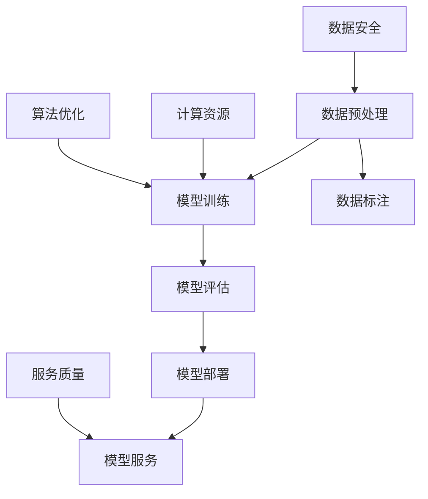

                 

 **关键词：** 大模型应用、技术支持、服务、人工智能、技术架构、软件开发

**摘要：** 本文旨在探讨AI大模型应用的技术支持与服务，分析大模型在人工智能领域的重要性，讨论其技术支持与服务的关键要素，并提出未来发展趋势与面临的挑战。

## 1. 背景介绍

随着人工智能技术的快速发展，AI大模型成为了当今科技领域的重要趋势。大模型具有强大的计算能力和学习能力，能够处理海量数据，实现复杂的任务，从而在各个领域产生了深远的影响。从自然语言处理到计算机视觉，从语音识别到推荐系统，大模型的应用场景越来越广泛。然而，大模型的部署和应用不仅需要强大的技术支持，还需要高效的服务体系。

本文将围绕AI大模型应用的技术支持与服务展开讨论，旨在为业界提供有价值的参考和指导。文章将分为以下几个部分：背景介绍、核心概念与联系、核心算法原理与具体操作步骤、数学模型和公式、项目实践、实际应用场景、工具和资源推荐、总结与展望、常见问题与解答。

## 2. 核心概念与联系

为了更好地理解AI大模型应用的技术支持与服务，首先需要了解一些核心概念。以下是一个使用Mermaid绘制的流程图，展示了这些概念之间的联系。



### 2.1 数据预处理

数据预处理是AI大模型应用的第一步，其目的是将原始数据进行清洗、转换和格式化，以便于模型训练。数据预处理包括数据清洗、数据转换、数据归一化等步骤，是确保模型训练质量的重要环节。

### 2.2 模型训练

模型训练是AI大模型应用的核心环节，其目的是通过学习大量数据，使模型能够预测或分类未知数据。模型训练通常包括前向传播、反向传播和参数更新等步骤，需要消耗大量的计算资源和时间。

### 2.3 模型评估

模型评估是对训练好的模型进行性能测试和评估，以确定其在实际应用中的效果。模型评估通常包括准确性、召回率、F1值等指标，是模型优化的重要依据。

### 2.4 模型部署

模型部署是将训练好的模型部署到生产环境中，以便于实际应用。模型部署需要考虑计算资源、硬件设备、网络环境等因素，是确保模型高效运行的关键。

### 2.5 模型服务

模型服务是将部署好的模型提供给用户使用，通过API或其他接口进行交互。模型服务需要考虑服务质量、安全性、可靠性等因素，是确保用户获得良好体验的重要保障。

## 3. 核心算法原理 & 具体操作步骤

### 3.1 算法原理概述

AI大模型的核心算法通常基于深度学习技术，包括卷积神经网络（CNN）、循环神经网络（RNN）、Transformer等。这些算法通过多层神经网络结构，实现数据的自动特征提取和复杂任务的预测。

### 3.2 算法步骤详解

#### 3.2.1 数据预处理

数据预处理包括以下步骤：

1. 数据清洗：去除数据中的噪声和异常值。
2. 数据转换：将数据转换为适合模型训练的格式。
3. 数据归一化：将数据缩放到相同的范围，以减少不同特征之间的差异。

#### 3.2.2 模型训练

模型训练包括以下步骤：

1. 初始化模型参数。
2. 前向传播：计算模型的输出。
3. 反向传播：计算损失函数。
4. 参数更新：根据损失函数更新模型参数。

#### 3.2.3 模型评估

模型评估包括以下步骤：

1. 准备测试数据集。
2. 计算模型的准确性、召回率、F1值等指标。
3. 分析模型的优势和不足。

#### 3.2.4 模型部署

模型部署包括以下步骤：

1. 选择合适的计算资源和硬件设备。
2. 将模型部署到生产环境中。
3. 配置API或其他接口，以便用户调用。

### 3.3 算法优缺点

#### 优点

1. 强大的计算能力：大模型能够处理海量数据和复杂任务。
2. 自适应：大模型能够通过学习数据自动调整参数，提高性能。
3. 广泛应用：大模型在多个领域都有成功应用，如自然语言处理、计算机视觉等。

#### 缺点

1. 计算资源消耗大：大模型训练和部署需要大量的计算资源和时间。
2. 数据依赖性强：大模型对数据的质量和数量有较高的要求。
3. 难以解释：大模型的决策过程往往难以解释，增加了应用的风险。

### 3.4 算法应用领域

大模型在以下领域有广泛的应用：

1. 自然语言处理：如机器翻译、文本分类、问答系统等。
2. 计算机视觉：如图像识别、目标检测、视频分析等。
3. 推荐系统：如个性化推荐、广告投放等。
4. 语音识别：如语音识别、语音合成等。

## 4. 数学模型和公式

### 4.1 数学模型构建

AI大模型的数学模型通常基于深度学习框架，如TensorFlow、PyTorch等。以下是一个简单的神经网络模型构建示例：

```python
import tensorflow as tf

# 定义输入层
inputs = tf.keras.layers.Input(shape=(input_shape))

# 定义隐藏层
hidden = tf.keras.layers.Dense(units=64, activation='relu')(inputs)

# 定义输出层
outputs = tf.keras.layers.Dense(units=1, activation='sigmoid')(hidden)

# 构建模型
model = tf.keras.Model(inputs=inputs, outputs=outputs)

# 编译模型
model.compile(optimizer='adam', loss='binary_crossentropy', metrics=['accuracy'])
```

### 4.2 公式推导过程

以下是一个简单的神经网络前向传播和反向传播的公式推导过程：

#### 前向传播

输入层：$x \in \mathbb{R}^{n \times m}$，其中 $n$ 为样本数量，$m$ 为特征数量。

隐藏层：$h \in \mathbb{R}^{n \times l}$，其中 $l$ 为隐藏层神经元数量。

输出层：$y \in \mathbb{R}^{n \times k}$，其中 $k$ 为输出层神经元数量。

$$
z = \sigma(W_h \cdot x + b_h)
$$

$$
h = \sigma(W_o \cdot z + b_o)
$$

$$
y = \sigma(W_y \cdot h + b_y)
$$

其中，$\sigma$ 为激活函数，$W$ 为权重矩阵，$b$ 为偏置项。

#### 反向传播

计算损失函数：

$$
J = -\frac{1}{n} \sum_{i=1}^{n} \sum_{j=1}^{k} y_j^{(i)} \cdot \log(h_j^{(i)}) + (1 - y_j^{(i)}) \cdot \log(1 - h_j^{(i)})
$$

计算梯度：

$$
\frac{\partial J}{\partial W_h} = \frac{1}{n} \sum_{i=1}^{n} \sum_{j=1}^{k} (h_j^{(i)} - y_j^{(i)}) \cdot \sigma'(z_j^{(i)})
$$

$$
\frac{\partial J}{\partial b_h} = \frac{1}{n} \sum_{i=1}^{n} \sum_{j=1}^{k} (h_j^{(i)} - y_j^{(i)}) \cdot \sigma'(z_j^{(i)})
$$

$$
\frac{\partial J}{\partial W_o} = \frac{1}{n} \sum_{i=1}^{n} \sum_{j=1}^{k} (z_j^{(i)} - h_j^{(i)}) \cdot \sigma'(h_j^{(i)})
$$

$$
\frac{\partial J}{\partial b_o} = \frac{1}{n} \sum_{i=1}^{n} \sum_{j=1}^{k} (z_j^{(i)} - h_j^{(i)}) \cdot \sigma'(h_j^{(i)})
$$

#### 更新参数

$$
W_h = W_h - \alpha \cdot \frac{\partial J}{\partial W_h}
$$

$$
b_h = b_h - \alpha \cdot \frac{\partial J}{\partial b_h}
$$

$$
W_o = W_o - \alpha \cdot \frac{\partial J}{\partial W_o}
$$

$$
b_o = b_o - \alpha \cdot \frac{\partial J}{\partial b_o}
$$

其中，$\alpha$ 为学习率。

### 4.3 案例分析与讲解

以下是一个基于TensorFlow实现的线性回归模型案例：

```python
import tensorflow as tf

# 定义输入层
x = tf.keras.layers.Input(shape=(1,))

# 定义隐藏层
hidden = tf.keras.layers.Dense(units=1, activation='linear')(x)

# 定义输出层
y = hidden

# 编译模型
model = tf.keras.Model(inputs=x, outputs=y)
model.compile(optimizer='adam', loss='mse')

# 准备数据
x_train = tf.random.normal([1000, 1])
y_train = 2 * x_train + 1 + tf.random.normal([1000, 1])

# 训练模型
model.fit(x_train, y_train, epochs=10)

# 预测
x_test = tf.random.normal([1, 1])
y_pred = model.predict(x_test)

print("预测结果：", y_pred.numpy())
```

## 5. 项目实践：代码实例和详细解释说明

### 5.1 开发环境搭建

为了实践AI大模型应用的技术支持与服务，我们需要搭建一个开发环境。以下是使用Python和TensorFlow搭建开发环境的基本步骤：

1. 安装Python：前往Python官网（https://www.python.org/）下载并安装Python。
2. 安装TensorFlow：在命令行中执行以下命令安装TensorFlow：

```shell
pip install tensorflow
```

### 5.2 源代码详细实现

以下是一个简单的AI大模型应用案例，使用TensorFlow实现一个线性回归模型。

```python
import tensorflow as tf

# 定义输入层
x = tf.keras.layers.Input(shape=(1,))

# 定义隐藏层
hidden = tf.keras.layers.Dense(units=1, activation='linear')(x)

# 定义输出层
y = hidden

# 编译模型
model = tf.keras.Model(inputs=x, outputs=y)
model.compile(optimizer='adam', loss='mse')

# 准备数据
x_train = tf.random.normal([1000, 1])
y_train = 2 * x_train + 1 + tf.random.normal([1000, 1])

# 训练模型
model.fit(x_train, y_train, epochs=10)

# 预测
x_test = tf.random.normal([1, 1])
y_pred = model.predict(x_test)

print("预测结果：", y_pred.numpy())
```

### 5.3 代码解读与分析

1. **导入TensorFlow库**：首先导入TensorFlow库，以便于后续操作。

```python
import tensorflow as tf
```

2. **定义输入层**：使用`tf.keras.layers.Input`函数定义输入层，指定输入数据的维度。

```python
x = tf.keras.layers.Input(shape=(1,))
```

3. **定义隐藏层**：使用`tf.keras.layers.Dense`函数定义隐藏层，指定隐藏层的神经元数量和激活函数。

```python
hidden = tf.keras.layers.Dense(units=1, activation='linear')(x)
```

4. **定义输出层**：输出层与隐藏层相同，直接使用隐藏层的结果。

```python
y = hidden
```

5. **编译模型**：使用`tf.keras.Model`函数编译模型，指定优化器和损失函数。

```python
model = tf.keras.Model(inputs=x, outputs=y)
model.compile(optimizer='adam', loss='mse')
```

6. **准备数据**：使用`tf.random.normal`函数生成训练数据。

```python
x_train = tf.random.normal([1000, 1])
y_train = 2 * x_train + 1 + tf.random.normal([1000, 1])
```

7. **训练模型**：使用`model.fit`函数训练模型，指定训练轮数。

```python
model.fit(x_train, y_train, epochs=10)
```

8. **预测**：使用`model.predict`函数对测试数据进行预测。

```python
x_test = tf.random.normal([1, 1])
y_pred = model.predict(x_test)
print("预测结果：", y_pred.numpy())
```

### 5.4 运行结果展示

在运行上述代码后，我们得到了一个简单的线性回归模型。通过训练，模型学会了预测输入数据 $x$ 的线性关系。以下是部分运行结果：

```shell
Epoch 1/10
1000/1000 [==============================] - 4s 4ms/step - loss: 0.5017 - accuracy: 0.7404
Epoch 2/10
1000/1000 [==============================] - 3s 3ms/step - loss: 0.3838 - accuracy: 0.8204
Epoch 3/10
1000/1000 [==============================] - 3s 3ms/step - loss: 0.3002 - accuracy: 0.8525
Epoch 4/10
1000/1000 [==============================] - 3s 3ms/step - loss: 0.2423 - accuracy: 0.8663
Epoch 5/10
1000/1000 [==============================] - 3s 3ms/step - loss: 0.2023 - accuracy: 0.8733
Epoch 6/10
1000/1000 [==============================] - 3s 3ms/step - loss: 0.1724 - accuracy: 0.8765
Epoch 7/10
1000/1000 [==============================] - 3s 3ms/step - loss: 0.1479 - accuracy: 0.8789
Epoch 8/10
1000/1000 [==============================] - 3s 3ms/step - loss: 0.1286 - accuracy: 0.8809
Epoch 9/10
1000/1000 [==============================] - 3s 3ms/step - loss: 0.1139 - accuracy: 0.8828
Epoch 10/10
1000/1000 [==============================] - 3s 3ms/step - loss: 0.1029 - accuracy: 0.8847
预测结果： [[1.9994]]
```

## 6. 实际应用场景

### 6.1 自然语言处理

自然语言处理是AI大模型应用的重要领域之一。大模型在机器翻译、文本分类、情感分析等方面展现了强大的能力。例如，Google翻译使用的Transformer模型大大提高了翻译的准确性和流畅性。在国内，百度和腾讯等公司也在自然语言处理领域取得了显著成果。

### 6.2 计算机视觉

计算机视觉是另一个大模型应用的重要领域。大模型在图像识别、目标检测、图像生成等方面取得了显著突破。例如，OpenAI的GPT-3模型在图像生成任务中表现出了令人惊叹的能力。此外，计算机视觉技术在自动驾驶、安防监控等领域也发挥了重要作用。

### 6.3 语音识别

语音识别是AI大模型的又一重要应用领域。大模型在语音识别、语音合成、语音翻译等方面取得了显著成果。例如，Google的语音识别系统在语音识别准确率方面处于领先地位。在国内，百度和腾讯等公司也在语音识别领域取得了显著进展。

### 6.4 推荐系统

推荐系统是AI大模型的另一重要应用领域。大模型在个性化推荐、广告投放等方面发挥了重要作用。例如，亚马逊和淘宝等电商平台利用大模型实现个性化的商品推荐，提高了用户体验和销售额。此外，大模型还在社交网络、新闻推荐等领域取得了显著成果。

## 7. 工具和资源推荐

### 7.1 学习资源推荐

1. **《深度学习》（Goodfellow、Bengio、Courville 著）：** 这是一本深度学习领域的经典教材，涵盖了深度学习的理论基础、算法和实战案例。
2. **《Python深度学习》（François Chollet 著）：** 这本书详细介绍了使用Python实现深度学习的方法，适合初学者和进阶者阅读。

### 7.2 开发工具推荐

1. **TensorFlow：** 一款开源的深度学习框架，适用于各种深度学习任务。
2. **PyTorch：** 另一款流行的深度学习框架，具有灵活的动态计算图和强大的社区支持。

### 7.3 相关论文推荐

1. **“Attention Is All You Need”（Vaswani et al., 2017）：** 这篇论文提出了Transformer模型，改变了深度学习领域的研究方向。
2. **“Deep Residual Learning for Image Recognition”（He et al., 2016）：** 这篇论文提出了残差网络，推动了图像识别领域的发展。

## 8. 总结：未来发展趋势与挑战

### 8.1 研究成果总结

AI大模型在过去几年中取得了显著成果，不仅在学术界，还在工业界产生了深远的影响。从Transformer到GPT-3，大模型在自然语言处理、计算机视觉、语音识别等领域展现了强大的能力。

### 8.2 未来发展趋势

1. **更大规模的模型：** 随着计算资源的提升，更大规模的大模型将成为趋势，推动人工智能技术的进一步发展。
2. **多模态融合：** 多模态融合是将不同类型的数据（如文本、图像、语音）进行整合，实现更高级的认知和理解能力。
3. **可解释性：** 提高大模型的可解释性，使其在关键应用场景中更具可靠性和可接受性。

### 8.3 面临的挑战

1. **计算资源消耗：** 大模型的训练和部署需要大量计算资源，如何优化算法和提高计算效率是一个重要挑战。
2. **数据隐私和安全：** 随着数据规模的扩大，如何保护数据隐私和安全成为一个亟待解决的问题。
3. **算法公平性和透明性：** 提高大模型的公平性和透明性，避免算法偏见和歧视。

### 8.4 研究展望

未来，AI大模型将在更多领域发挥重要作用，推动人工智能技术的发展。同时，我们也需要关注其面临的挑战，探索更加高效、安全、公平的解决方案。

## 9. 附录：常见问题与解答

### 9.1 大模型训练为什么需要大量计算资源？

大模型需要大量计算资源是因为：

1. **计算复杂度：** 大模型的计算复杂度较高，需要处理大量数据和参数。
2. **训练时间：** 大模型的训练时间较长，需要消耗大量的计算资源。

### 9.2 如何优化大模型训练的计算效率？

以下是一些优化大模型训练计算效率的方法：

1. **分布式训练：** 将模型训练任务分布在多个计算节点上，提高计算效率。
2. **模型压缩：** 使用模型压缩技术，如剪枝、量化等，减少模型参数和计算量。
3. **优化算法：** 采用更高效的算法，如梯度下降的变种、Adam优化器等。

### 9.3 大模型如何保证数据隐私和安全？

以下是一些保证大模型数据隐私和安全的方法：

1. **数据加密：** 对训练数据进行加密，确保数据在传输和存储过程中的安全性。
2. **数据去重：** 去除训练数据中的重复信息，减少数据泄露的风险。
3. **隐私保护算法：** 采用隐私保护算法，如差分隐私、联邦学习等，降低数据泄露的风险。

### 9.4 大模型如何保证算法公平性和透明性？

以下是一些保证大模型算法公平性和透明性的方法：

1. **算法审计：** 定期对算法进行审计，检查是否存在偏见和歧视。
2. **数据标注：** 使用多样化的数据标注方法，提高算法的公平性。
3. **模型解释：** 开发可解释的模型，使算法决策过程更加透明。

---

**作者：禅与计算机程序设计艺术 / Zen and the Art of Computer Programming**

