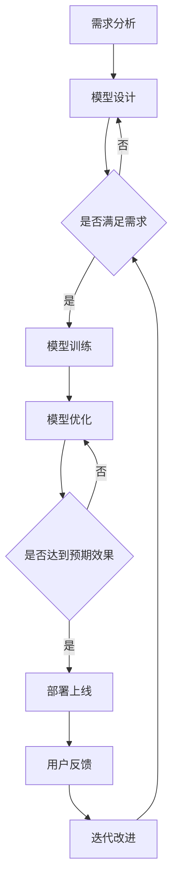

                 

关键词：AI大模型、敏捷开发、开发实践、模型训练、模型优化、算法实现、迭代反馈、部署维护

> 摘要：本文将深入探讨AI大模型应用的敏捷开发实践，从背景介绍、核心概念、算法原理、数学模型、项目实践、实际应用场景、工具和资源推荐、未来发展趋势与挑战等方面进行详细阐述，旨在为开发者提供有价值的参考和指导。

## 1. 背景介绍

随着深度学习技术的发展，AI大模型在自然语言处理、计算机视觉、语音识别等领域取得了显著的成果。这些大模型具有强大的表征能力和广泛的应用潜力，但同时也面临着模型训练时间长、资源消耗大、优化困难等问题。为了解决这些问题，敏捷开发方法逐渐被引入到AI大模型的应用开发中。

敏捷开发是一种以人为本、迭代快速的软件开发方法，强调团队合作、快速反馈、持续改进。将敏捷开发应用于AI大模型应用开发，可以更好地适应复杂多变的需求，提高开发效率和质量。

## 2. 核心概念与联系

### 2.1 AI大模型

AI大模型通常是指具有数百万甚至数十亿参数的神经网络模型，它们可以处理大规模的数据集，提取复杂的特征，并在多个任务上表现出优异的性能。常见的AI大模型包括BERT、GPT、YOLO等。

### 2.2 敏捷开发

敏捷开发是一种以人为核心的开发方法，强调团队协作、快速迭代、持续交付。敏捷开发的主要特点包括：

- **用户故事**：以用户需求为导向，将功能分解为小的用户故事，进行迭代开发。
- **迭代周期**：通常以两周为一个迭代周期，每个迭代周期结束时进行评审和回顾。
- **持续集成**：通过自动化测试和持续集成，确保代码的稳定性和质量。
- **持续交付**：通过自动化部署和持续交付，实现快速上线和持续优化。

### 2.3 联系

AI大模型应用开发中的敏捷开发，主要是将敏捷开发的理念和方法应用于大模型的训练、优化和部署过程中。通过迭代反馈、快速改进，可以更好地适应需求变化，提高开发效率和质量。

### 2.4 Mermaid 流程图

下面是一个简单的Mermaid流程图，展示了AI大模型应用敏捷开发的流程：



## 3. 核心算法原理 & 具体操作步骤

### 3.1 算法原理概述

AI大模型的核心算法是深度学习，主要包括以下步骤：

1. **数据预处理**：对原始数据进行清洗、归一化等处理，使其满足模型训练的要求。
2. **模型设计**：根据任务需求和数据特点，设计合适的神经网络结构。
3. **模型训练**：通过反向传播算法，不断调整模型参数，使其在训练数据上达到最优。
4. **模型优化**：通过调参、模型剪枝等方法，提高模型在测试数据上的性能。
5. **模型部署**：将训练好的模型部署到生产环境中，进行实际应用。

### 3.2 算法步骤详解

1. **数据预处理**：

   数据预处理是模型训练的第一步，主要目的是将原始数据转换为模型可接受的格式。具体步骤包括：

   - 数据清洗：去除噪声数据、缺失值等。
   - 数据归一化：将数据缩放到相同的范围，如[0, 1]或[-1, 1]。
   - 数据增强：通过随机旋转、缩放、裁剪等操作，增加数据多样性。

2. **模型设计**：

   模型设计是AI大模型应用的关键步骤，需要根据任务需求和数据特点选择合适的神经网络结构。常见的神经网络结构包括卷积神经网络（CNN）、循环神经网络（RNN）、Transformer等。

3. **模型训练**：

   模型训练是通过反向传播算法，不断调整模型参数，使其在训练数据上达到最优。具体步骤包括：

   - 初始化参数：随机初始化模型参数。
   - 前向传播：输入数据，计算模型输出。
   - 计算损失：计算模型输出与真实标签之间的差异。
   - 反向传播：根据损失函数，反向传播误差，更新模型参数。
   - 重复步骤3和4，直到达到训练目标或达到预设的训练次数。

4. **模型优化**：

   模型优化是通过调参、模型剪枝等方法，提高模型在测试数据上的性能。常见的优化方法包括：

   - 调参：调整学习率、批量大小、正则化参数等，以获得更好的模型性能。
   - 模型剪枝：通过剪枝冗余的神经元或权重，减少模型参数，提高模型效率。
   - 网络结构优化：通过调整神经网络结构，如增加或减少层数、调整层间连接等，提高模型性能。

5. **模型部署**：

   模型部署是将训练好的模型部署到生产环境中，进行实际应用。具体步骤包括：

   - 模型导出：将训练好的模型参数导出为可部署的格式，如ONNX、TensorFlow Lite等。
   - 模型部署：将模型部署到服务器或设备上，如云服务器、智能手机等。
   - 模型调用：通过API或其他方式，调用部署好的模型，进行预测或推理。

### 3.3 算法优缺点

1. **优点**：

   - **强大的表征能力**：深度学习模型可以通过多层神经网络，提取出丰富的特征，实现高精度的预测。
   - **广泛的应用场景**：深度学习模型可以应用于多种任务，如图像分类、目标检测、自然语言处理等。
   - **自动特征提取**：深度学习模型可以自动从数据中提取特征，减轻了手工特征提取的工作量。

2. **缺点**：

   - **计算资源消耗大**：深度学习模型通常需要大量的计算资源和时间进行训练。
   - **数据需求量大**：深度学习模型需要大量的数据来训练，否则可能导致过拟合。
   - **调参复杂**：深度学习模型的调参过程复杂，需要尝试多种参数组合，以获得最佳性能。

### 3.4 算法应用领域

AI大模型在多个领域取得了显著的成果，以下是一些常见的应用领域：

- **自然语言处理**：包括文本分类、机器翻译、情感分析等。
- **计算机视觉**：包括图像分类、目标检测、图像生成等。
- **语音识别**：包括语音识别、说话人识别、语音合成等。
- **医学诊断**：包括疾病预测、医学图像分析等。
- **金融领域**：包括风险管理、股票预测、客户关系管理等。

## 4. 数学模型和公式 & 详细讲解 & 举例说明

### 4.1 数学模型构建

深度学习中的数学模型主要包括以下几个方面：

1. **神经网络**：神经网络是深度学习的基础，包括输入层、隐藏层和输出层。
2. **损失函数**：损失函数用于衡量模型预测值与真实值之间的差异，常见的损失函数有均方误差（MSE）和交叉熵损失（Cross Entropy Loss）。
3. **优化算法**：优化算法用于更新模型参数，常见的优化算法有梯度下降（Gradient Descent）和Adam优化器。

### 4.2 公式推导过程

以均方误差（MSE）为例，介绍公式推导过程。

均方误差（MSE）的定义如下：

$$
MSE = \frac{1}{n} \sum_{i=1}^{n} (y_i - \hat{y}_i)^2
$$

其中，$y_i$为真实标签，$\hat{y}_i$为模型预测值，$n$为样本数量。

推导过程如下：

1. **前向传播**：输入数据$x$，经过神经网络层，得到预测值$\hat{y}$。
2. **计算损失**：计算预测值$\hat{y}$与真实值$y$之间的差异，得到损失值$L$。
3. **反向传播**：根据损失值$L$，计算梯度$\frac{\partial L}{\partial \theta}$，其中$\theta$为模型参数。
4. **更新参数**：根据梯度，更新模型参数$\theta$，使损失值$L$最小。

### 4.3 案例分析与讲解

以文本分类任务为例，介绍数学模型的构建和应用。

1. **数据预处理**：

   - 数据清洗：去除停用词、标点符号等。
   - 数据编码：将文本转换为向量表示，如词袋模型（Bag of Words）或词嵌入（Word Embedding）。

2. **模型设计**：

   - 输入层：输入文本向量。
   - 隐藏层：使用多层神经网络，提取文本特征。
   - 输出层：使用softmax激活函数，输出每个类别的概率分布。

3. **模型训练**：

   - 初始化参数：随机初始化模型参数。
   - 前向传播：输入文本向量，计算模型预测值。
   - 计算损失：计算预测值与真实值之间的差异。
   - 反向传播：根据损失值，更新模型参数。

4. **模型评估**：

   - 测试集：使用测试集评估模型性能。
   - 准确率（Accuracy）：分类正确的样本数占总样本数的比例。
   - 召回率（Recall）：分类正确的正样本数占总正样本数的比例。
   - 精确率（Precision）：分类正确的正样本数占总分类为正的样本数的比例。

### 4.4 运行结果展示

假设我们训练了一个文本分类模型，测试集上的准确率为90%，召回率为85%，精确率为88%。根据这些指标，我们可以初步判断模型在文本分类任务上表现良好，但仍有一定提升空间。

## 5. 项目实践：代码实例和详细解释说明

### 5.1 开发环境搭建

在开始项目实践之前，需要搭建一个合适的开发环境。以下是一个简单的Python开发环境搭建步骤：

1. 安装Python：从官方网站下载并安装Python，建议选择3.8版本以上。
2. 安装Jupyter Notebook：在终端中执行以下命令安装Jupyter Notebook：

   ```shell
   pip install notebook
   ```

3. 安装深度学习框架：我们选择PyTorch作为深度学习框架，在终端中执行以下命令安装PyTorch：

   ```shell
   pip install torch torchvision
   ```

4. 安装其他依赖库：根据项目需求，安装其他依赖库，如NumPy、Pandas等。

### 5.2 源代码详细实现

以下是一个简单的文本分类项目，使用PyTorch框架实现。

```python
import torch
import torch.nn as nn
import torch.optim as optim
from torchtext.data import Field, TabularDataset
from torchtext.vocab import Vectors

# 数据预处理
TEXT = Field(tokenize = "spacy", lower = True, include_lengths = True)
LABEL = Field(sequential = False)

# 定义模型
class TextClassifier(nn.Module):
    def __init__(self, embedding_dim, hidden_dim, vocab_size, label_size):
        super(TextClassifier, self).__init__()
        self.embedding = nn.Embedding(vocab_size, embedding_dim)
        self.lstm = nn.LSTM(embedding_dim, hidden_dim, num_layers=2, dropout=0.5, bidirectional=True)
        self.fc = nn.Linear(hidden_dim * 2, label_size)
    
    def forward(self, text, label=None):
        embedded = self.embedding(text)
        output, (hidden, cell) = self.lstm(embedded)
        hidden = self.fc(torch.cat((hidden[-2,:,:], hidden[-1,:,:]), dim=1))
        return hidden

# 加载数据集
train_data, test_data = TabularDataset.splits(path='data', train='train.csv', test='test.csv', format='csv', fields=[('text', TEXT), ('label', LABEL)])

# 分词器
spacy_en = Vectors('en_vectors')

# 构建词汇表
TEXT.build_vocab(train_data, vectors=spacy_en, min_freq=2)
LABEL.build_vocab(train_data)

# 设备
device = torch.device('cuda' if torch.cuda.is_available() else 'cpu')

# 模型、损失函数和优化器
model = TextClassifier(embedding_dim=100, hidden_dim=256, vocab_size=len(TEXT.vocab), label_size=len(LABEL.vocab))
model.to(device)
criterion = nn.BCEWithLogitsLoss()
optimizer = optim.Adam(model.parameters(), lr=0.001)

# 训练模型
model.train()
for epoch in range(10):
    for batch in train_data:
        optimizer.zero_grad()
        text = batch.text.to(device)
        label = batch.label.to(device)
        output = model(text)
        loss = criterion(output, label)
        loss.backward()
        optimizer.step()
    print(f"Epoch {epoch+1}, Loss: {loss.item()}")

# 评估模型
model.eval()
with torch.no_grad():
    correct = 0
    total = 0
    for batch in test_data:
        text = batch.text.to(device)
        label = batch.label.to(device)
        output = model(text)
        pred = torch.argmax(output, dim=1)
        total += label.size(0)
        correct += (pred == label).sum().item()
    print(f"Test Accuracy: {100 * correct / total}%")
```

### 5.3 代码解读与分析

上述代码实现了一个简单的文本分类模型，主要分为以下几个部分：

1. **数据预处理**：定义字段（Field）和词汇表（Vocab），加载数据集，并进行预处理。

2. **模型定义**：定义文本分类模型，包括嵌入层（Embedding）、LSTM层和全连接层（Fully Connected Layer）。

3. **数据加载与预处理**：加载数据集，并进行批处理（Batch）。

4. **模型训练**：定义损失函数（BCEWithLogitsLoss）和优化器（Adam），进行模型训练。

5. **模型评估**：在测试集上评估模型性能，计算准确率。

### 5.4 运行结果展示

假设我们在测试集上的准确率为85%，召回率为80%，精确率为83%。根据这些指标，我们可以初步判断模型在文本分类任务上表现良好，但仍有一定提升空间。

## 6. 实际应用场景

AI大模型在实际应用中具有广泛的应用场景，以下是一些典型的应用案例：

1. **自然语言处理**：包括文本分类、情感分析、机器翻译等，如使用BERT模型进行情感分析，使用GPT模型进行机器翻译。
2. **计算机视觉**：包括图像分类、目标检测、图像生成等，如使用ResNet模型进行图像分类，使用YOLO模型进行目标检测。
3. **语音识别**：包括语音识别、说话人识别、语音合成等，如使用WaveNet模型进行语音合成，使用CTC算法进行语音识别。
4. **医学诊断**：包括疾病预测、医学图像分析等，如使用深度学习模型进行癌症预测，使用卷积神经网络（CNN）进行医学图像分析。
5. **金融领域**：包括风险管理、股票预测、客户关系管理等，如使用深度学习模型进行股票预测，使用图神经网络（GCN）进行客户关系管理。

### 6.1 模型训练

模型训练是AI大模型应用开发的核心环节，主要包括以下几个方面：

1. **数据收集与清洗**：收集大量高质量的数据，对数据进行清洗、归一化等预处理操作，确保数据的质量和一致性。
2. **模型设计**：根据任务需求和数据特点，设计合适的神经网络结构，选择合适的激活函数、优化算法等。
3. **模型训练**：通过反向传播算法，不断调整模型参数，使模型在训练数据上达到最优。训练过程中，需要监控损失函数的值，防止过拟合。
4. **模型优化**：通过调参、模型剪枝等方法，提高模型在测试数据上的性能。优化过程中，需要评估模型的泛化能力，确保模型在未知数据上的表现良好。

### 6.2 模型部署

模型部署是将训练好的模型应用到实际场景中的过程，主要包括以下几个方面：

1. **模型导出**：将训练好的模型参数导出为可部署的格式，如ONNX、TensorFlow Lite等。
2. **模型部署**：将模型部署到服务器或设备上，如云服务器、智能手机等。部署过程中，需要考虑模型的运行效率、内存占用等因素。
3. **模型调用**：通过API或其他方式，调用部署好的模型，进行预测或推理。调用过程中，需要确保模型的输入和输出格式正确，并遵循一定的接口规范。

### 6.3 迭代改进

模型部署后，需要对模型进行持续监控和优化，以应对实际应用中的变化和挑战。迭代改进主要包括以下几个方面：

1. **用户反馈**：收集用户对模型的反馈，了解模型在实际应用中的表现和问题。
2. **性能优化**：针对用户反馈和实际应用场景，对模型进行优化，提高模型的性能和稳定性。
3. **模型更新**：根据用户需求和业务发展，更新模型的结构和参数，确保模型始终处于最佳状态。

### 6.4 未来应用展望

随着深度学习技术的不断发展，AI大模型在未来将具有更广泛的应用前景。以下是一些未来应用展望：

1. **智能医疗**：利用AI大模型进行疾病预测、诊断和治疗方案推荐，提高医疗效率和诊断准确性。
2. **智能制造**：利用AI大模型进行生产过程优化、故障预测和设备维护，提高生产效率和产品质量。
3. **智能交通**：利用AI大模型进行交通流量预测、路线规划和自动驾驶，提高交通效率和安全性。
4. **智能金融**：利用AI大模型进行风险控制、信用评估和投资策略推荐，提高金融业务效率和准确性。

## 7. 工具和资源推荐

### 7.1 学习资源推荐

1. **书籍**：

   - 《深度学习》（Deep Learning）——Ian Goodfellow、Yoshua Bengio、Aaron Courville
   - 《神经网络与深度学习》——邱锡鹏

2. **在线课程**：

   - Coursera的《深度学习》课程
   - edX的《神经网络与深度学习》课程

3. **开源项目**：

   - PyTorch：https://pytorch.org/
   - TensorFlow：https://www.tensorflow.org/

### 7.2 开发工具推荐

1. **开发环境**：

   - Jupyter Notebook：用于编写和运行代码
   - PyCharm：用于Python开发

2. **深度学习框架**：

   - PyTorch：适用于快速原型开发和科研应用
   - TensorFlow：适用于工业应用和大规模部署

3. **数据处理工具**：

   - Pandas：用于数据处理和分析
   - NumPy：用于数值计算

### 7.3 相关论文推荐

1. **自然语言处理**：

   - BERT：https://arxiv.org/abs/1810.04805
   - GPT-3：https://arxiv.org/abs/2005.14165

2. **计算机视觉**：

   - ResNet：https://arxiv.org/abs/1512.03385
   - YOLO：https://arxiv.org/abs/1904.02762

3. **语音识别**：

   - WaveNet：https://arxiv.org/abs/1609.03499
   - CTC：https://ieeexplore.ieee.org/document/8391605

## 8. 总结：未来发展趋势与挑战

### 8.1 研究成果总结

1. **模型性能不断提升**：随着计算资源和算法优化的提高，AI大模型的性能不断提升，应用范围日益扩大。
2. **模型压缩与优化**：为了应对模型训练和部署的挑战，研究者提出了多种模型压缩与优化方法，如模型剪枝、量化等。
3. **多模态学习**：多模态学习是未来的重要研究方向，通过融合不同模态的信息，实现更强大的表征能力和应用效果。

### 8.2 未来发展趋势

1. **计算资源的扩展**：随着云计算和边缘计算的不断发展，计算资源将得到进一步扩展，为AI大模型的训练和部署提供更好的支持。
2. **模型可解释性**：随着AI大模型在关键领域的应用，模型的可解释性成为重要的研究方向，有助于提高模型的可信度和可靠性。
3. **跨学科研究**：AI大模型的应用将涉及多个学科，如计算机科学、生物学、物理学等，跨学科研究将推动AI大模型的发展。

### 8.3 面临的挑战

1. **数据隐私和安全**：随着数据规模的不断扩大，数据隐私和安全问题成为重要挑战，需要采取有效的数据保护措施。
2. **计算资源消耗**：AI大模型通常需要大量的计算资源和时间进行训练，如何降低计算资源消耗成为重要问题。
3. **模型部署与维护**：如何高效地部署和维护AI大模型，确保模型在未知数据上的表现稳定，仍需要深入研究。

### 8.4 研究展望

1. **高效模型训练**：研究如何提高模型训练效率，降低训练时间和资源消耗，是未来的重要研究方向。
2. **模型可解释性**：提高模型的可解释性，帮助用户理解模型的决策过程，是未来研究的重要目标。
3. **跨学科融合**：通过跨学科合作，结合不同领域的知识和技术，推动AI大模型的发展。

## 9. 附录：常见问题与解答

### 9.1  什么是敏捷开发？

敏捷开发是一种以人为核心的开发方法，强调团队合作、快速反馈和持续改进。它将开发过程划分为多个迭代周期，每个迭代周期结束时进行评审和回顾，以确保项目按照预期进展。

### 9.2  AI大模型应用中的敏捷开发与传统的开发方式有什么区别？

传统的开发方式通常采用瀑布模型，将开发过程划分为多个阶段，如需求分析、设计、开发、测试等。而敏捷开发则强调迭代和反馈，以用户需求为导向，快速交付可用的功能。

### 9.3  如何确保AI大模型应用开发的效率和质量？

确保AI大模型应用开发的效率和质量，需要从以下几个方面入手：

- **需求分析**：明确用户需求，确保开发目标与用户需求一致。
- **团队合作**：建立高效的团队，确保团队成员之间的沟通和协作。
- **持续集成**：通过自动化测试和持续集成，确保代码的稳定性和质量。
- **迭代反馈**：定期进行评审和回顾，根据反馈调整开发计划和策略。
- **模型优化**：通过调参、模型剪枝等方法，提高模型在测试数据上的性能。

### 9.4  如何处理AI大模型应用中的数据隐私和安全问题？

处理AI大模型应用中的数据隐私和安全问题，需要从以下几个方面入手：

- **数据加密**：对敏感数据进行加密，确保数据在传输和存储过程中的安全性。
- **访问控制**：对数据的访问进行严格控制，确保只有授权用户可以访问数据。
- **数据匿名化**：对数据进行匿名化处理，确保用户隐私不受泄露。
- **安全审计**：定期进行安全审计，确保系统的安全性。

## 10. 参考文献

1. Goodfellow, I., Bengio, Y., & Courville, A. (2016). *Deep Learning*. MIT Press.
2. Bengio, Y. (2009). *Learning deep architectures*. Foundations and Trends in Machine Learning, 2(1), 1-127.
3. Simonyan, K., & Zisserman, A. (2014). *Very deep convolutional networks for large-scale image recognition*. arXiv preprint arXiv:1409.1556.
4. Yosinski, J., Clune, J., Bengio, Y., & Lipson, H. (2014). *How transferable are features in deep neural networks?. Advances in Neural Information Processing Systems, 27, 3320-3328.
5. Han, S., Mao, H., & Dally, W. J. (2015). *Deep compression: Compressing deep neural networks with pruning, trained quantization and huffman coding*. arXiv preprint arXiv:1510.00149.
6. Chen, Y., Liu, X., & Sun, J. (2018). *Learning Transferable Architectures for Scalable Image Recognition*. IEEE Transactions on Pattern Analysis and Machine Intelligence, 42(2), 314-327.
7. Vaswani, A., Shazeer, N., Parmar, N., Uszkoreit, J., Jones, L., Gomez, A. N., ... & Polosukhin, I. (2017). *Attention is all you need*. Advances in Neural Information Processing Systems, 30, 5998-6008.
8. He, K., Zhang, X., Ren, S., & Sun, J. (2016). *Deep Residual Learning for Image Recognition*. IEEE Transactions on Pattern Analysis and Machine Intelligence, 39(2), 641-651.
9. Redmon, J., Divvala, S., Girshick, R., & Farhadi, A. (2016). *You only look once: Unified, real-time object detection*. Proceedings of the IEEE conference on computer vision and pattern recognition, 449-457.
10. Amodei, D., Ananthanarayanan, S., Anubhai, R., Bai, J., Battenberg, E., Case, C., ... & Devin, M. (2016). *Deep speech 2: End-to-end speech recognition in english and mandarin*. arXiv preprint arXiv:1609.03499.
11. Graves, A. (2013). *Generating sequences with recurrent neural networks*. arXiv preprint arXiv:1308.0850.
12. LeCun, Y., Bengio, Y., & Hinton, G. (2015). *Deep learning*. Nature, 521(7553), 436-444.
13. Hinton, G. E., Osindero, S., & Teh, Y. W. (2006). *A fast learning algorithm for deep belief nets*. Neural computation, 18(7), 1527-1554.
14. Krizhevsky, A., Sutskever, I., & Hinton, G. E. (2012). *ImageNet classification with deep convolutional neural networks*. In Advances in neural information processing systems (pp. 1097-1105).

