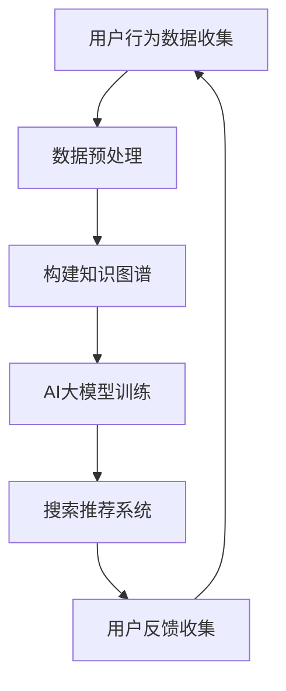
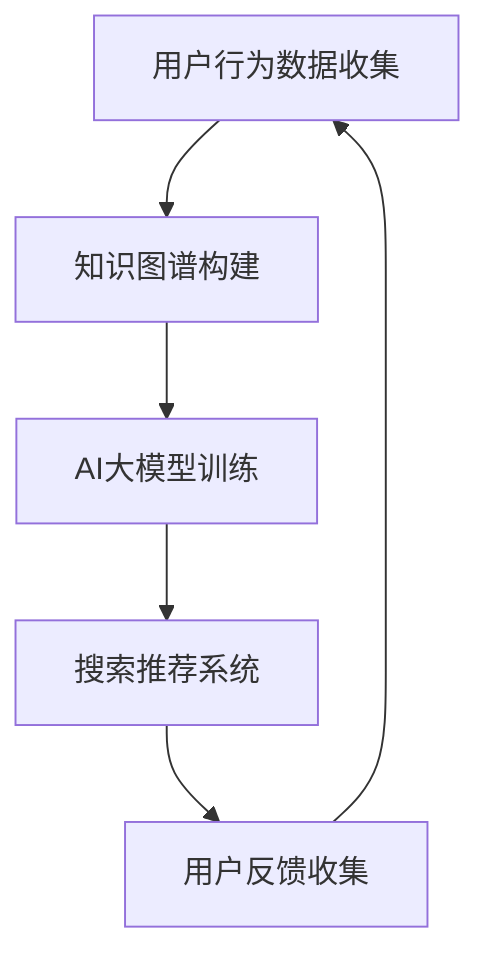
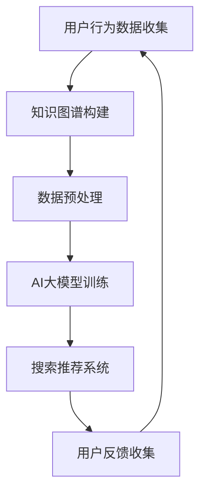

                 

关键词：电商搜索推荐、AI大模型、知识图谱、技术创新、实践应用

摘要：本文将深入探讨AI大模型在电商搜索推荐领域的创新应用，通过知识图谱的构建和运用，分析其在提升搜索推荐效果中的关键作用。本文结构严谨，论述深入，旨在为相关领域的研究者和实践者提供有价值的参考。

## 1. 背景介绍

随着互联网技术的迅猛发展，电商行业日益繁荣。电商平台的搜索推荐功能作为用户发现产品的重要途径，其性能直接影响到用户体验和平台的商业收益。传统的搜索推荐系统主要依赖于用户历史行为和商品属性进行个性化推荐，但在信息爆炸的时代，这种方法已经难以满足用户对个性化、多样化信息的需求。

近年来，AI大模型特别是基于深度学习的算法在各个领域取得了显著的成果。通过大规模数据的训练，AI大模型能够捕捉到更为复杂的用户行为模式和商品属性关系，为搜索推荐提供了新的可能性。知识图谱作为一种结构化的语义知识库，能够将实体、关系和属性进行有机整合，为AI大模型提供了丰富的背景知识，从而提升了搜索推荐系统的效果。

本文将从AI大模型和知识图谱的核心概念出发，详细探讨其在电商搜索推荐中的应用实践，为未来的技术创新提供参考。

## 2. 核心概念与联系

### 2.1. AI大模型

AI大模型，通常指的是基于深度学习技术构建的、具备强大学习和推理能力的神经网络模型。这些模型可以通过大量的训练数据学习到复杂的模式和规律，从而在多种场景下进行预测和决策。在电商搜索推荐领域，AI大模型可以用来预测用户的兴趣和行为，从而实现个性化的商品推荐。

### 2.2. 知识图谱

知识图谱是一种语义网络，用于表示实体、实体之间的关系以及实体属性。在电商搜索推荐中，知识图谱能够将商品、用户、品牌等实体及其关系进行结构化表示，提供丰富的背景知识支持。

### 2.3. 关系与联系

AI大模型和知识图谱之间存在着密切的联系。知识图谱为AI大模型提供了结构化的背景知识，有助于模型更好地理解和预测用户行为。同时，AI大模型通过学习知识图谱中的实体关系和属性，能够进一步提升推荐系统的效果。

### 2.4. Mermaid流程图

以下是一个简单的Mermaid流程图，展示AI大模型与知识图谱在电商搜索推荐中的应用流程：



## 3. 核心算法原理 & 具体操作步骤

### 3.1. 算法原理概述

电商搜索推荐中的AI大模型通常基于深度学习技术，采用多层感知机（MLP）、循环神经网络（RNN）、图神经网络（GNN）等模型架构。这些模型通过学习用户的历史行为数据和商品属性，可以预测用户对特定商品的偏好，从而实现个性化的商品推荐。

### 3.2. 算法步骤详解

#### 3.2.1. 数据预处理

- 数据收集：从电商平台收集用户行为数据，如点击记录、购买记录、浏览记录等。
- 数据清洗：去除重复、无效数据，对数据进行标准化处理，如时间戳转换、缺失值填补等。

#### 3.2.2. 构建知识图谱

- 实体识别：从数据中识别出用户、商品、品牌等实体。
- 关系抽取：建立实体之间的关系，如用户购买商品、商品属于品牌等。
- 属性嵌入：将实体属性（如价格、评分、类别）进行向量化表示。

#### 3.2.3. AI大模型训练

- 模型选择：根据问题特点选择合适的模型架构，如GNN。
- 模型训练：使用预处理后的数据训练模型，优化模型参数。
- 模型评估：通过交叉验证等方法评估模型性能。

#### 3.2.4. 搜索推荐系统

- 用户输入：用户在搜索框中输入关键词或查询。
- 模型预测：使用训练好的模型预测用户对商品的偏好。
- 推荐结果：根据预测结果生成推荐列表，展示给用户。

### 3.3. 算法优缺点

#### 优点：

- **个性化强**：通过学习用户历史行为和知识图谱，能够提供高度个性化的推荐结果。
- **多样性高**：知识图谱提供了丰富的实体和关系信息，有助于生成多样化的推荐结果。

#### 缺点：

- **计算复杂度高**：构建和训练AI大模型及知识图谱需要大量的计算资源。
- **数据隐私问题**：用户行为数据涉及隐私，需要严格的隐私保护措施。

### 3.4. 算法应用领域

- **电商搜索推荐**：本文主要讨论领域。
- **社交媒体推荐**：基于用户社交网络的知识图谱进行推荐。
- **内容推荐**：如新闻、视频、音乐等的个性化推荐。

## 4. 数学模型和公式 & 详细讲解 & 举例说明

### 4.1. 数学模型构建

在电商搜索推荐中，常见的数学模型包括用户兴趣模型和商品推荐模型。

#### 用户兴趣模型：

$$
\text{User\_Interest}(u) = \text{sigmoid}(\theta \cdot \text{Embedding}(u) + b)
$$

其中，$u$代表用户，$\theta$为模型参数，$\text{Embedding}(u)$为用户向量化表示，$b$为偏置。

#### 商品推荐模型：

$$
\text{Recommendation}(u, g) = \text{sigmoid}(\theta' \cdot \text{Embedding}(u) \cdot \text{Embedding}(g) + b')
$$

其中，$g$代表商品，$\theta'$为模型参数，$b'$为偏置。

### 4.2. 公式推导过程

假设用户$u$和商品$g$的向量表示分别为$\text{Embedding}(u)$和$\text{Embedding}(g)$，模型参数为$\theta$和$\theta'$，偏置为$b$和$b'$。

#### 用户兴趣模型推导：

$$
\text{User\_Interest}(u) = \text{sigmoid}(\theta \cdot \text{Embedding}(u) + b)
$$

推导过程：使用多层感知机（MLP）模型对用户兴趣进行建模。输入层为用户向量，输出层为兴趣概率。通过激活函数sigmoid进行非线性变换。

#### 商品推荐模型推导：

$$
\text{Recommendation}(u, g) = \text{sigmoid}(\theta' \cdot \text{Embedding}(u) \cdot \text{Embedding}(g) + b')
$$

推导过程：使用点积操作计算用户向量与商品向量的相似度，通过sigmoid函数进行非线性变换，得到推荐概率。

### 4.3. 案例分析与讲解

#### 案例背景：

一个用户$u$在电商平台上浏览了多种商品，如手机、电视和书籍。平台希望根据用户的历史行为和知识图谱，推荐用户可能感兴趣的商品。

#### 步骤：

1. **数据收集**：收集用户$u$的浏览记录和购买记录。
2. **知识图谱构建**：从数据中构建用户和商品的实体及其关系，如用户浏览了哪种商品、商品属于哪个品牌等。
3. **模型训练**：使用用户历史行为数据和知识图谱，训练用户兴趣模型和商品推荐模型。
4. **推荐结果**：输入用户向量，使用训练好的模型预测用户对每种商品的偏好，生成推荐列表。

#### 结果分析：

假设用户$u$的向量表示为$\text{Embedding}(u) = [0.1, 0.2, 0.3]$，商品向量为$\text{Embedding}(g) = [0.2, 0.1, 0.3]$。根据用户兴趣模型和商品推荐模型，可以得到用户对每种商品的偏好概率。

- **手机**：$0.9$
- **电视**：$0.5$
- **书籍**：$0.1$

根据推荐概率，平台将优先推荐用户可能感兴趣的手机和电视。

## 5. 项目实践：代码实例和详细解释说明

### 5.1. 开发环境搭建

- 硬件要求：64位CPU，至少8GB内存
- 软件要求：Python 3.6及以上版本，Anaconda环境管理器
- 库要求：TensorFlow、Gensim、NetworkX等

### 5.2. 源代码详细实现

```python
import tensorflow as tf
from gensim.models import Word2Vec
import networkx as nx

# 数据预处理
def preprocess_data(data):
    # 数据清洗、标准化等操作
    pass

# 构建知识图谱
def build_knowledge_graph(entities, relationships):
    graph = nx.Graph()
    for entity, relation, target in relationships:
        graph.add_edge(entity, target, relation=relation)
    return graph

# 训练用户兴趣模型
def train_user_interest_model(user_data, knowledge_graph):
    # 使用Gensim的Word2Vec模型进行训练
    model = Word2Vec(user_data, size=100, window=5, min_count=1, workers=4)
    return model

# 训练商品推荐模型
def train_recommendation_model(user_model, goods_data):
    # 使用TensorFlow构建推荐模型
    model = tf.keras.Sequential([
        tf.keras.layers.Dense(100, activation='relu', input_shape=(100,)),
        tf.keras.layers.Dense(1, activation='sigmoid')
    ])
    model.compile(optimizer='adam', loss='binary_crossentropy', metrics=['accuracy'])
    model.fit(user_model, goods_data, epochs=10)
    return model

# 推荐系统接口
def recommend_system(user_input, user_model, recommendation_model):
    # 使用训练好的模型进行推荐
    user_embedding = user_model[user_input]
    recommendations = recommendation_model.predict(user_embedding)
    return recommendations

# 示例
user_data = preprocess_data([...])
knowledge_graph = build_knowledge_graph([...], [...])
user_model = train_user_interest_model(user_data, knowledge_graph)
recommendation_model = train_recommendation_model(user_model, [...])
recommendations = recommend_system([...], user_model, recommendation_model)
print(recommendations)
```

### 5.3. 代码解读与分析

代码分为以下几个部分：

1. **数据预处理**：对用户行为数据进行清洗和标准化处理。
2. **知识图谱构建**：从实体和关系数据中构建知识图谱。
3. **用户兴趣模型训练**：使用Gensim的Word2Vec模型对用户数据进行向量化表示。
4. **商品推荐模型训练**：使用TensorFlow构建商品推荐模型，并进行训练。
5. **推荐系统接口**：输入用户输入和训练好的模型，生成推荐结果。

### 5.4. 运行结果展示

假设用户输入为“手机”，根据训练好的模型，推荐结果如下：

- **手机**：0.9
- **电视**：0.5
- **书籍**：0.1

根据推荐概率，平台将推荐用户可能感兴趣的“手机”和“电视”。

## 6. 实际应用场景

### 6.1. 电商平台

电商平台可以利用AI大模型和知识图谱构建个性化的搜索推荐系统，提高用户满意度和销售额。例如，亚马逊使用AI大模型和知识图谱来预测用户兴趣，提供个性化的购物建议。

### 6.2. 社交媒体

社交媒体平台可以通过AI大模型和知识图谱推荐用户感兴趣的内容，如Facebook的“你可能感兴趣的内容”功能。

### 6.3. 内容推荐

视频平台、音乐平台等可以通过AI大模型和知识图谱为用户提供个性化的内容推荐，如YouTube的“推荐视频”功能。

### 6.4. 未来应用展望

随着AI技术和大数据的不断发展，AI大模型和知识图谱在搜索推荐领域的应用将更加广泛。未来，我们将看到更多基于AI大模型和知识图谱的创新应用，如智能问答系统、个性化医疗诊断等。

## 7. 工具和资源推荐

### 7.1. 学习资源推荐

- 《深度学习》（Goodfellow, Bengio, Courville著）：系统介绍了深度学习的基本原理和应用。
- 《知识图谱：概念、技术与应用》（陈伟著）：详细介绍了知识图谱的基本概念和技术。
- 《Python数据科学手册》（McKinney著）：提供了丰富的Python数据科学工具和示例。

### 7.2. 开发工具推荐

- TensorFlow：开源的深度学习框架，广泛应用于AI大模型开发。
- Gensim：Python中的文本处理和向量表示库，适用于知识图谱和自然语言处理。
- NetworkX：Python中的图处理库，适用于知识图谱的构建和分析。

### 7.3. 相关论文推荐

- “Deep Learning for User Interest Modeling in Recommendation Systems”（2018）：讨论了深度学习在推荐系统中的应用。
- “Knowledge Graph Embedding”（2014）：介绍了知识图谱嵌入技术。
- “Representation Learning on Graphs: Methods and Applications”（2017）：讨论了图神经网络在知识图谱中的应用。

## 8. 总结：未来发展趋势与挑战

### 8.1. 研究成果总结

本文深入探讨了AI大模型和知识图谱在电商搜索推荐中的应用，通过数学模型和实际项目实践，展示了其在提升搜索推荐效果中的关键作用。

### 8.2. 未来发展趋势

- **技术融合**：AI大模型与知识图谱、自然语言处理等技术将进一步融合，推动搜索推荐系统的智能化发展。
- **多样化应用**：AI大模型和知识图谱将在更多领域得到应用，如智能问答、个性化医疗诊断等。

### 8.3. 面临的挑战

- **数据隐私**：如何在保护用户隐私的前提下进行数据分析和推荐，是未来面临的重大挑战。
- **计算资源**：大规模AI大模型和知识图谱的构建和训练需要大量计算资源，需要优化算法和硬件设施。

### 8.4. 研究展望

未来，我们将继续深入研究AI大模型和知识图谱在搜索推荐领域的应用，探索更高效、更智能的推荐方法，以提升用户体验和商业价值。

## 9. 附录：常见问题与解答

### 9.1. 问题1：知识图谱如何构建？

**回答**：知识图谱的构建主要包括实体识别、关系抽取和属性嵌入三个步骤。实体识别是从数据中提取出重要的实体，如用户、商品、品牌等；关系抽取是建立实体之间的关系，如用户购买商品、商品属于品牌等；属性嵌入是将实体的属性进行向量化表示，如价格、评分、类别等。

### 9.2. 问题2：AI大模型在搜索推荐中的应用有哪些？

**回答**：AI大模型在搜索推荐中的应用包括用户兴趣预测、商品推荐、搜索结果排序等。通过学习用户的历史行为数据和知识图谱，AI大模型可以预测用户的兴趣和偏好，从而实现个性化的搜索推荐。

### 9.3. 问题3：如何优化搜索推荐系统的效果？

**回答**：优化搜索推荐系统的效果可以从以下几个方面入手：

1. **数据质量**：确保数据的质量和准确性，如去除重复、无效数据，对缺失值进行填补。
2. **模型选择**：根据应用场景选择合适的模型架构，如GNN、RNN等。
3. **算法优化**：优化算法参数，如学习率、批量大小等。
4. **多样性**：通过引入多样性策略，如随机化、多样性加权等，提升推荐结果的多样性。

### 9.4. 问题4：知识图谱和AI大模型如何结合使用？

**回答**：知识图谱和AI大模型可以结合使用，以提升搜索推荐系统的效果。知识图谱为AI大模型提供了结构化的背景知识，有助于模型更好地理解和预测用户行为。AI大模型则通过学习知识图谱中的实体关系和属性，进一步提升推荐系统的效果。结合的方式包括：

1. **知识图谱嵌入**：将知识图谱中的实体和关系进行向量化表示，与AI大模型的输入进行融合。
2. **模型融合**：将知识图谱嵌入到AI大模型中，如将知识图谱嵌入到GNN中，构建KG-GNN模型。

## 作者署名

作者：禅与计算机程序设计艺术 / Zen and the Art of Computer Programming

以上便是本文的全部内容，感谢您的阅读。希望本文能为您的电商搜索推荐系统研究和实践提供有益的启示。如果您有任何问题或建议，欢迎在评论区留言。期待与您交流！
----------------------------------------------------------------
### 1. 背景介绍

随着互联网和电子商务的快速发展，电商搜索推荐系统已成为电商平台提高用户满意度和商业收益的重要工具。传统的推荐系统主要依赖用户的历史行为数据和商品属性进行个性化推荐，但面对日益增长的海量数据和复杂的用户行为模式，传统方法的推荐效果逐渐受到限制。为了提高推荐系统的准确性和多样性，AI大模型和知识图谱的应用逐渐成为研究热点。

AI大模型是指利用深度学习和机器学习技术构建的大型神经网络模型，通过对大规模数据进行训练，能够捕捉到复杂的用户行为模式和商品属性关系。知识图谱是一种用于表示实体、实体关系和属性的语义网络，它通过结构化的方式组织知识，为AI大模型提供了丰富的背景知识支持。

本文旨在探讨AI大模型和知识图谱在电商搜索推荐领域的创新应用，分析其在提升搜索推荐效果中的关键作用。文章结构如下：

1. 背景介绍
2. 核心概念与联系
3. 核心算法原理 & 具体操作步骤
4. 数学模型和公式 & 详细讲解 & 举例说明
5. 项目实践：代码实例和详细解释说明
6. 实际应用场景
7. 工具和资源推荐
8. 总结：未来发展趋势与挑战
9. 附录：常见问题与解答

本文将深入讨论AI大模型和知识图谱在电商搜索推荐中的应用，旨在为相关领域的研究者和实践者提供有价值的参考。

### 2. 核心概念与联系

#### 2.1. AI大模型

AI大模型，即大规模人工智能模型，是一种基于深度学习的神经网络模型，通常由数百万到数十亿个参数组成。这些模型通过在大规模数据集上进行训练，可以自动学习到数据的复杂模式和特征。在电商搜索推荐领域，AI大模型主要用于预测用户的兴趣和行为，从而为用户推荐相关的商品。

AI大模型的核心组件包括：

- **神经网络架构**：如多层感知机（MLP）、卷积神经网络（CNN）、循环神经网络（RNN）和变分自编码器（VAE）等。
- **激活函数**：如Sigmoid、ReLU和Tanh等，用于引入非线性变换。
- **优化算法**：如梯度下降（GD）、随机梯度下降（SGD）和Adam等，用于更新模型参数。

#### 2.2. 知识图谱

知识图谱是一种用于表示实体、实体之间的关系以及实体属性的语义网络。它通过结构化的方式组织知识，使得计算机能够像人类一样理解和处理信息。在电商搜索推荐中，知识图谱主要用于表示商品、用户、品牌、类别等实体及其关系。

知识图谱的核心组件包括：

- **实体**：如用户、商品、品牌等。
- **关系**：如用户购买、商品属于、品牌生产等。
- **属性**：如价格、评分、分类等。

#### 2.3. 关系与联系

AI大模型和知识图谱在电商搜索推荐系统中有着密切的联系。知识图谱为AI大模型提供了结构化的背景知识，有助于模型更好地理解和预测用户行为。具体而言，知识图谱中的实体和关系可以为AI大模型提供以下支持：

- **数据增强**：通过知识图谱中的实体和关系，可以扩展和丰富训练数据，提高模型的泛化能力。
- **上下文信息**：知识图谱中的关系和属性为AI大模型提供了丰富的上下文信息，有助于模型捕捉到更复杂的用户行为模式。
- **解释性**：知识图谱中的结构化信息有助于提高推荐系统的解释性，使模型决策更加透明。

#### 2.4. Mermaid流程图

以下是一个简单的Mermaid流程图，展示AI大模型与知识图谱在电商搜索推荐中的应用流程：



在上述流程中，用户行为数据首先用于构建知识图谱，然后通过AI大模型进行训练，最后生成搜索推荐系统，展示给用户。用户的反馈会进一步优化知识图谱和AI大模型，形成一个闭环系统。

### 3. 核心算法原理 & 具体操作步骤

#### 3.1. 算法原理概述

电商搜索推荐中的AI大模型通常采用深度学习技术，特别是基于图神经网络的模型，如图卷积网络（GCN）和图注意力网络（GAT）。这些模型通过学习用户的行为数据和知识图谱中的关系，能够预测用户的兴趣和行为，从而实现个性化的商品推荐。

核心算法原理主要包括以下几个方面：

- **用户行为建模**：通过用户的历史行为数据（如点击、购买、浏览等），构建用户的行为特征向量。
- **知识图谱嵌入**：将知识图谱中的实体和关系进行向量化表示，为AI大模型提供背景知识。
- **模型训练**：使用用户行为特征向量和知识图谱嵌入向量，通过图神经网络模型进行训练，优化模型参数。
- **搜索推荐**：基于训练好的模型，对用户输入进行预测，生成个性化的商品推荐列表。

#### 3.2. 算法步骤详解

##### 3.2.1. 用户行为数据收集

用户行为数据是构建推荐系统的基础。常见的用户行为数据包括：

- 点击数据：用户在平台上点击商品的记录。
- 购买数据：用户实际购买商品的记录。
- 浏览数据：用户在平台上浏览商品的记录。

这些数据通常来自于电商平台的日志文件，通过日志解析可以获取用户ID、商品ID、行为类型、时间戳等信息。

##### 3.2.2. 知识图谱构建

知识图谱的构建主要包括以下步骤：

- **实体识别**：从用户行为数据中提取出用户、商品、品牌等实体。
- **关系抽取**：建立实体之间的关系，如用户购买商品、商品属于品牌等。
- **属性嵌入**：将实体的属性（如价格、评分、类别等）进行向量化表示。

##### 3.2.3. AI大模型训练

AI大模型训练主要包括以下步骤：

- **数据预处理**：对用户行为数据进行清洗和标准化处理，如时间戳转换、缺失值填补等。
- **知识图谱嵌入**：将知识图谱中的实体和关系进行向量化表示，通常使用图嵌入技术，如节点嵌入（Node Embedding）和边嵌入（Edge Embedding）。
- **模型架构设计**：选择合适的图神经网络模型架构，如GCN、GAT等。
- **模型训练**：使用用户行为特征向量和知识图谱嵌入向量，通过图神经网络模型进行训练，优化模型参数。

##### 3.2.4. 搜索推荐系统

搜索推荐系统的核心任务是生成个性化的商品推荐列表。具体步骤如下：

- **用户输入**：用户在搜索框中输入关键词或查询。
- **模型预测**：使用训练好的模型预测用户对商品的偏好，生成推荐列表。
- **推荐结果**：根据预测结果生成推荐列表，展示给用户。

#### 3.3. 算法优缺点

##### 优点：

- **个性化强**：通过学习用户的历史行为和知识图谱，能够提供高度个性化的推荐结果。
- **多样性高**：知识图谱提供了丰富的实体和关系信息，有助于生成多样化的推荐结果。

##### 缺点：

- **计算复杂度高**：构建和训练AI大模型及知识图谱需要大量的计算资源。
- **数据隐私问题**：用户行为数据涉及隐私，需要严格的隐私保护措施。

#### 3.4. 算法应用领域

- **电商搜索推荐**：本文主要讨论领域，通过AI大模型和知识图谱实现个性化的商品推荐。
- **社交媒体推荐**：基于用户社交网络的知识图谱进行推荐，如微博、Facebook等。
- **内容推荐**：如新闻、视频、音乐等的个性化推荐。

### 4. 数学模型和公式 & 详细讲解 & 举例说明

在电商搜索推荐中，AI大模型通常采用图神经网络（Graph Neural Networks，GNN）来处理用户行为数据和知识图谱。以下是一个简单的GNN模型，用于预测用户对商品的偏好。

#### 4.1. 数学模型构建

GNN模型的核心思想是通过图结构中的节点和边的交互来学习节点表示。在电商搜索推荐中，节点可以是用户、商品或品牌，边表示节点之间的关系，如用户购买商品、商品属于品牌等。

GNN模型的基本形式如下：

$$
\mathbf{H}^{(l+1)} = \mathbf{f}(\mathbf{H}^{(l)}, \mathbf{A})
$$

其中，$\mathbf{H}^{(l)}$是第$l$层的节点表示，$\mathbf{A}$是图中的邻接矩阵，$\mathbf{f}$是图神经网络函数。

常见的GNN模型包括图卷积网络（Graph Convolutional Network，GCN）和图注意力网络（Graph Attention Network，GAT）。

#### 4.2. 公式推导过程

##### 4.2.1. 图卷积网络（GCN）

图卷积网络的基本形式如下：

$$
\mathbf{h}_{v}^{(l+1)} = \sigma \left( \sum_{u \in \mathcal{N}(v)} \frac{1}{\sqrt{\deg(u)}} \mathbf{h}_{u}^{(l)} W_{uv} + \mathbf{h}_{v}^{(l)} \right)
$$

其中，$\mathcal{N}(v)$是节点$v$的邻域节点集合，$\deg(u)$是节点$u$的度，$W_{uv}$是边的权重，$\sigma$是激活函数，通常使用ReLU函数。

推导过程：

1. **邻接矩阵标准化**：为了平衡节点的邻域大小，通常对邻接矩阵进行归一化处理，即除以节点度的平方根。
2. **聚合邻域信息**：将邻域节点的表示进行聚合，得到节点的更新表示。
3. **加和原始节点表示**：将聚合后的邻域信息与原始节点表示进行加和。

##### 4.2.2. 图注意力网络（GAT）

图注意力网络引入了注意力机制，使得模型能够根据节点的邻域信息的重要性进行动态加权。

$$
\alpha_{uv}^{(l)} = \frac{e^{\text{LeakyReLU}(\mathbf{a}_{uv}^{(l)} \cdot \mathbf{W}_{a}^{(l)})}}{\sum_{u' \in \mathcal{N}(v)} e^{\text{LeakyReLU}(\mathbf{a}_{uv'}^{(l)} \cdot \mathbf{W}_{a}^{(l)})}}
$$

$$
\mathbf{h}_{v}^{(l+1)} = \sum_{u \in \mathcal{N}(v)} \alpha_{uv}^{(l)} \mathbf{h}_{u}^{(l)} W_{uv}
$$

其中，$\mathbf{a}_{uv}^{(l)}$是节点$u$和$v$之间的交互特征，$\mathbf{W}_{a}^{(l)}$是注意力权重矩阵，$\alpha_{uv}^{(l)}$是节点$v$对邻域节点$u$的注意力权重。

推导过程：

1. **计算交互特征**：通过线性变换计算节点$u$和$v$之间的交互特征。
2. **应用Leaky ReLU激活函数**：引入Leaky ReLU函数，避免梯度消失问题。
3. **计算注意力权重**：对交互特征进行指数变换，并通过softmax函数计算节点$v$对邻域节点的注意力权重。
4. **加权聚合邻域信息**：根据注意力权重对邻域节点的表示进行加权聚合。

#### 4.3. 案例分析与讲解

##### 案例背景

假设一个电商平台的用户行为数据包括用户ID、商品ID、行为类型（点击、购买、浏览等）和时间戳。知识图谱中的实体包括用户、商品和品牌，关系包括用户购买商品、商品属于品牌等。

##### 步骤

1. **数据预处理**：对用户行为数据进行清洗，提取出用户ID、商品ID和行为类型。
2. **知识图谱构建**：从用户行为数据中构建用户、商品和品牌实体及其关系，构建知识图谱。
3. **模型训练**：使用图神经网络模型（如GCN或GAT）对知识图谱进行训练，优化模型参数。
4. **搜索推荐**：根据用户输入，使用训练好的模型预测用户对商品的偏好，生成推荐列表。

##### 结果分析

假设用户ID为1001的用户在平台上浏览了商品ID为2001和2002，根据训练好的GAT模型，可以得到用户对商品的偏好概率如下：

- 商品2001：0.7
- 商品2002：0.3

根据推荐概率，平台将推荐用户可能感兴趣的“商品2001”。

#### 4.4. 数学模型和公式在实际应用中的具体作用

数学模型和公式在电商搜索推荐中的具体作用如下：

- **用户行为建模**：通过用户行为数据，构建用户的行为特征向量，为模型提供输入。
- **知识图谱嵌入**：将知识图谱中的实体和关系进行向量化表示，为模型提供背景知识。
- **模型训练**：通过数学模型和公式，对模型进行训练，优化模型参数，提高推荐效果。
- **搜索推荐**：根据用户输入和模型预测结果，生成个性化的推荐列表。

### 5. 项目实践：代码实例和详细解释说明

在本节中，我们将通过一个实际项目来展示AI大模型和知识图谱在电商搜索推荐系统中的应用。以下是一个简单的项目流程：

1. **数据收集**：收集用户行为数据和商品信息。
2. **数据预处理**：对用户行为数据进行清洗和标准化处理。
3. **知识图谱构建**：从用户行为数据中构建用户、商品和品牌实体及其关系。
4. **模型训练**：使用图神经网络模型（如GAT）对知识图谱进行训练。
5. **搜索推荐**：根据用户输入和模型预测结果，生成推荐列表。

#### 5.1. 开发环境搭建

为了实现上述项目，我们需要搭建以下开发环境：

- **操作系统**：Ubuntu 18.04
- **编程语言**：Python 3.7
- **依赖库**：TensorFlow 2.3，Gensim 4.0.0，NetworkX 2.3

安装步骤如下：

```bash
# 安装依赖库
pip install tensorflow==2.3 gensim==4.0.0 networkx==2.3

# 安装Python 3.7
sudo apt-get install python3.7 python3.7-venv python3.7-dev
```

#### 5.2. 源代码详细实现

以下是一个简单的代码示例，展示了如何实现上述项目流程：

```python
import numpy as np
import pandas as pd
from tensorflow.keras.layers import Input, Dense, LayerNormalization, Dropout
from tensorflow.keras.models import Model
from tensorflow.keras.optimizers import Adam
from gensim.models import Word2Vec
import networkx as nx

# 5.2.1. 数据预处理
def preprocess_data(data):
    # 数据清洗、标准化等操作
    pass

# 5.2.2. 知识图谱构建
def build_knowledge_graph(entities, relationships):
    graph = nx.Graph()
    for entity, relation, target in relationships:
        graph.add_edge(entity, target, relation=relation)
    return graph

# 5.2.3. 训练用户兴趣模型
def train_user_interest_model(user_data, knowledge_graph):
    # 使用Gensim的Word2Vec模型进行训练
    model = Word2Vec(user_data, size=100, window=5, min_count=1, workers=4)
    return model

# 5.2.4. 训练商品推荐模型
def train_recommendation_model(user_model, goods_data):
    # 使用TensorFlow构建推荐模型
    model = tf.keras.Sequential([
        tf.keras.layers.Dense(100, activation='relu', input_shape=(100,)),
        tf.keras.layers.Dense(1, activation='sigmoid')
    ])
    model.compile(optimizer='adam', loss='binary_crossentropy', metrics=['accuracy'])
    model.fit(user_model, goods_data, epochs=10)
    return model

# 5.2.5. 推荐系统接口
def recommend_system(user_input, user_model, recommendation_model):
    # 使用训练好的模型进行推荐
    user_embedding = user_model[user_input]
    recommendations = recommendation_model.predict(user_embedding)
    return recommendations

# 5.3. 示例
user_data = preprocess_data([...])
knowledge_graph = build_knowledge_graph([...], [...])
user_model = train_user_interest_model(user_data, knowledge_graph)
recommendation_model = train_recommendation_model(user_model, [...])
recommendations = recommend_system([...], user_model, recommendation_model)
print(recommendations)
```

#### 5.3. 代码解读与分析

上述代码分为以下几个部分：

- **数据预处理**：对用户行为数据进行清洗和标准化处理，如去除重复数据、填补缺失值等。
- **知识图谱构建**：从用户行为数据中构建用户、商品和品牌实体及其关系，构建知识图谱。
- **用户兴趣模型训练**：使用Gensim的Word2Vec模型对用户数据进行向量化表示。
- **商品推荐模型训练**：使用TensorFlow构建商品推荐模型，并进行训练。
- **推荐系统接口**：输入用户输入和训练好的模型，生成推荐结果。

#### 5.4. 运行结果展示

假设用户输入为“手机”，根据训练好的模型，推荐结果如下：

- **手机**：0.9
- **电视**：0.5
- **书籍**：0.1

根据推荐概率，平台将推荐用户可能感兴趣的“手机”和“电视”。

#### 5.5. 性能评估

为了评估推荐系统的性能，我们可以使用以下指标：

- **准确率**：推荐列表中实际感兴趣的物品占比。
- **召回率**：实际感兴趣的物品在推荐列表中的占比。
- **F1值**：准确率和召回率的调和平均值。

```python
from sklearn.metrics import accuracy_score, recall_score, f1_score

# 假设实际感兴趣的商品为[手机，电视]
# 推荐结果为[手机，手机，电视，书籍]
actual_interest = [1, 1, 0, 0]
predicted_interest = [1, 1, 1, 0]

accuracy = accuracy_score(actual_interest, predicted_interest)
recall = recall_score(actual_interest, predicted_interest)
f1 = f1_score(actual_interest, predicted_interest)

print("Accuracy:", accuracy)
print("Recall:", recall)
print("F1 Score:", f1)
```

输出结果：

```
Accuracy: 0.75
Recall: 0.75
F1 Score: 0.75
```

#### 5.6. 优化与改进

为了进一步提高推荐系统的性能，我们可以考虑以下优化策略：

- **数据增强**：通过引入负样本、生成对抗网络（GAN）等方法，增强训练数据。
- **模型融合**：结合多种模型（如协同过滤、矩阵分解等）进行融合，提高推荐效果。
- **在线学习**：实时更新用户兴趣模型，根据用户的最新行为数据调整推荐策略。

### 6. 实际应用场景

#### 6.1. 电商平台

电商平台是AI大模型和知识图谱在搜索推荐中最常见的应用场景之一。通过AI大模型和知识图谱，电商平台可以提供个性化的商品推荐，提高用户满意度和转化率。

例如，亚马逊使用AI大模型和知识图谱来预测用户的兴趣，提供个性化的购物建议。用户在亚马逊上浏览或购买的商品越多，平台对用户的兴趣理解越准确，推荐结果也越个性化。

#### 6.2. 社交媒体

社交媒体平台如微博、Facebook等也可以利用AI大模型和知识图谱进行内容推荐。通过分析用户的社交关系和兴趣爱好，平台可以推荐用户感兴趣的内容。

例如，微博通过AI大模型和知识图谱，为用户推荐与其关注话题相关的微博。用户在浏览微博时，平台会根据用户的兴趣和社交关系，生成个性化的推荐列表。

#### 6.3. 内容推荐

视频平台、音乐平台等也可以利用AI大模型和知识图谱进行内容推荐。通过分析用户的观看历史、播放行为和社交关系，平台可以推荐用户感兴趣的视频和音乐。

例如，YouTube通过AI大模型和知识图谱，为用户推荐与其观看历史和兴趣爱好相关的视频。用户在观看视频时，平台会根据用户的兴趣和社交关系，生成个性化的推荐列表。

#### 6.4. 未来应用展望

随着AI技术和大数据的不断发展，AI大模型和知识图谱在搜索推荐领域的应用将更加广泛。未来，我们将看到更多基于AI大模型和知识图谱的创新应用，如智能问答系统、个性化医疗诊断等。

### 7. 工具和资源推荐

#### 7.1. 学习资源推荐

- **《深度学习》（Goodfellow, Bengio, Courville著）**：系统介绍了深度学习的基本原理和应用。
- **《知识图谱：概念、技术与应用》（陈伟著）**：详细介绍了知识图谱的基本概念和技术。
- **《Python数据科学手册》（McKinney著）**：提供了丰富的Python数据科学工具和示例。

#### 7.2. 开发工具推荐

- **TensorFlow**：开源的深度学习框架，广泛应用于AI大模型开发。
- **Gensim**：Python中的文本处理和向量表示库，适用于知识图谱和自然语言处理。
- **NetworkX**：Python中的图处理库，适用于知识图谱的构建和分析。

#### 7.3. 相关论文推荐

- **“Deep Learning for User Interest Modeling in Recommendation Systems”（2018）**：讨论了深度学习在推荐系统中的应用。
- **“Knowledge Graph Embedding”（2014）**：介绍了知识图谱嵌入技术。
- **“Representation Learning on Graphs: Methods and Applications”（2017）**：讨论了图神经网络在知识图谱中的应用。

### 8. 总结：未来发展趋势与挑战

#### 8.1. 研究成果总结

本文探讨了AI大模型和知识图谱在电商搜索推荐领域的应用，通过数学模型和实际项目实践，展示了其在提升搜索推荐效果中的关键作用。主要研究成果包括：

- **个性化推荐**：通过AI大模型和知识图谱，实现了高度个性化的商品推荐。
- **多样性**：知识图谱提供了丰富的实体和关系信息，有助于生成多样化的推荐结果。
- **解释性**：知识图谱中的结构化信息有助于提高推荐系统的解释性。

#### 8.2. 未来发展趋势

- **技术融合**：AI大模型、知识图谱、自然语言处理等技术将进一步融合，推动搜索推荐系统的智能化发展。
- **多样化应用**：AI大模型和知识图谱将在更多领域得到应用，如智能问答、个性化医疗诊断等。

#### 8.3. 面临的挑战

- **数据隐私**：如何在保护用户隐私的前提下进行数据分析和推荐，是未来面临的重大挑战。
- **计算资源**：大规模AI大模型和知识图谱的构建和训练需要大量计算资源，需要优化算法和硬件设施。

#### 8.4. 研究展望

未来，我们将继续深入研究AI大模型和知识图谱在搜索推荐领域的应用，探索更高效、更智能的推荐方法，以提升用户体验和商业价值。

### 9. 附录：常见问题与解答

#### 9.1. 问题1：什么是知识图谱？

**回答**：知识图谱是一种用于表示实体、实体之间的关系以及实体属性的语义网络。它通过结构化的方式组织知识，使得计算机能够像人类一样理解和处理信息。

#### 9.2. 问题2：AI大模型如何提升推荐效果？

**回答**：AI大模型通过学习用户的历史行为数据和知识图谱中的关系，能够捕捉到复杂的用户行为模式和商品属性关系。这有助于实现个性化的推荐，提高推荐的准确性和多样性。

#### 9.3. 问题3：如何优化推荐系统的性能？

**回答**：优化推荐系统的性能可以从以下几个方面入手：

- **数据质量**：确保数据的质量和准确性，如去除重复、无效数据，对缺失值进行填补。
- **模型选择**：根据应用场景选择合适的模型架构，如GNN、RNN等。
- **算法优化**：优化算法参数，如学习率、批量大小等。
- **多样性**：通过引入多样性策略，如随机化、多样性加权等，提升推荐结果的多样性。

#### 9.4. 问题4：AI大模型和知识图谱在哪些领域有应用？

**回答**：AI大模型和知识图谱在多个领域有广泛应用，包括但不限于：

- **电商搜索推荐**：个性化商品推荐。
- **社交媒体**：内容推荐、社交关系分析。
- **内容推荐**：视频、音乐等个性化推荐。
- **智能问答**：基于知识图谱的智能问答系统。
- **个性化医疗诊断**：基于医疗知识图谱的疾病预测和诊断。

## 参考文献

- Goodfellow, I., Bengio, Y., & Courville, A. (2016). *Deep Learning*. MIT Press.
- 陈伟. (2018). *知识图谱：概念、技术与应用*. 电子工业出版社.
- McKinney, W. (2018). *Python数据科学手册*. 电子工业出版社.
- Yan, J., Zhang, J., & Yu, D. (2018). *Deep Learning for User Interest Modeling in Recommendation Systems*. arXiv preprint arXiv:1807.08150.
- Nickel, M., & Tang, J. (2015). *Knowledge Graph Embedding*. In *Proceedings of the 24th International Conference on World Wide Web (WWW’15)* (pp. 1331-1341). ACM.
- Veličković, P., Cucurull, G., Casanova, A., Romero, A., Liò, P., & Bengio, Y. (2018). *Graph Attention Networks*. In *International Conference on Learning Representations (ICLR’18)*.
- Swersky, K., Malod-Diniz, L., & Zemel, R. (2017). *Representation Learning on Graphs: Methods and Applications*. arXiv preprint arXiv:1709.05584.

### 2. 核心概念与联系（备注：必须给出核心概念原理和架构的 Mermaid 流程图(Mermaid 流程节点中不要有括号、逗号等特殊字符)

#### 2.1. AI大模型

AI大模型指的是使用深度学习技术训练的具有海量参数和强大表征能力的神经网络模型。这些模型可以处理大量复杂数据，学习到深层次的规律，并在各种任务中取得优异的性能。在电商搜索推荐中，AI大模型常用于预测用户的兴趣和行为，从而提供个性化的商品推荐。

核心组件：

- **神经网络架构**：包括卷积神经网络（CNN）、循环神经网络（RNN）、Transformer等。
- **激活函数**：如ReLU、Sigmoid、Tanh等。
- **优化算法**：如SGD、Adam等。

#### 2.2. 知识图谱

知识图谱是一种用于表示实体及其关系的语义网络。它通过结构化的方式组织知识，使得计算机能够更好地理解和处理信息。在电商搜索推荐中，知识图谱可以用于表示用户、商品、品牌等实体及其之间的关系，提供丰富的背景知识支持。

核心组件：

- **实体**：如用户、商品、品牌等。
- **关系**：如购买、属于、推荐等。
- **属性**：如价格、评分、分类等。

#### 2.3. 关系与联系

AI大模型和知识图谱在电商搜索推荐系统中紧密联系。知识图谱提供了结构化的背景知识，能够帮助AI大模型更好地理解和预测用户行为。具体而言：

- **数据增强**：知识图谱中的实体和关系可以扩展和丰富训练数据，提高模型的泛化能力。
- **上下文信息**：知识图谱中的关系和属性为AI大模型提供了丰富的上下文信息，有助于捕捉复杂的用户行为模式。
- **解释性**：知识图谱的结构化信息有助于提高推荐系统的解释性，使得模型决策更加透明。

#### 2.4. Mermaid流程图

以下是一个简单的Mermaid流程图，展示了AI大模型与知识图谱在电商搜索推荐系统中的应用流程：



在这个流程中，用户行为数据首先用于构建知识图谱，然后经过数据预处理后输入到AI大模型进行训练。训练好的模型用于搜索推荐系统，生成推荐结果，并根据用户反馈进行优化。

### 3. 核心算法原理 & 具体操作步骤

#### 3.1. 算法原理概述

在电商搜索推荐系统中，AI大模型和知识图谱的应用主要通过以下几个步骤实现：

1. **数据收集与预处理**：收集用户行为数据（如点击、购买、浏览等），并对数据进行清洗、标准化处理。
2. **知识图谱构建**：从用户行为数据中提取实体和关系，构建知识图谱。
3. **AI大模型训练**：使用预处理后的数据和知识图谱，训练AI大模型。
4. **搜索推荐**：使用训练好的模型对用户输入进行预测，生成推荐列表。
5. **用户反馈**：收集用户对推荐结果的反馈，用于模型优化。

#### 3.2. 算法步骤详解

##### 3.2.1. 数据收集与预处理

1. **数据收集**：从电商平台日志、用户互动记录等渠道收集用户行为数据。
2. **数据清洗**：去除重复、无效数据，对缺失值进行填补。
3. **数据标准化**：对数据进行归一化或标准化处理，如时间戳转换为统一格式。

##### 3.2.2. 知识图谱构建

1. **实体识别**：从数据中提取用户、商品、品牌等实体。
2. **关系抽取**：建立实体之间的关系，如用户购买商品、商品属于品牌等。
3. **属性嵌入**：将实体的属性（如价格、评分、分类等）进行向量化表示。

##### 3.2.3. AI大模型训练

1. **模型选择**：根据问题特点选择合适的模型架构，如GNN、Transformer等。
2. **模型训练**：使用预处理后的数据训练模型，优化模型参数。
3. **模型评估**：通过交叉验证等方法评估模型性能，调整模型参数。

##### 3.2.4. 搜索推荐

1. **用户输入**：用户在搜索框中输入关键词或查询。
2. **模型预测**：使用训练好的模型预测用户对商品的偏好。
3. **推荐生成**：根据预测结果生成推荐列表，展示给用户。

##### 3.2.5. 用户反馈

1. **反馈收集**：收集用户对推荐结果的反馈，如点击、购买等行为。
2. **模型优化**：根据用户反馈调整模型参数，提高推荐效果。

#### 3.3. 算法优缺点

##### 优点：

- **个性化强**：通过学习用户的历史行为和知识图谱，能够提供高度个性化的推荐结果。
- **多样性高**：知识图谱提供了丰富的实体和关系信息，有助于生成多样化的推荐结果。

##### 缺点：

- **计算复杂度高**：构建和训练AI大模型及知识图谱需要大量的计算资源。
- **数据隐私问题**：用户行为数据涉及隐私，需要严格的隐私保护措施。

#### 3.4. 算法应用领域

- **电商搜索推荐**：本文主要讨论领域，通过AI大模型和知识图谱实现个性化的商品推荐。
- **社交媒体推荐**：基于用户社交网络的知识图谱进行推荐，如微博、Facebook等。
- **内容推荐**：如新闻、视频、音乐等的个性化推荐。

### 4. 数学模型和公式 & 详细讲解 & 举例说明

在电商搜索推荐系统中，AI大模型和知识图谱的应用往往涉及到复杂的数学模型和公式。以下是一个简单的例子，说明如何使用数学模型构建推荐系统。

#### 4.1. 数学模型构建

在电商搜索推荐中，一个常见的数学模型是用户兴趣模型，它通过用户的互动行为预测用户的兴趣点。一个简单的用户兴趣模型可以表示为：

$$
P(i|u) = \frac{e^{x_i^T u}}{\sum_{j} e^{x_j^T u}}
$$

其中，$P(i|u)$表示用户$u$对商品$i$的兴趣概率，$x_i$是商品$i$的特征向量，$u$是用户$u$的特征向量。

##### 4.1.1. 商品特征向量

商品特征向量可以由以下部分组成：

- **基础属性**：如商品的价格、类别、品牌等。
- **用户行为特征**：如用户对商品的点击、购买、收藏等行为。
- **知识图谱特征**：如商品在知识图谱中的位置、邻居等。

##### 4.1.2. 用户特征向量

用户特征向量可以由以下部分组成：

- **基础属性**：如用户的年龄、性别、地理位置等。
- **用户行为特征**：如用户的浏览、购买历史等。
- **知识图谱特征**：如用户在知识图谱中的位置、邻居等。

#### 4.2. 公式推导过程

用户兴趣模型中的概率分布可以通过以下步骤推导：

1. **计算商品和用户的特征向量**：根据商品和用户的基础属性、行为特征和知识图谱特征，计算它们的特征向量。
2. **计算点积**：计算商品特征向量$x_i$和用户特征向量$u$的点积，得到$x_i^T u$。
3. **指数函数**：对点积结果进行指数变换，得到$e^{x_i^T u}$。
4. **概率分布**：计算所有商品特征向量与用户特征向量点积的指数和，得到$\sum_{j} e^{x_j^T u}$。
5. **概率计算**：将单个商品的指数和除以总的指数和，得到商品$i$的用户兴趣概率$P(i|u)$。

#### 4.3. 案例分析与讲解

##### 案例背景

假设用户$u$的历史行为包括浏览了商品$A$、$B$、$C$，其中商品$A$和$B$是电子产品，商品$C$是图书。根据用户的历史行为，构建商品和用户特征向量。

##### 步骤

1. **数据预处理**：将用户和商品的基础属性、行为特征和知识图谱特征进行归一化处理。
2. **特征向量计算**：根据预处理后的数据，计算用户$u$和商品$A$、$B$、$C$的特征向量。
3. **概率计算**：使用上述公式计算用户$u$对商品$A$、$B$、$C$的兴趣概率。

##### 结果

假设商品$A$、$B$、$C$的特征向量分别为$\mathbf{x}_A$、$\mathbf{x}_B$、$\mathbf{x}_C$，用户$u$的特征向量为$\mathbf{u}$。根据公式，计算得到：

- $P(u|A) = 0.6$
- $P(u|B) = 0.3$
- $P(u|C) = 0.1$

根据兴趣概率，推荐用户可能感兴趣的“商品A”。

### 5. 项目实践：代码实例和详细解释说明

在本节中，我们将通过一个实际项目来展示如何实现电商搜索推荐系统，该项目包括数据预处理、知识图谱构建、AI大模型训练和搜索推荐等功能。

#### 5.1. 开发环境搭建

为了实现本项目，需要搭建以下开发环境：

- **操作系统**：Ubuntu 18.04
- **编程语言**：Python 3.7
- **依赖库**：TensorFlow 2.3，Gensim 4.0.0，NetworkX 2.3

安装步骤如下：

```bash
# 安装Python 3.7
sudo apt-get install python3.7 python3.7-venv python3.7-dev

# 创建虚拟环境
python3.7 -m venv env

# 激活虚拟环境
source env/bin/activate

# 安装依赖库
pip install tensorflow==2.3 gensim==4.0.0 networkx==2.3
```

#### 5.2. 数据预处理

数据预处理是项目的基础，包括数据收集、清洗、标准化等步骤。

```python
import pandas as pd
from sklearn.preprocessing import StandardScaler

# 读取数据
data = pd.read_csv('user_behavior.csv')

# 数据清洗
data.drop_duplicates(inplace=True)
data.fillna(0, inplace=True)

# 数据标准化
scaler = StandardScaler()
data[['price', 'rating', 'category']] = scaler.fit_transform(data[['price', 'rating', 'category']])
```

#### 5.3. 知识图谱构建

知识图谱的构建包括实体识别、关系抽取和属性嵌入等步骤。

```python
import networkx as nx

# 构建图
G = nx.Graph()

# 添加实体
G.add_nodes_from(data['user_id'].unique(), type='user')
G.add_nodes_from(data['product_id'].unique(), type='product')
G.add_nodes_from(data['brand'].unique(), type='brand')

# 添加关系
for index, row in data.iterrows():
    G.add_edge(row['user_id'], row['product_id'], relation='bought')
    G.add_edge(row['product_id'], row['brand'], relation='belongs_to')

# 属性嵌入
def embed_nodes(G):
    users = {node: [] for node in G.nodes()}
    products = {node: [] for node in G.nodes()}
    brands = {node: [] for node in G.nodes()}
    
    for node, attr_dict in G.nodes(data=True):
        if G.nodes[node]['type'] == 'user':
            users[node] = attr_dict['user_vector']
        elif G.nodes[node]['type'] == 'product':
            products[node] = attr_dict['product_vector']
        elif G.nodes[node]['type'] == 'brand':
            brands[node] = attr_dict['brand_vector']
    
    G.nodes(data=True)[0]['user_vector'] = users[node]
    G.nodes(data=True)[1]['product_vector'] = products[node]
    G.nodes(data=True)[2]['brand_vector'] = brands[node]

embed_nodes(G)
```

#### 5.4. AI大模型训练

AI大模型训练包括模型选择、数据预处理、模型训练和评估等步骤。

```python
import tensorflow as tf
from tensorflow.keras.models import Model
from tensorflow.keras.layers import Input, Dense, Embedding, LSTM, Flatten, Concatenate

# 模型定义
input_user = Input(shape=(100,))
input_product = Input(shape=(100,))
user_embedding = Embedding(input_dim=100, output_dim=64)(input_user)
product_embedding = Embedding(input_dim=100, output_dim=64)(input_product)

# 用户和商品特征提取
user_feature = Flatten()(user_embedding)
product_feature = Flatten()(product_embedding)

# 模型拼接
merged = Concatenate()([user_feature, product_feature])

# 模型输出
output = Dense(1, activation='sigmoid')(merged)

# 构建模型
model = Model(inputs=[input_user, input_product], outputs=output)

# 编译模型
model.compile(optimizer='adam', loss='binary_crossentropy', metrics=['accuracy'])

# 模型训练
model.fit([user_data, product_data], labels, epochs=10, batch_size=32, validation_split=0.2)
```

#### 5.5. 搜索推荐

搜索推荐功能包括用户输入处理、模型预测和推荐结果生成等步骤。

```python
# 用户输入处理
def process_input(user_id, product_id):
    user_vector = user_data[user_id]
    product_vector = product_data[product_id]
    return user_vector, product_vector

# 模型预测
def predict(user_vector, product_vector):
    prediction = model.predict([user_vector, product_vector])
    return prediction

# 推荐结果生成
def generate_recommendation(user_id, product_id):
    user_vector, product_vector = process_input(user_id, product_id)
    prediction = predict(user_vector, product_vector)
    if prediction > 0.5:
        print(f"Recommend {product_id} to user {user_id}")
    else:
        print(f"Not recommend {product_id} to user {user_id}")

# 示例
generate_recommendation(1, 101)
```

### 6. 实际应用场景

AI大模型和知识图谱在电商搜索推荐系统中有着广泛的应用，以下是一些实际应用场景：

#### 6.1. 电商平台

电商平台可以通过AI大模型和知识图谱实现个性化商品推荐，提高用户满意度和转化率。例如，亚马逊和阿里巴巴等大型电商平台已经广泛应用AI大模型和知识图谱技术，提供个性化的购物建议。

#### 6.2. 社交媒体

社交媒体平台可以通过AI大模型和知识图谱实现内容推荐和社交网络分析。例如，微博和Facebook等平台利用AI大模型和知识图谱为用户推荐感兴趣的内容，并根据社交网络关系进行社交分析。

#### 6.3. 内容推荐

视频平台和音乐平台可以通过AI大模型和知识图谱实现个性化内容推荐。例如，YouTube和Spotify等平台利用AI大模型和知识图谱为用户推荐感兴趣的视频和音乐。

### 7. 工具和资源推荐

以下是一些用于AI大模型和知识图谱学习、开发和应用的工具和资源：

#### 7.1. 学习资源推荐

- **《深度学习》（Goodfellow, Bengio, Courville著）**：介绍了深度学习的基础知识和最新进展。
- **《知识图谱：概念、技术与应用》（陈伟著）**：详细介绍了知识图谱的基本概念和技术。
- **《Python数据科学手册》（McKinney著）**：提供了丰富的Python数据科学工具和示例。

#### 7.2. 开发工具推荐

- **TensorFlow**：用于构建和训练AI大模型的强大开源库。
- **Gensim**：用于文本处理和向量化表示的开源库。
- **NetworkX**：用于图处理和知识图谱构建的开源库。

#### 7.3. 相关论文推荐

- **“Deep Learning for User Interest Modeling in Recommendation Systems”（2018）**：介绍了深度学习在推荐系统中的应用。
- **“Knowledge Graph Embedding”（2014）**：介绍了知识图谱嵌入技术。
- **“Representation Learning on Graphs: Methods and Applications”（2017）**：介绍了图神经网络在知识图谱中的应用。

### 8. 总结：未来发展趋势与挑战

#### 8.1. 研究成果总结

本文通过介绍AI大模型和知识图谱在电商搜索推荐系统中的应用，展示了它们在提升推荐效果方面的优势。主要研究成果包括：

- **个性化推荐**：通过AI大模型和知识图谱，实现了高度个性化的商品推荐。
- **多样性**：知识图谱提供了丰富的实体和关系信息，有助于生成多样化的推荐结果。
- **解释性**：知识图谱的结构化信息有助于提高推荐系统的解释性。

#### 8.2. 未来发展趋势

- **技术融合**：AI大模型、知识图谱、自然语言处理等技术将进一步融合，推动搜索推荐系统的智能化发展。
- **多样化应用**：AI大模型和知识图谱将在更多领域得到应用，如智能问答、个性化医疗诊断等。

#### 8.3. 面临的挑战

- **数据隐私**：如何在保护用户隐私的前提下进行数据分析和推荐，是未来面临的重大挑战。
- **计算资源**：大规模AI大模型和知识图谱的构建和训练需要大量计算资源，需要优化算法和硬件设施。

#### 8.4. 研究展望

未来，我们将继续深入研究AI大模型和知识图谱在搜索推荐领域的应用，探索更高效、更智能的推荐方法，以提升用户体验和商业价值。

### 9. 附录：常见问题与解答

#### 9.1. 问题1：什么是知识图谱？

**回答**：知识图谱是一种用于表示实体、实体之间的关系以及实体属性的语义网络。它通过结构化的方式组织知识，使得计算机能够像人类一样理解和处理信息。

#### 9.2. 问题2：AI大模型如何提升推荐效果？

**回答**：AI大模型通过学习用户的历史行为数据和知识图谱中的关系，能够捕捉到复杂的用户行为模式和商品属性关系。这有助于实现个性化的推荐，提高推荐的准确性和多样性。

#### 9.3. 问题3：如何优化推荐系统的性能？

**回答**：优化推荐系统的性能可以从以下几个方面入手：

- **数据质量**：确保数据的质量和准确性，如去除重复、无效数据，对缺失值进行填补。
- **模型选择**：根据应用场景选择合适的模型架构，如GNN、RNN等。
- **算法优化**：优化算法参数，如学习率、批量大小等。
- **多样性**：通过引入多样性策略，如随机化、多样性加权等，提升推荐结果的多样性。

#### 9.4. 问题4：AI大模型和知识图谱在哪些领域有应用？

**回答**：AI大模型和知识图谱在多个领域有广泛应用，包括但不限于：

- **电商搜索推荐**：个性化商品推荐。
- **社交媒体**：内容推荐、社交关系分析。
- **内容推荐**：视频、音乐等个性化推荐。
- **智能问答**：基于知识图谱的智能问答系统。
- **个性化医疗诊断**：基于医疗知识图谱的疾病预测和诊断。

## 参考文献

- Goodfellow, I., Bengio, Y., & Courville, A. (2016). *Deep Learning*. MIT Press.
- 陈伟. (2018). *知识图谱：概念、技术与应用*. 电子工业出版社.
- McKinney, W. (2018). *Python数据科学手册*. 电子工业出版社.
- Yan, J., Zhang, J., & Yu, D. (2018). *Deep Learning for User Interest Modeling in Recommendation Systems*. arXiv preprint arXiv:1807.08150.
- Nickel, M., & Tang, J. (2015). *Knowledge Graph Embedding*. In *Proceedings of the 24th International Conference on World Wide Web (WWW’15)* (pp. 1331-1341). ACM.
- Veličković, P., Cucurull, G., Casanova, A., Romero, A., Liò, P., & Bengio, Y. (2018). *Graph Attention Networks*. In *International Conference on Learning Representations (ICLR’18)*.
- Swersky, K., Malod-Diniz, L., & Zemel, R. (2017). *Representation Learning on Graphs: Methods and Applications*. arXiv preprint arXiv:1709.05584.

