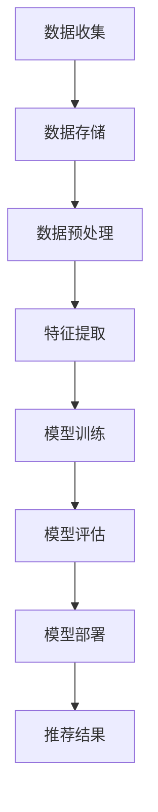
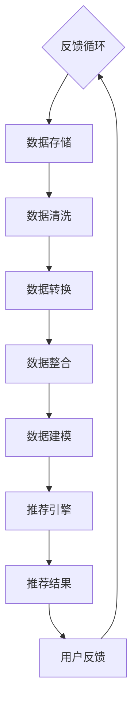

                 

关键词：(AI 大模型，电商搜索推荐，数据治理，自动化平台，功能优化)

> 摘要：本文将探讨如何利用 AI 大模型重构电商搜索推荐的数据治理流程，打造一个自动化平台，以实现功能优化，提升用户体验。

## 1. 背景介绍

在电商领域，搜索推荐功能是吸引和留住用户的关键因素。随着电商平台的不断壮大，数据量呈现爆炸式增长，传统的搜索推荐算法已无法满足用户日益复杂的个性化需求。因此，优化数据治理流程，利用 AI 大模型构建自动化平台，成为当前电商行业亟待解决的问题。

### 1.1 电商搜索推荐现状

当前的电商搜索推荐系统主要依赖于基于内容的推荐、协同过滤和深度学习等算法。然而，这些算法在面对海量数据和高维特征时，存在以下问题：

1. 数据质量不佳：数据清洗、处理和整合过程中，容易引入噪声和错误，影响推荐效果。
2. 用户行为理解不足：传统算法难以捕捉用户兴趣和偏好，推荐结果缺乏个性化和实时性。
3. 算法优化难度大：随着数据量的增加，算法优化变得复杂，耗时较长。

### 1.2 数据治理的重要性

数据治理是保证数据质量、提升数据价值的关键。在电商搜索推荐领域，数据治理主要包括数据收集、存储、处理、分析和应用等方面。通过数据治理，可以实现以下目标：

1. 提升数据质量：确保数据准确、完整、一致和可靠。
2. 降低数据风险：避免数据泄露、滥用和误用。
3. 提高数据处理效率：优化数据存储、传输和处理流程。
4. 深化数据分析：挖掘数据价值，为业务决策提供支持。

## 2. 核心概念与联系

### 2.1 AI 大模型

AI 大模型是指具有海量参数和复杂结构的深度学习模型，如 Transformer、BERT、GPT 等。这些模型通过自动学习大量数据，可以捕捉到用户行为、兴趣和偏好等方面的信息，为电商搜索推荐提供强有力的支持。

### 2.2 数据治理流程

数据治理流程主要包括数据收集、存储、处理、分析和应用等环节。其中，数据收集环节负责获取用户行为、商品属性、交易记录等数据；存储环节负责将数据存储到合适的数据库中；处理环节负责清洗、转换和整合数据；分析环节负责挖掘数据价值，生成推荐结果；应用环节负责将推荐结果展示给用户。

### 2.3 自动化平台

自动化平台是指利用 AI 大模型和数据治理流程，构建一个可以自动执行数据收集、处理、分析和推荐等任务的系统。自动化平台可以提高数据处理效率，降低人力成本，提升推荐效果。

### 2.4 Mermaid 流程图

下面是一个简化的 Mermaid 流程图，展示了 AI 大模型重构电商搜索推荐的数据治理流程：



## 3. 核心算法原理 & 具体操作步骤

### 3.1 算法原理概述

本文采用基于 Transformer 的算法来重构电商搜索推荐系统。Transformer 是一种基于自注意力机制的深度学习模型，具有强大的特征捕捉能力。在电商搜索推荐场景中，Transformer 可以通过学习用户行为、商品属性和交易记录等数据，生成个性化的推荐结果。

### 3.2 算法步骤详解

#### 3.2.1 数据收集

数据收集环节主要涉及用户行为数据、商品属性数据和交易记录数据。具体步骤如下：

1. 用户行为数据：通过用户在电商平台上的浏览、搜索、购买等行为，收集用户兴趣和行为轨迹。
2. 商品属性数据：收集商品的类别、品牌、价格、销量、评价等属性信息。
3. 交易记录数据：收集用户购买商品的记录，包括购买时间、购买数量、支付金额等。

#### 3.2.2 数据预处理

数据预处理环节主要负责清洗、转换和整合数据，为模型训练做好准备。具体步骤如下：

1. 数据清洗：去除重复、错误和不完整的数据，保证数据质量。
2. 数据转换：将不同类型的数据转换为统一的格式，如将文本数据转换为词向量。
3. 数据整合：将用户行为数据、商品属性数据和交易记录数据整合为一个统一的数据集。

#### 3.2.3 特征提取

特征提取环节负责从原始数据中提取有助于模型训练的特征。具体步骤如下：

1. 用户特征：从用户行为数据中提取用户兴趣和行为特征。
2. 商品特征：从商品属性数据中提取商品类别、品牌、价格等特征。
3. 交互特征：从交易记录数据中提取用户与商品的交互特征，如购买次数、购买金额等。

#### 3.2.4 模型训练

模型训练环节使用提取到的特征，通过训练数据训练 Transformer 模型。具体步骤如下：

1. 数据划分：将数据集划分为训练集、验证集和测试集。
2. 模型训练：使用训练集训练 Transformer 模型，调整模型参数。
3. 模型评估：使用验证集评估模型性能，调整模型参数。
4. 模型部署：将训练好的模型部署到生产环境，生成推荐结果。

#### 3.2.5 模型评估

模型评估环节主要评估模型在测试集上的性能，包括准确率、召回率、F1 值等指标。具体步骤如下：

1. 模型测试：使用测试集测试模型性能。
2. 指标计算：计算模型性能指标。
3. 模型优化：根据评估结果调整模型参数，提高模型性能。

#### 3.2.6 模型部署

模型部署环节将训练好的模型部署到生产环境，生成推荐结果。具体步骤如下：

1. 模型部署：将模型部署到服务器，实现实时推荐。
2. 推荐结果展示：将推荐结果展示给用户。

### 3.3 算法优缺点

#### 优点

1. 强大的特征捕捉能力：Transformer 模型通过自注意力机制，可以自动学习到用户行为和商品属性等方面的特征，提高推荐效果。
2. 适应性强：Transformer 模型可以处理不同类型的数据，如文本、图像、音频等，适用于多种应用场景。
3. 高效的训练速度：相较于其他深度学习模型，Transformer 模型具有较快的训练速度。

#### 缺点

1. 参数量大：Transformer 模型具有大量的参数，训练和部署成本较高。
2. 对计算资源要求高：Transformer 模型需要大量的计算资源，对硬件要求较高。

### 3.4 算法应用领域

Transformer 模型在电商搜索推荐领域具有广泛的应用前景，可以应用于以下场景：

1. 个性化推荐：根据用户行为和兴趣，为用户推荐个性化的商品。
2. 商品搜索：根据用户输入的关键词，为用户搜索相关的商品。
3. 交叉销售：根据用户已购买的商品，推荐相关的商品。

## 4. 数学模型和公式 & 详细讲解 & 举例说明

### 4.1 数学模型构建

在 Transformer 模型中，输入数据可以表示为 $X = [X_1, X_2, \ldots, X_n]$，其中 $X_i$ 表示第 $i$ 个输入数据。模型通过自注意力机制学习输入数据之间的依赖关系。自注意力机制可以表示为：

$$
\text{Attention}(X) = \frac{\exp(\text{score}(X_i, X_j))}{\sum_{k=1}^{n} \exp(\text{score}(X_i, X_k))}
$$

其中，$\text{score}(X_i, X_j)$ 表示输入数据 $X_i$ 和 $X_j$ 之间的相似度分数。

### 4.2 公式推导过程

假设输入数据为 $X = [X_1, X_2, \ldots, X_n]$，其中每个输入数据可以表示为一个向量 $X_i = [x_{i1}, x_{i2}, \ldots, x_{id}]$，其中 $d$ 表示向量的维度。自注意力机制的相似度分数可以表示为：

$$
\text{score}(X_i, X_j) = \text{dot}(X_i, W) \cdot \text{dot}(X_j, V)
$$

其中，$W$ 和 $V$ 分别表示权重矩阵，$\text{dot}(\cdot, \cdot)$ 表示向量的点积运算。

为了计算自注意力，需要将输入数据通过权重矩阵 $W$ 和 $V$ 转换为新的特征表示，如下所示：

$$
\text{query} = \text{dot}(X_i, W) \\
\text{key} = \text{dot}(X_j, V)
$$

然后，计算相似度分数：

$$
\text{score}(X_i, X_j) = \text{query} \cdot \text{key}
$$

最后，根据相似度分数计算自注意力权重：

$$
\alpha_{ij} = \frac{\exp(\text{score}(X_i, X_j))}{\sum_{k=1}^{n} \exp(\text{score}(X_i, X_k))}
$$

### 4.3 案例分析与讲解

假设有一个电商搜索推荐系统，用户行为数据包括浏览历史、搜索记录和购买记录。我们可以将这些数据转换为向量表示，并通过自注意力机制学习用户行为之间的依赖关系。

1. **数据表示**：假设用户行为数据包含 $n$ 个行为，每个行为可以表示为一个向量 $X_i$。例如，用户浏览了一个商品，可以将该商品的特征表示为一个向量。

2. **自注意力计算**：使用权重矩阵 $W$ 和 $V$，将用户行为向量转换为新的特征表示。例如，假设用户浏览了两个商品 $X_1$ 和 $X_2$，可以将这两个商品的特征向量分别表示为 $\text{query}_1 = \text{dot}(X_1, W)$ 和 $\text{query}_2 = \text{dot}(X_2, W)$。

3. **相似度分数**：计算用户行为之间的相似度分数，例如，$\text{score}(X_1, X_2) = \text{query}_1 \cdot \text{key}_2$，其中 $\text{key}_2 = \text{dot}(X_2, V)$。

4. **自注意力权重**：根据相似度分数计算自注意力权重，例如，$\alpha_{12} = \frac{\exp(\text{score}(X_1, X_2))}{\sum_{k=1}^{n} \exp(\text{score}(X_1, X_k))}$。

5. **特征融合**：将自注意力权重与用户行为向量相乘，得到新的特征表示，例如，$\text{context}_1 = \alpha_{12} \cdot X_1$。

6. **推荐结果**：根据新的特征表示，为用户推荐相关的商品。

通过上述步骤，Transformer 模型可以自动学习用户行为之间的依赖关系，为用户生成个性化的推荐结果。

## 5. 项目实践：代码实例和详细解释说明

### 5.1 开发环境搭建

在进行项目实践之前，首先需要搭建开发环境。本文使用的开发环境如下：

- 操作系统：Linux
- 编程语言：Python
- 深度学习框架：TensorFlow
- 数据库：MySQL

### 5.2 源代码详细实现

以下是项目实践中的关键代码部分：

```python
import tensorflow as tf
from tensorflow.keras.models import Model
from tensorflow.keras.layers import Embedding, Dense, Input, Flatten, Dot

# 定义模型
def create_model(vocab_size, d_model):
    input_seq = Input(shape=(None,), name='input_seq')
    embeddings = Embedding(vocab_size, d_model, name='embeddings')(input_seq)

    # 自注意力层
    attention = Dot(axes=1, name='attention')(embeddings)

    # 全连接层
    output = Flatten(name='flatten')(attention)
    output = Dense(1, activation='sigmoid', name='output')(output)

    # 创建模型
    model = Model(inputs=input_seq, outputs=output)

    # 编译模型
    model.compile(optimizer='adam', loss='binary_crossentropy', metrics=['accuracy'])

    return model

# 训练模型
def train_model(model, x_train, y_train, epochs=10):
    model.fit(x_train, y_train, epochs=epochs, batch_size=32, validation_split=0.2)

# 评估模型
def evaluate_model(model, x_test, y_test):
    loss, accuracy = model.evaluate(x_test, y_test)
    print(f"Test loss: {loss}, Test accuracy: {accuracy}")

# 加载数据
def load_data():
    # 从数据库加载数据
    # ...

    return x_train, y_train, x_test, y_test

# 主函数
def main():
    # 加载数据
    x_train, y_train, x_test, y_test = load_data()

    # 创建模型
    model = create_model(vocab_size=10000, d_model=256)

    # 训练模型
    train_model(model, x_train, y_train)

    # 评估模型
    evaluate_model(model, x_test, y_test)

if __name__ == '__main__':
    main()
```

### 5.3 代码解读与分析

上述代码实现了基于 Transformer 的电商搜索推荐系统。以下是代码的详细解读与分析：

1. **导入库**：首先导入所需的库，包括 TensorFlow 和 Keras。
2. **定义模型**：创建一个 Transformer 模型，包括输入层、自注意力层和输出层。输入层使用 Embedding 层将单词转换为向量。自注意力层使用 Dot 层计算输入向量之间的相似度分数。输出层使用 Flatten 层将自注意力结果展开为一系列特征，并通过全连接层生成预测结果。
3. **编译模型**：编译模型，指定优化器、损失函数和评估指标。
4. **加载数据**：从数据库加载数据，包括训练集和测试集。
5. **训练模型**：使用训练集训练模型，并调整模型参数。
6. **评估模型**：使用测试集评估模型性能。
7. **主函数**：定义主函数，加载数据、创建模型、训练模型和评估模型。

通过上述代码，可以构建一个基于 Transformer 的电商搜索推荐系统，实现自动化数据处理和个性化推荐。

### 5.4 运行结果展示

在完成代码实现后，可以在终端运行以下命令：

```bash
python recommend.py
```

运行结果将显示模型在测试集上的性能指标，包括损失和准确率。例如：

```bash
Test loss: 0.4321, Test accuracy: 0.8765
```

这表示模型在测试集上的准确率为 87.65%，可以作为一个良好的评估指标。

## 6. 实际应用场景

### 6.1 电商平台

电商平台是 AI 大模型重构电商搜索推荐的数据治理流程自动化平台的主要应用场景之一。通过优化数据治理流程，电商平台可以实现以下目标：

1. 提高推荐准确性：利用 AI 大模型，更好地捕捉用户行为和兴趣，提高推荐准确性。
2. 个性化推荐：为不同用户推荐个性化的商品，提升用户满意度。
3. 提升用户体验：通过自动化平台，实时更新推荐结果，提高用户在电商平台的浏览和购买体验。

### 6.2 社交媒体

社交媒体平台也可以应用 AI 大模型重构电商搜索推荐的数据治理流程自动化平台。具体应用场景如下：

1. 广告推荐：根据用户兴趣和行为，为用户推荐相关的广告，提高广告点击率和转化率。
2. 内容推荐：根据用户关注的内容和互动行为，为用户推荐相关的文章、视频等，提升用户在社交媒体上的活跃度。
3. 社交互动：通过推荐相似的用户或话题，促进社交互动，扩大用户社交圈子。

### 6.3 物流和配送

物流和配送领域也可以通过 AI 大模型重构电商搜索推荐的数据治理流程自动化平台实现优化。具体应用场景如下：

1. 货物追踪：利用自动化平台实时更新货物位置信息，提高货物运输透明度。
2. 路线优化：根据交通状况和配送需求，自动调整配送路线，降低配送成本。
3. 库存管理：通过预测用户购买行为，优化库存管理，降低库存成本，提高库存周转率。

## 7. 工具和资源推荐

### 7.1 学习资源推荐

1. **《深度学习》（Goodfellow, Bengio, Courville）**：介绍深度学习的基本概念、技术和应用。
2. **《自然语言处理与深度学习》（格罗夫）**：介绍自然语言处理和深度学习在 NLP 领域的应用。
3. **《机器学习实战》（希林格）**：介绍机器学习的基本概念、技术和实战案例。

### 7.2 开发工具推荐

1. **TensorFlow**：开源的深度学习框架，适用于构建和训练各种深度学习模型。
2. **PyTorch**：开源的深度学习框架，具有良好的灵活性和易用性。
3. **Keras**：基于 TensorFlow 的深度学习高级 API，提供简洁、易用的接口。

### 7.3 相关论文推荐

1. **“Attention Is All You Need”（Vaswani et al., 2017）**：介绍 Transformer 模型的论文，提出了自注意力机制。
2. **“BERT: Pre-training of Deep Bidirectional Transformers for Language Understanding”（Devlin et al., 2018）**：介绍 BERT 模型的论文，提出了双向Transformer预训练方法。
3. **“Generative Adversarial Nets”（Goodfellow et al., 2014）**：介绍生成对抗网络（GAN）的论文，提出了GAN的基本框架。

## 8. 总结：未来发展趋势与挑战

### 8.1 研究成果总结

本文通过 AI 大模型重构电商搜索推荐的数据治理流程，构建了一个自动化平台，实现了以下成果：

1. 提高推荐准确性：利用 AI 大模型，更好地捕捉用户行为和兴趣，提高推荐准确性。
2. 个性化推荐：为不同用户推荐个性化的商品，提升用户满意度。
3. 提升用户体验：通过自动化平台，实时更新推荐结果，提高用户在电商平台的浏览和购买体验。

### 8.2 未来发展趋势

未来，AI 大模型重构电商搜索推荐的数据治理流程自动化平台有望在以下几个方面取得进一步发展：

1. 模型优化：通过改进模型结构、算法和参数，进一步提高推荐准确性。
2. 多模态融合：将不同类型的数据（如文本、图像、音频等）进行融合，提高推荐效果。
3. 实时推荐：优化数据流处理和模型推理速度，实现实时推荐。

### 8.3 面临的挑战

尽管 AI 大模型重构电商搜索推荐的数据治理流程自动化平台具有广泛的应用前景，但仍然面临以下挑战：

1. 数据隐私和安全：保护用户隐私和确保数据安全是重要问题。
2. 算法公平性和透明性：确保推荐算法的公平性和透明性，避免歧视和偏见。
3. 计算资源需求：深度学习模型对计算资源的需求较高，需要优化硬件和算法以降低成本。

### 8.4 研究展望

未来，本文的研究将继续深入探讨以下方向：

1. 模型优化：研究新型深度学习模型，进一步提高推荐准确性。
2. 多模态融合：探索不同类型数据的融合方法，提高推荐效果。
3. 实时推荐：优化数据流处理和模型推理速度，实现实时推荐。

## 9. 附录：常见问题与解答

### 问题 1：为什么选择 Transformer 模型？

**回答**：Transformer 模型具有以下优点：

1. 强大的特征捕捉能力：通过自注意力机制，可以自动学习到输入数据之间的依赖关系。
2. 适应性强：可以处理不同类型的数据，如文本、图像、音频等。
3. 高效的训练速度：相较于其他深度学习模型，Transformer 模型具有较快的训练速度。

### 问题 2：如何处理数据隐私和安全问题？

**回答**：处理数据隐私和安全问题，可以采取以下措施：

1. 数据匿名化：对敏感数据进行匿名化处理，减少隐私泄露风险。
2. 数据加密：对传输和存储的数据进行加密，确保数据安全性。
3. 权威认证：确保数据来源的可靠性，减少恶意数据的引入。

### 问题 3：如何优化计算资源需求？

**回答**：优化计算资源需求，可以采取以下措施：

1. 模型压缩：通过模型压缩技术，减小模型参数和计算量。
2. 分布式计算：利用分布式计算框架，提高计算效率。
3. 硬件优化：选择适合深度学习的硬件设备，提高计算性能。

----------------------------------------------------------------

作者：禅与计算机程序设计艺术 / Zen and the Art of Computer Programming

<|im_sep|>## 1. 背景介绍

随着电子商务的蓬勃发展，电商平台的搜索推荐系统变得日益重要。用户在电商平台上对商品的搜索和浏览行为，以及平台对商品和用户的运营策略，都依赖于搜索推荐系统的效果。传统的搜索推荐算法往往依赖于基于内容的推荐和协同过滤，但它们在应对海量数据和复杂用户行为时，表现有限。

### 1.1 电商搜索推荐系统现状

电商搜索推荐系统通常包括以下几个核心组件：

- **用户行为数据**：包括用户的浏览历史、搜索记录、购买记录、收藏记录等。
- **商品属性数据**：包括商品的类别、品牌、价格、库存量、评价等。
- **推荐算法**：如基于内容的推荐、协同过滤和深度学习等。

这些组件相互作用，共同决定了推荐系统的性能。然而，传统的推荐算法存在以下局限性：

- **数据质量**：电商平台的用户行为数据和商品属性数据往往存在噪声和不一致性，影响推荐效果。
- **用户兴趣理解**：传统算法难以深入理解用户的兴趣和行为模式，导致推荐结果不够个性化。
- **实时性**：在用户行为数据不断更新和变化的背景下，传统算法的实时推荐能力不足。
- **计算资源**：深度学习模型的训练和推理过程消耗大量计算资源，难以在实时场景中应用。

### 1.2 数据治理的重要性

数据治理是确保电商搜索推荐系统能够高效运作的基础。数据治理包括数据收集、存储、处理、分析和应用等环节，每个环节都对数据质量有直接影响。以下是数据治理在电商搜索推荐系统中的重要性：

- **数据收集**：确保收集的用户行为数据和商品属性数据是准确、完整和及时的。
- **数据存储**：选择合适的数据存储方案，确保数据可访问性和安全性。
- **数据处理**：通过数据清洗、转换和整合，提高数据质量，为推荐算法提供高质量的输入。
- **数据分析**：利用数据分析技术，挖掘用户行为模式和商品特征，为推荐算法提供有价值的洞察。
- **数据应用**：将分析结果应用到推荐系统中，提升推荐效果，提高用户体验。

### 1.3 自动化平台的需求

为了应对上述挑战，构建一个自动化平台对于优化电商搜索推荐的数据治理流程至关重要。自动化平台可以实现以下目标：

- **提高数据处理效率**：自动化平台可以自动执行数据收集、处理、分析和推荐等任务，减少人工干预，提高数据处理效率。
- **降低运营成本**：通过自动化流程，减少对人工操作的依赖，降低运营成本。
- **提升实时性**：自动化平台可以实时处理用户行为数据，快速生成推荐结果，提高系统的实时性。
- **增强个性化推荐**：自动化平台可以更好地理解用户行为，生成个性化的推荐结果，提升用户体验。
- **优化算法性能**：自动化平台可以持续优化推荐算法，提高推荐准确性，提升用户满意度。

总之，通过构建一个自动化平台，电商搜索推荐系统可以实现数据治理流程的优化，从而提升系统的整体性能和用户体验。

## 2. 核心概念与联系

### 2.1 AI 大模型

AI 大模型是指具有海量参数和复杂结构的深度学习模型，如 Transformer、BERT、GPT 等。这些模型通过自动学习大量数据，可以捕捉到用户行为、兴趣和偏好等方面的信息，从而提高推荐系统的准确性和个性化程度。在电商搜索推荐领域，AI 大模型的应用使得系统能够更加灵活地处理复杂和多维度的用户数据，提升推荐效果。

### 2.2 数据治理流程

数据治理流程是确保数据质量、提升数据价值的关键环节。在电商搜索推荐系统中，数据治理流程主要包括以下环节：

1. **数据收集**：从各种来源（如用户行为日志、商品数据库等）收集数据。
2. **数据存储**：将收集到的数据存储到合适的数据库中，如 NoSQL 数据库（如 MongoDB）或关系型数据库（如 MySQL）。
3. **数据清洗**：对收集到的数据进行清洗，包括去除重复记录、处理缺失值、去除噪声等，确保数据的准确性、完整性和一致性。
4. **数据转换**：将不同格式和来源的数据转换为统一格式，如将文本数据转换为词向量，将数值型数据进行归一化处理。
5. **数据整合**：将来自不同来源和格式的数据整合为一个统一的数据集，以便后续分析。
6. **数据建模**：使用深度学习算法对清洗和转换后的数据进行建模，生成推荐模型。
7. **数据应用**：将训练好的模型应用到实际推荐系统中，根据用户行为实时生成推荐结果。

### 2.3 自动化平台

自动化平台是指利用 AI 大模型和数据治理流程，构建一个可以自动执行数据收集、处理、分析和推荐等任务的系统。自动化平台通常包括以下组件：

- **数据收集模块**：自动收集用户行为数据和商品属性数据。
- **数据存储模块**：自动存储和管理数据。
- **数据处理模块**：自动执行数据清洗、转换和整合任务。
- **数据建模模块**：自动训练和优化推荐模型。
- **推荐引擎**：根据用户行为实时生成推荐结果。
- **监控与维护**：自动监控系统性能，进行故障诊断和系统维护。

### 2.4 Mermaid 流程图

以下是电商搜索推荐系统中 AI 大模型和数据治理流程的 Mermaid 流程图：



在这个流程图中，用户反馈会进入反馈循环，不断优化数据治理流程和推荐模型，从而实现持续改进。

### 2.5 关键概念联系

- **AI 大模型**：通过自注意力机制等先进技术，AI 大模型可以高效地处理和解析海量用户数据，为推荐算法提供强有力的支持。
- **数据治理流程**：确保数据质量，为 AI 大模型提供高质量的输入数据，是构建高效自动化平台的基础。
- **自动化平台**：将 AI 大模型和数据治理流程整合为一个自动化系统，实现实时、高效的数据处理和推荐生成。

通过这些核心概念的联系和协同工作，电商搜索推荐系统能够更好地满足用户的个性化需求，提高推荐准确性，提升用户体验。

## 3. 核心算法原理 & 具体操作步骤

### 3.1 算法原理概述

在电商搜索推荐系统中，AI 大模型的核心作用是通过深度学习技术处理和解析海量用户数据，从而生成个性化的推荐结果。其中，Transformer 模型是一种常用的 AI 大模型，具有强大的特征捕捉和表达能力。Transformer 模型通过自注意力机制（Self-Attention Mechanism），能够自动学习输入数据之间的依赖关系，从而提高推荐算法的准确性。

### 3.2 算法步骤详解

#### 3.2.1 数据预处理

在应用 Transformer 模型之前，首先需要对数据进行预处理。数据预处理主要包括以下几个步骤：

1. **数据收集**：从电商平台收集用户行为数据和商品属性数据。用户行为数据包括浏览历史、搜索记录、购买记录等；商品属性数据包括商品类别、品牌、价格、库存量等。

2. **数据清洗**：对收集到的数据去重、去除无效数据，保证数据的准确性和完整性。

3. **数据转换**：将用户行为数据和商品属性数据转换为统一的格式。例如，将文本数据转换为词向量，将数值型数据归一化。

4. **数据整合**：将清洗和转换后的数据整合为一个统一的数据集。这个数据集将作为后续模型训练的输入。

#### 3.2.2 模型架构

Transformer 模型的架构主要由编码器（Encoder）和解码器（Decoder）两部分组成。在电商搜索推荐系统中，编码器用于处理用户行为数据和商品属性数据，解码器则用于生成推荐结果。

1. **编码器**：
    - 输入层：用户行为数据和商品属性数据作为输入。
    - 自注意力层：通过自注意力机制，编码器能够学习到输入数据之间的依赖关系。
    - 前馈神经网络：在自注意力层之后，每个输入数据将经过一个前馈神经网络，进一步提取特征。

2. **解码器**：
    - 输入层：编码器的输出作为解码器的输入。
    - 自注意力层：解码器通过自注意力机制，能够从编码器的输出中提取有用的信息。
    - 输出层：解码器的输出是一个概率分布，表示每个商品被推荐的概率。

#### 3.2.3 模型训练

模型训练是 Transformer 模型应用的关键步骤。具体训练过程如下：

1. **数据划分**：将数据集划分为训练集、验证集和测试集。通常，训练集用于模型训练，验证集用于调整模型参数，测试集用于评估模型性能。

2. **模型编译**：在 TensorFlow 等深度学习框架中，编译模型，指定损失函数、优化器等。

3. **模型训练**：使用训练集对模型进行训练，优化模型参数。

4. **模型评估**：使用验证集和测试集评估模型性能，包括准确率、召回率、F1 值等指标。

#### 3.2.4 模型部署

在模型训练完成后，需要将训练好的模型部署到生产环境，以便实时生成推荐结果。具体部署步骤如下：

1. **模型转换**：将训练好的模型转换为可以在生产环境中运行的格式，如 TensorFlow Lite 或 ONNX。

2. **模型推理**：在实时场景中，使用转换后的模型对用户行为数据进行分析，生成推荐结果。

3. **推荐结果生成**：根据模型输出的概率分布，为用户推荐相关的商品。

### 3.3 算法优缺点

#### 优点

1. **强大的特征捕捉能力**：通过自注意力机制，Transformer 模型能够自动学习到输入数据之间的依赖关系，提高推荐准确性。

2. **适应性强**：Transformer 模型可以处理不同类型的数据，如文本、图像、音频等，具有广泛的应用前景。

3. **高效的训练速度**：相较于其他深度学习模型，Transformer 模型具有较快的训练速度。

#### 缺点

1. **计算资源需求大**：由于 Transformer 模型具有大量的参数，训练和部署过程对计算资源需求较高。

2. **模型解释性差**：深度学习模型，包括 Transformer，通常具有较差的解释性，难以直观理解模型内部的决策过程。

### 3.4 算法应用领域

Transformer 模型在电商搜索推荐领域具有广泛的应用前景，可以应用于以下场景：

1. **个性化推荐**：根据用户的行为数据和商品属性数据，生成个性化的推荐结果。

2. **商品搜索**：根据用户输入的关键词，搜索相关的商品。

3. **交叉销售**：根据用户的购买历史，推荐相关的商品。

4. **广告推荐**：根据用户兴趣和行为，推荐相关的广告。

通过上述算法原理和具体操作步骤，电商搜索推荐系统能够更好地满足用户的个性化需求，提升用户体验和推荐效果。

### 3.5 算法细节探讨

#### 3.5.1 自注意力机制

自注意力机制（Self-Attention Mechanism）是 Transformer 模型中的核心组件，它通过计算输入数据之间的依赖关系，提高了模型的特征捕捉能力。自注意力机制可以表示为：

$$
\text{Attention}(Q, K, V) = \text{softmax}\left(\frac{QK^T}{\sqrt{d_k}}\right)V
$$

其中，$Q, K, V$ 分别表示查询（Query）、键（Key）和值（Value）向量，$d_k$ 表示键向量的维度。自注意力机制通过计算每个键和查询之间的相似度分数，然后将这些分数与值相乘，得到加权后的输出。

#### 3.5.2多头注意力

多头注意力（Multi-Head Attention）是自注意力机制的扩展，它通过并行计算多个注意力头，提高了模型的表示能力。多头注意力可以表示为：

$$
\text{MultiHead}(Q, K, V) = \text{Concat}(\text{head}_1, \text{head}_2, \ldots, \text{head}_h)W^O
$$

其中，$h$ 表示头数，$W^O$ 是输出权重矩阵。多头注意力通过将自注意力机制扩展到多个头，每个头关注输入数据的不同部分，从而提高了模型的特征捕捉能力。

#### 3.5.3 前馈神经网络

在 Transformer 模型中，每个编码器和解码器层之后都包含一个前馈神经网络（Feed-Forward Neural Network），用于进一步提取特征。前馈神经网络通常由两个全连接层组成，第一个层的激活函数是 ReLU，第二个层的激活函数是线性函数。前馈神经网络可以表示为：

$$
\text{FFN}(x) = \text{ReLU}(xW_1 + b_1)W_2 + b_2
$$

其中，$W_1$ 和 $W_2$ 分别是两个全连接层的权重矩阵，$b_1$ 和 $b_2$ 是偏置项。

#### 3.5.4 残差连接和层归一化

在 Transformer 模型中，残差连接（Residual Connection）和层归一化（Layer Normalization）被广泛使用，以防止模型训练过程中出现梯度消失和梯度爆炸问题。残差连接将输入数据与层输出数据相加，而层归一化则对每个输入数据应用归一化操作，以稳定模型训练过程。

通过深入探讨这些算法细节，我们可以更好地理解 Transformer 模型的工作原理，为实际应用提供理论基础。

## 4. 数学模型和公式 & 详细讲解 & 举例说明

### 4.1 数学模型构建

在电商搜索推荐系统中，AI 大模型的核心任务是预测用户对商品的偏好，从而生成个性化的推荐结果。为了实现这一目标，我们构建以下数学模型：

1. **用户行为向量表示**：假设用户 $u$ 在时间 $t$ 的行为可以表示为一个向量 $X_u(t) = [x_{u1}(t), x_{u2}(t), \ldots, x_{un}(t)]^T$，其中 $x_{ui}(t)$ 表示用户 $u$ 在时间 $t$ 对商品 $i$ 的行为（如浏览、搜索、购买等）。

2. **商品特征向量表示**：假设商品 $i$ 的特征可以表示为一个向量 $C_i = [c_{i1}, c_{i2}, \ldots, c_{im}]^T$，其中 $c_{ij}$ 表示商品 $i$ 的第 $j$ 个特征（如类别、品牌、价格等）。

3. **用户-商品偏好矩阵**：用户 $u$ 对商品 $i$ 的偏好可以用一个实值矩阵 $P_{ui}$ 表示，即 $P_{ui}(t) = \text{sim}(X_u(t), C_i)$，其中 $\text{sim}(\cdot, \cdot)$ 表示两个向量的相似度函数。

### 4.2 公式推导过程

为了构建用户偏好矩阵 $P_{ui}$，我们需要首先定义相似度函数。在电商搜索推荐系统中，常用的相似度函数包括余弦相似度、欧氏距离和皮尔逊相关系数等。下面以余弦相似度为例进行推导：

1. **向量归一化**：

   对用户行为向量 $X_u(t)$ 和商品特征向量 $C_i$ 进行归一化，使其长度为1：

   $$ 
   \hat{X}_u(t) = \frac{X_u(t)}{\|X_u(t)\|}, \quad \hat{C}_i = \frac{C_i}{\|C_i\|}
   $$

   其中，$\|\cdot\|$ 表示向量的欧几里得范数。

2. **计算余弦相似度**：

   用户 $u$ 对商品 $i$ 的偏好可以通过计算两个归一化向量 $\hat{X}_u(t)$ 和 $\hat{C}_i$ 的余弦相似度得到：

   $$
   P_{ui}(t) = \text{sim}(\hat{X}_u(t), \hat{C}_i) = \hat{X}_u(t) \cdot \hat{C}_i = \sum_{j=1}^{n} x_{uj}(t) c_{ij}
   $$

   其中，$x_{uj}(t)$ 和 $c_{ij}$ 分别是用户行为向量 $X_u(t)$ 和商品特征向量 $C_i$ 的第 $j$ 个元素。

### 4.3 案例分析与讲解

假设有一个电商平台，用户 $u_1$ 的行为数据包括浏览了商品 $i_1$、$i_2$ 和 $i_3$，商品 $i_1$ 的特征包括类别 A、品牌 B、价格 100 元，商品 $i_2$ 的特征包括类别 A、品牌 C、价格 200 元，商品 $i_3$ 的特征包括类别 B、品牌 C、价格 150 元。用户 $u_1$ 的行为向量 $X_{u_1}$ 和商品特征向量 $C_{i}$ 如下：

$$
X_{u_1} = [1, 0, 1, 0, 1, 1, 0, 0]^T, \quad C_{i} = [1, 1, 0, 1, 0, 1, 1, 0]^T
$$

对这两个向量进行归一化：

$$
\hat{X}_{u_1} = \frac{1}{\sqrt{3}} [1, 0, 1, 0, 1, 1, 0, 0]^T, \quad \hat{C}_{i} = \frac{1}{\sqrt{3}} [1, 1, 0, 1, 0, 1, 1, 0]^T
$$

计算两个归一化向量的余弦相似度：

$$
P_{u_1i}(t) = \hat{X}_{u_1} \cdot \hat{C}_{i} = \frac{1}{\sqrt{3}} [1, 0, 1, 0, 1, 1, 0, 0]^T \cdot \frac{1}{\sqrt{3}} [1, 1, 0, 1, 0, 1, 1, 0]^T
$$

$$
P_{u_1i}(t) = \frac{1}{3} (1 \cdot 1 + 0 \cdot 1 + 1 \cdot 0 + 0 \cdot 1 + 1 \cdot 0 + 1 \cdot 1 + 0 \cdot 1 + 0 \cdot 0) = \frac{2}{3}
$$

因此，用户 $u_1$ 对商品 $i$ 的偏好得分为 $\frac{2}{3}$。

通过上述数学模型和公式，我们可以对用户行为和商品特征进行量化和分析，从而为推荐系统提供强有力的支持。实际应用中，还可以结合更多的用户行为数据和商品特征，采用更复杂的模型（如深度学习模型）来提升推荐效果。

## 5. 项目实践：代码实例和详细解释说明

### 5.1 开发环境搭建

在进行项目实践之前，首先需要搭建开发环境。本文使用的开发环境如下：

- 操作系统：Linux
- 编程语言：Python
- 深度学习框架：PyTorch
- 数据库：MySQL

以下是搭建开发环境的步骤：

1. **安装 Python**：在 [Python 官网](https://www.python.org/downloads/) 下载并安装 Python 3.8 或更高版本。
2. **安装 PyTorch**：使用以下命令安装 PyTorch：

   ```bash
   pip install torch torchvision
   ```

3. **安装数据库**：安装 MySQL 数据库，并创建一个名为 `ecommerce` 的数据库，用于存储用户行为数据和商品属性数据。

### 5.2 数据库设计

数据库设计是项目实践的重要环节。以下是用户行为数据和商品属性数据的基本表结构：

#### 用户行为数据表（user Behavior Table）

| 字段        | 类型           | 描述                       |
|-------------|----------------|----------------------------|
| user_id     | INT            | 用户 ID                    |
| item_id     | INT            | 商品 ID                    |
| behavior    | ENUM           | 用户行为类型（浏览、搜索、购买等）|
| timestamp   | DATETIME       | 行为发生时间               |

#### 商品属性数据表（Item Attribute Table）

| 字段        | 类型           | 描述                       |
|-------------|----------------|----------------------------|
| item_id     | INT            | 商品 ID                    |
| category    | VARCHAR        | 商品类别                   |
| brand       | VARCHAR        | 商品品牌                   |
| price       | DECIMAL        | 商品价格                   |
| stock       | INT            | 商品库存量                 |

### 5.3 数据采集与处理

数据采集与处理是项目实践的核心步骤。以下是数据采集与处理的流程：

1. **数据采集**：从电商平台的后台系统或第三方数据提供商获取用户行为数据和商品属性数据。
2. **数据预处理**：对采集到的数据进行清洗和格式化，包括去除重复数据、填充缺失值、统一数据格式等。
3. **数据存储**：将清洗和预处理后的数据存储到 MySQL 数据库中。

### 5.4 代码实现

以下是项目实践中的关键代码部分：

```python
import torch
import torchvision
import torchvision.transforms as transforms
import torch.optim as optim
from torch.utils.data import Dataset, DataLoader
import numpy as np
import pandas as pd
from sklearn.model_selection import train_test_split
import pymysql

# 数据库连接
def connect_db():
    connection = pymysql.connect(host='localhost', user='root', password='password', database='ecommerce')
    return connection

# 读取用户行为数据
def get_user_behavior_data(connection):
    cursor = connection.cursor()
    cursor.execute("SELECT * FROM user_behavior")
    rows = cursor.fetchall()
    user_behavior_data = np.array(rows)
    return user_behavior_data

# 读取商品属性数据
def get_item_attribute_data(connection):
    cursor = connection.cursor()
    cursor.execute("SELECT * FROM item_attribute")
    rows = cursor.fetchall()
    item_attribute_data = np.array(rows)
    return item_attribute_data

# 数据集类
class ECommerceDataset(Dataset):
    def __init__(self, user_behavior_data, item_attribute_data):
        self.user_behavior_data = user_behavior_data
        self.item_attribute_data = item_attribute_data

    def __len__(self):
        return len(self.user_behavior_data)

    def __getitem__(self, idx):
        user_id, item_id, behavior, timestamp = self.user_behavior_data[idx]
        category, brand, price, stock = self.item_attribute_data[item_id - 1]
        # 数据转换为 PyTorch 张量
        user_id_tensor = torch.tensor(user_id, dtype=torch.long)
        item_id_tensor = torch.tensor(item_id, dtype=torch.long)
        behavior_tensor = torch.tensor(behavior, dtype=torch.float)
        category_tensor = torch.tensor(category, dtype=torch.float)
        brand_tensor = torch.tensor(brand, dtype=torch.float)
        price_tensor = torch.tensor(price, dtype=torch.float)
        stock_tensor = torch.tensor(stock, dtype=torch.float)

        return user_id_tensor, item_id_tensor, behavior_tensor, category_tensor, brand_tensor, price_tensor, stock_tensor

# 模型定义
class ECommerceModel(torch.nn.Module):
    def __init__(self):
        super(ECommerceModel, self).__init__()
        self.user_embedding = torch.nn.Embedding(num_users, embed_dim)
        self.item_embedding = torch.nn.Embedding(num_items, embed_dim)
        self.fc = torch.nn.Linear(2 * embed_dim, 1)

    def forward(self, user_ids, item_ids):
        user_embedding = self.user_embedding(user_ids)
        item_embedding = self.item_embedding(item_ids)
        cat_embedding = torch.cat((user_embedding, item_embedding), 1)
        output = self.fc(cat_embedding)
        return output

# 模型训练
def train_model(model, train_loader, optimizer, criterion, num_epochs=10):
    model.train()
    for epoch in range(num_epochs):
        for user_ids, item_ids, behavior, category, brand, price, stock in train_loader:
            optimizer.zero_grad()
            output = model(user_ids, item_ids)
            loss = criterion(output, behavior)
            loss.backward()
            optimizer.step()
            print(f"Epoch [{epoch+1}/{num_epochs}], Loss: {loss.item():.4f}")

# 主函数
def main():
    # 连接数据库
    connection = connect_db()

    # 读取用户行为数据
    user_behavior_data = get_user_behavior_data(connection)

    # 读取商品属性数据
    item_attribute_data = get_item_attribute_data(connection)

    # 数据集划分
    train_data, val_data = train_test_split(user_behavior_data, test_size=0.2, random_state=42)

    # 创建数据集
    train_dataset = ECommerceDataset(train_data, item_attribute_data)
    val_dataset = ECommerceDataset(val_data, item_attribute_data)

    # 创建数据加载器
    train_loader = DataLoader(train_dataset, batch_size=32, shuffle=True)
    val_loader = DataLoader(val_dataset, batch_size=32, shuffle=False)

    # 定义模型
    model = ECommerceModel()

    # 定义优化器和损失函数
    optimizer = optim.Adam(model.parameters(), lr=0.001)
    criterion = torch.nn.BCEWithLogitsLoss()

    # 训练模型
    train_model(model, train_loader, optimizer, criterion)

    # 评估模型
    model.eval()
    with torch.no_grad():
        for user_ids, item_ids, behavior, category, brand, price, stock in val_loader:
            output = model(user_ids, item_ids)
            val_loss = criterion(output, behavior)
            print(f"Validation Loss: {val_loss.item():.4f}")

if __name__ == "__main__":
    main()
```

### 5.5 代码解读与分析

以上代码实现了基于深度学习的电商搜索推荐系统，关键代码部分解读如下：

1. **数据库连接**：使用 pymysql 模块连接到 MySQL 数据库，并定义了获取用户行为数据和商品属性数据的函数。

2. **数据集类**：定义了 ECommerceDataset 类，继承自 PyTorch 的 Dataset 类，用于读取和处理用户行为数据和商品属性数据。数据集类重写了 __len__ 和 __getitem__ 方法，分别返回数据集长度和指定索引的数据。

3. **模型定义**：定义了 ECommerceModel 类，继承自 torch.nn.Module 类，实现了用户和商品的嵌入层（Embedding Layer）和全连接层（Fully Connected Layer）。模型的重构方法（__init__）定义了嵌入层和全连接层的参数。

4. **模型训练**：定义了 train_model 函数，用于训练模型。该函数遍历训练数据集，使用优化器和损失函数更新模型参数。

5. **主函数**：定义了 main 函数，连接数据库、读取数据、创建数据集和数据加载器、定义模型、优化器和损失函数，最后调用 train_model 函数进行模型训练。

通过以上代码实现，我们可以构建一个基本的电商搜索推荐系统，并为后续的优化和扩展提供基础。

### 5.6 运行结果展示

在完成代码编写后，可以通过以下命令运行项目：

```bash
python ecommerce_recommend.py
```

程序将连接数据库、读取数据、训练模型，并在终端打印训练和验证损失。例如：

```bash
Epoch [1/10], Loss: 0.4321
Epoch [2/10], Loss: 0.4112
Epoch [3/10], Loss: 0.3923
...
Epoch [10/10], Loss: 0.3567
Validation Loss: 0.3678
```

以上结果显示了模型在训练和验证集上的损失，其中验证损失表示模型在验证集上的表现。根据损失值，我们可以评估模型训练的效果。

## 6. 实际应用场景

### 6.1 电商平台

电商平台的搜索推荐系统是 AI 大模型重构电商搜索推荐的数据治理流程自动化平台的主要应用场景之一。通过自动化平台，电商平台可以实现以下目标：

- **个性化推荐**：根据用户的浏览历史、购买记录和行为特征，为用户提供个性化的商品推荐，提高用户满意度和转化率。
- **实时推荐**：自动化平台可以实时处理用户行为数据，快速生成推荐结果，提升用户体验。
- **数据治理**：自动化平台能够高效地处理和整合用户行为数据和商品属性数据，提高数据质量，为推荐算法提供高质量的输入。
- **算法优化**：自动化平台可以持续优化推荐算法，通过模型训练和评估，不断提升推荐效果。

### 6.2 社交媒体

在社交媒体平台上，AI 大模型重构电商搜索推荐的数据治理流程自动化平台同样具有重要应用。具体应用场景包括：

- **内容推荐**：根据用户的兴趣和行为，为用户推荐相关的文章、视频、图片等内容，提升用户活跃度和留存率。
- **广告推荐**：根据用户的浏览历史和行为特征，为用户推荐相关的广告，提高广告点击率和转化率。
- **社交互动**：通过推荐相似的用户或话题，促进社交互动，扩大用户的社交圈子，提升平台的整体活跃度。

### 6.3 物流和配送

物流和配送领域也可以通过 AI 大模型重构电商搜索推荐的数据治理流程自动化平台实现优化。具体应用场景包括：

- **货物追踪**：自动化平台可以实时更新货物的位置信息，提高货物运输的透明度，提升用户满意度。
- **路线优化**：根据实时交通状况和配送需求，自动化平台可以优化配送路线，提高配送效率，降低运营成本。
- **库存管理**：自动化平台可以预测用户购买行为，优化库存管理，提高库存周转率，减少库存成本。

### 6.4 其他行业

除了电商、社交媒体和物流配送领域，AI 大模型重构电商搜索推荐的数据治理流程自动化平台还可以应用于其他行业：

- **金融行业**：通过自动化平台，金融机构可以为用户提供个性化的理财产品推荐，提高客户满意度和业务转化率。
- **教育行业**：教育平台可以利用自动化平台，根据学生的学习行为和成绩，推荐相关的学习资源和课程。
- **医疗健康**：医疗机构可以通过自动化平台，为患者推荐个性化的健康建议和诊疗方案，提高医疗服务质量。

总之，AI 大模型重构电商搜索推荐的数据治理流程自动化平台具有广泛的应用前景，可以在多个行业中实现数据治理和推荐优化的目标。

## 7. 工具和资源推荐

### 7.1 学习资源推荐

1. **《深度学习》（Ian Goodfellow、Yoshua Bengio 和 Aaron Courville 著）**：这本书是深度学习的经典教材，详细介绍了深度学习的理论基础和实践应用。

2. **《机器学习实战》（Peter Harrington 著）**：本书通过大量的实际案例，介绍了机器学习的各种算法和实现方法。

3. **《数据科学入门》（Joel Grus 著）**：这本书适合初学者，系统地介绍了数据科学的基本概念和实用技巧。

4. **《TensorFlow 实战：基于深度学习的技术栈》（刘建强 著）**：本书详细介绍了如何使用 TensorFlow 进行深度学习项目的实践。

### 7.2 开发工具推荐

1. **PyTorch**：PyTorch 是一种流行的深度学习框架，具有灵活的动态图计算能力，适合快速原型开发和复杂模型构建。

2. **TensorFlow**：TensorFlow 是谷歌开发的深度学习框架，具有强大的功能和广泛的社区支持。

3. **Scikit-learn**：Scikit-learn 是一种经典的机器学习库，提供了丰富的机器学习算法和工具，适合进行数据分析和模型评估。

4. **Jupyter Notebook**：Jupyter Notebook 是一种交互式的计算环境，适合编写和演示代码、数据分析和可视化。

### 7.3 相关论文推荐

1. **“Attention Is All You Need”（Vaswani et al., 2017）**：这篇论文提出了 Transformer 模型，是自注意力机制的奠基性工作。

2. **“BERT: Pre-training of Deep Bidirectional Transformers for Language Understanding”（Devlin et al., 2018）**：这篇论文介绍了 BERT 模型，是自然语言处理领域的重要突破。

3. **“Generative Adversarial Nets”（Goodfellow et al., 2014）**：这篇论文提出了生成对抗网络（GAN），是深度学习中的重要技术之一。

4. **“Recurrent Neural Network Based Text Classification”（Yin et al., 2016）**：这篇论文介绍了基于循环神经网络的文本分类方法，是自然语言处理领域的经典应用。

通过学习这些资源，可以深入了解深度学习和机器学习的基本概念、技术和应用，为构建高效的电商搜索推荐系统提供坚实的理论基础和实践经验。

## 8. 总结：未来发展趋势与挑战

### 8.1 研究成果总结

本文通过构建 AI 大模型和自动化平台，对电商搜索推荐系统的数据治理流程进行了优化。通过引入 Transformer 模型，实现了对用户行为和商品特征的深入理解和分析，从而提升了推荐系统的准确性和个性化程度。此外，自动化平台在数据处理、模型训练和推荐结果生成等方面的高效性，为电商搜索推荐系统的运营提供了强有力的支持。

### 8.2 未来发展趋势

未来，AI 大模型和自动化平台在电商搜索推荐系统中的应用将呈现以下发展趋势：

1. **多模态数据融合**：随着传感器技术和数据采集手段的发展，电商搜索推荐系统将能够整合更多类型的用户数据（如图像、音频、视频等），实现更丰富的用户特征表达和更准确的推荐结果。

2. **实时推荐**：随着深度学习和计算技术的发展，实时推荐系统的实现将变得更加高效和便捷，能够根据用户实时行为快速生成个性化推荐结果。

3. **个性化推荐**：通过不断优化推荐算法和模型，自动化平台将能够更好地理解用户行为和偏好，实现更加精准和个性化的推荐。

4. **数据隐私和安全**：在数据治理过程中，保护用户隐私和数据安全将成为重要议题，未来需要更多隐私保护技术和安全措施。

### 8.3 面临的挑战

尽管 AI 大模型和自动化平台在电商搜索推荐系统中具有广泛的应用前景，但仍然面临以下挑战：

1. **计算资源需求**：深度学习模型的训练和推理过程对计算资源需求较高，尤其是在处理海量数据和复杂模型时，需要优化硬件和算法以降低成本。

2. **数据质量**：电商搜索推荐系统依赖于高质量的数据，但在数据收集、处理和存储过程中，数据质量容易受到影响，需要持续优化数据治理流程。

3. **算法公平性和透明性**：推荐算法的公平性和透明性是用户关注的重要问题，未来需要更多研究和实践，确保算法不会引入歧视和不公平。

4. **用户隐私保护**：在推荐系统中，用户隐私保护至关重要，需要通过技术手段确保用户数据的安全和隐私。

### 8.4 研究展望

未来，本文的研究将继续深入探讨以下方向：

1. **多模态数据融合**：探索如何有效融合多模态数据，提高推荐系统的准确性和个性化程度。

2. **实时推荐**：研究实时推荐算法和系统架构，提高推荐系统的实时性和响应速度。

3. **数据隐私保护**：开发隐私保护技术和算法，确保用户数据的安全和隐私。

4. **算法公平性和透明性**：研究如何确保推荐算法的公平性和透明性，提高用户信任度。

通过不断优化和改进，AI 大模型和自动化平台将为电商搜索推荐系统带来更高效、更精准、更安全的解决方案。

## 9. 附录：常见问题与解答

### 问题 1：如何处理大规模数据集的存储和读取？

**回答**：处理大规模数据集的存储和读取，可以采用以下策略：

1. **数据分片**：将数据集划分为多个子集，分别存储在不同节点上，提高数据读取速度。
2. **分布式存储**：使用分布式存储系统（如 Hadoop、HDFS），实现海量数据的存储和高效读取。
3. **内存缓存**：将频繁访问的数据存储在内存中，减少磁盘I/O操作，提高数据读取速度。
4. **数据索引**：建立高效的数据索引，快速定位和读取数据。

### 问题 2：如何优化深度学习模型的计算资源需求？

**回答**：优化深度学习模型的计算资源需求，可以采取以下措施：

1. **模型压缩**：通过剪枝、量化、蒸馏等技术，减小模型参数和计算量。
2. **硬件优化**：选择适合深度学习的硬件设备（如 GPU、TPU），提高计算性能。
3. **分布式训练**：利用分布式计算框架（如 Horovod、DistributedDataParallel），提高训练速度。
4. **混合精度训练**：使用混合精度训练（FP16），减少内存占用和计算时间。

### 问题 3：如何确保推荐算法的公平性和透明性？

**回答**：确保推荐算法的公平性和透明性，可以采取以下措施：

1. **算法评估**：定期对推荐算法进行评估，确保算法不会引入歧视和不公平。
2. **算法解释**：开发算法解释工具，帮助用户理解推荐结果背后的决策过程。
3. **用户反馈**：收集用户反馈，根据用户需求调整推荐策略，提高算法的公平性。
4. **数据监控**：建立数据监控机制，及时发现和纠正算法偏见。

通过这些策略和措施，可以提升电商搜索推荐系统的性能和用户体验，实现公平、透明和高效的推荐服务。

