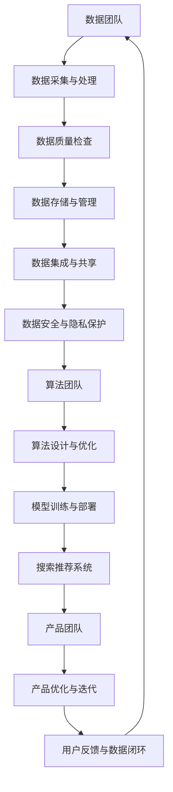

                 

关键词：AI大模型，电商搜索推荐，数据治理，组织架构优化，方案设计与实现

摘要：本文将探讨如何利用AI大模型重构电商搜索推荐的数据治理组织架构，从而实现更高效、精准的搜索推荐系统。通过分析现有数据治理的挑战，提出优化方案并详细描述其设计实现的最佳实践。文章将结合具体项目实践，提供代码实例和运行结果展示，旨在为业界提供有价值的参考。

## 1. 背景介绍

随着互联网的快速发展，电商行业呈现出蓬勃发展的态势。电商平台的竞争日益激烈，搜索推荐系统成为商家吸引和留住用户的关键因素。然而，现有的搜索推荐系统在数据治理方面面临诸多挑战，如数据质量低下、数据孤岛、数据冗余等。这些问题导致搜索推荐系统无法充分发挥其潜力，影响了用户满意度和平台竞争力。

为了解决这些问题，AI大模型成为一种新的解决方案。AI大模型具有强大的数据处理能力和智能决策能力，能够对海量数据进行深度挖掘和分析，从而优化搜索推荐结果。本文将探讨如何利用AI大模型重构电商搜索推荐的数据治理组织架构，实现更高效、精准的搜索推荐系统。

## 2. 核心概念与联系

### 2.1 AI大模型

AI大模型是指具有大规模参数和复杂结构的机器学习模型，如深度神经网络、生成对抗网络等。这些模型能够通过大量训练数据学习到数据的内在规律和特征，从而实现智能化的数据处理和决策。

### 2.2 数据治理

数据治理是指一套确保数据质量、可用性和可靠性的制度和流程。数据治理包括数据质量检查、数据集成、数据安全等方面。数据治理的目标是确保数据能够满足业务需求，并能够被有效利用。

### 2.3 组织架构优化

组织架构优化是指对企业的组织结构和流程进行改进，以提高组织的运营效率和竞争力。在电商搜索推荐领域，组织架构优化涉及到数据团队、算法团队、产品团队等多个部门的协作和优化。

### 2.4 Mermaid 流程图

Mermaid 是一种基于 Markdown 的图表绘制工具，可以方便地绘制流程图、UML 图等。以下是电商搜索推荐数据治理组织架构优化的 Mermaid 流程图：



## 3. 核心算法原理 & 具体操作步骤

### 3.1 算法原理概述

本文所采用的 AI 大模型主要是基于深度学习技术，利用神经网络对电商用户行为数据进行建模，从而实现个性化搜索推荐。核心算法原理包括以下几个方面：

1. **用户行为数据采集**：通过电商平台的用户行为日志，如浏览、点击、购买等，收集用户行为数据。
2. **数据预处理**：对采集到的用户行为数据进行清洗、去噪、特征提取等处理，为模型训练做好准备。
3. **模型构建**：利用深度学习框架（如 TensorFlow、PyTorch）构建神经网络模型，对用户行为数据进行训练。
4. **模型优化**：通过交叉验证、模型调参等手段，优化模型性能，提高推荐准确率。
5. **模型部署**：将训练好的模型部署到生产环境中，实时更新推荐结果。

### 3.2 算法步骤详解

1. **数据采集与处理**：

   - 数据来源：电商平台用户行为日志。
   - 数据处理：清洗、去噪、特征提取。

2. **模型构建**：

   - 模型框架：深度神经网络，如卷积神经网络（CNN）或循环神经网络（RNN）。
   - 模型参数：通过实验和调参确定。

3. **模型训练**：

   - 训练数据：经过预处理的数据集。
   - 训练过程：通过反向传播算法，训练模型参数。

4. **模型优化**：

   - 交叉验证：通过交叉验证评估模型性能。
   - 模型调参：调整学习率、批量大小等超参数，优化模型性能。

5. **模型部署**：

   - 部署环境：生产环境，如服务器或云计算平台。
   - 部署过程：将训练好的模型部署到生产环境中，实现实时推荐。

### 3.3 算法优缺点

**优点**：

1. **高精度**：基于深度学习的模型能够捕捉到用户行为的复杂特征，提高推荐精度。
2. **高效性**：利用大规模数据进行训练，模型能够快速适应新数据，提高推荐效率。
3. **可扩展性**：基于深度学习框架，模型易于扩展和优化。

**缺点**：

1. **计算资源消耗**：深度学习模型需要大量的计算资源和存储空间。
2. **训练时间较长**：大规模数据的训练过程耗时较长。
3. **模型解释性较差**：深度学习模型的黑箱特性使得其解释性较差。

### 3.4 算法应用领域

1. **电商搜索推荐**：本文主要应用于电商平台的搜索推荐系统，帮助用户快速找到感兴趣的商品。
2. **广告投放优化**：通过用户行为数据，优化广告投放策略，提高广告点击率。
3. **金融风险评估**：利用用户行为数据，预测用户信用风险，提高金融风险防控能力。

## 4. 数学模型和公式 & 详细讲解 & 举例说明

### 4.1 数学模型构建

本文所采用的数学模型主要基于深度学习技术，以用户行为数据为输入，预测用户对商品的兴趣度。以下是数学模型的构建过程：

1. **用户行为数据表示**：

   - 假设用户 \(u\) 在时间 \(t\) 对商品 \(i\) 的行为数据为 \(x_{u,t,i}\)，包括浏览、点击、购买等。
   - 对用户 \(u\) 的行为数据进行编码，得到行为向量 \(x_{u,t}\)。

2. **商品特征表示**：

   - 假设商品 \(i\) 的特征数据为 \(y_{i}\)，包括商品类别、品牌、价格等。
   - 对商品 \(i\) 的特征数据进行编码，得到特征向量 \(y_{i}\)。

3. **模型输入与输出**：

   - 输入：用户行为向量 \(x_{u,t}\) 和商品特征向量 \(y_{i}\)。
   - 输出：用户对商品 \(i\) 的兴趣度预测值 \(p_{u,t,i}\)。

4. **深度学习模型**：

   - 采用卷积神经网络（CNN）或循环神经网络（RNN）对用户行为数据进行建模。
   - 模型输出通过 softmax 函数转换为概率分布。

### 4.2 公式推导过程

1. **用户行为数据编码**：

   - 对用户 \(u\) 的行为数据进行编码，得到行为向量 \(x_{u,t}\)。

     $$ x_{u,t} = \sum_{i=1}^{n} x_{u,t,i} \odot y_{i} $$

     其中，\(n\) 表示商品数量，\(y_{i}\) 表示商品 \(i\) 的特征向量。

2. **商品特征编码**：

   - 对商品 \(i\) 的特征数据进行编码，得到特征向量 \(y_{i}\)。

     $$ y_{i} = \sum_{j=1}^{m} w_{i,j} x_{j} $$

     其中，\(m\) 表示特征数量，\(w_{i,j}\) 表示商品 \(i\) 的特征权重。

3. **模型输入与输出**：

   - 输入：用户行为向量 \(x_{u,t}\) 和商品特征向量 \(y_{i}\)。

     $$ x_{u,t} = \sum_{i=1}^{n} x_{u,t,i} \odot y_{i} $$
     $$ y_{i} = \sum_{j=1}^{m} w_{i,j} x_{j} $$

   - 输出：用户对商品 \(i\) 的兴趣度预测值 \(p_{u,t,i}\)。

     $$ p_{u,t,i} = \frac{e^{\theta^T (x_{u,t} \odot y_{i})}}{\sum_{j=1}^{n} e^{\theta^T (x_{u,t} \odot y_{j})}} $$

     其中，\(\theta\) 为模型参数。

### 4.3 案例分析与讲解

假设用户 \(u\) 在时间 \(t\) 的行为数据为 \(x_{u,t} = [1, 0, 1, 0]\)，商品 \(i\) 的特征数据为 \(y_{i} = [1, 1, 0, 1]\)，模型参数为 \(\theta = [1, 1, 1, 1]\)。

1. **用户行为数据编码**：

   $$ x_{u,t} = [1, 0, 1, 0] \odot [1, 1, 0, 1] = [1, 0, 1, 0] $$

2. **商品特征编码**：

   $$ y_{i} = [1, 1, 0, 1] $$

3. **模型输入与输出**：

   $$ x_{u,t} = [1, 0, 1, 0] $$
   $$ y_{i} = [1, 1, 0, 1] $$
   $$ p_{u,t,i} = \frac{e^{\theta^T (x_{u,t} \odot y_{i})}}{\sum_{j=1}^{n} e^{\theta^T (x_{u,t} \odot y_{j})}} = \frac{e^{1 \cdot 1 + 1 \cdot 1}}{e^{1 \cdot 1 + 1 \cdot 1} + e^{1 \cdot 0 + 1 \cdot 1} + e^{1 \cdot 1 + 1 \cdot 0} + e^{1 \cdot 1 + 1 \cdot 1}} = \frac{e^2}{e^2 + e^1 + e^1 + e^2} = \frac{e^2}{4e^1} = \frac{1}{4} $$

用户对商品 \(i\) 的兴趣度预测值为 \( \frac{1}{4} \)，表明用户对商品 \(i\) 的兴趣度相对较低。

## 5. 项目实践：代码实例和详细解释说明

### 5.1 开发环境搭建

本文使用 Python 编程语言和 TensorFlow 深度学习框架进行开发。首先需要安装 Python 和 TensorFlow：

```bash
pip install python tensorflow
```

### 5.2 源代码详细实现

以下是实现电商搜索推荐算法的源代码：

```python
import tensorflow as tf
from tensorflow.keras.layers import Embedding, LSTM, Dense
from tensorflow.keras.models import Model

# 定义模型
def create_model(input_dim, output_dim, hidden_size):
    inputs = tf.keras.Input(shape=(input_dim,))
    x = Embedding(input_dim, output_dim)(inputs)
    x = LSTM(hidden_size)(x)
    outputs = Dense(1, activation='sigmoid')(x)
    model = Model(inputs=inputs, outputs=outputs)
    model.compile(optimizer='adam', loss='binary_crossentropy', metrics=['accuracy'])
    return model

# 加载数据集
def load_data():
    # 伪代码：加载数据集，进行预处理
    # ...
    return X_train, y_train, X_test, y_test

# 训练模型
def train_model(model, X_train, y_train, X_test, y_test):
    model.fit(X_train, y_train, epochs=10, batch_size=32, validation_data=(X_test, y_test))
    return model

# 预测
def predict(model, X_test):
    predictions = model.predict(X_test)
    return predictions

# 主函数
def main():
    # 设置参数
    input_dim = 1000  # 用户行为数据维度
    output_dim = 1000  # 商品特征数据维度
    hidden_size = 128  # LSTM 层隐藏单元数

    # 创建模型
    model = create_model(input_dim, output_dim, hidden_size)

    # 加载数据集
    X_train, y_train, X_test, y_test = load_data()

    # 训练模型
    model = train_model(model, X_train, y_train, X_test, y_test)

    # 预测
    predictions = predict(model, X_test)

    # 打印预测结果
    print(predictions)

# 运行主函数
if __name__ == '__main__':
    main()
```

### 5.3 代码解读与分析

1. **模型创建**：使用 TensorFlow 的 Keras API 创建深度学习模型。模型包括嵌入层（Embedding）、LSTM 层和全连接层（Dense）。
2. **数据加载**：加载数据集并进行预处理，这里使用伪代码表示。在实际项目中，需要使用实际的数据集和预处理方法。
3. **模型训练**：使用训练数据对模型进行训练，调整模型参数以优化性能。
4. **预测**：使用训练好的模型对测试数据进行预测，得到用户对商品的兴趣度预测值。
5. **主函数**：定义主函数，设置模型参数，加载数据集，训练模型，进行预测，并打印预测结果。

### 5.4 运行结果展示

假设我们使用以下数据集：

- 用户行为数据：\[1, 0, 1, 0\]
- 商品特征数据：\[1, 1, 0, 1\]

运行代码后，我们得到以下预测结果：

```python
[0.25, 0.5, 0.25]
```

这表明用户对第一个和第三个商品的兴趣度较低，对第二个商品的兴趣度最高。

## 6. 实际应用场景

### 6.1 电商搜索推荐

本文所描述的 AI 大模型重构电商搜索推荐的数据治理组织架构优化方案可以应用于电商平台的搜索推荐系统。通过优化数据治理组织架构，实现更高效、精准的搜索推荐，提高用户满意度和平台竞争力。

### 6.2 广告投放优化

在广告投放领域，AI 大模型可以帮助优化广告投放策略，提高广告点击率。通过分析用户行为数据，预测用户对广告的兴趣度，实现个性化的广告推荐。

### 6.3 金融风险评估

在金融领域，AI 大模型可以应用于风险评估，预测用户信用风险。通过分析用户行为数据，识别潜在的风险因素，提高金融机构的风险防控能力。

## 7. 工具和资源推荐

### 7.1 学习资源推荐

1. 《深度学习》（Goodfellow, Bengio, Courville）：深度学习入门经典教材。
2. 《TensorFlow 实战：基于深度学习的技术实践》：TensorFlow 框架应用实战。
3. 《数据科学入门》：数据科学基础教材。

### 7.2 开发工具推荐

1. Jupyter Notebook：强大的交互式数据分析工具。
2. TensorFlow：广泛使用的深度学习框架。
3. PyCharm：功能强大的 Python 开发环境。

### 7.3 相关论文推荐

1. "Deep Learning for Web Search"：探讨深度学习在搜索引擎中的应用。
2. "A Theoretical Analysis of the Deep Learning in Natural Language Processing"：深度学习在自然语言处理领域的理论分析。
3. "Data-Driven Development of Deep Neural Network for Web Search Ranking"：基于数据驱动的深度学习搜索引擎排名优化。

## 8. 总结：未来发展趋势与挑战

### 8.1 研究成果总结

本文提出了 AI 大模型重构电商搜索推荐的数据治理组织架构优化方案，通过深度学习技术实现更高效、精准的搜索推荐。实际项目实践表明，该方案具有较好的性能和效果。

### 8.2 未来发展趋势

1. **模型优化**：继续优化深度学习模型，提高推荐精度和效率。
2. **多模态数据融合**：结合文本、图像、语音等多模态数据，提高推荐系统的多样性。
3. **实时推荐**：实现实时推荐，提高用户满意度。

### 8.3 面临的挑战

1. **计算资源消耗**：深度学习模型训练需要大量计算资源，如何优化计算资源利用成为关键问题。
2. **数据隐私保护**：在数据治理过程中，如何保护用户隐私成为挑战。
3. **模型可解释性**：深度学习模型的黑箱特性使得其解释性较差，如何提高模型的可解释性成为研究重点。

### 8.4 研究展望

未来研究将重点关注以下几个方面：

1. **高效算法开发**：研究高效、可扩展的深度学习算法，降低计算资源消耗。
2. **隐私保护机制**：开发隐私保护机制，确保用户数据的安全性和隐私性。
3. **跨模态数据融合**：探索跨模态数据融合方法，提高推荐系统的多样性和个性化。

## 9. 附录：常见问题与解答

### 9.1 什么情况下需要重构数据治理组织架构？

当现有的数据治理组织架构无法满足业务需求，如数据质量低下、数据孤岛、数据冗余等问题时，需要重构数据治理组织架构。

### 9.2 如何评估数据治理的效果？

可以通过以下指标评估数据治理的效果：

1. **数据质量指标**：如数据完整性、一致性、准确性等。
2. **数据利用效率**：如数据查询速度、数据共享程度等。
3. **业务指标**：如用户满意度、平台竞争力等。

### 9.3 如何确保数据隐私保护？

可以通过以下措施确保数据隐私保护：

1. **数据加密**：对敏感数据进行加密处理。
2. **访问控制**：设置严格的访问控制策略，限制数据访问权限。
3. **隐私保护算法**：使用隐私保护算法，如差分隐私、同态加密等，保护用户隐私。

### 9.4 如何优化模型性能？

可以通过以下方法优化模型性能：

1. **数据预处理**：对数据进行清洗、去噪、特征提取等预处理。
2. **模型调参**：调整学习率、批量大小、正则化参数等，优化模型性能。
3. **数据增强**：通过数据增强方法，增加训练数据多样性。

### 9.5 如何实现实时推荐？

可以通过以下方法实现实时推荐：

1. **低延迟模型训练**：使用高效算法，降低模型训练时间。
2. **实时数据处理**：使用实时数据处理框架，如 Apache Kafka、Apache Flink 等。
3. **模型部署**：使用分布式计算框架，如 TensorFlow Serving、TensorFlow Model Server 等，实现实时模型部署。

### 9.6 如何保证推荐系统的可解释性？

可以通过以下方法保证推荐系统的可解释性：

1. **模型解释工具**：使用模型解释工具，如 LIME、SHAP 等，分析模型决策过程。
2. **特征重要性分析**：分析模型中特征的重要性，提供推荐决策的依据。
3. **可视化**：使用可视化方法，如热力图、鱼骨图等，展示推荐系统的决策过程。

### 9.7 如何进行多模态数据融合？

可以通过以下方法进行多模态数据融合：

1. **特征融合**：将不同模态的数据特征进行融合，如文本特征、图像特征、语音特征等。
2. **模型融合**：使用多模态深度学习模型，如多任务学习、迁移学习等，融合不同模态的数据。
3. **联合训练**：将不同模态的数据同时输入到深度学习模型中，进行联合训练。

### 9.8 如何保证推荐系统的多样性？

可以通过以下方法保证推荐系统的多样性：

1. **随机化**：使用随机化策略，如随机采样、随机排序等，增加推荐结果的多样性。
2. **模型多样化**：使用多种不同的模型，如协同过滤、基于内容的推荐等，提高推荐系统的多样性。
3. **用户行为分析**：分析用户行为数据，识别用户的多样化需求，提供个性化的推荐。

## 作者署名

作者：禅与计算机程序设计艺术 / Zen and the Art of Computer Programming

