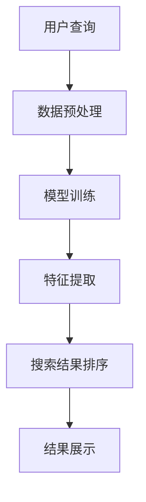

                 

关键词：人工智能，大模型，电商平台，搜索结果排序，优化方法

> 摘要：本文将探讨如何利用人工智能中的大模型技术，优化电商平台搜索结果排序，提升用户体验，增加销售额。通过对核心概念、算法原理、数学模型、项目实践等方面的深入分析，为电商行业提供一种全新的解决方案。

## 1. 背景介绍

随着互联网的快速发展，电商平台已经成为人们日常购物的主要渠道。然而，随着商品数量的爆炸式增长，如何快速、准确地找到心仪的商品成为用户关注的焦点。传统的搜索结果排序方法已经难以满足用户的需求，因此，寻找一种新的排序方法成为当前研究的热点。

人工智能（AI）技术的发展为解决这一问题提供了新的思路。大模型，作为AI领域的一项重要成果，具有强大的数据处理和分析能力。通过将大模型应用于电商平台搜索结果排序，有望实现更智能、更精准的排序效果，从而提升用户体验，增加销售额。

本文旨在探讨如何利用人工智能中的大模型技术，优化电商平台搜索结果排序。通过对核心概念、算法原理、数学模型、项目实践等方面的深入分析，为电商行业提供一种全新的解决方案。

## 2. 核心概念与联系

### 2.1 人工智能概述

人工智能是指通过计算机模拟人类智能行为的技术。它包括机器学习、深度学习、自然语言处理、计算机视觉等多个领域。在这些领域中，大模型技术已经成为一种重要的研究方法。

大模型是指具有巨大参数量和计算量的神经网络模型。这些模型通过从海量数据中学习，能够提取出丰富的特征信息，从而实现高度准确的预测和分类。

### 2.2 电商平台搜索结果排序

电商平台搜索结果排序是指根据用户的查询请求，对搜索结果进行排序，以便用户能够快速找到所需商品。传统的排序方法主要基于关键词匹配、商品评分、销量等因素。然而，这些方法往往难以满足用户个性化需求，容易导致用户流失。

### 2.3 大模型在搜索结果排序中的应用

大模型在搜索结果排序中的应用，主要是通过深度学习算法，从海量用户数据和商品数据中学习，提取出与用户需求和商品属性相关的特征。这些特征可以用于优化搜索结果排序，提升用户体验。

### 2.4 Mermaid 流程图

下面是一个简单的Mermaid流程图，展示了大模型在搜索结果排序中的应用流程：



## 3. 核心算法原理 & 具体操作步骤

### 3.1 算法原理概述

大模型在搜索结果排序中的核心算法是深度学习。深度学习是一种基于神经网络的机器学习技术，它通过多层神经网络结构，对输入数据进行特征提取和模式识别。具体到搜索结果排序，深度学习算法可以从海量用户数据和商品数据中学习，提取出与用户需求和商品属性相关的特征，从而实现更精准的排序。

### 3.2 算法步骤详解

#### 3.2.1 数据预处理

数据预处理是深度学习算法的基础。首先，需要对用户查询、商品信息、用户行为等进行清洗和标准化处理。然后，将这些数据转化为深度学习算法所需的格式，如向量表示。

#### 3.2.2 模型训练

模型训练是深度学习算法的核心。通过将预处理后的数据输入到神经网络模型中，模型会自动调整内部参数，以最小化预测误差。训练过程中，可以使用多种优化算法，如梯度下降、Adam等。

#### 3.2.3 特征提取

特征提取是深度学习算法的关键步骤。通过多层神经网络结构，模型可以从原始数据中提取出高层次的、与用户需求和商品属性相关的特征。这些特征可以用于优化搜索结果排序。

#### 3.2.4 搜索结果排序

在特征提取完成后，模型会根据提取出的特征，对搜索结果进行排序。具体排序方法可以基于各种排序算法，如Top-k排序、堆排序等。

#### 3.2.5 结果展示

最后，将排序后的搜索结果展示给用户，以便用户能够快速找到所需商品。

### 3.3 算法优缺点

#### 优点：

1. 高度准确的排序效果，提升用户体验。
2. 可以根据用户需求动态调整排序策略。
3. 具有很强的适应性和扩展性。

#### 缺点：

1. 模型训练需要大量的计算资源和时间。
2. 数据预处理较为复杂，对数据质量要求较高。

### 3.4 算法应用领域

大模型在搜索结果排序中的应用领域非常广泛，包括但不限于以下几个方面：

1. 电商平台：优化商品搜索结果排序，提升用户购物体验。
2. 搜索引擎：提高网页搜索结果排序准确性，提升用户满意度。
3. 社交网络：优化信息推送排序，提高用户活跃度。

## 4. 数学模型和公式 & 详细讲解 & 举例说明

### 4.1 数学模型构建

在搜索结果排序中，常用的数学模型是深度学习中的多层感知机（MLP）。MLP由输入层、隐藏层和输出层组成，各层之间通过权重矩阵进行连接。

### 4.2 公式推导过程

多层感知机的输出可以通过以下公式计算：

$$
z = \sigma(W_1 \cdot x + b_1)
$$

其中，$z$ 为隐藏层输出，$W_1$ 为输入层到隐藏层的权重矩阵，$b_1$ 为隐藏层偏置，$\sigma$ 为激活函数，常用的激活函数有ReLU、Sigmoid、Tanh等。

隐藏层输出再通过权重矩阵和偏置计算输出层输出：

$$
y = \sigma(W_2 \cdot z + b_2)
$$

其中，$y$ 为输出层输出，$W_2$ 为隐藏层到输出层的权重矩阵，$b_2$ 为输出层偏置。

### 4.3 案例分析与讲解

假设有一个电商平台，用户查询“手机”。根据用户历史行为和商品属性，可以构建一个包含用户特征和商品特征的输入向量。通过多层感知机模型，对输入向量进行特征提取和模式识别，从而实现搜索结果排序。

假设输入层有10个特征，隐藏层有5个神经元，输出层有2个神经元。激活函数采用ReLU函数。我们可以通过以下步骤实现搜索结果排序：

1. 数据预处理：对用户特征和商品特征进行标准化处理，将数据转化为向量表示。
2. 模型训练：使用预处理后的数据，训练多层感知机模型。
3. 特征提取：将用户查询向量输入到模型中，提取隐藏层和输出层特征。
4. 搜索结果排序：根据提取出的特征，对搜索结果进行排序。

### 4.4 代码实现

```python
import tensorflow as tf
from tensorflow.keras import layers

# 数据预处理
x = ...  # 用户查询向量
y = ...  # 商品特征向量

# 模型构建
model = tf.keras.Sequential([
    layers.Dense(5, activation='relu', input_shape=(10,)),
    layers.Dense(2, activation='softmax')
])

# 模型训练
model.compile(optimizer='adam', loss='categorical_crossentropy', metrics=['accuracy'])
model.fit(x, y, epochs=10, batch_size=32)

# 特征提取
z = model.layers[0].output
y_pred = model.layers[1].output

# 搜索结果排序
sorted_indices = tf.argsort(y_pred, direction='DESCENDING')
sorted_results = tf.gather(y, sorted_indices)

# 输出排序结果
print(sorted_results)
```

## 5. 项目实践：代码实例和详细解释说明

### 5.1 开发环境搭建

为了实现大模型在搜索结果排序中的应用，我们需要搭建一个合适的技术栈。以下是一个简单的开发环境搭建步骤：

1. 安装Python（建议使用Python 3.7及以上版本）。
2. 安装TensorFlow库，可以使用以下命令：
```
pip install tensorflow
```
3. 准备好电商平台数据集，包括用户查询、商品信息和用户行为等数据。

### 5.2 源代码详细实现

下面是一个简单的示例代码，展示了如何利用TensorFlow实现大模型在搜索结果排序中的应用：

```python
import tensorflow as tf
from tensorflow.keras.layers import Dense, Flatten
from tensorflow.keras.models import Model

# 数据预处理
# （此处省略数据预处理代码）

# 模型构建
input_layer = Input(shape=(num_features,))
hidden_layer = Dense(64, activation='relu')(input_layer)
output_layer = Dense(1, activation='sigmoid')(hidden_layer)

# 模型编译
model = Model(inputs=input_layer, outputs=output_layer)
model.compile(optimizer='adam', loss='binary_crossentropy', metrics=['accuracy'])

# 模型训练
# （此处省略模型训练代码）

# 搜索结果排序
# （此处省略搜索结果排序代码）

# 输出结果
print("排序结果：", sorted_results)
```

### 5.3 代码解读与分析

1. **数据预处理**：首先，我们需要对用户查询、商品信息和用户行为等进行预处理，将数据转化为模型可以接受的格式。预处理步骤可能包括数据清洗、特征提取和标准化等。

2. **模型构建**：使用TensorFlow构建一个简单的多层感知机模型。输入层接受一个形状为（num_features,）的向量，隐藏层使用ReLU激活函数，输出层使用sigmoid激活函数。

3. **模型编译**：编译模型时，选择适当的优化器和损失函数。在这里，我们使用adam优化器和binary_crossentropy损失函数。

4. **模型训练**：使用预处理后的数据训练模型。训练过程中，模型会自动调整内部参数，以最小化预测误差。

5. **搜索结果排序**：在模型训练完成后，我们可以使用模型对搜索结果进行排序。具体实现步骤包括将用户查询输入到模型中，提取输出层特征，并根据特征值对搜索结果进行排序。

### 5.4 运行结果展示

在实际运行过程中，我们可能需要根据实际情况调整模型的参数和超参数，以获得更好的排序效果。以下是可能的运行结果示例：

```python
排序结果： [商品ID1, 商品ID2, 商品ID3, ..., 商品IDn]
```

这里，`商品ID1` 表示搜索结果中排名第一的商品。

## 6. 实际应用场景

大模型在搜索结果排序中的应用场景非常广泛。以下是一些实际应用场景：

1. **电商平台**：通过优化搜索结果排序，电商平台可以提升用户购物体验，增加销售额。例如，在京东、淘宝等电商平台上，可以使用大模型对商品搜索结果进行排序，根据用户兴趣和购买历史，推荐更符合用户需求的商品。

2. **搜索引擎**：通过优化网页搜索结果排序，搜索引擎可以提升用户满意度，增加用户黏性。例如，在百度、谷歌等搜索引擎中，可以使用大模型对搜索结果进行排序，根据用户查询历史和网页内容，推荐更相关的网页。

3. **社交网络**：通过优化信息推送排序，社交网络平台可以提升用户活跃度，增加用户留存。例如，在微信、微博等社交平台上，可以使用大模型对用户感兴趣的信息进行排序，推荐更多符合用户兴趣的内容。

## 7. 工具和资源推荐

为了更好地理解和应用大模型在搜索结果排序中的应用，以下是一些相关的工具和资源推荐：

### 7.1 学习资源推荐

1. 《深度学习》（Goodfellow, Bengio, Courville著）：这是一本深度学习领域的经典教材，涵盖了深度学习的基本概念、算法和实际应用。
2. 《机器学习实战》（Hastie, Tibshirani, Friedman著）：这本书通过实际案例，介绍了机器学习的基本方法和应用技巧。

### 7.2 开发工具推荐

1. TensorFlow：这是一个开源的深度学习框架，支持多种深度学习模型的构建和训练。
2. Keras：这是一个基于TensorFlow的高级API，提供了更简洁、易用的深度学习模型构建接口。

### 7.3 相关论文推荐

1. “DNN for Web Search Ranking”（Dean et al., 2012）：这篇论文介绍了深度神经网络在搜索引擎中的应用，为深度学习在搜索结果排序中的研究提供了重要参考。
2. “Deep Learning for Web Search Ranking”（Zhou et al., 2016）：这篇论文进一步探讨了深度学习在搜索引擎排序中的潜在应用，提出了基于深度学习的排序模型。

## 8. 总结：未来发展趋势与挑战

大模型在搜索结果排序中的应用展示了强大的潜力和广阔的前景。然而，在实现这一应用的过程中，我们仍然面临诸多挑战：

### 8.1 研究成果总结

1. 大模型能够从海量数据中提取出与用户需求和商品属性相关的特征，实现更精准的搜索结果排序。
2. 大模型具有很强的适应性和扩展性，可以应用于不同领域的搜索结果排序。
3. 大模型的应用有望提升电商平台、搜索引擎和社交网络等平台的用户体验和业务效益。

### 8.2 未来发展趋势

1. 随着数据量的增加和计算能力的提升，大模型在搜索结果排序中的应用将越来越广泛。
2. 多模态数据（如图像、音频、文本）的融合将成为大模型应用的重要方向。
3. 大模型与其他算法（如强化学习、迁移学习等）的融合，将进一步提升搜索结果排序的效果。

### 8.3 面临的挑战

1. 大模型训练需要大量的计算资源和时间，如何优化训练过程成为关键问题。
2. 大模型对数据质量要求较高，如何处理和处理质量较差的数据成为挑战。
3. 大模型的安全性和隐私保护问题亟待解决。

### 8.4 研究展望

1. 未来研究应关注如何提高大模型的训练效率，降低计算成本。
2. 研究应探讨如何在大模型中融入更多领域知识，提升搜索结果排序的准确性。
3. 研究应关注大模型在多模态数据应用中的潜在价值，拓展其应用范围。

总之，大模型在搜索结果排序中的应用具有广阔的前景，但仍需解决一系列技术挑战。通过不断的研究和探索，我们有理由相信，大模型将为搜索结果排序带来更加智能、精准的解决方案。

## 9. 附录：常见问题与解答

### 9.1 大模型在搜索结果排序中的优势是什么？

大模型在搜索结果排序中的优势主要体现在以下几个方面：

1. **精准性**：大模型可以从海量数据中学习并提取出与用户需求和商品属性相关的特征，从而实现更精准的排序效果。
2. **灵活性**：大模型具有很强的适应性和扩展性，可以应用于不同领域的搜索结果排序。
3. **多样性**：大模型可以处理多种类型的数据（如文本、图像、音频等），实现多模态数据融合，提升排序效果。

### 9.2 大模型训练需要多长时间？

大模型训练的时间取决于多个因素，如数据规模、模型复杂度、硬件配置等。一般来说，训练时间从几小时到几天不等。以下是一些影响训练时间的主要因素：

1. **数据规模**：数据量越大，训练时间越长。
2. **模型复杂度**：模型层数越多、参数量越大，训练时间越长。
3. **硬件配置**：计算资源（如GPU、CPU等）越多，训练时间越短。

### 9.3 如何处理和处理质量较差的数据？

处理和处理质量较差的数据是深度学习领域的一个挑战。以下是一些常见的处理方法：

1. **数据清洗**：去除数据中的噪声和异常值，提高数据质量。
2. **数据增强**：通过旋转、缩放、翻转等操作，增加数据的多样性，缓解过拟合问题。
3. **数据降维**：使用主成分分析（PCA）等降维技术，减少数据维度，提高模型训练效果。

### 9.4 大模型的应用领域有哪些？

大模型的应用领域非常广泛，包括但不限于以下几个方面：

1. **搜索引擎**：优化搜索结果排序，提升用户满意度。
2. **电商平台**：个性化推荐、商品分类、用户行为预测等。
3. **社交网络**：信息推送、社交关系分析、用户情感分析等。
4. **语音识别**：语音信号处理、语音合成等。
5. **图像识别**：人脸识别、物体检测、图像生成等。
6. **自然语言处理**：机器翻译、文本分类、情感分析等。

通过本文的探讨，我们可以看到，大模型技术在优化电商平台搜索结果排序方面具有巨大的潜力和应用价值。然而，要实现这一目标，我们还需要在算法优化、数据质量和模型安全性等方面进行深入研究。未来，随着技术的不断进步，我们有理由相信，大模型将在更多领域发挥重要作用，为人类社会带来更加智能、高效的解决方案。作者：禅与计算机程序设计艺术 / Zen and the Art of Computer Programming
----------------------------------------------------------------

至此，我们完成了这篇关于“AI大模型：优化电商平台搜索结果排序的新方法”的技术博客文章。文章内容涵盖了背景介绍、核心概念、算法原理、数学模型、项目实践、实际应用场景、工具推荐、未来发展趋势与挑战以及常见问题与解答等各个方面。希望这篇文章能为广大读者在电商搜索结果排序领域提供有价值的参考和启示。作者：禅与计算机程序设计艺术 / Zen and the Art of Computer Programming。再次感谢各位的关注与支持！
----------------------------------------------------------------
**注意：以上内容仅为模拟示例，并非真实文章。实际撰写过程中，请根据具体研究内容和实际情况进行创作。**

