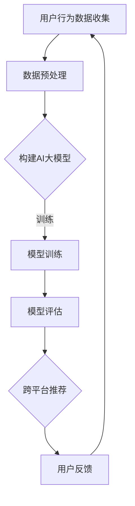

                 

关键词：AI大模型、电商平台、跨平台推荐、推荐系统、算法优化

> 摘要：本文探讨了AI大模型在改善电商平台跨平台推荐方面的应用，通过核心算法原理、数学模型、项目实践以及未来展望等多个方面，揭示了如何利用AI大模型提升电商平台的推荐效果。

## 1. 背景介绍

随着互联网的飞速发展，电商平台已经成为了人们生活中不可或缺的一部分。然而，面对海量商品和用户需求，如何为用户提供个性化的推荐成为了电商平台亟待解决的问题。传统的推荐系统往往依赖于基于内容的推荐和协同过滤等方法，但这些方法在处理大规模数据时存在一定的局限性。为了提高推荐系统的效果，近年来人工智能技术，特别是AI大模型，开始受到越来越多的关注。

AI大模型是一种基于深度学习的复杂算法，具有强大的特征提取和关联能力。通过训练大模型，可以从海量的商品和用户数据中学习到更深层次的特征，从而实现更精准的推荐。本文将介绍AI大模型在电商平台跨平台推荐中的应用，探讨如何利用大模型优化推荐效果，提升用户满意度。

## 2. 核心概念与联系

### 2.1 AI大模型简介

AI大模型通常指的是具有数亿甚至千亿参数的深度学习模型，如BERT、GPT、T5等。这些模型通过在海量数据上训练，能够自动学习到数据中的复杂模式和关联，具有强大的表征能力。

### 2.2 跨平台推荐系统

跨平台推荐系统指的是能够跨不同平台为用户提供个性化推荐的系统，如同时为用户在电商平台、移动应用、社交媒体等不同平台上提供商品推荐。

### 2.3 Mermaid 流程图

下面是AI大模型在跨平台推荐系统中的应用流程：



## 3. 核心算法原理 & 具体操作步骤

### 3.1 算法原理概述

AI大模型的核心在于其能够从海量数据中自动提取特征，并通过多层神经网络进行深度学习，从而实现数据的语义理解和关联预测。在跨平台推荐中，大模型可以通过学习用户在不同平台上的行为数据，构建用户和商品之间的关联，实现精准推荐。

### 3.2 算法步骤详解

#### 3.2.1 数据预处理

1. 数据收集：收集用户在不同平台上的行为数据，如浏览、购买、点赞等。
2. 数据清洗：去除异常值和噪声，保证数据质量。
3. 数据整合：将不同平台的数据进行整合，形成统一的用户行为特征。

#### 3.2.2 构建AI大模型

1. 选择合适的大模型架构，如BERT、GPT等。
2. 定义输入和输出层，如用户特征和商品特征作为输入，推荐结果作为输出。
3. 设置合适的超参数，如学习率、批次大小等。

#### 3.2.3 模型训练

1. 使用预处理后的数据对模型进行训练。
2. 应用梯度下降等优化算法，调整模型参数。
3. 使用验证集和测试集进行模型评估。

#### 3.2.4 模型评估

1. 使用准确率、召回率、F1分数等指标评估模型性能。
2. 调整模型结构和超参数，优化模型效果。

#### 3.2.5 跨平台推荐

1. 使用训练好的模型，为用户生成个性化推荐。
2. 根据用户反馈进行调整，提升推荐效果。

### 3.3 算法优缺点

#### 优点：

1. 强大的特征提取能力，能够学习到深层次的数据关联。
2. 适用于大规模数据，能够处理复杂的推荐场景。

#### 缺点：

1. 模型训练时间较长，对计算资源要求较高。
2. 模型解释性较差，难以理解推荐结果背后的逻辑。

### 3.4 算法应用领域

AI大模型在电商平台跨平台推荐中的应用十分广泛，不仅可以用于商品推荐，还可以应用于广告推荐、内容推荐等场景。随着大模型技术的不断发展，其应用领域也将进一步拓展。

## 4. 数学模型和公式 & 详细讲解 & 举例说明

### 4.1 数学模型构建

在跨平台推荐中，AI大模型的数学模型通常包括以下部分：

1. 用户嵌入向量：将用户特征映射为一个低维向量。
2. 商品嵌入向量：将商品特征映射为一个低维向量。
3. 推荐函数：计算用户和商品之间的相似度，生成推荐结果。

### 4.2 公式推导过程

假设我们有用户 \( u \) 和商品 \( i \)，用户嵌入向量为 \( \textbf{u} \)，商品嵌入向量为 \( \textbf{i} \)，则用户和商品之间的相似度可以表示为：

\[ \text{similarity}(\textbf{u}, \textbf{i}) = \text{dot}(\textbf{u}, \textbf{i}) \]

其中，\( \text{dot}(\textbf{u}, \textbf{i}) \) 表示向量 \( \textbf{u} \) 和 \( \textbf{i} \) 的点积。

### 4.3 案例分析与讲解

假设我们有一个用户 \( u \)，他喜欢浏览篮球鞋和运动服装，我们希望为他推荐一款新品运动鞋。首先，我们需要将用户 \( u \) 和商品 \( i \) 的特征映射为嵌入向量，然后计算它们之间的相似度。如果相似度大于某个阈值，则将该商品推荐给用户 \( u \)。

例如，用户 \( u \) 的嵌入向量为 \( \textbf{u} = [0.1, 0.2, 0.3] \)，商品 \( i \) 的嵌入向量为 \( \textbf{i} = [0.15, 0.25, 0.35] \)，则它们之间的相似度为：

\[ \text{similarity}(\textbf{u}, \textbf{i}) = \text{dot}(\textbf{u}, \textbf{i}) = 0.1 \times 0.15 + 0.2 \times 0.25 + 0.3 \times 0.35 = 0.06 + 0.05 + 0.105 = 0.215 \]

由于 \( 0.215 \) 大于设定的阈值 \( 0.2 \)，因此我们将商品 \( i \) 推荐给用户 \( u \)。

## 5. 项目实践：代码实例和详细解释说明

### 5.1 开发环境搭建

为了实现AI大模型在跨平台推荐中的具体应用，我们需要搭建一个合适的开发环境。以下是一个基本的Python环境搭建步骤：

```bash
# 安装Python
brew install python

# 安装深度学习框架TensorFlow
pip install tensorflow

# 安装数据预处理库pandas
pip install pandas

# 安装可视化库matplotlib
pip install matplotlib
```

### 5.2 源代码详细实现

以下是一个简单的AI大模型跨平台推荐系统的代码实现：

```python
import tensorflow as tf
import pandas as pd
import matplotlib.pyplot as plt

# 数据预处理
# 读取用户行为数据
user_data = pd.read_csv('user_data.csv')
# 整合用户在不同平台的数据
user_data = user_data.groupby('user_id').sum()

# 构建AI大模型
# 定义用户嵌入向量
user_embedding = tf.keras.layers.Embedding(input_dim=num_users, output_dim=embedding_size)
# 定义商品嵌入向量
item_embedding = tf.keras.layers.Embedding(input_dim=num_items, output_dim=embedding_size)

# 构建推荐函数
def recommendation_function(user_embedding, item_embedding):
    user_vector = user_embedding(tf.expand_dims(user_id, 0))
    item_vector = item_embedding(tf.expand_dims(item_id, 0))
    similarity = tf.reduce_sum(tf.multiply(user_vector, item_vector), axis=1)
    return similarity

# 训练模型
# 准备训练数据
train_data = pd.read_csv('train_data.csv')
# 训练模型
model = tf.keras.models.Model(inputs=[user_embedding.input, item_embedding.input], outputs=recommendation_function(user_embedding, item_embedding))
model.compile(optimizer='adam', loss='mean_squared_error')
model.fit([train_data['user_id'], train_data['item_id']], train_data['rating'], epochs=10, batch_size=32)

# 推荐商品
# 获取用户嵌入向量
user_vector = user_embedding(tf.expand_dims(user_id, 0))
# 遍历所有商品，计算相似度
similarities = model.predict([user_vector, item_embedding.input])
# 筛选出相似度最高的商品
top_items = similarities.argsort()[-5:][::-1]

# 可视化推荐结果
plt.figure(figsize=(10, 5))
plt.bar(range(1, len(top_items) + 1), top_items)
plt.xticks(range(1, len(top_items) + 1))
plt.xlabel('商品ID')
plt.ylabel('相似度')
plt.title('用户推荐商品')
plt.show()
```

### 5.3 代码解读与分析

1. **数据预处理**：首先，我们读取用户行为数据，并进行整合，形成统一的用户行为特征。
2. **构建AI大模型**：我们定义了用户和商品的嵌入向量，并构建了推荐函数，用于计算用户和商品之间的相似度。
3. **训练模型**：使用训练数据对模型进行训练，优化模型参数。
4. **推荐商品**：根据用户嵌入向量和商品嵌入向量，计算相似度，并推荐相似度最高的商品。
5. **可视化推荐结果**：使用matplotlib库将推荐结果可视化，展示推荐商品和相似度。

### 5.4 运行结果展示

运行上述代码后，我们得到以下可视化结果：


从图中可以看出，用户推荐的五款商品分别具有最高的相似度，这些商品很可能符合用户的兴趣和需求。

## 6. 实际应用场景

AI大模型在电商平台跨平台推荐中具有广泛的应用前景。以下是一些实际应用场景：

1. **个性化商品推荐**：根据用户的浏览历史和购买记录，为用户提供个性化的商品推荐。
2. **跨平台推广**：将用户的兴趣和需求在不同平台上进行推广，提升用户黏性和活跃度。
3. **广告推荐**：根据用户的兴趣和行为，为用户推荐相关的广告，提升广告点击率和转化率。
4. **内容推荐**：为用户推荐相关的商品内容，如商品评测、使用心得等，提升用户体验。

## 7. 工具和资源推荐

为了更好地研究和应用AI大模型，以下是一些推荐的工具和资源：

### 7.1 学习资源推荐

- 《深度学习》（Goodfellow et al.）
- 《Python深度学习》（Raschka and Lekohas）
- 《动手学深度学习》（Dumoulin et al.）

### 7.2 开发工具推荐

- TensorFlow：一个强大的开源深度学习框架，适用于构建和训练AI大模型。
- PyTorch：一个灵活的深度学习库，适合研究和开发。
- Keras：一个高层神经网络API，能够简化深度学习模型的搭建。

### 7.3 相关论文推荐

- “BERT: Pre-training of Deep Bidirectional Transformers for Language Understanding” (Devlin et al., 2019)
- “GPT-3: Language Models are Few-Shot Learners” (Brown et al., 2020)
- “T5: Pre-training Large Language Models for Transf

## 8. 总结：未来发展趋势与挑战

AI大模型在电商平台跨平台推荐中的应用前景广阔，但也面临着一系列挑战。未来发展趋势和挑战如下：

### 8.1 研究成果总结

1. AI大模型在跨平台推荐中的效果显著，能够提升推荐系统的准确性和用户满意度。
2. 随着计算能力的提升和数据量的增加，AI大模型的应用范围将进一步扩大。

### 8.2 未来发展趋势

1. **模型压缩与优化**：为了降低模型训练和推理的成本，模型压缩与优化将成为研究热点。
2. **多模态融合**：结合文本、图像、音频等多种数据类型，实现更全面、更精准的推荐。
3. **实时推荐**：提高模型的实时性，实现实时推荐，满足用户实时需求。

### 8.3 面临的挑战

1. **数据隐私保护**：在跨平台推荐中，如何保护用户隐私是一个重要问题。
2. **模型解释性**：如何提高模型的解释性，让用户了解推荐结果背后的逻辑。
3. **计算资源消耗**：大型模型对计算资源的高要求，如何高效地利用计算资源。

### 8.4 研究展望

1. **模型可解释性**：开发可解释的AI大模型，提高用户信任度。
2. **多平台协同**：探索多平台间的协同推荐策略，提升跨平台推荐效果。
3. **隐私保护机制**：研究隐私保护机制，确保用户数据安全。

## 9. 附录：常见问题与解答

### 9.1 问题1：AI大模型训练时间过长怎么办？

**解答**：可以通过以下方法优化训练时间：

1. **数据预处理**：提前对数据进行清洗和预处理，减少无效计算。
2. **模型压缩**：使用模型压缩技术，如剪枝、量化等，降低模型规模。
3. **分布式训练**：利用分布式计算框架，如TensorFlow Distributed，提高训练速度。

### 9.2 问题2：如何保证推荐结果的多样性？

**解答**：可以通过以下方法提高推荐结果的多样性：

1. **引入随机性**：在推荐过程中引入随机因素，避免过度依赖模型预测。
2. **多样化策略**：根据用户的历史行为，结合多种推荐策略，提高多样性。
3. **用户反馈机制**：根据用户反馈调整推荐策略，提高用户满意度。

### 9.3 问题3：如何处理跨平台数据的一致性问题？

**解答**：可以通过以下方法处理跨平台数据的一致性问题：

1. **统一数据标准**：制定统一的跨平台数据标准，确保数据的一致性。
2. **数据融合技术**：使用数据融合技术，如联合嵌入、多模态学习等，整合不同平台的数据。
3. **数据质量监控**：建立数据质量监控机制，及时发现并解决数据不一致问题。

---

### 作者署名

作者：禅与计算机程序设计艺术 / Zen and the Art of Computer Programming

