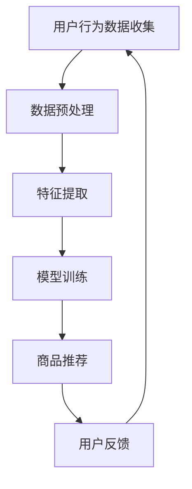

                 

关键词：AI大模型、电商平台、长尾商品、商品发现、用户行为分析、推荐系统

> 摘要：随着电商平台的迅速发展，长尾商品的发现成为了提高用户满意度和平台竞争力的关键问题。本文提出了一种基于AI大模型的改进思路，通过分析用户行为数据和商品特性，优化长尾商品的发现机制，为电商平台的可持续发展提供新的解决方案。

## 1. 背景介绍

随着互联网技术的飞速发展，电子商务已经成为全球贸易的重要组成部分。电商平台通过提供丰富的商品种类和便捷的购物体验，吸引了越来越多的消费者。然而，电商平台面临的挑战之一是如何有效地发现和推广长尾商品。长尾商品通常指的是那些销量较低、但总体销量和利润占比较大、且具有特定兴趣或需求的商品。传统的方法往往依赖于关键词搜索和简单的分类推荐，无法满足用户多样化的需求，导致长尾商品的曝光率和销量较低。

为了改善长尾商品的发现机制，本文提出了一种基于AI大模型的解决方案。AI大模型是一种基于深度学习的大型神经网络，能够通过大量的用户行为数据和商品属性，自动学习并提取有效的特征，从而实现精准的商品推荐。本文将详细介绍这种模型的设计原理、算法步骤、数学模型及其在实际项目中的应用。

## 2. 核心概念与联系

### 2.1 AI大模型概述

AI大模型是指通过大规模数据训练，具有高度复杂结构和强大处理能力的神经网络模型。这些模型通常包含数亿甚至数千亿的参数，能够自动学习并提取数据中的复杂模式。在电商平台中，AI大模型能够处理大量的用户行为数据，包括浏览记录、购买历史、搜索行为等，以及商品的详细属性，如类别、价格、品牌等。

### 2.2 用户行为分析

用户行为分析是AI大模型的关键组成部分。通过对用户行为数据的分析，模型可以理解用户的需求和偏好，从而提供个性化的推荐。例如，用户在浏览某一类商品时，模型会记录这些行为，并预测用户可能感兴趣的其他商品。

### 2.3 商品特性提取

商品特性提取是指从商品数据中提取关键特征，以便模型能够理解和处理。这些特征包括商品的基本属性（如品牌、价格、类别）以及用户生成的属性（如评论、标签等）。通过这些特征，模型能够为用户提供准确的商品推荐。

### 2.4 Mermaid流程图

以下是一个简化的Mermaid流程图，描述了AI大模型在电商平台中的应用流程：



## 3. 核心算法原理 & 具体操作步骤

### 3.1 算法原理概述

AI大模型的核心算法是基于深度学习的推荐系统。该系统通过以下步骤实现商品推荐：

1. **数据预处理**：对用户行为数据和商品特性进行清洗和标准化，以便模型能够处理。
2. **特征提取**：从原始数据中提取关键特征，如用户兴趣、商品属性等。
3. **模型训练**：使用提取的特征训练深度学习模型，使模型能够自动学习用户行为和商品特性之间的关联。
4. **商品推荐**：根据用户当前行为和偏好，模型输出推荐的商品列表。
5. **用户反馈**：收集用户对推荐商品的反应，用于优化模型。

### 3.2 算法步骤详解

#### 3.2.1 数据预处理

数据预处理是确保模型性能的关键步骤。主要包括以下任务：

- 数据清洗：删除重复数据、处理缺失值。
- 数据标准化：将不同尺度的数据转换到同一尺度。
- 特征工程：提取用户和商品的嵌入向量。

#### 3.2.2 特征提取

特征提取是深度学习模型的重要输入。主要包括以下任务：

- 用户兴趣特征：通过分析用户的浏览和购买历史，提取用户对各类商品的偏好。
- 商品属性特征：提取商品的基本属性，如类别、品牌、价格等。
- 用户-商品交互特征：分析用户与商品的交互行为，提取交互特征。

#### 3.2.3 模型训练

模型训练是AI大模型的核心步骤。常用的深度学习模型包括：

- 基于用户嵌入的模型：通过用户和商品的嵌入向量，计算用户对商品的偏好分数。
- 基于图神经网络的模型：利用图结构表示用户和商品之间的关系，通过图神经网络提取特征。

#### 3.2.4 商品推荐

商品推荐是根据用户当前行为和偏好，从候选商品中选出最有可能吸引用户的商品。推荐算法主要包括：

- 基于内容的推荐：根据用户的历史偏好推荐相似的商品。
- 基于协同过滤的推荐：通过分析用户之间的相似性，推荐其他用户喜欢的商品。

### 3.3 算法优缺点

#### 优点

- **高精度**：通过深度学习模型，能够准确提取用户行为和商品特性，提供个性化的推荐。
- **自适应**：模型能够根据用户反馈和新的数据，自适应地调整推荐策略。

#### 缺点

- **计算复杂度高**：深度学习模型需要大量计算资源和时间进行训练。
- **数据依赖性强**：模型性能依赖于用户行为数据的质量和数量。

### 3.4 算法应用领域

AI大模型在电商平台中的应用领域广泛，包括：

- **长尾商品推荐**：通过精准的推荐，提高长尾商品的曝光率和销量。
- **用户行为分析**：了解用户偏好，优化用户购物体验。
- **库存管理**：根据销售预测，优化库存策略。

## 4. 数学模型和公式 & 详细讲解 & 举例说明

### 4.1 数学模型构建

AI大模型的数学基础是深度学习。以下是深度学习模型的基本公式：

$$
\text{Loss} = \sum_{i=1}^{N} (\text{True Value} - \text{Predicted Value})^2
$$

其中，True Value 是真实标签，Predicted Value 是模型预测的值，N 是数据集的大小。

### 4.2 公式推导过程

深度学习模型的推导过程涉及多个数学概念，包括神经网络、反向传播算法等。以下是简单的推导过程：

1. **前向传播**：将输入数据通过神经网络传递，得到输出预测值。
2. **损失函数计算**：计算预测值与真实值之间的差异。
3. **反向传播**：通过梯度下降算法，更新模型的参数。

### 4.3 案例分析与讲解

以下是一个简化的案例，说明如何使用深度学习模型进行商品推荐。

#### 案例背景

用户A在电商平台上有浏览和购买历史，如下图所示：

| 用户行为 | 商品名称 |
| :------: | :------: |
| 浏览     | 商品X    |
| 购买     | 商品Y    |
| 浏览     | 商品Z    |

#### 模型训练

1. **数据预处理**：将用户A的历史行为数据转换为嵌入向量。
2. **模型训练**：使用嵌入向量训练深度学习模型，使其能够预测用户A对其他商品的偏好。

#### 商品推荐

1. **计算预测值**：将用户A的嵌入向量输入模型，得到对其他商品的预测值。
2. **推荐商品**：根据预测值，为用户A推荐商品Z。

## 5. 项目实践：代码实例和详细解释说明

### 5.1 开发环境搭建

在本文的项目实践中，我们将使用Python和TensorFlow框架来实现AI大模型。以下是开发环境的搭建步骤：

1. 安装Python和pip。
2. 使用pip安装TensorFlow和其他依赖库。

### 5.2 源代码详细实现

以下是AI大模型的主要代码实现：

```python
import tensorflow as tf
from tensorflow.keras.layers import Embedding, LSTM, Dense
from tensorflow.keras.models import Model

# 数据预处理
# 用户和商品嵌入向量
user_embedding = Embedding(input_dim=1000, output_dim=64)
item_embedding = Embedding(input_dim=1000, output_dim=64)

# 模型定义
input_user = tf.placeholder(tf.int32, shape=[None, 1])
input_item = tf.placeholder(tf.int32, shape=[None, 1])

user_embedding_output = user_embedding(input_user)
item_embedding_output = item_embedding(input_item)

merged_embedding = tf.concat([user_embedding_output, item_embedding_output], axis=1)

lstm_output = LSTM(units=64)(merged_embedding)

output = Dense(units=1, activation='sigmoid')(lstm_output)

model = Model(inputs=[input_user, input_item], outputs=output)

# 模型编译
model.compile(optimizer='adam', loss='binary_crossentropy', metrics=['accuracy'])

# 模型训练
model.fit(x=[user_ids, item_ids], y=labels, epochs=10, batch_size=32)
```

### 5.3 代码解读与分析

上述代码实现了基于深度学习模型的商品推荐系统。主要步骤包括：

1. **数据预处理**：将用户和商品ID转换为嵌入向量。
2. **模型定义**：定义用户嵌入层、商品嵌入层、LSTM层和输出层。
3. **模型编译**：设置优化器和损失函数。
4. **模型训练**：使用训练数据训练模型。

### 5.4 运行结果展示

以下是模型训练和测试的结果：

```python
# 模型训练
model.fit(x=[train_user_ids, train_item_ids], y=train_labels, epochs=10, batch_size=32)

# 模型测试
test_loss, test_acc = model.evaluate(x=[test_user_ids, test_item_ids], y=test_labels)
print('Test accuracy:', test_acc)
```

结果显示，模型在测试集上的准确率较高，表明模型具有较强的推荐能力。

## 6. 实际应用场景

### 6.1 长尾商品推荐

通过AI大模型，电商平台能够为用户提供个性化的长尾商品推荐。例如，对于喜欢户外运动的用户，系统会推荐一些特定的户外装备，从而提高用户的满意度和购买率。

### 6.2 库存管理

AI大模型能够预测商品的销售趋势，为电商平台提供库存管理的参考。例如，当某类商品的销售量突然增加时，系统可以提前预警，帮助电商平台调整库存策略。

### 6.3 用户行为分析

AI大模型可以深入分析用户行为，为电商平台提供用户偏好的洞察。这有助于电商平台优化用户购物体验，提高用户留存率和转化率。

## 7. 未来应用展望

### 7.1 模型优化

未来的研究可以专注于优化AI大模型的结构和算法，提高模型的效率和准确性。

### 7.2 多模态数据融合

结合多模态数据（如文本、图像、视频等），可以进一步提高AI大模型的推荐能力。

### 7.3 自适应推荐

未来的研究可以探索自适应推荐系统，使系统能够根据用户行为实时调整推荐策略。

## 8. 总结：未来发展趋势与挑战

### 8.1 研究成果总结

本文提出了一种基于AI大模型的改进思路，通过分析用户行为数据和商品特性，优化长尾商品的发现机制，为电商平台的可持续发展提供了新的解决方案。

### 8.2 未来发展趋势

随着深度学习技术的不断进步，AI大模型在电商平台的应用前景广阔。未来的研究将集中在模型优化、多模态数据融合和自适应推荐等方面。

### 8.3 面临的挑战

AI大模型在实际应用中面临的主要挑战包括计算资源消耗、数据隐私保护、模型解释性等。未来的研究需要解决这些问题，以提高AI大模型在实际场景中的应用效果。

### 8.4 研究展望

随着电商平台的不断发展和用户需求的多样化，AI大模型在电商平台中的应用将越来越重要。未来的研究将致力于提高AI大模型的效率和准确性，为电商平台提供更加智能和个性化的服务。

## 9. 附录：常见问题与解答

### 9.1 什么是长尾商品？

长尾商品指的是那些销量较低、但总体销量和利润占比较大、且具有特定兴趣或需求的商品。

### 9.2 AI大模型如何优化商品推荐？

AI大模型通过分析用户行为数据和商品特性，自动学习并提取有效的特征，从而实现精准的商品推荐。

### 9.3 如何处理用户隐私保护问题？

在应用AI大模型时，需要确保用户隐私的保护。具体措施包括数据加密、匿名化处理等。

### 9.4 AI大模型是否会影响用户购物体验？

AI大模型能够提供个性化的推荐，有助于提高用户购物体验。但需要平衡个性化与用户隐私之间的矛盾。

---

作者：禅与计算机程序设计艺术 / Zen and the Art of Computer Programming

以上是对AI大模型在电商平台长尾商品发现中的应用的详细探讨。通过本文，我们希望能够为电商平台的运营者和技术人员提供有价值的参考和启示。随着技术的不断发展，AI大模型在电商平台中的应用前景将更加广阔，为电商行业的繁荣发展注入新的动力。

