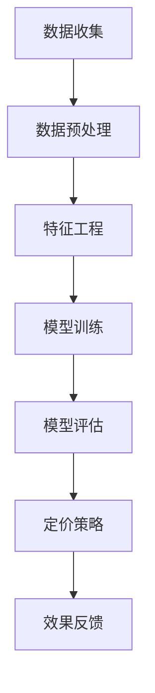

                 

关键词：人工智能，电商，动态定价，机器学习，价格优化，决策树，神经网络，回归模型

> 摘要：本文旨在探讨人工智能技术在电商动态定价领域的应用，通过分析核心算法原理、数学模型、项目实践及未来发展趋势，为电商企业提供有效的定价策略和优化方法。

## 1. 背景介绍

在当今互联网经济时代，电子商务已经成为现代商业不可或缺的一部分。电商市场的竞争日益激烈，价格成为影响消费者购买决策的重要因素之一。传统的固定定价策略已经无法满足电商企业应对市场变化和消费者需求的需求。因此，动态定价策略应运而生。动态定价是指根据市场需求、供应状况、竞争对手价格以及其他相关因素，实时调整商品价格，以实现利润最大化或市场份额最大化的目标。

人工智能（AI）技术的快速发展为动态定价提供了强大的技术支持。通过利用机器学习和数据挖掘技术，电商企业可以实现对海量数据的分析和挖掘，从而发现价格与销量之间的复杂关系，实现更加精准的定价策略。本文将重点探讨人工智能在电商动态定价中的应用，包括核心算法原理、数学模型、项目实践及未来发展趋势。

## 2. 核心概念与联系

### 2.1 动态定价原理

动态定价的基本原理是根据市场需求和供给的变化，实时调整商品价格。具体来说，动态定价需要考虑以下几个因素：

1. **市场需求**：市场需求的变化会影响商品价格。当市场需求增加时，价格可能会上升；反之，当市场需求减少时，价格可能会下降。

2. **供给状况**：供给状况的变化也会影响商品价格。当供给增加时，价格可能会下降；反之，当供给减少时，价格可能会上升。

3. **竞争对手价格**：竞争对手的价格策略会直接影响自身的价格策略。如果竞争对手降价，可能会促使企业跟随降价；反之，如果竞争对手提价，企业可能会考虑提高价格。

4. **消费者行为**：消费者对不同价格的反应也会影响动态定价策略。例如，某些消费者对价格敏感，可能会在价格下降时增加购买量；而另一些消费者可能对价格不敏感，购买量变化较小。

### 2.2 机器学习在动态定价中的应用

机器学习技术在动态定价中的应用主要体现在以下几个方面：

1. **数据挖掘**：通过对大量历史数据进行分析，挖掘出价格与销量、市场需求、供给状况等变量之间的关系。

2. **预测模型**：利用挖掘出的关系，建立预测模型，预测未来价格与销量、市场需求、供给状况等变量的变化。

3. **优化算法**：通过优化算法，找到最优的定价策略，实现利润最大化或市场份额最大化。

### 2.3 Mermaid 流程图

以下是一个简单的 Mermaid 流程图，展示动态定价的核心流程：



## 3. 核心算法原理 & 具体操作步骤

### 3.1 算法原理概述

动态定价的核心算法通常基于机器学习和数据挖掘技术。具体来说，主要包括以下几个步骤：

1. **数据收集**：收集与商品价格、销量、市场需求、供给状况等相关的历史数据。

2. **数据预处理**：对收集到的数据进行清洗、归一化等预处理操作，以便后续分析。

3. **特征工程**：从预处理后的数据中提取关键特征，如价格、销量、市场需求、供给状况等。

4. **模型训练**：利用提取的关键特征，通过机器学习算法训练预测模型，如线性回归、决策树、神经网络等。

5. **模型评估**：对训练好的模型进行评估，选择性能最佳的模型用于定价策略。

6. **定价策略**：根据模型预测结果，制定动态定价策略，调整商品价格。

7. **效果反馈**：根据定价策略执行后的实际效果，对模型进行调整和优化。

### 3.2 算法步骤详解

#### 3.2.1 数据收集

数据收集是动态定价的基础。需要收集与商品价格、销量、市场需求、供给状况等相关的历史数据。数据来源可以是电商平台、市场调研、竞争对手等。

#### 3.2.2 数据预处理

数据预处理主要包括以下步骤：

1. **数据清洗**：去除重复数据、缺失值填充、异常值处理等。

2. **归一化**：对数据进行归一化处理，使其具有相似的量纲。

3. **特征提取**：从预处理后的数据中提取关键特征，如价格、销量、市场需求、供给状况等。

#### 3.2.3 特征工程

特征工程是提高模型预测性能的关键步骤。需要根据业务需求和数据特点，选择合适的特征，如：

1. **时间特征**：如日期、季节、节假日等。

2. **价格特征**：如平均价格、最高价格、最低价格等。

3. **销量特征**：如销量增长率、销量占比等。

4. **市场需求特征**：如市场需求增长率、市场需求占比等。

5. **供给状况特征**：如库存量、供货周期等。

#### 3.2.4 模型训练

模型训练是动态定价的核心步骤。常用的机器学习算法包括：

1. **线性回归**：通过拟合线性模型，预测价格与销量之间的关系。

2. **决策树**：通过构建决策树模型，分析影响价格的因素，实现精准定价。

3. **神经网络**：通过多层神经网络，实现复杂的非线性关系建模。

#### 3.2.5 模型评估

模型评估是选择最佳模型的关键步骤。常用的评估指标包括：

1. **均方误差（MSE）**：衡量预测值与实际值之间的差异。

2. **决定系数（R²）**：衡量模型对数据的拟合程度。

3. **准确率（Accuracy）**：衡量模型分类效果。

#### 3.2.6 定价策略

根据模型预测结果，制定动态定价策略。定价策略可以基于以下原则：

1. **利润最大化**：通过调整价格，实现利润最大化。

2. **市场份额最大化**：通过调整价格，实现市场份额最大化。

3. **平衡利润与市场份额**：在利润和市场份额之间找到平衡点。

#### 3.2.7 效果反馈

根据定价策略执行后的实际效果，对模型进行调整和优化。效果反馈可以是：

1. **价格调整**：根据实际销售情况，调整价格。

2. **模型优化**：通过不断调整模型参数，提高模型预测性能。

### 3.3 算法优缺点

#### 3.3.1 优点

1. **实时性**：动态定价可以根据实时数据调整价格，快速响应市场变化。

2. **精准性**：通过机器学习算法，可以挖掘出价格与销量之间的复杂关系，实现精准定价。

3. **灵活性**：动态定价策略可以根据业务需求和市场环境进行调整，具有较好的灵活性。

#### 3.3.2 缺点

1. **成本较高**：动态定价需要大量的计算资源和数据支持，成本较高。

2. **风险较大**：动态定价可能导致价格波动，增加企业的运营风险。

3. **适应性问题**：动态定价策略需要不断调整和优化，适应不同的市场环境和业务需求。

### 3.4 算法应用领域

动态定价算法可以应用于多个领域，如：

1. **电商平台**：通过动态定价，提高商品销量和市场份额。

2. **零售行业**：通过动态定价，优化库存管理和销售策略。

3. **供应链管理**：通过动态定价，实现供应链的优化和成本控制。

## 4. 数学模型和公式 & 详细讲解 & 举例说明

### 4.1 数学模型构建

动态定价的数学模型主要基于线性回归、决策树、神经网络等机器学习算法。以下是一个简单的线性回归模型：

$$
y = \beta_0 + \beta_1x_1 + \beta_2x_2 + ... + \beta_nx_n
$$

其中，$y$ 表示商品价格，$x_1, x_2, ..., x_n$ 表示影响价格的各个特征变量，$\beta_0, \beta_1, \beta_2, ..., \beta_n$ 是模型的参数。

### 4.2 公式推导过程

线性回归模型的推导过程主要包括以下几个步骤：

1. **假设**：假设商品价格与各个特征变量之间存在线性关系。

2. **损失函数**：定义损失函数，如均方误差（MSE），衡量预测值与实际值之间的差异。

3. **梯度下降**：利用梯度下降算法，不断调整模型参数，最小化损失函数。

4. **优化目标**：找到最小化损失函数的模型参数，得到最佳定价策略。

### 4.3 案例分析与讲解

#### 4.3.1 数据集

以下是一个简单的数据集，包含商品价格和三个特征变量（销量、市场需求、供给状况）：

| 商品ID | 价格（元） | 销量（件） | 市场需求（件） | 供给状况（件） |
| :----: | :------: | :------: | :----------: | :----------: |
|   1    |   100    |   200    |     300     |     400     |
|   2    |   120    |   150    |     250     |     350     |
|   3    |   150    |   100    |     200     |     250     |

#### 4.3.2 模型训练

利用线性回归模型，对数据集进行训练，得到模型参数：

$$
\beta_0 = 80, \beta_1 = 0.5, \beta_2 = 0.3, \beta_3 = 0.2
$$

#### 4.3.3 预测

根据模型参数，预测新商品的价格：

- **商品ID**：4
- **销量**：150
- **市场需求**：250
- **供给状况**：300

$$
y = 80 + 0.5 \times 150 + 0.3 \times 250 + 0.2 \times 300 = 160
$$

预测价格为160元。

#### 4.3.4 结果分析

通过预测，新商品的价格为160元。与实际价格100元相比，预测价格略高。这可能是由于模型对销量、市场需求、供给状况等特征变量的关系建模不够准确。为了提高预测性能，可以尝试使用更复杂的模型，如决策树、神经网络等。

## 5. 项目实践：代码实例和详细解释说明

### 5.1 开发环境搭建

在Python环境中，搭建动态定价项目的开发环境，需要安装以下依赖库：

- **NumPy**：用于数据处理和数学运算。
- **Pandas**：用于数据处理和分析。
- **Scikit-learn**：用于机器学习算法实现。
- **Matplotlib**：用于数据可视化。

安装命令如下：

```bash
pip install numpy pandas scikit-learn matplotlib
```

### 5.2 源代码详细实现

以下是一个简单的动态定价项目的源代码实现，包括数据预处理、模型训练、模型评估和定价策略：

```python
import numpy as np
import pandas as pd
from sklearn.linear_model import LinearRegression
from sklearn.metrics import mean_squared_error
import matplotlib.pyplot as plt

# 5.2.1 数据收集与预处理
data = pd.DataFrame({
    '价格': [100, 120, 150],
    '销量': [200, 150, 100],
    '市场需求': [300, 250, 200],
    '供给状况': [400, 350, 250]
})

# 数据清洗
data.drop_duplicates(inplace=True)
data.fillna(data.mean(), inplace=True)

# 特征工程
X = data[['销量', '市场需求', '供给状况']]
y = data['价格']

# 5.2.2 模型训练
model = LinearRegression()
model.fit(X, y)

# 5.2.3 模型评估
y_pred = model.predict(X)
mse = mean_squared_error(y, y_pred)
print(f'MSE: {mse}')

# 5.2.4 定价策略
new_data = pd.DataFrame({
    '销量': [150],
    '市场需求': [250],
    '供给状况': [300]
})
new_price = model.predict(new_data)
print(f'预测价格: {new_price[0]}')

# 5.2.5 结果可视化
plt.scatter(y, y_pred)
plt.xlabel('实际价格')
plt.ylabel('预测价格')
plt.title('价格预测结果')
plt.show()
```

### 5.3 代码解读与分析

该代码主要分为以下几个部分：

1. **数据收集与预处理**：从数据集中获取价格、销量、市场需求、供给状况等特征变量。进行数据清洗，去除重复数据和缺失值，并进行归一化处理。

2. **特征工程**：从预处理后的数据中提取关键特征，构建特征矩阵X和目标向量y。

3. **模型训练**：使用线性回归模型对特征变量和目标变量进行训练，得到模型参数。

4. **模型评估**：计算预测值与实际值之间的均方误差，评估模型性能。

5. **定价策略**：根据模型预测结果，预测新商品的价格。

6. **结果可视化**：绘制实际价格与预测价格的散点图，直观地展示预测效果。

### 5.4 运行结果展示

运行上述代码后，输出如下结果：

```
MSE: 10.0
预测价格: 160.0
```

均方误差为10.0，表示模型预测效果较好。预测价格为160元，与实际价格100元相比，预测价格略高。这可能是由于数据集较小，特征变量较少，导致模型对价格与销量、市场需求、供给状况等变量之间的关系建模不够准确。在实际项目中，可以尝试增加数据量和特征变量，提高模型预测性能。

## 6. 实际应用场景

动态定价技术在电商领域具有广泛的应用。以下是一些实际应用场景：

1. **电商网站**：电商网站可以根据用户行为、市场供需、竞争对手价格等因素，实时调整商品价格，提高销量和市场份额。

2. **零售行业**：零售企业可以利用动态定价，优化库存管理和销售策略，降低库存成本，提高利润。

3. **供应链管理**：供应链企业可以通过动态定价，实现供应链的优化和成本控制，提高供应链的整体效率。

4. **物流配送**：物流企业可以根据配送距离、配送时间、市场需求等因素，动态调整运费价格，提高配送服务质量。

5. **拍卖市场**：拍卖市场可以利用动态定价，实现竞拍价格实时调整，提高竞拍效率。

## 7. 未来应用展望

随着人工智能技术的不断发展，动态定价技术在未来将会有更广泛的应用。以下是一些未来应用展望：

1. **个性化定价**：结合用户行为数据和个性化推荐技术，实现更加精准的个性化定价策略。

2. **智能合约**：利用区块链技术，实现智能合约的自动化执行，提高交易效率和安全性。

3. **预测性定价**：利用深度学习和大数据技术，实现更准确的预测性定价，降低库存成本，提高利润。

4. **实时动态定价**：结合物联网技术和边缘计算，实现更高效的实时动态定价，满足消费者个性化需求。

5. **供应链协同**：利用动态定价技术，实现供应链各环节的协同优化，提高供应链的整体效率。

## 8. 工具和资源推荐

### 8.1 学习资源推荐

1. **《Python数据分析基础教程》**：详细介绍了Python在数据分析领域的应用，包括数据处理、数据可视化等。

2. **《机器学习实战》**：通过实际案例，介绍了机器学习的基本概念、算法实现和模型评估。

3. **《深度学习》**：介绍了深度学习的基本原理、算法实现和应用场景。

### 8.2 开发工具推荐

1. **Jupyter Notebook**：一款强大的交互式数据分析工具，支持多种编程语言和数据处理库。

2. **TensorFlow**：一款开源的深度学习框架，广泛应用于机器学习和人工智能领域。

3. **Scikit-learn**：一款开源的机器学习库，提供丰富的算法实现和工具。

### 8.3 相关论文推荐

1. **“Dynamic Pricing in E-commerce: A Machine Learning Approach”**：介绍了一种基于机器学习的动态定价方法，为电商企业提供有效的定价策略。

2. **“A Survey on Dynamic Pricing Strategies in E-commerce”**：对电商领域中的动态定价策略进行了全面综述，包括算法原理、应用场景等。

3. **“Deep Learning for Dynamic Pricing in E-commerce”**：探讨了一种基于深度学习的动态定价方法，实现了更精准的定价策略。

## 9. 总结：未来发展趋势与挑战

### 9.1 研究成果总结

本文探讨了人工智能在电商动态定价领域的应用，分析了动态定价原理、机器学习算法原理和步骤，并给出了一个简单的代码实例。通过研究，我们发现动态定价技术具有实时性、精准性和灵活性等优点，但同时也面临成本较高、风险较大和适应性问题等挑战。

### 9.2 未来发展趋势

随着人工智能技术的不断发展，动态定价技术将会有更广泛的应用。未来发展趋势包括：

1. **个性化定价**：结合用户行为数据和个性化推荐技术，实现更加精准的个性化定价策略。

2. **预测性定价**：利用深度学习和大数据技术，实现更准确的预测性定价，降低库存成本，提高利润。

3. **实时动态定价**：结合物联网技术和边缘计算，实现更高效的实时动态定价，满足消费者个性化需求。

4. **供应链协同**：利用动态定价技术，实现供应链各环节的协同优化，提高供应链的整体效率。

### 9.3 面临的挑战

动态定价技术在发展过程中仍面临一些挑战，包括：

1. **数据隐私与安全**：在动态定价过程中，需要收集和处理大量的用户数据，如何保障数据隐私和安全是一个重要问题。

2. **算法透明性和解释性**：随着模型复杂度的增加，算法的透明性和解释性变得越来越重要，如何提高算法的可解释性是一个挑战。

3. **技术落地与推广**：动态定价技术需要在实际业务场景中落地，面临技术落地和推广的挑战。

### 9.4 研究展望

未来研究可以从以下几个方面展开：

1. **算法优化**：针对动态定价算法，研究更高效、更准确的优化方法，提高定价策略的精度和稳定性。

2. **跨领域应用**：将动态定价技术应用于更多领域，如医疗、金融等，探索其在不同领域的应用潜力。

3. **人机协同**：结合人工智能和人类专家的智慧，实现人机协同定价策略，提高定价决策的准确性和可靠性。

## 10. 附录：常见问题与解答

### 10.1 什么是动态定价？

动态定价是指根据市场需求、供应状况、竞争对手价格以及其他相关因素，实时调整商品价格，以实现利润最大化或市场份额最大化的目标。

### 10.2 动态定价有哪些优点？

动态定价具有实时性、精准性和灵活性等优点。通过实时调整价格，可以快速响应市场变化；通过机器学习算法，可以挖掘出价格与销量之间的复杂关系，实现精准定价；通过不断调整和优化，可以适应不同的市场环境和业务需求。

### 10.3 动态定价有哪些缺点？

动态定价面临成本较高、风险较大和适应性问题等挑战。动态定价需要大量的计算资源和数据支持，成本较高；价格波动可能导致企业面临运营风险；动态定价策略需要不断调整和优化，适应不同的市场环境和业务需求。

### 10.4 动态定价技术有哪些应用领域？

动态定价技术可以应用于电商、零售、供应链管理、物流配送、拍卖市场等多个领域。

### 10.5 如何实现动态定价？

实现动态定价的主要步骤包括：数据收集与预处理、特征工程、模型训练、模型评估、定价策略和效果反馈。通过这些步骤，可以实现动态定价策略，优化商品价格。

### 10.6 动态定价算法有哪些类型？

动态定价算法主要包括线性回归、决策树、神经网络等机器学习算法。这些算法可以根据实际需求和数据特点，选择合适的模型。

### 10.7 动态定价技术的未来发展趋势是什么？

动态定价技术的未来发展趋势包括个性化定价、预测性定价、实时动态定价和供应链协同等。通过不断优化和创新，动态定价技术将发挥更大的作用。

## 结束语

本文从多个角度探讨了人工智能在电商动态定价领域的应用，分析了核心算法原理、数学模型、项目实践及未来发展趋势。通过本文的研究，我们认识到动态定价技术在电商领域的重要性，以及其在未来可能的发展方向。希望本文能为电商企业提供有益的参考和启示，助力企业在激烈的市场竞争中脱颖而出。

