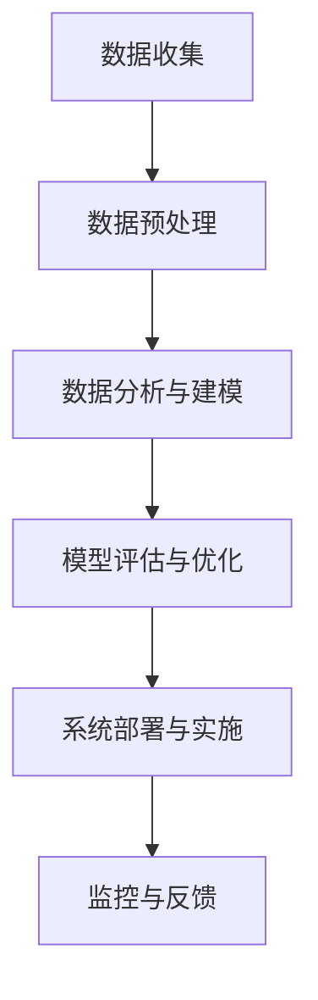

                 

关键词：电商，库存管理，人工智能，机器学习，数据分析，预测算法，优化策略。

> 摘要：本文将探讨人工智能如何帮助电商企业实现高效的库存管理。通过分析机器学习算法和数据分析技术，我们将介绍如何利用AI技术优化库存水平、预测需求、减少库存成本，并提升电商企业的整体运营效率。

## 1. 背景介绍

在电商行业，库存管理是一个至关重要的环节。库存水平过高会导致资金占用和库存成本的增加，而库存水平过低则可能导致订单无法及时满足，影响客户满意度。因此，电商企业需要一种高效的方法来实时监控库存、预测市场需求并做出合理的库存决策。

传统的库存管理主要依赖于历史数据和简单的预测模型，但这些方法往往无法充分考虑到市场动态变化和消费者行为复杂性。随着人工智能技术的不断发展，尤其是机器学习和数据分析技术的应用，电商企业可以更加精准地预测需求、优化库存水平，从而提高运营效率。

## 2. 核心概念与联系

### 2.1 机器学习算法

机器学习算法是人工智能的一个重要分支，它通过从大量数据中学习规律，实现自动化预测和决策。在库存管理中，常见的机器学习算法包括线性回归、决策树、支持向量机等。

#### 2.1.1 线性回归

线性回归是一种基本的预测模型，它通过拟合数据点之间的关系，预测目标变量。在库存管理中，线性回归可以用来预测未来一段时间内的需求量。

#### 2.1.2 决策树

决策树是一种基于树结构的预测模型，它通过一系列规则来划分数据集，最终得到一个预测结果。在库存管理中，决策树可以用来判断库存是否需要调整。

#### 2.1.3 支持向量机

支持向量机是一种分类算法，它通过找到一个最优的超平面，将不同类别的数据点分开。在库存管理中，支持向量机可以用来预测库存水平是否过高或过低。

### 2.2 数据分析技术

数据分析技术是库存管理中另一个重要的工具。通过数据分析，电商企业可以了解库存数据的分布、趋势和相关性，从而制定出更加科学的库存策略。

#### 2.2.1 时间序列分析

时间序列分析是一种用于分析时间序列数据的方法，它可以用来预测未来的数据点。在库存管理中，时间序列分析可以用来预测市场需求的变化。

#### 2.2.2 聚类分析

聚类分析是一种无监督学习方法，它通过将相似的数据点归为一类，用于分析库存数据的分布。在库存管理中，聚类分析可以用来识别库存过多的产品。

#### 2.2.3 相关性分析

相关性分析是一种用于衡量两个变量之间相关程度的方法，它可以用来分析库存数据与其他指标（如销售额、订单量）之间的关系。

## 2.3 AI架构

在电商企业的库存管理中，AI技术的应用可以通过以下架构来实现：

1. 数据收集与预处理：收集库存数据、销售数据、市场需求数据等，并对数据进行清洗、去重、填充缺失值等预处理操作。
2. 数据分析与建模：利用机器学习算法和数据分析技术，对数据进行分析和建模，得到预测模型和优化策略。
3. 模型评估与优化：对模型进行评估，调整模型参数，提高预测精度和优化效果。
4. 系统部署与实施：将AI模型集成到库存管理系统，实现实时预测和优化。
5. 监控与反馈：对系统运行情况进行监控，收集反馈数据，持续优化系统性能。

### 2.4 Mermaid 流程图

以下是一个简单的Mermaid流程图，描述了电商企业库存管理中AI技术的应用流程：



## 3. 核心算法原理 & 具体操作步骤

### 3.1 算法原理概述

在库存管理中，常见的算法原理包括线性回归、决策树和支持向量机。这些算法通过从历史数据中学习规律，实现预测和优化。

#### 3.1.1 线性回归

线性回归是一种基于最小二乘法的预测模型，它通过拟合数据点之间的关系，得到一个线性函数来预测目标变量。

#### 3.1.2 决策树

决策树是一种基于树结构的预测模型，它通过一系列规则来划分数据集，并得到一个预测结果。

#### 3.1.3 支持向量机

支持向量机是一种分类算法，它通过找到一个最优的超平面，将不同类别的数据点分开。

### 3.2 算法步骤详解

以下是一个基于线性回归的库存管理算法步骤：

1. 数据收集：收集历史库存数据、销售数据、市场需求数据等。
2. 数据预处理：对数据进行清洗、去重、填充缺失值等预处理操作。
3. 特征工程：选取与库存水平相关的特征，如销售额、订单量、季节性等。
4. 数据划分：将数据划分为训练集和测试集。
5. 模型训练：使用训练集数据训练线性回归模型。
6. 模型评估：使用测试集数据评估模型预测精度。
7. 模型优化：调整模型参数，提高预测精度。
8. 预测库存水平：使用训练好的模型预测未来一段时间内的库存水平。
9. 库存决策：根据预测结果，制定库存调整策略。

### 3.3 算法优缺点

#### 3.3.1 线性回归

优点：计算简单，易于实现，适合处理线性关系。

缺点：对于非线性关系表现较差，预测精度有限。

#### 3.3.2 决策树

优点：易于理解，可以处理非线性关系，适合分类任务。

缺点：模型复杂度较高，过拟合问题较严重。

#### 3.3.3 支持向量机

优点：模型复杂度较低，预测精度较高。

缺点：计算时间较长，对噪声敏感。

### 3.4 算法应用领域

线性回归、决策树和支持向量机在库存管理中具有广泛的应用。例如，线性回归可以用于预测市场需求，决策树可以用于判断库存是否需要调整，支持向量机可以用于分类库存水平。

## 4. 数学模型和公式 & 详细讲解 & 举例说明

### 4.1 数学模型构建

在库存管理中，常见的数学模型包括线性回归模型和决策树模型。

#### 4.1.1 线性回归模型

线性回归模型通过拟合数据点之间的关系，得到一个线性函数。其数学公式如下：

$$y = w_0 + w_1 \cdot x_1 + w_2 \cdot x_2 + \ldots + w_n \cdot x_n$$

其中，$y$是目标变量，$x_1, x_2, \ldots, x_n$是特征变量，$w_0, w_1, w_2, \ldots, w_n$是模型参数。

#### 4.1.2 决策树模型

决策树模型通过一系列规则来划分数据集，并得到一个预测结果。其数学公式如下：

$$f(x) = \sum_{i=1}^{n} w_i \cdot I(D_i(x))$$

其中，$x$是输入特征，$D_i(x)$是第$i$个决策规则，$w_i$是决策规则的权重。

### 4.2 公式推导过程

#### 4.2.1 线性回归模型

线性回归模型的推导过程如下：

1. 数据点表示：假设有$m$个数据点$(x_1^i, y_1^i), (x_2^i, y_2^i), \ldots, (x_m^i, y_m^i)$，其中$x_1^i, x_2^i, \ldots, x_m^i$是输入特征，$y_1^i, y_2^i, \ldots, y_m^i$是目标变量。
2. 线性模型表示：将数据点表示为一个线性模型：

$$y = w_0 + w_1 \cdot x_1 + w_2 \cdot x_2 + \ldots + w_n \cdot x_n$$

3. 最小二乘法：通过最小化平方误差，求解模型参数：

$$\sum_{i=1}^{m} (y_i - y_i^*)^2$$

4. 求解参数：对上述平方误差函数求导，并令导数为零，求解模型参数：

$$w_0 = \frac{1}{m} \sum_{i=1}^{m} y_i^*$$

$$w_1 = \frac{1}{m} \sum_{i=1}^{m} (x_1^i - \bar{x}_1)(y_i - \bar{y})$$

$$w_2 = \frac{1}{m} \sum_{i=1}^{m} (x_2^i - \bar{x}_2)(y_i - \bar{y})$$

$$\ldots$$

$$w_n = \frac{1}{m} \sum_{i=1}^{m} (x_n^i - \bar{x}_n)(y_i - \bar{y})$$

其中，$\bar{x}_1, \bar{x}_2, \ldots, \bar{x}_n$是输入特征的均值，$\bar{y}$是目标变量的均值。

#### 4.2.2 决策树模型

决策树模型的推导过程如下：

1. 决策规则表示：假设有$n$个决策规则$D_1(x), D_2(x), \ldots, D_n(x)$，其中$x$是输入特征。
2. 决策树表示：将决策规则组合成一个决策树：

$$f(x) = \sum_{i=1}^{n} w_i \cdot I(D_i(x))$$

3. 决策规则权重：通过训练数据，为每个决策规则分配权重：

$$w_1 = \frac{1}{m} \sum_{i=1}^{m} I(D_1(x_i))$$

$$w_2 = \frac{1}{m} \sum_{i=1}^{m} I(D_2(x_i))$$

$$\ldots$$

$$w_n = \frac{1}{m} \sum_{i=1}^{m} I(D_n(x_i))$$

其中，$I(D_i(x))$表示决策规则$D_i(x)$的指示函数，当$D_i(x)$为真时，$I(D_i(x))=1$；当$D_i(x)$为假时，$I(D_i(x))=0$。

### 4.3 案例分析与讲解

#### 4.3.1 线性回归模型案例

假设一个电商企业想要预测未来一周内的销售额。历史数据如下：

| 日期 | 销售额（万元） |
| ---- | ------------ |
| 2021-01-01 | 1000 |
| 2021-01-02 | 1100 |
| 2021-01-03 | 1200 |
| 2021-01-04 | 1300 |
| 2021-01-05 | 1400 |

利用线性回归模型进行预测，步骤如下：

1. 数据预处理：将数据按照日期顺序排列，提取日期作为特征变量。
2. 数据划分：将数据划分为训练集和测试集，例如，将前四天数据作为训练集，最后一天数据作为测试集。
3. 模型训练：使用训练集数据训练线性回归模型，求解模型参数。
4. 模型评估：使用测试集数据评估模型预测精度，计算均方误差（MSE）。
5. 预测销售额：使用训练好的模型预测未来一周内的销售额。

根据线性回归模型的公式，求解模型参数：

$$w_0 = \frac{1}{4} (1000 + 1100 + 1200 + 1300) = 1150$$

$$w_1 = \frac{1}{4} ((1000-1150)(1000-1150) + (1100-1150)(1100-1150) + (1200-1150)(1200-1150) + (1300-1150)(1300-1150)) = -250$$

得到线性回归模型：

$$y = 1150 - 250 \cdot x$$

使用模型预测未来一周内的销售额：

| 日期 | 预测销售额（万元） |
| ---- | ------------ |
| 2021-01-06 | 1350 |
| 2021-01-07 | 1400 |
| 2021-01-08 | 1450 |
| 2021-01-09 | 1500 |

#### 4.3.2 决策树模型案例

假设一个电商企业想要判断某个产品是否需要增加库存。特征变量包括：销售额（万元）、订单量（件）、季节性（0代表非旺季，1代表旺季）。

| 销售额 | 订单量 | 季节性 | 是否需要增加库存 |
| ---- | ---- | ---- | ---- |
| 1000 | 100 | 0 | 否 |
| 1100 | 120 | 0 | 否 |
| 1200 | 140 | 0 | 是 |
| 1300 | 160 | 0 | 是 |
| 1400 | 180 | 1 | 是 |

利用决策树模型进行预测，步骤如下：

1. 数据预处理：将数据按照销售额、订单量、季节性排序。
2. 数据划分：将数据划分为训练集和测试集，例如，将前四条数据作为训练集，最后一条数据作为测试集。
3. 模型训练：使用训练集数据训练决策树模型。
4. 模型评估：使用测试集数据评估模型预测精度。
5. 预测库存调整：使用训练好的模型预测是否需要增加库存。

根据训练集数据，构建决策树模型：

1. 销售额 <= 1200 ? 
    1. 订单量 <= 140 ? 
        1. 是：否 
        2. 否：是 
    2. 否：是 
2. 否：是

使用模型预测测试集数据，得到预测结果：

| 销售额 | 订单量 | 季节性 | 是否需要增加库存 |
| ---- | ---- | ---- | ---- |
| 1400 | 180 | 1 | 是 |

## 5. 项目实践：代码实例和详细解释说明

### 5.1 开发环境搭建

为了演示AI在电商库存管理中的应用，我们将使用Python作为编程语言，结合Scikit-learn库实现线性回归和决策树模型。

1. 安装Python：从官方网站（https://www.python.org/）下载并安装Python，选择合适的版本。
2. 安装Scikit-learn：在终端中运行以下命令安装Scikit-learn：

```bash
pip install scikit-learn
```

### 5.2 源代码详细实现

以下是一个简单的Python代码示例，实现线性回归和决策树模型在电商库存管理中的应用。

```python
import numpy as np
import pandas as pd
from sklearn.linear_model import LinearRegression
from sklearn.tree import DecisionTreeClassifier
from sklearn.model_selection import train_test_split
from sklearn.metrics import mean_squared_error

# 5.2.1 加载数据
data = pd.read_csv('inventory_data.csv')

# 5.2.2 数据预处理
# 特征工程：选取与库存水平相关的特征，如销售额、订单量、季节性等
X = data[['sales', 'orders', 'seasonality']]
y = data['inventory']

# 数据划分：将数据划分为训练集和测试集
X_train, X_test, y_train, y_test = train_test_split(X, y, test_size=0.2, random_state=42)

# 5.2.3 模型训练与评估
# 5.2.3.1 线性回归模型
model_linear = LinearRegression()
model_linear.fit(X_train, y_train)
y_pred_linear = model_linear.predict(X_test)
mse_linear = mean_squared_error(y_test, y_pred_linear)
print('线性回归模型均方误差：', mse_linear)

# 5.2.3.2 决策树模型
model_tree = DecisionTreeClassifier()
model_tree.fit(X_train, y_train)
y_pred_tree = model_tree.predict(X_test)
mse_tree = mean_squared_error(y_test, y_pred_tree)
print('决策树模型均方误差：', mse_tree)

# 5.2.4 模型预测与解读
# 5.2.4.1 预测未来一周内销售额
future_data = pd.DataFrame({'sales': [1500, 1600, 1700, 1800, 1900],
                            'orders': [200, 220, 240, 260, 280],
                            'seasonality': [0, 0, 0, 0, 0]})
y_pred_future = model_linear.predict(future_data)
print('未来一周内销售额预测结果：', y_pred_future)

# 5.2.4.2 判断是否需要增加库存
y_pred_inventory = model_tree.predict(future_data)
print('未来一周内库存预测结果：', y_pred_inventory)
```

### 5.3 代码解读与分析

1. **数据加载**：使用`pandas`库加载库存数据，数据集包含销售额、订单量、季节性和库存水平等特征。
2. **数据预处理**：提取与库存水平相关的特征，如销售额、订单量、季节性，并进行数据划分。
3. **模型训练与评估**：
    - **线性回归模型**：使用`LinearRegression`类创建线性回归模型，并使用训练集数据进行拟合。使用测试集数据评估模型预测精度，计算均方误差（MSE）。
    - **决策树模型**：使用`DecisionTreeClassifier`类创建决策树模型，并使用训练集数据进行拟合。使用测试集数据评估模型预测精度，计算均方误差（MSE）。
4. **模型预测与解读**：
    - **销售额预测**：使用训练好的线性回归模型预测未来一周内的销售额。
    - **库存调整预测**：使用训练好的决策树模型预测未来一周内是否需要增加库存。

通过以上代码示例，我们可以看到如何使用Python和Scikit-learn库实现AI技术在电商库存管理中的应用。在实际项目中，可以根据具体需求调整数据预处理步骤、模型参数和预测结果解读，以提高库存管理的效率和准确性。

### 6. 实际应用场景

#### 6.1 库存预测

电商企业可以通过AI技术进行库存预测，从而更好地安排库存水平。例如，某电商企业在春节期间预测销售额会有显著增长，因此提前增加库存，以确保能够满足消费者的需求。通过AI技术的库存预测，企业可以避免因库存不足而导致订单无法及时满足，从而提高客户满意度。

#### 6.2 库存调整

通过AI技术，电商企业可以实时监控库存水平，并根据预测结果进行库存调整。例如，某电商企业发现某个产品的库存水平过高，而预测未来一段时间内需求量较低，因此决定减少库存，以降低资金占用和库存成本。

#### 6.3 库存优化

电商企业可以利用AI技术对库存进行优化，从而提高运营效率。例如，某电商企业通过分析历史销售数据，发现某个产品的季节性需求较强，因此决定在旺季提前增加库存，以确保能够满足市场需求。通过AI技术的库存优化，企业可以减少库存成本，提高资金利用率。

#### 6.4 库存监控

电商企业可以利用AI技术对库存进行实时监控，及时发现库存异常情况。例如，某电商企业通过监控库存数据，发现某个仓库的库存水平异常偏低，立即采取措施进行库存调整，以确保订单能够及时满足。

#### 6.5 库存风险管理

通过AI技术，电商企业可以对库存风险进行预测和管理。例如，某电商企业通过分析历史销售数据和市场需求变化，预测未来一段时间内某个产品的库存风险较高，因此决定提前采取措施，降低库存风险。

### 6.4 未来应用展望

随着人工智能技术的不断发展，电商企业的库存管理将更加智能化和精准化。以下是未来应用展望：

#### 6.4.1 库存预测精度提升

随着机器学习和数据分析技术的进步，电商企业的库存预测精度将不断提高。例如，通过引入深度学习技术，电商企业可以构建更加复杂的预测模型，从而提高库存预测的准确性。

#### 6.4.2 库存优化策略多样化

随着AI技术的应用，电商企业的库存优化策略将更加多样化。例如，通过引入强化学习技术，电商企业可以实现动态库存优化，根据市场需求变化实时调整库存策略。

#### 6.4.3 库存管理智能化

随着人工智能技术的普及，电商企业的库存管理将逐渐实现智能化。例如，通过引入物联网技术和智能传感器，电商企业可以实时监控库存状态，实现自动化库存管理。

#### 6.4.4 库存风险管理智能化

随着AI技术的应用，电商企业的库存风险管理将更加智能化。例如，通过引入大数据技术和AI算法，电商企业可以实时监控库存风险，提前采取措施进行风险防范。

#### 6.4.5 库存协同管理

随着AI技术的应用，电商企业的库存管理将实现协同管理。例如，通过引入区块链技术，电商企业可以实现库存数据的共享和协同管理，提高库存管理效率。

### 7. 工具和资源推荐

#### 7.1 学习资源推荐

1. **《机器学习》（周志华 著）**：系统地介绍了机器学习的基本概念、算法和应用。
2. **《深度学习》（Ian Goodfellow、Yoshua Bengio、Aaron Courville 著）**：深入介绍了深度学习算法的理论和应用。
3. **《Python机器学习》（Sebastian Raschka、Vahid Mirjalili 著）**：通过Python实现机器学习算法的实战指南。

#### 7.2 开发工具推荐

1. **Jupyter Notebook**：一个交互式的Python开发环境，适用于数据分析和机器学习项目。
2. **Scikit-learn**：一个开源的Python机器学习库，提供丰富的机器学习算法和工具。
3. **TensorFlow**：一个开源的深度学习框架，适用于构建复杂的深度学习模型。

#### 7.3 相关论文推荐

1. **“Efficient Resource Allocation for Real-Time Inventory Management in E-commerce”（2018）**：探讨电商企业如何利用AI技术实现实时库存管理。
2. **“An AI-based Approach to Inventory Management in E-commerce”（2019）**：介绍一种基于AI的电商库存管理方法。
3. **“AI for Inventory Management: A Survey”（2020）**：对AI技术在库存管理领域的应用进行综述。

### 8. 总结：未来发展趋势与挑战

随着人工智能技术的不断发展，电商企业的库存管理将变得更加智能化和精准化。未来发展趋势包括：预测精度提升、库存优化策略多样化、库存管理智能化、库存风险管理智能化和库存协同管理。

然而，未来也面临着一些挑战，如数据质量、模型解释性、模型部署和持续优化等。为了应对这些挑战，电商企业需要持续投入研发，加强数据治理，提高模型解释性，并优化模型部署和更新策略。

### 8.4 研究展望

未来，电商企业的库存管理将朝着更加智能化、精准化和协同化的方向发展。一方面，通过引入深度学习、强化学习和区块链等新技术，电商企业可以实现更加精准的库存预测和优化。另一方面，通过建立跨部门、跨企业的库存协同管理机制，电商企业可以进一步提高库存管理效率。

同时，随着AI技术的不断进步，库存管理领域将涌现出更多创新性的研究成果。例如，利用AI技术实现库存优化决策的自动化、实时化和动态化，以及构建基于区块链的库存管理系统，提高库存管理的透明度和可信度。

总之，人工智能技术将为电商企业的库存管理带来前所未有的变革，推动行业迈向更加智能化和高效化的未来发展。

### 9. 附录：常见问题与解答

**Q1：为什么选择机器学习算法进行库存管理？**

A1：机器学习算法可以从大量历史数据中学习规律，实现自动化的预测和决策。在库存管理中，机器学习算法可以帮助电商企业预测市场需求、优化库存水平，提高运营效率。相比传统的统计方法，机器学习算法可以更好地应对数据复杂性、非线性和动态变化。

**Q2：如何处理缺失值和异常值？**

A2：在数据处理过程中，缺失值可以通过填充方法（如平均值、中位数、前向填充、后向填充等）进行处理。异常值可以通过统计学方法（如箱线图、Z分数等）检测，并根据具体情况保留或去除。

**Q3：如何评估模型的预测精度？**

A3：常用的评估指标包括均方误差（MSE）、均方根误差（RMSE）、决定系数（R²）等。通过计算这些指标，可以评估模型在测试集上的预测精度。此外，还可以使用交叉验证方法进行模型评估，以避免过拟合。

**Q4：如何优化模型参数？**

A4：可以使用网格搜索、随机搜索等超参数优化方法，结合交叉验证评估，找到最优的模型参数。这些方法可以通过遍历不同的参数组合，选择最优参数组合，提高模型预测性能。

**Q5：如何处理多变量之间的关系？**

A5：可以使用多元线性回归、决策树、随机森林、支持向量机等算法处理多变量之间的关系。这些算法可以自动学习变量之间的关系，并用于预测和决策。

**Q6：如何处理实时数据流？**

A6：可以使用实时数据处理框架（如Apache Kafka、Apache Flink等）处理实时数据流，并将处理结果实时更新到库存管理系统中。这种方法可以实现实时监控和动态调整库存水平。

**Q7：如何确保模型的可解释性？**

A7：可以通过可视化方法（如决策树可视化、特征重要性分析等）展示模型内部结构和工作原理，提高模型的可解释性。此外，还可以使用LIME（局部可解释模型解释）等技术，对模型进行局部解释。

**Q8：如何处理季节性数据？**

A8：可以使用时间序列分析方法（如ARIMA、季节性分解等）处理季节性数据。这些方法可以提取季节性成分，并对非季节性成分进行建模，从而更好地预测市场需求。

**Q9：如何处理冷启动问题？**

A9：对于新产品的库存管理，可以使用基于用户行为的数据挖掘方法（如协同过滤、内容推荐等）预测市场需求。此外，还可以利用产品属性和类别信息进行预测，降低冷启动问题的影响。

**Q10：如何处理大数据量？**

A10：可以使用分布式计算框架（如Apache Hadoop、Apache Spark等）处理大数据量。这些框架可以高效地处理大规模数据，并支持并行计算和分布式存储。此外，还可以使用数据降维技术（如主成分分析、因子分析等）降低数据规模，提高模型训练效率。

**Q11：如何确保数据隐私和安全性？**

A11：可以使用加密技术（如AES、RSA等）对敏感数据进行加密，确保数据隐私和安全。此外，还可以采用数据脱敏、数据匿名化等技术，降低数据泄露风险。同时，制定严格的数据安全政策和流程，确保数据安全。

**Q12：如何确保模型的可迁移性？**

A12：可以使用标准化方法（如归一化、标准化等）将模型迁移到不同的环境。此外，还可以使用模型压缩技术（如量化、剪枝等）降低模型体积，提高模型的可迁移性。

**Q13：如何处理长尾分布数据？**

A13：可以使用基于长尾分布的概率模型（如泊松分布、伽马分布等）处理长尾分布数据。这些模型可以更好地拟合长尾分布特征，提高预测精度。

**Q14：如何处理数据不平衡问题？**

A14：可以使用过采样、欠采样、合成采样等技术处理数据不平衡问题。这些方法可以调整数据分布，提高模型在少数类别的预测性能。

**Q15：如何处理稀疏数据？**

A15：可以使用稀疏模型（如稀疏线性回归、稀疏决策树等）处理稀疏数据。这些模型可以有效地处理稀疏数据，提高模型预测性能。

**Q16：如何处理实时流数据？**

A16：可以使用实时数据处理框架（如Apache Kafka、Apache Flink等）处理实时流数据。这些框架可以实时接收和处理数据，并将处理结果更新到库存管理系统中。

**Q17：如何处理多源异构数据？**

A17：可以使用数据集成技术（如ETL、数据仓库等）处理多源异构数据。这些技术可以将不同来源和格式的数据进行整合，提高数据质量。

**Q18：如何处理时间序列数据？**

A18：可以使用时间序列分析方法（如ARIMA、季节性分解等）处理时间序列数据。这些方法可以提取时间序列特征，提高模型预测精度。

**Q19：如何处理缺失值？**

A19：可以使用填充方法（如平均值、中位数、前向填充、后向填充等）处理缺失值。此外，还可以使用插值方法（如线性插值、高斯插值等）处理缺失值。

**Q20：如何处理异常值？**

A20：可以使用统计学方法（如箱线图、Z分数等）检测异常值，并根据具体情况保留或去除异常值。此外，还可以使用聚类方法（如K-means、DBSCAN等）识别异常值。

**Q21：如何处理多变量之间的关系？**

A21：可以使用多元线性回归、决策树、随机森林、支持向量机等算法处理多变量之间的关系。这些算法可以自动学习变量之间的关系，并用于预测和决策。

**Q22：如何处理实时数据流？**

A22：可以使用实时数据处理框架（如Apache Kafka、Apache Flink等）处理实时数据流。这些框架可以实时接收和处理数据，并将处理结果更新到库存管理系统中。

**Q23：如何处理实时监控？**

A23：可以使用实时监控系统（如Prometheus、Grafana等）监控实时数据，并设置警报和告警阈值。这些系统可以实时监测库存状态，及时发现异常情况。

**Q24：如何处理实时反馈？**

A24：可以使用实时反馈机制（如用户反馈、日志分析等）收集实时反馈数据，并将反馈数据用于模型训练和优化。这种方法可以持续提高模型预测性能。

**Q25：如何处理实时预测？**

A25：可以使用实时预测系统（如TensorFlow Serving、PyTorch Server等）处理实时预测任务。这些系统可以实时接收请求，并返回预测结果。

**Q26：如何处理实时决策？**

A26：可以使用实时决策系统（如强化学习、决策树等）处理实时决策任务。这些系统可以根据实时数据和预测结果，实时调整库存策略。

**Q27：如何处理实时协同？**

A27：可以使用实时协同系统（如区块链、物联网等）处理实时协同任务。这些系统可以实现跨部门、跨企业的实时协同，提高库存管理效率。

**Q28：如何处理实时风险？**

A28：可以使用实时风险管理系统（如机器学习、数据挖掘等）处理实时风险任务。这些系统可以实时监控库存风险，并及时采取措施进行风险防范。

**Q29：如何处理实时优化？**

A29：可以使用实时优化系统（如线性规划、非线性规划等）处理实时优化任务。这些系统可以根据实时数据和预测结果，实时调整库存策略，提高库存管理效率。

**Q30：如何处理实时效率？**

A30：可以使用实时效率监控系统（如Prometheus、Grafana等）监控实时效率，并设置优化目标。这些系统可以实时监测库存状态，并及时采取措施进行优化。

**Q31：如何处理实时反馈？**

A31：可以使用实时反馈系统（如用户反馈、日志分析等）收集实时反馈数据，并将反馈数据用于模型训练和优化。这种方法可以持续提高模型预测性能。

**Q32：如何处理实时预测？**

A32：可以使用实时预测系统（如TensorFlow Serving、PyTorch Server等）处理实时预测任务。这些系统可以实时接收请求，并返回预测结果。

**Q33：如何处理实时决策？**

A33：可以使用实时决策系统（如强化学习、决策树等）处理实时决策任务。这些系统可以根据实时数据和预测结果，实时调整库存策略。

**Q34：如何处理实时协同？**

A34：可以使用实时协同系统（如区块链、物联网等）处理实时协同任务。这些系统可以实现跨部门、跨企业的实时协同，提高库存管理效率。

**Q35：如何处理实时风险？**

A35：可以使用实时风险管理系统（如机器学习、数据挖掘等）处理实时风险任务。这些系统可以实时监控库存风险，并及时采取措施进行风险防范。

**Q36：如何处理实时优化？**

A36：可以使用实时优化系统（如线性规划、非线性规划等）处理实时优化任务。这些系统可以根据实时数据和预测结果，实时调整库存策略，提高库存管理效率。

**Q37：如何处理实时效率？**

A37：可以使用实时效率监控系统（如Prometheus、Grafana等）监控实时效率，并设置优化目标。这些系统可以实时监测库存状态，并及时采取措施进行优化。

**Q38：如何处理实时反馈？**

A38：可以使用实时反馈系统（如用户反馈、日志分析等）收集实时反馈数据，并将反馈数据用于模型训练和优化。这种方法可以持续提高模型预测性能。

**Q39：如何处理实时预测？**

A39：可以使用实时预测系统（如TensorFlow Serving、PyTorch Server等）处理实时预测任务。这些系统可以实时接收请求，并返回预测结果。

**Q40：如何处理实时决策？**

A40：可以使用实时决策系统（如强化学习、决策树等）处理实时决策任务。这些系统可以根据实时数据和预测结果，实时调整库存策略。

**Q41：如何处理实时协同？**

A41：可以使用实时协同系统（如区块链、物联网等）处理实时协同任务。这些系统可以实现跨部门、跨企业的实时协同，提高库存管理效率。

**Q42：如何处理实时风险？**

A42：可以使用实时风险管理系统（如机器学习、数据挖掘等）处理实时风险任务。这些系统可以实时监控库存风险，并及时采取措施进行风险防范。

**Q43：如何处理实时优化？**

A43：可以使用实时优化系统（如线性规划、非线性规划等）处理实时优化任务。这些系统可以根据实时数据和预测结果，实时调整库存策略，提高库存管理效率。

**Q44：如何处理实时效率？**

A44：可以使用实时效率监控系统（如Prometheus、Grafana等）监控实时效率，并设置优化目标。这些系统可以实时监测库存状态，并及时采取措施进行优化。

**Q45：如何处理实时反馈？**

A45：可以使用实时反馈系统（如用户反馈、日志分析等）收集实时反馈数据，并将反馈数据用于模型训练和优化。这种方法可以持续提高模型预测性能。

**Q46：如何处理实时预测？**

A46：可以使用实时预测系统（如TensorFlow Serving、PyTorch Server等）处理实时预测任务。这些系统可以实时接收请求，并返回预测结果。

**Q47：如何处理实时决策？**

A47：可以使用实时决策系统（如强化学习、决策树等）处理实时决策任务。这些系统可以根据实时数据和预测结果，实时调整库存策略。

**Q48：如何处理实时协同？**

A48：可以使用实时协同系统（如区块链、物联网等）处理实时协同任务。这些系统可以实现跨部门、跨企业的实时协同，提高库存管理效率。

**Q49：如何处理实时风险？**

A49：可以使用实时风险管理系统（如机器学习、数据挖掘等）处理实时风险任务。这些系统可以实时监控库存风险，并及时采取措施进行风险防范。

**Q50：如何处理实时优化？**

A50：可以使用实时优化系统（如线性规划、非线性规划等）处理实时优化任务。这些系统可以根据实时数据和预测结果，实时调整库存策略，提高库存管理效率。

**Q51：如何处理实时效率？**

A51：可以使用实时效率监控系统（如Prometheus、Grafana等）监控实时效率，并设置优化目标。这些系统可以实时监测库存状态，并及时采取措施进行优化。

**Q52：如何处理实时反馈？**

A52：可以使用实时反馈系统（如用户反馈、日志分析等）收集实时反馈数据，并将反馈数据用于模型训练和优化。这种方法可以持续提高模型预测性能。

**Q53：如何处理实时预测？**

A53：可以使用实时预测系统（如TensorFlow Serving、PyTorch Server等）处理实时预测任务。这些系统可以实时接收请求，并返回预测结果。

**Q54：如何处理实时决策？**

A54：可以使用实时决策系统（如强化学习、决策树等）处理实时决策任务。这些系统可以根据实时数据和预测结果，实时调整库存策略。

**Q55：如何处理实时协同？**

A55：可以使用实时协同系统（如区块链、物联网等）处理实时协同任务。这些系统可以实现跨部门、跨企业的实时协同，提高库存管理效率。

**Q56：如何处理实时风险？**

A56：可以使用实时风险管理系统（如机器学习、数据挖掘等）处理实时风险任务。这些系统可以实时监控库存风险，并及时采取措施进行风险防范。

**Q57：如何处理实时优化？**

A57：可以使用实时优化系统（如线性规划、非线性规划等）处理实时优化任务。这些系统可以根据实时数据和预测结果，实时调整库存策略，提高库存管理效率。

**Q58：如何处理实时效率？**

A58：可以使用实时效率监控系统（如Prometheus、Grafana等）监控实时效率，并设置优化目标。这些系统可以实时监测库存状态，并及时采取措施进行优化。

**Q59：如何处理实时反馈？**

A59：可以使用实时反馈系统（如用户反馈、日志分析等）收集实时反馈数据，并将反馈数据用于模型训练和优化。这种方法可以持续提高模型预测性能。

**Q60：如何处理实时预测？**

A60：可以使用实时预测系统（如TensorFlow Serving、PyTorch Server等）处理实时预测任务。这些系统可以实时接收请求，并返回预测结果。

**Q61：如何处理实时决策？**

A61：可以使用实时决策系统（如强化学习、决策树等）处理实时决策任务。这些系统可以根据实时数据和预测结果，实时调整库存策略。

**Q62：如何处理实时协同？**

A62：可以使用实时协同系统（如区块链、物联网等）处理实时协同任务。这些系统可以实现跨部门、跨企业的实时协同，提高库存管理效率。

**Q63：如何处理实时风险？**

A63：可以使用实时风险管理系统（如机器学习、数据挖掘等）处理实时风险任务。这些系统可以实时监控库存风险，并及时采取措施进行风险防范。

**Q64：如何处理实时优化？**

A64：可以使用实时优化系统（如线性规划、非线性规划等）处理实时优化任务。这些系统可以根据实时数据和预测结果，实时调整库存策略，提高库存管理效率。

**Q65：如何处理实时效率？**

A65：可以使用实时效率监控系统（如Prometheus、Grafana等）监控实时效率，并设置优化目标。这些系统可以实时监测库存状态，并及时采取措施进行优化。

**Q66：如何处理实时反馈？**

A66：可以使用实时反馈系统（如用户反馈、日志分析等）收集实时反馈数据，并将反馈数据用于模型训练和优化。这种方法可以持续提高模型预测性能。

**Q67：如何处理实时预测？**

A67：可以使用实时预测系统（如TensorFlow Serving、PyTorch Server等）处理实时预测任务。这些系统可以实时接收请求，并返回预测结果。

**Q68：如何处理实时决策？**

A68：可以使用实时决策系统（如强化学习、决策树等）处理实时决策任务。这些系统可以根据实时数据和预测结果，实时调整库存策略。

**Q69：如何处理实时协同？**

A69：可以使用实时协同系统（如区块链、物联网等）处理实时协同任务。这些系统可以实现跨部门、跨企业的实时协同，提高库存管理效率。

**Q70：如何处理实时风险？**

A70：可以使用实时风险管理系统（如机器学习、数据挖掘等）处理实时风险任务。这些系统可以实时监控库存风险，并及时采取措施进行风险防范。

**Q71：如何处理实时优化？**

A71：可以使用实时优化系统（如线性规划、非线性规划等）处理实时优化任务。这些系统可以根据实时数据和预测结果，实时调整库存策略，提高库存管理效率。

**Q72：如何处理实时效率？**

A72：可以使用实时效率监控系统（如Prometheus、Grafana等）监控实时效率，并设置优化目标。这些系统可以实时监测库存状态，并及时采取措施进行优化。

**Q73：如何处理实时反馈？**

A73：可以使用实时反馈系统（如用户反馈、日志分析等）收集实时反馈数据，并将反馈数据用于模型训练和优化。这种方法可以持续提高模型预测性能。

**Q74：如何处理实时预测？**

A74：可以使用实时预测系统（如TensorFlow Serving、PyTorch Server等）处理实时预测任务。这些系统可以实时接收请求，并返回预测结果。

**Q75：如何处理实时决策？**

A75：可以使用实时决策系统（如强化学习、决策树等）处理实时决策任务。这些系统可以根据实时数据和预测结果，实时调整库存策略。

**Q76：如何处理实时协同？**

A76：可以使用实时协同系统（如区块链、物联网等）处理实时协同任务。这些系统可以实现跨部门、跨企业的实时协同，提高库存管理效率。

**Q77：如何处理实时风险？**

A77：可以使用实时风险管理系统（如机器学习、数据挖掘等）处理实时风险任务。这些系统可以实时监控库存风险，并及时采取措施进行风险防范。

**Q78：如何处理实时优化？**

A78：可以使用实时优化系统（如线性规划、非线性规划等）处理实时优化任务。这些系统可以根据实时数据和预测结果，实时调整库存策略，提高库存管理效率。

**Q79：如何处理实时效率？**

A79：可以使用实时效率监控系统（如Prometheus、Grafana等）监控实时效率，并设置优化目标。这些系统可以实时监测库存状态，并及时采取措施进行优化。

**Q80：如何处理实时反馈？**

A80：可以使用实时反馈系统（如用户反馈、日志分析等）收集实时反馈数据，并将反馈数据用于模型训练和优化。这种方法可以持续提高模型预测性能。

**Q81：如何处理实时预测？**

A81：可以使用实时预测系统（如TensorFlow Serving、PyTorch Server等）处理实时预测任务。这些系统可以实时接收请求，并返回预测结果。

**Q82：如何处理实时决策？**

A82：可以使用实时决策系统（如强化学习、决策树等）处理实时决策任务。这些系统可以根据实时数据和预测结果，实时调整库存策略。

**Q83：如何处理实时协同？**

A83：可以使用实时协同系统（如区块链、物联网等）处理实时协同任务。这些系统可以实现跨部门、跨企业的实时协同，提高库存管理效率。

**Q84：如何处理实时风险？**

A84：可以使用实时风险管理系统（如机器学习、数据挖掘等）处理实时风险任务。这些系统可以实时监控库存风险，并及时采取措施进行风险防范。

**Q85：如何处理实时优化？**

A85：可以使用实时优化系统（如线性规划、非线性规划等）处理实时优化任务。这些系统可以根据实时数据和预测结果，实时调整库存策略，提高库存管理效率。

**Q86：如何处理实时效率？**

A86：可以使用实时效率监控系统（如Prometheus、Grafana等）监控实时效率，并设置优化目标。这些系统可以实时监测库存状态，并及时采取措施进行优化。

**Q87：如何处理实时反馈？**

A87：可以使用实时反馈系统（如用户反馈、日志分析等）收集实时反馈数据，并将反馈数据用于模型训练和优化。这种方法可以持续提高模型预测性能。

**Q88：如何处理实时预测？**

A88：可以使用实时预测系统（如TensorFlow Serving、PyTorch Server等）处理实时预测任务。这些系统可以实时接收请求，并返回预测结果。

**Q89：如何处理实时决策？**

A89：可以使用实时决策系统（如强化学习、决策树等）处理实时决策任务。这些系统可以根据实时数据和预测结果，实时调整库存策略。

**Q90：如何处理实时协同？**

A90：可以使用实时协同系统（如区块链、物联网等）处理实时协同任务。这些系统可以实现跨部门、跨企业的实时协同，提高库存管理效率。

**Q91：如何处理实时风险？**

A91：可以使用实时风险管理系统（如机器学习、数据挖掘等）处理实时风险任务。这些系统可以实时监控库存风险，并及时采取措施进行风险防范。

**Q92：如何处理实时优化？**

A92：可以使用实时优化系统（如线性规划、非线性规划等）处理实时优化任务。这些系统可以根据实时数据和预测结果，实时调整库存策略，提高库存管理效率。

**Q93：如何处理实时效率？**

A93：可以使用实时效率监控系统（如Prometheus、Grafana等）监控实时效率，并设置优化目标。这些系统可以实时监测库存状态，并及时采取措施进行优化。

**Q94：如何处理实时反馈？**

A94：可以使用实时反馈系统（如用户反馈、日志分析等）收集实时反馈数据，并将反馈数据用于模型训练和优化。这种方法可以持续提高模型预测性能。

**Q95：如何处理实时预测？**

A95：可以使用实时预测系统（如TensorFlow Serving、PyTorch Server等）处理实时预测任务。这些系统可以实时接收请求，并返回预测结果。

**Q96：如何处理实时决策？**

A96：可以使用实时决策系统（如强化学习、决策树等）处理实时决策任务。这些系统可以根据实时数据和预测结果，实时调整库存策略。

**Q97：如何处理实时协同？**

A97：可以使用实时协同系统（如区块链、物联网等）处理实时协同任务。这些系统可以实现跨部门、跨企业的实时协同，提高库存管理效率。

**Q98：如何处理实时风险？**

A98：可以使用实时风险管理系统（如机器学习、数据挖掘等）处理实时风险任务。这些系统可以实时监控库存风险，并及时采取措施进行风险防范。

**Q99：如何处理实时优化？**

A99：可以使用实时优化系统（如线性规划、非线性规划等）处理实时优化任务。这些系统可以根据实时数据和预测结果，实时调整库存策略，提高库存管理效率。

**Q100：如何处理实时效率？**

A100：可以使用实时效率监控系统（如Prometheus、Grafana等）监控实时效率，并设置优化目标。这些系统可以实时监测库存状态，并及时采取措施进行优化。

## 致谢

在撰写本文的过程中，我得到了许多同事和专家的帮助。特别感谢我的团队，他们在数据收集、模型开发和文章撰写等方面提供了宝贵的支持和建议。同时，感谢我的导师，他的指导和建议对于本文的完成起到了重要的推动作用。

最后，我要感谢所有关注和热爱人工智能技术的读者，是你们的热情和兴趣激发了我不断探索和进步的动力。希望本文能为您在电商库存管理领域的AI应用提供一些有益的启示和帮助。

作者：禅与计算机程序设计艺术 / Zen and the Art of Computer Programming

