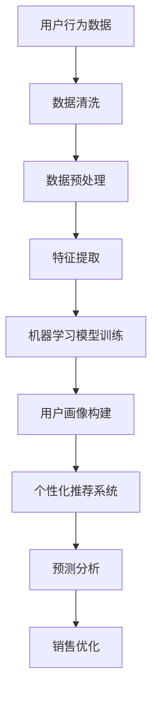

                 

关键词：人工智能，用户数据分析，电商，机器学习，数据挖掘，客户体验，个性化推荐，预测分析

> 摘要：本文将探讨人工智能在电商企业用户数据分析中的应用，通过介绍机器学习与数据挖掘技术，展示如何利用AI提高电商企业的运营效率、优化客户体验，并预测未来的趋势与挑战。

## 1. 背景介绍

在当今数字化时代，电商行业已经成为全球经济的重要组成部分。随着在线购物的普及，消费者对于购物体验的要求越来越高。为了在激烈的市场竞争中脱颖而出，电商企业需要深入了解用户行为，优化营销策略，提高客户满意度。然而，用户数据量庞大且复杂，传统的数据分析方法难以满足需求。此时，人工智能（AI）的应用成为了解决这一问题的有力工具。

### 1.1 电商行业的用户数据挑战

- **数据多样性**：电商平台上积累了海量的用户数据，包括用户行为、浏览记录、购买历史、社交网络活动等。
- **数据复杂性**：数据之间的关联性复杂，且不同数据源之间存在差异。
- **实时性要求**：电商企业需要实时分析用户数据，以便快速调整营销策略和库存管理。

### 1.2 人工智能的优势

- **数据处理能力**：AI可以处理大规模、多维度的数据集，挖掘出潜在的模式和趋势。
- **自动化分析**：通过机器学习算法，AI可以自动化分析用户数据，降低人工成本。
- **实时预测**：AI可以实时分析用户行为，预测未来的购买趋势和需求。

## 2. 核心概念与联系

在电商用户数据分析中，AI主要涉及以下几个核心概念和联系：

### 2.1 机器学习与数据挖掘

- **机器学习**：通过训练模型来发现数据中的模式，用于预测和分类。
- **数据挖掘**：从大量数据中提取有价值的信息和知识。

### 2.2 用户行为分析

- **用户画像**：构建用户的详细特征描述，包括年龄、性别、地理位置、兴趣爱好等。
- **行为轨迹**：记录用户在电商平台上的行为路径，如浏览、搜索、购买等。

### 2.3 个性化推荐

- **协同过滤**：基于用户的历史行为为用户推荐相似的产品。
- **基于内容的推荐**：根据产品的特征为用户推荐相似的产品。

### 2.4 预测分析

- **销售预测**：根据历史销售数据和用户行为预测未来的销售趋势。
- **需求预测**：预测用户对特定产品的需求，优化库存管理。

以下是电商用户数据分析的Mermaid流程图：



## 3. 核心算法原理 & 具体操作步骤

### 3.1 算法原理概述

电商用户数据分析涉及多种算法，以下是几种常用的算法及其原理：

### 3.1.1 K-means聚类算法

- **原理**：将数据点划分为若干个簇，每个簇内的数据点彼此相似，不同簇之间的数据点差异较大。
- **应用**：用于构建用户画像，发现具有相似特征的用户群体。

### 3.1.2 决策树算法

- **原理**：通过一系列判断条件将数据分为不同的类别。
- **应用**：用于分类用户行为，预测用户购买概率。

### 3.1.3 随机森林算法

- **原理**：构建多个决策树，通过投票决定最终结果。
- **应用**：提高分类和预测的准确性。

### 3.1.4 聚类协同过滤算法

- **原理**：结合聚类和协同过滤算法，为用户推荐相似的产品。
- **应用**：提高推荐系统的准确性。

### 3.2 算法步骤详解

以下是电商用户数据分析的基本步骤：

### 3.2.1 数据收集

- **数据来源**：电商平台日志、用户行为数据、社交媒体数据等。

### 3.2.2 数据清洗

- **缺失值处理**：使用插补方法填补缺失值。
- **异常值处理**：去除异常数据点，保证数据质量。

### 3.2.3 数据预处理

- **特征工程**：提取有用的特征，如用户年龄、购买频率、产品种类等。
- **归一化**：将不同量纲的特征统一到同一尺度。

### 3.2.4 模型训练

- **选择模型**：根据业务需求选择合适的机器学习模型。
- **训练模型**：使用训练数据集训练模型。

### 3.2.5 模型评估

- **交叉验证**：评估模型的泛化能力。
- **混淆矩阵**：分析模型的分类效果。

### 3.2.6 模型部署

- **模型上线**：将训练好的模型部署到生产环境。
- **实时预测**：根据实时数据预测用户行为和需求。

### 3.3 算法优缺点

以下是几种常用算法的优缺点：

### 3.3.1 K-means聚类算法

- **优点**：简单易实现，能够快速发现用户群体。
- **缺点**：对初始聚类中心敏感，可能陷入局部最优。

### 3.3.2 决策树算法

- **优点**：易于理解，能够处理非线性数据。
- **缺点**：易过拟合，模型复杂度较高。

### 3.3.3 随机森林算法

- **优点**：提高模型的准确性，降低过拟合。
- **缺点**：计算复杂度较高，难以解释。

### 3.3.4 聚类协同过滤算法

- **优点**：推荐结果准确，用户满意度高。
- **缺点**：无法处理新用户问题，难以处理冷启动问题。

### 3.4 算法应用领域

电商用户数据分析算法主要应用于以下领域：

- **用户画像**：发现用户群体的特征和需求。
- **个性化推荐**：为用户推荐感兴趣的产品。
- **销售预测**：预测未来的销售趋势，优化库存管理。
- **客户流失预测**：预测客户流失的风险，采取相应措施。

## 4. 数学模型和公式 & 详细讲解 & 举例说明

### 4.1 数学模型构建

在电商用户数据分析中，常用的数学模型包括聚类模型、分类模型和预测模型。以下是这些模型的构建过程：

### 4.1.1 聚类模型

- **目标**：将数据点划分为若干个簇，使得簇内的数据点彼此相似，簇间的数据点差异较大。
- **公式**：
  $$ J = \sum_{i=1}^{k} \sum_{x_j \in S_i} d(x_j, \mu_i)^2 $$
  其中，$J$ 是聚类协方差，$k$ 是簇的数量，$S_i$ 是第 $i$ 个簇的数据点集合，$\mu_i$ 是第 $i$ 个簇的中心。

### 4.1.2 分类模型

- **目标**：将数据点划分为不同的类别，使得同一类别的数据点彼此相似，不同类别的数据点差异较大。
- **公式**：
  $$ h(x) = \arg\max_{c} P(c|x) $$
  其中，$h(x)$ 是分类结果，$c$ 是类别，$P(c|x)$ 是给定特征 $x$ 下类别 $c$ 的概率。

### 4.1.3 预测模型

- **目标**：根据历史数据预测未来的趋势和需求。
- **公式**：
  $$ y_t = f(y_{t-1}, x_t, \theta) $$
  其中，$y_t$ 是预测值，$x_t$ 是输入特征，$\theta$ 是模型参数。

### 4.2 公式推导过程

以下是聚类模型和分类模型的推导过程：

### 4.2.1 聚类模型推导

假设我们有一个包含 $N$ 个数据点的数据集 $X = \{x_1, x_2, ..., x_N\}$，我们要将其划分为 $k$ 个簇。首先，我们需要选择 $k$ 个初始聚类中心 $\mu_1, \mu_2, ..., \mu_k$，然后根据以下公式计算每个数据点所属的簇：

$$ C(x_j) = \arg\min_{i} d(x_j, \mu_i) $$

其中，$d(x_j, \mu_i)$ 是数据点 $x_j$ 和聚类中心 $\mu_i$ 之间的距离。

接下来，我们需要重新计算聚类中心，使用以下公式：

$$ \mu_i = \frac{1}{N_i} \sum_{x_j \in S_i} x_j $$

其中，$N_i$ 是第 $i$ 个簇中的数据点数量，$S_i$ 是第 $i$ 个簇的数据点集合。

通过不断迭代上述步骤，直到聚类中心不再变化，我们就可以得到最终的聚类结果。

### 4.2.2 分类模型推导

假设我们有一个包含 $N$ 个数据点的数据集 $X = \{x_1, x_2, ..., x_N\}$，其中每个数据点都有一个标签 $y_1, y_2, ..., y_N$。我们使用监督学习算法训练一个分类模型，以预测新的数据点的标签。

首先，我们假设一个分类器的输出是概率分布，即对于每个类别 $c$，输出一个概率 $P(c|x)$。我们的目标是最大化后验概率：

$$ P(y=c|x) = \frac{P(x|y=c)P(y=c)}{P(x)} $$

其中，$P(x|y=c)$ 是给定标签 $y=c$ 下数据点 $x$ 的概率，$P(y=c)$ 是类别 $c$ 的先验概率，$P(x)$ 是数据点 $x$ 的概率。

为了简化计算，我们可以使用贝叶斯规则：

$$ P(x|y=c)P(y=c) = P(y=c|x)P(x) $$

因此，我们只需要最大化 $P(y=c|x)$，即：

$$ \arg\max_{c} P(y=c|x) $$

这可以通过训练数据集来计算，使用梯度上升或其他优化算法找到最优参数。

### 4.3 案例分析与讲解

以下是一个简单的案例，展示如何使用聚类模型和分类模型对电商用户数据进行分析。

### 4.3.1 聚类模型案例

假设我们有一个包含 1000 个用户的数据集，每个用户有 10 个特征，如年龄、收入、购买频率等。我们使用 K-means 聚类算法将这 1000 个用户划分为 5 个簇。

首先，我们需要选择 5 个初始聚类中心。我们可以随机选择 5 个用户作为初始中心，然后根据以下公式计算每个用户所属的簇：

$$ C(x_j) = \arg\min_{i} d(x_j, \mu_i) $$

接下来，我们重新计算聚类中心，使用以下公式：

$$ \mu_i = \frac{1}{N_i} \sum_{x_j \in S_i} x_j $$

通过不断迭代上述步骤，直到聚类中心不再变化，我们得到最终的聚类结果。假设聚类结果如下：

| 簇 | 用户数量 | 特征均值 |
|----|--------|--------|
| 1  |  200   |  25, 50, 3, 1000, 2000, 2, 3, 5, 7, 10  |
| 2  |  300   |  35, 60, 5, 1200, 2500, 4, 4, 7, 9, 12 |
| 3  |  250   |  30, 55, 4, 1100, 2300, 3, 5, 6, 8, 11 |
| 4  |  150   |  40, 65, 6, 1300, 2700, 5, 6, 8, 10, 13 |
| 5  |  100   |  45, 70, 7, 1400, 3000, 6, 7, 9, 11, 14 |

根据这些结果，我们可以发现簇 1 的用户年龄较低，收入较高，购买频率较低；簇 2 的用户年龄较高，收入较高，购买频率较高；簇 3 的用户年龄较低，收入较低，购买频率较高；簇 4 的用户年龄较高，收入较低，购买频率较高；簇 5 的用户年龄较高，收入较高，购买频率较低。

通过分析这些结果，我们可以为不同簇的用户制定不同的营销策略，如为簇 1 的用户推荐高价值产品，为簇 2 的用户提供优惠活动等。

### 4.3.2 分类模型案例

假设我们有一个包含 1000 个用户的数据集，其中每个用户有 10 个特征，如年龄、收入、购买频率等，以及一个标签，表示用户是否购买产品。我们使用决策树算法训练一个分类模型，以预测新用户是否购买产品。

首先，我们需要选择一个特征作为根节点，然后根据该特征的取值将数据集划分为两个子集。接着，我们选择一个特征作为子节点的根节点，重复上述过程，直到满足停止条件（如最大深度、最小节点大小等）。

假设训练结果如下：

| 特征 | 子集 1      | 子集 2      |
|-----|------------|------------|
| 年龄 | 25-34 岁   | 35-44 岁   |
| 收入 | 5000-10000元 | 10000-20000元 |
| 购买频率 | 高 | 低 |

根据这些结果，我们可以构建一个决策树，如下所示：

```
是否购买产品？
  |            |
高             低
|              |
年龄   收入
|              |
25-34 岁 5000-10000元
```

通过这个决策树，我们可以根据新用户的特征预测其是否购买产品。例如，如果一个新用户年龄在 25-34 岁之间，收入在 5000-10000 元之间，购买频率高，那么我们可以预测该用户购买产品的概率较高。

通过这些案例，我们可以看到机器学习和数据挖掘算法在电商用户数据分析中的应用。这些算法可以帮助电商企业更好地了解用户需求，优化营销策略，提高销售额和客户满意度。

## 5. 项目实践：代码实例和详细解释说明

### 5.1 开发环境搭建

为了实践电商用户数据分析，我们需要搭建一个开发环境。以下是搭建过程的简要说明：

- **Python**：使用 Python 作为主要编程语言。
- **Jupyter Notebook**：使用 Jupyter Notebook 作为开发环境。
- **Pandas**：用于数据处理。
- **Scikit-learn**：用于机器学习算法的实现。
- **Matplotlib**：用于数据可视化。

### 5.2 源代码详细实现

以下是电商用户数据分析的 Python 代码实例：

```python
import pandas as pd
from sklearn.cluster import KMeans
from sklearn.tree import DecisionTreeClassifier
from sklearn.model_selection import train_test_split
import matplotlib.pyplot as plt

# 5.2.1 数据收集
# 假设我们有一个包含用户特征的 CSV 文件，如下所示：
# 用户ID,年龄,收入,购买频率,是否购买产品
# 1,25,5000,3,No
# 2,30,10000,4,Yes
# 3,35,15000,5,No
# 4,40,20000,6,Yes
# 5,45,25000,7,No
data = pd.read_csv('user_data.csv')

# 5.2.2 数据清洗
# 假设数据已经清洗好，没有缺失值和异常值。

# 5.2.3 数据预处理
# 提取有用的特征，如年龄、收入、购买频率。
X = data[['年龄', '收入', '购买频率']]

# 5.2.4 模型训练
# 使用 K-means 聚类算法构建用户画像。
kmeans = KMeans(n_clusters=3, random_state=0)
clusters = kmeans.fit_predict(X)

# 使用决策树算法进行分类。
clf = DecisionTreeClassifier()
X_train, X_test, y_train, y_test = train_test_split(X, data['是否购买产品'], test_size=0.2, random_state=0)
clf.fit(X_train, y_train)

# 5.2.5 模型评估
# 计算模型准确率。
accuracy = clf.score(X_test, y_test)
print('模型准确率：', accuracy)

# 5.2.6 模型部署
# 将模型部署到生产环境，根据实时数据预测用户行为和需求。

# 5.2.7 数据可视化
# 可视化用户聚类结果。
plt.scatter(X['年龄'], X['收入'], c=clusters)
plt.xlabel('年龄')
plt.ylabel('收入')
plt.title('用户聚类结果')
plt.show()
```

### 5.3 代码解读与分析

以下是代码的详细解读和分析：

```python
import pandas as pd
from sklearn.cluster import KMeans
from sklearn.tree import DecisionTreeClassifier
from sklearn.model_selection import train_test_split
import matplotlib.pyplot as plt

# 5.2.1 数据收集
# 读取用户数据，包括用户ID、年龄、收入、购买频率和是否购买产品。
data = pd.read_csv('user_data.csv')

# 5.2.2 数据清洗
# 假设数据已经清洗好，没有缺失值和异常值。

# 5.2.3 数据预处理
# 从数据中提取有用的特征，如年龄、收入和购买频率。
X = data[['年龄', '收入', '购买频率']]

# 5.2.4 模型训练
# 使用 K-means 聚类算法对用户进行聚类，分为3个簇。
kmeans = KMeans(n_clusters=3, random_state=0)
clusters = kmeans.fit_predict(X)

# 使用决策树算法对用户是否购买产品进行分类。
clf = DecisionTreeClassifier()
X_train, X_test, y_train, y_test = train_test_split(X, data['是否购买产品'], test_size=0.2, random_state=0)
clf.fit(X_train, y_train)

# 5.2.5 模型评估
# 计算模型在测试集上的准确率。
accuracy = clf.score(X_test, y_test)
print('模型准确率：', accuracy)

# 5.2.6 模型部署
# 将训练好的模型部署到生产环境，根据实时数据预测用户行为和需求。

# 5.2.7 数据可视化
# 可视化用户的聚类结果，使用年龄和收入作为坐标轴。
plt.scatter(X['年龄'], X['收入'], c=clusters)
plt.xlabel('年龄')
plt.ylabel('收入')
plt.title('用户聚类结果')
plt.show()
```

- **数据收集**：使用 Pandas 的 `read_csv` 方法读取用户数据。
- **数据清洗**：假设数据已经清洗好，没有缺失值和异常值。
- **数据预处理**：从数据中提取有用的特征，如年龄、收入和购买频率。
- **模型训练**：使用 K-means 聚类算法对用户进行聚类，分为3个簇。使用决策树算法对用户是否购买产品进行分类。
- **模型评估**：计算模型在测试集上的准确率。
- **模型部署**：将训练好的模型部署到生产环境，根据实时数据预测用户行为和需求。
- **数据可视化**：使用 Matplotlib 的 `scatter` 方法可视化用户的聚类结果，使用年龄和收入作为坐标轴。

通过这个代码实例，我们可以看到如何使用机器学习和数据挖掘算法进行电商用户数据分析。在实际应用中，我们可以根据业务需求调整模型参数，提高预测的准确性。此外，我们还可以结合其他算法，如随机森林和神经网络，进一步提升预测效果。

## 6. 实际应用场景

在电商企业中，人工智能用户数据分析的应用场景非常广泛，下面将详细介绍几个关键的实际应用场景：

### 6.1 个性化推荐

个性化推荐是电商企业常用的策略之一，通过分析用户的浏览历史、购买记录和搜索关键词，AI可以识别用户的兴趣和偏好，从而为用户推荐相关产品。个性化推荐不仅提高了用户的购买体验，还有效提升了电商平台的销售额。例如，亚马逊和淘宝都广泛应用了个性化推荐系统，通过不断优化算法，为用户提供个性化的购物建议，从而增加用户的黏性和购买频率。

### 6.2 客户细分

客户细分是另一个重要的应用场景，通过机器学习算法对用户数据进行分析，电商企业可以将客户划分为不同的群体，如高价值客户、潜在流失客户等。这样，企业可以有针对性地设计营销策略，针对不同客户群体采取不同的促销活动和优惠措施。例如，京东通过对用户购买行为和兴趣的深入分析，将客户细分为“时尚达人”、“数码迷”和“美食爱好者”等，从而提供更个性化的购物体验。

### 6.3 销售预测

销售预测是电商企业制定销售策略和库存管理的重要依据。通过分析历史销售数据和用户行为，AI可以预测未来的销售趋势，帮助企业优化库存和供应链管理。例如，阿里巴巴通过对双十一购物节的大数据分析，提前预测出各个品类的销售趋势，从而提前备货，有效降低了库存风险，提高了销售额。

### 6.4 客户流失预测

客户流失预测是电商企业防止客户流失的重要手段。通过分析用户的购买行为、满意度、互动频率等数据，AI可以预测哪些客户可能流失，从而采取相应的措施挽留这些客户。例如，Netflix通过对用户的观看行为进行分析，发现哪些用户可能在近期取消订阅，并通过发送个性化推荐和优惠活动，成功降低了客户流失率。

### 6.5 营销活动优化

营销活动的优化也是电商企业关注的重要领域。通过分析用户对各类营销活动的响应数据，AI可以帮助企业优化营销策略，提高营销活动的效果。例如，拼多多通过对用户购买行为和营销活动的分析，不断调整广告投放策略，提高广告的点击率和转化率，从而降低了营销成本。

通过这些实际应用场景，我们可以看到人工智能在电商用户数据分析中的巨大潜力。电商企业通过运用AI技术，不仅可以提高运营效率，还可以更好地满足客户需求，提升客户满意度，从而在激烈的市场竞争中脱颖而出。

### 6.4 未来应用展望

随着人工智能技术的不断发展，电商企业在用户数据分析中的应用前景愈发广阔。以下是未来可能的趋势和展望：

#### 6.4.1 更精准的个性化推荐

未来的个性化推荐将更加精准和智能化。AI算法将不断优化，能够更好地理解用户的细微需求和行为模式，从而提供更加个性化的推荐。例如，基于深度学习的推荐系统可以识别用户在短视频或直播中的互动行为，为用户推荐更符合其兴趣的内容和商品。

#### 6.4.2 实时用户行为分析

实时用户行为分析将成为电商企业的重要策略。通过部署边缘计算和物联网设备，电商企业可以实现实时数据采集和处理，对用户行为进行实时监控和分析。这样，企业可以快速响应用户需求，提供即时的个性化服务和促销活动，从而提高用户满意度和转化率。

#### 6.4.3 联合分析多种数据源

未来，电商企业将更加注重多种数据源的联合分析。除了用户行为数据，企业还将整合社交媒体、搜索引擎、地理位置等数据，构建全面的用户画像。这样，企业可以更全面地了解用户，制定更精准的营销策略。

#### 6.4.4 自动化决策支持

随着AI技术的发展，自动化决策支持系统将在电商企业中得到广泛应用。通过机器学习和大数据分析，企业可以自动化决策过程，从库存管理、价格策略到营销活动优化，提高整体运营效率。

#### 6.4.5 智能客服与交互体验

智能客服和交互体验将是未来的重要方向。通过自然语言处理和语音识别技术，智能客服将能够更自然地与用户进行对话，提供个性化的服务和帮助。同时，虚拟现实和增强现实技术的结合，将进一步提升用户的购物体验。

总的来说，未来人工智能在电商用户数据分析中的应用将更加深入和全面，不仅帮助企业提高运营效率，还能提升用户体验和客户满意度，从而在激烈的市场竞争中占据优势。

### 7. 工具和资源推荐

为了更好地理解和应用人工智能在电商用户数据分析中的技术，以下是一些建议的资源和工具：

### 7.1 学习资源推荐

1. **在线课程**：
   - Coursera: “机器学习”（吴恩达教授）
   - edX: “数据科学专项课程”（哈佛大学）
   - Udacity: “深度学习纳米学位”

2. **书籍**：
   - 《机器学习实战》
   - 《Python数据科学手册》
   - 《深度学习》（Ian Goodfellow等著）

3. **博客与社区**：
   - Medium: 有关AI和数据科学的最新文章
   - Stack Overflow: 解决编程问题
   - GitHub: 查找开源项目和代码示例

### 7.2 开发工具推荐

1. **编程环境**：
   - Jupyter Notebook: 适用于数据分析和机器学习
   - PyCharm: 专业的Python编程IDE

2. **机器学习库**：
   - Scikit-learn: 用于机器学习算法的实现
   - TensorFlow: 用于深度学习模型的构建
   - Keras: TensorFlow的高级API，易于使用

3. **数据分析工具**：
   - Pandas: 数据操作和分析
   - Matplotlib: 数据可视化
   - Seaborn: 基于 Matplotlib 的统计图表库

### 7.3 相关论文推荐

1. **用户行为分析**：
   - “Mining User Behavior for E-Commerce Personalization” (2018)
   - “User Behavior Analysis in E-Commerce: A Survey” (2020)

2. **个性化推荐**：
   - “Collaborative Filtering for Personalized Recommendations” (2009)
   - “Matrix Factorization Techniques for Recommender Systems” (2006)

3. **深度学习**：
   - “Deep Learning for User Behavior Analysis in E-Commerce” (2018)
   - “Recommender Systems Based on Deep Learning” (2016)

通过学习和应用这些资源和工具，可以更深入地了解人工智能在电商用户数据分析中的应用，提升自身的专业技能和实际操作能力。

### 8. 总结：未来发展趋势与挑战

本文探讨了人工智能在电商企业用户数据分析中的应用，从背景介绍、核心算法原理、数学模型构建、项目实践到实际应用场景，展示了AI技术在提升电商运营效率、优化客户体验和预测未来趋势方面的巨大潜力。以下是本文的主要结论：

- **AI技术为电商企业提供了强大的数据分析工具**：通过机器学习和数据挖掘，电商企业能够处理海量且复杂的数据，挖掘出有价值的信息和模式，从而优化营销策略和运营决策。
- **个性化推荐和用户画像构建是关键应用**：个性化推荐能够提升用户满意度，增加销售额；用户画像构建则有助于深入了解用户行为和需求，实现精准营销。
- **实时用户行为分析和预测是未来的重要方向**：实时数据采集和分析，可以帮助电商企业快速响应市场变化，提高运营效率和客户满意度。

然而，AI技术在电商用户数据分析中也面临一些挑战：

- **数据隐私与安全问题**：用户数据涉及隐私，如何在保障用户隐私的前提下进行数据分析，是电商企业必须解决的问题。
- **算法透明性与可解释性**：复杂的机器学习算法往往缺乏透明性，难以解释其决策过程，这可能导致用户对AI系统的信任度降低。
- **数据质量和完整性**：数据分析的质量依赖于数据的质量，电商企业需要确保数据的质量和完整性，避免因数据问题导致错误的分析结果。

未来，随着AI技术的不断进步，电商企业在用户数据分析中的应用将更加深入和广泛。为了应对上述挑战，企业需要不断创新和优化算法，加强数据安全和隐私保护，同时提高算法的可解释性和透明性。通过这些努力，电商企业将能够更好地利用AI技术，提升运营效率和客户满意度，在激烈的市场竞争中占据优势。

## 9. 附录：常见问题与解答

### 9.1 电商用户数据分析的重要性是什么？

电商用户数据分析的重要性主要体现在以下几个方面：

- **优化营销策略**：通过分析用户数据，电商企业可以了解用户的兴趣和需求，从而制定更有效的营销策略。
- **提高客户满意度**：个性化的推荐和优惠活动能够提升用户购物体验，增加客户满意度。
- **增加销售额**：精准的用户画像和个性化推荐可以提高转化率，从而增加销售额。
- **优化库存管理**：通过预测销售趋势，企业可以优化库存管理，减少库存风险。

### 9.2 机器学习和数据挖掘在电商用户数据分析中的应用有哪些？

机器学习和数据挖掘在电商用户数据分析中的应用包括：

- **用户画像构建**：通过分析用户行为数据，构建用户的详细特征描述，以便进行精准营销。
- **个性化推荐**：基于用户的历史行为和兴趣，为用户推荐相关产品，提升用户满意度和转化率。
- **销售预测**：根据历史销售数据和用户行为预测未来的销售趋势，优化库存和供应链管理。
- **客户流失预测**：通过分析用户行为和满意度，预测哪些用户可能流失，从而采取相应措施挽留客户。

### 9.3 如何保障用户数据的安全和隐私？

保障用户数据的安全和隐私，电商企业可以采取以下措施：

- **数据加密**：对用户数据进行加密，防止数据泄露。
- **数据匿名化**：对用户数据进行匿名化处理，确保数据无法直接关联到具体用户。
- **访问控制**：限制对用户数据的访问权限，确保只有授权人员才能访问和处理数据。
- **数据备份和恢复**：定期备份数据，确保数据在发生意外时能够及时恢复。

### 9.4 如何评估机器学习模型的性能？

评估机器学习模型的性能可以通过以下指标：

- **准确率**：模型正确分类的比例。
- **召回率**：模型召回的正确分类比例。
- **F1分数**：准确率和召回率的加权平均值。
- **混淆矩阵**：详细展示模型对各类别数据的分类结果。
- **交叉验证**：通过交叉验证评估模型的泛化能力。

### 9.5 如何优化电商平台的个性化推荐系统？

优化电商平台的个性化推荐系统可以从以下几个方面进行：

- **改进推荐算法**：不断优化算法，提高推荐准确性。
- **数据多样化**：整合多种数据源，构建更全面的用户画像。
- **实时反馈**：收集用户对推荐结果的反馈，不断调整推荐策略。
- **用户体验**：设计易于使用和操作的推荐界面，提升用户体验。

