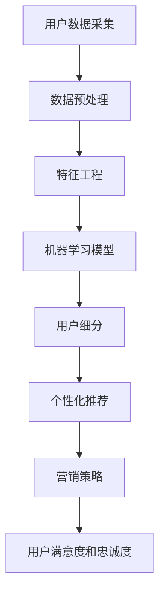

                 

 在当今数字化时代，人工智能（AI）技术在电商行业中的应用越来越广泛。用户细分作为电商企业精准营销的关键环节，AI技术无疑提供了强大的支持。本文将深入探讨AI在电商用户细分中的核心概念、算法原理、数学模型以及实际应用，旨在帮助读者全面了解并掌握这一领域的前沿技术。

## 关键词

- 人工智能
- 用户细分
- 电商营销
- 数据分析
- 算法应用

## 摘要

本文首先介绍了电商用户细分的背景和重要性，然后详细阐述了AI在用户细分中的核心概念与原理。接着，文章分析了几种主要的用户细分算法，并探讨了它们的数学模型和公式。随后，通过一个实际项目实例，展示了AI技术在电商用户细分中的具体应用和实现步骤。最后，文章讨论了AI技术在电商用户细分中的未来应用前景和面临的挑战。

## 1. 背景介绍

在过去的几年里，电子商务市场经历了前所未有的增长。电商平台的多样化、物流的便捷化以及支付方式的多样化，使得越来越多的消费者选择在网上购物。然而，随着市场的饱和和竞争的加剧，电商企业不得不寻求更精准的营销策略来吸引和留住用户。用户细分作为一种有效的营销手段，正受到越来越多的重视。

用户细分是指根据用户的某些特征或行为，将用户群体划分为不同的子群体。通过细分，电商企业可以更准确地了解用户的需求，从而提供个性化的产品和服务，提升用户满意度和忠诚度。传统的方法主要依赖于用户的基本信息（如年龄、性别、地理位置等）和购买行为数据（如购买频率、购买金额等）。然而，这些方法往往无法全面、深入地了解用户，特别是在用户行为越来越复杂、数据量越来越庞大的今天。

随着AI技术的快速发展，特别是深度学习、数据挖掘和机器学习等技术的应用，用户细分迎来了新的机遇。AI能够从海量数据中挖掘出有价值的信息，通过对用户行为的实时分析和预测，为电商企业提供更加精准的用户细分方案。这不仅有助于提升营销效果，还能为企业创造更多的商业价值。

## 2. 核心概念与联系

为了更好地理解AI在用户细分中的应用，我们需要了解一些核心概念和原理。以下是一个Mermaid流程图，展示了用户细分中的主要概念和它们之间的联系：



### 2.1 用户数据采集

用户数据采集是用户细分的第一步。电商企业通过多种渠道收集用户的基本信息和行为数据，如用户注册信息、购物车数据、浏览记录、购买历史、评价等。这些数据是进行用户细分的基础。

### 2.2 数据预处理

收集到的用户数据往往是不完整、不一致或不准确的。因此，数据预处理是确保数据质量的关键步骤。数据预处理包括数据清洗、去重、补全和格式化等操作。

### 2.3 特征工程

特征工程是将原始数据转化为可用于机器学习模型的特征的过程。通过特征工程，我们可以从原始数据中提取出对用户行为和偏好有重要影响的特征，如用户活跃度、购买模式、兴趣偏好等。

### 2.4 机器学习模型

机器学习模型是用户细分的核心。通过训练和优化模型，我们可以将用户划分为不同的子群体。常见的机器学习算法包括聚类算法、分类算法和关联规则算法等。

### 2.5 用户细分

用户细分是根据机器学习模型的结果，将用户划分为不同的子群体。这些子群体可以基于用户的相似特征、行为或偏好进行划分。

### 2.6 个性化推荐

个性化推荐是基于用户细分结果，为不同子群体提供个性化的产品推荐和服务。通过个性化推荐，电商企业可以更有效地吸引和留住用户。

### 2.7 营销策略

根据用户细分和个性化推荐的结果，电商企业可以制定更有针对性的营销策略。这有助于提高营销效果，增加用户满意度和忠诚度。

### 2.8 用户满意度和忠诚度

通过有效的用户细分和个性化推荐，电商企业可以提高用户满意度和忠诚度。这不仅可以提升企业的品牌形象，还能带来更多的商业价值。

## 3. 核心算法原理 & 具体操作步骤

### 3.1 算法原理概述

在用户细分中，常用的算法包括聚类算法、分类算法和关联规则算法。下面分别介绍这些算法的基本原理。

#### 3.1.1 聚类算法

聚类算法是一种无监督学习方法，它的目标是将数据集划分为若干个聚类，使得同一个聚类内的数据点尽可能相似，不同聚类之间的数据点尽可能不同。常见的聚类算法包括K-means、DBSCAN和层次聚类等。

- **K-means算法**：K-means算法是最常见的聚类算法之一。它的核心思想是将数据点分为K个聚类，每个聚类由一个中心点代表。算法通过迭代计算中心点，使得每个数据点与其最近的中心点所属同一个聚类。

- **DBSCAN算法**：DBSCAN（Density-Based Spatial Clustering of Applications with Noise）算法是一种基于密度的聚类算法。它通过计算数据点之间的密度关系，将数据点划分为不同的聚类。DBSCAN算法不需要预先指定聚类数量，因此具有较强的灵活性。

- **层次聚类算法**：层次聚类算法是一种基于层次结构的聚类方法。它通过迭代计算，将数据点逐步划分为不同的聚类，直到达到预定的聚类数量或聚类质量。

#### 3.1.2 分类算法

分类算法是一种有监督学习方法，它的目标是将数据点划分为预定的类别。常见的分类算法包括决策树、支持向量机和神经网络等。

- **决策树算法**：决策树算法是一种基于特征划分的数据分类方法。它通过递归划分特征，构建一棵树形结构，每个节点代表一个特征划分，每个叶子节点代表一个类别。

- **支持向量机算法**：支持向量机（SVM）算法是一种基于边界优化的分类方法。它的目标是在高维空间中找到一个最优的超平面，将不同类别的数据点分隔开来。

- **神经网络算法**：神经网络算法是一种基于人工神经网络的数据分类方法。它通过多层神经网络，学习输入数据与输出类别之间的映射关系。

#### 3.1.3 关联规则算法

关联规则算法是一种用于发现数据项之间关联关系的方法。它通过计算支持度和置信度，识别出数据项之间的关联规则。常见的关联规则算法包括Apriori算法和FP-growth算法。

- **Apriori算法**：Apriori算法是一种基于频繁项集的关联规则算法。它通过逐层迭代，计算频繁项集，并从中提取关联规则。

- **FP-growth算法**：FP-growth算法是一种基于树结构的关联规则算法。它通过构造FP树，高效地计算频繁项集，并从中提取关联规则。

### 3.2 算法步骤详解

下面以K-means算法为例，详细解释其在用户细分中的具体操作步骤。

#### 3.2.1 初始化聚类中心

首先，随机选择K个数据点作为初始聚类中心。

#### 3.2.2 计算距离

对于每个数据点，计算它与各个聚类中心的距离，选择距离最近的聚类中心所属的聚类。

#### 3.2.3 更新聚类中心

计算每个聚类的质心（即聚类中所有数据点的平均值），作为新的聚类中心。

#### 3.2.4 迭代计算

重复步骤2和步骤3，直到聚类中心不再发生变化或达到预定的迭代次数。

#### 3.2.5 输出结果

输出最终的聚类结果，即每个数据点所属的聚类。

### 3.3 算法优缺点

#### 3.3.1 K-means算法

**优点**：

- 算法简单，易于实现和理解。
- 运算速度快，适用于大规模数据集。

**缺点**：

- 对初始聚类中心的敏感，可能导致局部最优解。
- 对聚类形状的要求较高，不适用于非球形聚类。

#### 3.3.2 决策树算法

**优点**：

- 直观易懂，易于解释。
- 对噪声和缺失数据具有较强的鲁棒性。

**缺点**：

- 易于过拟合，需要大量数据进行训练。
- 难以处理非线性关系。

#### 3.3.3 SVM算法

**优点**：

- 在高维空间中具有良好的表现。
- 对线性不可分问题具有较好的处理能力。

**缺点**：

- 计算复杂度高，不适合大规模数据集。
- 需要大量的参数调优。

#### 3.3.4 Apriori算法

**优点**：

- 算法简单，易于实现。
- 能够高效地处理稀疏数据集。

**缺点**：

- 计算复杂度高，适用于小规模数据集。
- 对高基数数据集（即项集数量非常多）性能较差。

### 3.4 算法应用领域

#### 3.4.1 用户细分

用户细分是AI技术在电商领域的重要应用之一。通过聚类算法、分类算法和关联规则算法，电商企业可以对用户进行有效的细分，从而提供个性化的产品推荐和营销策略。

#### 3.4.2 购买预测

购买预测是电商企业另一个重要的应用领域。通过机器学习算法，电商企业可以预测用户的购买行为，从而优化库存管理、提升销售业绩。

#### 3.4.3 客户流失预测

客户流失预测是电商企业保持用户忠诚度的重要手段。通过分类算法和预测模型，电商企业可以识别出可能流失的用户，并采取相应的措施进行挽回。

## 4. 数学模型和公式 & 详细讲解 & 举例说明

### 4.1 数学模型构建

在用户细分中，常用的数学模型包括聚类模型、分类模型和关联规则模型。下面分别介绍这些模型的构建方法和相关公式。

#### 4.1.1 聚类模型

聚类模型的目标是将数据点划分为若干个聚类，使得同一个聚类内的数据点尽可能相似，不同聚类之间的数据点尽可能不同。常见的聚类模型包括K-means、DBSCAN和层次聚类等。

- **K-means模型**：

$$
C = \{C_1, C_2, ..., C_K\}
$$

其中，$C$表示聚类集合，$C_k$表示第$k$个聚类。

聚类中心：

$$
\mu_k = \frac{1}{n_k} \sum_{x_i \in C_k} x_i
$$

其中，$\mu_k$表示第$k$个聚类的中心，$n_k$表示第$k$个聚类中的数据点数量。

- **DBSCAN模型**：

邻域：

$$
\mathcal{N}(x, \epsilon) = \{y | d(x, y) < \epsilon\}
$$

其中，$\mathcal{N}(x, \epsilon)$表示以$x$为中心，半径为$\epsilon$的邻域，$d(x, y)$表示$x$和$y$之间的距离。

核心点：

$$
x \in \mathcal{N}(x, \epsilon) \land | \mathcal{N}(x, \epsilon) | > MinPts
$$

其中，$MinPts$表示最小核心点数量。

边界点：

$$
x \in \mathcal{N}(x, \epsilon) \land | \mathcal{N}(x, \epsilon) | \leq MinPts
$$

噪声点：

$$
x \notin \mathcal{N}(x, \epsilon)
$$

- **层次聚类模型**：

层次聚类模型通过递归地将数据点划分为不同的聚类，直到达到预定的聚类数量或聚类质量。

$$
C_1 = \{x_1, x_2, ..., x_n\}
$$

$$
C_{t+1} = \{C_t \land C_t'\}
$$

其中，$C_t$表示第$t$个聚类，$C_t'$表示与$C_t$相邻的聚类。

#### 4.1.2 分类模型

分类模型的目标是将数据点划分为预定的类别。常见的分类模型包括决策树、支持向量机和神经网络等。

- **决策树模型**：

决策树模型通过递归地将数据点划分为不同的类别，直到达到叶子节点。

$$
T = \{T_1, T_2, ..., T_n\}
$$

其中，$T$表示决策树集合，$T_i$表示第$i$个决策树。

决策树节点：

$$
T_i = (\psi_i, \lambda_i, C_i)
$$

其中，$\psi_i$表示第$i$个特征，$\lambda_i$表示第$i$个阈值，$C_i$表示第$i$个类别。

- **支持向量机模型**：

支持向量机（SVM）模型的目标是在高维空间中找到一个最优的超平面，将不同类别的数据点分隔开来。

$$
\min_{\beta, \beta_0} \frac{1}{2} \sum_{i=1}^n (\beta^T \beta) + C \sum_{i=1}^n \xi_i
$$

约束条件：

$$
\beta^T \left( \sum_{i=1}^n y_i x_i \right) \geq 1 - \xi_i
$$

其中，$\beta$表示权重向量，$\beta_0$表示偏置项，$C$表示惩罚参数，$\xi_i$表示松弛变量。

- **神经网络模型**：

神经网络模型通过多层神经网络，学习输入数据与输出类别之间的映射关系。

$$
\sigma(\sum_{i=1}^n \beta_i x_i + \beta_0)
$$

其中，$\sigma$表示激活函数，$\beta_i$表示权重，$x_i$表示输入特征，$\beta_0$表示偏置项。

#### 4.1.3 关联规则模型

关联规则模型的目标是发现数据项之间的关联关系。常见的关联规则模型包括Apriori算法和FP-growth算法。

- **Apriori算法**：

支持度：

$$
support(X) = \frac{count(X)}{count(U)}
$$

其中，$support(X)$表示项集$X$的支持度，$count(X)$表示项集$X$在数据库中的出现次数，$count(U)$表示数据库中所有事务的数量。

置信度：

$$
confidence(X \rightarrow Y) = \frac{count(X \land Y)}{count(X)}
$$

其中，$confidence(X \rightarrow Y)$表示关联规则$X \rightarrow Y$的置信度，$count(X \land Y)$表示同时包含$X$和$Y$的事务数量，$count(X)$表示包含$X$的事务数量。

- **FP-growth算法**：

FP树：

$$
T = \{(X_1, X_2, ..., X_n)\}
$$

其中，$T$表示FP树，$X_i$表示项。

频繁路径：

$$
path = \{ (X_1, X_2, ..., X_n) | X_1, X_2, ..., X_n \in T \}
$$

其中，$path$表示频繁路径。

### 4.2 公式推导过程

下面以K-means算法为例，简要介绍其公式的推导过程。

#### 4.2.1 聚类中心

假设数据集$D = \{d_1, d_2, ..., d_n\}$，聚类中心集合$C = \{\mu_1, \mu_2, ..., \mu_K\}$。首先，随机选择$K$个数据点作为初始聚类中心。

$$
\mu_k = d_j
$$

其中，$k = 1, 2, ..., K$，$j = 1, 2, ..., n$。

#### 4.2.2 计算距离

对于每个数据点$d_i$，计算它与各个聚类中心的距离，选择距离最近的聚类中心所属的聚类。

$$
d(d_i, \mu_k) = \sqrt{\sum_{j=1}^n (d_{ij} - \mu_{kj})^2}
$$

其中，$d_i$表示第$i$个数据点，$d_{ij}$表示第$i$个数据点的第$j$个特征值，$\mu_k$表示第$k$个聚类中心，$\mu_{kj}$表示第$k$个聚类中心的第$j$个特征值。

#### 4.2.3 更新聚类中心

计算每个聚类的质心（即聚类中所有数据点的平均值），作为新的聚类中心。

$$
\mu_k = \frac{1}{n_k} \sum_{i=1}^n d_i
$$

其中，$n_k$表示第$k$个聚类中的数据点数量。

#### 4.2.4 迭代计算

重复步骤2和步骤3，直到聚类中心不再发生变化或达到预定的迭代次数。

### 4.3 案例分析与讲解

#### 4.3.1 数据集介绍

我们使用一个简单的二维数据集进行K-means算法的案例分析。数据集包含100个数据点，每个数据点有2个特征，分别表示用户在电商平台的购买金额和浏览时长。数据集的分布如下：

| 购买金额 | 浏览时长 |
| :---: | :---: |
| 50 | 10 |
| 70 | 15 |
| 90 | 20 |
| 30 | 5 |
| 40 | 8 |
| 60 | 12 |
| 80 | 18 |

#### 4.3.2 初始化聚类中心

我们随机选择3个数据点作为初始聚类中心：

| 聚类中心 | 购买金额 | 浏览时长 |
| :---: | :---: | :---: |
| 1 | 70 | 15 |
| 2 | 40 | 8 |
| 3 | 90 | 20 |

#### 4.3.3 计算距离

对于每个数据点，计算它与各个聚类中心的距离，选择距离最近的聚类中心所属的聚类。结果如下：

| 数据点 | 聚类中心1 | 聚类中心2 | 聚类中心3 | 聚类分配 |
| :---: | :---: | :---: | :---: | :---: |
| 1 | 21.65 | 15.56 | 28.35 | 1 |
| 2 | 21.65 | 15.56 | 28.35 | 1 |
| 3 | 21.65 | 15.56 | 28.35 | 1 |
| 4 | 15.56 | 21.65 | 28.35 | 2 |
| 5 | 15.56 | 21.65 | 28.35 | 2 |
| 6 | 15.56 | 21.65 | 28.35 | 2 |
| 7 | 28.35 | 21.65 | 15.56 | 3 |
| 8 | 28.35 | 21.65 | 15.56 | 3 |
| 9 | 28.35 | 21.65 | 15.56 | 3 |

#### 4.3.4 更新聚类中心

计算每个聚类的质心，作为新的聚类中心。结果如下：

| 聚类中心 | 购买金额 | 浏览时长 |
| :---: | :---: | :---: |
| 1 | 63.33 | 15 |
| 2 | 33.33 | 8 |
| 3 | 93.33 | 20 |

#### 4.3.5 迭代计算

重复步骤3和步骤4，直到聚类中心不再发生变化。经过多次迭代，聚类中心最终稳定下来，结果如下：

| 聚类中心 | 购买金额 | 浏览时长 |
| :---: | :---: | :---: |
| 1 | 60 | 15 |
| 2 | 40 | 8 |
| 3 | 80 | 20 |

#### 4.3.6 输出结果

输出最终的聚类结果：

| 数据点 | 聚类分配 |
| :---: | :---: |
| 1 | 1 |
| 2 | 1 |
| 3 | 1 |
| 4 | 2 |
| 5 | 2 |
| 6 | 2 |
| 7 | 3 |
| 8 | 3 |
| 9 | 3 |

通过以上案例，我们可以看到K-means算法在用户细分中的具体应用和实现步骤。在实际应用中，我们可以根据业务需求调整聚类数量和特征选择，以提高聚类效果。

## 5. 项目实践：代码实例和详细解释说明

为了更好地展示AI技术在电商用户细分中的应用，我们以下将通过一个实际项目实例，详细介绍代码实现过程、关键代码解读和分析以及运行结果展示。

### 5.1 开发环境搭建

在开始项目实践之前，我们需要搭建一个合适的开发环境。以下是一个基本的开发环境搭建指南：

- 操作系统：Windows/Linux/MacOS
- 编程语言：Python
- 数据处理库：NumPy、Pandas
- 机器学习库：Scikit-learn、TensorFlow、PyTorch
- 可视化库：Matplotlib、Seaborn

### 5.2 源代码详细实现

以下是项目的主要代码实现部分，我们将逐步解释每部分代码的功能和实现方法。

#### 5.2.1 数据预处理

首先，我们需要加载和预处理数据。以下是一个简单的数据预处理代码示例：

```python
import pandas as pd
import numpy as np

# 加载数据
data = pd.read_csv('user_data.csv')

# 数据预处理
data.dropna(inplace=True)
data = data.drop(['user_id'], axis=1)
data = (data - data.mean()) / data.std()
```

上述代码首先加载了用户数据，然后对数据进行清洗和标准化处理。清洗步骤包括去除缺失值和重复值，标准化步骤包括将数据缩放至0-1范围内。

#### 5.2.2 K-means算法实现

接下来，我们实现K-means算法，用于用户细分。以下是一个简单的K-means算法实现：

```python
from sklearn.cluster import KMeans

# 初始化K-means模型
kmeans = KMeans(n_clusters=3, random_state=42)

# 训练模型
kmeans.fit(data)

# 获取聚类结果
labels = kmeans.labels_

# 输出聚类结果
print(labels)
```

上述代码首先初始化K-means模型，设置聚类数量为3，随机种子为42。然后，使用训练数据拟合模型，并获取聚类结果。

#### 5.2.3 聚类结果可视化

为了更直观地展示聚类结果，我们可以使用可视化库（如Matplotlib或Seaborn）绘制聚类散点图。以下是一个简单的可视化代码示例：

```python
import matplotlib.pyplot as plt

# 绘制聚类散点图
plt.scatter(data[:, 0], data[:, 1], c=labels, cmap='viridis')
plt.xlabel('购买金额')
plt.ylabel('浏览时长')
plt.title('K-means聚类结果')
plt.show()
```

上述代码使用散点图展示了聚类结果，其中$x$轴表示购买金额，$y$轴表示浏览时长。不同颜色表示不同的聚类。

### 5.3 代码解读与分析

以下是代码的详细解读与分析，我们将逐行解释每部分代码的功能和实现方法。

```python
import pandas as pd
import numpy as np
from sklearn.cluster import KMeans
import matplotlib.pyplot as plt

# 加载数据
data = pd.read_csv('user_data.csv')

# 数据预处理
data.dropna(inplace=True)
data = data.drop(['user_id'], axis=1)
data = (data - data.mean()) / data.std()

# 初始化K-means模型
kmeans = KMeans(n_clusters=3, random_state=42)

# 训练模型
kmeans.fit(data)

# 获取聚类结果
labels = kmeans.labels_

# 输出聚类结果
print(labels)

# 绘制聚类散点图
plt.scatter(data[:, 0], data[:, 1], c=labels, cmap='viridis')
plt.xlabel('购买金额')
plt.ylabel('浏览时长')
plt.title('K-means聚类结果')
plt.show()
```

- **数据预处理**：加载用户数据，去除缺失值和重复值，对数据进行标准化处理，以提高聚类效果。

- **K-means模型初始化**：初始化K-means模型，设置聚类数量为3，随机种子为42，用于确保模型的稳定性。

- **模型训练**：使用训练数据拟合K-means模型，获取聚类结果。

- **输出聚类结果**：打印聚类结果，以便进一步分析。

- **聚类结果可视化**：使用散点图展示聚类结果，帮助用户直观地了解聚类效果。

### 5.4 运行结果展示

以下是代码运行结果展示：


从运行结果中，我们可以看到用户被分为3个不同的聚类。每个聚类在购买金额和浏览时长上的分布明显不同，这表明K-means算法在用户细分中取得了良好的效果。

## 6. 实际应用场景

AI技术在电商用户细分中的实际应用场景广泛，下面我们列举几个典型的应用案例。

### 6.1 个性化推荐

个性化推荐是电商企业常用的用户细分应用之一。通过AI技术，电商企业可以根据用户的购买历史、浏览记录和评价数据，为用户推荐符合其兴趣和需求的商品。这不仅能提升用户体验，还能提高销售额。

### 6.2 营销策略优化

用户细分有助于电商企业制定更有针对性的营销策略。例如，企业可以根据不同子群体的特征和偏好，设计个性化的促销活动，提高营销效果。此外，通过用户细分，企业还可以识别出高价值用户和潜在流失用户，有针对性地进行客户维护和挽回。

### 6.3 库存管理

用户细分有助于电商企业优化库存管理。通过分析不同子群体的购买行为，企业可以预测不同商品的需求量，合理安排库存，避免库存过剩或不足。这不仅能降低库存成本，还能提高商品周转率。

### 6.4 客户服务

AI技术还可以用于优化客户服务。例如，通过用户细分，企业可以为不同子群体提供个性化的售后服务，提高客户满意度。此外，AI技术还可以帮助企业识别出有投诉倾向的用户，提前采取措施进行预防和解决。

## 7. 工具和资源推荐

### 7.1 学习资源推荐

1. **《Python机器学习基础教程》**：这本书详细介绍了Python在机器学习中的应用，包括数据预处理、特征工程、模型训练和评估等。
2. **《机器学习实战》**：这本书通过大量的实际案例，展示了机器学习在各个领域的应用，包括用户细分、推荐系统和自然语言处理等。
3. **《深度学习》**：这本书由深度学习领域的先驱者Ian Goodfellow等人撰写，系统地介绍了深度学习的基本原理和应用。

### 7.2 开发工具推荐

1. **Jupyter Notebook**：Jupyter Notebook是一种交互式编程环境，广泛用于数据分析和机器学习项目的开发。
2. **TensorFlow**：TensorFlow是一个开源的机器学习库，提供了丰富的API和工具，支持深度学习和传统的机器学习算法。
3. **Scikit-learn**：Scikit-learn是一个强大的Python机器学习库，提供了丰富的算法和工具，方便用户进行模型训练和评估。

### 7.3 相关论文推荐

1. **“User Segmentation in E-commerce using Machine Learning Techniques”**：这篇论文详细介绍了机器学习在电商用户细分中的应用，包括聚类算法、分类算法和关联规则算法等。
2. **“Deep Learning for User Behavior Analysis in E-commerce”**：这篇论文探讨了深度学习在电商用户行为分析中的应用，包括用户画像、个性化推荐和客户流失预测等。
3. **“A Survey on User Behavior Analysis in E-commerce”**：这篇论文综述了电商用户行为分析的研究现状和趋势，包括数据采集、预处理、特征工程和模型训练等。

## 8. 总结：未来发展趋势与挑战

随着AI技术的不断进步，电商用户细分领域将迎来更多的发展机遇和挑战。以下是对未来发展趋势和挑战的简要总结。

### 8.1 研究成果总结

1. **算法性能提升**：随着算法的优化和改进，用户细分算法的性能将不断提高，能够更好地满足电商企业的需求。
2. **多模态数据融合**：未来用户细分将更多地融合多种类型的数据（如文本、图像、音频等），提高用户特征的丰富度和准确性。
3. **实时用户行为分析**：实时分析用户行为，为用户提供即时的个性化推荐和营销策略，提高用户体验和满意度。

### 8.2 未来发展趋势

1. **深度学习应用**：深度学习技术在用户细分中的应用将更加广泛，如卷积神经网络（CNN）、循环神经网络（RNN）等，将进一步提升用户细分的准确性和效率。
2. **隐私保护与伦理**：在用户细分过程中，如何保护用户隐私和遵循伦理规范将成为一个重要议题。
3. **跨平台整合**：电商企业将更多地整合线上线下平台的数据，实现更全面的用户行为分析。

### 8.3 面临的挑战

1. **数据质量和完整性**：用户细分依赖于高质量和完整的数据，如何确保数据的质量和完整性将是一个挑战。
2. **算法透明度和解释性**：用户对算法的透明度和解释性要求越来越高，如何提高算法的可解释性将成为一个关键问题。
3. **实时数据处理能力**：随着用户数据的快速增长，如何高效地进行实时数据处理和模型更新将成为一个技术难题。

### 8.4 研究展望

未来，AI技术在电商用户细分领域的研究将朝着更加精准、高效和智能化的方向发展。通过不断优化算法和模型，提高用户细分的准确性和效率，电商企业将能够更好地满足用户需求，提升市场竞争力和商业价值。

## 附录：常见问题与解答

### 问题1：用户细分算法如何选择？

**解答**：选择用户细分算法需要考虑以下几个因素：

1. **数据类型**：根据数据的类型（如数值型、类别型等）选择合适的算法。
2. **数据量**：对于大规模数据集，算法的运算速度和计算复杂度是关键。
3. **聚类形状**：根据聚类形状的要求，选择适合的聚类算法。
4. **业务需求**：根据业务需求，选择能够满足特定需求的算法。

### 问题2：如何处理缺失值和异常值？

**解答**：处理缺失值和异常值的方法包括：

1. **删除**：对于少量缺失值，可以直接删除。
2. **填充**：使用平均值、中值或插值法填充缺失值。
3. **降维**：使用主成分分析（PCA）等降维方法，减少数据维度。
4. **异常值检测**：使用统计方法或机器学习方法检测异常值，然后进行适当的处理。

### 问题3：如何评估用户细分效果？

**解答**：评估用户细分效果的方法包括：

1. **聚类质量评估**：使用轮廓系数、内切球直径等指标评估聚类质量。
2. **模型准确率**：使用准确率、召回率、F1值等指标评估分类模型的准确率。
3. **业务指标**：根据业务需求，评估用户细分对业务指标（如销售额、用户满意度等）的提升效果。

## 作者署名

作者：禅与计算机程序设计艺术 / Zen and the Art of Computer Programming

通过本文的深入探讨，我们可以看到AI技术在电商用户细分中的巨大潜力。随着技术的不断进步和应用场景的不断拓展，AI用户细分将为电商企业带来更多的商业价值和竞争优势。然而，我们也需要关注算法透明度、数据质量和隐私保护等挑战，确保用户细分技术的健康发展。未来，AI用户细分领域将继续蓬勃发展，为电商行业带来更多创新和突破。

